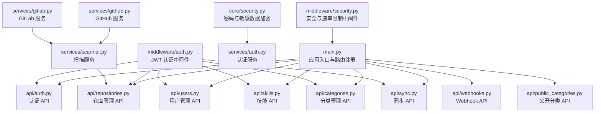
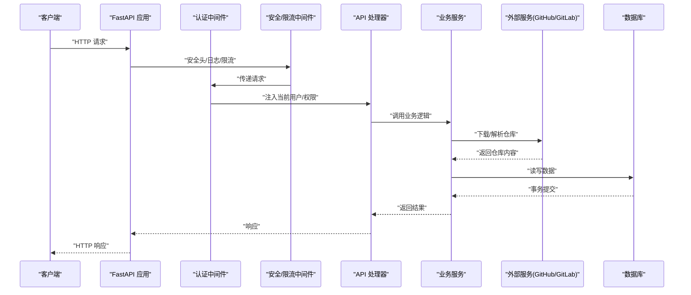
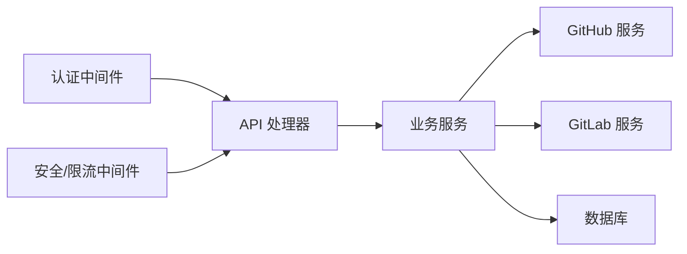

# API 接口文档

<cite>
**本文档引用的文件**
- [backend/main.py](file://backend/main.py)
- [backend/api/auth.py](file://backend/api/auth.py)
- [backend/api/users.py](file://backend/api/users.py)
- [backend/api/repositories.py](file://backend/api/repositories.py)
- [backend/api/skills.py](file://backend/api/skills.py)
- [backend/api/categories.py](file://backend/api/categories.py)
- [backend/api/sync.py](file://backend/api/sync.py)
- [backend/api/webhooks.py](file://backend/api/webhooks.py)
- [backend/api/public_categories.py](file://backend/api/public_categories.py)
- [backend/middleware/auth.py](file://backend/middleware/auth.py)
- [backend/middleware/security.py](file://backend/middleware/security.py)
- [backend/core/security.py](file://backend/core/security.py)
- [backend/services/auth.py](file://backend/services/auth.py)
- [backend/services/scanner.py](file://backend/services/scanner.py)
- [backend/services/github.py](file://backend/services/github.py)
- [backend/services/gitlab.py](file://backend/services/gitlab.py)
</cite>

## 目录
1. [简介](#简介)
2. [项目结构](#项目结构)
3. [核心组件](#核心组件)
4. [架构总览](#架构总览)
5. [详细组件分析](#详细组件分析)
6. [依赖关系分析](#依赖关系分析)
7. [性能考虑](#性能考虑)
8. [故障排除指南](#故障排除指南)
9. [结论](#结论)
10. [附录](#附录)

## 简介
本文件为 Skills Hub 平台的完整 API 接口文档，涵盖认证、用户管理、仓库管理、技能管理、分类管理、同步与 Webhook 等全部 RESTful 接口。文档提供每个接口的 HTTP 方法、URL 模式、请求参数、响应格式、状态码说明，并包含认证机制、权限要求、安全考虑、请求示例、响应示例、错误处理方案、版本管理、速率限制与性能优化建议，以及客户端集成指南与最佳实践。

## 项目结构
后端采用 FastAPI 构建，按功能模块划分 API 层、中间件层、服务层与核心安全模块。主应用负责注册路由、中间件与异常处理，并提供健康检查端点与 SPA 回退。

图表来源
- [backend/main.py](file://backend/main.py#L24-L84)
- [backend/api/auth.py](file://backend/api/auth.py#L21-L65)
- [backend/api/users.py](file://backend/api/users.py#L14-L111)
- [backend/api/repositories.py](file://backend/api/repositories.py#L23-L205)
- [backend/api/skills.py](file://backend/api/skills.py#L15-L160)
- [backend/api/categories.py](file://backend/api/categories.py#L21-L294)
- [backend/api/sync.py](file://backend/api/sync.py#L14-L112)
- [backend/api/webhooks.py](file://backend/api/webhooks.py#L12-L90)
- [backend/api/public_categories.py](file://backend/api/public_categories.py#L15-L129)
- [backend/middleware/auth.py](file://backend/middleware/auth.py#L48-L134)
- [backend/middleware/security.py](file://backend/middleware/security.py#L11-L142)
- [backend/core/security.py](file://backend/core/security.py#L12-L64)
- [backend/services/auth.py](file://backend/services/auth.py#L19-L130)
- [backend/services/scanner.py](file://backend/services/scanner.py#L21-L197)
- [backend/services/github.py](file://backend/services/github.py#L14-L105)
- [backend/services/gitlab.py](file://backend/services/gitlab.py#L15-L170)

章节来源
- [backend/main.py](file://backend/main.py#L24-L84)

## 核心组件
- 应用入口与路由注册：集中注册认证、用户、仓库、技能、分类、同步、Webhook 与公开分类等路由，并设置 CORS、安全头、日志与速率限制中间件。
- 认证中间件：基于 JWT 的 Bearer Token 认证，支持可选用户获取与管理员权限校验。
- 安全中间件：统一安全响应头、请求日志与简单内存速率限制。
- 加密模块：Argon2 密码哈希与 Fernet 敏感数据加密。
- 扫描服务：支持 GitHub/GitLab 仓库扫描、解析 SKILL.md 元数据并同步至数据库。

章节来源
- [backend/main.py](file://backend/main.py#L47-L84)
- [backend/middleware/auth.py](file://backend/middleware/auth.py#L48-L134)
- [backend/middleware/security.py](file://backend/middleware/security.py#L11-L142)
- [backend/core/security.py](file://backend/core/security.py#L12-L64)
- [backend/services/scanner.py](file://backend/services/scanner.py#L21-L197)

## 架构总览
下图展示客户端与后端各模块的交互流程，包括认证、权限控制、业务处理与外部服务调用。

图表来源
- [backend/main.py](file://backend/main.py#L65-L84)
- [backend/middleware/auth.py](file://backend/middleware/auth.py#L48-L134)
- [backend/middleware/security.py](file://backend/middleware/security.py#L11-L142)
- [backend/services/scanner.py](file://backend/services/scanner.py#L27-L197)
- [backend/services/github.py](file://backend/services/github.py#L36-L105)
- [backend/services/gitlab.py](file://backend/services/gitlab.py#L46-L170)

## 详细组件分析

### 认证 API
- 登录
  - 方法与路径：POST /api/auth/login
  - 认证：无
  - 请求体：用户名与密码
  - 成功响应：包含访问令牌与用户信息
  - 状态码：200 成功；401 未认证或密码错误；404 资源不存在
  - 示例请求：见 [backend/api/auth.py](file://backend/api/auth.py#L24-L40)
  - 示例响应：见 [backend/api/auth.py](file://backend/api/auth.py#L37-L40)
- 当前用户
  - 方法与路径：GET /api/auth/me
  - 认证：Bearer Token
  - 成功响应：当前用户信息
  - 状态码：200 成功；401 未认证；404 资源不存在
  - 示例请求：Authorization: Bearer <token>
  - 示例响应：见 [backend/api/auth.py](file://backend/api/auth.py#L43-L48)
- 修改密码
  - 方法与路径：POST /api/auth/change-password
  - 认证：Bearer Token
  - 请求体：旧密码与新密码
  - 成功响应：操作成功消息
  - 状态码：200 成功；400 参数错误；401 未认证
  - 示例请求：见 [backend/api/auth.py](file://backend/api/auth.py#L51-L64)

章节来源
- [backend/api/auth.py](file://backend/api/auth.py#L21-L65)
- [backend/middleware/auth.py](file://backend/middleware/auth.py#L48-L96)
- [backend/services/auth.py](file://backend/services/auth.py#L64-L98)

### 用户管理 API（管理员）
- 列表用户
  - 方法与路径：GET /api/admin/users
  - 认证：Bearer Token + 管理员
  - 成功响应：用户数组
  - 状态码：200 成功；401/403 权限不足
  - 示例请求：见 [backend/api/users.py](file://backend/api/users.py#L17-L25)
- 创建用户
  - 方法与路径：POST /api/admin/users
  - 认证：Bearer Token + 管理员
  - 请求体：用户名、邮箱、角色、密码
  - 成功响应：新建用户
  - 状态码：201 成功；400/409 冲突；401/403 权限不足
  - 示例请求：见 [backend/api/users.py](file://backend/api/users.py#L28-L36)
- 获取用户详情
  - 方法与路径：GET /api/admin/users/{user_id}
  - 认证：Bearer Token + 管理员
  - 成功响应：用户详情
  - 状态码：200 成功；404 不存在
  - 示例请求：见 [backend/api/users.py](file://backend/api/users.py#L39-L49)
- 更新用户
  - 方法与路径：PUT /api/admin/users/{user_id}
  - 认证：Bearer Token + 管理员
  - 请求体：可选邮箱、激活状态
  - 成功响应：更新后的用户
  - 状态码：200 成功；404 不存在
  - 示例请求：见 [backend/api/users.py](file://backend/api/users.py#L52-L71)
- 删除用户
  - 方法与路径：DELETE /api/admin/users/{user_id}
  - 认证：Bearer Token + 管理员
  - 成功响应：空（204）
  - 状态码：204 成功；400 不允许删除自己；404 不存在
  - 示例请求：见 [backend/api/users.py](file://backend/api/users.py#L74-L91)
- 重置密码
  - 方法与路径：POST /api/admin/users/{user_id}/reset-password
  - 认证：Bearer Token + 管理员
  - 请求体：新密码
  - 成功响应：操作成功消息
  - 状态码：200 成功；404 不存在
  - 示例请求：见 [backend/api/users.py](file://backend/api/users.py#L93-L106)

章节来源
- [backend/api/users.py](file://backend/api/users.py#L14-L111)
- [backend/middleware/auth.py](file://backend/middleware/auth.py#L98-L108)
- [backend/services/auth.py](file://backend/services/auth.py#L19-L63)

### 仓库管理 API（管理员）
- 列表仓库
  - 方法与路径：GET /api/admin/repositories
  - 认证：Bearer Token
  - 查询参数：无
  - 成功响应：仓库数组（含技能数量）
  - 状态码：200 成功
  - 示例请求：见 [backend/api/repositories.py](file://backend/api/repositories.py#L26-L46)
- 创建仓库
  - 方法与路径：POST /api/admin/repositories
  - 认证：Bearer Token
  - 请求体：类型、所有者、名称、分支、GitLab URL、访问令牌（可选）
  - 成功响应：新建仓库
  - 状态码：201 成功；409 已存在
  - 示例请求：见 [backend/api/repositories.py](file://backend/api/repositories.py#L49-L88)
- 获取仓库详情
  - 方法与路径：GET /api/admin/repositories/{repo_id}
  - 认证：Bearer Token
  - 成功响应：仓库详情（含技能数量）
  - 状态码：200 成功；404 不存在
  - 示例请求：见 [backend/api/repositories.py](file://backend/api/repositories.py#L91-L109)
- 更新仓库
  - 方法与路径：PUT /api/admin/repositories/{repo_id}
  - 认证：Bearer Token
  - 请求体：可选分支、启用状态、访问令牌
  - 成功响应：更新后的仓库
  - 状态码：200 成功；404 不存在
  - 示例请求：见 [backend/api/repositories.py](file://backend/api/repositories.py#L112-L143)
- 删除仓库
  - 方法与路径：DELETE /api/admin/repositories/{repo_id}
  - 认证：Bearer Token
  - 成功响应：空（204）
  - 状态码：204 成功；404 不存在
  - 示例请求：见 [backend/api/repositories.py](file://backend/api/repositories.py#L146-L158)
- 手动同步仓库
  - 方法与路径：POST /api/admin/repositories/{repo_id}/sync
  - 认证：Bearer Token
  - 成功响应：同步统计
  - 状态码：200 成功；404 不存在
  - 示例请求：见 [backend/api/repositories.py](file://backend/api/repositories.py#L161-L176)
- 配置 Webhook
  - 方法与路径：POST /api/admin/repositories/{repo_id}/webhook
  - 认证：Bearer Token
  - 请求体：启用开关与签名密钥（可选）
  - 成功响应：配置结果
  - 状态码：200 成功；404 不存在
  - 示例请求：见 [backend/api/repositories.py](file://backend/api/repositories.py#L179-L204)

章节来源
- [backend/api/repositories.py](file://backend/api/repositories.py#L23-L205)
- [backend/services/scanner.py](file://backend/services/scanner.py#L70-L156)
- [backend/core/security.py](file://backend/core/security.py#L31-L54)

### 技能 API（公开）
- 搜索/浏览技能
  - 方法与路径：GET /api/skills
  - 认证：可选 Bearer Token
  - 查询参数：keyword、category_id、repository_id、page、page_size、sort_by、sort_order
  - 成功响应：分页结果（包含总数、页码、每页数量与技能列表）
  - 状态码：200 成功
  - 示例请求：见 [backend/api/skills.py](file://backend/api/skills.py#L18-L95)
- 获取技能详情
  - 方法与路径：GET /api/skills/{skill_id}
  - 认证：可选 Bearer Token
  - 成功响应：技能详情
  - 状态码：200 成功；404 不存在
  - 示例请求：见 [backend/api/skills.py](file://backend/api/skills.py#L98-L120)
- 增加浏览计数
  - 方法与路径：POST /api/skills/{skill_id}/view
  - 认证：无
  - 成功响应：当前浏览数
  - 状态码：200 成功
  - 示例请求：见 [backend/api/skills.py](file://backend/api/skills.py#L123-L134)
- 获取待分配分类的技能
  - 方法与路径：GET /api/skills/sync/pending
  - 认证：可选 Bearer Token
  - 成功响应：待分配技能列表
  - 状态码：200 成功
  - 示例请求：见 [backend/api/skills.py](file://backend/api/skills.py#L137-L159)

章节来源
- [backend/api/skills.py](file://backend/api/skills.py#L15-L160)
- [backend/middleware/auth.py](file://backend/middleware/auth.py#L112-L133)

### 分类管理 API（管理员）
- 获取分类树
  - 方法与路径：GET /api/admin/categories/tree
  - 认证：Bearer Token
  - 成功响应：分类树（含子节点与技能数量）
  - 状态码：200 成功
  - 示例请求：见 [backend/api/categories.py](file://backend/api/categories.py#L24-L47)
- 列表分类
  - 方法与路径：GET /api/admin/categories
  - 认证：Bearer Token
  - 成功响应：平铺分类列表（含技能数量）
  - 状态码：200 成功
  - 示例请求：见 [backend/api/categories.py](file://backend/api/categories.py#L50-L77)
- 创建分类
  - 方法与路径：POST /api/admin/categories
  - 认证：Bearer Token
  - 请求体：父级 ID、名称、slug、描述、图标、排序
  - 成功响应：新建分类
  - 状态码：201 成功；409 冲突（slug 已存在）
  - 示例请求：见 [backend/api/categories.py](file://backend/api/categories.py#L80-L120)
- 获取分类详情
  - 方法与路径：GET /api/admin/categories/{category_id}
  - 认证：Bearer Token
  - 成功响应：分类详情
  - 状态码：200 成功；404 不存在
  - 示例请求：见 [backend/api/categories.py](file://backend/api/categories.py#L123-L150)
- 更新分类
  - 方法与路径：PUT /api/admin/categories/{category_id}
  - 认证：Bearer Token
  - 请求体：可选父级 ID、名称、slug、描述、图标、排序
  - 成功响应：更新后的分类
  - 状态码：200 成功；400/404 错误
  - 示例请求：见 [backend/api/categories.py](file://backend/api/categories.py#L153-L199)
- 删除分类
  - 方法与路径：DELETE /api/admin/categories/{category_id}
  - 认证：Bearer Token
  - 成功响应：空（204）
  - 状态码：204 成功；404 不存在
  - 示例请求：见 [backend/api/categories.py](file://backend/api/categories.py#L202-L214)
- 将技能分配到分类
  - 方法与路径：POST /api/admin/categories/{category_id}/skills/{skill_id}
  - 认证：Bearer Token
  - 成功响应：操作成功消息
  - 状态码：200 成功；404 不存在
  - 示例请求：见 [backend/api/categories.py](file://backend/api/categories.py#L217-L237)
- 从分类移除技能
  - 方法与路径：DELETE /api/admin/categories/{category_id}/skills/{skill_id}
  - 认证：Bearer Token
  - 成功响应：操作成功消息
  - 状态码：200 成功；404 不存在
  - 示例请求：见 [backend/api/categories.py](file://backend/api/categories.py#L240-L260)
- 为技能分配多个分类
  - 方法与路径：POST /api/admin/categories/skills/{skill_id}/categories
  - 认证：Bearer Token
  - 请求体：分类 ID 数组
  - 成功响应：分配结果消息
  - 状态码：200 成功；404 不存在
  - 示例请求：见 [backend/api/categories.py](file://backend/api/categories.py#L263-L293)

章节来源
- [backend/api/categories.py](file://backend/api/categories.py#L21-L294)
- [backend/middleware/auth.py](file://backend/middleware/auth.py#L98-L108)

### 同步 API（管理员）
- 手动同步单个仓库
  - 方法与路径：POST /api/admin/sync/{repo_id}
  - 认证：Bearer Token
  - 成功响应：同步统计
  - 状态码：200 成功；404 不存在
  - 示例请求：见 [backend/api/sync.py](file://backend/api/sync.py#L17-L32)
- 同步所有启用的仓库
  - 方法与路径：POST /api/admin/sync/all
  - 认证：Bearer Token
  - 成功响应：各仓库同步结果汇总
  - 状态码：200 成功
  - 示例请求：见 [backend/api/sync.py](file://backend/api/sync.py#L35-L71)
- 获取同步状态
  - 方法与路径：GET /api/admin/sync/status
  - 认证：Bearer Token
  - 成功响应：仓库总数、已同步数量与最近同步列表
  - 状态码：200 成功
  - 示例请求：见 [backend/api/sync.py](file://backend/api/sync.py#L74-L111)

章节来源
- [backend/api/sync.py](file://backend/api/sync.py#L14-L112)
- [backend/services/scanner.py](file://backend/services/scanner.py#L70-L156)

### Webhook API
- GitLab Webhook 接收
  - 方法与路径：POST /webhooks/gitlab/{repo_id}
  - 认证：仓库配置的签名验证
  - 请求头：X-Gitlab-Token（签名）、X-Gitlab-Event（事件类型）
  - 成功响应：接收确认
  - 状态码：202 接受；400 无效 JSON；403 签名无效；404 仓库不存在
  - 示例请求：见 [backend/api/webhooks.py](file://backend/api/webhooks.py#L15-L64)
- 获取 Webhook 日志
  - 方法与路径：GET /webhooks/logs
  - 认证：Bearer Token
  - 查询参数：repo_id（可选）、limit（默认 100）
  - 成功响应：日志条目数组
  - 状态码：200 成功
  - 示例请求：见 [backend/api/webhooks.py](file://backend/api/webhooks.py#L67-L89)

章节来源
- [backend/api/webhooks.py](file://backend/api/webhooks.py#L12-L90)
- [backend/services/webhook.py](file://backend/services/webhook.py)

### 公开分类 API（无需认证）
- 列表分类
  - 方法与路径：GET /api/categories
  - 认证：无需
  - 成功响应：分类列表
  - 状态码：200 成功
  - 示例请求：见 [backend/api/public_categories.py](file://backend/api/public_categories.py#L18-L44)
- 获取分类树
  - 方法与路径：GET /api/categories/tree
  - 认证：无需
  - 成功响应：分类树
  - 状态码：200 成功
  - 示例请求：见 [backend/api/public_categories.py](file://backend/api/public_categories.py#L47-L69)
- 获取分类详情
  - 方法与路径：GET /api/categories/{category_id}
  - 认证：无需
  - 成功响应：分类详情
  - 状态码：200 成功；404 不存在
  - 示例请求：见 [backend/api/public_categories.py](file://backend/api/public_categories.py#L72-L100)
- 获取分类下的技能
  - 方法与路径：GET /api/categories/{slug}/skills
  - 认证：无需
  - 成功响应：技能列表
  - 状态码：200 成功；404 不存在
  - 示例请求：见 [backend/api/public_categories.py](file://backend/api/public_categories.py#L103-L128)

章节来源
- [backend/api/public_categories.py](file://backend/api/public_categories.py#L15-L129)

## 依赖关系分析
- 认证链路：客户端携带 Bearer Token → 认证中间件解码与校验 → 注入当前用户对象 → 控制器处理业务 → 服务层执行具体逻辑。
- 安全链路：安全中间件统一添加安全响应头与移除服务器标识 → 日志中间件记录请求/响应 → 限流中间件对特定路径进行速率限制。
- 扫描链路：仓库管理/同步 API 调用扫描服务 → 根据仓库类型选择 GitHub/GitLab 服务 → 下载归档并解析 SKILL.md → 更新数据库。

图表来源
- [backend/middleware/auth.py](file://backend/middleware/auth.py#L48-L134)
- [backend/middleware/security.py](file://backend/middleware/security.py#L11-L142)
- [backend/services/scanner.py](file://backend/services/scanner.py#L27-L197)
- [backend/services/github.py](file://backend/services/github.py#L14-L105)
- [backend/services/gitlab.py](file://backend/services/gitlab.py#L15-L170)

## 性能考虑
- 数据库查询优化
  - 使用 selectinload 预加载关联数据，减少 N+1 查询问题。
  - 对常用查询（如技能列表、仓库详情）建立索引与分页策略。
- 缓存与异步
  - 对热门分类树与技能列表可引入缓存中间件（建议）。
  - Webhook 与同步操作使用后台任务，避免阻塞请求。
- 外部服务调用
  - 设置合理的超时与重试策略，避免长时间阻塞。
  - GitHub/GitLab 归档下载失败时进行降级处理（如 ZIP 失败尝试 tar.gz）。
- 速率限制
  - 默认对登录接口进行限流，可根据部署环境扩展到更多端点。
- 前端集成
  - 使用分页与懒加载，避免一次性加载大量数据。
  - 对搜索关键词进行防抖与去重。

## 故障排除指南
- 认证失败
  - 现象：401 未认证或令牌过期
  - 处理：重新登录获取新令牌；检查令牌有效期与算法配置
  - 参考：[backend/middleware/auth.py](file://backend/middleware/auth.py#L56-L95)
- 权限不足
  - 现象：403 禁止访问
  - 处理：确认用户角色为管理员；检查 require_admin 依赖
  - 参考：[backend/middleware/auth.py](file://backend/middleware/auth.py#L98-L108)
- 资源不存在
  - 现象：404 未找到
  - 处理：核对资源 ID 或 slug；检查数据库一致性
  - 参考：各 API 的 NotFoundError 抛出位置
- 速率限制
  - 现象：429 太多请求
  - 处理：降低请求频率；扩展限流窗口或阈值
  - 参考：[backend/middleware/security.py](file://backend/middleware/security.py#L115-L139)
- 外部服务错误
  - 现象：下载失败或解析异常
  - 处理：检查仓库访问令牌、网络连通性与归档格式
  - 参考：[backend/services/github.py](file://backend/services/github.py#L73-L97), [backend/services/gitlab.py](file://backend/services/gitlab.py#L86-L141)

章节来源
- [backend/middleware/auth.py](file://backend/middleware/auth.py#L56-L108)
- [backend/middleware/security.py](file://backend/middleware/security.py#L115-L139)
- [backend/services/github.py](file://backend/services/github.py#L73-L97)
- [backend/services/gitlab.py](file://backend/services/gitlab.py#L86-L141)

## 结论
本 API 文档覆盖了 Skills Hub 的全部核心接口，明确了认证与权限模型、安全与性能策略，并提供了集成与排错指导。建议在生产环境中完善环境变量配置（如密钥、限流规则）、接入更严格的鉴权与审计日志，并结合监控指标持续优化性能与稳定性。

## 附录

### 认证机制与权限
- 令牌类型：Bearer JWT
- 令牌生成：登录成功后返回 access_token
- 令牌校验：认证中间件解码并验证用户状态
- 管理员权限：require_admin 依赖注入，仅管理员可访问管理端点
- 可选认证：公开接口支持 get_optional_user，允许匿名访问

章节来源
- [backend/middleware/auth.py](file://backend/middleware/auth.py#L25-L134)

### 安全考虑
- 安全响应头：X-Content-Type-Options、X-Frame-Options、X-XSS-Protection、Strict-Transport-Security、Content-Security-Policy
- 速率限制：针对 /api/auth/login 进行限流
- 敏感数据：访问令牌与 Webhook 密钥使用 Fernet 加密存储
- 外部服务：统一异常处理与日志记录

章节来源
- [backend/middleware/security.py](file://backend/middleware/security.py#L11-L142)
- [backend/core/security.py](file://backend/core/security.py#L31-L54)

### API 版本管理
- 应用版本：1.0.0（通过 FastAPI 应用配置）
- 建议：未来可通过路径前缀或 Accept 头实现多版本共存

章节来源
- [backend/main.py](file://backend/main.py#L47-L54)

### 速率限制与性能优化建议
- 限流策略：登录接口 5 次/分钟；可扩展到其他敏感端点
- 异步处理：Webhook 与同步使用后台任务
- 缓存：热门数据可引入缓存中间件
- 超时与重试：外部服务调用设置合理超时与重试

章节来源
- [backend/middleware/security.py](file://backend/middleware/security.py#L111-L139)
- [backend/services/scanner.py](file://backend/services/scanner.py#L158-L181)

### 客户端集成指南与最佳实践
- 认证流程
  - 登录获取 access_token，后续请求在 Authorization 头中携带 Bearer Token
  - 处理 401/403 场景，自动跳转登录或提示权限不足
- 错误处理
  - 统一捕获 4xx/5xx 并提示用户
  - 对 429 进行退避重试
- 性能优化
  - 使用分页与懒加载
  - 对搜索输入进行防抖
  - 缓存公开数据（如分类树）