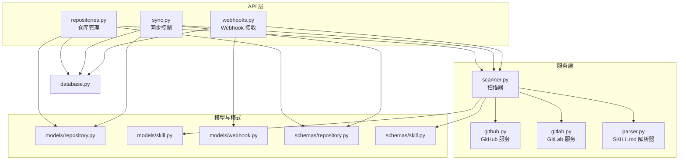
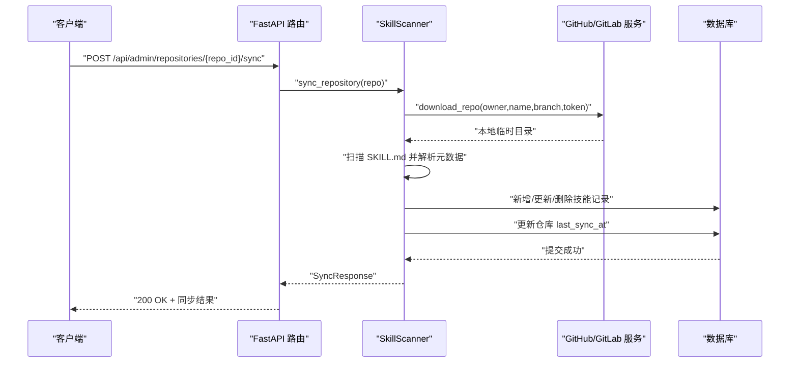
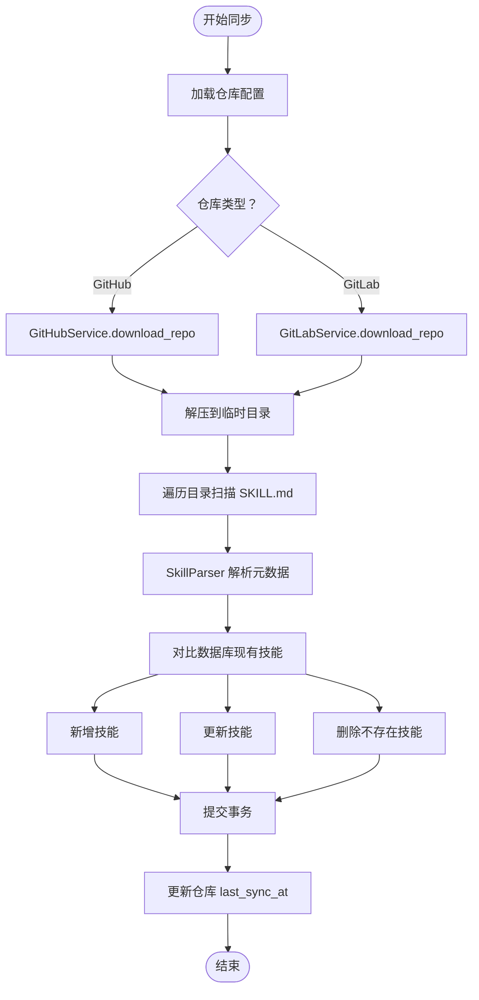
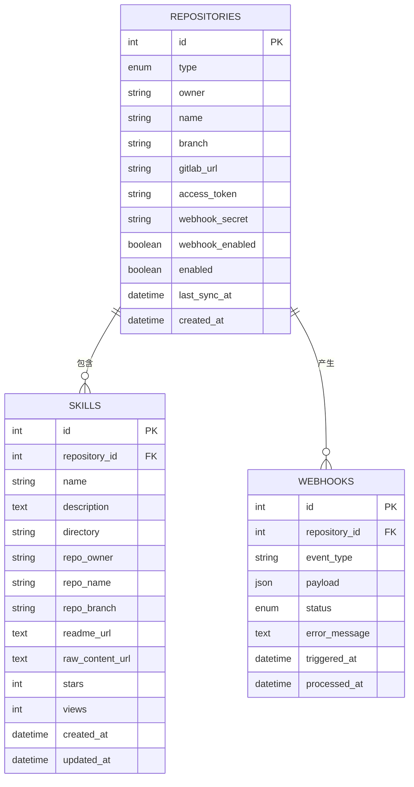
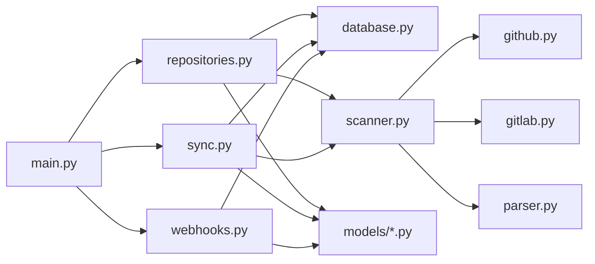

# 仓库管理 API

<cite>
**本文引用的文件**
- [backend/main.py](file://backend/main.py)
- [backend/api/repositories.py](file://backend/api/repositories.py)
- [backend/api/sync.py](file://backend/api/sync.py)
- [backend/api/webhooks.py](file://backend/api/webhooks.py)
- [backend/models/repository.py](file://backend/models/repository.py)
- [backend/models/skill.py](file://backend/models/skill.py)
- [backend/models/webhook.py](file://backend/models/webhook.py)
- [backend/schemas/repository.py](file://backend/schemas/repository.py)
- [backend/schemas/skill.py](file://backend/schemas/skill.py)
- [backend/services/scanner.py](file://backend/services/scanner.py)
- [backend/services/github.py](file://backend/services/github.py)
- [backend/services/gitlab.py](file://backend/services/gitlab.py)
- [backend/services/parser.py](file://backend/services/parser.py)
- [backend/core/exceptions.py](file://backend/core/exceptions.py)
- [backend/database.py](file://backend/database.py)
</cite>

## 目录
1. [简介](#简介)
2. [项目结构](#项目结构)
3. [核心组件](#核心组件)
4. [架构总览](#架构总览)
5. [详细组件分析](#详细组件分析)
6. [依赖分析](#依赖分析)
7. [性能考虑](#性能考虑)
8. [故障排查指南](#故障排查指南)
9. [结论](#结论)
10. [附录](#附录)

## 简介
本文件为“仓库管理 API”的权威技术文档，涵盖仓库配置、仓库同步、仓库状态查询、Webhook 集成与内容同步流程。文档面向后端开发者与运维人员，提供端点规范、请求/响应格式、数据模型、同步机制、错误处理与性能优化建议。

## 项目结构
后端采用 FastAPI + SQLAlchemy Async 架构，API 路由按功能模块划分，服务层负责与外部仓库（GitHub/GitLab）交互，扫描器负责解析 SKILL.md 并同步技能数据，Webhook 提供事件驱动的增量同步能力。

图表来源
- [backend/api/repositories.py](file://backend/api/repositories.py#L1-L205)
- [backend/api/sync.py](file://backend/api/sync.py#L1-L112)
- [backend/api/webhooks.py](file://backend/api/webhooks.py#L1-L90)
- [backend/services/scanner.py](file://backend/services/scanner.py#L1-L197)
- [backend/services/github.py](file://backend/services/github.py#L1-L105)
- [backend/services/gitlab.py](file://backend/services/gitlab.py#L1-L170)
- [backend/services/parser.py](file://backend/services/parser.py#L1-L86)
- [backend/models/repository.py](file://backend/models/repository.py#L1-L74)
- [backend/models/skill.py](file://backend/models/skill.py#L1-L90)
- [backend/models/webhook.py](file://backend/models/webhook.py#L1-L49)
- [backend/schemas/repository.py](file://backend/schemas/repository.py#L1-L73)
- [backend/schemas/skill.py](file://backend/schemas/skill.py#L1-L60)
- [backend/database.py](file://backend/database.py#L1-L75)

章节来源
- [backend/main.py](file://backend/main.py#L1-L137)
- [backend/api/repositories.py](file://backend/api/repositories.py#L1-L205)
- [backend/api/sync.py](file://backend/api/sync.py#L1-L112)
- [backend/api/webhooks.py](file://backend/api/webhooks.py#L1-L90)

## 核心组件
- 仓库管理 API：提供仓库的增删改查、手动同步、Webhook 配置。
- 同步 API：提供单仓库与全量同步，以及同步状态查询。
- Webhook API：接收 GitLab Push 事件，触发异步同步。
- 扫描器：下载仓库、扫描 SKILL.md、生成技能元数据并更新数据库。
- GitHub/GitLab 服务：封装归档下载、URL 构造与鉴权头。
- 数据模型与模式：定义仓库、技能、Webhook 日志的数据结构与校验规则。

章节来源
- [backend/models/repository.py](file://backend/models/repository.py#L1-L74)
- [backend/models/skill.py](file://backend/models/skill.py#L1-L90)
- [backend/models/webhook.py](file://backend/models/webhook.py#L1-L49)
- [backend/schemas/repository.py](file://backend/schemas/repository.py#L1-L73)
- [backend/schemas/skill.py](file://backend/schemas/skill.py#L1-L60)
- [backend/services/scanner.py](file://backend/services/scanner.py#L1-L197)
- [backend/services/github.py](file://backend/services/github.py#L1-L105)
- [backend/services/gitlab.py](file://backend/services/gitlab.py#L1-L170)

## 架构总览
系统通过 FastAPI 路由暴露 REST 接口，依赖注入数据库会话；扫描器根据仓库类型调用对应外部服务下载归档并解析 SKILL.md；Webhook 接收外部推送事件，异步触发同步流程。

图表来源
- [backend/api/repositories.py](file://backend/api/repositories.py#L161-L176)
- [backend/services/scanner.py](file://backend/services/scanner.py#L70-L156)
- [backend/services/github.py](file://backend/services/github.py#L36-L102)
- [backend/services/gitlab.py](file://backend/services/gitlab.py#L46-L165)

## 详细组件分析

### 仓库管理 API
- 路由前缀：/api/admin/repositories
- 认证：管理员用户（依赖注入当前用户）
- 数据库：AsyncSession（依赖注入）

端点一览
- GET /api/admin/repositories
  - 功能：获取仓库列表（含技能数量）
  - 响应：数组，元素为仓库响应模式
  - 关键字段：技能计数、是否启用、上次同步时间
  - 参考路径：[backend/api/repositories.py](file://backend/api/repositories.py#L26-L46)

- POST /api/admin/repositories
  - 功能：创建新仓库
  - 请求体：仓库创建模式（含类型、所有者、名称、分支、可选 GitLab URL 与访问令牌）
  - 响应：仓库响应模式
  - 行为：重复检测、访问令牌加密存储
  - 参考路径：[backend/api/repositories.py](file://backend/api/repositories.py#L49-L88)

- GET /api/admin/repositories/{repo_id}
  - 功能：获取仓库详情（含技能数量）
  - 响应：仓库响应模式
  - 参考路径：[backend/api/repositories.py](file://backend/api/repositories.py#L91-L109)

- PUT /api/admin/repositories/{repo_id}
  - 功能：更新仓库配置（分支、启用状态、访问令牌、Webhook 密钥）
  - 请求体：仓库更新模式
  - 响应：仓库响应模式
  - 参考路径：[backend/api/repositories.py](file://backend/api/repositories.py#L112-L143)

- DELETE /api/admin/repositories/{repo_id}
  - 功能：删除仓库
  - 响应：204 No Content
  - 参考路径：[backend/api/repositories.py](file://backend/api/repositories.py#L146-L158)

- POST /api/admin/repositories/{repo_id}/sync
  - 功能：手动触发仓库同步
  - 响应：同步结果模式（状态、新增/更新/移除数量、消息）
  - 参考路径：[backend/api/repositories.py](file://backend/api/repositories.py#L161-L176)

- POST /api/admin/repositories/{repo_id}/webhook
  - 功能：配置 Webhook（开启/关闭、可选密钥）
  - 请求体：Webhook 配置模式
  - 响应：操作结果（消息与启用状态）
  - 参考路径：[backend/api/repositories.py](file://backend/api/repositories.py#L179-L204)

数据模型与模式
- 仓库模型（部分字段）：类型、所有者、名称、分支、GitLab URL、启用状态、Webhook 开关与密钥、最后同步时间、创建时间
- 仓库响应模式：包含技能计数、是否拥有令牌/密钥等只读标记
- Webhook 配置模式：启用开关与可选密钥
- 同步结果模式：状态码、新增/更新/移除/未变更数量、消息

章节来源
- [backend/api/repositories.py](file://backend/api/repositories.py#L1-L205)
- [backend/models/repository.py](file://backend/models/repository.py#L1-L74)
- [backend/schemas/repository.py](file://backend/schemas/repository.py#L1-L73)

### 同步 API
- 路由前缀：/api/admin/sync
- 认证：管理员用户

端点一览
- POST /api/admin/sync/{repo_id}
  - 功能：手动同步单个仓库
  - 响应：同步结果模式
  - 参考路径：[backend/api/sync.py](file://backend/api/sync.py#L17-L32)

- POST /api/admin/sync/all
  - 功能：同步所有启用的仓库（逐个执行，异常不影响整体）
  - 响应：包含总数与每项结果（成功/失败、错误信息）
  - 参考路径：[backend/api/sync.py](file://backend/api/sync.py#L35-L71)

- GET /api/admin/sync/status
  - 功能：获取同步状态概览（总数、已同步数、最近同步列表）
  - 响应：状态统计与最近记录
  - 参考路径：[backend/api/sync.py](file://backend/api/sync.py#L74-L111)

章节来源
- [backend/api/sync.py](file://backend/api/sync.py#L1-L112)

### Webhook API
- 路由前缀：/webhooks
- 认证：无（公开端点，但需正确签名）

端点一览
- POST /webhooks/gitlab/{repo_id}
  - 功能：接收 GitLab Push 事件
  - 安全：校验 X-Gitlab-Token 与仓库配置的密钥
  - 行为：异步处理（后台任务），仅在事件类型为 Push Hook 时触发
  - 响应：接受确认
  - 参考路径：[backend/api/webhooks.py](file://backend/api/webhooks.py#L15-L64)

- GET /webhooks/logs
  - 功能：获取 Webhook 日志（可按仓库过滤）
  - 响应：日志条目列表（含事件类型、状态、时间戳等）
  - 参考路径：[backend/api/webhooks.py](file://backend/api/webhooks.py#L67-L89)

数据模型
- Webhook 日志模型：事件类型、状态枚举（待处理/处理中/成功/失败）、错误信息、触发与处理时间、精简 payload 标记

章节来源
- [backend/api/webhooks.py](file://backend/api/webhooks.py#L1-L90)
- [backend/models/webhook.py](file://backend/models/webhook.py#L1-L49)

### 同步机制与数据流
- 扫描器职责
  - 下载仓库归档（GitHub 使用归档 ZIP，GitLab 优先 ZIP，失败回退 tar.gz）
  - 遍历目录，识别包含 SKILL.md 的技能目录
  - 解析 SKILL.md Front Matter，生成技能元数据
  - 与数据库现有技能对比，执行新增、更新、删除
  - 更新仓库 last_sync_at
- 外部服务
  - GitHubService：归档 URL、原始文件 URL、README URL 构造与下载
  - GitLabService：归档 URL（ZIP/tar.gz）、原始文件 URL、README URL 构造与下载
- 解析器
  - SkillParser：提取 YAML Front Matter，兼容缺失或无效内容

图表来源
- [backend/services/scanner.py](file://backend/services/scanner.py#L27-L156)
- [backend/services/github.py](file://backend/services/github.py#L36-L102)
- [backend/services/gitlab.py](file://backend/services/gitlab.py#L46-L165)
- [backend/services/parser.py](file://backend/services/parser.py#L18-L70)

章节来源
- [backend/services/scanner.py](file://backend/services/scanner.py#L1-L197)
- [backend/services/github.py](file://backend/services/github.py#L1-L105)
- [backend/services/gitlab.py](file://backend/services/gitlab.py#L1-L170)
- [backend/services/parser.py](file://backend/services/parser.py#L1-L86)

### 数据模型与关系

图表来源
- [backend/models/repository.py](file://backend/models/repository.py#L18-L74)
- [backend/models/skill.py](file://backend/models/skill.py#L11-L90)
- [backend/models/webhook.py](file://backend/models/webhook.py#L19-L49)

章节来源
- [backend/models/repository.py](file://backend/models/repository.py#L1-L74)
- [backend/models/skill.py](file://backend/models/skill.py#L1-L90)
- [backend/models/webhook.py](file://backend/models/webhook.py#L1-L49)

## 依赖分析
- 路由注册：主程序在启动时注册所有 API 路由（包括仓库、同步、Webhook）。
- 依赖注入：数据库会话工厂提供异步会话，确保并发安全与事务一致性。
- 错误处理：统一异常体系，外部服务错误映射为 502，便于前端区分。
- 外部服务：GitHub/GitLab 服务封装网络请求与归档下载，屏蔽差异。

图表来源
- [backend/main.py](file://backend/main.py#L24-L84)
- [backend/database.py](file://backend/database.py#L42-L55)
- [backend/api/repositories.py](file://backend/api/repositories.py#L1-L205)
- [backend/api/sync.py](file://backend/api/sync.py#L1-L112)
- [backend/api/webhooks.py](file://backend/api/webhooks.py#L1-L90)
- [backend/services/scanner.py](file://backend/services/scanner.py#L1-L197)

章节来源
- [backend/main.py](file://backend/main.py#L1-L137)
- [backend/database.py](file://backend/database.py#L1-L75)
- [backend/core/exceptions.py](file://backend/core/exceptions.py#L1-L101)

## 性能考虑
- 异步 I/O：数据库与外部服务均采用异步实现，提升并发吞吐。
- 连接池：数据库连接池配置合理，避免频繁建立/销毁连接。
- 归档下载：优先 ZIP（若可用），失败回退 tar.gz，减少失败重试成本。
- 批量同步：全量同步逐个仓库执行，避免阻塞；建议在低峰期运行。
- 缓存策略：当前未见缓存实现，可在前端或网关层引入短期缓存以降低重复查询压力。
- 资源清理：下载完成后及时删除临时文件，避免磁盘占用。

## 故障排查指南
常见错误与定位
- 404 未找到仓库
  - 触发场景：仓库 ID 不存在
  - 定位方法：核对仓库 ID 与数据库记录
  - 参考路径：[backend/api/repositories.py](file://backend/api/repositories.py#L104-L105)、[backend/api/sync.py](file://backend/api/sync.py#L26-L27)

- 409 冲突
  - 触发场景：重复创建相同 owner/name/branch 的仓库
  - 定位方法：检查重复组合
  - 参考路径：[backend/api/repositories.py](file://backend/api/repositories.py#L64-L68)

- 502 外部服务错误
  - 触发场景：GitHub/GitLab 下载失败或归档无效
  - 定位方法：查看外部服务日志与状态码
  - 参考路径：[backend/services/github.py](file://backend/services/github.py#L73-L74)、[backend/services/gitlab.py](file://backend/services/gitlab.py#L86-L91)

- Webhook 签名校验失败
  - 触发场景：X-Gitlab-Token 与仓库配置不一致
  - 定位方法：核对 GitLab 项目设置与仓库配置的密钥
  - 参考路径：[backend/api/webhooks.py](file://backend/api/webhooks.py#L38-L41)

- 同步失败但未中断
  - 触发场景：全量同步中某仓库异常
  - 定位方法：查看 /api/admin/sync/all 返回的单项错误
  - 参考路径：[backend/api/sync.py](file://backend/api/sync.py#L60-L66)

章节来源
- [backend/core/exceptions.py](file://backend/core/exceptions.py#L1-L101)
- [backend/api/webhooks.py](file://backend/api/webhooks.py#L1-L90)
- [backend/api/sync.py](file://backend/api/sync.py#L1-L112)

## 结论
该仓库管理 API 以清晰的模块化设计实现了从仓库配置、手动/自动同步到状态监控的完整闭环。通过 GitHub/GitLab 服务抽象与 SKILL.md 解析器，系统能够稳定地从外部仓库抽取技能元数据并持久化。建议在生产环境中强化 Webhook 签名与限流、优化归档下载策略，并结合缓存与异步队列进一步提升性能与可靠性。

## 附录

### 端点清单与示例

- 仓库列表
  - 方法：GET
  - 路径：/api/admin/repositories
  - 响应：数组，元素包含仓库基本信息与技能计数
  - 示例参考：[backend/api/repositories.py](file://backend/api/repositories.py#L26-L46)

- 创建仓库
  - 方法：POST
  - 路径：/api/admin/repositories
  - 请求体：仓库创建模式（类型、所有者、名称、分支、可选 GitLab URL、可选访问令牌）
  - 响应：仓库响应模式
  - 示例参考：[backend/api/repositories.py](file://backend/api/repositories.py#L49-L88)

- 获取仓库详情
  - 方法：GET
  - 路径：/api/admin/repositories/{repo_id}
  - 响应：仓库响应模式
  - 示例参考：[backend/api/repositories.py](file://backend/api/repositories.py#L91-L109)

- 更新仓库
  - 方法：PUT
  - 路径：/api/admin/repositories/{repo_id}
  - 请求体：仓库更新模式（分支、启用状态、访问令牌、Webhook 密钥、开关）
  - 响应：仓库响应模式
  - 示例参考：[backend/api/repositories.py](file://backend/api/repositories.py#L112-L143)

- 删除仓库
  - 方法：DELETE
  - 路径：/api/admin/repositories/{repo_id}
  - 响应：204 No Content
  - 示例参考：[backend/api/repositories.py](file://backend/api/repositories.py#L146-L158)

- 手动同步仓库
  - 方法：POST
  - 路径：/api/admin/repositories/{repo_id}/sync
  - 响应：同步结果模式（状态、新增/更新/移除数量、消息）
  - 示例参考：[backend/api/repositories.py](file://backend/api/repositories.py#L161-L176)

- 配置 Webhook
  - 方法：POST
  - 路径：/api/admin/repositories/{repo_id}/webhook
  - 请求体：Webhook 配置模式（启用开关、可选密钥）
  - 响应：操作结果（消息与启用状态）
  - 示例参考：[backend/api/repositories.py](file://backend/api/repositories.py#L179-L204)

- 同步单个仓库
  - 方法：POST
  - 路径：/api/admin/sync/{repo_id}
  - 响应：同步结果模式
  - 示例参考：[backend/api/sync.py](file://backend/api/sync.py#L17-L32)

- 同步全部仓库
  - 方法：POST
  - 路径：/api/admin/sync/all
  - 响应：包含总数与每项结果（成功/失败、错误信息）
  - 示例参考：[backend/api/sync.py](file://backend/api/sync.py#L35-L71)

- 同步状态
  - 方法：GET
  - 路径：/api/admin/sync/status
  - 响应：状态统计与最近记录
  - 示例参考：[backend/api/sync.py](file://backend/api/sync.py#L74-L111)

- 接收 GitLab Webhook
  - 方法：POST
  - 路径：/webhooks/gitlab/{repo_id}
  - 请求头：X-Gitlab-Token（与仓库配置密钥一致）、X-Gitlab-Event（Push Hook）
  - 响应：接受确认
  - 示例参考：[backend/api/webhooks.py](file://backend/api/webhooks.py#L15-L64)

- 获取 Webhook 日志
  - 方法：GET
  - 路径：/webhooks/logs
  - 查询参数：repo_id（可选）、limit（默认 100）
  - 响应：日志条目列表
  - 示例参考：[backend/api/webhooks.py](file://backend/api/webhooks.py#L67-L89)

### 数据模型要点
- 仓库模型
  - 字段：类型、所有者、名称、分支、GitLab URL、启用状态、Webhook 开关与密钥、最后同步时间、创建时间
  - 只读字段：技能计数、是否拥有令牌/密钥
  - 参考路径：[backend/models/repository.py](file://backend/models/repository.py#L18-L74)、[backend/schemas/repository.py](file://backend/schemas/repository.py#L44-L54)

- 技能模型
  - 字段：仓库关联、名称、描述、目录、仓库上下文、URL、统计（星标/浏览）、时间戳
  - 参考路径：[backend/models/skill.py](file://backend/models/skill.py#L11-L90)、[backend/schemas/skill.py](file://backend/schemas/skill.py#L13-L28)

- Webhook 日志模型
  - 字段：仓库关联、事件类型、状态枚举、错误信息、触发与处理时间、payload 标记
  - 参考路径：[backend/models/webhook.py](file://backend/models/webhook.py#L19-L49)