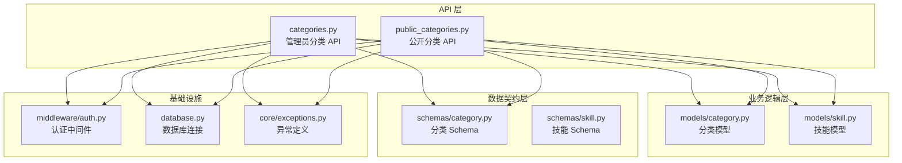
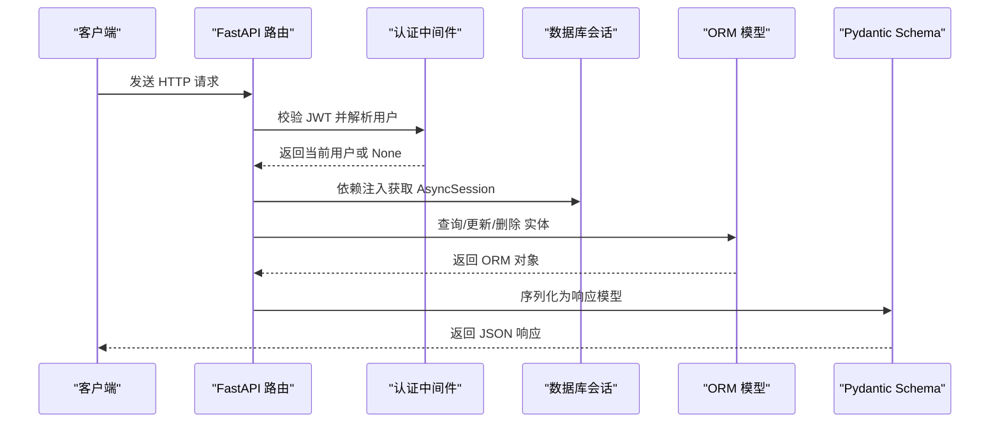
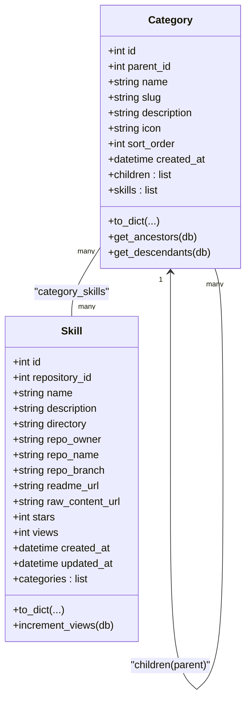
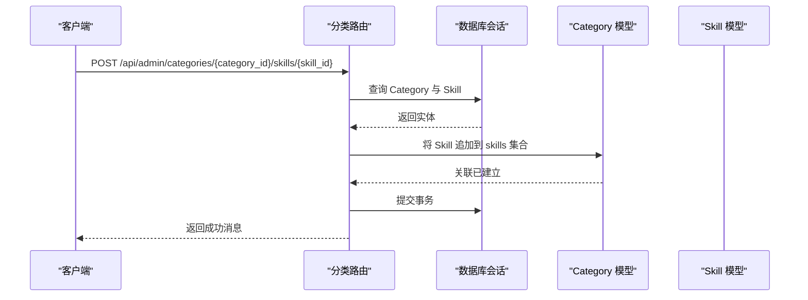
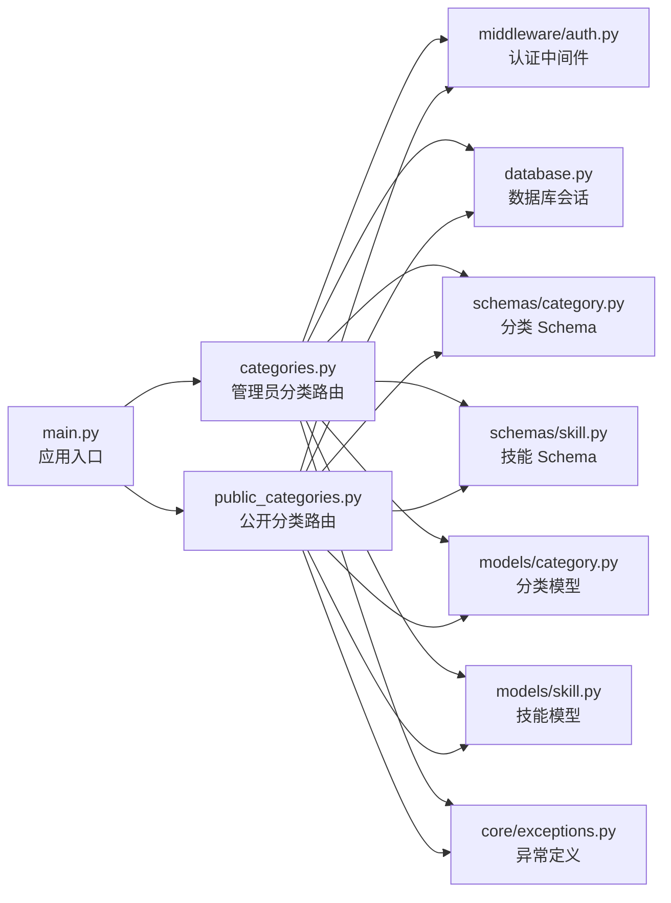

# 分类管理 API

<cite>
**本文档引用的文件**
- [backend/main.py](file://backend/main.py)
- [backend/api/categories.py](file://backend/api/categories.py)
- [backend/api/public_categories.py](file://backend/api/public_categories.py)
- [backend/middleware/auth.py](file://backend/middleware/auth.py)
- [backend/models/category.py](file://backend/models/category.py)
- [backend/models/skill.py](file://backend/models/skill.py)
- [backend/schemas/category.py](file://backend/schemas/category.py)
- [backend/schemas/skill.py](file://backend/schemas/skill.py)
- [backend/database.py](file://backend/database.py)
- [backend/core/exceptions.py](file://backend/core/exceptions.py)
</cite>

## 目录
1. [简介](#简介)
2. [项目结构](#项目结构)
3. [核心组件](#核心组件)
4. [架构总览](#架构总览)
5. [详细组件分析](#详细组件分析)
6. [依赖关系分析](#依赖关系分析)
7. [性能考虑](#性能考虑)
8. [故障排除指南](#故障排除指南)
9. [结论](#结论)

## 简介
本文件系统性地记录了分类管理 API 的设计与实现，涵盖以下能力：
- 分类 CRUD 操作（创建、查询、更新、删除）
- 分类树形结构查询（支持递归子节点与技能数量统计）
- 公共分类接口（无需认证）
- 分类与技能的多对多关联管理
- 权限控制机制（管理员权限）
- 排序与层级关系处理
- 错误处理与异常规范

## 项目结构
后端采用 FastAPI + SQLAlchemy Async 架构，按功能模块划分：
- API 层：路由处理器，负责请求解析与响应封装
- 模型层：SQLAlchemy ORM 映射，定义实体与关系
- Schema 层：Pydantic 模型，负责输入输出校验与序列化
- 中间件层：认证、安全头、日志与限流
- 核心模块：异常定义、安全工具、数据库连接

**图表来源**
- [backend/api/categories.py](file://backend/api/categories.py#L1-L294)
- [backend/api/public_categories.py](file://backend/api/public_categories.py#L1-L129)
- [backend/models/category.py](file://backend/models/category.py#L1-L94)
- [backend/models/skill.py](file://backend/models/skill.py#L1-L90)
- [backend/schemas/category.py](file://backend/schemas/category.py#L1-L93)
- [backend/schemas/skill.py](file://backend/schemas/skill.py#L1-L60)
- [backend/middleware/auth.py](file://backend/middleware/auth.py#L1-L134)
- [backend/database.py](file://backend/database.py#L1-L75)
- [backend/core/exceptions.py](file://backend/core/exceptions.py#L1-L101)

**章节来源**
- [backend/main.py](file://backend/main.py#L24-L84)
- [backend/api/categories.py](file://backend/api/categories.py#L21-L294)
- [backend/api/public_categories.py](file://backend/api/public_categories.py#L15-L129)

## 核心组件
- 路由路由器
  - 管理员分类路由：/api/admin/categories
  - 公开分类路由：/api/categories
- 认证与权限
  - 管理员分类接口依赖当前用户认证
  - 公开分类接口支持可选认证
- 数据模型
  - 分类 Category：自引用父子关系、多对多技能集合
  - 技能 Skill：多对多分类集合
- 数据契约
  - 分类 Schema：创建、更新、响应、树形项、批量分配
  - 技能 Schema：响应、分页、搜索参数、元数据
- 异常体系
  - NotFoundError、ConflictError、ValidationError 等

**章节来源**
- [backend/api/categories.py](file://backend/api/categories.py#L21-L294)
- [backend/api/public_categories.py](file://backend/api/public_categories.py#L15-L129)
- [backend/middleware/auth.py](file://backend/middleware/auth.py#L48-L134)
- [backend/models/category.py](file://backend/models/category.py#L19-L94)
- [backend/models/skill.py](file://backend/models/skill.py#L11-L90)
- [backend/schemas/category.py](file://backend/schemas/category.py#L7-L93)
- [backend/schemas/skill.py](file://backend/schemas/skill.py#L7-L60)
- [backend/core/exceptions.py](file://backend/core/exceptions.py#L24-L101)

## 架构总览
下图展示分类 API 的关键交互流程：请求进入路由层，经认证中间件与依赖注入获取数据库会话，调用模型层进行数据持久化，最终通过 Schema 层序列化响应。

**图表来源**
- [backend/api/categories.py](file://backend/api/categories.py#L24-L294)
- [backend/api/public_categories.py](file://backend/api/public_categories.py#L18-L129)
- [backend/middleware/auth.py](file://backend/middleware/auth.py#L48-L134)
- [backend/database.py](file://backend/database.py#L42-L56)

## 详细组件分析

### 管理员分类 API（/api/admin/categories）
- 路由前缀：/api/admin/categories
- 认证要求：需要有效 JWT 且用户为激活状态
- 支持端点：
  - GET /tree：获取分类树（递归子节点，含技能数量）
  - GET /：获取平铺分类列表（含技能数量）
  - POST /：创建分类（校验 slug 唯一，可选父分类）
  - GET /{category_id}：获取分类详情（含技能数量）
  - PUT /{category_id}：更新分类（禁止自指父分类，可更新父分类）
  - DELETE /{category_id}：删除分类
  - POST /{category_id}/skills/{skill_id}：将技能分配给分类
  - DELETE /{category_id}/skills/{skill_id}：将技能从分类移除
  - POST /skills/{skill_id}/categories：为技能批量分配分类

- 关键实现要点
  - 树形查询使用 selectinload 预加载 children 与 skills，避免 N+1 查询
  - 响应使用 CategoryTreeItem.from_orm_with_tree 构建递归结构
  - 分类与技能多对多通过中间表维护，支持批量分配
  - 错误处理统一抛出 NotFoundError、ConflictError、ValidationError

- 请求与响应示例（路径参考）
  - 创建分类
    - 请求：POST /api/admin/categories
    - 请求体：CategoryCreate（name、slug、description、icon、sort_order、parent_id）
    - 响应：CategoryResponse（包含 id、parent_id、name、slug、description、icon、sort_order、created_at、skill_count、children）
  - 获取分类树
    - 请求：GET /api/admin/categories/tree
    - 响应：list[CategoryTreeItem]（根节点数组，每个节点包含 children 与 skill_count）
  - 批量分配分类给技能
    - 请求：POST /api/admin/categories/skills/{skill_id}/categories
    - 请求体：AssignCategories（category_ids: list[int]）

**章节来源**
- [backend/api/categories.py](file://backend/api/categories.py#L24-L294)
- [backend/schemas/category.py](file://backend/schemas/category.py#L16-L93)
- [backend/models/category.py](file://backend/models/category.py#L19-L94)
- [backend/models/skill.py](file://backend/models/skill.py#L11-L90)
- [backend/core/exceptions.py](file://backend/core/exceptions.py#L24-L101)

### 公开分类 API（/api/categories）
- 路由前缀：/api/categories
- 认证要求：可选认证（匿名也可访问）
- 支持端点：
  - GET /：获取平铺分类列表（含技能数量）
  - GET /tree：获取分类树（递归子节点，含技能数量）
  - GET /{category_id}：获取分类详情（含技能数量）
  - GET /{slug}/skills：获取指定分类下的技能列表（含分类与仓库信息）

- 关键实现要点
  - 树形查询同样使用 selectinload 预加载 children 与 skills
  - 公开接口未强制管理员权限，适合前端展示与导航
  - 技能列表通过 SkillResponse 序列化，包含 categories 与 repository 信息

- 请求与响应示例（路径参考）
  - 获取分类树
    - 请求：GET /api/categories/tree
    - 响应：list[CategoryTreeItem]
  - 获取分类下的技能
    - 请求：GET /api/categories/{slug}/skills
    - 响应：list[SkillResponse]（每个技能包含 categories 与 repository）

**章节来源**
- [backend/api/public_categories.py](file://backend/api/public_categories.py#L18-L129)
- [backend/schemas/category.py](file://backend/schemas/category.py#L31-L93)
- [backend/schemas/skill.py](file://backend/schemas/skill.py#L13-L60)
- [backend/models/category.py](file://backend/models/category.py#L19-L94)
- [backend/models/skill.py](file://backend/models/skill.py#L11-L90)

### 数据模型与关系
- 分类 Category
  - 自引用父子关系：parent_id -> Category.id
  - 多对多技能集合：通过中间表 category_skills 维护
  - 辅助方法：get_ancestors、get_descendants 用于层级遍历
- 技能 Skill
  - 多对多分类集合：通过中间表 category_skills 维护
  - 辅助方法：to_dict 支持 include_categories 与 include_repository
- 关系图

**图表来源**
- [backend/models/category.py](file://backend/models/category.py#L19-L94)
- [backend/models/skill.py](file://backend/models/skill.py#L11-L90)

**章节来源**
- [backend/models/category.py](file://backend/models/category.py#L19-L94)
- [backend/models/skill.py](file://backend/models/skill.py#L11-L90)

### 权限控制机制
- 管理员分类接口
  - 依赖 get_current_user，若无令牌或用户无效则 401
  - 用户需为激活状态，否则 401
  - 当前实现未显式 require_admin，建议在需要时引入 require_admin 依赖
- 公开分类接口
  - 依赖 get_optional_user，允许匿名访问
  - 若携带无效令牌，返回 None，不影响公开接口访问

**章节来源**
- [backend/middleware/auth.py](file://backend/middleware/auth.py#L48-L134)
- [backend/api/categories.py](file://backend/api/categories.py#L24-L294)
- [backend/api/public_categories.py](file://backend/api/public_categories.py#L18-L129)

### 树形结构处理与排序
- 树形查询
  - 顶层分类 parent_id 为空，按 sort_order 升序排列
  - 使用 selectinload 预加载 children 与 skills，避免 N+1 查询
  - CategoryTreeItem.from_orm_with_tree 递归构建树结构，支持统计 skill_count
- 排序
  - 分类按 sort_order 字段排序
  - 子节点同样按 sort_order 排序

**章节来源**
- [backend/api/categories.py](file://backend/api/categories.py#L24-L77)
- [backend/api/public_categories.py](file://backend/api/public_categories.py#L47-L129)
- [backend/schemas/category.py](file://backend/schemas/category.py#L42-L78)
- [backend/models/category.py](file://backend/models/category.py#L51-L94)

### 分类与技能关联
- 单个技能分配
  - POST /{category_id}/skills/{skill_id}：将技能加入分类（若不存在则添加）
  - DELETE /{category_id}/skills/{skill_id}：将技能移出分类（若存在则移除）
- 批量分配
  - POST /skills/{skill_id}/categories：清空现有分类并重新分配 category_ids 列表

**图表来源**
- [backend/api/categories.py](file://backend/api/categories.py#L217-L237)

**章节来源**
- [backend/api/categories.py](file://backend/api/categories.py#L217-L293)
- [backend/models/category.py](file://backend/models/category.py#L40-L46)
- [backend/models/skill.py](file://backend/models/skill.py#L34-L39)

### 错误处理与异常规范
- 常见异常
  - NotFoundError：资源未找到（Category/Skill）
  - ConflictError：冲突（如 slug 重复）
  - ValidationError：数据校验失败（如自指父分类）
- 异常映射
  - FastAPI 异常处理器统一捕获并返回标准化错误响应

**章节来源**
- [backend/core/exceptions.py](file://backend/core/exceptions.py#L24-L101)
- [backend/api/categories.py](file://backend/api/categories.py#L87-L102)
- [backend/api/categories.py](file://backend/api/categories.py#L173-L179)

## 依赖关系分析

**图表来源**
- [backend/main.py](file://backend/main.py#L24-L84)
- [backend/api/categories.py](file://backend/api/categories.py#L1-L294)
- [backend/api/public_categories.py](file://backend/api/public_categories.py#L1-L129)
- [backend/middleware/auth.py](file://backend/middleware/auth.py#L1-L134)
- [backend/database.py](file://backend/database.py#L1-L75)
- [backend/schemas/category.py](file://backend/schemas/category.py#L1-L93)
- [backend/schemas/skill.py](file://backend/schemas/skill.py#L1-L60)
- [backend/models/category.py](file://backend/models/category.py#L1-L94)
- [backend/models/skill.py](file://backend/models/skill.py#L1-L90)
- [backend/core/exceptions.py](file://backend/core/exceptions.py#L1-L101)

**章节来源**
- [backend/main.py](file://backend/main.py#L24-L84)

## 性能考虑
- 查询优化
  - 使用 selectinload 预加载 children 与 skills，避免 N+1 查询
  - 树形查询按 sort_order 排序，减少前端排序成本
- 数据模型
  - 分类与技能多对多通过中间表维护，支持高效关联查询
- 缓存策略
  - 代码中未实现专用缓存层；建议在高频读场景（如首页分类树）引入进程内缓存或 Redis 缓存，并设置合理过期时间
- 并发与连接
  - 使用异步 SQLAlchemy 连接池，合理配置 pool_size 与 max_overflow

[本节为通用性能建议，不直接分析具体文件]

## 故障排除指南
- 401 未认证
  - 检查请求头 Authorization: Bearer <token> 是否正确
  - 确认令牌未过期且用户处于激活状态
- 403 权限不足
  - 管理员分类接口可能需要 require_admin 依赖，请确认用户角色
- 404 资源不存在
  - 检查 category_id 或 skill_id 是否正确
- 409 冲突
  - slug 重复导致创建失败，更换唯一 slug
- 422 参数校验失败
  - 检查 slug 正则、sort_order 类型与范围

**章节来源**
- [backend/middleware/auth.py](file://backend/middleware/auth.py#L48-L134)
- [backend/core/exceptions.py](file://backend/core/exceptions.py#L24-L101)
- [backend/api/categories.py](file://backend/api/categories.py#L87-L102)
- [backend/api/categories.py](file://backend/api/categories.py#L173-L179)

## 结论
分类管理 API 提供了完整的分类 CRUD、树形结构查询与分类-技能关联能力，结合认证中间件实现了管理员权限控制。通过预加载与排序优化，保证了查询性能；通过 Pydantic Schema 与 ORM 模型清晰分离了数据契约与持久化逻辑。建议在生产环境中补充缓存策略与 require_admin 权限约束，以进一步提升可用性与安全性。