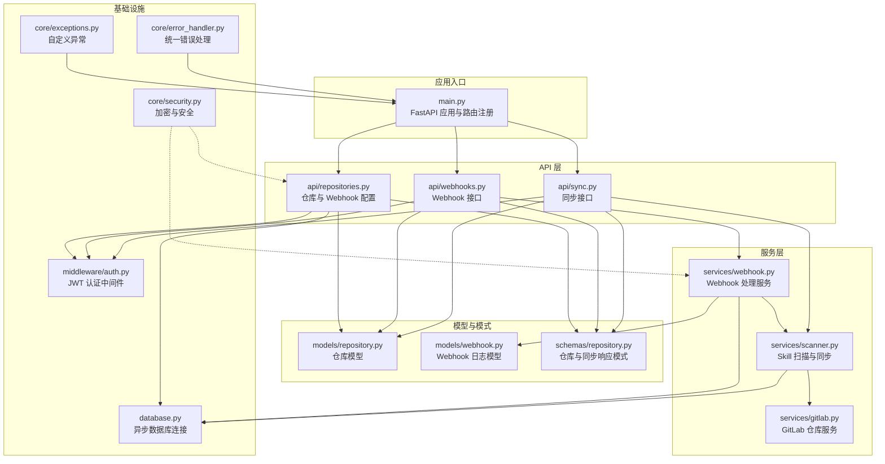
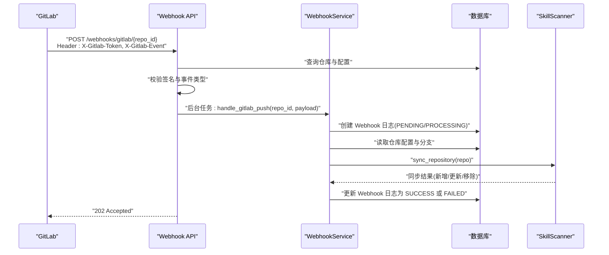
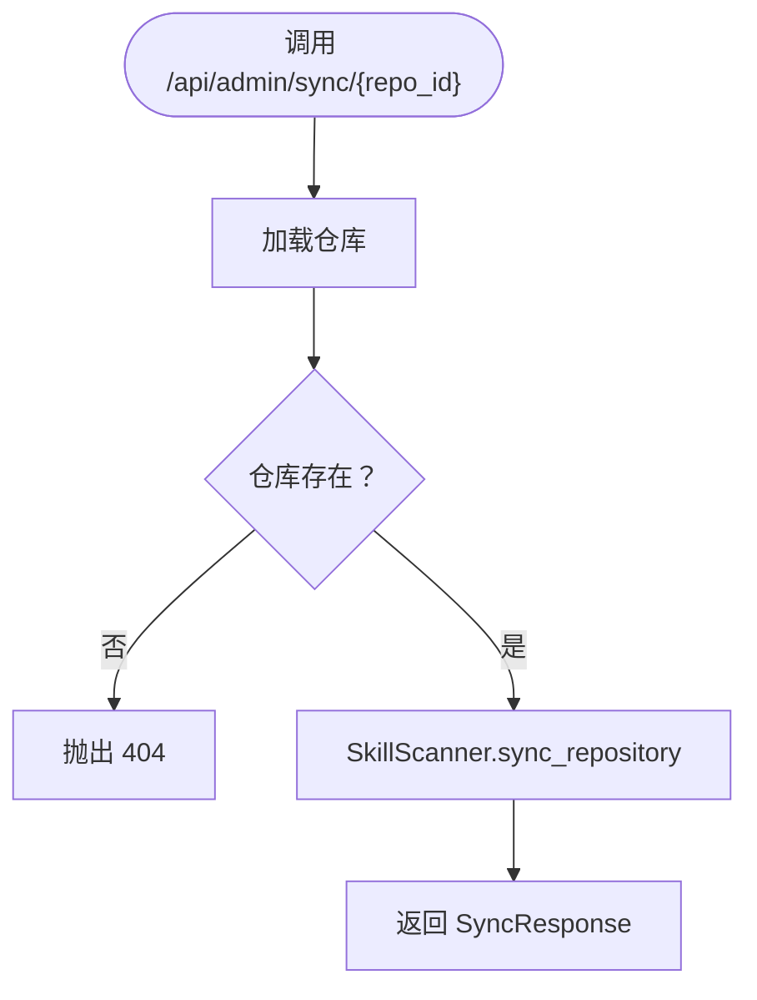
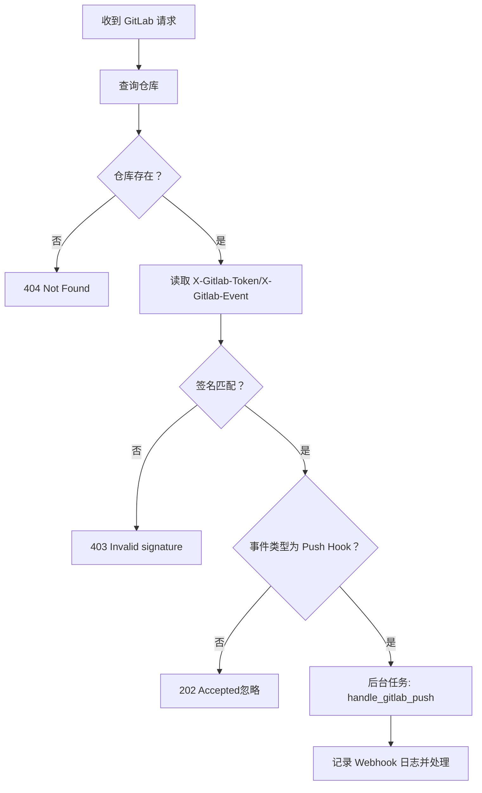
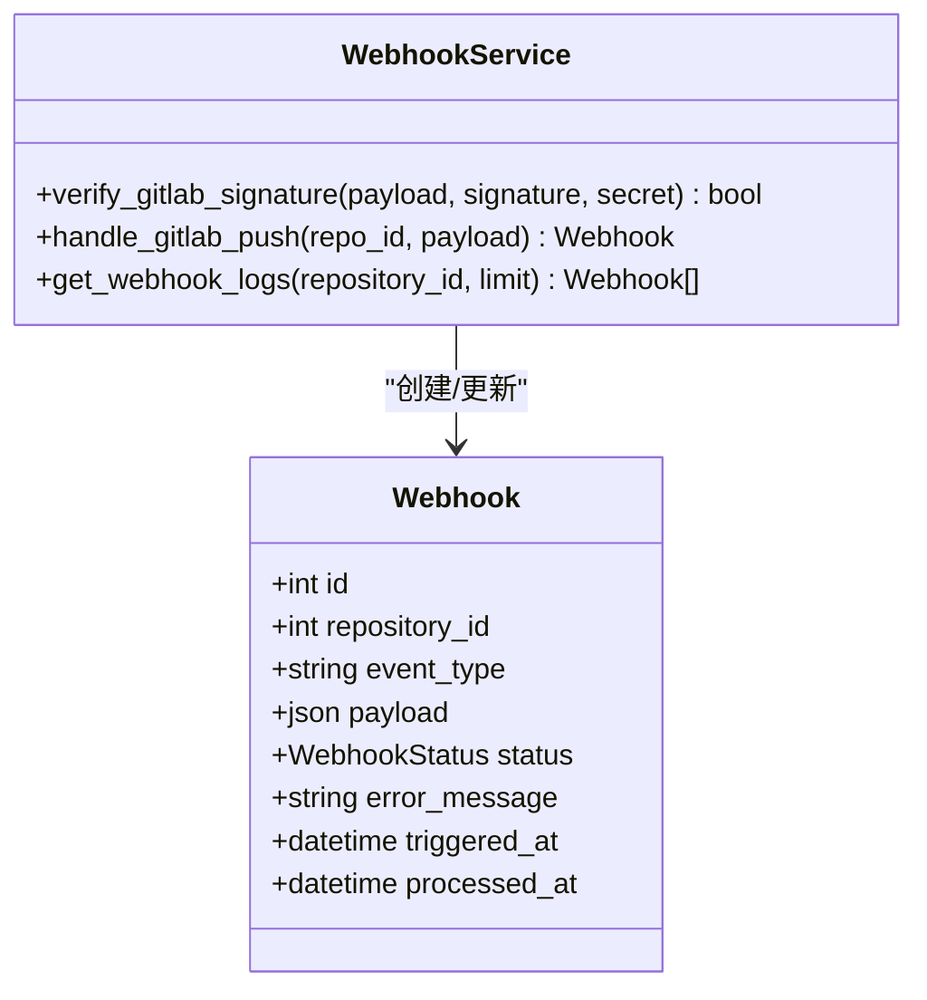
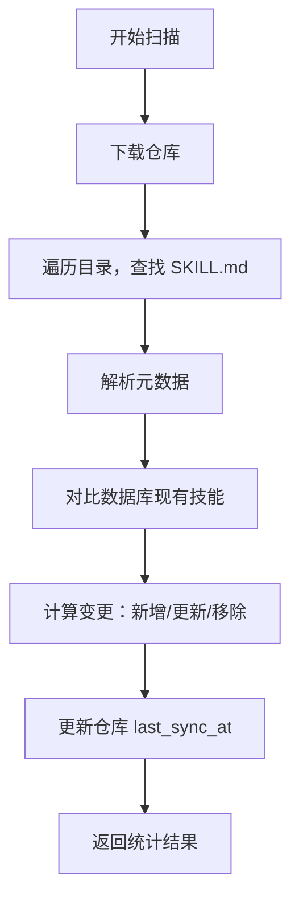
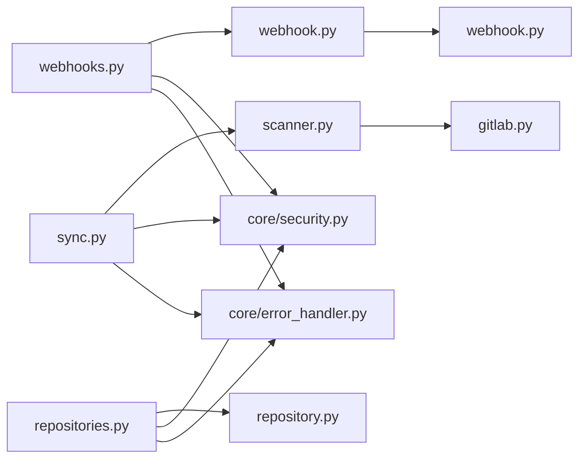

# 同步与 Webhook API

<cite>
**本文引用的文件**
- [backend/main.py](file://backend/main.py)
- [backend/api/sync.py](file://backend/api/sync.py)
- [backend/api/webhooks.py](file://backend/api/webhooks.py)
- [backend/api/repositories.py](file://backend/api/repositories.py)
- [backend/services/scanner.py](file://backend/services/scanner.py)
- [backend/services/webhook.py](file://backend/services/webhook.py)
- [backend/services/gitlab.py](file://backend/services/gitlab.py)
- [backend/models/repository.py](file://backend/models/repository.py)
- [backend/models/webhook.py](file://backend/models/webhook.py)
- [backend/schemas/repository.py](file://backend/schemas/repository.py)
- [backend/core/security.py](file://backend/core/security.py)
- [backend/core/error_handler.py](file://backend/core/error_handler.py)
- [backend/core/exceptions.py](file://backend/core/exceptions.py)
- [backend/middleware/auth.py](file://backend/middleware/auth.py)
- [backend/database.py](file://backend/database.py)
</cite>

## 目录
1. [简介](#简介)
2. [项目结构](#项目结构)
3. [核心组件](#核心组件)
4. [架构总览](#架构总览)
5. [详细组件分析](#详细组件分析)
6. [依赖关系分析](#依赖关系分析)
7. [性能考虑](#性能考虑)
8. [故障排查指南](#故障排查指南)
9. [结论](#结论)

## 简介
本文件系统性梳理了 Skills Hub 平台的“同步与 Webhook API”，涵盖以下关键能力：
- 手动同步触发：单仓库与全量同步
- Webhook 配置与事件处理：GitLab Push 事件接收、签名校验、异步同步
- 同步状态跟踪与日志：仓库级状态统计、Webhook 日志查询
- 错误处理与重试：统一异常处理、外部服务错误、日志追踪
- 安全与合规：JWT 认证、敏感数据加密、Webhook 签名验证
- 性能与可观测性：异步处理、日志轮转、健康检查

## 项目结构
后端采用 FastAPI + SQLAlchemy Async 架构，API 路由集中在 backend/api，业务逻辑分布在 backend/services，数据模型位于 backend/models，核心工具位于 backend/core。

**图表来源**
- [backend/main.py](file://backend/main.py#L24-L84)
- [backend/api/sync.py](file://backend/api/sync.py#L14-L112)
- [backend/api/webhooks.py](file://backend/api/webhooks.py#L12-L90)
- [backend/api/repositories.py](file://backend/api/repositories.py#L23-L205)
- [backend/services/scanner.py](file://backend/services/scanner.py#L21-L197)
- [backend/services/webhook.py](file://backend/services/webhook.py#L15-L124)
- [backend/services/gitlab.py](file://backend/services/gitlab.py#L15-L170)
- [backend/models/repository.py](file://backend/models/repository.py#L18-L74)
- [backend/models/webhook.py](file://backend/models/webhook.py#L19-L49)
- [backend/schemas/repository.py](file://backend/schemas/repository.py#L66-L73)
- [backend/core/security.py](file://backend/core/security.py#L31-L58)
- [backend/core/error_handler.py](file://backend/core/error_handler.py#L14-L102)
- [backend/core/exceptions.py](file://backend/core/exceptions.py#L7-L101)
- [backend/middleware/auth.py](file://backend/middleware/auth.py#L48-L108)
- [backend/database.py](file://backend/database.py#L42-L75)

**章节来源**
- [backend/main.py](file://backend/main.py#L24-L84)
- [backend/database.py](file://backend/database.py#L14-L56)

## 核心组件
- 同步接口：提供单仓库同步、全量同步、同步状态查询
- Webhook 接口：接收 GitLab Push 事件，进行签名校验与异步同步
- Webhook 处理服务：记录日志、校验仓库与分支、触发同步
- 技能扫描服务：下载仓库、解析 SKILL.md、更新数据库
- 仓库模型与模式：仓库配置、Webhook 开关与密钥、同步响应
- 安全与错误处理：JWT 认证、敏感数据加密、统一异常处理

**章节来源**
- [backend/api/sync.py](file://backend/api/sync.py#L17-L112)
- [backend/api/webhooks.py](file://backend/api/webhooks.py#L15-L90)
- [backend/services/webhook.py](file://backend/services/webhook.py#L15-L124)
- [backend/services/scanner.py](file://backend/services/scanner.py#L21-L197)
- [backend/models/repository.py](file://backend/models/repository.py#L18-L74)
- [backend/schemas/repository.py](file://backend/schemas/repository.py#L66-L73)
- [backend/core/security.py](file://backend/core/security.py#L31-L58)
- [backend/core/error_handler.py](file://backend/core/error_handler.py#L14-L102)

## 架构总览
下图展示 Webhook 事件从 GitLab 到同步完成的端到端流程，包括鉴权、签名校验、异步处理与状态记录。

**图表来源**
- [backend/api/webhooks.py](file://backend/api/webhooks.py#L15-L65)
- [backend/services/webhook.py](file://backend/services/webhook.py#L31-L101)
- [backend/services/scanner.py](file://backend/services/scanner.py#L70-L156)
- [backend/models/webhook.py](file://backend/models/webhook.py#L19-L49)

## 详细组件分析

### 同步接口（手动触发）
- 单仓库同步
  - 方法与路径：POST /api/admin/sync/{repo_id}
  - 认证：需要管理员权限
  - 请求参数：路径参数 repo_id
  - 响应：SyncResponse（包含状态、新增/更新/移除数量、消息）
  - 行为：加载仓库 → 调用 SkillScanner → 返回统计结果
- 全量同步
  - 方法与路径：POST /api/admin/sync/all
  - 行为：查询所有启用仓库 → 逐个同步 → 汇总结果（含成功/失败项）
- 同步状态
  - 方法与路径：GET /api/admin/sync/status
  - 行为：统计总仓库数、已同步仓库数、最近同步的仓库列表

**图表来源**
- [backend/api/sync.py](file://backend/api/sync.py#L17-L32)
- [backend/services/scanner.py](file://backend/services/scanner.py#L70-L156)

**章节来源**
- [backend/api/sync.py](file://backend/api/sync.py#L17-L112)
- [backend/services/scanner.py](file://backend/services/scanner.py#L70-L156)
- [backend/schemas/repository.py](file://backend/schemas/repository.py#L66-L73)

### Webhook 接口（GitLab）
- 接收端点
  - 方法与路径：POST /webhooks/gitlab/{repo_id}
  - 认证：无（公开端点，依赖仓库配置与签名验证）
  - 请求头：
    - X-Gitlab-Token：与仓库配置的 webhook_secret 一致
    - X-Gitlab-Event：事件类型（如 Push Hook）
  - 请求体：JSON（GitLab Push 事件负载）
  - 响应：{"status": "accepted", "message": "Webhook received"}
- 事件处理流程
  - 校验仓库存在性（不存在返回 404，不暴露仓库信息）
  - 校验签名（若配置了 secret）
  - 读取 JSON 负载（解析失败返回 400）
  - 若事件为 Push Hook，则加入后台任务异步处理
- 日志查询
  - 方法与路径：GET /webhooks/logs
  - 查询参数：repo_id（可选）、limit（默认 100）
  - 响应：Webhook 日志列表（包含状态、错误信息、触发/处理时间）

**图表来源**
- [backend/api/webhooks.py](file://backend/api/webhooks.py#L15-L65)
- [backend/models/repository.py](file://backend/models/repository.py#L18-L74)

**章节来源**
- [backend/api/webhooks.py](file://backend/api/webhooks.py#L15-L90)
- [backend/models/webhook.py](file://backend/models/webhook.py#L19-L49)
- [backend/models/repository.py](file://backend/models/repository.py#L18-L74)

### Webhook 处理服务
- 签名校验：支持空密钥跳过验证
- 事件处理：
  - 记录 Webhook 日志（状态：PENDING → PROCESSING）
  - 校验仓库存在与 Webhook 开关
  - 解析 ref 提取分支，仅处理与仓库配置一致的分支
  - 调用 SkillScanner 同步仓库
  - 更新日志状态为 SUCCESS 或 FAILED，并记录错误信息
- 日志查询：支持按仓库过滤与限制条数

**图表来源**
- [backend/services/webhook.py](file://backend/services/webhook.py#L15-L124)
- [backend/models/webhook.py](file://backend/models/webhook.py#L19-L49)

**章节来源**
- [backend/services/webhook.py](file://backend/services/webhook.py#L21-L101)
- [backend/models/webhook.py](file://backend/models/webhook.py#L11-L49)

### 技能扫描服务
- 扫描流程：
  - 下载仓库（GitHub/GitLab，支持私有仓库 Token）
  - 遍历目录，解析 SKILL.md，提取元数据
  - 与数据库现有技能对比，计算新增/更新/不变/移除
  - 更新仓库 last_sync_at
  - 返回同步统计结果
- URL 构建：根据仓库类型与分支构建 README 与原始文件链接

**图表来源**
- [backend/services/scanner.py](file://backend/services/scanner.py#L27-L156)
- [backend/services/gitlab.py](file://backend/services/gitlab.py#L46-L165)

**章节来源**
- [backend/services/scanner.py](file://backend/services/scanner.py#L27-L156)
- [backend/services/gitlab.py](file://backend/services/gitlab.py#L46-L165)

### 仓库与 Webhook 配置
- 配置端点
  - POST /api/admin/repositories/{repo_id}/webhook
  - 请求体：WebhookConfig（enabled: bool, secret: str|null）
  - 行为：开启/关闭 Webhook；若提供 secret 则加密存储；关闭时清除密钥
- 仓库模型字段
  - webhook_enabled、webhook_secret（加密存储）、branch、last_sync_at 等

**章节来源**
- [backend/api/repositories.py](file://backend/api/repositories.py#L179-L204)
- [backend/models/repository.py](file://backend/models/repository.py#L18-L74)
- [backend/schemas/repository.py](file://backend/schemas/repository.py#L60-L64)
- [backend/core/security.py](file://backend/core/security.py#L31-L58)

### 安全与认证
- JWT 认证中间件：提供令牌创建、解码、用户解析与管理员权限校验
- 敏感数据加密：使用 Fernet 对 Token 与 Webhook 密钥进行加解密
- Webhook 签名：GitLab 通过 X-Gitlab-Token 头传递简单 token，服务端与仓库配置比对

**章节来源**
- [backend/middleware/auth.py](file://backend/middleware/auth.py#L25-L108)
- [backend/core/security.py](file://backend/core/security.py#L31-L58)
- [backend/api/webhooks.py](file://backend/api/webhooks.py#L37-L41)

### 错误处理与重试
- 统一异常处理：SkillsException、Validation、HTTP、通用异常均格式化输出
- 外部服务错误：GitHub/GitLab 下载失败映射为 502
- Webhook 处理：异常时记录 FAILED 状态与错误信息，便于后续排查
- 重试机制：当前实现未内置自动重试；建议在上游（如 GitLab）或队列层增加重试策略

**章节来源**
- [backend/core/error_handler.py](file://backend/core/error_handler.py#L14-L102)
- [backend/core/exceptions.py](file://backend/core/exceptions.py#L91-L101)
- [backend/services/webhook.py](file://backend/services/webhook.py#L91-L99)

## 依赖关系分析
- 控制流依赖
  - Webhook API → WebhookService → SkillScanner → GitLabService
  - 同步 API → SkillScanner
  - 仓库 API → Repository 模型与安全模块
- 数据依赖
  - Webhook 模型记录事件与状态，便于审计与重放
  - 仓库模型承载分支、密钥、开关等配置
- 错误与安全
  - 统一异常处理器集中处理各类错误
  - 加密模块贯穿仓库密钥与 Webhook 密钥的存储

**图表来源**
- [backend/api/webhooks.py](file://backend/api/webhooks.py#L15-L65)
- [backend/services/webhook.py](file://backend/services/webhook.py#L15-L124)
- [backend/api/sync.py](file://backend/api/sync.py#L17-L32)
- [backend/services/scanner.py](file://backend/services/scanner.py#L21-L197)
- [backend/services/gitlab.py](file://backend/services/gitlab.py#L15-L170)
- [backend/models/repository.py](file://backend/models/repository.py#L18-L74)
- [backend/models/webhook.py](file://backend/models/webhook.py#L19-L49)
- [backend/core/security.py](file://backend/core/security.py#L31-L58)
- [backend/core/error_handler.py](file://backend/core/error_handler.py#L14-L102)

**章节来源**
- [backend/api/webhooks.py](file://backend/api/webhooks.py#L15-L65)
- [backend/api/sync.py](file://backend/api/sync.py#L17-L32)
- [backend/api/repositories.py](file://backend/api/repositories.py#L179-L204)
- [backend/services/webhook.py](file://backend/services/webhook.py#L15-L124)
- [backend/services/scanner.py](file://backend/services/scanner.py#L21-L197)
- [backend/models/repository.py](file://backend/models/repository.py#L18-L74)
- [backend/models/webhook.py](file://backend/models/webhook.py#L19-L49)
- [backend/core/security.py](file://backend/core/security.py#L31-L58)
- [backend/core/error_handler.py](file://backend/core/error_handler.py#L14-L102)

## 性能考虑
- 异步与后台任务：Webhook 接收立即返回 202，实际处理在后台任务执行，降低请求延迟
- 数据库连接：使用 SQLAlchemy Async 与连接池，减少连接开销
- 日志与审计：Webhook 日志记录状态与错误，便于定位性能瓶颈
- 健康检查：/api/health 用于快速判断数据库连通性

**章节来源**
- [backend/api/webhooks.py](file://backend/api/webhooks.py#L58-L64)
- [backend/database.py](file://backend/database.py#L20-L36)
- [backend/main.py](file://backend/main.py#L88-L104)

## 故障排查指南
- Webhook 403（无效签名）
  - 检查 GitLab 配置的 Secret Token 是否与仓库配置一致
  - 确认 X-Gitlab-Token 头正确传递
- Webhook 400（无效 JSON）
  - 确认请求体为合法 JSON
- Webhook 404（仓库不存在）
  - 确认 repo_id 正确且仓库已创建
- 同步失败
  - 查看 /webhooks/logs 中对应 Webhook 日志的 error_message
  - 检查仓库分支配置与仓库访问权限（Token）
- 统一错误格式
  - 所有异常均返回标准化错误对象，包含 code、message、details、path、timestamp

**章节来源**
- [backend/api/webhooks.py](file://backend/api/webhooks.py#L37-L52)
- [backend/services/webhook.py](file://backend/services/webhook.py#L60-L99)
- [backend/core/error_handler.py](file://backend/core/error_handler.py#L14-L102)

## 结论
本系统提供了完善的同步与 Webhook 能力：通过管理员接口实现手动同步，通过 GitLab Webhook 实现自动化触发；服务层以异步方式处理高并发请求，配合统一错误处理与安全机制，确保稳定性与可维护性。建议后续增强：
- 在上游或队列层引入 Webhook 重试与幂等处理
- 增加 Webhook 事件去重（基于事件 ID/指纹）
- 引入指标采集与告警，完善性能监控