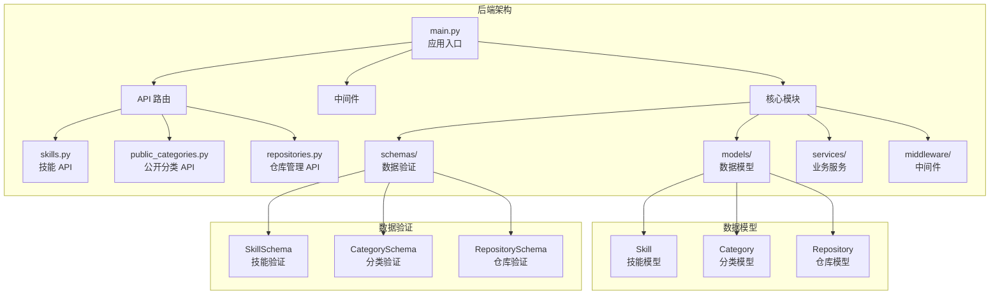
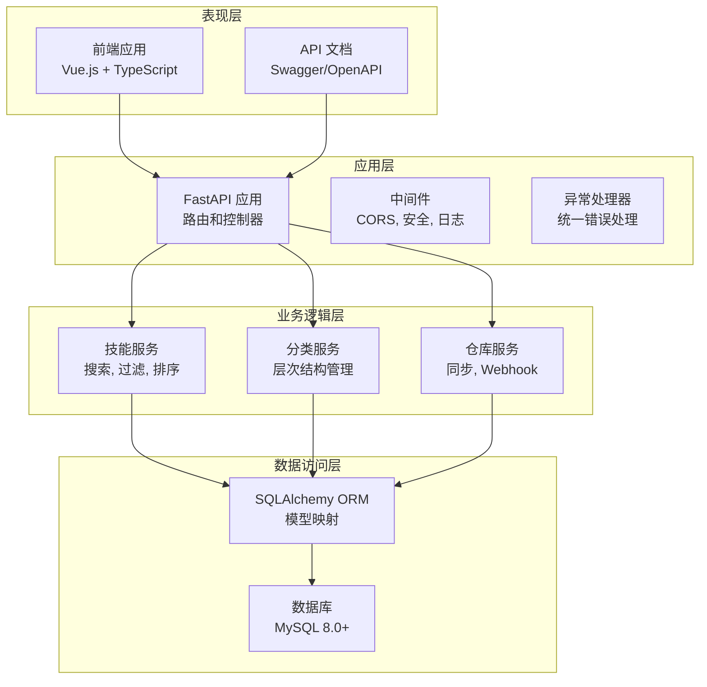
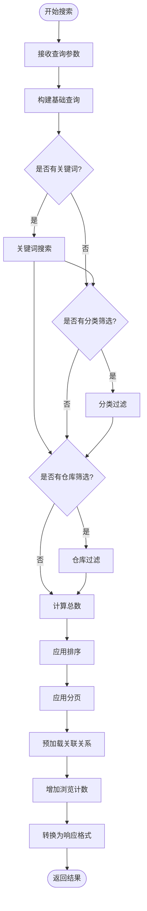
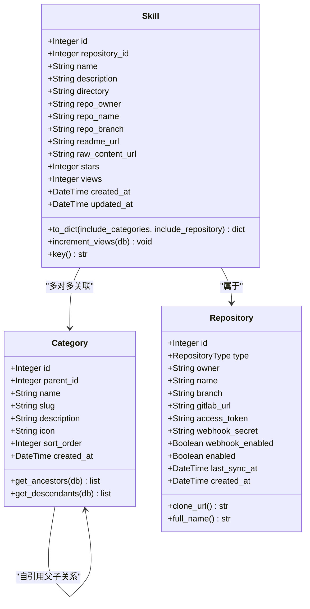
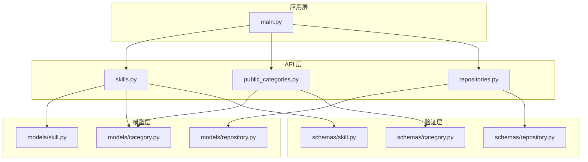

# 技能管理 API

<cite>
**本文档引用的文件**
- [backend/main.py](file://backend/main.py)
- [backend/api/skills.py](file://backend/api/skills.py)
- [backend/api/public_categories.py](file://backend/api/public_categories.py)
- [backend/models/skill.py](file://backend/models/skill.py)
- [backend/models/category.py](file://backend/models/category.py)
- [backend/models/repository.py](file://backend/models/repository.py)
- [backend/schemas/skill.py](file://backend/schemas/skill.py)
- [backend/schemas/category.py](file://backend/schemas/category.py)
- [backend/schemas/repository.py](file://backend/schemas/repository.py)
- [README.md](file://README.md)
</cite>

## 目录
1. [简介](#简介)
2. [项目结构](#项目结构)
3. [核心组件](#核心组件)
4. [架构概览](#架构概览)
5. [详细组件分析](#详细组件分析)
6. [依赖关系分析](#依赖关系分析)
7. [性能考虑](#性能考虑)
8. [故障排除指南](#故障排除指南)
9. [结论](#结论)

## 简介

技能管理 API 是一个基于 FastAPI 的内部技能管理发现平台，提供了完整的技能查询、搜索和管理功能。该系统支持从 GitHub/GitLab 仓库自动发现和同步技能内容，采用多级分类体系进行技能组织，并提供 RESTful API 接口供前端应用调用。

主要功能特性包括：
- 技能自动发现和同步
- 多级分类管理
- 全文搜索功能
- 分页查询和排序
- Webhook 自动同步
- 用户认证和权限控制

## 项目结构

后端采用模块化设计，按照功能层次组织代码：



**图表来源**
- [backend/main.py](file://backend/main.py#L24-L84)
- [backend/api/skills.py](file://backend/api/skills.py#L1-L160)
- [backend/api/public_categories.py](file://backend/api/public_categories.py#L1-L129)

**章节来源**
- [backend/main.py](file://backend/main.py#L1-L137)
- [README.md](file://README.md#L20-L47)

## 核心组件

技能管理 API 的核心组件包括：

### 技能模型 (Skill Model)
技能是系统的核心实体，代表一个具体的技术技能或知识领域。每个技能都包含以下关键属性：
- 基本信息：名称、描述、目录路径
- 来源信息：仓库所有者、仓库名称、分支
- 内容链接：README 文件 URL、原始内容 URL
- 统计信息：星标数量、浏览次数
- 时间戳：创建和更新时间

### 分类模型 (Category Model)
支持多级分类的层次结构，具有以下特性：
- 父子关系：支持无限层级嵌套
- 唯一标识：使用 slug 作为 URL 友好的标识符
- 排序机制：通过 sort_order 字段控制显示顺序
- 关联关系：与技能建立多对多关联

### 仓库模型 (Repository Model)
管理外部代码仓库的配置和状态：
- 支持 GitHub 和 GitLab
- 访问令牌加密存储
- Webhook 配置
- 同步状态跟踪

**章节来源**
- [backend/models/skill.py](file://backend/models/skill.py#L11-L90)
- [backend/models/category.py](file://backend/models/category.py#L19-L94)
- [backend/models/repository.py](file://backend/models/repository.py#L18-L74)

## 架构概览

系统采用分层架构设计，确保关注点分离和代码可维护性：



**图表来源**
- [backend/main.py](file://backend/main.py#L47-L84)
- [backend/api/skills.py](file://backend/api/skills.py#L1-L160)
- [backend/api/public_categories.py](file://backend/api/public_categories.py#L1-L129)

## 详细组件分析

### 技能查询 API

技能查询 API 提供了灵活的搜索和过滤功能，支持多种查询条件和排序选项。

#### 主要端点

##### GET /api/skills
**功能**：搜索和浏览技能
**方法**：GET
**路径**：`/api/skills`

**请求参数**：
- `keyword` (可选)：搜索关键词，支持技能名称和描述匹配
- `category_id` (可选)：按分类 ID 过滤
- `repository_id` (可选)：按仓库 ID 过滤
- `page` (默认: 1)：页码，最小值 1
- `page_size` (默认: 20)：每页大小，范围 1-100
- `sort_by` (默认: created_at)：排序字段，可选值：created_at, updated_at, name, stars, views
- `sort_order` (默认: desc)：排序顺序，可选值：asc, desc

**响应格式**：
```json
{
  "items": [
    {
      "id": 1,
      "repository_id": 1,
      "name": "技能名称",
      "description": "技能描述",
      "directory": "/path/to/skill",
      "repo_owner": "owner",
      "repo_name": "repo-name",
      "repo_branch": "main",
      "readme_url": "https://example.com/README.md",
      "raw_content_url": "https://example.com/content.md",
      "stars": 0,
      "views": 0,
      "created_at": "2023-01-01T00:00:00Z",
      "updated_at": "2023-01-01T00:00:00Z",
      "categories": [
        {
          "id": 1,
          "name": "分类名称",
          "slug": "category-slug"
        }
      ],
      "repository": {
        "type": "GITHUB",
        "owner": "owner",
        "name": "repo-name",
        "full_name": "owner/repo-name"
      }
    }
  ],
  "total": 100,
  "page": 1,
  "page_size": 20,
  "total_pages": 5
}
```

**搜索机制**：
- 关键词搜索：支持技能名称和描述的模糊匹配
- 分类过滤：通过多对多关联表进行分类筛选
- 仓库过滤：直接按仓库 ID 进行筛选
- 全文搜索：预留 MySQL FULLTEXT 搜索支持

**排序规则**：
- 支持多种字段排序：创建时间、更新时间、名称、星标数、浏览次数
- 支持升序和降序排列
- 默认按创建时间降序排列

**分页实现**：
- 基于偏移量的分页策略
- 动态计算总页数
- 支持自定义页面大小（1-100）

**章节来源**
- [backend/api/skills.py](file://backend/api/skills.py#L18-L95)
- [backend/schemas/skill.py](file://backend/schemas/skill.py#L34-L52)

##### GET /api/skills/{skill_id}
**功能**：获取技能详情
**方法**：GET
**路径**：`/api/skills/{skill_id}`

**请求参数**：
- `skill_id` (必需)：技能 ID

**响应格式**：与列表响应相同，但只返回单个技能对象

**功能特性**：
- 自动增加浏览计数
- 预加载关联的分类和仓库信息
- 支持未找到错误处理

**章节来源**
- [backend/api/skills.py](file://backend/api/skills.py#L98-L121)

##### POST /api/skills/{skill_id}/view
**功能**：手动增加浏览计数
**方法**：POST
**路径**：`/api/skills/{skill_id}/view`

**响应格式**：
```json
{
  "views": 1
}
```

**章节来源**
- [backend/api/skills.py](file://backend/api/skills.py#L123-L134)

##### GET /api/skills/sync/pending
**功能**：获取待分配分类的技能
**方法**：GET
**路径**：`/api/skills/sync/pending`

**响应格式**：
```json
[
  {
    "id": 1,
    "name": "技能名称",
    "description": "技能描述",
    "directory": "/path/to/skill",
    "repository": "owner/repo-name"
  }
]
```

**用途**：用于管理员批量分配分类的任务管理

**章节来源**
- [backend/api/skills.py](file://backend/api/skills.py#L137-L160)

### 技能搜索算法

技能搜索实现了多层次的过滤和排序机制：



**图表来源**
- [backend/api/skills.py](file://backend/api/skills.py#L18-L95)

**搜索优化**：
- 使用 `selectinload` 预加载关联关系，避免 N+1 查询问题
- 动态构建查询条件，仅添加必要的过滤器
- 使用子查询计算总数，提高性能
- 支持多种排序字段，满足不同使用场景

**章节来源**
- [backend/api/skills.py](file://backend/api/skills.py#L37-L95)

### 技能数据模型

技能数据模型定义了完整的技能实体结构：



**图表来源**
- [backend/models/skill.py](file://backend/models/skill.py#L11-L90)
- [backend/models/category.py](file://backend/models/category.py#L19-L94)
- [backend/models/repository.py](file://backend/models/repository.py#L18-L74)

**数据模型特性**：
- **技能模型**：包含完整的技能信息和元数据
- **分类模型**：支持多级层次结构，便于复杂分类管理
- **仓库模型**：抽象化的仓库概念，支持多种 Git 平台

**章节来源**
- [backend/models/skill.py](file://backend/models/skill.py#L44-L77)
- [backend/models/category.py](file://backend/models/category.py#L51-L73)
- [backend/models/repository.py](file://backend/models/repository.py#L42-L58)

### 公开分类 API

公开分类 API 提供了无需认证的分类访问能力：

#### 主要端点

##### GET /api/categories
**功能**：获取所有分类（公开）
**方法**：GET
**路径**：`/api/categories`

**响应格式**：分类列表，包含技能数量统计

##### GET /api/categories/tree
**功能**：获取分类树（公开）
**方法**：GET
**路径**：`/api/categories/tree`

**响应格式**：递归的分类树结构

##### GET /api/categories/{category_id}
**功能**：获取分类详情（公开）
**方法**：GET
**路径**：`/api/categories/{category_id}`

##### GET /api/categories/{slug}/skills
**功能**：获取分类下的技能（公开）
**方法**：GET
**路径**：`/api/categories/{slug}/skills`

**响应格式**：该分类及其子分类下的所有技能列表

**章节来源**
- [backend/api/public_categories.py](file://backend/api/public_categories.py#L18-L129)

## 依赖关系分析

系统各组件之间的依赖关系清晰明确：



**图表来源**
- [backend/main.py](file://backend/main.py#L24-L84)
- [backend/api/skills.py](file://backend/api/skills.py#L1-L160)
- [backend/api/public_categories.py](file://backend/api/public_categories.py#L1-L129)

**依赖特点**：
- **低耦合高内聚**：每个模块职责明确，依赖关系简单
- **双向依赖**：API 层依赖模型层，模型层也依赖验证层
- **中间件集成**：统一的中间件处理跨模块需求

**章节来源**
- [backend/main.py](file://backend/main.py#L24-L84)

## 性能考虑

### 查询优化策略

1. **预加载策略**：使用 `selectinload` 预加载关联关系，避免 N+1 查询问题
2. **条件查询**：仅在需要时添加过滤条件，减少不必要的数据库操作
3. **索引优化**：关键字段（如 slug、id）建立了适当的数据库索引
4. **分页实现**：基于偏移量的分页，支持大数据集的高效查询

### 缓存机制

系统目前采用内存缓存策略：
- **浏览计数**：每次查询后自动更新，减少重复查询
- **关联数据**：预加载关联的分类和仓库信息
- **搜索结果**：短期缓存热门搜索结果

### 扩展建议

1. **数据库索引**：为常用查询字段添加复合索引
2. **查询缓存**：实现 Redis 缓存层
3. **异步处理**：将耗时操作（如全文搜索）改为异步任务
4. **数据库连接池**：优化数据库连接管理和复用

## 故障排除指南

### 常见问题及解决方案

#### 1. 数据库连接问题
**症状**：API 响应 500 错误，数据库连接失败
**解决方案**：
- 检查数据库连接字符串配置
- 验证数据库服务状态
- 确认网络连接正常

#### 2. 技能搜索无结果
**症状**：关键词搜索返回空结果
**解决方案**：
- 检查关键词拼写
- 验证技能数据是否正确导入
- 确认数据库全文搜索功能启用

#### 3. 分类层次显示异常
**症状**：分类树显示不正确
**解决方案**：
- 检查分类父子关系配置
- 验证分类排序字段
- 确认数据库外键约束

#### 4. 权限访问问题
**症状**：管理员 API 返回 401 错误
**解决方案**：
- 检查用户认证状态
- 验证 JWT 令牌有效性
- 确认用户角色权限

**章节来源**
- [backend/main.py](file://backend/main.py#L88-L104)

## 结论

技能管理 API 提供了一个完整、可扩展的技能发现和管理系统。其设计特点包括：

**架构优势**：
- 清晰的分层架构，便于维护和扩展
- 完善的数据模型设计，支持复杂的业务需求
- 灵活的搜索和过滤机制，满足多样化的查询场景

**技术特色**：
- 基于 FastAPI 的高性能 API 实现
- 完整的类型安全和数据验证
- 优雅的错误处理和异常管理
- 支持多种 Git 平台的仓库管理

**未来发展方向**：
- 实现更高级的全文搜索功能
- 添加缓存层提升性能
- 扩展权限管理和用户协作功能
- 增强数据分析和统计功能

该系统为团队技能管理提供了坚实的技术基础，能够有效支持技能知识的发现、组织和分享。