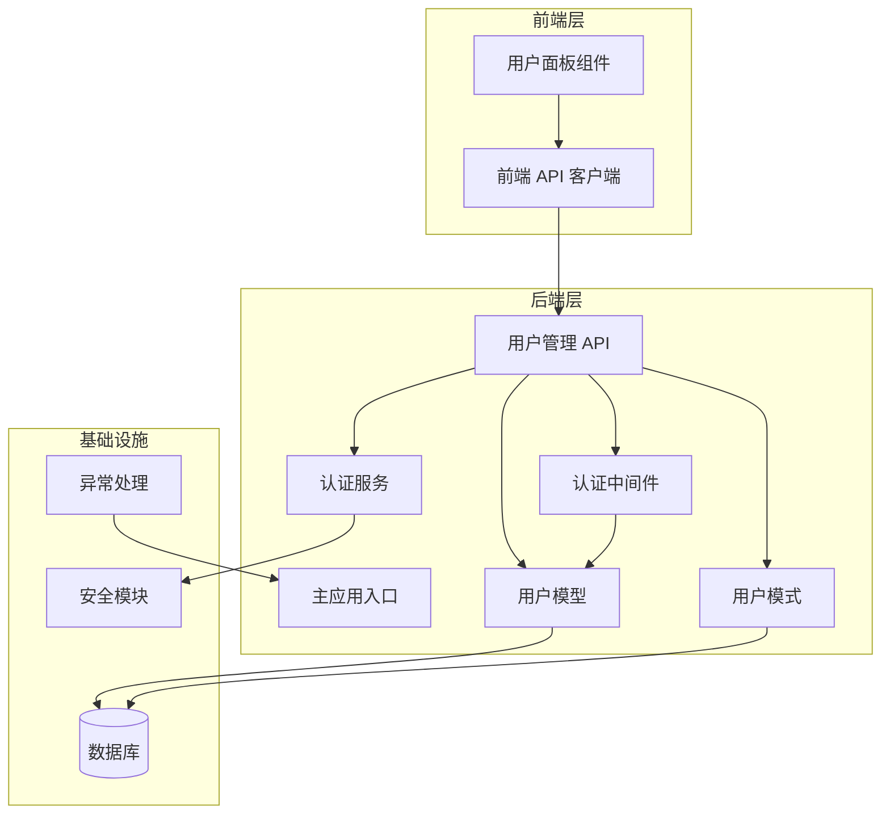
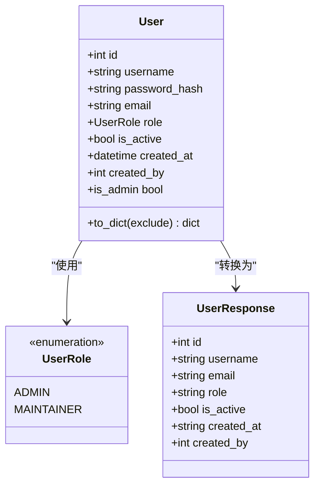
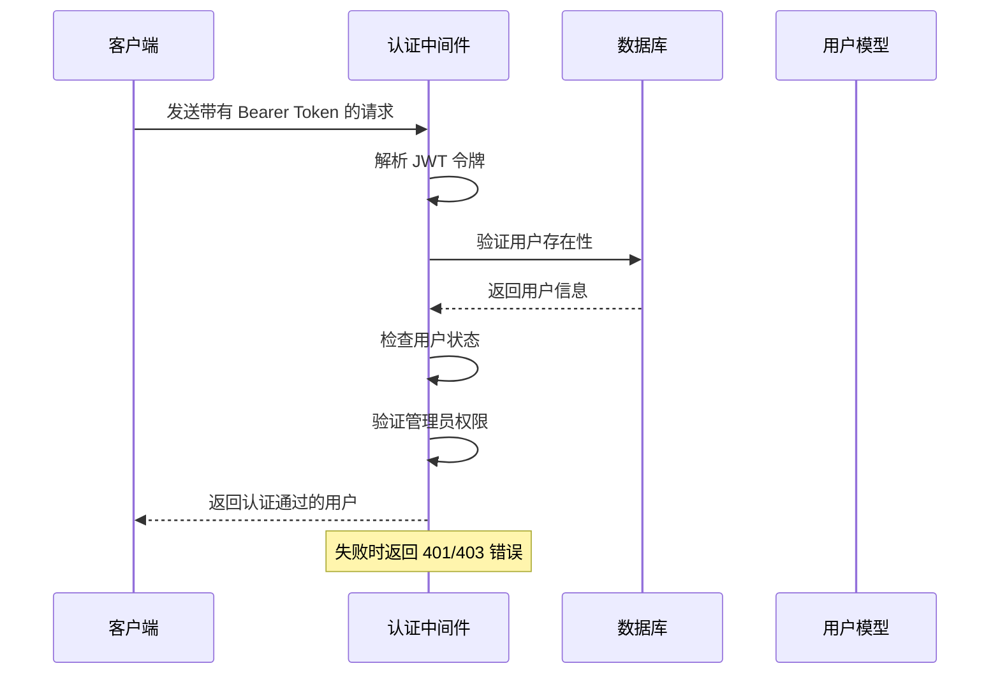
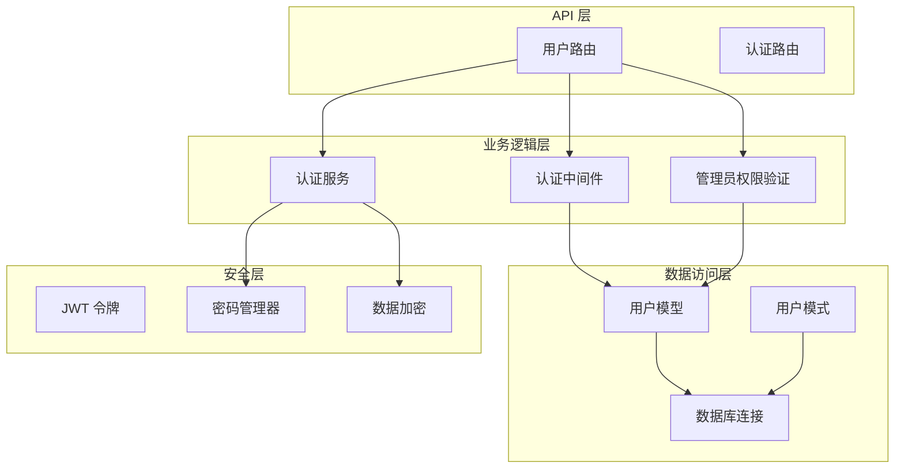
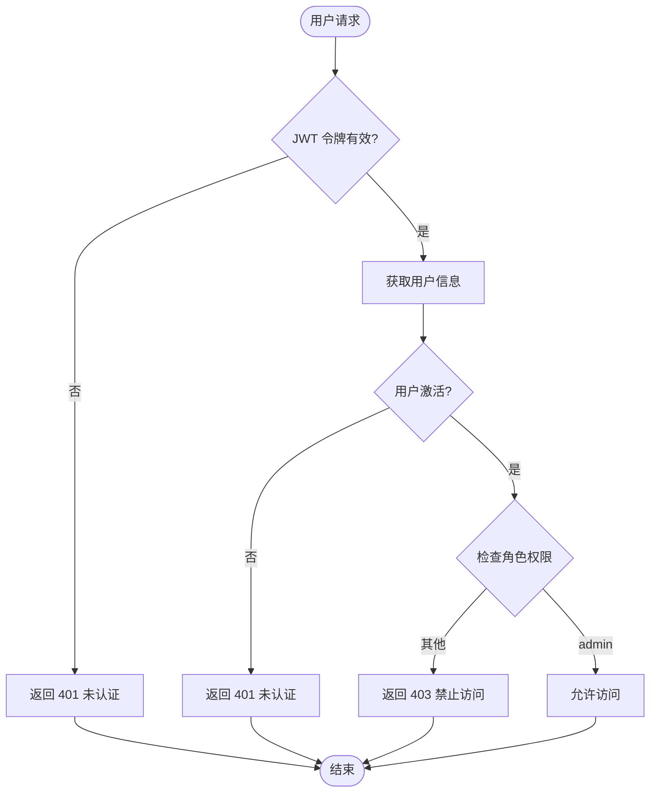
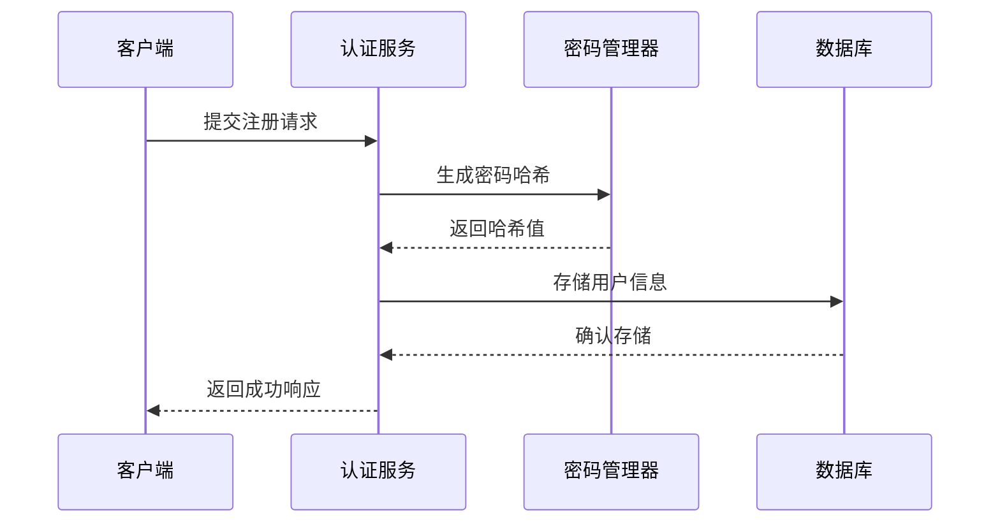

# 用户管理 API

<cite>
**本文档引用的文件**
- [backend/api/users.py](file://backend/api/users.py)
- [backend/models/user.py](file://backend/models/user.py)
- [backend/schemas/user.py](file://backend/schemas/user.py)
- [backend/middleware/auth.py](file://backend/middleware/auth.py)
- [backend/services/auth.py](file://backend/services/auth.py)
- [backend/core/security.py](file://backend/core/security.py)
- [backend/core/exceptions.py](file://backend/core/exceptions.py)
- [backend/core/error_handler.py](file://backend/core/error_handler.py)
- [backend/main.py](file://backend/main.py)
- [frontend/src/api/index.ts](file://frontend/src/api/index.ts)
- [frontend/src/components/admin/UserPanel.vue](file://frontend/src/components/admin/UserPanel.vue)
</cite>

## 目录
1. [简介](#简介)
2. [项目结构](#项目结构)
3. [核心组件](#核心组件)
4. [架构概览](#架构概览)
5. [详细组件分析](#详细组件分析)
6. [依赖关系分析](#依赖关系分析)
7. [性能考虑](#性能考虑)
8. [故障排除指南](#故障排除指南)
9. [结论](#结论)

## 简介

用户管理 API 是一个基于 FastAPI 构建的管理员专用用户管理系统，提供完整的用户 CRUD 操作、用户列表查询、用户状态管理和密码重置功能。该系统采用 JWT 令牌认证机制，确保只有具备管理员权限的用户才能访问这些功能。

本系统支持用户角色管理（管理员和维护者）、密码强度验证、用户状态控制等功能，为技能发现平台提供完善的用户管理能力。

## 项目结构

用户管理 API 在整体项目架构中的位置如下：



**图表来源**
- [backend/main.py](file://backend/main.py#L24-L84)
- [backend/api/users.py](file://backend/api/users.py#L1-L15)
- [backend/middleware/auth.py](file://backend/middleware/auth.py#L1-L25)

**章节来源**
- [backend/main.py](file://backend/main.py#L24-L84)
- [backend/api/users.py](file://backend/api/users.py#L1-L15)

## 核心组件

### 用户模型 (User Model)

用户模型定义了用户的基本属性和行为：



**图表来源**
- [backend/models/user.py](file://backend/models/user.py#L18-L52)
- [backend/schemas/user.py#L44-L54)

### 认证中间件 (Authentication Middleware)

认证中间件提供了 JWT 令牌验证和权限控制：



**图表来源**
- [backend/middleware/auth.py](file://backend/middleware/auth.py#L48-L96)
- [backend/middleware/auth.py](file://backend/middleware/auth.py#L98-L108)

**章节来源**
- [backend/models/user.py](file://backend/models/user.py#L18-L52)
- [backend/schemas/user.py](file://backend/schemas/user.py#L44-L54)
- [backend/middleware/auth.py](file://backend/middleware/auth.py#L48-L108)

## 架构概览

用户管理 API 采用分层架构设计，确保职责分离和代码可维护性：



**图表来源**
- [backend/api/users.py](file://backend/api/users.py#L14-L111)
- [backend/services/auth.py](file://backend/services/auth.py#L19-L130)
- [backend/core/security.py](file://backend/core/security.py#L12-L58)

## 详细组件分析

### 用户管理 API 端点

#### 1. 用户列表查询

**HTTP 方法**: GET  
**URL 路径**: `/api/admin/users`  
**权限要求**: 管理员 (ADMIN)  
**请求参数**: 无  
**响应格式**: JSON 数组，包含多个用户对象

**请求示例**:
```javascript
// 成功响应示例
[
  {
    "id": 1,
    "username": "admin",
    "email": "admin@example.com",
    "role": "admin",
    "is_active": true,
    "created_at": "2024-01-01T00:00:00",
    "created_by": null
  },
  {
    "id": 2,
    "username": "john_doe",
    "email": "john@example.com",
    "role": "maintainer",
    "is_active": true,
    "created_at": "2024-01-02T00:00:00",
    "created_by": 1
  }
]
```

**响应状态码**:
- 200 OK: 成功获取用户列表
- 401 Unauthorized: 未认证或令牌无效
- 403 Forbidden: 非管理员用户访问

#### 2. 创建用户

**HTTP 方法**: POST  
**URL 路径**: `/api/admin/users`  
**权限要求**: 管理员 (ADMIN)  
**请求参数**: UserCreate 模式

**请求体示例**:
```javascript
{
  "username": "jane_smith",
  "password": "SecurePass123",
  "email": "jane@example.com",
  "role": "maintainer"
}
```

**响应格式**: UserResponse 模式

**请求验证规则**:
- username: 3-50字符，仅允许字母数字、下划线、连字符
- password: 至少8字符，必须包含大写字母、小写字母和数字
- email: 可选的邮箱地址
- role: 仅允许 "admin" 或 "maintainer"

#### 3. 获取用户详情

**HTTP 方法**: GET  
**URL 路径**: `/api/admin/users/{user_id}`  
**权限要求**: 管理员 (ADMIN)  
**路径参数**: user_id (整数)

**响应格式**: UserResponse 模式

**错误处理**:
- 404 Not Found: 用户不存在

#### 4. 更新用户信息

**HTTP 方法**: PUT  
**URL 路径**: `/api/admin/users/{user_id}`  
**权限要求**: 管理员 (ADMIN)  
**路径参数**: user_id (整数)

**请求体示例**:
```javascript
{
  "email": "updated@example.com",
  "is_active": false
}
```

**响应格式**: UserResponse 模式

**业务逻辑约束**:
- 只能更新 email 和 is_active 字段
- 不允许修改用户名

#### 5. 删除用户

**HTTP 方法**: DELETE  
**URL 路径**: `/api/admin/users/{user_id}`  
**权限要求**: 管理员 (ADMIN)  
**路径参数**: user_id (整数)

**业务逻辑约束**:
- 管理员不能删除自己的账户
- 无法删除不存在的用户

#### 6. 重置用户密码

**HTTP 方法**: POST  
**URL 路径**: `/api/admin/users/{user_id}/reset-password`  
**权限要求**: 管理员 (ADMIN)  
**路径参数**: user_id (整数)

**请求体示例**:
```javascript
{
  "new_password": "NewSecurePass456"
}
```

**响应格式**: JSON 对象

**响应示例**:
```javascript
{
  "message": "Password reset successfully"
}
```

**章节来源**
- [backend/api/users.py](file://backend/api/users.py#L17-L106)
- [backend/schemas/user.py](file://backend/schemas/user.py#L14-L88)

### 数据验证规则

#### 用户创建验证

用户创建时的验证规则包括：

| 字段名 | 验证规则 | 错误消息 |
|--------|----------|----------|
| username | 3-50字符，仅允许字母数字、下划线、连字符 | Username validation error |
| password | 至少8字符，必须包含大写字母、小写字母和数字 | Password must contain at least one uppercase letter |
| email | 可选的邮箱地址 | Invalid email format |
| role | 仅允许 "admin" 或 "maintainer" | Invalid role |

#### 密码强度验证

密码必须满足以下条件：
- 至少8个字符
- 包含至少一个大写字母 (A-Z)
- 包含至少一个小写字母 (a-z)
- 包含至少一个数字 (0-9)

**章节来源**
- [backend/schemas/user.py](file://backend/schemas/user.py#L14-L88)
- [backend/services/auth.py](file://backend/services/auth.py#L28-L46)

### 权限控制机制

#### 角色权限体系

系统采用基于角色的权限控制 (RBAC)：



**图表来源**
- [backend/middleware/auth.py](file://backend/middleware/auth.py#L48-L108)

#### 管理员权限验证

管理员权限验证流程：

1. **令牌解析**: 验证 JWT 令牌的有效性和签名
2. **用户查找**: 根据令牌中的用户ID查找用户
3. **状态检查**: 确认用户账户处于激活状态
4. **角色验证**: 检查用户是否具有 ADMIN 角色
5. **权限授予**: 通过验证后允许执行管理员操作

**章节来源**
- [backend/middleware/auth.py](file://backend/middleware/auth.py#L98-L108)

### 安全特性

#### 密码管理

系统使用 Argon2 算法进行密码哈希：



**图表来源**
- [backend/services/auth.py](file://backend/services/auth.py#L22-L62)
- [backend/core/security.py](file://backend/core/security.py#L22-L28)

#### 敏感数据加密

系统支持敏感数据的对称加密，使用 Fernet 算法：

- **加密算法**: Fernet (基于 AES-128-CBC)
- **密钥管理**: 支持动态生成和环境变量配置
- **应用场景**: GitLab Token 等敏感配置信息

**章节来源**
- [backend/core/security.py](file://backend/core/security.py#L31-L58)

## 依赖关系分析

用户管理 API 的依赖关系图：

```mermaid
graph TB
subgraph "外部依赖"
FastAPI[FastAPI 框架]
SQLAlchemy[SQLAlchemy ORM]
JWT[jose JWT]
Pydantic[Pydantic 模式]
end
subgraph "内部模块"
UsersAPI[users.py]
AuthMiddleware[auth.py]
AuthServices[auth.py (服务层)]
UserModel[user.py]
UserSchema[user.py (模式)]
Security[security.py]
Exceptions[exceptions.py]
ErrorHandler[error_handler.py]
end
UsersAPI --> AuthMiddleware
UsersAPI --> AuthServices
UsersAPI --> UserModel
UsersAPI --> UserSchema
AuthMiddleware --> UserModel
AuthServices --> Security
AuthServices --> Exceptions
ErrorHandler --> Exceptions
UserModel --> SQLAlchemy
UserSchema --> Pydantic
AuthMiddleware --> JWT
UsersAPI --> FastAPI
```

**图表来源**
- [backend/api/users.py](file://backend/api/users.py#L4-L12)
- [backend/middleware/auth.py](file://backend/middleware/auth.py#L9-L16)
- [backend/services/auth.py](file://backend/services/auth.py#L4-L16)

**章节来源**
- [backend/api/users.py](file://backend/api/users.py#L4-L12)
- [backend/middleware/auth.py](file://backend/middleware/auth.py#L9-L16)
- [backend/services/auth.py](file://backend/services/auth.py#L4-L16)

## 性能考虑

### 查询优化

1. **索引策略**: 用户表的 username 字段已建立唯一索引，提高查询效率
2. **排序优化**: 默认按创建时间降序排列，使用数据库索引优化
3. **批量操作**: 支持一次性获取所有用户列表，减少网络往返

### 缓存策略

虽然当前实现未实现缓存，但建议在高并发场景下考虑：

- **用户列表缓存**: 缓存最近的用户列表查询结果
- **权限检查缓存**: 缓存用户的权限信息
- **令牌验证缓存**: 缓存已验证的 JWT 令牌

### 并发控制

1. **数据库连接池**: 使用异步 SQLAlchemy 连接池处理并发请求
2. **事务管理**: 每个操作都在独立的数据库事务中执行
3. **锁机制**: 避免用户重复创建和删除操作的竞态条件

## 故障排除指南

### 常见错误及解决方案

#### 认证相关错误

| 错误代码 | 错误原因 | 解决方案 |
|----------|----------|----------|
| 401 Unauthorized | 未提供有效的 JWT 令牌 | 检查 Authorization 头部格式 |
| 401 Unauthorized | 令牌过期或无效 | 重新登录获取新令牌 |
| 401 Unauthorized | 用户账户被禁用 | 联系管理员启用账户 |
| 403 Forbidden | 非管理员用户访问 | 确保用户具有 ADMIN 角色 |

#### 数据验证错误

| 错误代码 | 错误原因 | 解决方案 |
|----------|----------|----------|
| 422 Unprocessable Entity | 密码强度不足 | 确保密码包含大小写字母和数字 |
| 422 Unprocessable Entity | 用户名格式不正确 | 使用字母数字、下划线、连字符组合 |
| 409 Conflict | 用户名已存在 | 更换唯一的用户名 |
| 400 Bad Request | 尝试删除自己账户 | 使用其他管理员账户执行删除操作 |

#### 数据库相关错误

| 错误代码 | 错误原因 | 解决方案 |
|----------|----------|----------|
| 500 Internal Server Error | 数据库连接失败 | 检查数据库服务状态 |
| 404 Not Found | 用户不存在 | 验证用户 ID 是否正确 |

**章节来源**
- [backend/core/error_handler.py](file://backend/core/error_handler.py#L14-L101)
- [backend/core/exceptions.py](file://backend/core/exceptions.py#L7-L101)

### 日志记录

系统实现了全面的日志记录机制：

1. **认证日志**: 记录用户登录和权限验证事件
2. **操作日志**: 记录用户管理操作的详细信息
3. **错误日志**: 记录所有异常和错误信息
4. **性能日志**: 记录关键操作的执行时间和性能指标

**章节来源**
- [backend/core/error_handler.py](file://backend/core/error_handler.py#L85-L89)

## 结论

用户管理 API 提供了一个功能完整、安全可靠的管理员用户管理系统。其主要特点包括：

### 核心优势

1. **完整的 CRUD 功能**: 支持用户的所有基本操作
2. **严格的权限控制**: 基于角色的访问控制确保安全性
3. **强大的数据验证**: 多层次的数据验证保证数据完整性
4. **优雅的错误处理**: 统一的错误处理机制提供良好的用户体验
5. **现代化的安全实践**: 使用 JWT 令牌和强密码哈希算法

### 技术特色

- **异步架构**: 基于 FastAPI 的异步处理提升性能
- **类型安全**: 使用 Pydantic 模式确保数据类型安全
- **模块化设计**: 清晰的分层架构便于维护和扩展
- **全面测试**: 包含异常处理和边界情况的测试覆盖

### 扩展建议

1. **添加分页支持**: 实现用户列表的分页查询功能
2. **增加搜索过滤**: 支持按用户名、邮箱、角色等字段搜索
3. **批量操作**: 支持批量用户创建、更新和删除
4. **审计日志**: 记录所有用户管理操作的详细历史
5. **API 版本控制**: 为 API 接口添加版本管理

该系统为技能发现平台提供了坚实的基础，能够满足当前和未来用户管理的需求。