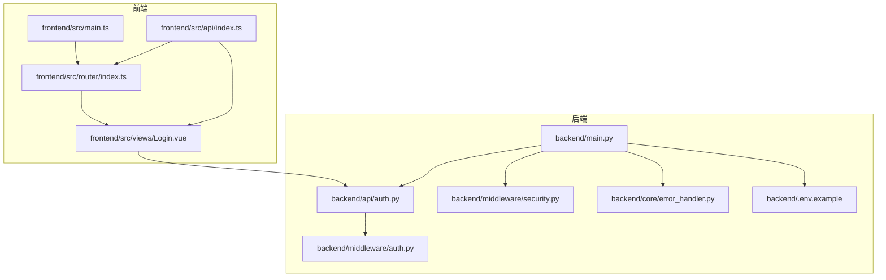
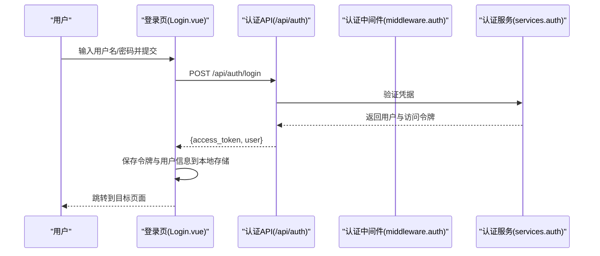
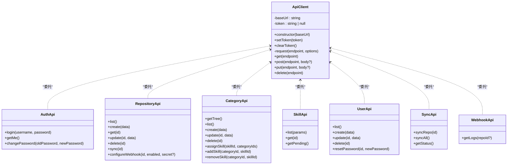
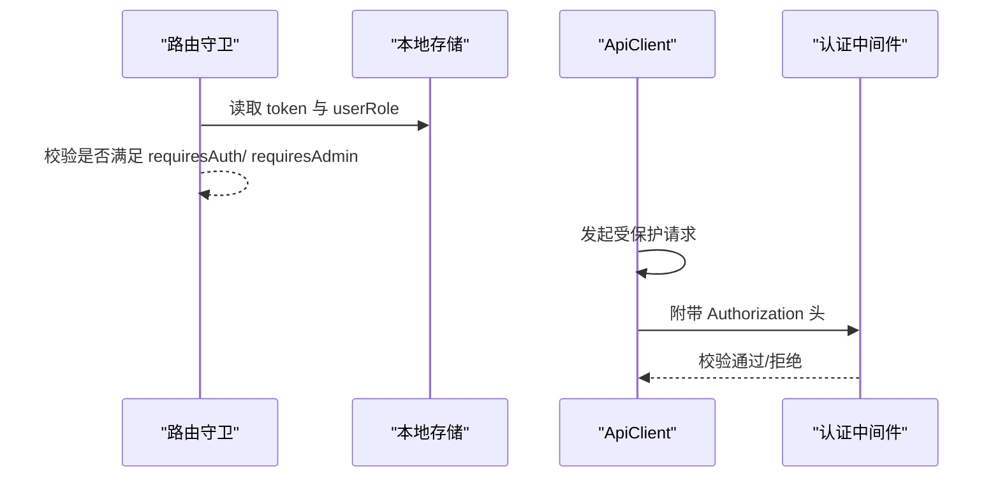
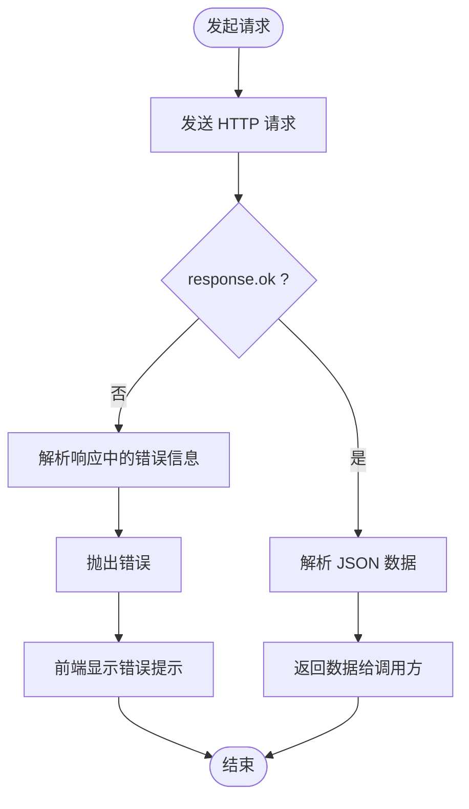
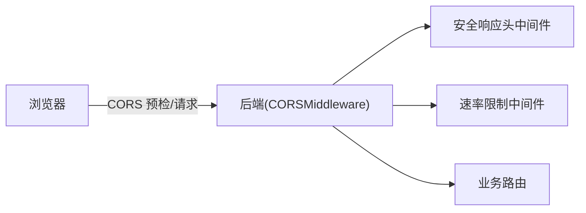
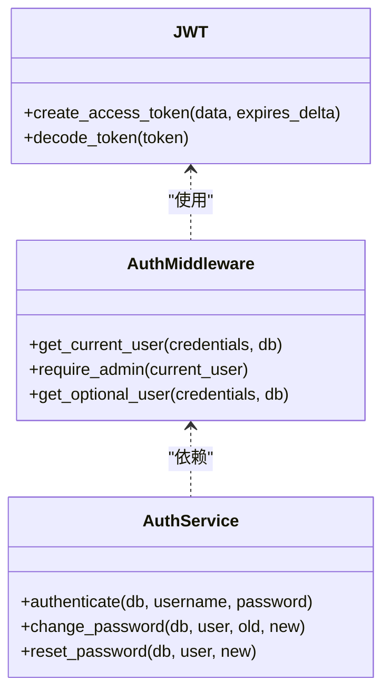
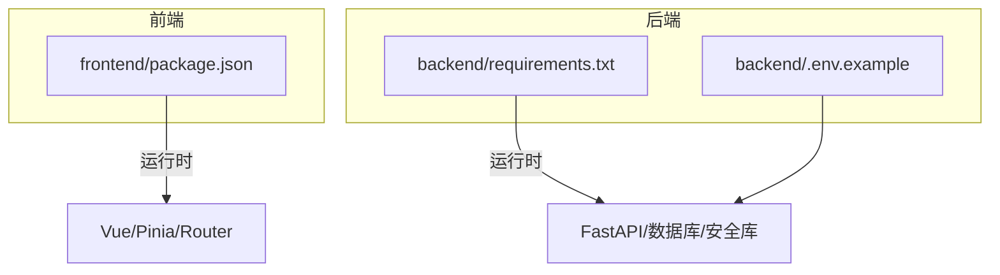

# API 客户端集成

<cite>
**本文引用的文件**
- [frontend/src/api/index.ts](file://frontend/src/api/index.ts)
- [frontend/src/router/index.ts](file://frontend/src/router/index.ts)
- [frontend/src/views/Login.vue](file://frontend/src/views/Login.vue)
- [frontend/src/main.ts](file://frontend/src/main.ts)
- [backend/main.py](file://backend/main.py)
- [backend/api/auth.py](file://backend/api/auth.py)
- [backend/middleware/auth.py](file://backend/middleware/auth.py)
- [backend/middleware/security.py](file://backend/middleware/security.py)
- [backend/core/error_handler.py](file://backend/core/error_handler.py)
- [backend/services/auth.py](file://backend/services/auth.py)
- [backend/.env.example](file://backend/.env.example)
- [backend/requirements.txt](file://backend/requirements.txt)
- [frontend/package.json](file://frontend/package.json)
</cite>

## 目录
1. [简介](#简介)
2. [项目结构](#项目结构)
3. [核心组件](#核心组件)
4. [架构总览](#架构总览)
5. [详细组件分析](#详细组件分析)
6. [依赖关系分析](#依赖关系分析)
7. [性能考虑](#性能考虑)
8. [故障排查指南](#故障排查指南)
9. [结论](#结论)
10. [附录](#附录)

## 简介
本文件面向开发者，系统性阐述 Skills Hub 前端与后端 API 的集成实现，涵盖：
- 前端 HTTP 客户端配置、请求与响应处理
- 认证状态管理、JWT 令牌的存储与使用
- 用户会话生命周期管理
- 错误处理机制、网络异常与用户提示
- API 类型定义、参数校验与响应数据处理
- 并发请求管理、缓存策略与性能优化
- 跨域处理、CORS 配置与安全头设置
- 开发调试、测试策略与部署注意事项

## 项目结构
前端采用 Vue 3 + TypeScript + Vite 构建，后端基于 FastAPI 提供 REST API，并通过中间件实现安全与限流控制。前端通过统一的 ApiClient 封装 HTTP 请求，路由守卫结合本地存储进行认证控制。

图表来源
- [frontend/src/main.ts](file://frontend/src/main.ts#L1-L12)
- [frontend/src/router/index.ts](file://frontend/src/router/index.ts#L1-L63)
- [frontend/src/api/index.ts](file://frontend/src/api/index.ts#L1-L224)
- [frontend/src/views/Login.vue](file://frontend/src/views/Login.vue#L1-L185)
- [backend/main.py](file://backend/main.py#L1-L137)
- [backend/api/auth.py](file://backend/api/auth.py#L1-L65)
- [backend/middleware/auth.py](file://backend/middleware/auth.py#L1-L134)
- [backend/middleware/security.py](file://backend/middleware/security.py#L1-L142)
- [backend/core/error_handler.py](file://backend/core/error_handler.py#L1-L102)
- [backend/.env.example](file://backend/.env.example#L1-L17)

章节来源
- [frontend/src/main.ts](file://frontend/src/main.ts#L1-L12)
- [frontend/src/router/index.ts](file://frontend/src/router/index.ts#L1-L63)
- [frontend/src/api/index.ts](file://frontend/src/api/index.ts#L1-L224)
- [backend/main.py](file://backend/main.py#L1-L137)

## 核心组件
- 前端 ApiClient：封装基础请求、自动注入 Authorization 头、统一错误抛出、支持 GET/POST/PUT/DELETE 方法。
- 认证 API：登录、获取当前用户、修改密码。
- 资源 API：仓库、分类、技能、用户、同步、Webhook 日志等。
- 路由守卫：基于本地存储的 token 与角色进行鉴权控制。
- 后端认证中间件：JWT 解析、用户解析、管理员权限校验。
- 安全中间件：安全响应头、请求日志、速率限制。
- 统一错误处理：自定义异常、验证错误、HTTP 异常与通用异常。

章节来源
- [frontend/src/api/index.ts](file://frontend/src/api/index.ts#L16-L84)
- [frontend/src/api/index.ts](file://frontend/src/api/index.ts#L88-L224)
- [frontend/src/router/index.ts](file://frontend/src/router/index.ts#L5-L24)
- [backend/middleware/auth.py](file://backend/middleware/auth.py#L48-L96)
- [backend/middleware/security.py](file://backend/middleware/security.py#L11-L28)
- [backend/middleware/security.py](file://backend/middleware/security.py#L107-L142)
- [backend/core/error_handler.py](file://backend/core/error_handler.py#L14-L102)

## 架构总览
前端通过 ApiClient 发起请求，后端通过中间件完成认证与安全控制，统一错误处理确保一致的错误响应格式。登录成功后，前端将 JWT 令牌保存至本地存储，并在后续请求中自动附加 Authorization 头。

图表来源
- [frontend/src/views/Login.vue](file://frontend/src/views/Login.vue#L59-L84)
- [backend/api/auth.py](file://backend/api/auth.py#L24-L40)
- [backend/services/auth.py](file://backend/services/auth.py#L64-L98)
- [backend/middleware/auth.py](file://backend/middleware/auth.py#L25-L33)

章节来源
- [frontend/src/views/Login.vue](file://frontend/src/views/Login.vue#L59-L84)
- [backend/api/auth.py](file://backend/api/auth.py#L24-L40)
- [backend/services/auth.py](file://backend/services/auth.py#L64-L98)
- [backend/middleware/auth.py](file://backend/middleware/auth.py#L25-L33)

## 详细组件分析

### 前端 ApiClient 与 API 封装
- 基础配置
  - 基础 URL 为 /api，构造函数从本地存储读取令牌。
  - setToken/clearToken 负责令牌的持久化与清理。
- 请求流程
  - request 方法统一设置 Content-Type 与 Authorization 头（若存在令牌）。
  - 使用 fetch 发送请求，解析 JSON 并根据 response.ok 抛出错误。
- 方法封装
  - 支持 get/post/put/delete，泛型返回值便于类型推断。
- API 模块
  - 认证 API：登录、获取当前用户、修改密码。
  - 仓库 API：列表、创建、查询、更新、删除、同步、配置 Webhook。
  - 分类 API：树形结构、列表、CRUD、技能分配与关联。
  - 技能 API：分页查询、详情、待同步列表。
  - 用户管理 API：列表、创建、更新、删除、重置密码。
  - 同步 API：按仓库同步、全部同步、状态查询。
  - Webhook API：日志查询（可选仓库过滤）。

图表来源
- [frontend/src/api/index.ts](file://frontend/src/api/index.ts#L16-L84)
- [frontend/src/api/index.ts](file://frontend/src/api/index.ts#L88-L224)

章节来源
- [frontend/src/api/index.ts](file://frontend/src/api/index.ts#L16-L84)
- [frontend/src/api/index.ts](file://frontend/src/api/index.ts#L88-L224)

### 认证流程与会话管理
- 登录
  - 前端调用认证 API，接收 access_token 与用户信息。
  - 通过 api.setToken 写入令牌；同时写入用户角色与用户名到本地存储。
- 路由守卫
  - 根据 meta.requiresAuth 与 requiresAdmin 控制访问。
  - 无令牌或非管理员角色将被重定向至登录或首页。
- 令牌使用
  - ApiClient 在每次请求中自动附加 Authorization: Bearer <token>。
- 令牌刷新策略
  - 当前实现未包含自动刷新逻辑；建议在后端提供 refresh token 或在前端实现基于过期时间的刷新机制（需扩展）。

图表来源
- [frontend/src/router/index.ts](file://frontend/src/router/index.ts#L5-L24)
- [frontend/src/api/index.ts](file://frontend/src/api/index.ts#L40-L47)
- [backend/middleware/auth.py](file://backend/middleware/auth.py#L48-L96)

章节来源
- [frontend/src/router/index.ts](file://frontend/src/router/index.ts#L5-L24)
- [frontend/src/views/Login.vue](file://frontend/src/views/Login.vue#L69-L78)
- [frontend/src/api/index.ts](file://frontend/src/api/index.ts#L26-L34)
- [backend/middleware/auth.py](file://backend/middleware/auth.py#L48-L96)

### 错误处理与用户提示
- 前端
  - request 方法在 response.ok 为假时抛出错误，错误消息来自后端响应中的 error.message。
  - 登录页在 catch 分支中显示错误信息，提升用户体验。
- 后端
  - 统一错误处理器将异常转换为标准化 JSON 响应，包含 code、message、details、timestamp 等字段。
  - 验证错误、HTTP 异常与通用异常分别处理，便于前端识别与展示。

图表来源
- [frontend/src/api/index.ts](file://frontend/src/api/index.ts#L36-L61)
- [backend/core/error_handler.py](file://backend/core/error_handler.py#L14-L102)

章节来源
- [frontend/src/api/index.ts](file://frontend/src/api/index.ts#L36-L61)
- [frontend/src/views/Login.vue](file://frontend/src/views/Login.vue#L79-L83)
- [backend/core/error_handler.py](file://backend/core/error_handler.py#L14-L102)

### 安全与 CORS
- CORS
  - 后端启用 CORSMiddleware，默认允许所有来源、方法与头部，生产环境应限制具体域名。
- 安全响应头
  - 添加 X-Content-Type-Options、X-Frame-Options、X-XSS-Protection、Strict-Transport-Security、Content-Security-Policy。
- 速率限制
  - 对 /api/auth/login 实施基于客户端 IP 的简单内存限流，超过阈值返回 429。

图表来源
- [backend/main.py](file://backend/main.py#L56-L63)
- [backend/middleware/security.py](file://backend/middleware/security.py#L11-L28)
- [backend/middleware/security.py](file://backend/middleware/security.py#L107-L142)

章节来源
- [backend/main.py](file://backend/main.py#L56-L63)
- [backend/middleware/security.py](file://backend/middleware/security.py#L11-L28)
- [backend/middleware/security.py](file://backend/middleware/security.py#L107-L142)

### 后端认证与授权
- JWT 配置
  - 使用 HS256 算法，密钥来自环境变量（示例文件提供默认值）。
  - 访问令牌有效期为 24 小时。
- 令牌创建与解码
  - create_access_token 生成令牌；decode_token 处理过期与无效场景。
- 用户解析
  - get_current_user 从 Authorization 头解析并加载用户，校验激活状态。
- 管理员权限
  - require_admin 校验用户角色为 admin。

图表来源
- [backend/middleware/auth.py](file://backend/middleware/auth.py#L25-L33)
- [backend/middleware/auth.py](file://backend/middleware/auth.py#L36-L45)
- [backend/middleware/auth.py](file://backend/middleware/auth.py#L48-L96)
- [backend/services/auth.py](file://backend/services/auth.py#L64-L98)

章节来源
- [backend/middleware/auth.py](file://backend/middleware/auth.py#L17-L21)
- [backend/middleware/auth.py](file://backend/middleware/auth.py#L25-L33)
- [backend/middleware/auth.py](file://backend/middleware/auth.py#L36-L45)
- [backend/middleware/auth.py](file://backend/middleware/auth.py#L48-L96)
- [backend/services/auth.py](file://backend/services/auth.py#L64-L98)

## 依赖关系分析
- 前端依赖
  - 运行时依赖 Vue 3、Vue Router、Pinia；构建工具为 Vite。
- 后端依赖
  - FastAPI、Uvicorn、SQLAlchemy、aiomysql、python-jose、passlib、cryptography、httpx、pydantic、slowapi 等。
- 环境变量
  - JWT_SECRET_KEY、ENCRYPTION_KEY、DATABASE_URL、ENVIRONMENT、DEBUG、PORT。

图表来源
- [frontend/package.json](file://frontend/package.json#L10-L18)
- [backend/requirements.txt](file://backend/requirements.txt#L1-L34)
- [backend/.env.example](file://backend/.env.example#L1-L17)

章节来源
- [frontend/package.json](file://frontend/package.json#L10-L18)
- [backend/requirements.txt](file://backend/requirements.txt#L1-L34)
- [backend/.env.example](file://backend/.env.example#L1-L17)

## 性能考虑
- 并发请求管理
  - 建议引入请求去重与并发上限控制，避免重复请求与资源争用。
- 缓存策略
  - 对只读数据（如公开分类树、技能列表）实施短期缓存，减少后端压力。
- 网络异常与重试
  - 对临时性错误（如 5xx、网络超时）实施指数退避重试，避免雪崩效应。
- 前端优化
  - 使用懒加载组件与路由，减少首屏体积；合理拆分包，启用压缩与预加载。
- 后端优化
  - 合理索引与查询优化；对热点接口增加缓存层；限制一次性返回的数据量。

## 故障排查指南
- 登录失败
  - 检查用户名/密码是否正确；确认后端日志与统一错误响应。
  - 前端捕获异常并显示错误信息，定位问题。
- 401 未认证
  - 确认本地存储是否存在 token；检查 ApiClient 是否正确附加 Authorization 头。
  - 核对后端认证中间件是否正常工作。
- 403 禁止访问
  - 确认用户角色为 admin；检查 require_admin 路由守卫。
- 429 请求过多
  - 检查速率限制配置；前端降低请求频率或增加重试间隔。
- CORS 问题
  - 确认后端允许的来源、方法与头部；前后端协议与端口一致。
- 500 内部错误
  - 查看后端日志与统一异常处理器输出，定位具体异常。

章节来源
- [frontend/src/views/Login.vue](file://frontend/src/views/Login.vue#L79-L83)
- [frontend/src/api/index.ts](file://frontend/src/api/index.ts#L40-L47)
- [backend/middleware/auth.py](file://backend/middleware/auth.py#L56-L70)
- [backend/middleware/security.py](file://backend/middleware/security.py#L115-L139)
- [backend/core/error_handler.py](file://backend/core/error_handler.py#L80-L102)

## 结论
本项目提供了清晰的前端 API 客户端封装与后端认证、安全与错误处理机制。通过本地存储管理令牌与路由守卫实现基本的会话控制。建议后续增强包括：后端提供刷新令牌、前端实现令牌自动刷新与请求去重、完善缓存与重试策略、细化 CORS 与安全头配置，以及加强测试与监控。

## 附录
- 开发调试
  - 前端：Vite 开发服务器热更新；后端：Uvicorn 热重载；统一日志输出便于定位问题。
- 测试策略
  - 单元测试：针对 ApiClient 方法与路由守卫逻辑；集成测试：端到端模拟登录与受保护路由访问。
- 部署注意事项
  - 生产环境必须设置 JWT_SECRET_KEY 与 ENCRYPTION_KEY；限制 CORS 来源；启用 HTTPS 与 HSTS；配置数据库连接与慢查询日志。