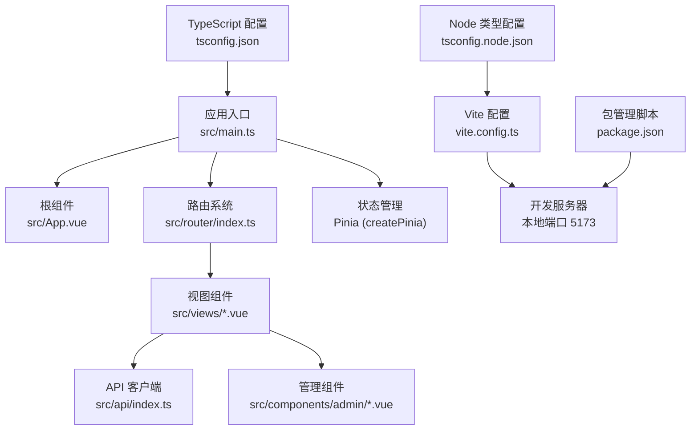
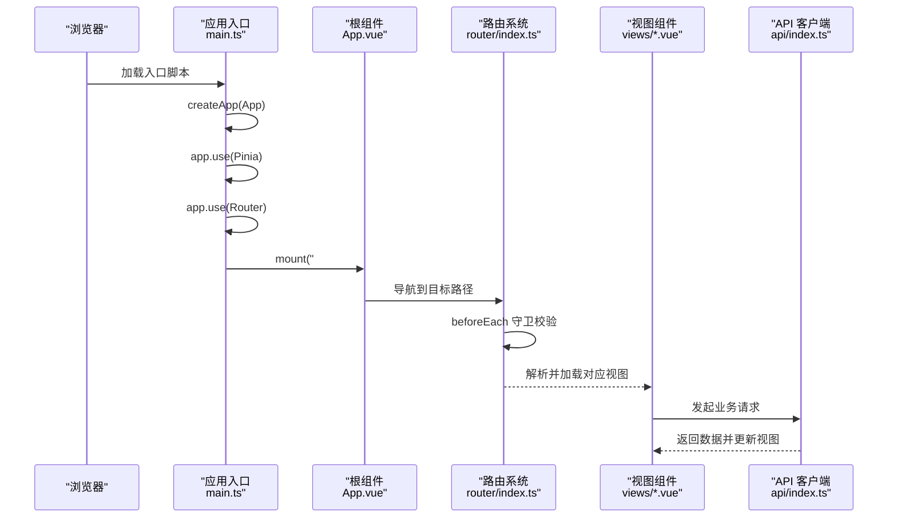
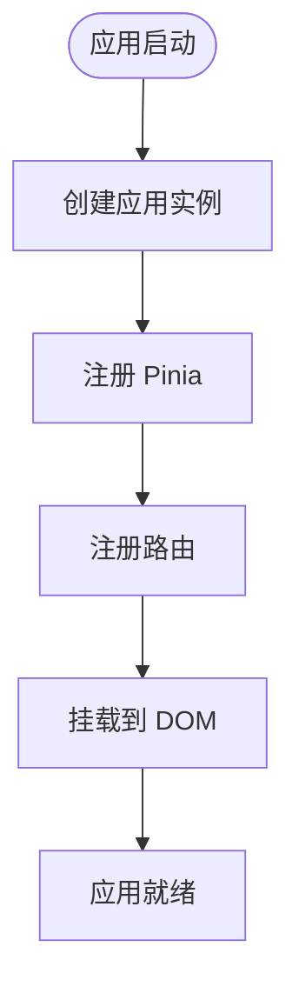
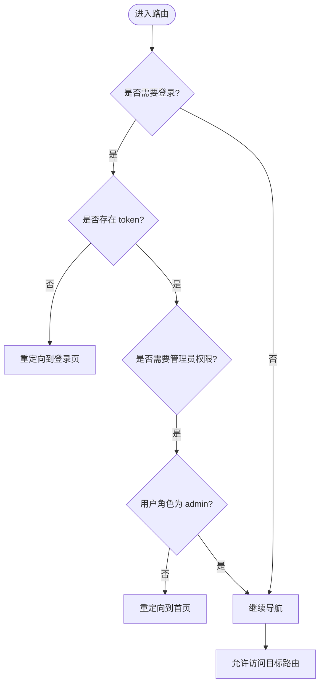
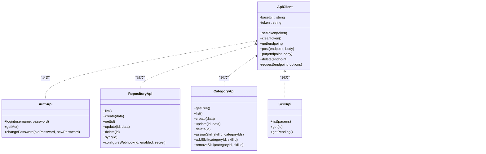
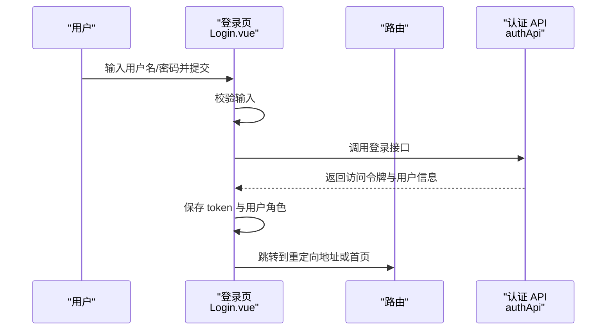
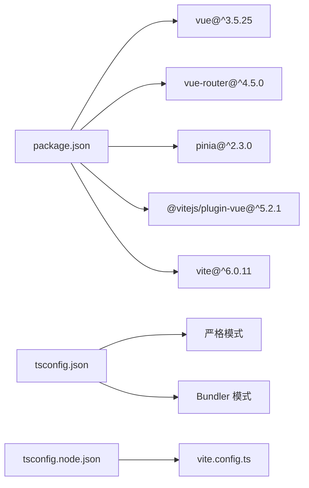

# Vue.js 应用架构

<cite>
**本文档引用的文件**
- [frontend/src/main.ts](file://frontend/src/main.ts)
- [frontend/src/App.vue](file://frontend/src/App.vue)
- [frontend/src/router/index.ts](file://frontend/src/router/index.ts)
- [frontend/vite.config.ts](file://frontend/vite.config.ts)
- [frontend/package.json](file://frontend/package.json)
- [frontend/tsconfig.json](file://frontend/tsconfig.json)
- [frontend/tsconfig.node.json](file://frontend/tsconfig.node.json)
- [frontend/src/views/Home.vue](file://frontend/src/views/Home.vue)
- [frontend/src/views/Login.vue](file://frontend/src/views/Login.vue)
- [frontend/src/views/admin/Dashboard.vue](file://frontend/src/views/admin/Dashboard.vue)
- [frontend/src/views/Category.vue](file://frontend/src/views/Category.vue)
- [frontend/src/views/Skill.vue](file://frontend/src/views/Skill.vue)
- [frontend/src/api/index.ts](file://frontend/src/api/index.ts)
- [frontend/src/components/admin/RepositoryPanel.vue](file://frontend/src/components/admin/RepositoryPanel.vue)
- [frontend/src/components/admin/CategoryPanel.vue](file://frontend/src/components/admin/CategoryPanel.vue)
</cite>

## 目录
1. [简介](#简介)
2. [项目结构](#项目结构)
3. [核心组件](#核心组件)
4. [架构总览](#架构总览)
5. [详细组件分析](#详细组件分析)
6. [依赖关系分析](#依赖关系分析)
7. [性能考虑](#性能考虑)
8. [故障排除指南](#故障排除指南)
9. [结论](#结论)

## 简介
本文件为 Skills Hub 的 Vue.js 前端应用架构文档，基于 Vue 3 + TypeScript 的现代化前端技术栈，采用 Vite 作为构建工具与开发服务器。文档围绕应用入口配置、路由系统、状态管理、API 客户端、组件设计与构建配置进行深入解析，并提供开发环境配置、热重载机制与性能优化策略，帮助开发者快速理解并高效维护该应用。

## 项目结构
前端项目位于 `frontend` 目录，采用按功能模块组织的目录结构：
- 应用入口与根组件：`src/main.ts`、`src/App.vue`
- 路由配置：`src/router/index.ts`
- 视图组件：`src/views/` 下的页面组件（Home、Login、Category、Skill、Admin Dashboard）
- API 客户端：`src/api/index.ts`
- 管理面板组件：`src/components/admin/`（RepositoryPanel、CategoryPanel 等）
- 构建与类型配置：`vite.config.ts`、`package.json`、`tsconfig.json`、`tsconfig.node.json`

**图表来源**
- [frontend/src/main.ts](file://frontend/src/main.ts#L1-L12)
- [frontend/src/App.vue](file://frontend/src/App.vue#L1-L31)
- [frontend/src/router/index.ts](file://frontend/src/router/index.ts#L1-L63)
- [frontend/src/api/index.ts](file://frontend/src/api/index.ts#L1-L224)
- [frontend/vite.config.ts](file://frontend/vite.config.ts#L1-L24)
- [frontend/package.json](file://frontend/package.json#L1-L20)
- [frontend/tsconfig.json](file://frontend/tsconfig.json#L1-L25)
- [frontend/tsconfig.node.json](file://frontend/tsconfig.node.json#L1-L16)

**章节来源**
- [frontend/src/main.ts](file://frontend/src/main.ts#L1-L12)
- [frontend/src/App.vue](file://frontend/src/App.vue#L1-L31)
- [frontend/src/router/index.ts](file://frontend/src/router/index.ts#L1-L63)
- [frontend/vite.config.ts](file://frontend/vite.config.ts#L1-L24)
- [frontend/package.json](file://frontend/package.json#L1-L20)
- [frontend/tsconfig.json](file://frontend/tsconfig.json#L1-L25)
- [frontend/tsconfig.node.json](file://frontend/tsconfig.node.json#L1-L16)

## 核心组件
本节聚焦应用启动、根组件、路由与 API 客户端的关键实现要点。

- 应用启动流程（main.ts）
  - 创建 Vue 应用实例并挂载根组件
  - 注册 Pinia 状态管理插件
  - 注册路由插件
  - 将应用挂载到 DOM 容器

- 根组件（App.vue）
  - 使用组合式 API 的生命周期钩子
  - 渲染全局路由视图容器

- 路由系统（router/index.ts）
  - 基于 History 模式的路由配置
  - 全局前置守卫实现鉴权与管理员权限控制
  - 动态导入视图组件，支持代码分割

- API 客户端（api/index.ts）
  - 统一封装请求方法（GET/POST/PUT/DELETE）
  - 自动处理 Authorization 头与错误响应
  - 提供认证、仓库、分类、技能、用户、同步、Webhook 等业务 API 接口

**章节来源**
- [frontend/src/main.ts](file://frontend/src/main.ts#L1-L12)
- [frontend/src/App.vue](file://frontend/src/App.vue#L7-L14)
- [frontend/src/router/index.ts](file://frontend/src/router/index.ts#L1-L63)
- [frontend/src/api/index.ts](file://frontend/src/api/index.ts#L16-L84)

## 架构总览
下图展示了应用启动到页面渲染的端到端流程，以及路由守卫在导航过程中的作用。

**图表来源**
- [frontend/src/main.ts](file://frontend/src/main.ts#L6-L11)
- [frontend/src/App.vue](file://frontend/src/App.vue#L1-L5)
- [frontend/src/router/index.ts](file://frontend/src/router/index.ts#L55-L62)
- [frontend/src/views/Home.vue](file://frontend/src/views/Home.vue#L88-L102)
- [frontend/src/api/index.ts](file://frontend/src/api/index.ts#L63-L84)

## 详细组件分析

### 应用启动与根组件
- 启动流程
  - 在入口文件中创建应用实例，注册 Pinia 与路由，最后挂载到 DOM
  - 根组件通过 `<router-view />` 承载所有路由视图
- 生命周期
  - 根组件使用组合式 API 的生命周期钩子，便于在应用初始化时执行日志输出等逻辑

**图表来源**
- [frontend/src/main.ts](file://frontend/src/main.ts#L6-L11)
- [frontend/src/App.vue](file://frontend/src/App.vue#L10-L13)

**章节来源**
- [frontend/src/main.ts](file://frontend/src/main.ts#L1-L12)
- [frontend/src/App.vue](file://frontend/src/App.vue#L7-L14)

### 路由系统与导航守卫
- 路由配置
  - 使用 History 模式，定义首页、分类、技能详情、管理员面板、登录页等路由
  - 通过动态导入实现按需加载视图组件
- 导航守卫
  - 基于 meta 字段判断是否需要登录或管理员权限
  - 从本地存储读取 token 与用户角色，未满足条件则重定向至登录页或首页

**图表来源**
- [frontend/src/router/index.ts](file://frontend/src/router/index.ts#L4-L24)

**章节来源**
- [frontend/src/router/index.ts](file://frontend/src/router/index.ts#L1-L63)

### API 客户端与业务接口
- 设计模式
  - 封装统一的请求方法，自动处理 Content-Type 与 Authorization 头
  - 错误响应统一抛出异常，便于在视图层捕获与提示
- 接口分组
  - 认证相关：登录、当前用户、修改密码
  - 仓库管理：列表、创建、查询、更新、删除、同步、配置 Webhook
  - 分类管理：树形结构、列表、创建、更新、删除、技能关联
  - 技能查询：分页、筛选、待同步状态
  - 用户管理：列表、创建、更新、删除、重置密码
  - 同步与 Webhook 日志：触发同步、批量同步、状态查询、日志查询

**图表来源**
- [frontend/src/api/index.ts](file://frontend/src/api/index.ts#L16-L84)
- [frontend/src/api/index.ts](file://frontend/src/api/index.ts#L89-L102)
- [frontend/src/api/index.ts](file://frontend/src/api/index.ts#L105-L127)
- [frontend/src/api/index.ts](file://frontend/src/api/index.ts#L129-L155)
- [frontend/src/api/index.ts](file://frontend/src/api/index.ts#L158-L183)
- [frontend/src/api/index.ts](file://frontend/src/api/index.ts#L186-L202)
- [frontend/src/api/index.ts](file://frontend/src/api/index.ts#L205-L215)
- [frontend/src/api/index.ts](file://frontend/src/api/index.ts#L218-L223)

**章节来源**
- [frontend/src/api/index.ts](file://frontend/src/api/index.ts#L1-L224)

### 视图组件与交互流程

#### 登录页（Login.vue）
- 表单输入与提交
  - 使用受控组件收集用户名与密码
  - 提交后调用认证 API 获取访问令牌
  - 成功后保存 token 与用户角色，根据重定向参数跳转
- 错误处理
  - 输入校验与异常捕获，统一显示错误消息

**图表来源**
- [frontend/src/views/Login.vue](file://frontend/src/views/Login.vue#L59-L84)
- [frontend/src/api/index.ts](file://frontend/src/api/index.ts#L89-L102)

**章节来源**
- [frontend/src/views/Login.vue](file://frontend/src/views/Login.vue#L1-L185)
- [frontend/src/api/index.ts](file://frontend/src/api/index.ts#L89-L102)

#### 主页（Home.vue）
- 数据加载
  - 组件挂载后通过 API 获取分类列表并展示
- 视觉风格
  - CLI 风格终端界面，包含快速导航与分类预览

**章节来源**
- [frontend/src/views/Home.vue](file://frontend/src/views/Home.vue#L88-L102)
- [frontend/src/api/index.ts](file://frontend/src/api/index.ts#L63-L84)

#### 分类页（Category.vue）
- 功能特性
  - 展示分类树，支持展开/折叠与子分类查看
  - 根据选中分类加载技能列表
  - 支持通过路由参数直接定位到指定分类
- 交互行为
  - 点击分类项切换展开状态并加载技能
  - 点击技能项跳转到技能详情页

**章节来源**
- [frontend/src/views/Category.vue](file://frontend/src/views/Category.vue#L60-L140)
- [frontend/src/api/index.ts](file://frontend/src/api/index.ts#L63-L84)

#### 技能详情页（Skill.vue）
- 功能特性
  - 通过路由参数获取技能 ID 并加载详情
  - 展示技能路径、描述、仓库信息、分类标签等
- 交互行为
  - 提供返回上一页的导航链接

**章节来源**
- [frontend/src/views/Skill.vue](file://frontend/src/views/Skill.vue#L82-L100)
- [frontend/src/api/index.ts](file://frontend/src/api/index.ts#L63-L84)

#### 管理面板（Dashboard.vue）
- 功能特性
  - 标签页切换：仓库管理、分类管理、用户管理（仅管理员可见）
  - 用户信息展示与退出登录
- 交互行为
  - 点击标签页切换内容区域
  - 点击退出按钮清除本地存储并跳转到登录页

**章节来源**
- [frontend/src/views/admin/Dashboard.vue](file://frontend/src/views/admin/Dashboard.vue#L58-L76)

### 管理组件

#### 仓库面板（RepositoryPanel.vue）
- 功能特性
  - 列表展示仓库信息，支持同步、编辑、删除操作
  - 新增仓库对话框，支持 GitHub/GitLab 类型选择
- 交互行为
  - 表单提交后刷新列表，异常时弹窗提示

**章节来源**
- [frontend/src/components/admin/RepositoryPanel.vue](file://frontend/src/components/admin/RepositoryPanel.vue#L106-L191)
- [frontend/src/api/index.ts](file://frontend/src/api/index.ts#L105-L127)

#### 分类面板（CategoryPanel.vue）
- 功能特性
  - 展示分类树，支持新增、编辑、删除操作
  - 将树形结构扁平化用于父级选择
- 交互行为
  - 表单提交后刷新树形与扁平列表

**章节来源**
- [frontend/src/components/admin/CategoryPanel.vue](file://frontend/src/components/admin/CategoryPanel.vue#L78-L157)
- [frontend/src/api/index.ts](file://frontend/src/api/index.ts#L129-L155)

## 依赖关系分析
- 包管理与运行脚本
  - 依赖：Vue 3、Vue Router 4、Pinia
  - 开发依赖：Vite、@vitejs/plugin-vue
  - 脚本：dev、build、preview
- TypeScript 配置
  - 浏览器侧：启用严格模式、Bundler 模式、禁止输出 JS
  - Node 侧：仅包含 Vite 配置文件，严格模式

**图表来源**
- [frontend/package.json](file://frontend/package.json#L10-L19)
- [frontend/tsconfig.json](file://frontend/tsconfig.json#L2-L22)
- [frontend/tsconfig.node.json](file://frontend/tsconfig.node.json#L2-L13)

**章节来源**
- [frontend/package.json](file://frontend/package.json#L1-L20)
- [frontend/tsconfig.json](file://frontend/tsconfig.json#L1-L25)
- [frontend/tsconfig.node.json](file://frontend/tsconfig.node.json#L1-L16)

## 性能考虑
- 代码分割与懒加载
  - 路由视图组件采用动态导入，减少首屏体积
- 构建输出
  - 生产构建输出目录为 dist，保持输出目录清理
- 开发体验
  - 开发服务器端口 5173，代理 /api 与 /webhooks 到后端服务，提升联调效率
- 类型安全
  - TypeScript 严格模式与严格未使用检查，降低运行时风险

**章节来源**
- [frontend/src/router/index.ts](file://frontend/src/router/index.ts#L30-L52)
- [frontend/vite.config.ts](file://frontend/vite.config.ts#L19-L22)
- [frontend/tsconfig.json](file://frontend/tsconfig.json#L18-L21)

## 故障排除指南
- 登录失败
  - 检查认证 API 返回的错误消息，确认用户名与密码格式
  - 确认本地存储中 token 是否正确写入
- 无法访问受保护路由
  - 检查本地存储中的 token 与用户角色
  - 确认路由 meta 中的 requiresAuth 与 requiresAdmin 配置
- 请求失败
  - 查看 API 客户端对非 2xx 响应的错误抛出逻辑
  - 确认后端服务地址与代理配置是否正确
- 构建或开发问题
  - 确认 Node 版本与依赖安装
  - 检查 tsconfig 与 tsconfig.node 的编译选项

**章节来源**
- [frontend/src/views/Login.vue](file://frontend/src/views/Login.vue#L69-L84)
- [frontend/src/router/index.ts](file://frontend/src/router/index.ts#L4-L24)
- [frontend/src/api/index.ts](file://frontend/src/api/index.ts#L56-L61)
- [frontend/vite.config.ts](file://frontend/vite.config.ts#L6-L18)

## 结论
Skills Hub 的前端架构以 Vue 3 + TypeScript 为核心，结合 Pinia、Vue Router 与 Vite，实现了清晰的模块化与良好的开发体验。通过全局路由守卫保障安全性，通过统一 API 客户端简化网络层调用，配合 CLI 风格的视图组件提升用户体验。建议在后续迭代中进一步完善管理组件的编辑与删除功能、增强错误边界与加载状态、探索缓存策略与性能监控，持续提升应用稳定性与可维护性。