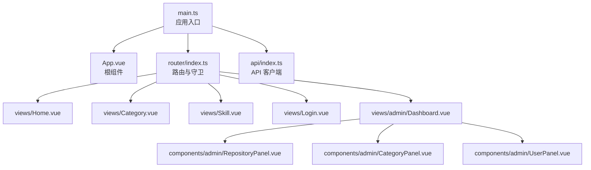
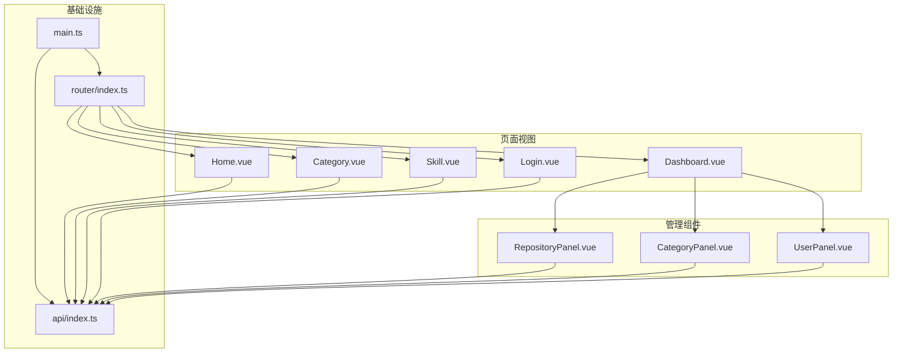
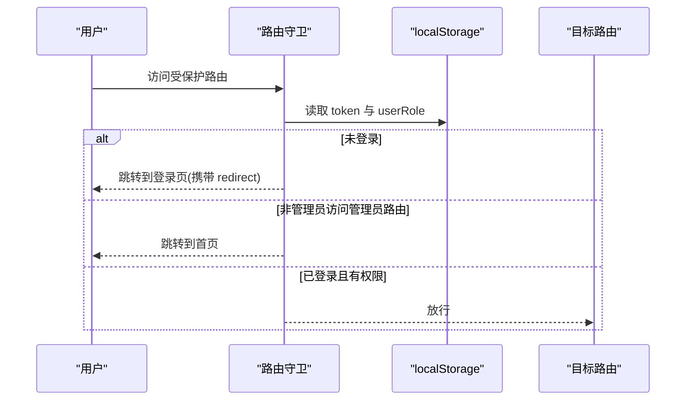
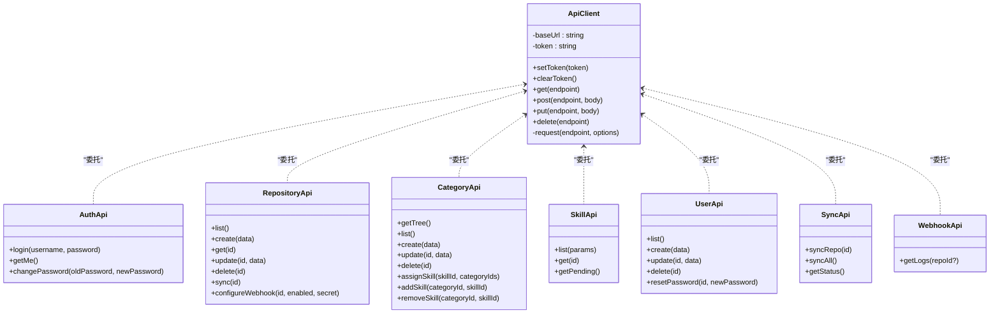
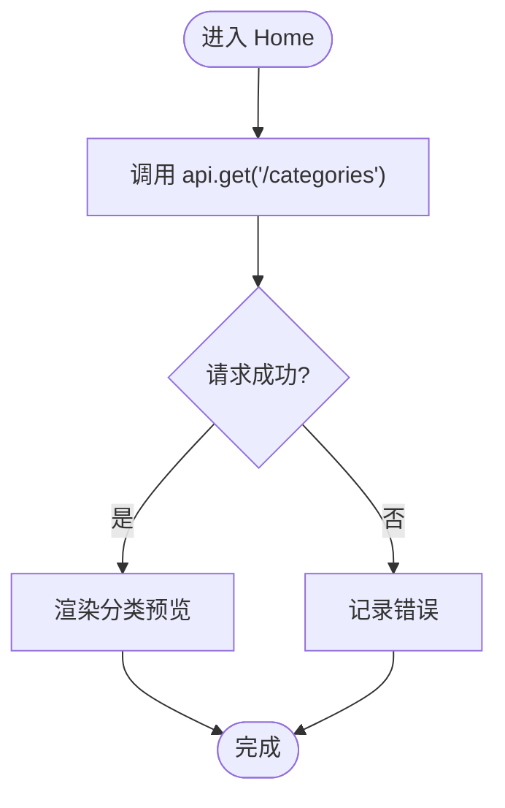
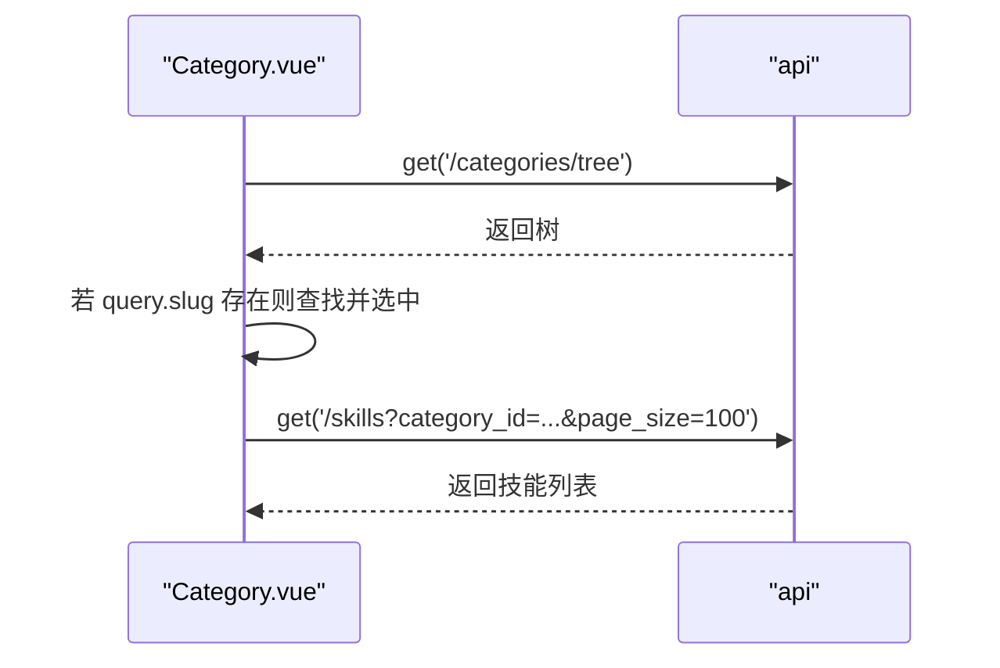
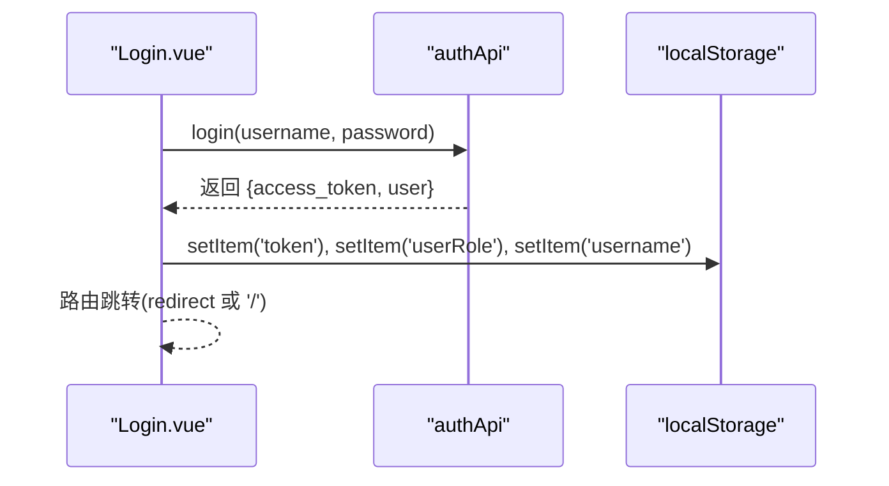
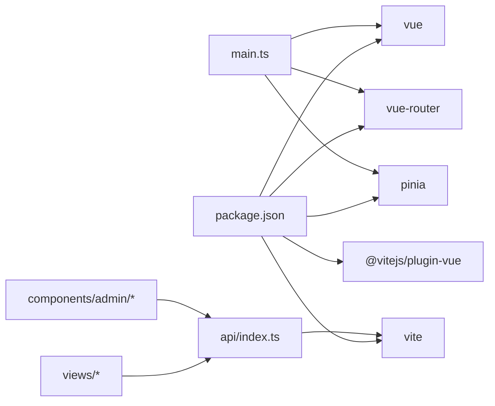

# 前端开发

<cite>
**本文引用的文件**
- [frontend/src/main.ts](file://frontend/src/main.ts)
- [frontend/src/App.vue](file://frontend/src/App.vue)
- [frontend/src/router/index.ts](file://frontend/src/router/index.ts)
- [frontend/src/api/index.ts](file://frontend/src/api/index.ts)
- [frontend/src/views/Home.vue](file://frontend/src/views/Home.vue)
- [frontend/src/views/Category.vue](file://frontend/src/views/Category.vue)
- [frontend/src/views/Skill.vue](file://frontend/src/views/Skill.vue)
- [frontend/src/views/Login.vue](file://frontend/src/views/Login.vue)
- [frontend/src/views/admin/Dashboard.vue](file://frontend/src/views/admin/Dashboard.vue)
- [frontend/src/components/admin/RepositoryPanel.vue](file://frontend/src/components/admin/RepositoryPanel.vue)
- [frontend/src/components/admin/CategoryPanel.vue](file://frontend/src/components/admin/CategoryPanel.vue)
- [frontend/src/components/admin/UserPanel.vue](file://frontend/src/components/admin/UserPanel.vue)
- [frontend/vite.config.ts](file://frontend/vite.config.ts)
- [frontend/package.json](file://frontend/package.json)
- [frontend/tsconfig.json](file://frontend/tsconfig.json)
</cite>

## 目录
1. [简介](#简介)
2. [项目结构](#项目结构)
3. [核心组件](#核心组件)
4. [架构总览](#架构总览)
5. [组件详解](#组件详解)
6. [依赖关系分析](#依赖关系分析)
7. [性能与构建优化](#性能与构建优化)
8. [故障排查指南](#故障排查指南)
9. [结论](#结论)
10. [附录](#附录)

## 简介
本文件面向 Skills Hub 前端团队，系统化梳理基于 Vue 3 + TypeScript 的现代化前端架构，覆盖应用入口、路由与守卫、API 客户端、认证与权限、页面组件设计、组件体系、样式与响应式、开发与构建流程等。文档同时提供组件开发指南、样式定制方案与最佳实践，帮助新成员快速上手并保持一致的开发体验。

## 项目结构
前端采用 Vite + Vue 3 + TypeScript 构建，使用 Pinia 进行状态管理，Vue Router 提供路由与导航。API 客户端封装统一的请求与鉴权逻辑，并按领域拆分模块化接口。

图表来源
- [frontend/src/main.ts](file://frontend/src/main.ts#L1-L12)
- [frontend/src/App.vue](file://frontend/src/App.vue#L1-L31)
- [frontend/src/router/index.ts](file://frontend/src/router/index.ts#L1-L63)
- [frontend/src/api/index.ts](file://frontend/src/api/index.ts#L1-L224)
- [frontend/src/views/Home.vue](file://frontend/src/views/Home.vue#L1-L230)
- [frontend/src/views/Category.vue](file://frontend/src/views/Category.vue#L1-L226)
- [frontend/src/views/Skill.vue](file://frontend/src/views/Skill.vue#L1-L205)
- [frontend/src/views/Login.vue](file://frontend/src/views/Login.vue#L1-L185)
- [frontend/src/views/admin/Dashboard.vue](file://frontend/src/views/admin/Dashboard.vue#L1-L163)
- [frontend/src/components/admin/RepositoryPanel.vue](file://frontend/src/components/admin/RepositoryPanel.vue#L1-L362)
- [frontend/src/components/admin/CategoryPanel.vue](file://frontend/src/components/admin/CategoryPanel.vue#L1-L283)
- [frontend/src/components/admin/UserPanel.vue](file://frontend/src/components/admin/UserPanel.vue#L1-L331)

章节来源
- [frontend/src/main.ts](file://frontend/src/main.ts#L1-L12)
- [frontend/src/App.vue](file://frontend/src/App.vue#L1-L31)
- [frontend/src/router/index.ts](file://frontend/src/router/index.ts#L1-L63)
- [frontend/src/api/index.ts](file://frontend/src/api/index.ts#L1-L224)

## 核心组件
- 应用入口与依赖注入
  - 在入口中注册 Pinia 与路由，挂载应用实例。
- 根组件
  - 提供全局样式与基础布局容器。
- 路由与守卫
  - 统一处理登录态与管理员权限校验，支持查询参数重定向。
- API 客户端
  - 封装通用请求方法、鉴权头设置、错误抛出与各领域 API 模块化导出。

章节来源
- [frontend/src/main.ts](file://frontend/src/main.ts#L1-L12)
- [frontend/src/App.vue](file://frontend/src/App.vue#L1-L31)
- [frontend/src/router/index.ts](file://frontend/src/router/index.ts#L4-L24)
- [frontend/src/api/index.ts](file://frontend/src/api/index.ts#L16-L86)

## 架构总览
前端采用“页面视图 + 管理组件”的分层设计：
- 页面视图层：Home、Category、Skill、Login、Admin Dashboard
- 管理组件层：RepositoryPanel、CategoryPanel、UserPanel
- 基础设施：API 客户端、路由守卫、状态持久化

图表来源
- [frontend/src/router/index.ts](file://frontend/src/router/index.ts#L26-L53)
- [frontend/src/api/index.ts](file://frontend/src/api/index.ts#L88-L224)
- [frontend/src/views/Home.vue](file://frontend/src/views/Home.vue#L88-L102)
- [frontend/src/views/Category.vue](file://frontend/src/views/Category.vue#L60-L140)
- [frontend/src/views/Skill.vue](file://frontend/src/views/Skill.vue#L82-L100)
- [frontend/src/views/Login.vue](file://frontend/src/views/Login.vue#L46-L85)
- [frontend/src/views/admin/Dashboard.vue](file://frontend/src/views/admin/Dashboard.vue#L58-L76)
- [frontend/src/components/admin/RepositoryPanel.vue](file://frontend/src/components/admin/RepositoryPanel.vue#L106-L191)
- [frontend/src/components/admin/CategoryPanel.vue](file://frontend/src/components/admin/CategoryPanel.vue#L78-L157)
- [frontend/src/components/admin/UserPanel.vue](file://frontend/src/components/admin/UserPanel.vue#L89-L157)

## 组件详解

### 路由与导航
- 路由定义
  - 首页、分类、技能详情、登录、管理员仪表盘。
- 导航守卫
  - 支持 requiresAuth 与 requiresAdmin 元信息，结合 localStorage 中的 token 与 userRole 进行鉴权与跳转。
  - 登录成功后根据查询参数 redirect 进行回跳。

图表来源
- [frontend/src/router/index.ts](file://frontend/src/router/index.ts#L4-L24)

章节来源
- [frontend/src/router/index.ts](file://frontend/src/router/index.ts#L26-L53)
- [frontend/src/router/index.ts](file://frontend/src/router/index.ts#L4-L24)

### API 客户端与认证
- API 客户端
  - 统一封装 GET/POST/PUT/DELETE 方法，自动注入 Authorization 头。
  - 统一错误处理：非 2xx 抛出错误，便于在视图层捕获。
- 认证模块
  - 登录：调用 /auth/login 获取 access_token 并持久化 token 与用户角色。
  - 个人信息：/auth/me。
  - 修改密码：/auth/change-password。
- 领域 API
  - 仓库：列表、创建、更新、删除、同步、Webhook 配置。
  - 分类：树形结构、增删改、技能分配与移除。
  - 技能：分页列表、详情、待同步列表。
  - 用户：列表、创建、更新、删除、重置密码。
  - 同步：单仓同步、全量同步、状态查询。
  - Webhook 日志：按仓库过滤。

图表来源
- [frontend/src/api/index.ts](file://frontend/src/api/index.ts#L16-L86)
- [frontend/src/api/index.ts](file://frontend/src/api/index.ts#L88-L224)

章节来源
- [frontend/src/api/index.ts](file://frontend/src/api/index.ts#L16-L86)
- [frontend/src/api/index.ts](file://frontend/src/api/index.ts#L88-L224)

### 页面组件设计

#### 主页 Home
- 功能要点
  - 加载分类树并预览前 N 项，点击进入分类页。
  - 使用终端风格样式，增强沉浸感。
- 数据流
  - mounted 时通过 api.get('/categories') 获取数据，异常记录日志。

图表来源
- [frontend/src/views/Home.vue](file://frontend/src/views/Home.vue#L94-L101)

章节来源
- [frontend/src/views/Home.vue](file://frontend/src/views/Home.vue#L1-L230)

#### 分类页 Category
- 功能要点
  - 加载分类树，支持展开/折叠子分类。
  - 通过查询参数 slug 自动定位并加载对应分类下的技能列表。
  - 点击技能跳转详情页。
- 数据流
  - mounted -> 加载树 -> 若存在 slug -> 查找并选中 -> 加载技能。

图表来源
- [frontend/src/views/Category.vue](file://frontend/src/views/Category.vue#L74-L122)

章节来源
- [frontend/src/views/Category.vue](file://frontend/src/views/Category.vue#L1-L226)

#### 技能详情页 Skill
- 功能要点
  - 通过路由参数 id 获取技能详情。
  - 展示仓库名、README 链接、分类标签等元信息。
- 错误处理
  - 异常时记录日志并提示“未找到”。

章节来源
- [frontend/src/views/Skill.vue](file://frontend/src/views/Skill.vue#L82-L100)

#### 登录页 Login
- 功能要点
  - 表单输入用户名/密码，提交后调用 authApi.login。
  - 成功后保存 token 与用户角色，根据 redirect 回跳。
- 错误处理
  - 输入校验与异常消息提示。

图表来源
- [frontend/src/views/Login.vue](file://frontend/src/views/Login.vue#L59-L84)
- [frontend/src/api/index.ts](file://frontend/src/api/index.ts#L89-L102)

章节来源
- [frontend/src/views/Login.vue](file://frontend/src/views/Login.vue#L1-L185)
- [frontend/src/api/index.ts](file://frontend/src/api/index.ts#L88-L102)

#### 管理员仪表盘 Admin Dashboard
- 功能要点
  - 标签页切换：仓库、分类、用户（仅 admin 可见）。
  - 退出登录清除本地存储并跳转登录页。
- 权限控制
  - 通过 localStorage.userRole 判断是否为 admin。

章节来源
- [frontend/src/views/admin/Dashboard.vue](file://frontend/src/views/admin/Dashboard.vue#L58-L76)

### 管理组件

#### 仓库面板 RepositoryPanel
- 功能要点
  - 列表展示仓库类型/所有者/分支/技能数。
  - 新增对话框支持 GitHub/GitLab，可选 GitLab 地址与 Token。
  - 同步按钮触发 /admin/repositories/{id}/sync。
  - 删除确认与错误提示。
- 数据流
  - mounted -> repositoryApi.list -> 增删改查操作后刷新列表。

章节来源
- [frontend/src/components/admin/RepositoryPanel.vue](file://frontend/src/components/admin/RepositoryPanel.vue#L106-L191)

#### 分类面板 CategoryPanel
- 功能要点
  - 展示树形分类，支持添加顶级或子级分类。
  - 提供父级下拉选择，扁平化用于表单选项。
- 数据流
  - 加载树 -> 扁平化 -> 提交创建 -> 刷新树。

章节来源
- [frontend/src/components/admin/CategoryPanel.vue](file://frontend/src/components/admin/CategoryPanel.vue#L78-L157)

#### 用户面板 UserPanel
- 功能要点
  - 展示用户角色、用户名、邮箱与激活状态。
  - 重置密码弹窗输入新密码并调用 /admin/users/{id}/reset-password。
  - 删除用户（admin 自身不可删除）。

章节来源
- [frontend/src/components/admin/UserPanel.vue](file://frontend/src/components/admin/UserPanel.vue#L89-L157)

## 依赖关系分析
- 模块耦合
  - 视图组件仅依赖 api 模块导出的领域 API，降低耦合度。
  - 管理组件复用同一 API 客户端，统一鉴权与错误处理。
- 外部依赖
  - Vue 3、Vue Router、Pinia、Vite。
- 开发依赖
  - @vitejs/plugin-vue、vite。

图表来源
- [frontend/package.json](file://frontend/package.json#L10-L18)
- [frontend/src/main.ts](file://frontend/src/main.ts#L1-L12)
- [frontend/src/api/index.ts](file://frontend/src/api/index.ts#L1-L224)

章节来源
- [frontend/package.json](file://frontend/package.json#L1-L20)

## 性能与构建优化
- 构建输出
  - 输出目录 dist，清空旧产物。
- 本地开发
  - 代理 /api 与 /webhooks 到后端服务，端口 8000。
- 类型与严格性
  - tsconfig 启用严格模式与未使用检查，提升类型安全。
- 建议优化点
  - 路由懒加载已在使用，可进一步对大型组件进行按需加载。
  - 在视图层增加骨架屏与错误边界，改善用户体验。
  - 对高频 API 请求增加缓存策略（如分类树、技能列表）。

章节来源
- [frontend/vite.config.ts](file://frontend/vite.config.ts#L19-L23)
- [frontend/tsconfig.json](file://frontend/tsconfig.json#L18-L22)

## 故障排查指南
- 登录失败
  - 检查用户名/密码是否为空；查看返回错误消息；确认后端 /auth/login 接口可用。
- 无法访问管理员路由
  - 确认 localStorage 中 token 与 userRole 是否存在；若无权限，会被重定向至首页。
- 技能/分类加载失败
  - 检查网络面板与后端接口状态；查看视图层控制台错误日志。
- 仓库同步失败
  - 确认仓库配置（类型、Token、GitLab 地址）正确；查看后端同步任务状态。

章节来源
- [frontend/src/views/Login.vue](file://frontend/src/views/Login.vue#L59-L84)
- [frontend/src/router/index.ts](file://frontend/src/router/index.ts#L4-L24)
- [frontend/src/views/Category.vue](file://frontend/src/views/Category.vue#L84-L122)
- [frontend/src/views/Home.vue](file://frontend/src/views/Home.vue#L94-L101)
- [frontend/src/components/admin/RepositoryPanel.vue](file://frontend/src/components/admin/RepositoryPanel.vue#L163-L174)

## 结论
本前端工程采用清晰的分层架构与模块化 API 设计，配合路由守卫与本地存储实现简易的认证与权限控制。页面组件围绕领域数据组织，管理组件复用统一客户端，具备良好的可维护性与扩展性。建议后续引入错误边界、骨架屏与缓存策略，持续提升用户体验与性能表现。

## 附录

### 组件开发指南
- 命名规范
  - 视图组件使用名词短语命名（如 Home、Category、Skill、Login、Dashboard）。
  - 管理组件以领域命名（如 RepositoryPanel、CategoryPanel、UserPanel）。
- 数据流建议
  - 在 onMounted 中发起请求；统一在 try/catch 中处理错误；使用 loading 状态避免闪烁。
- 样式与主题
  - 使用 scoped 样式隔离；遵循现有配色与字体风格；新增组件尽量复用现有类名。
- 路由与导航
  - 优先使用编程式导航 router.push；受保护路由使用 meta.requiresAuth/ requiresAdmin。
- API 使用
  - 优先使用领域 API（如 categoryApi、repositoryApi），避免直接调用底层 request。

### 样式定制方案
- 全局样式
  - 在根组件 App.vue 中集中定义全局背景、链接颜色与基础排版。
- 组件样式
  - 使用 scoped 样式；必要时通过 :deep 作用于子组件；避免全局污染。
- 响应式设计
  - 使用相对单位与弹性布局；在关键断点下调整间距与字号；移动端优先。

### 开发环境配置
- 本地启动
  - 使用 npm 脚本 dev 启动 Vite 开发服务器，默认端口 5173。
- 代理配置
  - /api 与 /webhooks 代理至后端 8000 端口，确保跨域请求正常。
- 类型检查
  - 保持 tsconfig 严格模式，避免未使用变量与参数。

章节来源
- [frontend/vite.config.ts](file://frontend/vite.config.ts#L4-L18)
- [frontend/tsconfig.json](file://frontend/tsconfig.json#L18-L22)
- [frontend/package.json](file://frontend/package.json#L5-L8)