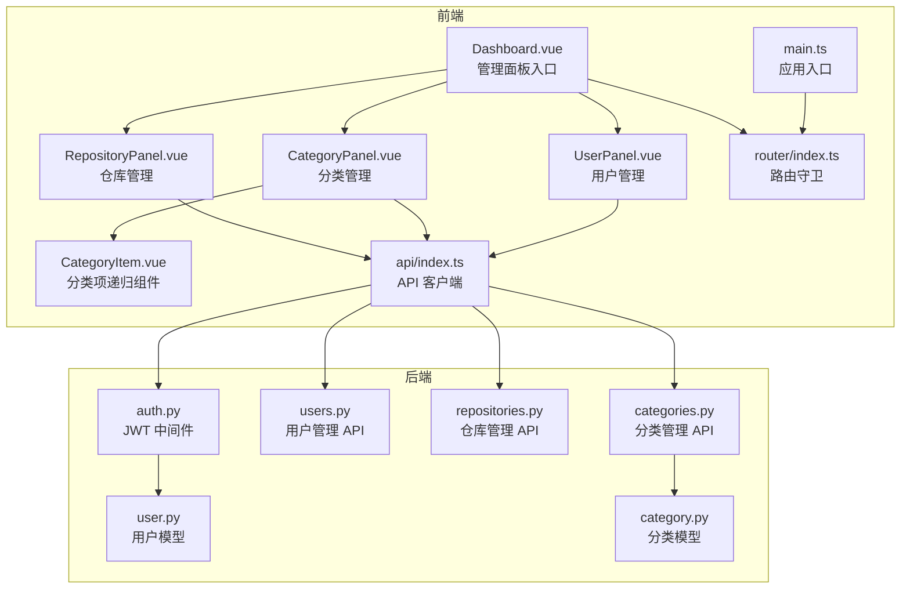
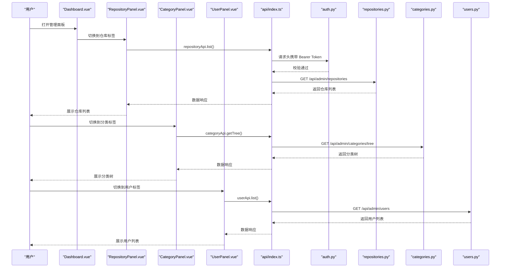
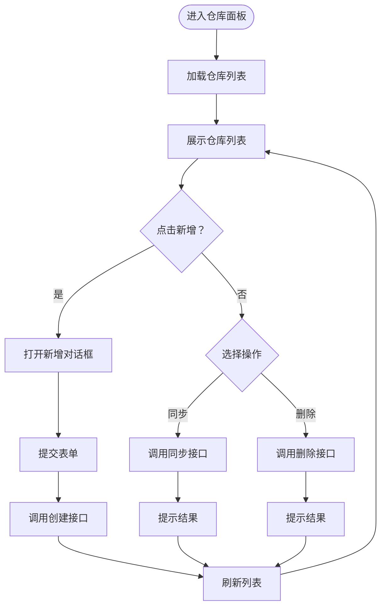
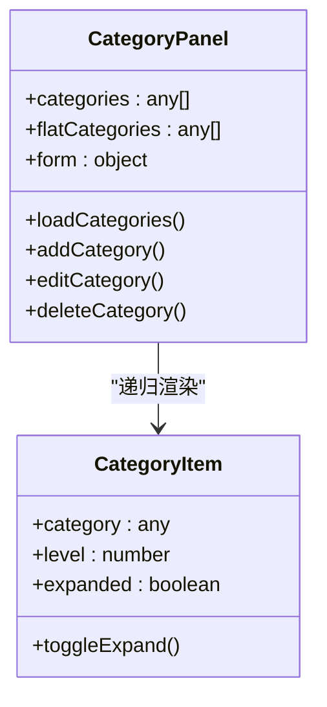
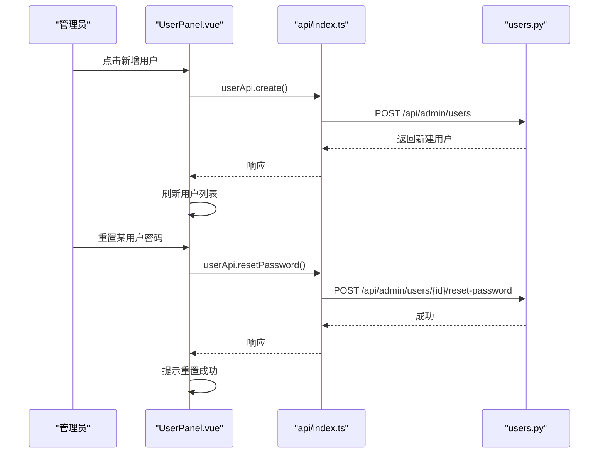
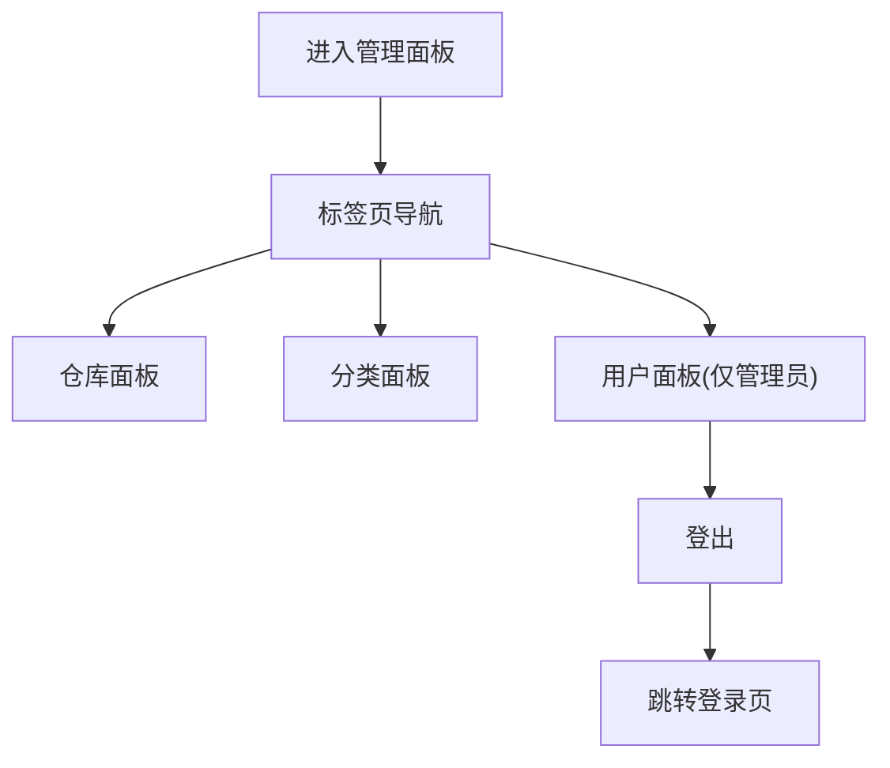
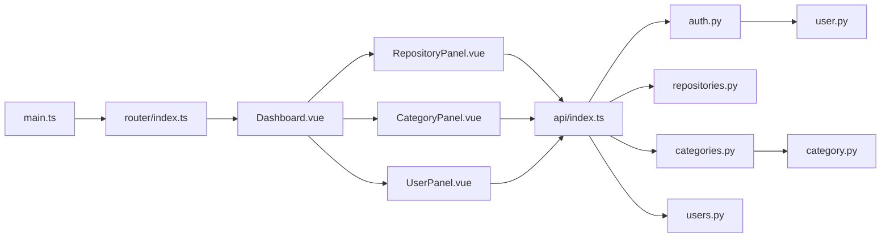

# 管理面板组件

<cite>
**本文档引用的文件**
- [RepositoryPanel.vue](file://frontend/src/components/admin/RepositoryPanel.vue)
- [CategoryPanel.vue](file://frontend/src/components/admin/CategoryPanel.vue)
- [UserPanel.vue](file://frontend/src/components/admin/UserPanel.vue)
- [CategoryItem.vue](file://frontend/src/components/admin/CategoryItem.vue)
- [Dashboard.vue](file://frontend/src/views/admin/Dashboard.vue)
- [index.ts](file://frontend/src/api/index.ts)
- [index.ts](file://frontend/src/router/index.ts)
- [main.ts](file://frontend/src/main.ts)
- [auth.py](file://backend/middleware/auth.py)
- [users.py](file://backend/api/users.py)
- [repositories.py](file://backend/api/repositories.py)
- [categories.py](file://backend/api/categories.py)
- [user.py](file://backend/models/user.py)
- [category.py](file://backend/models/category.py)
</cite>

## 目录
1. [简介](#简介)
2. [项目结构](#项目结构)
3. [核心组件](#核心组件)
4. [架构总览](#架构总览)
5. [组件详细分析](#组件详细分析)
6. [依赖关系分析](#依赖关系分析)
7. [性能考虑](#性能考虑)
8. [故障排除指南](#故障排除指南)
9. [结论](#结论)
10. [附录](#附录)

## 简介
本文件面向开发者与运维人员，系统性梳理 Skills Hub 管理面板组件的前端实现与后端支撑，覆盖仓库管理、分类管理、用户管理三大板块，以及分类项的递归渲染与交互设计。文档重点阐述：
- 数据绑定与表单验证、批量操作与实时更新机制
- 管理员权限验证、数据安全传输与操作日志记录
- 组件间通信模式、状态同步策略与错误处理方案
- 管理界面的用户体验设计、操作反馈与帮助提示
- 开发与维护策略，确保可扩展性与安全性

## 项目结构
管理面板位于前端 src/components/admin 目录下，配合统一的 API 客户端与路由守卫实现权限控制与页面导航。

**图表来源**
- [Dashboard.vue](file://frontend/src/views/admin/Dashboard.vue#L1-L163)
- [RepositoryPanel.vue](file://frontend/src/components/admin/RepositoryPanel.vue#L1-L362)
- [CategoryPanel.vue](file://frontend/src/components/admin/CategoryPanel.vue#L1-L283)
- [UserPanel.vue](file://frontend/src/components/admin/UserPanel.vue#L1-L331)
- [CategoryItem.vue](file://frontend/src/components/admin/CategoryItem.vue#L1-L117)
- [index.ts](file://frontend/src/api/index.ts#L1-L224)
- [index.ts](file://frontend/src/router/index.ts#L1-L63)
- [main.ts](file://frontend/src/main.ts#L1-L12)
- [auth.py](file://backend/middleware/auth.py#L1-L134)
- [users.py](file://backend/api/users.py#L1-L111)
- [repositories.py](file://backend/api/repositories.py#L1-L205)
- [categories.py](file://backend/api/categories.py#L1-L294)
- [user.py](file://backend/models/user.py#L1-L52)
- [category.py](file://backend/models/category.py#L1-L94)

**章节来源**
- [Dashboard.vue](file://frontend/src/views/admin/Dashboard.vue#L1-L163)
- [index.ts](file://frontend/src/router/index.ts#L1-L63)
- [main.ts](file://frontend/src/main.ts#L1-L12)

## 核心组件
- 仓库管理面板：负责仓库的增删改查、手动同步与 Webhook 配置，采用表单驱动与对话框交互，支持 GitHub/GitLab 类型切换与令牌加密存储。
- 分类管理面板：以树形结构展示分类层级，支持新增、编辑、删除；通过扁平化列表辅助父子关系选择；分类项组件支持递归渲染与展开/折叠。
- 用户管理面板：管理员可见，支持用户列表、新增、重置密码与删除；内置“不可删除自身”等安全约束。
- 管理面板仪表盘：标签页导航，按需显示仓库/分类/用户面板；基于本地存储的角色判断实现简易权限控制；提供登出与返回首页能力。

**章节来源**
- [RepositoryPanel.vue](file://frontend/src/components/admin/RepositoryPanel.vue#L1-L362)
- [CategoryPanel.vue](file://frontend/src/components/admin/CategoryPanel.vue#L1-L283)
- [UserPanel.vue](file://frontend/src/components/admin/UserPanel.vue#L1-L331)
- [Dashboard.vue](file://frontend/src/views/admin/Dashboard.vue#L1-L163)

## 架构总览
管理面板采用前后端分离架构，前端通过统一 API 客户端发起请求，后端通过中间件进行认证与授权校验，数据库模型支撑多级分类与多对多技能关联。

**图表来源**
- [Dashboard.vue](file://frontend/src/views/admin/Dashboard.vue#L1-L163)
- [RepositoryPanel.vue](file://frontend/src/components/admin/RepositoryPanel.vue#L123-L133)
- [CategoryPanel.vue](file://frontend/src/components/admin/CategoryPanel.vue#L99-L107)
- [UserPanel.vue](file://frontend/src/components/admin/UserPanel.vue#L108-L114)
- [index.ts](file://frontend/src/api/index.ts#L104-L127)
- [auth.py](file://backend/middleware/auth.py#L48-L96)
- [repositories.py](file://backend/api/repositories.py#L26-L46)
- [categories.py](file://backend/api/categories.py#L24-L47)
- [users.py](file://backend/api/users.py#L17-L25)

## 组件详细分析

### 仓库管理面板（RepositoryPanel）
- 数据绑定与表单
  - 使用响应式引用维护仓库列表与新增表单，表单字段覆盖类型、所有者、仓库名、分支、GitLab URL、访问令牌等。
  - GitHub/GitLab 类型切换时动态显示/隐藏 GitLab URL 字段。
- 表单验证与提交
  - 提交前依赖表单字段完整性；调用 API 客户端创建仓库，成功后清空表单并刷新列表。
- 操作流程
  - 同步：调用同步接口，禁用按钮防止重复点击，成功后弹窗提示并刷新列表。
  - 删除：二次确认后调用删除接口并刷新列表。
  - 编辑：预留占位逻辑，后续可扩展为弹窗或内联编辑。
- 实时更新机制
  - 每次新增/删除/同步后重新拉取仓库列表，保证视图与后端一致。
- 错误处理
  - 捕获异常并弹窗提示，finally 中统一关闭加载态。

**图表来源**
- [RepositoryPanel.vue](file://frontend/src/components/admin/RepositoryPanel.vue#L123-L190)
- [index.ts](file://frontend/src/api/index.ts#L104-L127)

**章节来源**
- [RepositoryPanel.vue](file://frontend/src/components/admin/RepositoryPanel.vue#L1-L362)
- [index.ts](file://frontend/src/api/index.ts#L104-L127)

### 分类管理面板（CategoryPanel）与分类项组件（CategoryItem）
- 分类树展示与扁平化
  - 通过树形 API 获取顶层分类，使用扁平化函数生成可选项列表，便于父级选择。
- 递归渲染与交互
  - CategoryItem 支持点击展开/折叠，子节点按层级缩进；顶部节点与子节点使用不同图标区分。
  - 事件冒泡阻止：在操作按钮区域阻止事件冒泡，避免误触父级展开。
- 新增与删除
  - 新增时提交名称、slug、父级、图标；删除前二次确认。
- 实时更新机制
  - 新增/删除后重新拉取树形数据，保持层级与计数准确。

**图表来源**
- [CategoryPanel.vue](file://frontend/src/components/admin/CategoryPanel.vue#L78-L157)
- [CategoryItem.vue](file://frontend/src/components/admin/CategoryItem.vue#L34-L51)

**章节来源**
- [CategoryPanel.vue](file://frontend/src/components/admin/CategoryPanel.vue#L1-L283)
- [CategoryItem.vue](file://frontend/src/components/admin/CategoryItem.vue#L1-L117)

### 用户管理面板（UserPanel）
- 数据绑定与表单
  - 用户列表展示角色、用户名、邮箱与激活状态；新增表单包含用户名、密码、邮箱与角色选择。
- 权限控制
  - 仅管理员可见；禁止删除当前登录用户。
- 操作流程
  - 新增：提交后清空表单并刷新列表。
  - 重置密码：管理员输入新密码后调用重置接口。
  - 删除：二次确认后调用删除接口并刷新列表。
- 实时更新机制
  - 每次变更后重新拉取用户列表。

**图表来源**
- [UserPanel.vue](file://frontend/src/components/admin/UserPanel.vue#L108-L156)
- [index.ts](file://frontend/src/api/index.ts#L185-L202)
- [users.py](file://backend/api/users.py#L28-L106)

**章节来源**
- [UserPanel.vue](file://frontend/src/components/admin/UserPanel.vue#L1-L331)
- [users.py](file://backend/api/users.py#L1-L111)

### 管理面板仪表盘（Dashboard）
- 标签页导航：仓库、分类、用户三个标签页，用户信息来自本地存储，管理员可见“用户”标签。
- 登出：清除本地存储并跳转登录页。
- 与子组件通信：通过条件渲染加载对应面板组件。

**图表来源**
- [Dashboard.vue](file://frontend/src/views/admin/Dashboard.vue#L16-L76)

**章节来源**
- [Dashboard.vue](file://frontend/src/views/admin/Dashboard.vue#L1-L163)

## 依赖关系分析
- 前端依赖
  - 应用入口注册 Pinia 与路由；路由守卫根据 requiresAuth 与 requiresAdmin 控制访问。
  - API 客户端自动注入 Authorization 头，封装通用请求方法。
- 后端依赖
  - 认证中间件提供 get_current_user 与 require_admin，确保接口安全。
  - 用户模型定义角色枚举，分类模型支持自引用与多对多关系。

**图表来源**
- [main.ts](file://frontend/src/main.ts#L1-L12)
- [index.ts](file://frontend/src/router/index.ts#L1-L63)
- [Dashboard.vue](file://frontend/src/views/admin/Dashboard.vue#L1-L163)
- [RepositoryPanel.vue](file://frontend/src/components/admin/RepositoryPanel.vue#L1-L362)
- [CategoryPanel.vue](file://frontend/src/components/admin/CategoryPanel.vue#L1-L283)
- [UserPanel.vue](file://frontend/src/components/admin/UserPanel.vue#L1-L331)
- [index.ts](file://frontend/src/api/index.ts#L1-L224)
- [auth.py](file://backend/middleware/auth.py#L1-L134)
- [repositories.py](file://backend/api/repositories.py#L1-L205)
- [categories.py](file://backend/api/categories.py#L1-L294)
- [users.py](file://backend/api/users.py#L1-L111)
- [user.py](file://backend/models/user.py#L1-L52)
- [category.py](file://backend/models/category.py#L1-L94)

**章节来源**
- [index.ts](file://frontend/src/router/index.ts#L1-L63)
- [auth.py](file://backend/middleware/auth.py#L1-L134)
- [user.py](file://backend/models/user.py#L1-L52)
- [category.py](file://backend/models/category.py#L1-L94)

## 性能考虑
- 列表懒加载与预加载
  - 仓库与分类接口已使用预加载策略减少 N+1 查询，建议在大数据量场景下引入分页与虚拟滚动。
- 并发控制
  - 同步按钮在请求期间禁用，避免重复触发；可引入节流/防抖优化频繁操作。
- 缓存与重用
  - 分类树扁平化结果可在组件内缓存，减少重复计算；新增/删除后失效缓存并刷新。
- 网络层优化
  - API 客户端统一处理错误与重试策略，建议增加超时与断线重连机制。

## 故障排除指南
- 认证失败
  - 现象：无法访问管理面板或接口报 401。
  - 排查：确认本地存储 token 是否存在且未过期；检查后端 JWT 密钥与算法配置。
- 权限不足
  - 现象：访问 /api/admin/users 报 403。
  - 排查：确认本地存储 userRole 是否为 admin；核对后端 require_admin 依赖。
- 操作失败
  - 现象：新增/删除/同步失败弹窗提示。
  - 排查：查看后端接口返回的错误信息；检查数据库约束（如分类 slug 唯一、仓库唯一性）。
- 数据不一致
  - 现象：视图未更新。
  - 排查：确认每次操作后是否调用刷新函数；检查 API 响应与网络状态。

**章节来源**
- [auth.py](file://backend/middleware/auth.py#L48-L96)
- [users.py](file://backend/api/users.py#L17-L25)
- [repositories.py](file://backend/api/repositories.py#L54-L88)
- [categories.py](file://backend/api/categories.py#L80-L120)

## 结论
管理面板组件围绕“仓库、分类、用户”三大核心域构建，采用组件化与递归渲染实现清晰的层级结构与直观的操作体验。通过统一 API 客户端与路由守卫，结合后端中间件的认证与授权，形成从前端到后端的安全闭环。建议在后续迭代中完善表单验证、批量操作、实时推送与审计日志，持续提升可用性与安全性。

## 附录
- 开发与维护建议
  - 表单验证：引入表单库或自定义校验规则，增强输入合法性保障。
  - 批量操作：为仓库与用户列表增加多选与批量删除/启用功能。
  - 实时更新：集成 WebSocket 或轮询，实现后台任务状态实时反馈。
  - 审计日志：后端记录管理员关键操作，前端提供日志查询入口。
  - 国际化：为命令式文案与提示语提供多语言支持。
  - 测试：补充单元测试与端到端测试，覆盖权限、错误路径与边界条件。