# 页面组件

<cite>
**本文引用的文件**
- [frontend/src/views/Home.vue](file://frontend/src/views/Home.vue)
- [frontend/src/views/Category.vue](file://frontend/src/views/Category.vue)
- [frontend/src/views/Skill.vue](file://frontend/src/views/Skill.vue)
- [frontend/src/views/Login.vue](file://frontend/src/views/Login.vue)
- [frontend/src/views/admin/Dashboard.vue](file://frontend/src/views/admin/Dashboard.vue)
- [frontend/src/components/admin/RepositoryPanel.vue](file://frontend/src/components/admin/RepositoryPanel.vue)
- [frontend/src/components/admin/CategoryPanel.vue](file://frontend/src/components/admin/CategoryPanel.vue)
- [frontend/src/components/admin/UserPanel.vue](file://frontend/src/components/admin/UserPanel.vue)
- [frontend/src/components/admin/CategoryItem.vue](file://frontend/src/components/admin/CategoryItem.vue)
- [frontend/src/router/index.ts](file://frontend/src/router/index.ts)
- [frontend/src/api/index.ts](file://frontend/src/api/index.ts)
- [frontend/src/main.ts](file://frontend/src/main.ts)
- [backend/api/skills.py](file://backend/api/skills.py)
- [backend/api/categories.py](file://backend/api/categories.py)
- [backend/api/auth.py](file://backend/api/auth.py)
</cite>

## 目录
1. [简介](#简介)
2. [项目结构](#项目结构)
3. [核心组件](#核心组件)
4. [架构总览](#架构总览)
5. [详细组件分析](#详细组件分析)
6. [依赖分析](#依赖分析)
7. [性能考虑](#性能考虑)
8. [故障排查指南](#故障排查指南)
9. [结论](#结论)
10. [附录](#附录)

## 简介
本文件面向 Skills Hub 的前端页面组件，系统性梳理主页、分类页、技能详情页、登录页与管理员仪表板的设计与实现，覆盖组件结构、props 传递、事件处理、状态管理、页面间导航与路由守卫、参数传递、组件复用策略、样式定制与响应式设计、性能优化、SEO 与无障碍支持等主题，为开发者提供完整的页面组件开发指南与最佳实践。

## 项目结构
前端采用 Vue 3 + TypeScript + Vite 架构，页面组件位于 views 目录，管理员功能位于 views/admin 下，通用管理组件位于 components/admin 下；路由通过 vue-router 配置，全局守卫负责鉴权与权限控制；API 封装于统一客户端，按领域拆分导出。

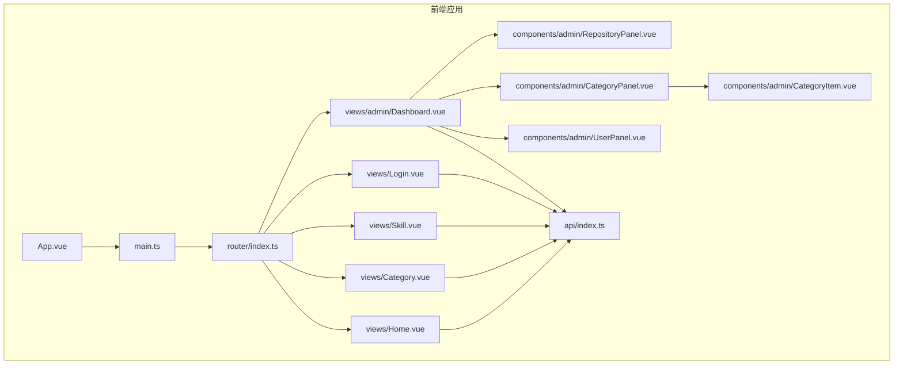

图表来源
- [frontend/src/main.ts](file://frontend/src/main.ts#L1-L12)
- [frontend/src/router/index.ts](file://frontend/src/router/index.ts#L1-L63)
- [frontend/src/views/Home.vue](file://frontend/src/views/Home.vue#L1-L230)
- [frontend/src/views/Category.vue](file://frontend/src/views/Category.vue#L1-L226)
- [frontend/src/views/Skill.vue](file://frontend/src/views/Skill.vue#L1-L205)
- [frontend/src/views/Login.vue](file://frontend/src/views/Login.vue#L1-L185)
- [frontend/src/views/admin/Dashboard.vue](file://frontend/src/views/admin/Dashboard.vue#L1-L163)
- [frontend/src/components/admin/RepositoryPanel.vue](file://frontend/src/components/admin/RepositoryPanel.vue#L1-L362)
- [frontend/src/components/admin/CategoryPanel.vue](file://frontend/src/components/admin/CategoryPanel.vue#L1-L283)
- [frontend/src/components/admin/UserPanel.vue](file://frontend/src/components/admin/UserPanel.vue#L1-L331)
- [frontend/src/components/admin/CategoryItem.vue](file://frontend/src/components/admin/CategoryItem.vue#L1-L117)
- [frontend/src/api/index.ts](file://frontend/src/api/index.ts#L1-L224)

章节来源
- [frontend/src/main.ts](file://frontend/src/main.ts#L1-L12)
- [frontend/src/router/index.ts](file://frontend/src/router/index.ts#L1-L63)

## 核心组件
- 主页组件：渲染终端风格界面，加载分类树预览，提供快速导航至分类与管理入口。
- 分类页面：加载分类树，支持展开/折叠子分类，根据 slug 参数定位并加载技能列表。
- 技能详情页：根据路由参数加载指定技能详情，展示描述、仓库、分类等元信息。
- 登录页：表单收集用户名/密码，调用认证 API，保存 token 与用户角色，跳转原页面或首页。
- 管理员仪表板：基于标签页切换仓库/分类/用户管理面板，支持登出与管理员权限控制。

章节来源
- [frontend/src/views/Home.vue](file://frontend/src/views/Home.vue#L1-L230)
- [frontend/src/views/Category.vue](file://frontend/src/views/Category.vue#L1-L226)
- [frontend/src/views/Skill.vue](file://frontend/src/views/Skill.vue#L1-L205)
- [frontend/src/views/Login.vue](file://frontend/src/views/Login.vue#L1-L185)
- [frontend/src/views/admin/Dashboard.vue](file://frontend/src/views/admin/Dashboard.vue#L1-L163)

## 架构总览
前端通过路由守卫实现鉴权与管理员权限控制；API 客户端统一封装请求、错误处理与认证头注入；各页面组件通过组合式 API 进行状态管理与生命周期钩子；管理员面板通过子组件复用实现高内聚低耦合。

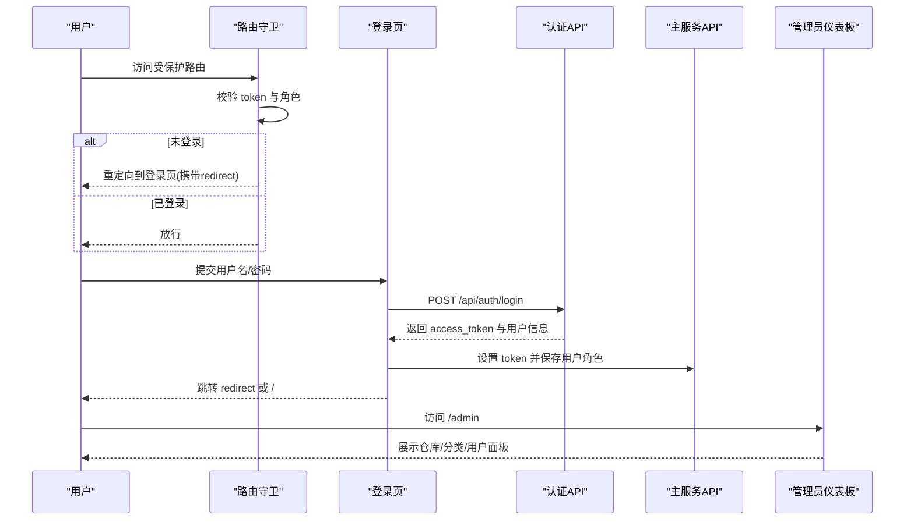

图表来源
- [frontend/src/router/index.ts](file://frontend/src/router/index.ts#L4-L24)
- [frontend/src/views/Login.vue](file://frontend/src/views/Login.vue#L59-L84)
- [frontend/src/api/index.ts](file://frontend/src/api/index.ts#L89-L102)
- [frontend/src/views/admin/Dashboard.vue](file://frontend/src/views/admin/Dashboard.vue#L60-L76)

## 详细组件分析

### 主页组件（Home.vue）
- 设计要点
  - 终端风格布局，顶部导航包含“进入分类”“进入管理”的快捷命令。
  - 首屏加载分类列表，截取前若干项作为快速浏览入口。
  - 使用 monospace 字体与颜色编码模拟代码片段，增强沉浸感。
- 数据流
  - 生命周期挂载时调用 API 获取分类树，赋值给本地响应式状态。
  - 点击分类项触发路由跳转至分类页并附带 slug 查询参数。
- 样式与响应式
  - 使用 scoped 样式定义主题色系与动画光标闪烁效果。
  - 通过容器最小高度保证全屏展示。
- 可访问性
  - 使用语义化标签与颜色对比度满足基础可读性。
  - 建议补充键盘焦点可见性与屏幕阅读器友好的标题层级。

```mermaid
flowchart TD
Start(["组件挂载"]) --> Load["调用 API 获取分类列表"]
Load --> Render["渲染分类预览列表"]
Render --> Click{"点击分类项?"}
Click --> |是| Nav["路由跳转到分类页<br/>携带 slug 查询参数"]
Click --> |否| Wait["等待用户操作"]
Nav --> End(["完成"])
Wait --> End
```

图表来源
- [frontend/src/views/Home.vue](file://frontend/src/views/Home.vue#L94-L101)
- [frontend/src/views/Home.vue](file://frontend/src/views/Home.vue#L72-L84)

章节来源
- [frontend/src/views/Home.vue](file://frontend/src/views/Home.vue#L1-L230)

### 分类页面（Category.vue）
- 功能特性
  - 加载分类树，支持多级展开/折叠。
  - 根据路由查询参数 slug 自动定位并加载对应分类下的技能列表。
  - 点击技能项跳转到技能详情页。
- 状态与交互
  - 使用响应式集合维护分类、技能、选中分类与展开集合。
  - 通过路由钩子读取查询参数，递归查找目标分类并加载技能。
- 错误处理
  - 请求异常时记录日志，避免页面崩溃。
- 性能建议
  - 技能列表可引入虚拟滚动或分页加载，减少一次性渲染压力。
  - 展开状态持久化可提升用户体验。

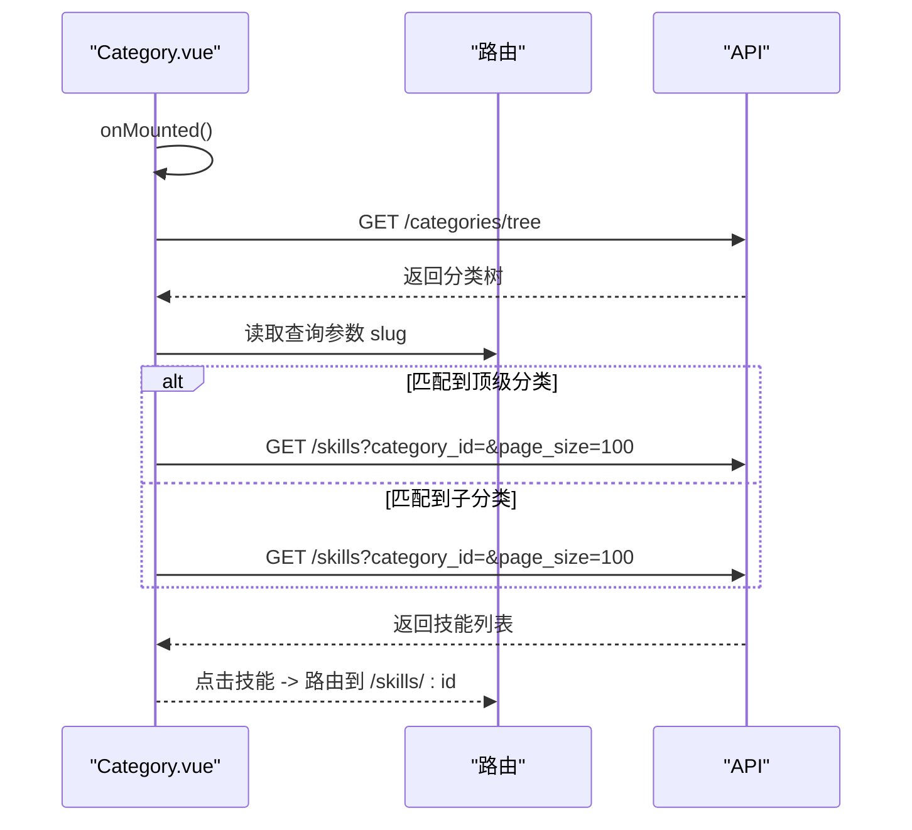

图表来源
- [frontend/src/views/Category.vue](file://frontend/src/views/Category.vue#L74-L122)
- [frontend/src/views/Category.vue](file://frontend/src/views/Category.vue#L132-L139)

章节来源
- [frontend/src/views/Category.vue](file://frontend/src/views/Category.vue#L1-L226)

### 技能详情页（Skill.vue）
- 信息呈现
  - 展示技能名称、目录路径、描述、仓库来源、README 链接与分类标签。
  - 提供返回上级的快捷链接。
- 数据加载
  - 通过路由参数解析技能 ID，调用 API 获取详情。
- 交互设计
  - 加载态与“未找到”两种视图分支，提升用户反馈。
- 扩展点
  - 内容区域预留展示 SKILL.md 的位置，便于后续集成 Markdown 解析与渲染。

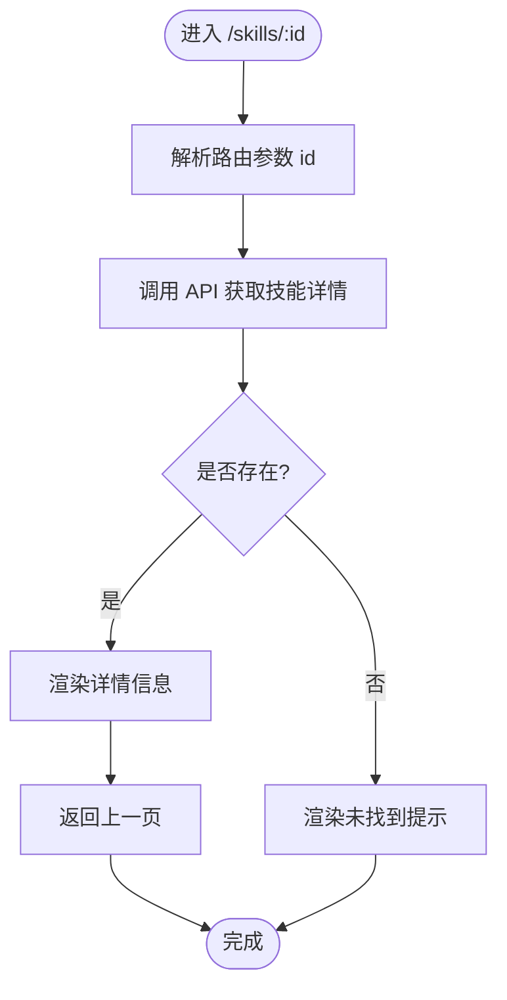

图表来源
- [frontend/src/views/Skill.vue](file://frontend/src/views/Skill.vue#L91-L99)

章节来源
- [frontend/src/views/Skill.vue](file://frontend/src/views/Skill.vue#L1-L205)

### 登录页面（Login.vue）
- 身份验证流程
  - 表单校验非空，提交后调用认证 API 获取 token。
  - 成功后保存 token 与用户角色，读取 redirect 参数决定跳转目标。
- 用户体验优化
  - 输入框回车键自动聚焦下一个字段，减少鼠标操作。
  - 按钮禁用态与错误提示明确反馈。
- 安全与健壮性
  - 异常捕获并展示友好错误消息。
  - 建议增加输入长度限制与弱口令提示。

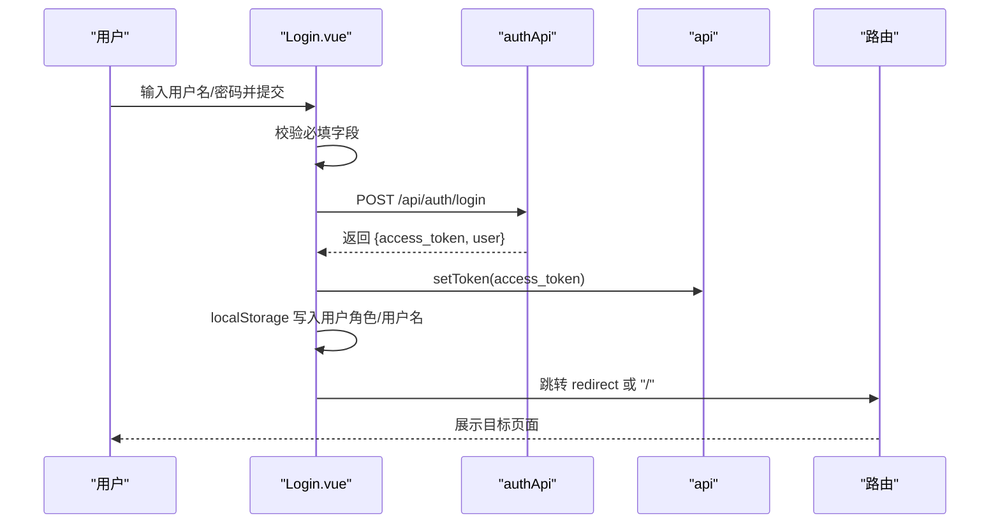

图表来源
- [frontend/src/views/Login.vue](file://frontend/src/views/Login.vue#L59-L84)
- [frontend/src/api/index.ts](file://frontend/src/api/index.ts#L89-L102)

章节来源
- [frontend/src/views/Login.vue](file://frontend/src/views/Login.vue#L1-L185)
- [frontend/src/api/index.ts](file://frontend/src/api/index.ts#L89-L102)

### 管理员仪表板（Dashboard.vue）
- 功能模块
  - 仓库管理、分类管理、用户管理三块面板，通过标签页切换。
  - 登出按钮清除本地存储并跳转登录页。
  - 基于 localStorage 中的角色显示/隐藏“用户”标签页。
- 权限控制
  - 路由守卫对 /admin 进行鉴权；Dashboard 再次基于角色进行 UI 控制。
- 组件复用
  - 三个面板均为独立组件，职责单一，便于测试与维护。

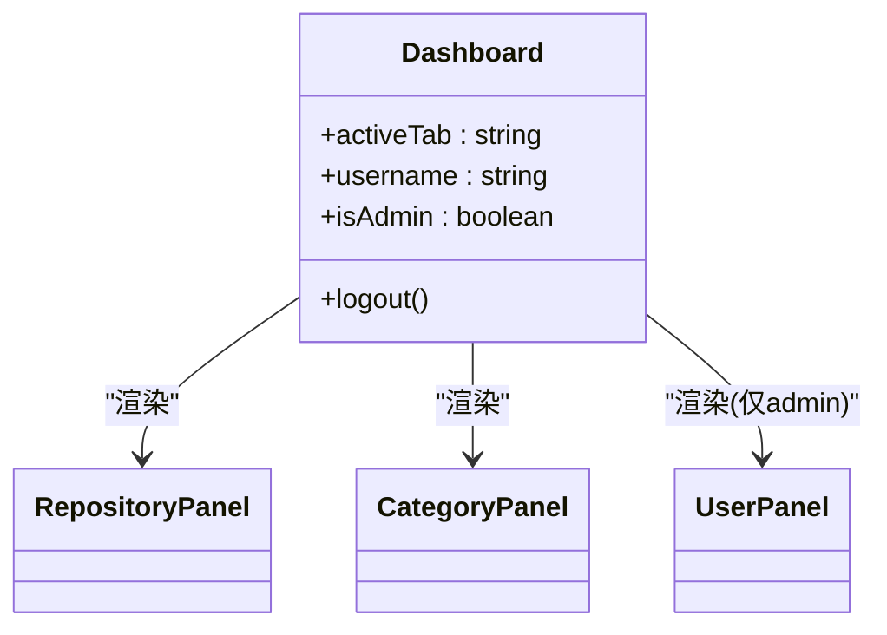

图表来源
- [frontend/src/views/admin/Dashboard.vue](file://frontend/src/views/admin/Dashboard.vue#L58-L76)
- [frontend/src/components/admin/RepositoryPanel.vue](file://frontend/src/components/admin/RepositoryPanel.vue#L1-L362)
- [frontend/src/components/admin/CategoryPanel.vue](file://frontend/src/components/admin/CategoryPanel.vue#L1-L283)
- [frontend/src/components/admin/UserPanel.vue](file://frontend/src/components/admin/UserPanel.vue#L1-L331)

章节来源
- [frontend/src/views/admin/Dashboard.vue](file://frontend/src/views/admin/Dashboard.vue#L1-L163)

### 管理组件：仓库面板（RepositoryPanel.vue）
- 能力概览
  - 列表展示仓库类型、拥有者、名称、分支与技能数量。
  - 支持新增、同步、编辑、删除仓库。
- 交互细节
  - 新增对话框动态显示 GitLab URL 字段。
  - 同步按钮禁用态防止重复请求。
- 数据流
  - 通过 repositoryApi 封装 CRUD 与同步操作。
  - 成功后刷新列表，失败弹窗提示。

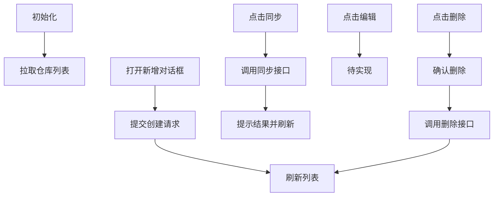

图表来源
- [frontend/src/components/admin/RepositoryPanel.vue](file://frontend/src/components/admin/RepositoryPanel.vue#L123-L190)
- [frontend/src/api/index.ts](file://frontend/src/api/index.ts#L105-L127)

章节来源
- [frontend/src/components/admin/RepositoryPanel.vue](file://frontend/src/components/admin/RepositoryPanel.vue#L1-L362)
- [frontend/src/api/index.ts](file://frontend/src/api/index.ts#L105-L127)

### 管理组件：分类面板（CategoryPanel.vue）
- 能力概览
  - 以树形结构展示分类，支持新增、编辑、删除。
  - 提供扁平化选项用于父子关系选择。
- 交互细节
  - 通过 CategoryItem 子组件递归渲染子节点。
  - 删除前二次确认。
- 数据流
  - 通过 categoryApi 获取树与执行变更。
  - 成功后重新拉取树并扁平化。

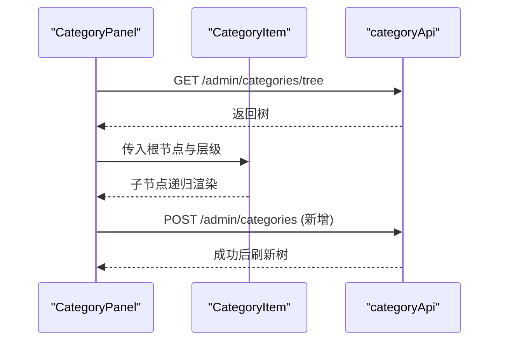

图表来源
- [frontend/src/components/admin/CategoryPanel.vue](file://frontend/src/components/admin/CategoryPanel.vue#L95-L156)
- [frontend/src/components/admin/CategoryItem.vue](file://frontend/src/components/admin/CategoryItem.vue#L1-L117)
- [frontend/src/api/index.ts](file://frontend/src/api/index.ts#L129-L155)

章节来源
- [frontend/src/components/admin/CategoryPanel.vue](file://frontend/src/components/admin/CategoryPanel.vue#L1-L283)
- [frontend/src/components/admin/CategoryItem.vue](file://frontend/src/components/admin/CategoryItem.vue#L1-L117)
- [frontend/src/api/index.ts](file://frontend/src/api/index.ts#L129-L155)

### 管理组件：用户面板（UserPanel.vue）
- 能力概览
  - 列表展示用户角色、用户名、邮箱与状态。
  - 支持新增用户、重置密码、删除用户（admin 除外）。
- 交互细节
  - 重置密码通过 prompt 输入新密码并提交。
  - 删除前二次确认。
- 数据流
  - 通过 userApi 管理用户生命周期。

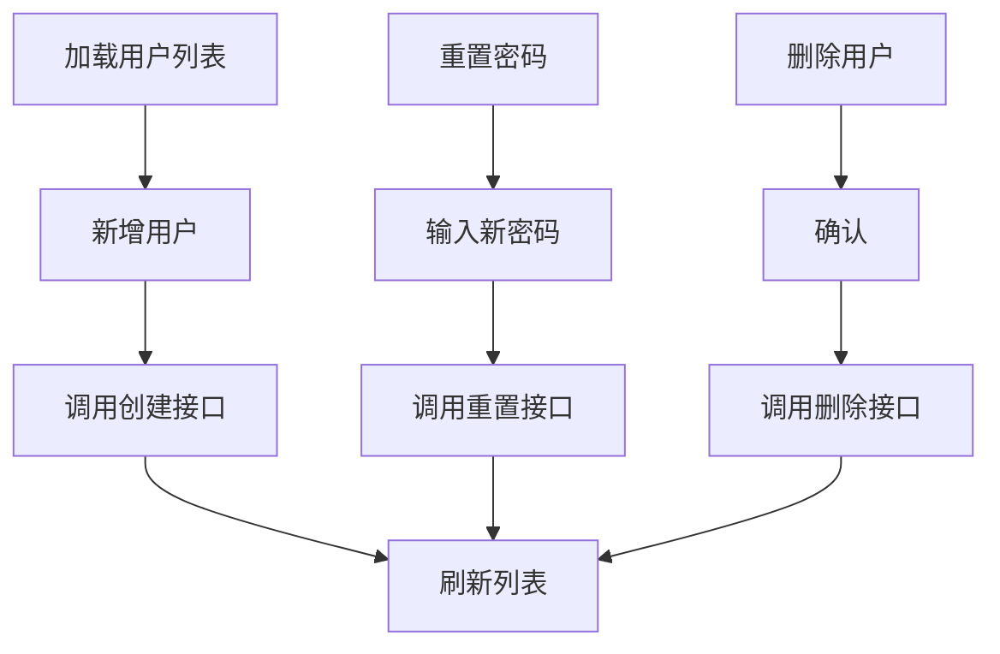

图表来源
- [frontend/src/components/admin/UserPanel.vue](file://frontend/src/components/admin/UserPanel.vue#L104-L156)
- [frontend/src/api/index.ts](file://frontend/src/api/index.ts#L186-L202)

章节来源
- [frontend/src/components/admin/UserPanel.vue](file://frontend/src/components/admin/UserPanel.vue#L1-L331)
- [frontend/src/api/index.ts](file://frontend/src/api/index.ts#L186-L202)

## 依赖分析
- 路由与守卫
  - 路由定义包含鉴权与管理员权限标记；全局守卫读取 localStorage 校验 token 与角色。
- API 客户端
  - 统一基地址与认证头注入；按领域拆分导出，如 authApi、repositoryApi、categoryApi、skillApi、userApi、syncApi、webhookApi。
- 页面与组件
  - 页面组件依赖 API 客户端；管理员面板依赖各自管理组件；分类面板依赖 CategoryItem 子组件。

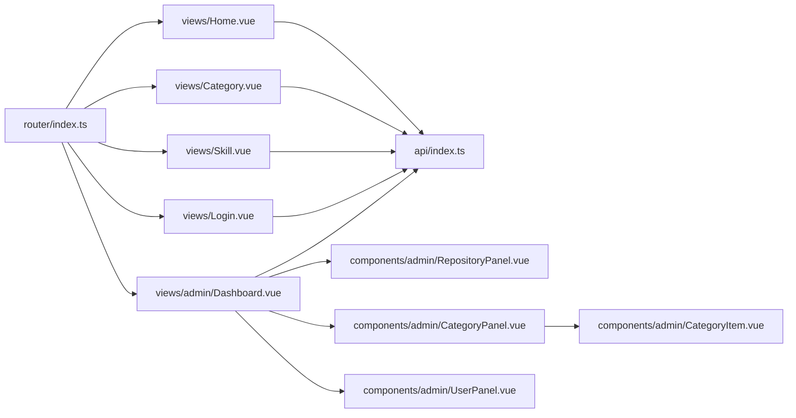

图表来源
- [frontend/src/router/index.ts](file://frontend/src/router/index.ts#L26-L53)
- [frontend/src/api/index.ts](file://frontend/src/api/index.ts#L88-L224)
- [frontend/src/views/admin/Dashboard.vue](file://frontend/src/views/admin/Dashboard.vue#L61-L63)

章节来源
- [frontend/src/router/index.ts](file://frontend/src/router/index.ts#L1-L63)
- [frontend/src/api/index.ts](file://frontend/src/api/index.ts#L1-L224)

## 性能考虑
- 首屏与路由
  - 使用异步组件懒加载减少初始包体积。
  - 分类页技能列表建议分页或虚拟滚动，避免超大列表一次性渲染。
- 缓存与去抖
  - 对频繁请求的分类树与技能列表可引入内存缓存与去抖策略。
- 网络与错误
  - 统一错误处理与重试机制，避免阻塞 UI。
- 图片与资源
  - 若未来引入图标/图片，建议使用懒加载与合适的尺寸裁剪。

## 故障排查指南
- 登录失败
  - 检查网络请求与返回的错误消息；确认用户名/密码格式与后端规则一致。
  - 查看 localStorage 是否正确写入 token 与用户角色。
- 无法访问管理页
  - 确认路由守卫是否拦截并重定向到登录页；检查 token 与角色是否匹配。
- 分类/技能加载为空
  - 检查后端接口返回结构与查询参数（如 slug、category_id、page_size）。
  - 确认 API 基础地址与代理配置正确。
- 管理面板无数据
  - 确认已登录且具备管理员角色；检查对应 API 是否返回数据。

章节来源
- [frontend/src/views/Login.vue](file://frontend/src/views/Login.vue#L79-L84)
- [frontend/src/router/index.ts](file://frontend/src/router/index.ts#L13-L21)
- [frontend/src/api/index.ts](file://frontend/src/api/index.ts#L36-L64)

## 结论
本项目页面组件围绕“终端风格界面 + 领域清晰的 API 封装 + 路由守卫鉴权”的架构实现了良好的可维护性与可扩展性。通过组件化与模块化设计，管理员面板具备良好的复用性与可测试性。建议在后续迭代中完善分页/虚拟滚动、SEO 元信息、无障碍属性与国际化支持，持续提升用户体验与可访问性。

## 附录

### 路由与权限对照
- /：公开首页
- /categories：公开分类页
- /skills/:id：公开技能详情页
- /login：公开登录页
- /admin：需登录，管理员可见

章节来源
- [frontend/src/router/index.ts](file://frontend/src/router/index.ts#L26-L53)

### 后端接口与前端映射
- 技能列表与详情：/api/skills
- 分类树与管理：/api/admin/categories
- 认证登录：/api/auth/login

章节来源
- [backend/api/skills.py](file://backend/api/skills.py#L18-L95)
- [backend/api/categories.py](file://backend/api/categories.py#L24-L47)
- [backend/api/auth.py](file://backend/api/auth.py#L24-L40)
- [frontend/src/api/index.ts](file://frontend/src/api/index.ts#L158-L183)
- [frontend/src/api/index.ts](file://frontend/src/api/index.ts#L129-L155)
- [frontend/src/api/index.ts](file://frontend/src/api/index.ts#L89-L102)