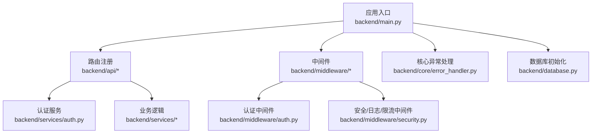
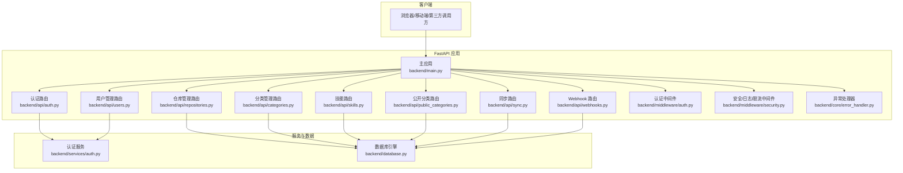
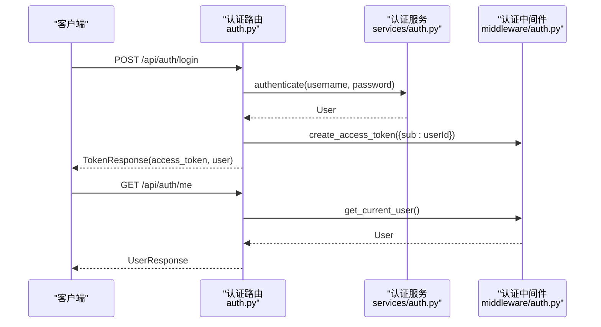
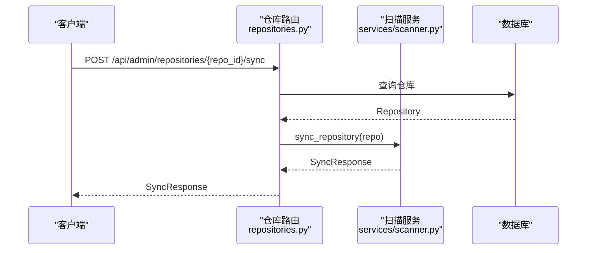
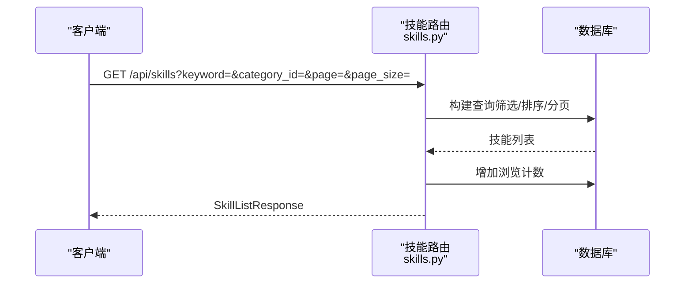
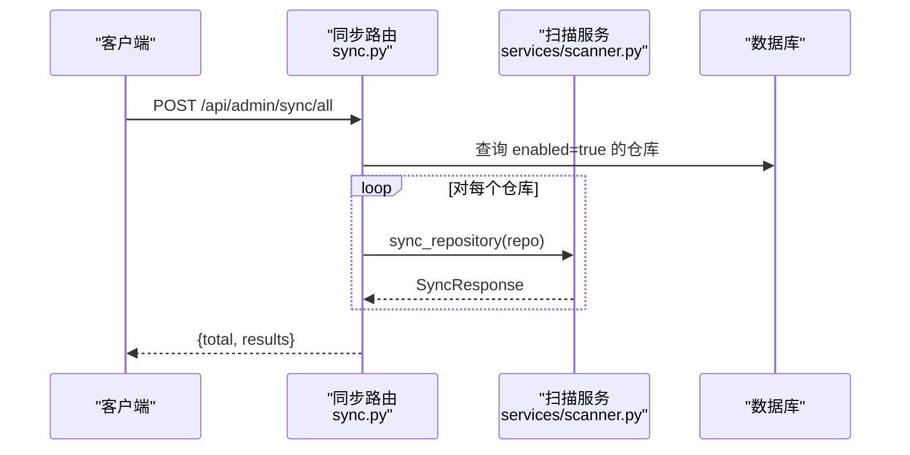
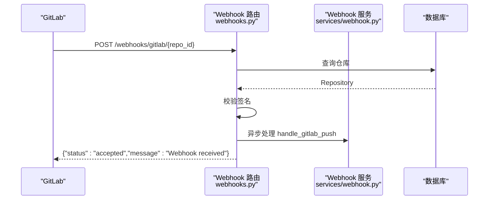
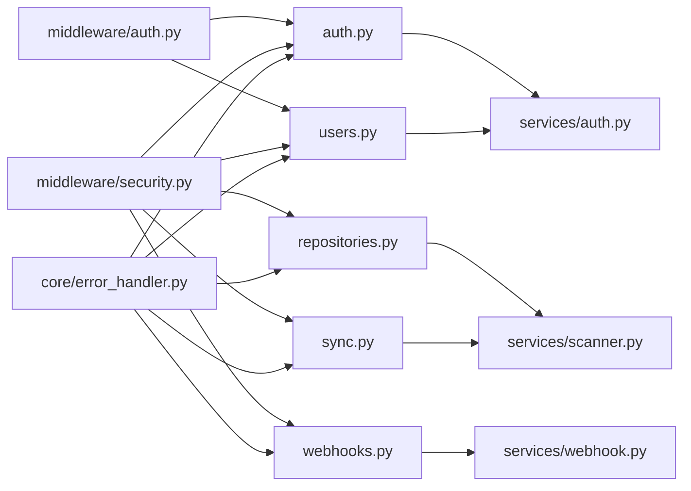

# API 层开发

<cite>
**本文档引用的文件**
- [backend/main.py](file://backend/main.py)
- [backend/api/__init__.py](file://backend/api/__init__.py)
- [backend/api/auth.py](file://backend/api/auth.py)
- [backend/api/users.py](file://backend/api/users.py)
- [backend/api/repositories.py](file://backend/api/repositories.py)
- [backend/api/categories.py](file://backend/api/categories.py)
- [backend/api/skills.py](file://backend/api/skills.py)
- [backend/api/public_categories.py](file://backend/api/public_categories.py)
- [backend/api/sync.py](file://backend/api/sync.py)
- [backend/api/webhooks.py](file://backend/api/webhooks.py)
- [backend/middleware/auth.py](file://backend/middleware/auth.py)
- [backend/middleware/security.py](file://backend/middleware/security.py)
- [backend/core/error_handler.py](file://backend/core/error_handler.py)
- [backend/core/exceptions.py](file://backend/core/exceptions.py)
- [backend/services/auth.py](file://backend/services/auth.py)
</cite>

## 目录
1. [简介](#简介)
2. [项目结构](#项目结构)
3. [核心组件](#核心组件)
4. [架构总览](#架构总览)
5. [详细组件分析](#详细组件分析)
6. [依赖关系分析](#依赖关系分析)
7. [性能考量](#性能考量)
8. [故障排查指南](#故障排查指南)
9. [结论](#结论)
10. [附录](#附录)

## 简介
本文件面向 API 层开发，系统性梳理基于 FastAPI 的路由设计与控制器实现，涵盖认证、用户管理、仓库管理、技能管理、分类管理、公开分类与同步功能的完整接口规范。文档重点阐释：
- 路由装饰器使用与分层组织
- 依赖注入模式与认证中间件
- 参数验证与响应模型
- RESTful 设计原则、HTTP 状态码与错误处理策略
- 安全中间件、速率限制与版本化思路
- 集成指南与最佳实践

## 项目结构
后端采用模块化分层：
- 应用入口与全局配置：backend/main.py
- API 路由模块：backend/api/*（按功能域划分）
- 中间件：backend/middleware/*（认证、安全、日志、限流）
- 核心能力：backend/core/*（异常体系、错误处理、日志）
- 业务服务：backend/services/*（认证、扫描、解析等）
- 数据模型与序列化：backend/models/*、backend/schemas/*



图表来源
- [backend/main.py](file://backend/main.py#L47-L84)
- [backend/api/__init__.py](file://backend/api/__init__.py#L4-L7)

章节来源
- [backend/main.py](file://backend/main.py#L1-L137)
- [backend/api/__init__.py](file://backend/api/__init__.py#L1-L8)

## 核心组件
- 应用生命周期与中间件
  - 生命周期管理：启动时初始化数据库，关闭时释放连接
  - CORS、安全响应头、日志与速率限制中间件
- 路由注册：按模块 include_router，统一前缀与标签
- 异常处理：SkillsException、验证错误、HTTP 异常与通用异常的统一输出
- 认证中间件：Bearer Token 解析、用户校验、管理员权限校验、可选认证
- 服务层：认证服务（注册、登录、改密、重置）

章节来源
- [backend/main.py](file://backend/main.py#L27-L44)
- [backend/main.py](file://backend/main.py#L56-L74)
- [backend/main.py](file://backend/main.py#L76-L84)
- [backend/core/error_handler.py](file://backend/core/error_handler.py#L14-L101)
- [backend/middleware/auth.py](file://backend/middleware/auth.py#L48-L133)
- [backend/services/auth.py](file://backend/services/auth.py#L19-L129)

## 架构总览
下图展示 API 层与核心组件交互关系，以及认证与安全中间件在请求处理链中的位置。



图表来源
- [backend/main.py](file://backend/main.py#L47-L84)
- [backend/api/auth.py](file://backend/api/auth.py#L21-L40)
- [backend/api/users.py](file://backend/api/users.py#L14-L36)
- [backend/api/repositories.py](file://backend/api/repositories.py#L23-L88)
- [backend/api/categories.py](file://backend/api/categories.py#L21-L120)
- [backend/api/skills.py](file://backend/api/skills.py#L15-L95)
- [backend/api/public_categories.py](file://backend/api/public_categories.py#L15-L44)
- [backend/api/sync.py](file://backend/api/sync.py#L14-L32)
- [backend/api/webhooks.py](file://backend/api/webhooks.py#L12-L64)
- [backend/middleware/auth.py](file://backend/middleware/auth.py#L48-L95)
- [backend/middleware/security.py](file://backend/middleware/security.py#L11-L28)
- [backend/core/error_handler.py](file://backend/core/error_handler.py#L14-L101)

## 详细组件分析

### 认证 API（/api/auth）
- 路由前缀：/api/auth；标签：Authentication
- 关键端点
  - POST /login：用户名+密码登录，签发 JWT，返回 TokenResponse
  - GET /me：获取当前用户信息，依赖 get_current_user
  - POST /change-password：修改当前用户密码，依赖 get_current_user 与数据库
- 依赖注入
  - get_db 提供 AsyncSession
  - get_current_user 校验 JWT 并注入 User
- 响应模型
  - TokenResponse、UserResponse、PasswordChange、PasswordReset
- 错误处理
  - 认证失败、账户禁用、令牌无效等通过 SkillsException 统一返回



图表来源
- [backend/api/auth.py](file://backend/api/auth.py#L24-L40)
- [backend/services/auth.py](file://backend/services/auth.py#L64-L98)
- [backend/middleware/auth.py](file://backend/middleware/auth.py#L25-L95)

章节来源
- [backend/api/auth.py](file://backend/api/auth.py#L1-L65)
- [backend/services/auth.py](file://backend/services/auth.py#L19-L129)
- [backend/middleware/auth.py](file://backend/middleware/auth.py#L48-L95)

### 用户管理 API（/api/admin/users）
- 路由前缀：/api/admin/users；标签：Users
- 关键端点
  - GET /：管理员获取用户列表
  - POST /：管理员创建用户（含角色限制）
  - GET /{user_id}：管理员获取用户详情
  - PUT /{user_id}：管理员更新用户（邮箱、激活状态）
  - DELETE /{user_id}：管理员删除用户（禁止删除自己）
  - POST /{user_id}/reset-password：管理员重置用户密码
- 权限控制
  - require_admin 保证仅管理员可访问
- 错误处理
  - NotFoundError、ConflictError、SkillsException

```mermaid
flowchart TD
Start(["请求进入 /api/admin/users"]) --> CheckRole["require_admin 校验"]
CheckRole --> Route{"路由匹配？"}
Route --> |GET /| ListUsers["查询用户列表"]
Route --> |POST /| CreateUser["注册用户校验重复、角色"]
Route --> |GET /{id}| GetUser["查询用户详情"]
Route --> |PUT /{id}| UpdateUser["更新邮箱/激活状态"]
Route --> |DELETE /{id}| DeleteUser["删除用户禁止自删"]
Route --> |POST /{id}/reset-password| ResetPwd["管理员重置密码"]
ListUsers --> End(["返回 UserResponse 列表"])
CreateUser --> End
GetUser --> End
UpdateUser --> End
DeleteUser --> End
ResetPwd --> End
```

图表来源
- [backend/api/users.py](file://backend/api/users.py#L17-L106)
- [backend/middleware/auth.py](file://backend/middleware/auth.py#L98-L108)

章节来源
- [backend/api/users.py](file://backend/api/users.py#L1-L111)
- [backend/middleware/auth.py](file://backend/middleware/auth.py#L98-L108)

### 仓库管理 API（/api/admin/repositories）
- 路由前缀：/api/admin/repositories；标签：Repositories
- 关键端点
  - GET /：获取仓库列表（预加载 skills，统计 skill_count）
  - POST /：创建仓库（去重、加密 access_token）
  - GET /{repo_id}：获取仓库详情（含 skill_count）
  - PUT /{repo_id}：更新分支、启用状态、加密更新 access_token
  - DELETE /{repo_id}：删除仓库
  - POST /{repo_id}/sync：手动触发同步（BackgroundTasks）
  - POST /{repo_id}/webhook：配置 Webhook（加密 secret）
- 数据安全
  - access_token 与 webhook_secret 使用 core.security 加密存储
- 错误处理
  - NotFoundError、ConflictError



图表来源
- [backend/api/repositories.py](file://backend/api/repositories.py#L161-L176)
- [backend/api/repositories.py](file://backend/api/repositories.py#L70-L88)

章节来源
- [backend/api/repositories.py](file://backend/api/repositories.py#L1-L205)

### 分类管理 API（/api/admin/categories）
- 路由前缀：/api/admin/categories；标签：Categories
- 关键端点
  - GET /tree：获取分类树（预加载 children 与 skills）
  - GET /：获取平铺分类列表（含 skill_count）
  - POST /：创建分类（slug 去重、父分类存在性校验）
  - GET /{category_id}：获取分类详情
  - PUT /{category_id}：更新分类（父分类自引用校验）
  - DELETE /{category_id}：删除分类
  - POST /{category_id}/skills/{skill_id}：分配 Skill 到分类
  - DELETE /{category_id}/skills/{skill_id}：从分类移除 Skill
  - POST /skills/{skill_id}/categories：批量分配分类
- 性能优化
  - 使用 selectinload 预加载关联数据，减少 N+1 查询

```mermaid
flowchart TD
A["请求 /api/admin/categories"] --> B{"操作类型？"}
B --> |GET /tree| T["构建分类树<br/>预加载 children & skills"]
B --> |GET /| L["平铺分类列表<br/>计算 skill_count"]
B --> |POST /| C["创建分类<br/>slug 去重 + 父分类校验"]
B --> |PUT /{id}| U["更新分类<br/>父分类自引用校验"]
B --> |DELETE /{id}| D["删除分类"]
B --> |分配/移除| M["多对多维护<br/>commit"]
T --> Z["返回 CategoryTreeItem 列表"]
L --> Z
C --> Z
U --> Z
D --> Z
M --> Z
```

图表来源
- [backend/api/categories.py](file://backend/api/categories.py#L24-L47)
- [backend/api/categories.py](file://backend/api/categories.py#L50-L77)
- [backend/api/categories.py](file://backend/api/categories.py#L80-L120)
- [backend/api/categories.py](file://backend/api/categories.py#L153-L199)
- [backend/api/categories.py](file://backend/api/categories.py#L217-L260)
- [backend/api/categories.py](file://backend/api/categories.py#L263-L293)

章节来源
- [backend/api/categories.py](file://backend/api/categories.py#L1-L294)

### 技能 API（/api/skills）
- 路由前缀：/api/skills；标签：Skills
- 关键端点
  - GET /：搜索/浏览技能（关键词、分类、仓库筛选、排序、分页）
  - GET /{skill_id}：获取技能详情（增加浏览计数）
  - POST /{skill_id}/view：增加浏览计数
  - GET /sync/pending：获取待分配分类的技能
- 认证策略
  - get_optional_user：允许匿名访问
- 性能优化
  - selectinload 预加载 categories 与 repository
  - 增量增加 views 并提交



图表来源
- [backend/api/skills.py](file://backend/api/skills.py#L18-L95)

章节来源
- [backend/api/skills.py](file://backend/api/skills.py#L1-L160)

### 公开分类 API（/api/categories）
- 路由前缀：/api/categories；标签：Public Categories
- 关键端点
  - GET /：获取所有分类（公开）
  - GET /tree：获取分类树（公开）
  - GET /{category_id}：获取分类详情（公开）
  - GET /{slug}/skills：获取分类下技能（公开）
- 认证策略
  - get_optional_user：允许匿名访问

章节来源
- [backend/api/public_categories.py](file://backend/api/public_categories.py#L1-L129)

### 同步 API（/api/admin/sync）
- 路由前缀：/api/admin/sync；标签：Sync
- 关键端点
  - POST /{repo_id}：手动同步单个仓库
  - POST /all：同步所有启用仓库（逐个处理并记录结果）
  - GET /status：获取同步状态统计与最近同步仓库



图表来源
- [backend/api/sync.py](file://backend/api/sync.py#L35-L71)

章节来源
- [backend/api/sync.py](file://backend/api/sync.py#L1-L112)

### Webhook API（/webhooks）
- 路由前缀：/webhooks；标签：Webhooks
- 关键端点
  - POST /gitlab/{repo_id}：接收 GitLab Push Hook，校验签名，异步处理
  - GET /logs：获取 Webhook 处理日志（可选过滤与分页）
- 安全措施
  - 校验 X-Gitlab-Token 与仓库配置的 webhook_secret
  - 404/403 明确拒绝，避免泄露仓库存在性



图表来源
- [backend/api/webhooks.py](file://backend/api/webhooks.py#L15-L64)

章节来源
- [backend/api/webhooks.py](file://backend/api/webhooks.py#L1-L90)

## 依赖关系分析
- 路由到服务
  - 认证路由依赖认证服务进行登录与改密
  - 仓库与同步路由依赖扫描服务执行同步
  - Webhook 路由依赖 webhook 服务处理事件
- 中间件耦合
  - 认证中间件提供 get_current_user 与 require_admin
  - 安全中间件提供安全头、日志与速率限制
- 异常体系
  - 自定义 SkillsException 子类化统一错误输出
  - FastAPI 内置异常映射到统一 JSON 结构



图表来源
- [backend/api/auth.py](file://backend/api/auth.py#L17-L18)
- [backend/api/users.py](file://backend/api/users.py#L10-L11)
- [backend/api/repositories.py](file://backend/api/repositories.py#L19-L21)
- [backend/api/sync.py](file://backend/api/sync.py#L11-L12)
- [backend/api/webhooks.py](file://backend/api/webhooks.py#L9-L10)
- [backend/middleware/auth.py](file://backend/middleware/auth.py#L48-L108)
- [backend/middleware/security.py](file://backend/middleware/security.py#L11-L28)
- [backend/core/error_handler.py](file://backend/core/error_handler.py#L14-L101)

章节来源
- [backend/services/auth.py](file://backend/services/auth.py#L19-L129)

## 性能考量
- 预加载与 N+1 防范
  - 使用 selectinload 预加载关联对象（skills、children、repository 等）
- 分页与排序
  - 列表接口统一支持分页与排序，避免一次性返回大量数据
- 异步与后台任务
  - 同步与 Webhook 事件使用 BackgroundTasks，避免阻塞请求
- 缓存与索引
  - 建议对高频查询字段建立索引（如 slug、sort_order、enabled 等）
- 连接池与事务
  - 使用异步 Session，合理提交与刷新，减少长事务

## 故障排查指南
- 认证相关
  - 401 未认证：确认 Bearer Token 是否正确传递与未过期
  - 403 禁止访问：确认用户角色为 admin（管理员接口）
  - 401 账户禁用：确认用户 is_active 状态
- 输入验证
  - 422 数据验证错误：核对请求体字段类型与约束
- 资源不存在
  - 404：确认 ID 或 slug 是否正确
- 外部服务
  - 502 外部服务错误：检查 GitLab/GitHub API 可达性与凭据
- 日志与监控
  - 启用 LoggingMiddleware 输出请求/响应信息
  - 使用 /api/health 检查数据库连通性
  - 查看 /webhooks/logs 获取 Webhook 处理日志

章节来源
- [backend/core/error_handler.py](file://backend/core/error_handler.py#L14-L101)
- [backend/core/exceptions.py](file://backend/core/exceptions.py#L24-L100)
- [backend/middleware/security.py](file://backend/middleware/security.py#L31-L59)
- [backend/main.py](file://backend/main.py#L88-L104)

## 结论
本 API 层以 FastAPI 为基础，结合中间件与统一异常处理，实现了清晰的路由分层、严格的权限控制与稳健的错误处理机制。通过预加载、分页与后台任务等手段保障性能与可用性。建议在生产环境中完善密钥管理、CORS 白名单、速率限制策略与可观测性建设。

## 附录

### RESTful 设计要点
- 资源命名：使用名词复数形式（/users、/repositories、/categories、/skills）
- 动作语义：使用标准 HTTP 方法（GET/POST/PUT/DELETE）
- 状态码：遵循语义化状态码（200/201/204/401/403/404/409/422/429/500）
- 错误响应：统一错误结构（code/message/details/path/timestamp）

### HTTP 状态码速查
- 200 OK：成功获取或更新资源
- 201 Created：成功创建资源
- 204 No Content：删除成功且无响应体
- 400 Bad Request：一般性错误
- 401 Unauthorized：未认证或令牌无效
- 403 Forbidden：权限不足
- 404 Not Found：资源不存在
- 409 Conflict：资源冲突（如重复）
- 422 Unprocessable Entity：数据验证失败
- 429 Too Many Requests：超出速率限制
- 500 Internal Server Error：服务器内部错误
- 502 Bad Gateway：外部服务错误

### 安全与合规建议
- 密钥管理：从环境变量读取 SECRET_KEY，定期轮换
- CORS：生产环境限制具体域名，避免通配符
- 速率限制：根据接口敏感度调整窗口与阈值
- 审计日志：记录关键操作（登录、创建、删除、同步）
- 数据脱敏：对外接口避免泄露内部实现细节