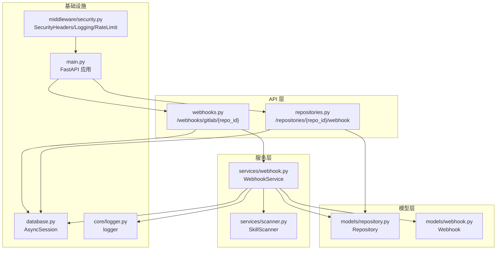
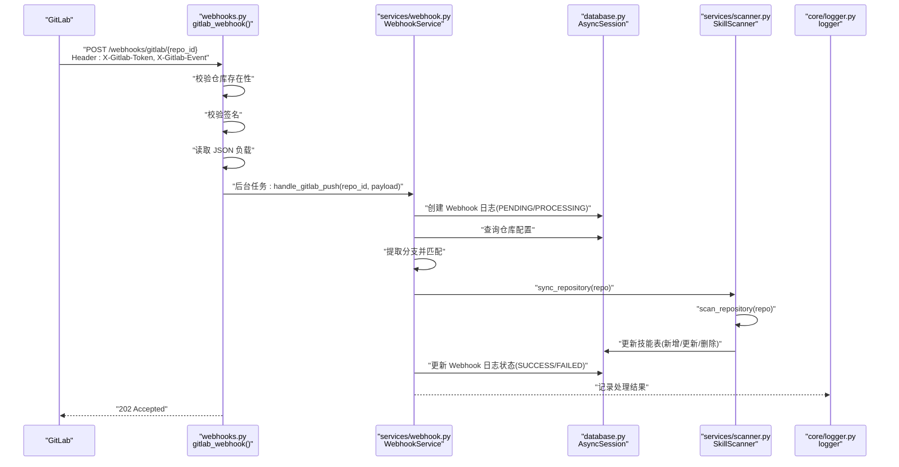
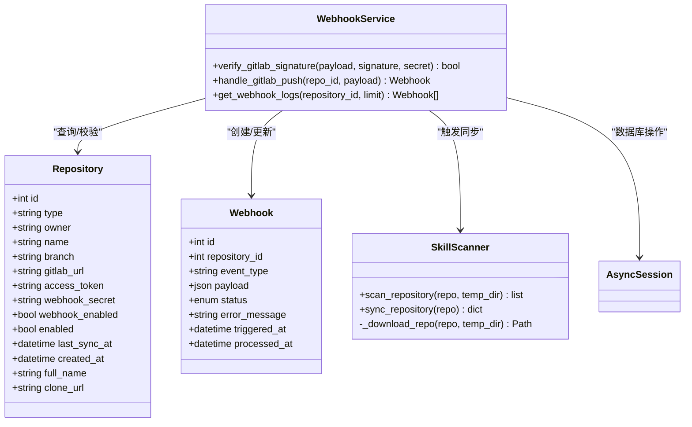

# Webhook 管理 API

<cite>
**本文引用的文件**
- [backend/api/webhooks.py](file://backend/api/webhooks.py)
- [backend/services/webhook.py](file://backend/services/webhook.py)
- [backend/models/webhook.py](file://backend/models/webhook.py)
- [backend/models/repository.py](file://backend/models/repository.py)
- [backend/services/scanner.py](file://backend/services/scanner.py)
- [backend/middleware/security.py](file://backend/middleware/security.py)
- [backend/core/logger.py](file://backend/core/logger.py)
- [backend/database.py](file://backend/database.py)
- [backend/main.py](file://backend/main.py)
- [backend/schema.sql](file://backend/schema.sql)
- [backend/.env.example](file://backend/.env.example)
- [backend/api/repositories.py](file://backend/api/repositories.py)
- [backend/schemas/repository.py](file://backend/schemas/repository.py)
</cite>

## 目录
1. [简介](#简介)
2. [项目结构](#项目结构)
3. [核心组件](#核心组件)
4. [架构总览](#架构总览)
5. [详细组件分析](#详细组件分析)
6. [依赖关系分析](#依赖关系分析)
7. [性能考量](#性能考量)
8. [故障排查指南](#故障排查指南)
9. [结论](#结论)
10. [附录](#附录)

## 简介
本文件系统化梳理 Webhook 管理 API 的设计与实现，重点覆盖以下方面：
- GitLab Push 事件的接收、验证与处理流程
- Webhook 配置、签名验证与安全校验
- 事件触发流程、异步处理与错误恢复策略
- 完整的 Webhook API 接口文档（事件类型、负载格式、响应处理）
- 订阅管理、重复事件处理与幂等性保障
- 事件日志记录、调试工具与监控指标
- 与外部服务（GitLab/GitHub）的集成模式、网络通信与故障转移机制

## 项目结构
后端采用 FastAPI + SQLAlchemy Async 架构，Webhook 相关逻辑集中在 API 路由、服务层与模型层，并通过中间件与日志模块提供安全与可观测性能力。

图表来源
- [backend/api/webhooks.py](file://backend/api/webhooks.py#L15-L64)
- [backend/api/repositories.py](file://backend/api/repositories.py#L179-L204)
- [backend/services/webhook.py](file://backend/services/webhook.py#L15-L124)
- [backend/services/scanner.py](file://backend/services/scanner.py#L21-L197)
- [backend/models/repository.py](file://backend/models/repository.py#L18-L38)
- [backend/models/webhook.py](file://backend/models/webhook.py#L19-L35)
- [backend/database.py](file://backend/database.py#L42-L56)
- [backend/middleware/security.py](file://backend/middleware/security.py#L11-L142)
- [backend/main.py](file://backend/main.py#L46-L85)

章节来源
- [backend/main.py](file://backend/main.py#L46-L85)
- [backend/database.py](file://backend/database.py#L14-L56)

## 核心组件
- Webhook 接收端点：接收 GitLab Push 事件，进行仓库存在性校验、签名验证、事件类型识别与异步处理。
- Webhook 服务：记录 Webhook 日志、执行分支匹配、触发同步任务、维护状态机与错误信息。
- 仓库模型：存储 webhook_enabled、webhook_secret、branch 等配置字段。
- 技能扫描器：根据仓库类型调用 GitHub 或 GitLab 服务下载仓库并扫描 SKILL.md，执行全量同步。
- 安全中间件：统一安全响应头、请求日志与简单内存限流。
- 日志模块：控制台与文件轮转日志，支持错误级别分离与上下文扩展。
- 数据库会话：异步 Session 工厂与依赖注入，确保事务一致性。

章节来源
- [backend/api/webhooks.py](file://backend/api/webhooks.py#L15-L64)
- [backend/services/webhook.py](file://backend/services/webhook.py#L15-L124)
- [backend/models/repository.py](file://backend/models/repository.py#L18-L38)
- [backend/services/scanner.py](file://backend/services/scanner.py#L21-L197)
- [backend/middleware/security.py](file://backend/middleware/security.py#L11-L142)
- [backend/core/logger.py](file://backend/core/logger.py#L11-L95)
- [backend/database.py](file://backend/database.py#L42-L56)

## 架构总览
Webhook 处理链路从 HTTP 入口开始，经由 API 层解析请求与参数，进入服务层完成业务处理，最终落库并触发异步扫描与同步。

图表来源
- [backend/api/webhooks.py](file://backend/api/webhooks.py#L15-L64)
- [backend/services/webhook.py](file://backend/services/webhook.py#L31-L101)
- [backend/services/scanner.py](file://backend/services/scanner.py#L70-L157)
- [backend/core/logger.py](file://backend/core/logger.py#L11-L95)
- [backend/database.py](file://backend/database.py#L42-L56)

## 详细组件分析

### Webhook 接收端点（GitLab）
- 路径与方法：POST /webhooks/gitlab/{repo_id}
- 功能要点：
  - 仓库存在性校验：不存在时返回 404（不暴露仓库信息）。
  - 签名验证：读取 X-Gitlab-Token 并与仓库配置的 webhook_secret 比较；未配置则跳过。
  - 事件类型识别：读取 X-Gitlab-Event，当前仅处理 Push Hook。
  - 负载解析：异步读取 JSON，失败返回 400。
  - 异步处理：将处理逻辑放入后台任务，立即返回 202 Accepted。
- 响应：{"status":"accepted","message":"Webhook received"}

章节来源
- [backend/api/webhooks.py](file://backend/api/webhooks.py#L15-L64)

### Webhook 服务（WebhookService）
- 核心职责：
  - 记录 Webhook 日志（含 payload、状态、时间戳）。
  - 分支匹配：仅处理与仓库配置 branch 一致的推送。
  - 触发同步：调用 SkillScanner 执行全量同步。
  - 状态机：PENDING → PROCESSING → SUCCESS/FAILED，记录错误信息与完成时间。
- 签名验证：verify_gitlab_signature 支持空密钥跳过校验。
- 日志查询：按触发时间倒序分页查询 Webhook 日志。

章节来源
- [backend/services/webhook.py](file://backend/services/webhook.py#L15-L124)
- [backend/models/webhook.py](file://backend/models/webhook.py#L11-L35)

### 仓库模型与配置
- 关键字段：
  - type：仓库类型（GITHUB/GITLAB）
  - branch：目标分支
  - gitlab_url：GitLab 自建实例地址
  - access_token：加密存储的访问令牌
  - webhook_secret：加密存储的 Webhook 密钥
  - webhook_enabled：是否启用 Webhook
- 克隆 URL 生成：根据类型与 gitlab_url 生成 clone_url。

章节来源
- [backend/models/repository.py](file://backend/models/repository.py#L18-L74)

### 技能扫描与同步
- scan_repository：遍历仓库目录，定位 SKILL.md，解析元数据，返回技能列表。
- sync_repository：对比数据库中现有技能，执行新增、更新、删除操作，更新仓库最后同步时间。
- 下载策略：根据仓库类型选择 GitHub 或 GitLab 服务下载仓库。
- 返回结构：包含新增、更新、不变、删除数量与汇总消息。

章节来源
- [backend/services/scanner.py](file://backend/services/scanner.py#L21-L197)

### Webhook 配置接口
- 路径与方法：POST /repositories/{repo_id}/webhook
- 参数：WebhookConfig(enabled: bool, secret: str|null)
- 行为：
  - 启用/禁用 Webhook
  - 若提供 secret 则加密存储；禁用时清空密钥
- 返回：{"message":"Webhook configured","enabled": bool}

章节来源
- [backend/api/repositories.py](file://backend/api/repositories.py#L179-L204)
- [backend/schemas/repository.py](file://backend/schemas/repository.py#L60-L64)
- [backend/core/security.py](file://backend/core/security.py#L31-L54)

### Webhook 日志查询接口
- 路径与方法：GET /webhooks/logs
- 查询参数：repo_id(int|null), limit(int 默认100)
- 返回：日志列表（id、repository_id、event_type、status、error_message、时间戳、是否包含payload）

章节来源
- [backend/api/webhooks.py](file://backend/api/webhooks.py#L67-L89)
- [backend/services/webhook.py](file://backend/services/webhook.py#L103-L116)

### 安全与中间件
- 安全响应头：X-Content-Type-Options、X-Frame-Options、X-XSS-Protection、Strict-Transport-Security、Content-Security-Policy。
- 请求日志：记录方法、路径、客户端 IP、耗时与状态码。
- 速率限制：基于内存的滑动窗口限流，默认对特定路径进行限制。
- 加密：敏感数据（如 access_token、webhook_secret）使用 Fernet 对称加密。

章节来源
- [backend/middleware/security.py](file://backend/middleware/security.py#L11-L142)
- [backend/core/security.py](file://backend/core/security.py#L31-L54)

### 日志与监控
- 日志输出：
  - 控制台 INFO 级别
  - 文件轮转（按大小）：logs/skills.log
  - 错误日志（按时间）：logs/error.log
- 上下文扩展：支持在日志中附加自定义字段，便于追踪请求与 Webhook 事件。

章节来源
- [backend/core/logger.py](file://backend/core/logger.py#L11-L95)

### 数据库与会话
- 异步引擎与会话工厂：aiomysql + SQLAlchemy Async
- 依赖注入：get_db 提供异步 Session，自动提交/回滚/关闭
- Webhook 表结构：包含 repository_id、event_type、payload、status、error_message、时间戳等

章节来源
- [backend/database.py](file://backend/database.py#L14-L56)
- [backend/schema.sql](file://backend/schema.sql#L86-L99)

## 依赖关系分析

图表来源
- [backend/services/webhook.py](file://backend/services/webhook.py#L15-L124)
- [backend/services/scanner.py](file://backend/services/scanner.py#L21-L197)
- [backend/models/repository.py](file://backend/models/repository.py#L18-L74)
- [backend/models/webhook.py](file://backend/models/webhook.py#L19-L35)

章节来源
- [backend/services/webhook.py](file://backend/services/webhook.py#L15-L124)
- [backend/services/scanner.py](file://backend/services/scanner.py#L21-L197)
- [backend/models/repository.py](file://backend/models/repository.py#L18-L74)
- [backend/models/webhook.py](file://backend/models/webhook.py#L19-L35)

## 性能考量
- 异步处理：Webhook 接收端点立即返回，处理逻辑在后台任务中执行，避免阻塞请求。
- 数据库事务：使用异步 Session，按需提交/回滚，减少锁竞争。
- 日志轮转：文件大小与时间维度轮转，避免日志膨胀影响 IO。
- 限流策略：对登录等热点路径进行简单限流，防止突发流量冲击。
- I/O 优化：仓库下载与扫描在服务层集中处理，避免在 API 层引入阻塞。

[本节为通用性能建议，不直接分析具体文件]

## 故障排查指南
- Webhook 未触发或被拒绝
  - 检查 GitLab 配置：URL 是否为 /webhooks/gitlab/{repo_id}，Secret Token 是否与仓库配置一致，事件类型是否勾选 Push events。
  - 查看响应状态：接收端点返回 202 即表示已接受，具体处理结果以日志为准。
- 签名验证失败
  - 确认 X-Gitlab-Token 与仓库 webhook_secret 一致；若未配置密钥，接收端点与服务端均支持跳过校验。
- 分支不匹配导致跳过
  - 确认仓库配置的 branch 与推送分支一致；不一致时日志会记录“Branch not matched”。
- 同步失败
  - 查看 Webhook 日志中的 error_message；检查 access_token、gitlab_url、网络连通性。
- 日志定位
  - 控制台与 logs/skills.log、logs/error.log；结合请求日志中的 method/path/client_host 与耗时进行关联分析。
- 速率限制
  - 若出现 429，请降低请求频率或调整限流阈值。

章节来源
- [backend/api/webhooks.py](file://backend/api/webhooks.py#L22-L64)
- [backend/services/webhook.py](file://backend/services/webhook.py#L31-L101)
- [backend/middleware/security.py](file://backend/middleware/security.py#L65-L142)
- [backend/core/logger.py](file://backend/core/logger.py#L11-L95)

## 结论
该 Webhook 管理 API 以清晰的职责划分与完善的日志体系实现了对 GitLab Push 事件的可靠接收与处理。通过异步任务、状态机与分支匹配，系统在保证吞吐的同时兼顾了正确性与可观测性。配合安全中间件与加密存储，整体具备良好的生产可用性。

[本节为总结性内容，不直接分析具体文件]

## 附录

### Webhook API 接口文档

- 接收端点
  - 方法：POST
  - 路径：/webhooks/gitlab/{repo_id}
  - 请求头：
    - X-Gitlab-Token：与仓库配置的 webhook_secret 一致（可选）
    - X-Gitlab-Event：事件类型，当前支持 "Push Hook"
  - 请求体：JSON（GitLab Push 事件负载）
  - 成功响应：202 Accepted，正文示例：{"status":"accepted","message":"Webhook received"}

- 日志查询
  - 方法：GET
  - 路径：/webhooks/logs
  - 查询参数：
    - repo_id：整数（可选）
    - limit：整数（默认 100）
  - 响应：数组，元素包含 id、repository_id、event_type、status、error_message、triggered_at、processed_at、has_payload

- 配置接口
  - 方法：POST
  - 路径：/repositories/{repo_id}/webhook
  - 请求体：WebhookConfig(enabled: bool, secret: string|null)
  - 响应：{"message":"Webhook configured","enabled": bool}

章节来源
- [backend/api/webhooks.py](file://backend/api/webhooks.py#L15-L89)
- [backend/api/repositories.py](file://backend/api/repositories.py#L179-L204)
- [backend/schemas/repository.py](file://backend/schemas/repository.py#L60-L64)

### 事件类型与负载格式
- 事件类型：Push Hook（GitLab）
- 负载格式：遵循 GitLab Push 事件规范，包含 ref、repository、commits 等字段；服务端仅使用 ref 进行分支匹配。

章节来源
- [backend/services/webhook.py](file://backend/services/webhook.py#L31-L41)

### 安全与配置要点
- 环境变量
  - ENCRYPTION_KEY：用于敏感数据加密（如 access_token、webhook_secret）
  - DATABASE_URL：数据库连接串
- 安全响应头：统一设置安全头部，隐藏服务器信息
- 速率限制：针对特定路径的简单限流

章节来源
- [backend/.env.example](file://backend/.env.example#L1-L17)
- [backend/middleware/security.py](file://backend/middleware/security.py#L11-L142)
- [backend/core/security.py](file://backend/core/security.py#L31-L54)

### 数据模型与索引
- Webhook 表：包含 repository_id、event_type、payload、status、error_message、时间戳等；对 repository_id 与 status 建有索引，便于查询。
- 仓库表：包含 type、owner、name、branch、gitlab_url、access_token、webhook_secret、webhook_enabled 等字段。

章节来源
- [backend/schema.sql](file://backend/schema.sql#L86-L99)
- [backend/models/repository.py](file://backend/models/repository.py#L18-L38)