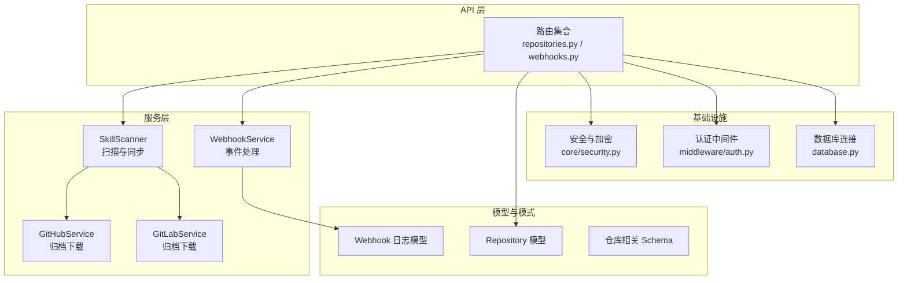
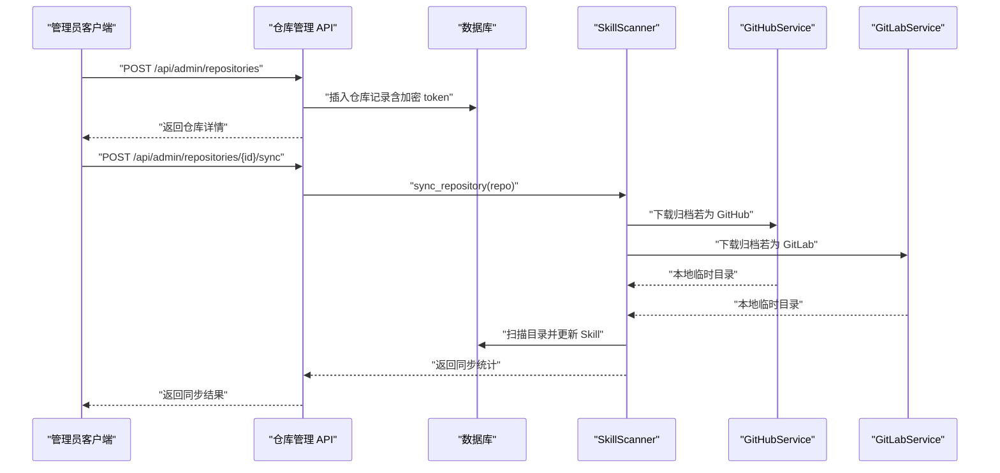
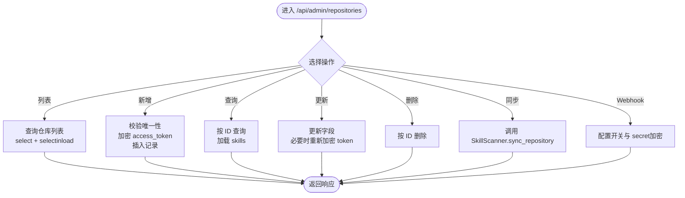
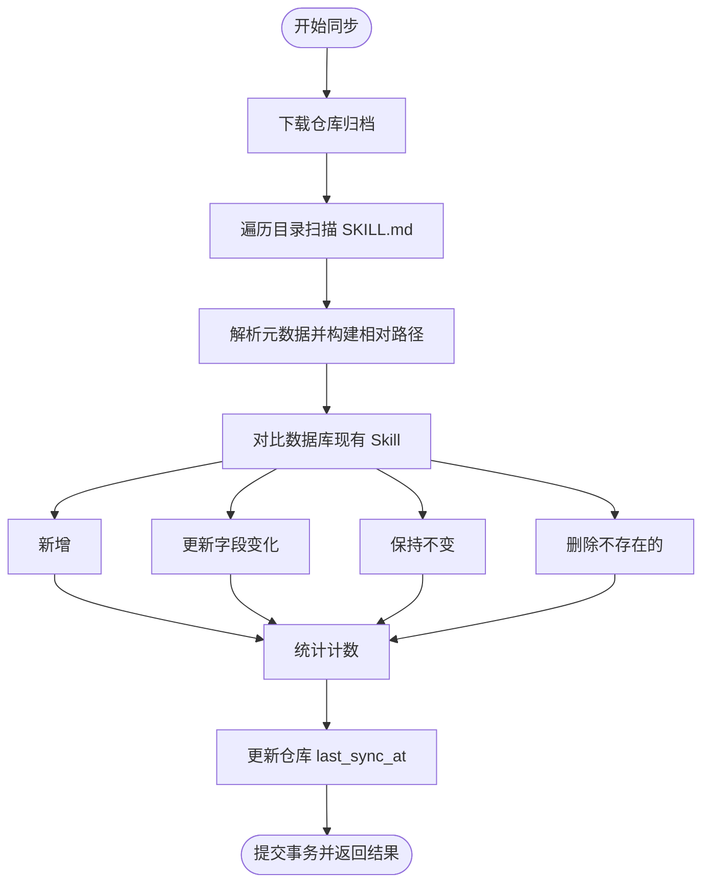
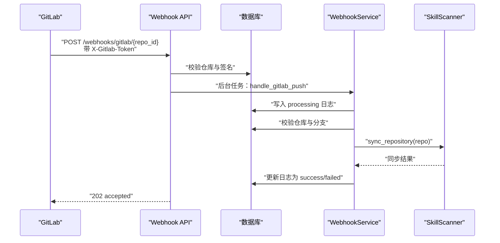
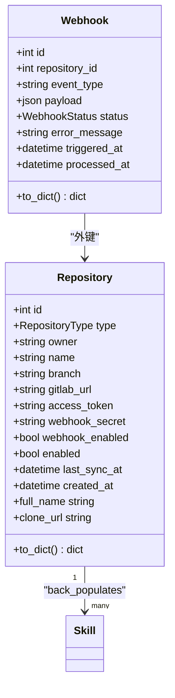
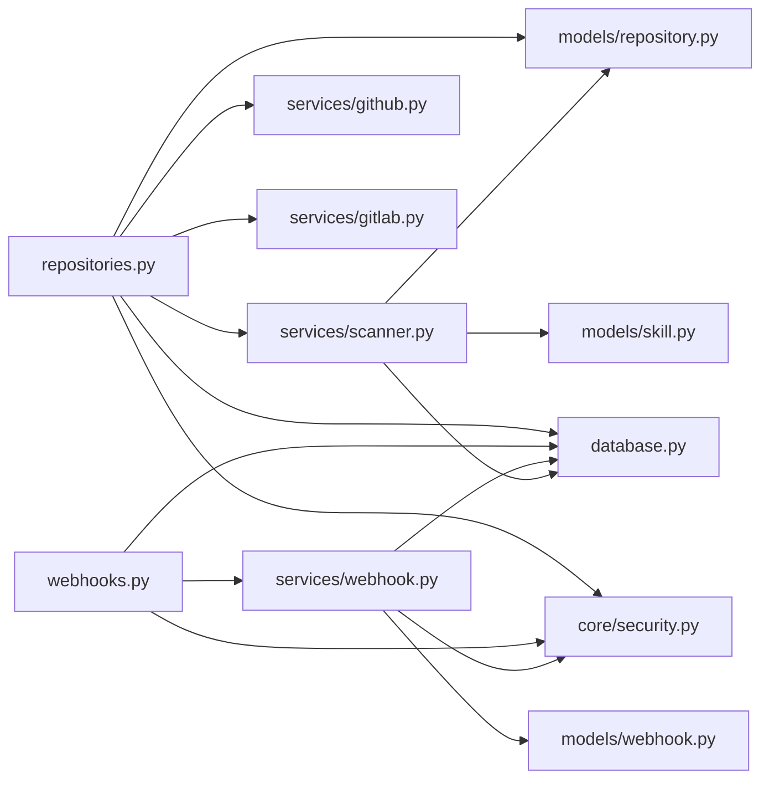

# 仓库管理 API

<cite>
**本文引用的文件**
- [backend/main.py](file://backend/main.py)
- [backend/api/repositories.py](file://backend/api/repositories.py)
- [backend/models/repository.py](file://backend/models/repository.py)
- [backend/schemas/repository.py](file://backend/schemas/repository.py)
- [backend/services/scanner.py](file://backend/services/scanner.py)
- [backend/services/github.py](file://backend/services/github.py)
- [backend/services/gitlab.py](file://backend/services/gitlab.py)
- [backend/api/webhooks.py](file://backend/api/webhooks.py)
- [backend/services/webhook.py](file://backend/services/webhook.py)
- [backend/models/webhook.py](file://backend/models/webhook.py)
- [backend/database.py](file://backend/database.py)
- [backend/schema.sql](file://backend/schema.sql)
- [backend/middleware/auth.py](file://backend/middleware/auth.py)
- [backend/core/security.py](file://backend/core/security.py)
- [backend/.env.example](file://backend/.env.example)
- [README.md](file://README.md)
</cite>

## 目录
1. [简介](#简介)
2. [项目结构](#项目结构)
3. [核心组件](#核心组件)
4. [架构总览](#架构总览)
5. [详细组件分析](#详细组件分析)
6. [依赖关系分析](#依赖关系分析)
7. [性能考量](#性能考量)
8. [故障排查指南](#故障排查指南)
9. [结论](#结论)
10. [附录](#附录)

## 简介
本文件面向仓库管理 API 的使用者与维护者，系统性阐述后端如何管理代码仓库、执行同步与解析、以及与 GitHub/GitLab 的集成机制。内容涵盖：
- 仓库的添加、编辑、删除、查询与手动同步流程
- 与 GitHub/GitLab 的 API 集成、认证与数据同步
- 仓库状态管理、同步历史记录与错误处理策略
- Webhook 配置、事件处理与实时通知
- 权限控制、访问限制与安全考虑

## 项目结构
后端采用 FastAPI + SQLAlchemy Async + MySQL 的技术栈，按职责分层组织：
- API 层：定义路由与对外接口
- 服务层：封装业务逻辑（扫描、解析、外部服务调用）
- 模型层：数据库实体与关系
- 模式层：Pydantic 校验模型
- 中间件与核心模块：认证、安全、异常处理、数据库连接等

图表来源
- [backend/api/repositories.py](file://backend/api/repositories.py#L1-L205)
- [backend/api/webhooks.py](file://backend/api/webhooks.py#L1-L90)
- [backend/services/scanner.py](file://backend/services/scanner.py#L1-L197)
- [backend/services/github.py](file://backend/services/github.py#L1-L105)
- [backend/services/gitlab.py](file://backend/services/gitlab.py#L1-L170)
- [backend/services/webhook.py](file://backend/services/webhook.py#L1-L124)
- [backend/models/repository.py](file://backend/models/repository.py#L1-L74)
- [backend/models/webhook.py](file://backend/models/webhook.py#L1-L49)
- [backend/schemas/repository.py](file://backend/schemas/repository.py#L1-L73)
- [backend/database.py](file://backend/database.py#L1-L75)
- [backend/core/security.py](file://backend/core/security.py#L1-L64)
- [backend/middleware/auth.py](file://backend/middleware/auth.py#L1-L134)

章节来源
- [backend/main.py](file://backend/main.py#L1-L137)
- [README.md](file://README.md#L1-L173)

## 核心组件
- 仓库管理 API：提供仓库的增删改查与手动同步能力
- 扫描服务：统一扫描仓库并解析 SKILL.md，更新数据库
- GitHub/GitLab 服务：负责归档下载与 URL 构造
- Webhook API 与服务：接收 GitLab Push 事件并触发同步
- 数据模型与 Schema：定义仓库、Webhook 日志与请求/响应结构
- 安全与认证：JWT 认证、敏感数据加密、权限控制
- 数据库连接：异步 MySQL 连接与会话管理

章节来源
- [backend/api/repositories.py](file://backend/api/repositories.py#L1-L205)
- [backend/services/scanner.py](file://backend/services/scanner.py#L1-L197)
- [backend/services/github.py](file://backend/services/github.py#L1-L105)
- [backend/services/gitlab.py](file://backend/services/gitlab.py#L1-L170)
- [backend/api/webhooks.py](file://backend/api/webhooks.py#L1-L90)
- [backend/services/webhook.py](file://backend/services/webhook.py#L1-L124)
- [backend/models/repository.py](file://backend/models/repository.py#L1-L74)
- [backend/models/webhook.py](file://backend/models/webhook.py#L1-L49)
- [backend/schemas/repository.py](file://backend/schemas/repository.py#L1-L73)
- [backend/core/security.py](file://backend/core/security.py#L1-L64)
- [backend/middleware/auth.py](file://backend/middleware/auth.py#L1-L134)
- [backend/database.py](file://backend/database.py#L1-L75)

## 架构总览
系统围绕“仓库”与“Skill”两条主线展开：
- 仓库配置与状态：类型、所有者、名称、分支、启用状态、Webhook 开关与密钥、最后同步时间
- Skill 解析与持久化：扫描仓库目录，提取 SKILL.md 元数据，与仓库关联并建立索引
- 外部服务集成：GitHub/GitLab 归档下载，支持私有仓库访问令牌
- Webhook 流程：GitLab Push 事件 → 校验签名 → 过滤分支 → 触发同步 → 记录日志

图表来源
- [backend/api/repositories.py](file://backend/api/repositories.py#L161-L177)
- [backend/services/scanner.py](file://backend/services/scanner.py#L70-L157)
- [backend/services/github.py](file://backend/services/github.py#L36-L102)
- [backend/services/gitlab.py](file://backend/services/gitlab.py#L46-L165)

## 详细组件分析

### 仓库管理 API（增删改查与同步）
- 路由前缀：/api/admin/repositories
- 支持操作：
  - 列表：获取仓库列表并统计 Skill 数量
  - 新增：校验唯一性（type/owner/name/branch），加密 access_token 后入库
  - 查询：按 ID 返回仓库详情（含 skill_count）
  - 更新：可更新 branch/enabled，以及 access_token（重新加密）
  - 删除：按 ID 删除
  - 手动同步：触发 SkillScanner 执行扫描与更新
  - Webhook 配置：开启/关闭并可设置 secret（secret 也会被加密存储）

图表来源
- [backend/api/repositories.py](file://backend/api/repositories.py#L26-L205)

章节来源
- [backend/api/repositories.py](file://backend/api/repositories.py#L1-L205)
- [backend/schemas/repository.py](file://backend/schemas/repository.py#L21-L73)
- [backend/models/repository.py](file://backend/models/repository.py#L18-L74)

### 扫描与同步（SkillScanner）
- 扫描流程：
  - 下载仓库归档（GitHub 使用归档 ZIP；GitLab 优先 ZIP，失败则降级 tar.gz）
  - 遍历目录，定位 SKILL.md 并解析元数据
  - 构建 README 与原始内容 URL
- 同步策略：
  - 对比数据库中现有 Skill，计算新增/更新/不变/删除
  - 更新仓库 last_sync_at
  - 返回结构化统计结果

图表来源
- [backend/services/scanner.py](file://backend/services/scanner.py#L27-L157)
- [backend/services/github.py](file://backend/services/github.py#L36-L102)
- [backend/services/gitlab.py](file://backend/services/gitlab.py#L46-L165)

章节来源
- [backend/services/scanner.py](file://backend/services/scanner.py#L1-L197)

### GitHub/GitLab 集成
- GitHubService
  - 归档 URL：/archive/refs/heads/{branch}.zip
  - 私有仓库使用 Authorization: token {access_token}
  - 下载后解压，返回根目录路径
- GitLabService
  - 归档 URL：/-/archive/{branch}/{name}-{branch}.tar.gz 或 .zip
  - 私有仓库使用 PRIVATE-TOKEN: {access_token}
  - ZIP 失败时自动降级为 tar.gz

章节来源
- [backend/services/github.py](file://backend/services/github.py#L1-L105)
- [backend/services/gitlab.py](file://backend/services/gitlab.py#L1-L170)

### Webhook 配置与事件处理
- Webhook 接收端点（GitLab）
  - 路径：/webhooks/gitlab/{repo_id}
  - 校验：X-Gitlab-Token 与仓库配置的 webhook_secret（需加密存储）
  - 事件：仅处理 Push Hook
  - 异步：在后台任务中调用 WebhookService.handle_gitlab_push
- WebhookService
  - 记录 Webhook 日志（状态：pending/processing/success/failed）
  - 校验仓库存在与启用状态
  - 分支匹配：仅处理与仓库配置一致的分支
  - 触发 SkillScanner 同步
  - 记录错误信息与处理完成时间

图表来源
- [backend/api/webhooks.py](file://backend/api/webhooks.py#L15-L65)
- [backend/services/webhook.py](file://backend/services/webhook.py#L31-L101)

章节来源
- [backend/api/webhooks.py](file://backend/api/webhooks.py#L1-L90)
- [backend/services/webhook.py](file://backend/services/webhook.py#L1-L124)
- [backend/models/webhook.py](file://backend/models/webhook.py#L1-L49)

### 数据模型与 Schema
- 仓库模型（repositories）
  - 字段：type、owner、name、branch、gitlab_url、access_token（加密）、webhook_secret（加密）、webhook_enabled、enabled、last_sync_at、created_at
  - 方法：to_dict（不泄露敏感信息）、full_name、clone_url
- Webhook 日志模型（webhooks）
  - 字段：repository_id、event_type、payload、status（枚举）、error_message、triggered_at、processed_at
- 仓库 Schema
  - RepositoryCreate：校验类型、分支格式；GitLab 时要求 gitlab_url
  - RepositoryUpdate：可更新 branch、access_token、webhook_secret、webhook_enabled、enabled
  - RepositoryResponse：对外响应结构，包含 skill_count、has_token、has_webhook_secret
  - WebhookConfig：配置开关与 secret
  - SyncResponse：同步结果统计

图表来源
- [backend/models/repository.py](file://backend/models/repository.py#L18-L74)
- [backend/models/webhook.py](file://backend/models/webhook.py#L19-L49)

章节来源
- [backend/models/repository.py](file://backend/models/repository.py#L1-L74)
- [backend/models/webhook.py](file://backend/models/webhook.py#L1-L49)
- [backend/schemas/repository.py](file://backend/schemas/repository.py#L1-L73)

### 权限控制与安全
- 认证与授权
  - JWT Bearer 认证，依赖注入 get_current_user
  - require_admin 限制管理接口仅管理员可用
  - 未登录访问将返回 401，用户不存在或禁用同样返回 401
- 敏感数据保护
  - access_token 与 webhook_secret 使用 Fernet 对称加密存储
  - .env.example 提供示例密钥，建议在生产环境替换
- 数据库连接
  - 异步连接池配置，健康检查与溢出连接控制
- Webhook 签名
  - GitLab 使用 X-Gitlab-Token 与仓库配置的 secret 校验
  - 未配置 secret 时跳过校验（安全风险提示）

章节来源
- [backend/middleware/auth.py](file://backend/middleware/auth.py#L1-L134)
- [backend/core/security.py](file://backend/core/security.py#L1-L64)
- [backend/database.py](file://backend/database.py#L1-L75)
- [backend/.env.example](file://backend/.env.example#L1-L17)
- [backend/api/webhooks.py](file://backend/api/webhooks.py#L37-L42)

## 依赖关系分析
- 组件耦合
  - API 层依赖服务层与模型层；服务层依赖外部服务与数据库
  - Webhook API 与 WebhookService 解耦，通过后台任务异步处理
- 外部依赖
  - httpx 异步 HTTP 客户端
  - cryptography Fernet 加密
  - passlib argon2 密码哈希
- 数据库设计
  - repositories 与 skills 多对一；webhooks 外键关联 repositories
  - 索引优化：type+enabled、owner+name、repository_id+status、triggered_at

图表来源
- [backend/api/repositories.py](file://backend/api/repositories.py#L1-L205)
- [backend/api/webhooks.py](file://backend/api/webhooks.py#L1-L90)
- [backend/services/scanner.py](file://backend/services/scanner.py#L1-L197)
- [backend/services/github.py](file://backend/services/github.py#L1-L105)
- [backend/services/gitlab.py](file://backend/services/gitlab.py#L1-L170)
- [backend/services/webhook.py](file://backend/services/webhook.py#L1-L124)
- [backend/models/repository.py](file://backend/models/repository.py#L1-L74)
- [backend/models/webhook.py](file://backend/models/webhook.py#L1-L49)
- [backend/database.py](file://backend/database.py#L1-L75)
- [backend/core/security.py](file://backend/core/security.py#L1-L64)

章节来源
- [backend/schema.sql](file://backend/schema.sql#L22-L99)

## 性能考量
- 异步 I/O：归档下载与数据库操作均采用异步，减少阻塞
- 连接池：合理配置 pool_size 与 max_overflow，避免高并发下的连接争用
- 扫描范围：遍历目录时跳过隐藏目录，降低 IO 压力
- 索引优化：针对常用查询建立索引，提升列表与搜索性能
- 缓存策略：可引入 Redis 缓存最近同步结果与热门仓库元数据（建议）

## 故障排查指南
- 数据库连接失败
  - 现象：启动时报错或健康检查返回异常
  - 排查：确认 DATABASE_URL、网络连通性与凭据
- 外部服务错误（GitHub/GitLab）
  - 现象：下载归档失败或 HTTP 状态异常
  - 排查：检查 access_token 是否正确、网络可达、分支名是否匹配
- Webhook 签名失败
  - 现象：收到 403
  - 排查：确认 GitLab Webhook Secret 与仓库配置一致，且均已加密存储
- 分支不匹配导致跳过
  - 现象：Webhook 成功但未触发同步
  - 排查：核对仓库配置的 branch 与推送分支一致
- 权限不足
  - 现象：管理接口返回 403
  - 排查：确保 JWT Token 有效且用户角色为 ADMIN

章节来源
- [backend/database.py](file://backend/database.py#L58-L75)
- [backend/services/github.py](file://backend/services/github.py#L69-L97)
- [backend/services/gitlab.py](file://backend/services/gitlab.py#L81-L141)
- [backend/api/webhooks.py](file://backend/api/webhooks.py#L37-L42)
- [backend/services/webhook.py](file://backend/services/webhook.py#L66-L82)
- [backend/middleware/auth.py](file://backend/middleware/auth.py#L98-L108)

## 结论
该仓库管理 API 以清晰的分层架构实现了从仓库配置、扫描解析到同步与 Webhook 自动化的完整闭环。通过异步 I/O、加密存储与严格的权限控制，系统在保证安全性的同时具备良好的扩展性。建议在生产环境中完善密钥管理、监控告警与缓存策略，持续优化同步性能与用户体验。

## 附录

### 接口文档（仓库管理）
- 列表仓库
  - 方法：GET
  - 路径：/api/admin/repositories
  - 认证：需要 JWT
  - 响应：仓库数组（包含 skill_count）
- 新增仓库
  - 方法：POST
  - 路径：/api/admin/repositories
  - 认证：需要 JWT
  - 请求体：RepositoryCreate
  - 响应：RepositoryResponse
- 查询仓库
  - 方法：GET
  - 路径：/api/admin/repositories/{id}
  - 认证：需要 JWT
  - 响应：RepositoryResponse
- 更新仓库
  - 方法：PUT
  - 路径：/api/admin/repositories/{id}
  - 认证：需要 JWT
  - 请求体：RepositoryUpdate
  - 响应：RepositoryResponse
- 删除仓库
  - 方法：DELETE
  - 路径：/api/admin/repositories/{id}
  - 认证：需要 JWT
  - 响应：204 No Content
- 手动同步
  - 方法：POST
  - 路径：/api/admin/repositories/{id}/sync
  - 认证：需要 JWT
  - 响应：SyncResponse
- 配置 Webhook
  - 方法：POST
  - 路径：/api/admin/repositories/{id}/webhook
  - 认证：需要 JWT
  - 请求体：WebhookConfig
  - 响应：{"message": "...", "enabled": bool}

章节来源
- [backend/api/repositories.py](file://backend/api/repositories.py#L26-L205)
- [backend/schemas/repository.py](file://backend/schemas/repository.py#L21-L73)
- [README.md](file://README.md#L127-L133)

### Webhook 接收（GitLab）
- 路径：/webhooks/gitlab/{repo_id}
- 方法：POST
- 认证：X-Gitlab-Token 与仓库配置的 secret 校验
- 事件：Push Hook
- 响应：{"status": "accepted", "message": "Webhook received"}

章节来源
- [backend/api/webhooks.py](file://backend/api/webhooks.py#L15-L65)

### 数据库初始化脚本要点
- 数据库：skills（utf8mb4）
- 表：users、repositories、categories、skills、category_skills、webhooks
- 索引：type+enabled、owner+name、repository_id+status、triggered_at
- 初始 admin 用户：username=admin，默认密码见 schema.sql

章节来源
- [backend/schema.sql](file://backend/schema.sql#L1-L106)