# 分类管理 API

<cite>
**本文档引用的文件**
- [backend/api/categories.py](file://backend/api/categories.py)
- [backend/api/public_categories.py](file://backend/api/public_categories.py)
- [backend/models/category.py](file://backend/models/category.py)
- [backend/schemas/category.py](file://backend/schemas/category.py)
- [backend/models/skill.py](file://backend/models/skill.py)
- [backend/schemas/skill.py](file://backend/schemas/skill.py)
- [backend/middleware/auth.py](file://backend/middleware/auth.py)
- [backend/database.py](file://backend/database.py)
- [backend/main.py](file://backend/main.py)
- [backend/middleware/security.py](file://backend/middleware/security.py)
- [backend/core/security.py](file://backend/core/security.py)
</cite>

## 目录
1. [简介](#简介)
2. [项目结构](#项目结构)
3. [核心组件](#核心组件)
4. [架构概览](#架构概览)
5. [详细组件分析](#详细组件分析)
6. [依赖关系分析](#依赖关系分析)
7. [性能考虑](#性能考虑)
8. [故障排除指南](#故障排除指南)
9. [结论](#结论)

## 简介

Skills Hub 是一个基于 FastAPI 构建的内部技能管理发现平台，专注于提供多级分类系统的完整解决方案。本文档深入解析分类管理 API 的实现，包括分类创建、层级管理、关系维护、权限控制等核心功能。

该系统实现了两种分类模式：
- **私有分类（管理员）**：通过 `/api/admin/categories` 路由提供，需要管理员认证
- **公共分类（公开访问）**：通过 `/api/categories` 路由提供，无需认证即可访问

系统采用异步 SQLAlchemy 模型，支持高效的多级分类树结构操作，包括分类树构建、遍历和查询优化。

## 项目结构

项目采用分层架构设计，主要分为以下层次：

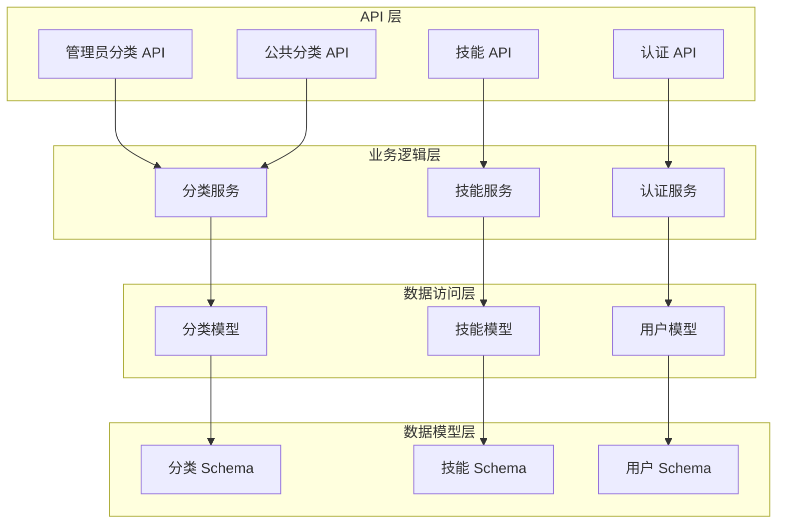

**图表来源**
- [backend/api/categories.py](file://backend/api/categories.py#L1-L294)
- [backend/api/public_categories.py](file://backend/api/public_categories.py#L1-L129)
- [backend/models/category.py](file://backend/models/category.py#L1-L94)

**章节来源**
- [backend/main.py](file://backend/main.py#L24-L84)
- [backend/database.py](file://backend/database.py#L1-L75)

## 核心组件

### 分类模型设计

系统使用自引用关系实现多级分类结构：

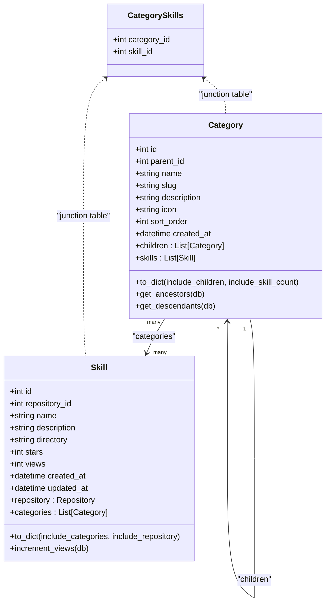

**图表来源**
- [backend/models/category.py](file://backend/models/category.py#L19-L94)
- [backend/models/skill.py](file://backend/models/skill.py#L11-L90)

### 分类 Schema 设计

系统提供了完整的数据传输对象（DTO）：

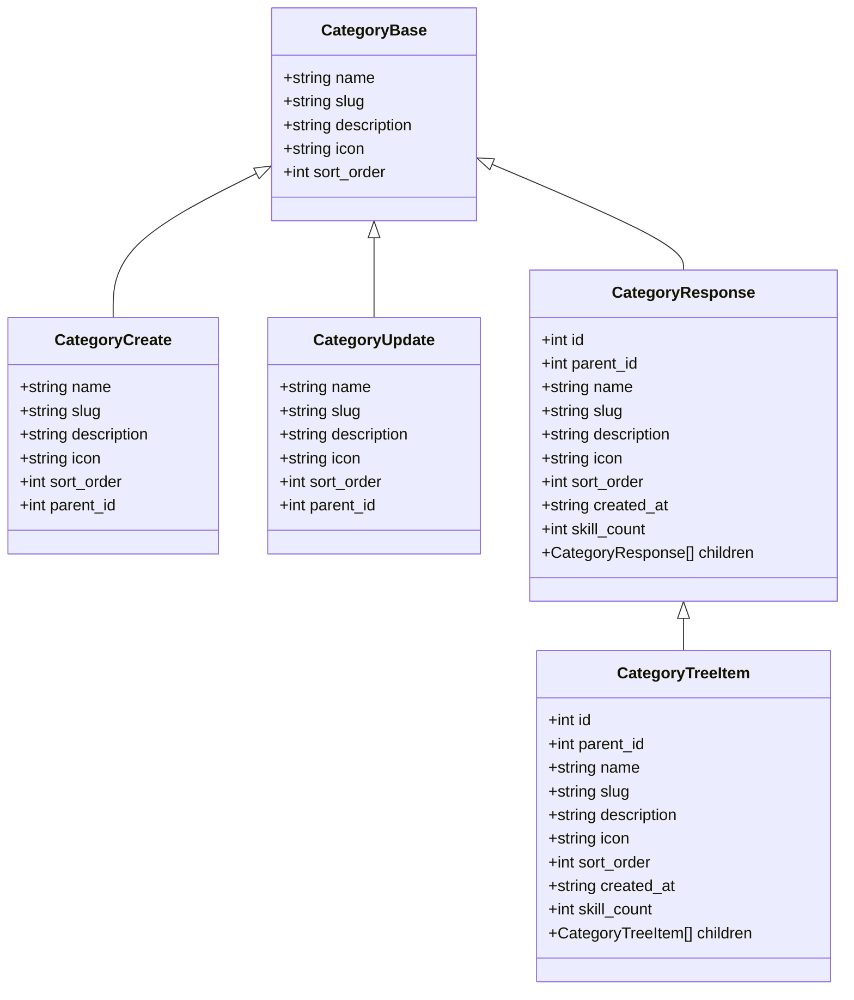

**图表来源**
- [backend/schemas/category.py](file://backend/schemas/category.py#L7-L93)

**章节来源**
- [backend/models/category.py](file://backend/models/category.py#L19-L94)
- [backend/schemas/category.py](file://backend/schemas/category.py#L7-L93)

## 架构概览

系统采用现代 Web 应用架构，结合了异步处理、中间件模式和依赖注入：

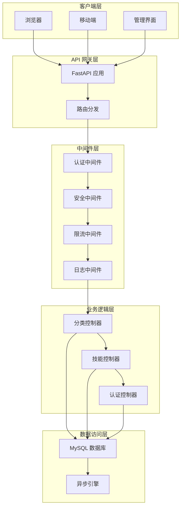

**图表来源**
- [backend/main.py](file://backend/main.py#L47-L84)
- [backend/middleware/auth.py](file://backend/middleware/auth.py#L48-L95)
- [backend/middleware/security.py](file://backend/middleware/security.py#L11-L142)

## 详细组件分析

### 管理员分类 API

管理员分类 API 提供完整的 CRUD 操作和高级功能：

#### 核心路由功能

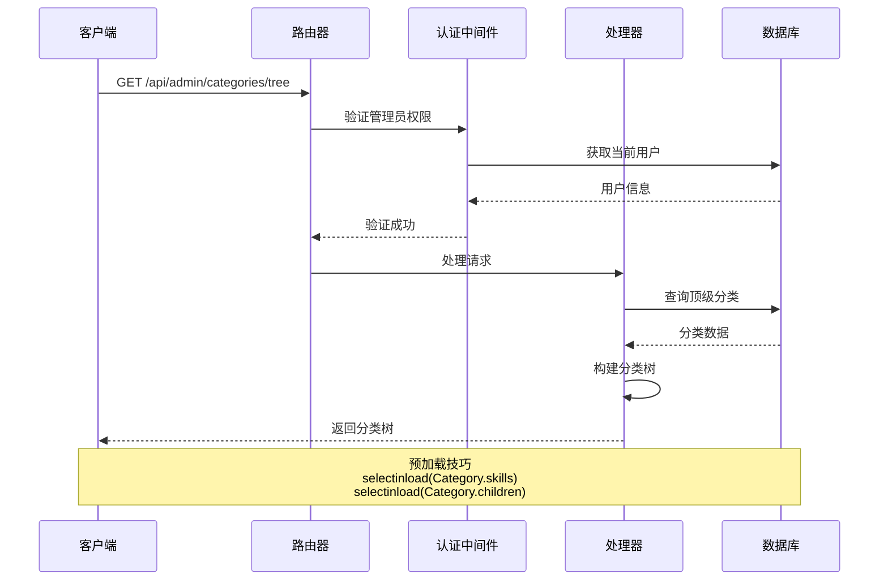

**图表来源**
- [backend/api/categories.py](file://backend/api/categories.py#L24-L47)
- [backend/middleware/auth.py](file://backend/middleware/auth.py#L48-L95)

#### 分类树构建算法

系统实现了高效的分类树构建算法：

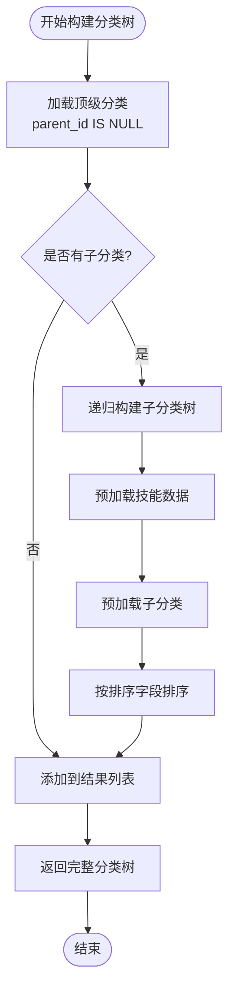

**图表来源**
- [backend/api/categories.py](file://backend/api/categories.py#L24-L47)
- [backend/schemas/category.py](file://backend/schemas/category.py#L42-L78)

#### 分类 CRUD 操作

管理员分类 API 支持完整的 CRUD 操作：

| 操作 | 方法 | 路径 | 功能描述 |
|------|------|------|----------|
| 获取分类树 | GET | `/api/admin/categories/tree` | 获取完整的分类树结构 |
| 列出分类 | GET | `/api/admin/categories` | 获取所有分类的平铺列表 |
| 创建分类 | POST | `/api/admin/categories` | 创建新的分类 |
| 获取分类详情 | GET | `/api/admin/categories/{id}` | 获取指定分类的详细信息 |
| 更新分类 | PUT | `/api/admin/categories/{id}` | 更新分类信息 |
| 删除分类 | DELETE | `/api/admin/categories/{id}` | 删除分类及其子分类 |

**章节来源**
- [backend/api/categories.py](file://backend/api/categories.py#L24-L294)

### 公共分类 API

公共分类 API 提供只读访问功能，无需认证：

#### 公开访问特性

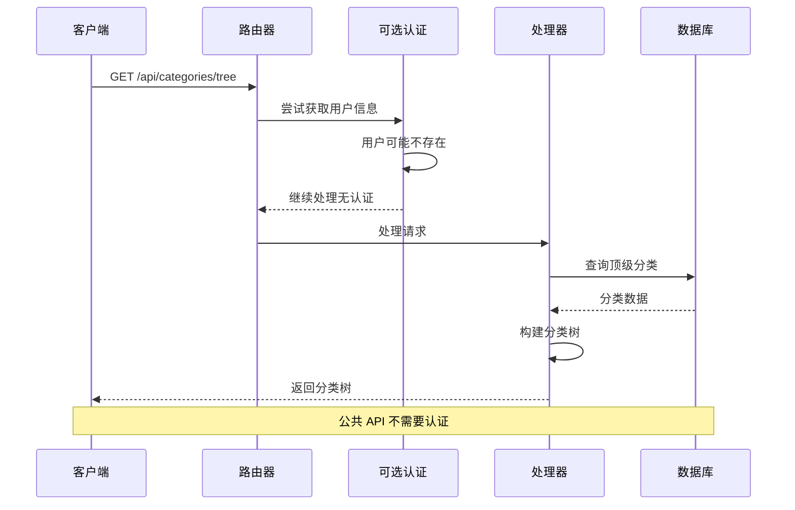

**图表来源**
- [backend/api/public_categories.py](file://backend/api/public_categories.py#L1-L129)
- [backend/middleware/auth.py](file://backend/middleware/auth.py#L112-L133)

#### 公共路由功能

| 操作 | 方法 | 路径 | 功能描述 |
|------|------|------|----------|
| 获取分类树 | GET | `/api/categories/tree` | 获取完整的分类树结构（公开） |
| 列出分类 | GET | `/api/categories` | 获取所有分类的平铺列表（公开） |
| 获取分类详情 | GET | `/api/categories/{id}` | 获取指定分类的详细信息（公开） |
| 获取分类技能 | GET | `/api/categories/{slug}/skills` | 获取指定分类下的所有技能（公开） |

**章节来源**
- [backend/api/public_categories.py](file://backend/api/public_categories.py#L18-L129)

### 技能与分类关联

系统实现了灵活的多对多关系管理：

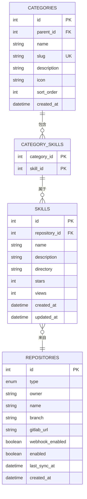

**图表来源**
- [backend/models/category.py](file://backend/models/category.py#L10-L16)
- [backend/models/skill.py](file://backend/models/skill.py#L11-L39)

#### 技能分配操作

系统提供了多种技能分配方式：

| 操作 | 方法 | 路径 | 功能描述 |
|------|------|------|----------|
| 分配技能到分类 | POST | `/api/admin/categories/{category_id}/skills/{skill_id}` | 将技能分配到指定分类 |
| 从分类移除技能 | DELETE | `/api/admin/categories/{category_id}/skills/{skill_id}` | 从分类移除技能 |
| 批量分配技能分类 | POST | `/api/admin/skills/{skill_id}/categories` | 为技能分配多个分类 |

**章节来源**
- [backend/api/categories.py](file://backend/api/categories.py#L217-L293)

### 权限控制与安全策略

系统实现了多层次的安全控制机制：

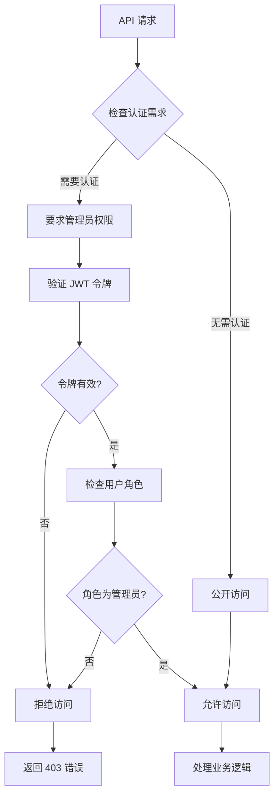

**图表来源**
- [backend/middleware/auth.py](file://backend/middleware/auth.py#L48-L108)
- [backend/middleware/security.py](file://backend/middleware/security.py#L11-L142)

#### 安全中间件配置

系统集成了多项安全保护措施：

| 中间件 | 功能 | 配置 |
|--------|------|------|
| SecurityHeadersMiddleware | 安全响应头 | X-Content-Type-Options: nosniff X-Frame-Options: DENY X-XSS-Protection: 1; mode=block Strict-Transport-Security: max-age=31536000; includeSubDomains |
| LoggingMiddleware | 请求日志 | 记录请求方法、路径、客户端 IP、处理时间 |
| RateLimitMiddleware | 速率限制 | 登录接口：5次/分钟 |

**章节来源**
- [backend/middleware/security.py](file://backend/middleware/security.py#L11-L142)

## 依赖关系分析

系统采用了清晰的依赖注入和模块化设计：

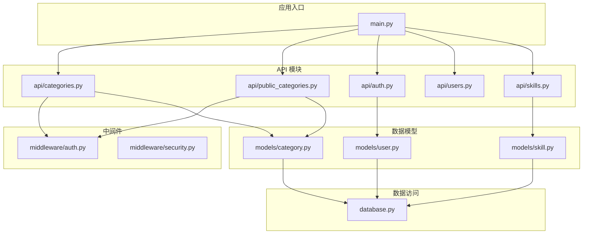

**图表来源**
- [backend/main.py](file://backend/main.py#L24-L84)
- [backend/api/categories.py](file://backend/api/categories.py#L9-L18)

### 数据库连接管理

系统使用异步 SQLAlchemy 实现高效的数据访问：

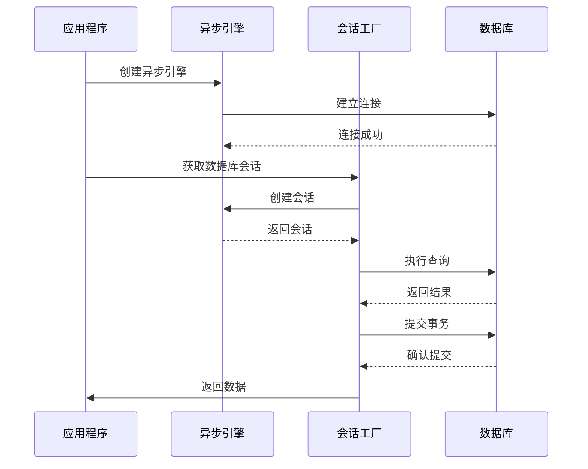

**图表来源**
- [backend/database.py](file://backend/database.py#L20-L55)

**章节来源**
- [backend/database.py](file://backend/database.py#L1-L75)

## 性能考虑

### 查询优化策略

系统采用了多种查询优化技术：

1. **N+1 查询问题解决**：使用 `selectinload` 预加载关联数据
2. **索引优化**：在常用查询字段上建立索引
3. **批量操作**：支持批量分类分配操作
4. **缓存策略**：虽然当前未实现缓存，但架构支持后续扩展

### 异步处理优势

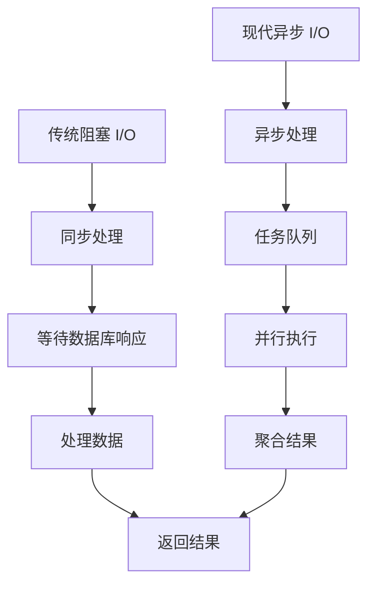

**图表来源**
- [backend/database.py](file://backend/database.py#L20-L36)

### 并发控制机制

系统通过以下机制确保数据一致性：

1. **事务管理**：每个 API 调用都在独立事务中执行
2. **连接池**：使用 SQLAlchemy 连接池管理数据库连接
3. **异常处理**：自动回滚失败的事务
4. **会话管理**：异步会话确保线程安全

**章节来源**
- [backend/database.py](file://backend/database.py#L42-L55)

## 故障排除指南

### 常见错误类型

系统定义了多种错误类型来处理不同的异常情况：

| 错误类型 | HTTP 状态码 | 描述 | 处理建议 |
|----------|-------------|------|----------|
| NotFoundError | 404 | 资源未找到 | 检查资源 ID 或 slug 是否正确 |
| ConflictError | 409 | 资源冲突 | 修改 slug 或其他唯一字段 |
| ValidationError | 422 | 数据验证失败 | 检查输入数据格式和约束 |
| AuthenticationError | 401 | 认证失败 | 检查 JWT 令牌有效性 |
| AuthorizationError | 403 | 权限不足 | 确认用户具有管理员权限 |

### 调试技巧

1. **启用详细日志**：检查 `LoggingMiddleware` 输出
2. **数据库连接测试**：使用 `/api/health` 端点
3. **请求追踪**：查看请求 ID 和处理时间
4. **错误堆栈**：检查异常处理器输出

**章节来源**
- [backend/middleware/security.py](file://backend/middleware/security.py#L31-L59)

### 性能监控

系统提供了内置的健康检查和性能监控：

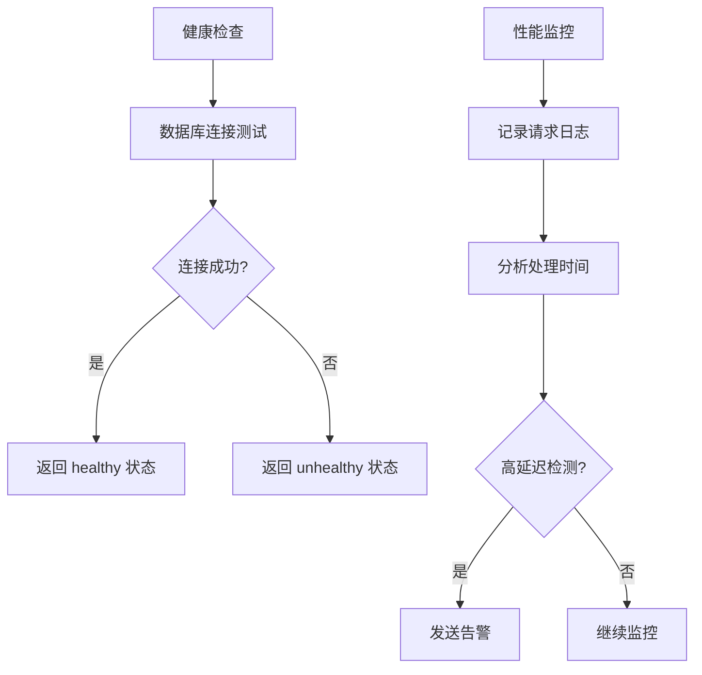

**图表来源**
- [backend/main.py](file://backend/main.py#L88-L104)

## 结论

Skills Hub 的分类管理 API 提供了一个完整、高效且安全的多级分类解决方案。系统的主要优势包括：

### 核心优势

1. **完整的 CRUD 功能**：支持分类的创建、读取、更新、删除操作
2. **灵活的权限控制**：区分管理员和公共访问权限
3. **高效的查询优化**：使用预加载和索引优化查询性能
4. **异步架构设计**：利用现代异步 I/O 提升系统性能
5. **多层次安全防护**：集成认证、授权、速率限制等安全机制

### 技术亮点

- **多级分类树**：支持任意深度的分类层级结构
- **关联关系管理**：灵活的多对多关系处理
- **异步数据库操作**：使用 SQLAlchemy 异步引擎
- **中间件架构**：可扩展的安全和监控中间件
- **类型安全**：完整的 Pydantic Schema 定义

### 扩展建议

1. **缓存机制**：实现 Redis 缓存以提升查询性能
2. **分页功能**：为大量数据提供分页支持
3. **搜索功能**：添加全文搜索和过滤功能
4. **审计日志**：记录所有分类变更历史
5. **批量操作**：支持批量导入和导出功能

该系统为企业内部技能管理提供了坚实的技术基础，可以轻松扩展以满足更复杂的需求。