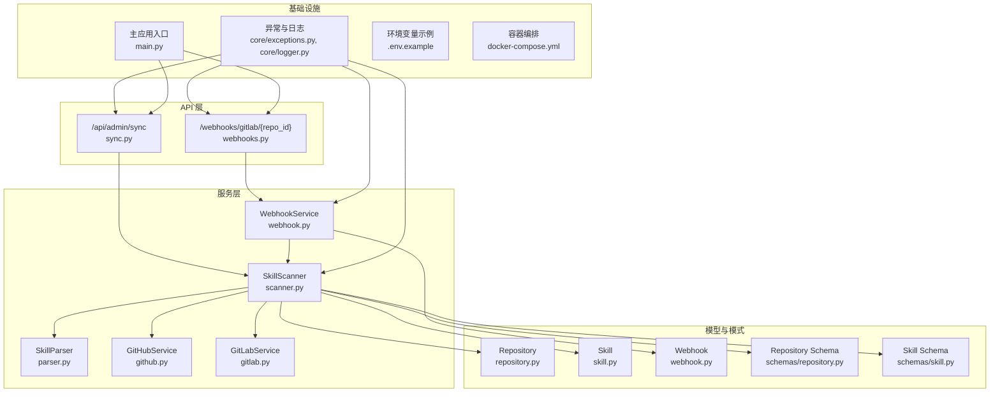
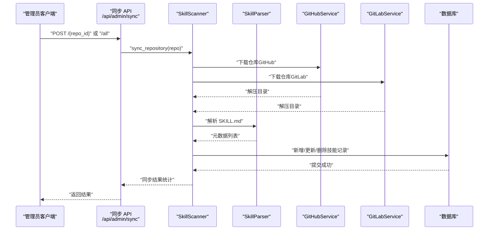
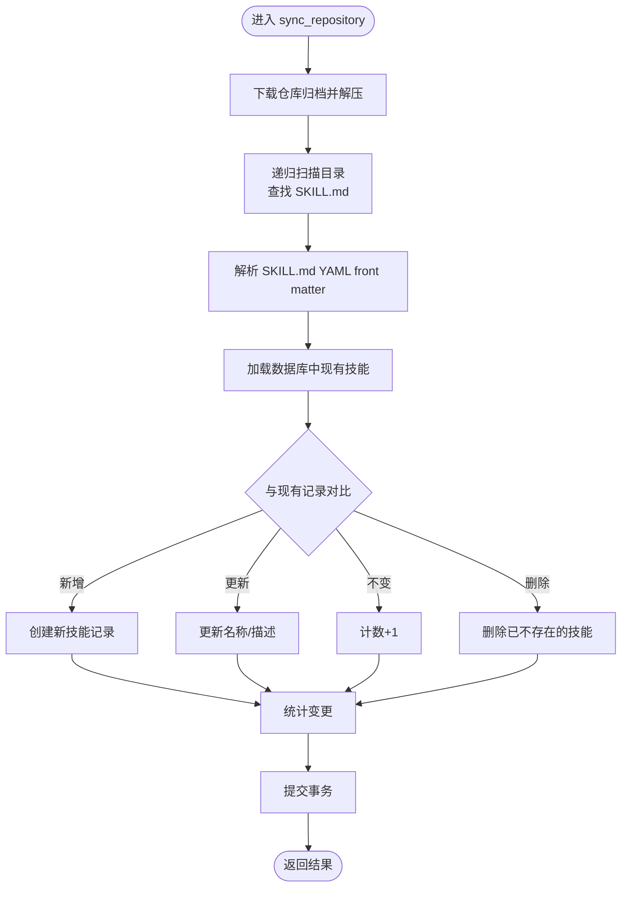
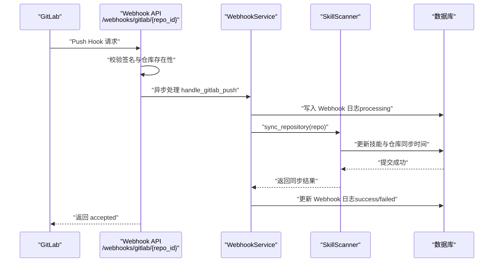
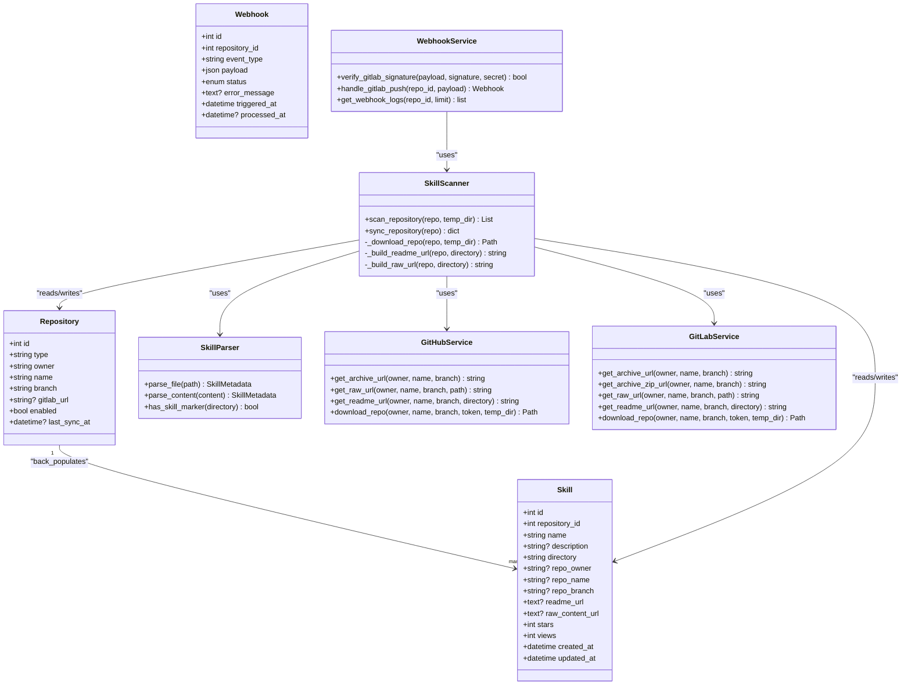

# 同步管理 API

<cite>
**本文引用的文件**
- [backend/main.py](file://backend/main.py)
- [backend/api/sync.py](file://backend/api/sync.py)
- [backend/services/scanner.py](file://backend/services/scanner.py)
- [backend/services/parser.py](file://backend/services/parser.py)
- [backend/services/github.py](file://backend/services/github.py)
- [backend/services/gitlab.py](file://backend/services/gitlab.py)
- [backend/models/repository.py](file://backend/models/repository.py)
- [backend/models/skill.py](file://backend/models/skill.py)
- [backend/schemas/repository.py](file://backend/schemas/repository.py)
- [backend/schemas/skill.py](file://backend/schemas/skill.py)
- [backend/api/webhooks.py](file://backend/api/webhooks.py)
- [backend/services/webhook.py](file://backend/services/webhook.py)
- [backend/models/webhook.py](file://backend/models/webhook.py)
- [backend/core/exceptions.py](file://backend/core/exceptions.py)
- [backend/core/logger.py](file://backend/core/logger.py)
- [backend/.env.example](file://backend/.env.example)
- [docker-compose.yml](file://docker-compose.yml)
</cite>

## 目录
1. [简介](#简介)
2. [项目结构](#项目结构)
3. [核心组件](#核心组件)
4. [架构总览](#架构总览)
5. [详细组件分析](#详细组件分析)
6. [依赖关系分析](#依赖关系分析)
7. [性能考量](#性能考量)
8. [故障排查指南](#故障排查指南)
9. [结论](#结论)
10. [附录](#附录)

## 简介
本文件面向“同步管理 API”的综合技术文档，聚焦技能内容的自动同步机制，涵盖以下方面：
- 定时任务、手动触发与状态监控
- 文件扫描流程、内容解析与数据库更新
- 同步状态跟踪、错误处理与重试机制
- 同步 API 接口文档（触发、进度查询、结果获取）
- 并发同步控制、锁机制与冲突解决策略
- 同步历史记录、日志管理与性能监控
- 同步配置、调度策略与资源限制

当前代码库已实现手动同步与基于 GitLab Push 事件的自动同步，但未内置通用的定时任务调度器。本文将基于现有实现进行扩展性设计说明，并提供可落地的实践建议。

## 项目结构
后端采用 FastAPI + SQLAlchemy 异步架构，API 层负责路由与鉴权，服务层封装业务逻辑，模型层映射数据库表，模式层定义输入输出结构。

图表来源
- [backend/api/sync.py](file://backend/api/sync.py#L1-L112)
- [backend/api/webhooks.py](file://backend/api/webhooks.py#L1-L90)
- [backend/services/scanner.py](file://backend/services/scanner.py#L1-L197)
- [backend/services/parser.py](file://backend/services/parser.py#L1-L86)
- [backend/services/github.py](file://backend/services/github.py#L1-L105)
- [backend/services/gitlab.py](file://backend/services/gitlab.py#L1-L170)
- [backend/services/webhook.py](file://backend/services/webhook.py#L1-L124)
- [backend/models/repository.py](file://backend/models/repository.py#L1-L74)
- [backend/models/skill.py](file://backend/models/skill.py#L1-L90)
- [backend/models/webhook.py](file://backend/models/webhook.py#L1-L49)
- [backend/schemas/repository.py](file://backend/schemas/repository.py#L1-L73)
- [backend/schemas/skill.py](file://backend/schemas/skill.py#L1-L60)
- [backend/core/exceptions.py](file://backend/core/exceptions.py#L1-L101)
- [backend/core/logger.py](file://backend/core/logger.py#L1-L95)
- [backend/main.py](file://backend/main.py#L1-L137)
- [backend/.env.example](file://backend/.env.example#L1-L17)
- [docker-compose.yml](file://docker-compose.yml#L1-L55)

章节来源
- [backend/main.py](file://backend/main.py#L24-L84)
- [backend/api/sync.py](file://backend/api/sync.py#L1-L112)
- [backend/api/webhooks.py](file://backend/api/webhooks.py#L1-L90)

## 核心组件
- 同步 API 路由：提供单仓库手动同步、全仓库同步与状态查询接口。
- 技能扫描器：负责仓库下载、目录扫描、元数据解析与数据库同步。
- 解析器：解析 SKILL.md 的 YAML front matter。
- Git 服务：封装 GitHub/GitLab 归档下载与 URL 构造。
- Webhook 服务：接收 GitLab Push 事件并触发自动同步。
- 模型与模式：定义仓库、技能、Webhook 的数据结构与序列化。
- 异常与日志：统一异常类型与日志输出策略。

章节来源
- [backend/api/sync.py](file://backend/api/sync.py#L17-L111)
- [backend/services/scanner.py](file://backend/services/scanner.py#L21-L197)
- [backend/services/parser.py](file://backend/services/parser.py#L13-L86)
- [backend/services/github.py](file://backend/services/github.py#L14-L105)
- [backend/services/gitlab.py](file://backend/services/gitlab.py#L15-L170)
- [backend/services/webhook.py](file://backend/services/webhook.py#L15-L124)
- [backend/models/repository.py](file://backend/models/repository.py#L18-L74)
- [backend/models/skill.py](file://backend/models/skill.py#L11-L90)
- [backend/models/webhook.py](file://backend/models/webhook.py#L19-L49)
- [backend/schemas/repository.py](file://backend/schemas/repository.py#L66-L73)
- [backend/schemas/skill.py](file://backend/schemas/skill.py#L54-L60)
- [backend/core/exceptions.py](file://backend/core/exceptions.py#L7-L101)
- [backend/core/logger.py](file://backend/core/logger.py#L11-L95)

## 架构总览
同步流程从 API 入口开始，经由服务层完成仓库下载、文件扫描与数据库更新；同时支持 Webhook 自动触发与状态查询。

图表来源
- [backend/api/sync.py](file://backend/api/sync.py#L17-L71)
- [backend/services/scanner.py](file://backend/services/scanner.py#L70-L156)
- [backend/services/parser.py](file://backend/services/parser.py#L18-L70)
- [backend/services/github.py](file://backend/services/github.py#L36-L102)
- [backend/services/gitlab.py](file://backend/services/gitlab.py#L46-L165)

## 详细组件分析

### 同步 API 接口定义
- 单仓库手动同步
  - 方法与路径：POST /api/admin/sync/{repo_id}
  - 功能：根据仓库 ID 手动触发同步，返回本次同步的统计结果。
  - 鉴权：需要管理员权限。
  - 返回：SyncResponse（包含状态、新增/更新/删除数量与消息）。
- 全仓库同步
  - 方法与路径：POST /api/admin/sync/all
  - 功能：遍历所有启用的仓库，逐个执行同步，并汇总结果。
  - 返回：包含总数与每仓库结果的字典。
- 同步状态查询
  - 方法与路径：GET /api/admin/sync/status
  - 功能：返回仓库总数、已同步数量与最近同步的仓库列表。

章节来源
- [backend/api/sync.py](file://backend/api/sync.py#L17-L111)
- [backend/schemas/repository.py](file://backend/schemas/repository.py#L66-L73)

### 技能扫描器（SkillScanner）
职责与流程：
- 下载仓库：根据仓库类型选择 GitHub 或 GitLab 服务，下载归档并解压至临时目录。
- 目录扫描：递归遍历解压目录，跳过隐藏目录，定位包含 SKILL.md 的目录。
- 元数据解析：调用解析器提取 YAML front matter（名称、描述、标签等）。
- 数据库同步：对比现有技能记录，执行新增、更新、删除操作，并更新仓库最后同步时间。
- 结果统计：返回本次同步的新增、更新、不变、删除数量与消息。

图表来源
- [backend/services/scanner.py](file://backend/services/scanner.py#L70-L156)
- [backend/services/parser.py](file://backend/services/parser.py#L18-L70)

章节来源
- [backend/services/scanner.py](file://backend/services/scanner.py#L21-L197)

### 文件扫描与内容解析
- 扫描策略：使用 os.walk 递归遍历，跳过以点开头的隐藏目录。
- 标记识别：以目录内是否存在 SKILL.md 作为技能标记。
- 元数据提取：使用正则匹配 YAML front matter，解析 name/description/tags。
- 容错处理：解析失败时记录警告并返回空元数据，避免中断扫描流程。

章节来源
- [backend/services/scanner.py](file://backend/services/scanner.py#L27-L68)
- [backend/services/parser.py](file://backend/services/parser.py#L18-L70)

### 数据库更新与一致性
- 变更追踪：以技能目录路径为键，对比现有记录，分别处理新增、更新、删除。
- 字段更新：仅当名称或描述发生变化时才更新 updated_at。
- 事务提交：一次性提交所有变更，确保原子性。
- 外部链接：根据仓库类型动态生成 README 与原始内容 URL。

章节来源
- [backend/services/scanner.py](file://backend/services/scanner.py#L91-L156)
- [backend/models/skill.py](file://backend/models/skill.py#L11-L90)
- [backend/models/repository.py](file://backend/models/repository.py#L18-L74)

### 自动同步（Webhook）
- 触发条件：GitLab Push 事件，且事件分支与仓库配置分支一致。
- 签名校验：若仓库配置了 webhook_secret，则校验 X-Gitlab-Token。
- 异步处理：在后台任务中执行同步，避免阻塞请求。
- 状态记录：Webhook 日志记录事件类型、状态、错误信息与处理时间。

图表来源
- [backend/api/webhooks.py](file://backend/api/webhooks.py#L15-L64)
- [backend/services/webhook.py](file://backend/services/webhook.py#L31-L101)
- [backend/services/scanner.py](file://backend/services/scanner.py#L70-L156)
- [backend/models/webhook.py](file://backend/models/webhook.py#L19-L49)

章节来源
- [backend/api/webhooks.py](file://backend/api/webhooks.py#L15-L90)
- [backend/services/webhook.py](file://backend/services/webhook.py#L15-L124)
- [backend/models/webhook.py](file://backend/models/webhook.py#L19-L49)

### 并发控制、锁机制与冲突解决
- 并发模型：当前实现未显式加锁，同步在单次请求或后台任务中串行执行。
- 冲突处理：数据库层面通过目录路径作为唯一标识，对比字段差异决定更新；删除策略为“以扫描结果为准”。
- 建议策略（扩展）：
  - 仓库级互斥：同一仓库在任意时刻仅允许一个同步任务执行。
  - 乐观锁：在更新技能时携带版本号或时间戳，冲突时重试。
  - 限流：对 GitHub/GitLab API 调用设置速率限制，避免触发配额限制。
  - 重试队列：将失败的同步放入重试队列，指数退避重试。

章节来源
- [backend/services/scanner.py](file://backend/services/scanner.py#L91-L156)

### 错误处理与重试机制
- 外部服务错误：GitHub/GitLab 下载失败抛出 ExternalServiceError，统一由异常处理器转换为 HTTP 502。
- 资源不存在：仓库不存在抛出 NotFoundError，返回 404。
- 全仓库同步：逐个仓库执行，遇到异常记录错误并继续下一个仓库，最终汇总结果。
- 建议增强：
  - 对外部服务调用增加超时与重试。
  - 对数据库写入失败进行幂等处理与补偿。

章节来源
- [backend/core/exceptions.py](file://backend/core/exceptions.py#L91-L101)
- [backend/api/sync.py](file://backend/api/sync.py#L50-L71)
- [backend/services/github.py](file://backend/services/github.py#L73-L97)
- [backend/services/gitlab.py](file://backend/services/gitlab.py#L86-L141)

### 日志管理与性能监控
- 日志配置：INFO 级别输出到控制台与按大小轮转的日志文件；ERROR 级别输出到按天轮转的错误日志文件。
- 上下文日志：可通过 LogContext 添加额外上下文字段，便于问题定位。
- 性能建议：
  - 对大型仓库分批处理，避免内存峰值。
  - 对解析与数据库写入进行批量优化。
  - 使用缓存减少重复解析与网络请求。

章节来源
- [backend/core/logger.py](file://backend/core/logger.py#L11-L95)

### 同步历史记录与状态查询
- Webhook 日志：记录每次 Webhook 触发的状态、错误信息与处理时间，支持按仓库过滤与分页。
- 同步状态：提供仓库总数、已同步数量与最近同步列表，便于运维监控。

章节来源
- [backend/models/webhook.py](file://backend/models/webhook.py#L19-L49)
- [backend/api/webhooks.py](file://backend/api/webhooks.py#L67-L90)
- [backend/api/sync.py](file://backend/api/sync.py#L74-L111)

### 同步配置、调度策略与资源限制
- 仓库配置：类型（GitHub/GitLab）、所有者、名称、分支、访问令牌、Webhook 密钥与开关。
- 调度策略：当前支持手动触发与 GitLab Push 自动触发；可扩展引入周期性任务（如 Celery/APScheduler）。
- 资源限制：外部服务下载设置超时；建议对并发任务数与内存使用进行限制。

章节来源
- [backend/models/repository.py](file://backend/models/repository.py#L18-L74)
- [backend/schemas/repository.py](file://backend/schemas/repository.py#L7-L58)
- [backend/.env.example](file://backend/.env.example#L1-L17)

## 依赖关系分析

图表来源
- [backend/models/repository.py](file://backend/models/repository.py#L18-L74)
- [backend/models/skill.py](file://backend/models/skill.py#L11-L90)
- [backend/models/webhook.py](file://backend/models/webhook.py#L19-L49)
- [backend/services/scanner.py](file://backend/services/scanner.py#L21-L197)
- [backend/services/parser.py](file://backend/services/parser.py#L13-L86)
- [backend/services/github.py](file://backend/services/github.py#L14-L105)
- [backend/services/gitlab.py](file://backend/services/gitlab.py#L15-L170)
- [backend/services/webhook.py](file://backend/services/webhook.py#L15-L124)

## 性能考量
- I/O 密集：仓库下载与文件扫描为主要瓶颈，建议：
  - 使用异步 HTTP 客户端与异步文件写入。
  - 对大型仓库分块处理与流式解析。
- 数据库写入：批量插入/更新优于逐条写入，建议：
  - 使用批量合并（merge/merge_on_conflict）或原生 SQL。
  - 控制事务大小，避免长时间持有锁。
- 缓存策略：对解析结果与外部 API 响应进行短期缓存。
- 资源限制：对外部服务调用设置超时与最大并发数，防止雪崩。

## 故障排查指南
- 常见错误类型与处理：
  - 外部服务错误（HTTP 502）：检查仓库类型、访问令牌、网络连通性与配额限制。
  - 资源未找到（HTTP 404）：确认仓库 ID 存在且启用。
  - 数据验证错误（HTTP 422）：检查请求体字段合法性。
- 日志定位：
  - 查看 INFO 级别日志定位同步流程与耗时。
  - 查看 ERROR 级别日志定位异常堆栈与错误详情。
- Webhook 排查：
  - 确认 GitLab 侧签名密钥与仓库配置一致。
  - 检查 Webhook 日志状态与错误信息，确认分支匹配与仓库启用状态。

章节来源
- [backend/core/exceptions.py](file://backend/core/exceptions.py#L24-L101)
- [backend/core/logger.py](file://backend/core/logger.py#L11-L95)
- [backend/api/webhooks.py](file://backend/api/webhooks.py#L37-L64)
- [backend/services/webhook.py](file://backend/services/webhook.py#L66-L101)

## 结论
本同步管理 API 已具备完善的单仓库手动同步、全仓库同步与状态查询能力，并通过 Webhook 支持 GitLab Push 自动触发。建议后续增强包括：引入定时任务调度、仓库级互斥锁、外部服务重试与限流、以及更细粒度的进度上报与历史审计，以满足生产环境的稳定性与可观测性需求。

## 附录

### API 接口清单（摘要）
- POST /api/admin/sync/{repo_id}
  - 功能：手动同步指定仓库
  - 鉴权：管理员
  - 响应：SyncResponse
- POST /api/admin/sync/all
  - 功能：同步所有启用仓库
  - 鉴权：管理员
  - 响应：包含总数与每仓库结果的字典
- GET /api/admin/sync/status
  - 功能：查询同步状态
  - 鉴权：管理员
  - 响应：总数、已同步数与最近同步列表

章节来源
- [backend/api/sync.py](file://backend/api/sync.py#L17-L111)
- [backend/schemas/repository.py](file://backend/schemas/repository.py#L66-L73)

### 配置项参考
- 环境变量示例：JWT_SECRET_KEY、ENCRYPTION_KEY、DATABASE_URL、ENVIRONMENT、DEBUG、PORT
- 容器编排：Docker Compose 提供服务健康检查与日志卷挂载

章节来源
- [backend/.env.example](file://backend/.env.example#L1-L17)
- [docker-compose.yml](file://docker-compose.yml#L1-L55)