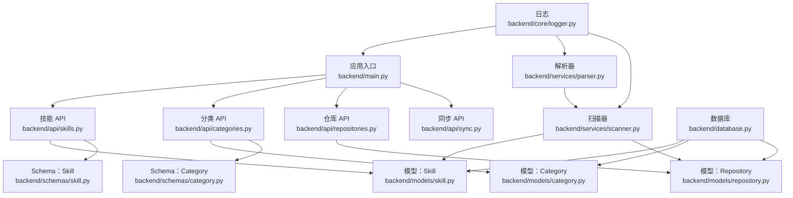
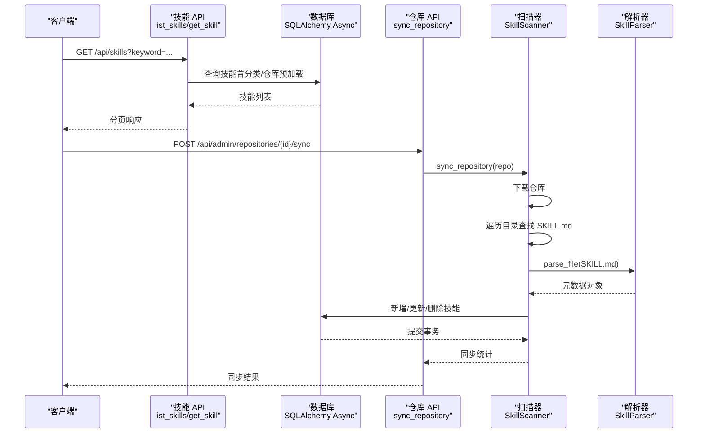
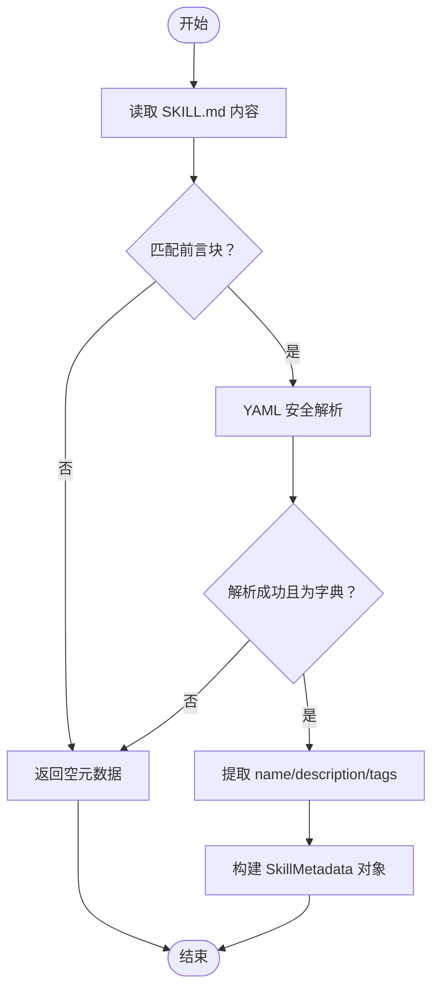
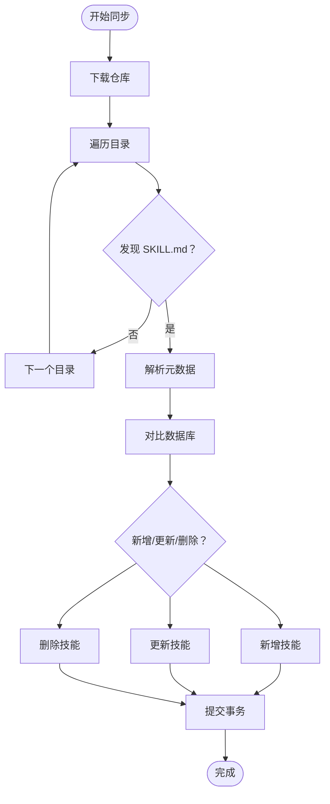
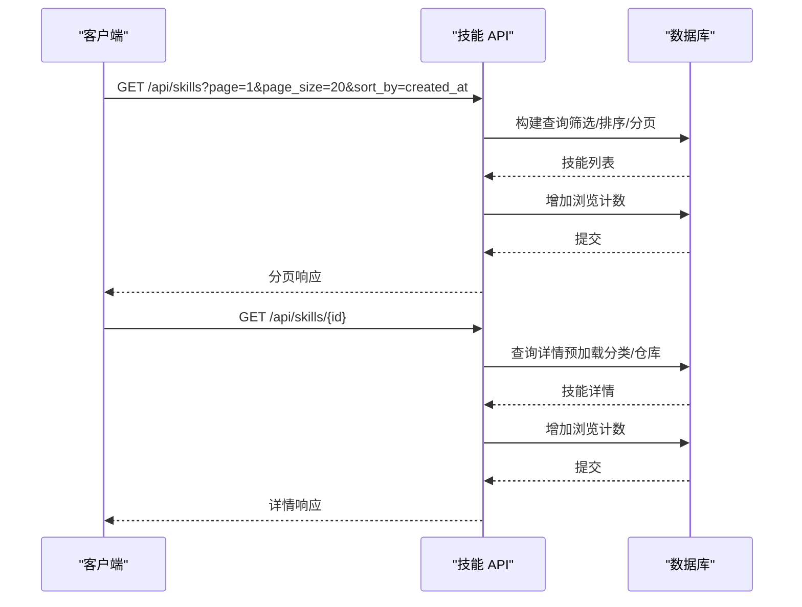
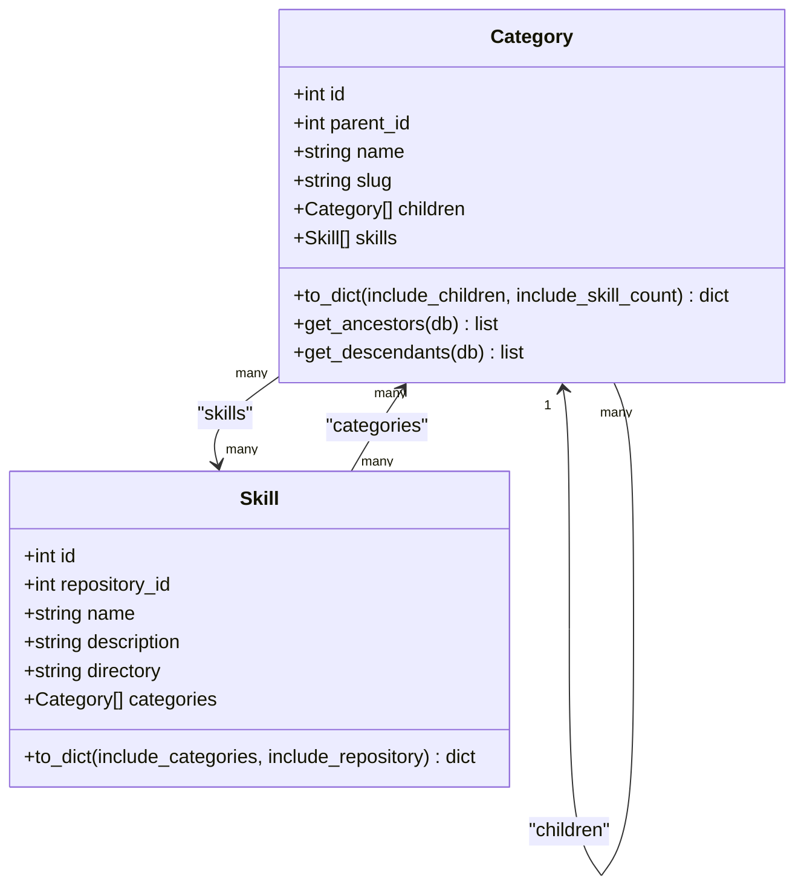
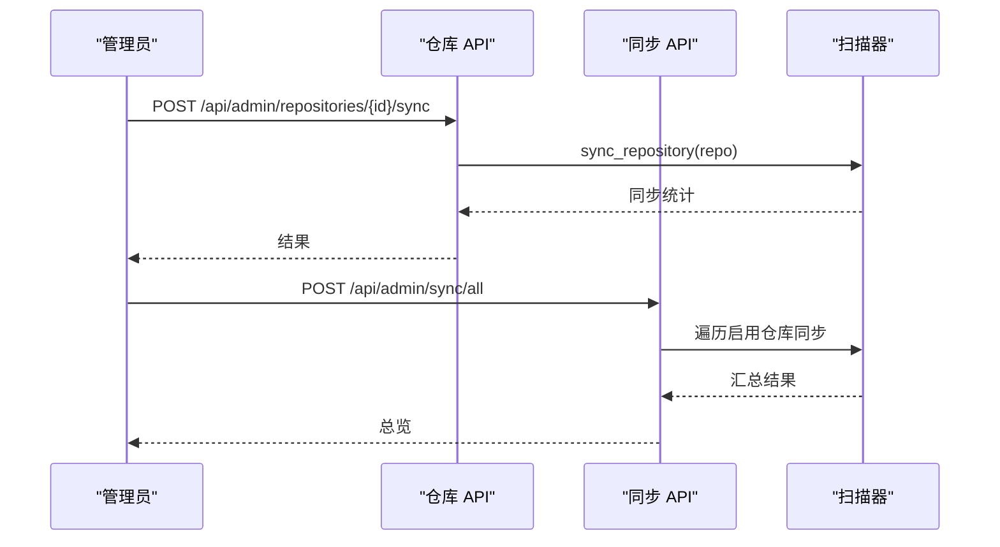
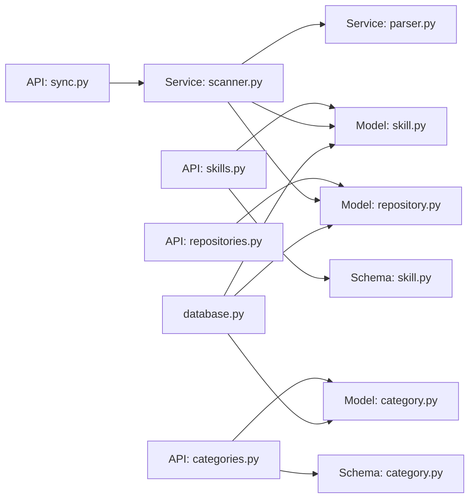

# 技能管理 API

<cite>
**本文引用的文件**
- [backend/main.py](file://backend/main.py)
- [backend/api/skills.py](file://backend/api/skills.py)
- [backend/models/skill.py](file://backend/models/skill.py)
- [backend/services/parser.py](file://backend/services/parser.py)
- [backend/services/scanner.py](file://backend/services/scanner.py)
- [backend/schemas/skill.py](file://backend/schemas/skill.py)
- [backend/models/category.py](file://backend/models/category.py)
- [backend/api/categories.py](file://backend/api/categories.py)
- [backend/api/repositories.py](file://backend/api/repositories.py)
- [backend/api/sync.py](file://backend/api/sync.py)
- [backend/database.py](file://backend/database.py)
- [backend/models/repository.py](file://backend/models/repository.py)
- [backend/schemas/category.py](file://backend/schemas/category.py)
- [backend/core/logger.py](file://backend/core/logger.py)
- [README.md](file://README.md)
</cite>

## 目录
1. [简介](#简介)
2. [项目结构](#项目结构)
3. [核心组件](#核心组件)
4. [架构总览](#架构总览)
5. [详细组件分析](#详细组件分析)
6. [依赖关系分析](#依赖关系分析)
7. [性能考虑](#性能考虑)
8. [故障排查指南](#故障排查指南)
9. [结论](#结论)
10. [附录](#附录)

## 简介
本文件面向技能管理 API 的使用者与维护者，系统性梳理技能资源的发现、解析与管理能力，重点覆盖以下方面：
- SKILL.md 文件解析流程：YAML 前言块解析、元数据提取与内容标准化
- 技能分类关联、标签管理与搜索过滤
- 技能 API 接口：查询、详情、搜索与分页排序
- 缓存策略、更新机制与版本管理
- 全文搜索、排序选项与分页查询
- 技能数据的验证规则、格式要求与质量控制

## 项目结构
后端采用 FastAPI + SQLAlchemy Async 架构，按职责划分为 API 路由层、模型层、Schema 层、服务层与核心模块。主要模块如下：
- 应用入口与路由注册：backend/main.py
- 技能 API：backend/api/skills.py
- 分类 API：backend/api/categories.py
- 仓库与同步 API：backend/api/repositories.py、backend/api/sync.py
- 模型定义：backend/models/skill.py、backend/models/category.py、backend/models/repository.py
- 数据验证与响应模型：backend/schemas/skill.py、backend/schemas/category.py
- 解析与扫描服务：backend/services/parser.py、backend/services/scanner.py
- 数据库与日志：backend/database.py、backend/core/logger.py
- 项目说明：README.md

图表来源
- [backend/main.py](file://backend/main.py#L46-L85)
- [backend/api/skills.py](file://backend/api/skills.py#L15-L160)
- [backend/api/categories.py](file://backend/api/categories.py#L21-L294)
- [backend/api/repositories.py](file://backend/api/repositories.py#L23-L205)
- [backend/api/sync.py](file://backend/api/sync.py#L14-L112)
- [backend/models/skill.py](file://backend/models/skill.py#L11-L90)
- [backend/models/category.py](file://backend/models/category.py#L19-L94)
- [backend/models/repository.py](file://backend/models/repository.py#L18-L74)
- [backend/schemas/skill.py](file://backend/schemas/skill.py#L7-L60)
- [backend/schemas/category.py](file://backend/schemas/category.py#L7-L93)
- [backend/services/parser.py](file://backend/services/parser.py#L13-L86)
- [backend/services/scanner.py](file://backend/services/scanner.py#L21-L197)
- [backend/database.py](file://backend/database.py#L58-L75)
- [backend/core/logger.py](file://backend/core/logger.py#L11-L95)

章节来源
- [backend/main.py](file://backend/main.py#L46-L85)
- [README.md](file://README.md#L20-L47)

## 核心组件
- 技能模型与响应：Skill 模型定义了技能的核心字段与多对多分类关联；Skill 响应模型提供对外 API 字段与序列化。
- 分类模型与树形结构：Category 支持父子关系与多对多技能关联，提供树形结构与后代/祖先查询。
- 仓库模型与同步：Repository 描述仓库类型、分支、凭证与 Webhook 配置；同步 API 提供手动与批量同步。
- 解析与扫描：SkillParser 负责 SKILL.md 的 YAML 前言块解析；SkillScanner 负责仓库扫描、差异同步与 URL 构建。
- 数据验证：Pydantic Schema 控制输入参数范围、排序字段与长度约束。

章节来源
- [backend/models/skill.py](file://backend/models/skill.py#L11-L90)
- [backend/schemas/skill.py](file://backend/schemas/skill.py#L7-L60)
- [backend/models/category.py](file://backend/models/category.py#L19-L94)
- [backend/schemas/category.py](file://backend/schemas/category.py#L7-L93)
- [backend/models/repository.py](file://backend/models/repository.py#L18-L74)
- [backend/services/parser.py](file://backend/services/parser.py#L13-L86)
- [backend/services/scanner.py](file://backend/services/scanner.py#L21-L197)

## 架构总览
技能管理 API 的整体流程：
- 外部仓库通过 Webhook 或手动触发同步
- 扫描器下载仓库、遍历目录，定位包含 SKILL.md 的目录
- 解析器提取 YAML 前言块元数据，生成技能元数据
- 扫描器对比数据库现有技能，执行新增、更新或删除
- 前台 API 提供技能查询、详情、搜索与分页排序

图表来源
- [backend/api/skills.py](file://backend/api/skills.py#L18-L95)
- [backend/api/repositories.py](file://backend/api/repositories.py#L161-L177)
- [backend/services/scanner.py](file://backend/services/scanner.py#L70-L157)
- [backend/services/parser.py](file://backend/services/parser.py#L18-L70)
- [backend/database.py](file://backend/database.py#L42-L56)

## 详细组件分析

### SKILL.md 解析流程
- 前言块匹配：使用正则匹配三短横线包裹的 YAML 区域
- YAML 解析：使用安全解析方法，容错处理异常与空内容
- 元数据提取：提取 name、description、tags，未找到时返回空对象
- 标准化：当 name 缺失时，回退为目录名；目录相对路径作为 directory 字段

图表来源
- [backend/services/parser.py](file://backend/services/parser.py#L18-L70)

章节来源
- [backend/services/parser.py](file://backend/services/parser.py#L13-L86)

### 技能扫描与同步
- 仓库下载：根据仓库类型调用对应服务下载到临时目录
- 目录扫描：遍历文件系统，跳过隐藏目录，定位 SKILL.md
- 差异同步：对比数据库中现有技能，计算新增、更新、不变与删除
- URL 构建：为 README 与原始内容生成可访问链接
- 事务提交：统一提交以保证一致性

图表来源
- [backend/services/scanner.py](file://backend/services/scanner.py#L27-L157)

章节来源
- [backend/services/scanner.py](file://backend/services/scanner.py#L21-L197)

### 技能 API：查询、详情与搜索
- 列表查询：支持关键词（LIKE 模糊匹配）、分类筛选、仓库筛选、分页与排序
- 详情查询：按 ID 获取技能详情，预加载分类与仓库
- 浏览计数：每次查询详情或列表时增加 views
- 待分配分类：列出未分配分类的技能

图表来源
- [backend/api/skills.py](file://backend/api/skills.py#L18-L160)
- [backend/models/skill.py](file://backend/models/skill.py#L86-L90)

章节来源
- [backend/api/skills.py](file://backend/api/skills.py#L18-L160)
- [backend/models/skill.py](file://backend/models/skill.py#L44-L90)

### 分类管理与技能关联
- 分类树：获取顶级分类，递归加载子分类与技能数量
- 分类 CRUD：创建、更新、删除分类，校验父分类合法性
- 技能分类分配：支持单个/批量分配技能到分类，清空后重新绑定

图表来源
- [backend/models/category.py](file://backend/models/category.py#L19-L94)
- [backend/models/skill.py](file://backend/models/skill.py#L11-L40)

章节来源
- [backend/api/categories.py](file://backend/api/categories.py#L24-L294)
- [backend/models/category.py](file://backend/models/category.py#L19-L94)

### 仓库与同步 API
- 仓库管理：CRUD 操作，支持启用/禁用、分支切换与凭证加密
- 手动同步：针对单个仓库执行扫描与差异同步
- 批量同步：遍历启用仓库逐一同步，汇总结果
- 同步状态：统计仓库总数、已同步数量与最近同步列表

图表来源
- [backend/api/repositories.py](file://backend/api/repositories.py#L161-L177)
- [backend/api/sync.py](file://backend/api/sync.py#L35-L71)
- [backend/services/scanner.py](file://backend/services/scanner.py#L70-L157)

章节来源
- [backend/api/repositories.py](file://backend/api/repositories.py#L26-L205)
- [backend/api/sync.py](file://backend/api/sync.py#L17-L112)

### 数据验证与格式要求
- 技能响应字段：包含基础信息、仓库与分类信息、时间戳等
- 搜索参数：keyword、category_id、repository_id、page/page_size、sort_by/sort_order
- 分类字段：name、slug（小写字母/数字/连字符）、icon、sort_order 等
- 长度与范围：字段最小/最大长度与数值范围约束

章节来源
- [backend/schemas/skill.py](file://backend/schemas/skill.py#L7-L60)
- [backend/schemas/category.py](file://backend/schemas/category.py#L7-L93)

## 依赖关系分析
- 组件耦合：API 层依赖模型与 Schema；服务层依赖模型与外部服务；数据库层提供会话与连接
- 外部依赖：GitHub/GitLab 下载服务、YAML 解析、数据库驱动
- 循环依赖：未见循环导入；多对多关系通过中间表定义

图表来源
- [backend/api/skills.py](file://backend/api/skills.py#L10-L13)
- [backend/api/categories.py](file://backend/api/categories.py#L10-L18)
- [backend/api/repositories.py](file://backend/api/repositories.py#L9-L21)
- [backend/api/sync.py](file://backend/api/sync.py#L7-L12)
- [backend/services/scanner.py](file://backend/services/scanner.py#L13-L18)
- [backend/services/parser.py](file://backend/services/parser.py#L9)
- [backend/database.py](file://backend/database.py#L58-L75)

章节来源
- [backend/api/skills.py](file://backend/api/skills.py#L10-L13)
- [backend/api/categories.py](file://backend/api/categories.py#L10-L18)
- [backend/api/repositories.py](file://backend/api/repositories.py#L9-L21)
- [backend/api/sync.py](file://backend/api/sync.py#L7-L12)
- [backend/services/scanner.py](file://backend/services/scanner.py#L13-L18)
- [backend/services/parser.py](file://backend/services/parser.py#L9)
- [backend/database.py](file://backend/database.py#L58-L75)

## 性能考虑
- 查询优化：列表查询使用 selectinload 预加载分类与仓库，减少 N+1 查询
- 分页与排序：固定 page_size 上限，避免超大分页请求
- 数据库连接：异步引擎与连接池配置，开启 pre_ping 保持连接健康
- 日志轮转：INFO 与 ERROR 分离轮转，避免日志过大影响性能

章节来源
- [backend/api/skills.py](file://backend/api/skills.py#L32-L35)
- [backend/schemas/skill.py](file://backend/schemas/skill.py#L48-L51)
- [backend/database.py](file://backend/database.py#L21-L36)
- [backend/core/logger.py](file://backend/core/logger.py#L44-L64)

## 故障排查指南
- 数据库连接失败：检查 DATABASE_URL 环境变量与网络连通性
- YAML 解析异常：确认 SKILL.md 前言块格式正确，避免非法 YAML
- 外部服务错误：检查 GitHub/GitLab 凭证与网络访问权限
- 同步失败：查看同步日志，确认仓库是否存在、分支是否正确
- 权限问题：确保管理员用户具备相应权限进行分类与仓库操作

章节来源
- [backend/database.py](file://backend/database.py#L58-L75)
- [backend/services/parser.py](file://backend/services/parser.py#L31-L33)
- [backend/services/scanner.py](file://backend/services/scanner.py#L178-L180)
- [backend/api/sync.py](file://backend/api/sync.py#L60-L66)

## 结论
本系统通过 SKILL.md 前言块标准化与扫描同步机制，实现了对技能资源的自动化发现与管理；结合分类树与多对多关联，提供了灵活的组织方式；API 层提供完善的查询、搜索与分页排序能力，并通过 Schema 与中间件保障数据质量与安全性。建议在生产环境中强化缓存策略、监控同步状态与日志审计，持续提升稳定性与可观测性。

## 附录

### API 接口清单（技能相关）
- 技能列表与搜索
  - 方法与路径：GET /api/skills
  - 查询参数：keyword、category_id、repository_id、page、page_size、sort_by、sort_order
  - 返回：分页响应（items、total、page、page_size、total_pages）
- 技能详情
  - 方法与路径：GET /api/skills/{skill_id}
  - 返回：技能详情（包含分类与仓库信息）
- 增加浏览计数
  - 方法与路径：POST /api/skills/{skill_id}/view
  - 返回：当前 views 数
- 待分配分类的技能
  - 方法与路径：GET /api/skills/sync/pending
  - 返回：技能简要列表（id、name、description、directory、repository）

章节来源
- [backend/api/skills.py](file://backend/api/skills.py#L18-L160)

### 技能识别规则与示例
- 在仓库任意目录下创建 SKILL.md 文件，使用 YAML 前言块声明元数据
- 示例格式：name、description、tags 三要素，其余内容为技能正文

章节来源
- [README.md](file://README.md#L156-L168)