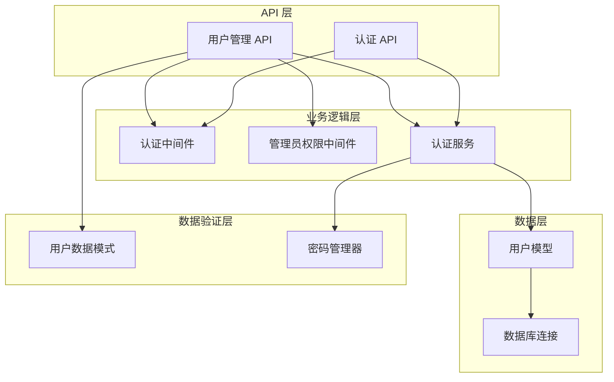
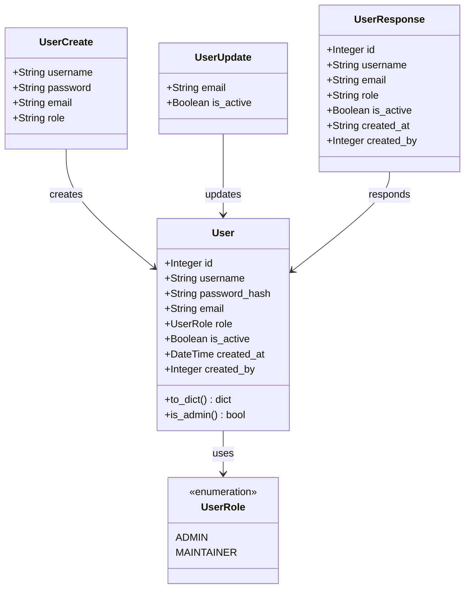
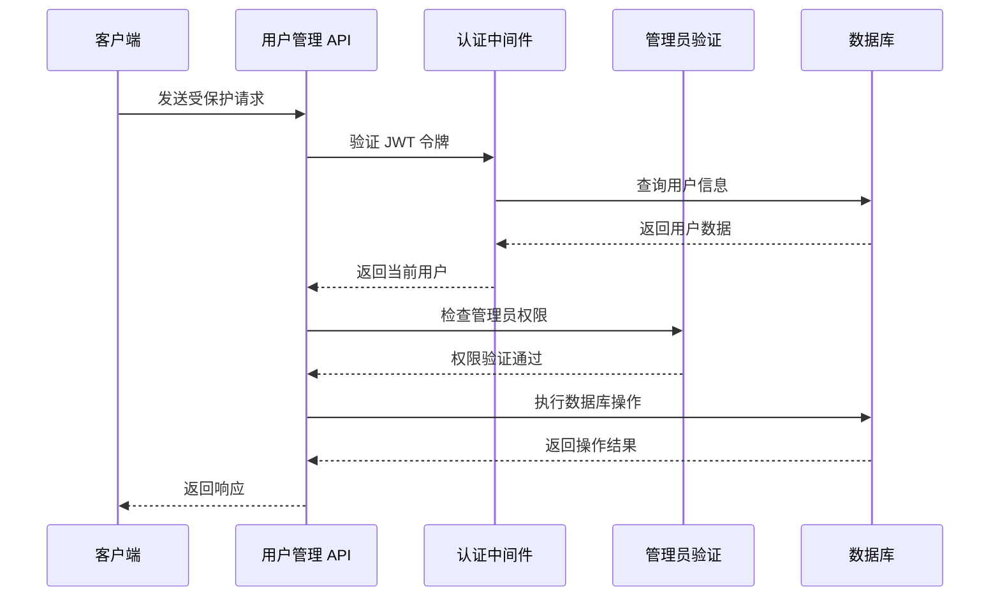
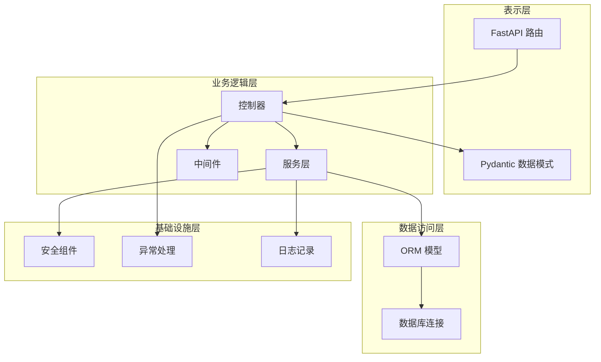
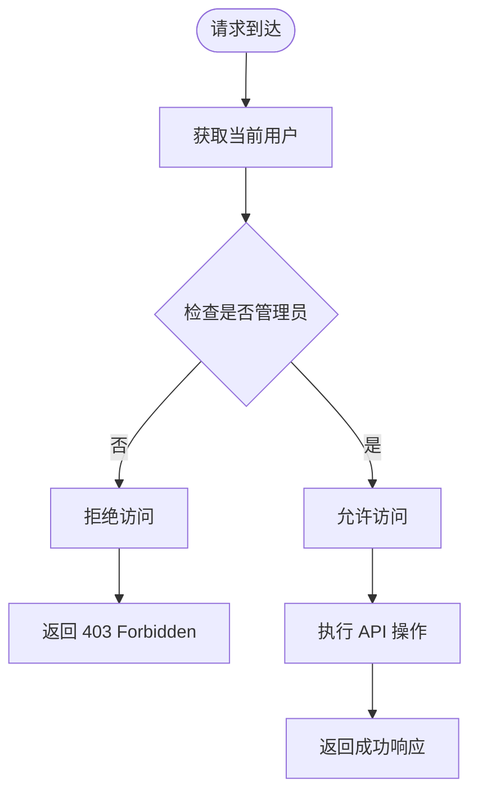
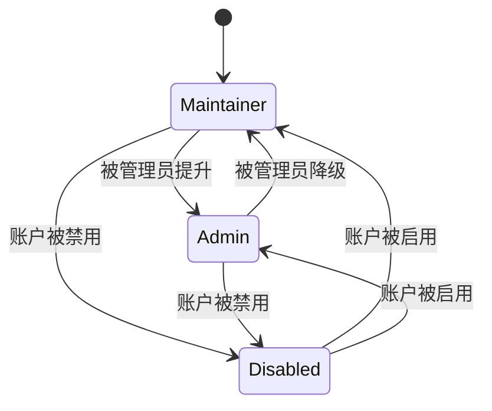
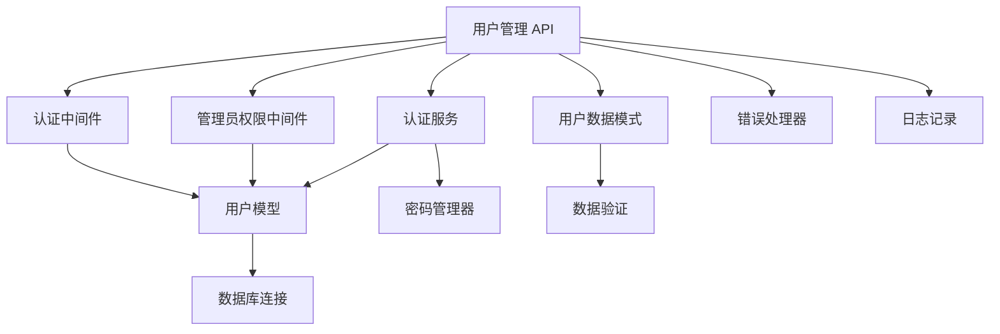

# 用户管理 API

<cite>
**本文档引用的文件**
- [backend/api/users.py](file://backend/api/users.py)
- [backend/models/user.py](file://backend/models/user.py)
- [backend/schemas/user.py](file://backend/schemas/user.py)
- [backend/middleware/auth.py](file://backend/middleware/auth.py)
- [backend/services/auth.py](file://backend/services/auth.py)
- [backend/main.py](file://backend/main.py)
- [backend/database.py](file://backend/database.py)
- [backend/core/error_handler.py](file://backend/core/error_handler.py)
- [backend/core/exceptions.py](file://backend/core/exceptions.py)
- [backend/api/auth.py](file://backend/api/auth.py)
- [backend/.env.example](file://backend/.env.example)
</cite>

## 目录
1. [简介](#简介)
2. [项目结构](#项目结构)
3. [核心组件](#核心组件)
4. [架构概览](#架构概览)
5. [详细组件分析](#详细组件分析)
6. [依赖关系分析](#依赖关系分析)
7. [性能考虑](#性能考虑)
8. [故障排除指南](#故障排除指南)
9. [结论](#结论)

## 简介

用户管理 API 是 Skills Hub 平台的核心功能模块，提供完整的用户 CRUD 操作和管理员权限控制。该系统基于 FastAPI 构建，采用异步数据库连接和 JWT 认证机制，支持用户角色管理和权限控制。

本系统实现了以下主要功能：
- 用户创建、更新、删除和列表查询
- 管理员权限控制和中间件验证
- 用户数据模型设计和验证规则
- 完整的 API 接口文档和错误处理
- 密码管理和安全加密机制

## 项目结构

用户管理 API 位于后端项目的 `backend/api/users.py` 文件中，采用模块化设计，与认证、模型、服务层紧密集成。

**图表来源**
- [backend/api/users.py](file://backend/api/users.py#L1-L111)
- [backend/middleware/auth.py](file://backend/middleware/auth.py#L1-L134)
- [backend/services/auth.py](file://backend/services/auth.py#L1-L130)

**章节来源**
- [backend/api/users.py](file://backend/api/users.py#L1-L111)
- [backend/main.py](file://backend/main.py#L24-L84)

## 核心组件

### 用户数据模型

用户模型采用 SQLAlchemy ORM 设计，支持完整的用户信息存储和管理。

**图表来源**
- [backend/models/user.py](file://backend/models/user.py#L18-L52)
- [backend/schemas/user.py](file://backend/schemas/user.py#L8-L96)

### 权限控制系统

系统采用多层权限控制机制，确保只有管理员可以执行敏感操作。

**图表来源**
- [backend/middleware/auth.py](file://backend/middleware/auth.py#L98-L108)
- [backend/api/users.py](file://backend/api/users.py#L17-L91)

**章节来源**
- [backend/models/user.py](file://backend/models/user.py#L12-L52)
- [backend/schemas/user.py](file://backend/schemas/user.py#L8-L96)
- [backend/middleware/auth.py](file://backend/middleware/auth.py#L98-L108)

## 架构概览

用户管理 API 采用分层架构设计，各层职责明确，便于维护和扩展。

**图表来源**
- [backend/main.py](file://backend/main.py#L47-L84)
- [backend/api/users.py](file://backend/api/users.py#L1-L111)

## 详细组件分析

### 用户管理 API 路由

用户管理 API 提供完整的 CRUD 操作，所有端点都要求管理员权限。

#### GET /api/admin/users
**功能**: 获取用户列表
**权限**: 管理员
**响应**: 用户数组

#### POST /api/admin/users
**功能**: 创建新用户
**权限**: 管理员
**请求体**: 用户创建数据
**响应**: 新创建的用户信息

#### GET /api/admin/users/{user_id}
**功能**: 获取用户详情
**权限**: 管理员
**路径参数**: 用户 ID
**响应**: 用户详细信息

#### PUT /api/admin/users/{user_id}
**功能**: 更新用户信息
**权限**: 管理员
**路径参数**: 用户 ID
**请求体**: 用户更新数据
**响应**: 更新后的用户信息

#### DELETE /api/admin/users/{user_id}
**功能**: 删除用户
**权限**: 管理员
**路径参数**: 用户 ID
**响应**: 无内容

#### POST /api/admin/users/{user_id}/reset-password
**功能**: 管理员重置用户密码
**权限**: 管理员
**路径参数**: 用户 ID
**请求体**: 新密码
**响应**: 操作成功消息

**章节来源**
- [backend/api/users.py](file://backend/api/users.py#L17-L106)

### 管理员权限控制机制

管理员权限控制通过 `require_admin` 中间件实现，确保只有具有管理员角色的用户才能访问受保护的 API 端点。

**图表来源**
- [backend/middleware/auth.py](file://backend/middleware/auth.py#L98-L108)

**章节来源**
- [backend/middleware/auth.py](file://backend/middleware/auth.py#L98-L108)

### 用户数据模型设计

用户模型采用枚举类型管理角色，支持级联关系和外键约束。

#### 字段定义

| 字段名 | 类型 | 约束 | 描述 |
|--------|------|------|------|
| id | Integer | 主键 | 用户唯一标识符 |
| username | String(50) | 唯一、非空 | 用户名，支持字母数字、下划线、连字符 |
| password_hash | String(255) | 非空 | 密码哈希值 |
| email | String(100) | 可空 | 用户邮箱地址 |
| role | Enum | 非空，默认 maintainer | 用户角色（admin、maintainer） |
| is_active | Boolean | 非空，默认 true | 用户账户状态 |
| created_at | DateTime | 非空，默认当前时间 | 创建时间 |
| created_by | Integer | 外键 users.id | 创建者用户ID |

#### 验证规则

用户数据验证通过 Pydantic 模式实现，确保数据完整性和安全性。

**章节来源**
- [backend/models/user.py](file://backend/models/user.py#L18-L52)
- [backend/schemas/user.py](file://backend/schemas/user.py#L8-L96)

### API 接口文档

#### 用户列表查询
- **方法**: GET
- **路径**: `/api/admin/users`
- **认证**: 需要管理员权限
- **响应**: 用户对象数组
- **状态码**: 200 OK

#### 创建用户
- **方法**: POST  
- **路径**: `/api/admin/users`
- **认证**: 需要管理员权限
- **请求体**: UserCreate 模式
- **响应**: UserResponse 对象
- **状态码**: 201 Created

#### 获取用户详情
- **方法**: GET
- **路径**: `/api/admin/users/{user_id}`
- **认证**: 需要管理员权限
- **路径参数**: user_id (Integer)
- **响应**: UserResponse 对象
- **状态码**: 200 OK

#### 更新用户
- **方法**: PUT
- **路径**: `/api/admin/users/{user_id}`
- **认证**: 需要管理员权限
- **路径参数**: user_id (Integer)
- **请求体**: UserUpdate 模式
- **响应**: UserResponse 对象
- **状态码**: 200 OK

#### 删除用户
- **方法**: DELETE
- **路径**: `/api/admin/users/{user_id}`
- **认证**: 需要管理员权限
- **路径参数**: user_id (Integer)
- **响应**: 204 No Content
- **状态码**: 204 No Content

#### 重置用户密码
- **方法**: POST
- **路径**: `/api/admin/users/{user_id}/reset-password`
- **认证**: 需要管理员权限
- **路径参数**: user_id (Integer)
- **请求体**: PasswordReset 模式
- **响应**: 成功消息
- **状态码**: 200 OK

**章节来源**
- [backend/api/users.py](file://backend/api/users.py#L17-L106)

### 错误码说明

系统使用统一的错误处理机制，提供详细的错误信息和状态码。

| 错误码 | 状态码 | 描述 | 详细信息 |
|--------|--------|------|----------|
| NOT_FOUND | 404 | 资源未找到 | 包含资源类型和ID |
| VALIDATION_ERROR | 422 | 数据验证失败 | 包含验证错误详情 |
| AUTHENTICATION_ERROR | 401 | 认证失败 | 凭据无效或过期 |
| AUTHORIZATION_ERROR | 403 | 权限不足 | 需要管理员权限 |
| CONFLICT | 409 | 资源冲突 | 如用户名已存在 |
| INTERNAL_ERROR | 500 | 内部服务器错误 | 未预期的系统错误 |

**章节来源**
- [backend/core/exceptions.py](file://backend/core/exceptions.py#L24-L101)
- [backend/core/error_handler.py](file://backend/core/error_handler.py#L14-L102)

### 用户角色管理

系统支持两种用户角色，通过枚举类型管理：

**图表来源**
- [backend/models/user.py](file://backend/models/user.py#L12-L16)

**章节来源**
- [backend/models/user.py](file://backend/models/user.py#L12-L16)

## 依赖关系分析

用户管理 API 的依赖关系清晰，遵循依赖倒置原则。

**图表来源**
- [backend/api/users.py](file://backend/api/users.py#L1-L111)
- [backend/middleware/auth.py](file://backend/middleware/auth.py#L1-L134)
- [backend/services/auth.py](file://backend/services/auth.py#L1-L130)

**章节来源**
- [backend/api/users.py](file://backend/api/users.py#L1-L111)
- [backend/middleware/auth.py](file://backend/middleware/auth.py#L1-L134)
- [backend/services/auth.py](file://backend/services/auth.py#L1-L130)

## 性能考虑

系统采用多种性能优化策略：

1. **异步数据库连接**: 使用 SQLAlchemy AsyncEngine 和 AsyncSession
2. **连接池管理**: 配置连接池大小和预连接检查
3. **JWT 缓存**: 避免重复解码相同的令牌
4. **批量操作**: 支持批量用户操作的潜在扩展
5. **索引优化**: 用户名字段建立唯一索引

## 故障排除指南

### 常见问题及解决方案

#### 认证失败
**症状**: 401 未认证错误
**原因**: 令牌无效、过期或用户不存在
**解决**: 重新登录获取新令牌

#### 权限不足
**症状**: 403 禁止访问错误  
**原因**: 当前用户不是管理员
**解决**: 使用管理员账户登录

#### 用户名冲突
**症状**: 409 冲突错误
**原因**: 用户名已被使用
**解决**: 更换唯一的用户名

#### 资源未找到
**症状**: 404 未找到错误
**原因**: 用户ID不存在
**解决**: 检查用户ID的有效性

**章节来源**
- [backend/core/error_handler.py](file://backend/core/error_handler.py#L14-L102)
- [backend/core/exceptions.py](file://backend/core/exceptions.py#L24-L101)

## 结论

用户管理 API 提供了完整的用户生命周期管理功能，具备以下特点：

1. **安全性**: 采用 JWT 认证和管理员权限控制
2. **完整性**: 支持完整的 CRUD 操作和数据验证
3. **可扩展性**: 模块化设计便于功能扩展
4. **可靠性**: 统一的错误处理和日志记录
5. **易用性**: 清晰的 API 设计和文档

该系统为 Skills Hub 平台提供了坚实的基础，支持未来的功能扩展和维护需求。