# 认证 API

<cite>
**本文档引用的文件**
- [backend/api/auth.py](file://backend/api/auth.py)
- [backend/middleware/auth.py](file://backend/middleware/auth.py)
- [backend/core/security.py](file://backend/core/security.py)
- [backend/services/auth.py](file://backend/services/auth.py)
- [backend/models/user.py](file://backend/models/user.py)
- [backend/schemas/user.py](file://backend/schemas/user.py)
- [backend/main.py](file://backend/main.py)
- [backend/.env.example](file://backend/.env.example)
- [backend/core/error_handler.py](file://backend/core/error_handler.py)
- [backend/core/exceptions.py](file://backend/core/exceptions.py)
- [backend/middleware/security.py](file://backend/middleware/security.py)
</cite>

## 目录
1. [简介](#简介)
2. [项目结构](#项目结构)
3. [核心组件](#核心组件)
4. [架构概览](#架构概览)
5. [详细组件分析](#详细组件分析)
6. [依赖关系分析](#依赖关系分析)
7. [性能考虑](#性能考虑)
8. [故障排除指南](#故障排除指南)
9. [结论](#结论)

## 简介

本文件详细说明了 Skills Hub 平台的认证 API 系统。该系统基于 OAuth2 密码流和 JWT 令牌机制，提供了完整的用户身份验证、授权和密码管理功能。文档涵盖了从用户登录到令牌生成、密码加密、用户信息获取的完整流程，并深入解释了依赖注入模式在认证中的应用。

## 项目结构

认证系统采用分层架构设计，主要包含以下模块：

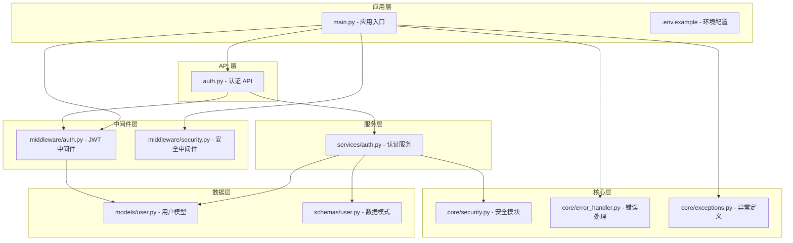

**图表来源**
- [backend/api/auth.py](file://backend/api/auth.py#L1-L65)
- [backend/middleware/auth.py](file://backend/middleware/auth.py#L1-L134)
- [backend/services/auth.py](file://backend/services/auth.py#L1-L130)
- [backend/core/security.py](file://backend/core/security.py#L1-L64)

**章节来源**
- [backend/api/auth.py](file://backend/api/auth.py#L1-L65)
- [backend/middleware/auth.py](file://backend/middleware/auth.py#L1-L134)
- [backend/services/auth.py](file://backend/services/auth.py#L1-L130)
- [backend/core/security.py](file://backend/core/security.py#L1-L64)

## 核心组件

### 认证 API 路由器

认证 API 提供三个核心端点：
- `POST /api/auth/login` - 用户登录
- `GET /api/auth/me` - 获取当前用户信息
- `POST /api/auth/change-password` - 修改密码

### JWT 认证中间件

实现基于 HTTP Bearer 令牌的认证机制，支持：
- 令牌创建和验证
- 用户会话管理
- 角色权限控制
- 可选认证模式

### 认证服务

提供业务逻辑处理：
- 用户注册和认证
- 密码哈希和验证
- 密码修改和重置
- 用户权限管理

**章节来源**
- [backend/api/auth.py](file://backend/api/auth.py#L21-L65)
- [backend/middleware/auth.py](file://backend/middleware/auth.py#L25-L134)
- [backend/services/auth.py](file://backend/services/auth.py#L19-L130)

## 架构概览

认证系统采用依赖注入模式，通过 FastAPI 的依赖系统实现模块间的松耦合：

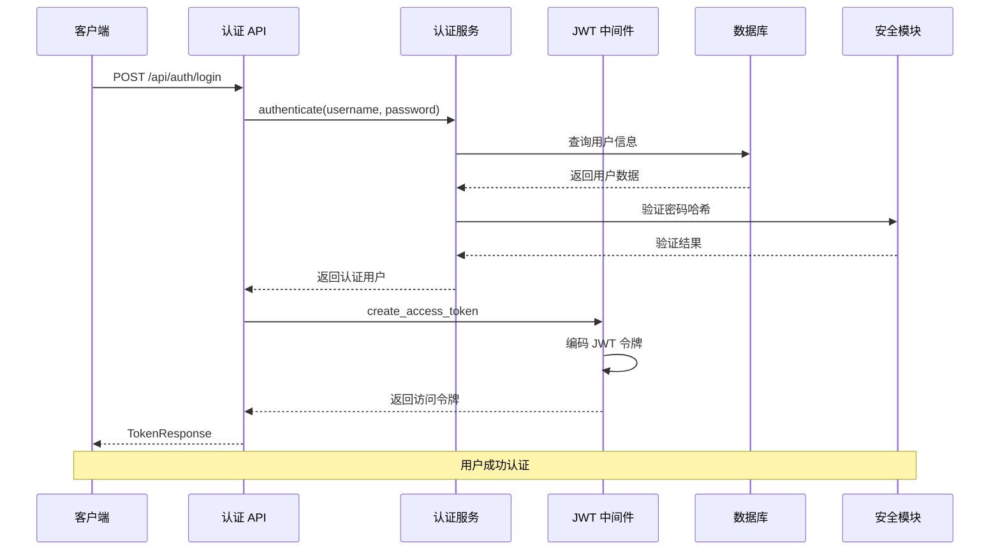

**图表来源**
- [backend/api/auth.py](file://backend/api/auth.py#L24-L40)
- [backend/services/auth.py](file://backend/services/auth.py#L64-L98)
- [backend/middleware/auth.py](file://backend/middleware/auth.py#L25-L33)

## 详细组件分析

### OAuth2 密码流认证机制

系统实现了标准的 OAuth2 密码流认证：

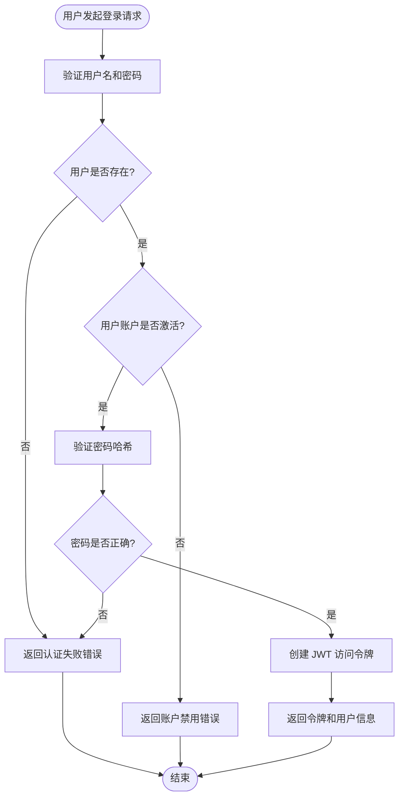

**图表来源**
- [backend/services/auth.py](file://backend/services/auth.py#L64-L98)
- [backend/middleware/auth.py](file://backend/middleware/auth.py#L25-L33)

#### 认证流程详解

1. **请求验证**：接收 `UserLogin` 模式数据
2. **用户查询**：通过用户名查询数据库
3. **状态检查**：验证用户账户激活状态
4. **密码验证**：使用 Argon2 算法验证密码哈希
5. **令牌生成**：创建包含用户 ID 的 JWT 令牌
6. **响应返回**：返回访问令牌和用户信息

**章节来源**
- [backend/api/auth.py](file://backend/api/auth.py#L24-L40)
- [backend/services/auth.py](file://backend/services/auth.py#L64-L98)
- [backend/schemas/user.py](file://backend/schemas/user.py#L32-L36)

### JWT 令牌创建和验证

#### 令牌配置

系统使用 HS256 算法进行 JWT 令牌处理：

| 配置项 | 值 | 描述 |
|--------|-----|------|
| 算法 | HS256 | 对称加密算法 |
| 过期时间 | 24小时 | ACCESS_TOKEN_EXPIRE_MINUTES = 1440 |
| 密钥来源 | 环境变量 | JWT_SECRET_KEY |
| 令牌类型 | bearer | OAuth2 标准 |

#### 令牌结构

JWT 令牌包含以下声明：

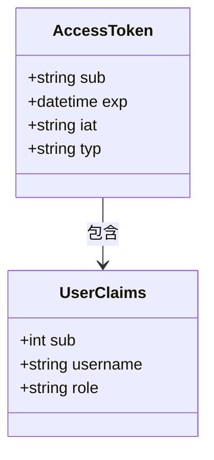

**图表来源**
- [backend/middleware/auth.py](file://backend/middleware/auth.py#L18-L20)
- [backend/middleware/auth.py](file://backend/middleware/auth.py#L25-L33)

**章节来源**
- [backend/middleware/auth.py](file://backend/middleware/auth.py#L17-L33)

### 密码管理策略

#### 密码加密

系统采用 Argon2 算法进行密码哈希：

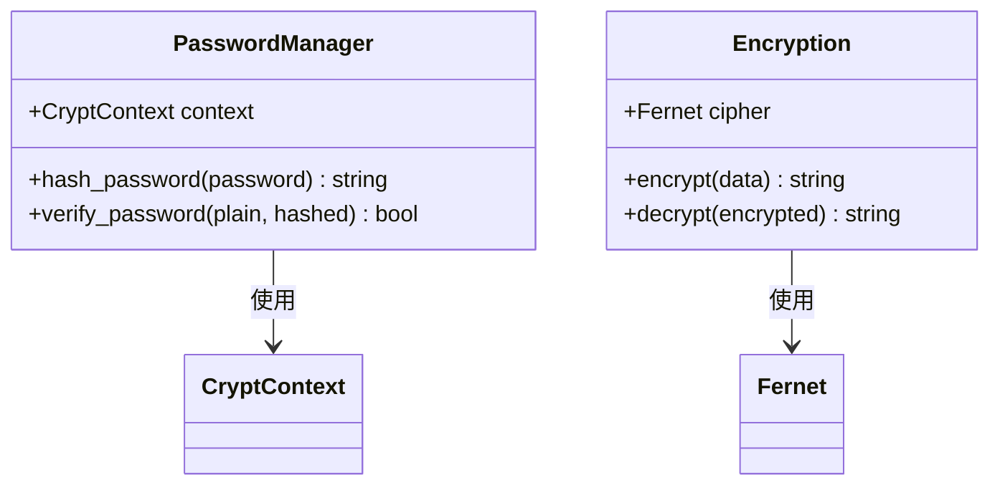

**图表来源**
- [backend/core/security.py](file://backend/core/security.py#L12-L28)
- [backend/core/security.py](file://backend/core/security.py#L31-L53)

#### 密码验证规则

新密码必须满足以下条件：
- 至少8个字符
- 包含大写字母
- 包含小写字母
- 包含数字

**章节来源**
- [backend/core/security.py](file://backend/core/security.py#L12-L28)
- [backend/schemas/user.py](file://backend/schemas/user.py#L19-L29)

### 依赖注入模式应用

#### get_current_user 中间件

实现用户会话管理的核心依赖注入函数：

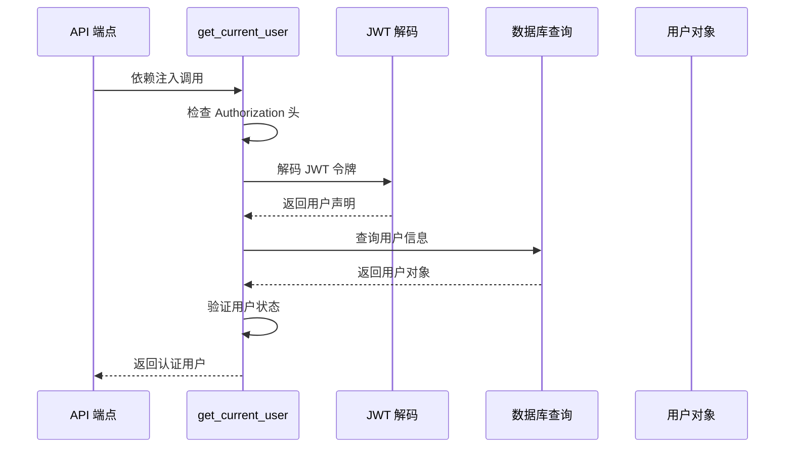

**图表来源**
- [backend/middleware/auth.py](file://backend/middleware/auth.py#L48-L95)

#### require_admin 中间件

实现管理员权限控制：

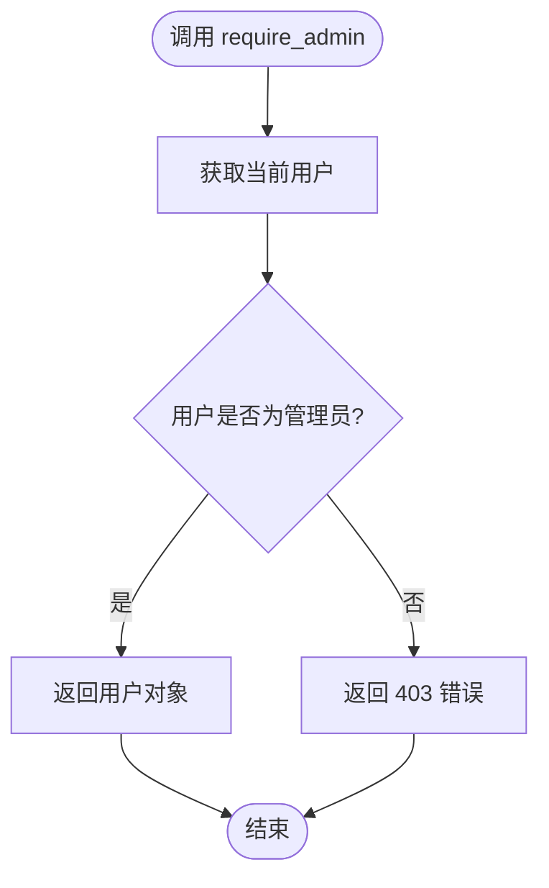

**图表来源**
- [backend/middleware/auth.py](file://backend/middleware/auth.py#L98-L108)

**章节来源**
- [backend/middleware/auth.py](file://backend/middleware/auth.py#L48-L108)

### 用户信息获取

#### get_me 端点

提供当前已认证用户的个人信息：

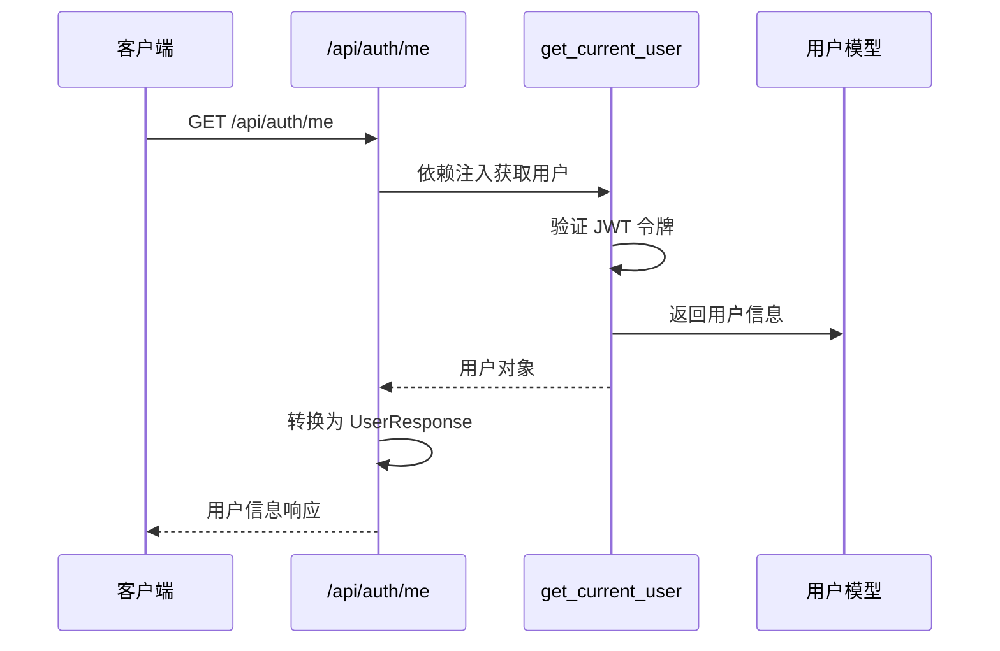

**图表来源**
- [backend/api/auth.py](file://backend/api/auth.py#L43-L48)
- [backend/middleware/auth.py](file://backend/middleware/auth.py#L48-L95)

**章节来源**
- [backend/api/auth.py](file://backend/api/auth.py#L43-L48)
- [backend/models/user.py](file://backend/models/user.py#L35-L46)

### 密码修改功能

#### change_password 流程

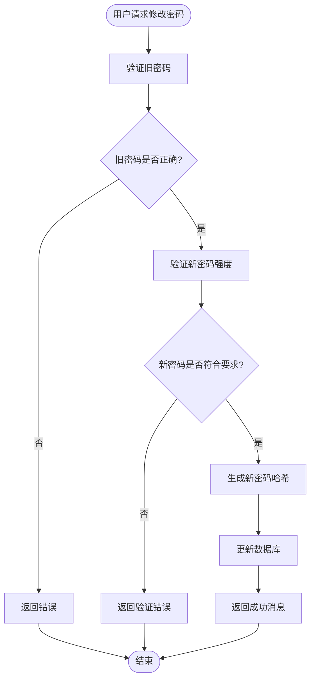

**图表来源**
- [backend/api/auth.py](file://backend/api/auth.py#L51-L64)
- [backend/services/auth.py](file://backend/services/auth.py#L100-L114)

**章节来源**
- [backend/api/auth.py](file://backend/api/auth.py#L51-L64)
- [backend/services/auth.py](file://backend/services/auth.py#L100-L114)

## 依赖关系分析

### 模块依赖图

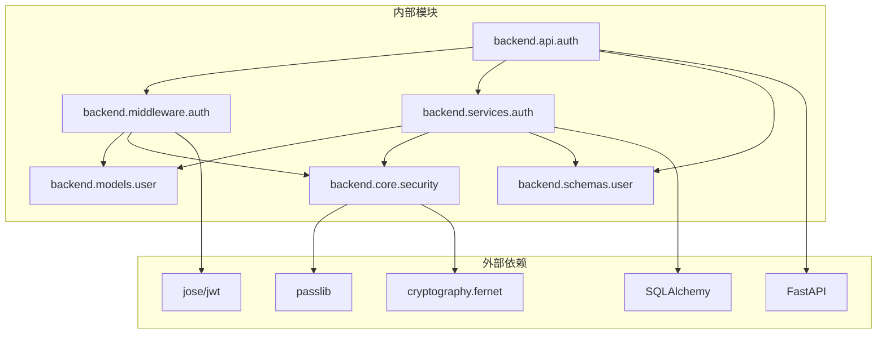

**图表来源**
- [backend/api/auth.py](file://backend/api/auth.py#L4-L19)
- [backend/middleware/auth.py](file://backend/middleware/auth.py#L6-L15)
- [backend/services/auth.py](file://backend/services/auth.py#L4-L16)

### 数据流分析

认证系统的数据流遵循以下模式：

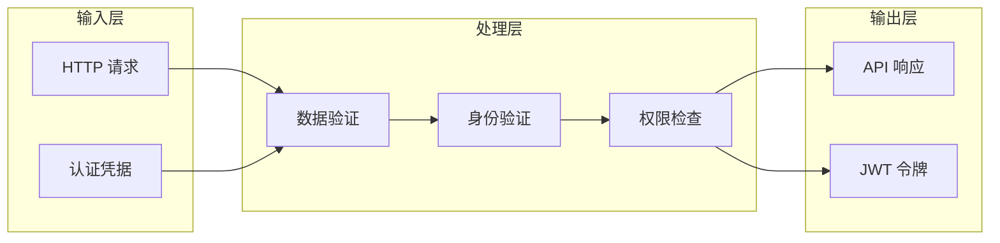

**图表来源**
- [backend/api/auth.py](file://backend/api/auth.py#L24-L64)
- [backend/services/auth.py](file://backend/services/auth.py#L64-L114)

**章节来源**
- [backend/api/auth.py](file://backend/api/auth.py#L1-L65)
- [backend/services/auth.py](file://backend/services/auth.py#L1-L130)

## 性能考虑

### 令牌过期处理

系统实现 24 小时的令牌过期策略，建议在生产环境中：

1. **缩短过期时间**：根据业务需求调整 `ACCESS_TOKEN_EXPIRE_MINUTES`
2. **刷新令牌机制**：实现 refresh token 以支持长期会话
3. **令牌缓存**：使用 Redis 缓存活跃令牌以提高验证性能

### 密码哈希优化

Argon2 算法提供良好的安全性，但可能影响性能：

1. **参数调优**：根据硬件性能调整内存和时间成本
2. **批量处理**：对大量用户密码迁移时使用异步处理
3. **缓存策略**：对频繁访问的用户信息实施适当的缓存

### 数据库查询优化

1. **索引优化**：确保用户名字段有唯一索引
2. **查询优化**：使用异步查询减少阻塞
3. **连接池**：合理配置数据库连接池大小

## 故障排除指南

### 常见认证错误

| 错误代码 | 错误类型 | 可能原因 | 解决方案 |
|----------|----------|----------|----------|
| 401 | 未认证 | 缺少或无效的 Authorization 头 | 检查 Bearer 令牌格式 |
| 401 | 令牌过期 | JWT 令牌超过 24 小时 | 重新登录获取新令牌 |
| 401 | 用户不存在 | 用户名错误或账户被删除 | 验证用户名有效性 |
| 401 | 账户禁用 | 用户被管理员禁用 | 联系系统管理员 |
| 403 | 权限不足 | 非管理员访问管理员端点 | 检查用户角色权限 |
| 422 | 输入验证错误 | 密码格式不符合要求 | 按照密码规则修改 |

### 错误处理机制

系统采用统一的错误处理策略：

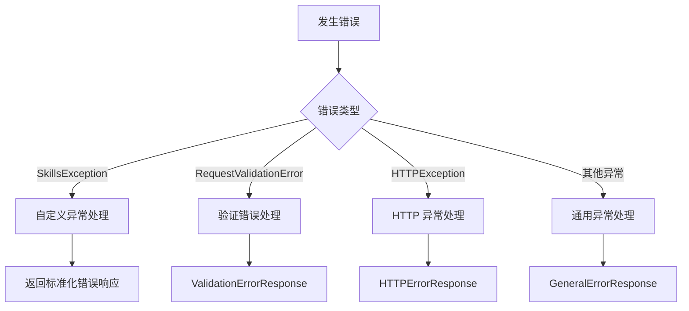

**图表来源**
- [backend/core/error_handler.py](file://backend/core/error_handler.py#L14-L101)
- [backend/core/exceptions.py](file://backend/core/exceptions.py#L7-L101)

**章节来源**
- [backend/core/error_handler.py](file://backend/core/error_handler.py#L14-L101)
- [backend/core/exceptions.py](file://backend/core/exceptions.py#L52-L71)

### 安全中间件配置

系统包含多层安全保护：

1. **安全响应头**：防止常见 Web 攻击
2. **速率限制**：限制登录尝试频率
3. **日志记录**：记录所有认证相关活动
4. **CORS 配置**：控制跨域请求

**章节来源**
- [backend/middleware/security.py](file://backend/middleware/security.py#L11-L142)

## 结论

Skills Hub 平台的认证系统提供了完整的 OAuth2 密码流实现，具有以下特点：

### 安全特性
- 基于 JWT 的无状态认证
- Argon2 密码哈希算法
- 角色基础的权限控制
- 多层安全中间件保护

### 架构优势
- 清晰的分层设计
- 依赖注入模式的应用
- 统一的错误处理机制
- 模块化的组件设计

### 最佳实践建议
1. **生产环境配置**：使用环境变量存储密钥
2. **令牌管理**：实现刷新令牌机制
3. **监控审计**：添加详细的日志记录
4. **性能优化**：根据实际需求调整配置参数

该认证系统为 Skills Hub 平台提供了可靠的身份验证和授权基础设施，支持未来的功能扩展和安全增强。