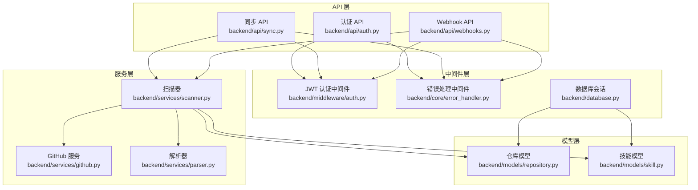
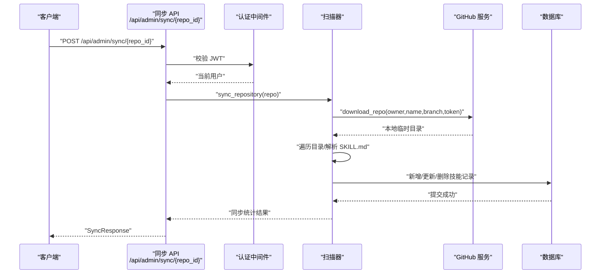
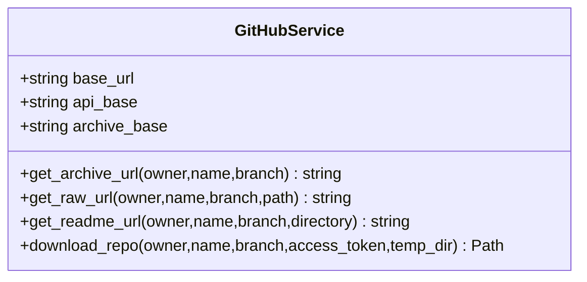
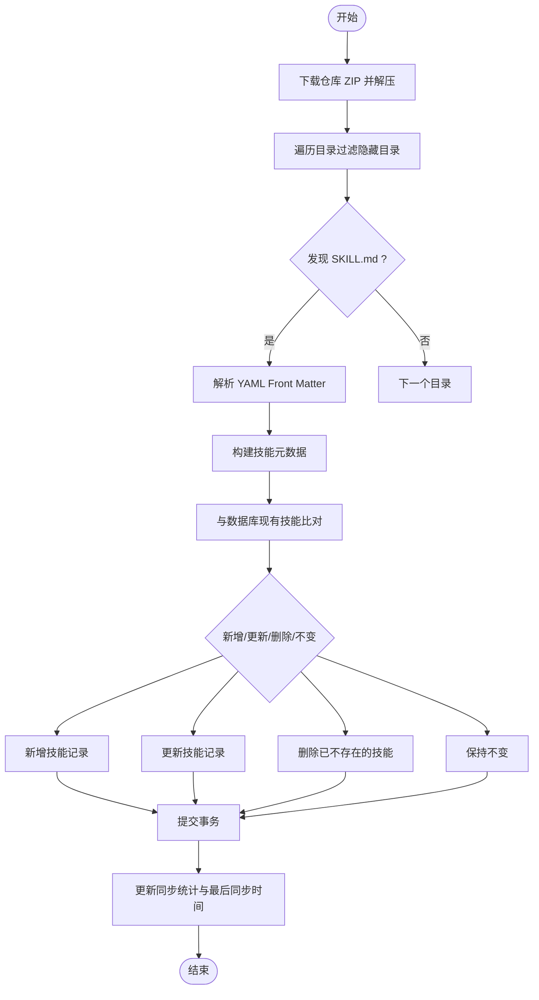
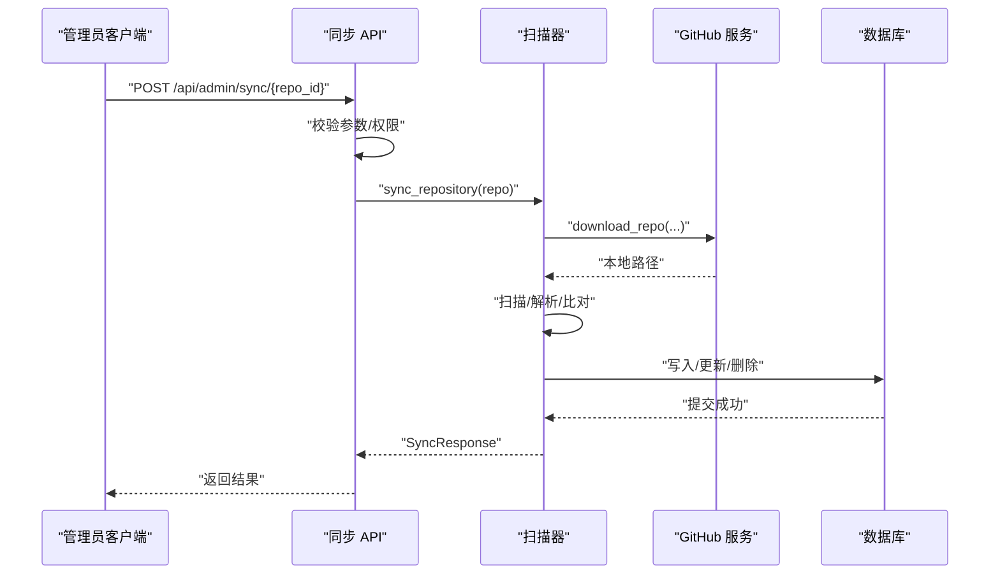
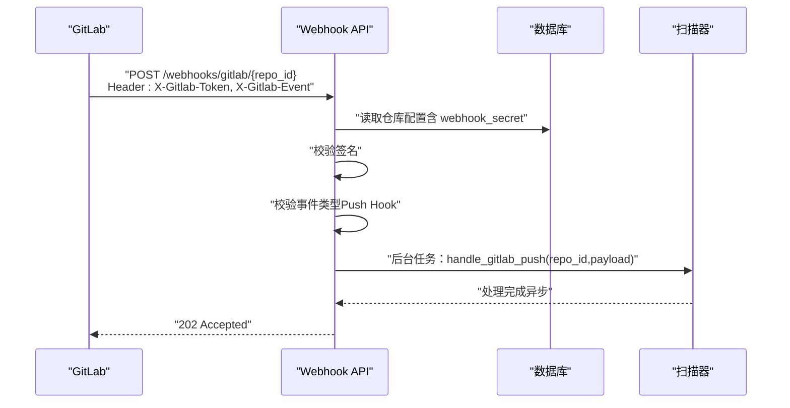
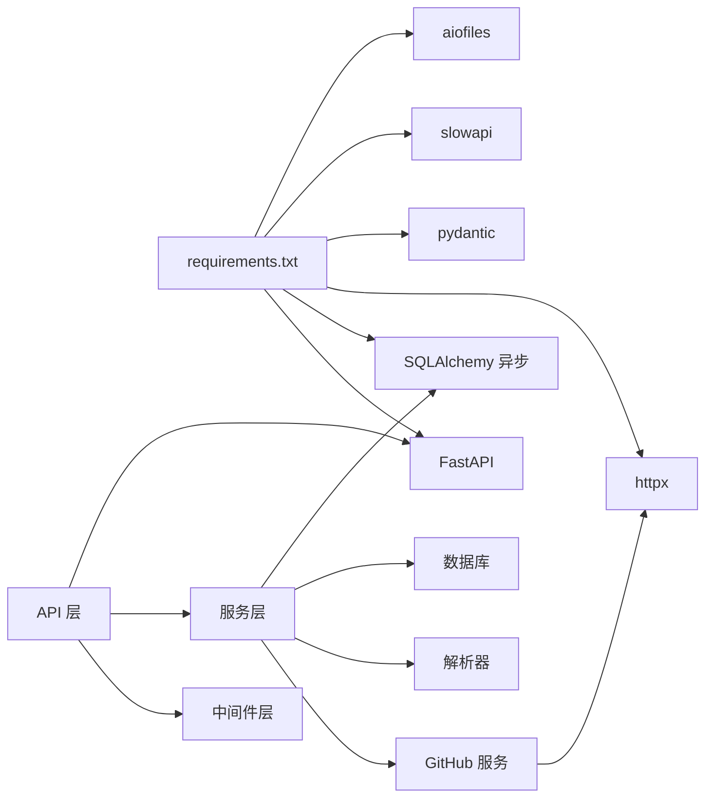

# GitHub 集成服务

<cite>
**本文引用的文件**
- [backend/main.py](file://backend/main.py)
- [backend/services/github.py](file://backend/services/github.py)
- [backend/services/scanner.py](file://backend/services/scanner.py)
- [backend/services/parser.py](file://backend/services/parser.py)
- [backend/api/sync.py](file://backend/api/sync.py)
- [backend/api/webhooks.py](file://backend/api/webhooks.py)
- [backend/middleware/auth.py](file://backend/middleware/auth.py)
- [backend/models/repository.py](file://backend/models/repository.py)
- [backend/models/skill.py](file://backend/models/skill.py)
- [backend/core/error_handler.py](file://backend/core/error_handler.py)
- [backend/database.py](file://backend/database.py)
- [backend/.env.example](file://backend/.env.example)
- [backend/requirements.txt](file://backend/requirements.txt)
- [README.md](file://README.md)
</cite>

## 目录
1. [简介](#简介)
2. [项目结构](#项目结构)
3. [核心组件](#核心组件)
4. [架构总览](#架构总览)
5. [详细组件分析](#详细组件分析)
6. [依赖分析](#依赖分析)
7. [性能考虑](#性能考虑)
8. [故障排查指南](#故障排查指南)
9. [结论](#结论)
10. [附录](#附录)

## 简介
本文件面向 GitHub 集成服务的综合技术文档，围绕以下目标展开：  
- GitHub API 集成与仓库数据获取  
- 技能内容同步（基于 SKILL.md 的解析与入库）  
- GitHub OAuth 认证流程与 GitHub API 速率限制处理  
- 错误重试机制与异常处理  
- 仓库元数据获取、分支处理与文件内容解析  
- 与 GitHub Webhook 的集成方式、事件处理与数据更新策略  
- 具体的 API 调用示例、响应处理与异常处理方案  
- GitHub 服务的配置选项、性能优化与监控方法  

本项目采用 FastAPI + SQLAlchemy 异步 ORM + MySQL，支持 GitHub/GitLab 仓库的技能内容扫描与同步，并通过 Webhook 实现事件驱动的增量更新。

## 项目结构
后端采用分层架构：  
- API 层：路由与控制器，负责请求接入与响应封装  
- 中间件层：认证、安全头、日志、速率限制等横切关注点  
- 服务层：业务逻辑，如 GitHub 仓库下载、扫描器、解析器、Webhook 处理  
- 模型层：数据库实体与关系映射  
- 核心模块：日志、异常、安全工具等

图表来源
- [backend/main.py](file://backend/main.py#L47-L84)
- [backend/api/sync.py](file://backend/api/sync.py#L14-L32)
- [backend/api/webhooks.py](file://backend/api/webhooks.py#L12-L64)
- [backend/middleware/auth.py](file://backend/middleware/auth.py#L48-L95)
- [backend/services/scanner.py](file://backend/services/scanner.py#L21-L156)
- [backend/services/github.py](file://backend/services/github.py#L14-L104)
- [backend/services/parser.py](file://backend/services/parser.py#L13-L85)
- [backend/models/repository.py](file://backend/models/repository.py#L18-L74)
- [backend/models/skill.py](file://backend/models/skill.py#L11-L90)
- [backend/database.py](file://backend/database.py#L42-L75)

章节来源
- [backend/main.py](file://backend/main.py#L47-L84)
- [README.md](file://README.md#L20-L47)

## 核心组件
- GitHub 服务：提供仓库归档下载、URL 构造（归档、原始文件、README），支持私有仓库访问令牌  
- 扫描器：下载仓库 → 遍历目录 → 匹配 SKILL.md → 解析元数据 → 同步至数据库  
- 解析器：YAML Front Matter 解析，提取 name/description/tags  
- 同步 API：手动同步单个或全部仓库；查询同步状态  
- Webhook API：接收 GitLab Push 事件，校验签名，异步触发同步  
- 认证中间件：JWT 签发与校验、管理员权限校验  
- 错误处理：统一异常格式化输出  
- 数据库：异步 SQLAlchemy 会话管理与连接池配置  

章节来源
- [backend/services/github.py](file://backend/services/github.py#L14-L104)
- [backend/services/scanner.py](file://backend/services/scanner.py#L21-L156)
- [backend/services/parser.py](file://backend/services/parser.py#L13-L85)
- [backend/api/sync.py](file://backend/api/sync.py#L14-L112)
- [backend/api/webhooks.py](file://backend/api/webhooks.py#L12-L90)
- [backend/middleware/auth.py](file://backend/middleware/auth.py#L25-L95)
- [backend/core/error_handler.py](file://backend/core/error_handler.py#L14-L101)
- [backend/database.py](file://backend/database.py#L42-L75)

## 架构总览
系统以 FastAPI 为核心，通过中间件完成认证与安全加固，API 层调用服务层执行业务逻辑，服务层与外部系统交互（GitHub/GitLab、HTTP 客户端），并通过数据库持久化状态。

图表来源
- [backend/api/sync.py](file://backend/api/sync.py#L17-L32)
- [backend/middleware/auth.py](file://backend/middleware/auth.py#L48-L95)
- [backend/services/scanner.py](file://backend/services/scanner.py#L70-L156)
- [backend/services/github.py](file://backend/services/github.py#L36-L102)
- [backend/database.py](file://backend/database.py#L42-L55)

## 详细组件分析

### GitHub 服务（仓库下载与 URL 构造）
- 归档下载：根据 owner/name/branch 生成归档 URL，支持带 Authorization 的私有仓库访问  
- URL 构造：README/原始文件链接，便于前端展示与跳转  
- 异常处理：网络错误统一包装为外部服务异常，便于上层捕获与降级

图表来源
- [backend/services/github.py](file://backend/services/github.py#L14-L104)

章节来源
- [backend/services/github.py](file://backend/services/github.py#L14-L104)

### 扫描器（仓库扫描与技能同步）
- 扫描流程：下载仓库 → 遍历目录 → 过滤隐藏目录 → 匹配 SKILL.md → 解析元数据 → 与数据库比对 → 新增/更新/删除 → 提交事务  
- 同步统计：记录新增、更新、未变更、删除数量，更新仓库最后同步时间  
- URL 构建：根据仓库类型（GitHub/GitLab）构造 README 与原始文件 URL

图表来源
- [backend/services/scanner.py](file://backend/services/scanner.py#L27-L156)

章节来源
- [backend/services/scanner.py](file://backend/services/scanner.py#L21-L197)

### 解析器（SKILL.md Front Matter 解析）
- 支持 YAML Front Matter，提取 name/description/tags  
- 容错处理：无 Front Matter 或解析失败时返回空元数据，避免中断扫描流程

章节来源
- [backend/services/parser.py](file://backend/services/parser.py#L13-L85)

### 同步 API（手动同步与状态查询）
- 单仓库同步：校验仓库存在性，调用扫描器执行同步，返回统计结果  
- 全量同步：查询启用的仓库，逐个同步，聚合结果与错误  
- 同步状态：统计总数、已同步数、最近同步的仓库列表

图表来源
- [backend/api/sync.py](file://backend/api/sync.py#L17-L71)
- [backend/services/scanner.py](file://backend/services/scanner.py#L70-L156)
- [backend/services/github.py](file://backend/services/github.py#L36-L102)

章节来源
- [backend/api/sync.py](file://backend/api/sync.py#L14-L112)

### Webhook API（GitLab Push 事件）
- 接收端点：/webhooks/gitlab/{repo_id}  
- 校验：从请求头读取签名，与仓库配置的 webhook_secret 比较  
- 异步处理：收到 Push Hook 事件后，放入后台任务异步执行同步  
- 日志查询：支持按仓库 ID 与条数限制查询 Webhook 处理日志

图表来源
- [backend/api/webhooks.py](file://backend/api/webhooks.py#L15-L64)
- [backend/services/scanner.py](file://backend/services/scanner.py#L70-L156)

章节来源
- [backend/api/webhooks.py](file://backend/api/webhooks.py#L12-L90)

### 认证中间件（JWT）
- 登录：校验凭据，签发 JWT（含过期时间）  
- 当前用户：从 Token 解码获取用户 ID，查询数据库并校验激活状态  
- 管理员：要求角色为 admin  
- 可选用户：允许未登录访问，返回 None

章节来源
- [backend/middleware/auth.py](file://backend/middleware/auth.py#L25-L134)

### 错误处理与异常
- 自定义异常：统一返回结构，包含 code/message/details/path/timestamp  
- Pydantic 校验错误：标准化字段级错误列表  
- HTTP 异常：保留状态码与 detail  
- 通用异常：记录堆栈并返回统一错误结构

章节来源
- [backend/core/error_handler.py](file://backend/core/error_handler.py#L14-L101)

### 数据库与模型
- 仓库模型：包含类型（GitHub/GitLab）、owner/name/branch、访问令牌、Webhook 配置、启用状态、最后同步时间等  
- 技能模型：关联仓库、目录路径、README/原始文件 URL、浏览量/点赞数、多对多分类关系  
- 异步会话：连接池配置、自动提交/回滚、关闭回收

章节来源
- [backend/models/repository.py](file://backend/models/repository.py#L18-L74)
- [backend/models/skill.py](file://backend/models/skill.py#L11-L90)
- [backend/database.py](file://backend/database.py#L42-L75)

## 依赖分析
- 外部依赖：FastAPI、SQLAlchemy 异步、httpx、pydantic、slowapi（速率限制）、aiofiles（异步文件操作）  
- 内部耦合：API 依赖中间件与服务；服务依赖模型与数据库；扫描器依赖 GitHub 服务与解析器

图表来源
- [backend/requirements.txt](file://backend/requirements.txt#L1-L34)
- [backend/main.py](file://backend/main.py#L47-L84)

章节来源
- [backend/requirements.txt](file://backend/requirements.txt#L1-L34)
- [backend/main.py](file://backend/main.py#L47-L84)

## 性能考虑
- 异步 I/O：httpx 与 aiofiles 降低下载与文件写入阻塞  
- 连接池：数据库连接池大小与溢出配置，减少连接建立开销  
- 扫描范围：遍历时过滤隐藏目录，减少 IO 与解析成本  
- 同步策略：全量同步逐个仓库串行，建议引入队列与并发控制  
- 缓存与去重：对已解析的仓库内容进行缓存（可选），避免重复下载  
- 速率限制：结合 slowapi 对外部服务调用与内部接口进行限流  
- 日志与监控：统一异常与访问日志，结合外部监控系统追踪延迟与错误率  

## 故障排查指南
- 认证失败：确认 JWT 是否过期、用户是否激活、管理员权限是否满足  
- 同步失败：检查仓库类型、分支名、访问令牌是否正确；查看扫描器日志与异常处理返回  
- Webhook 无效：核对 GitLab Webhook URL、Secret Token 与事件类型；检查签名校验与后台任务执行情况  
- 数据库连接：确认 DATABASE_URL、连接池配置与网络连通性  
- 外部服务异常：GitHub/GitLab 下载失败时，检查网络、令牌权限与 API 限额  

章节来源
- [backend/middleware/auth.py](file://backend/middleware/auth.py#L48-L95)
- [backend/core/error_handler.py](file://backend/core/error_handler.py#L14-L101)
- [backend/api/webhooks.py](file://backend/api/webhooks.py#L37-L41)
- [backend/database.py](file://backend/database.py#L58-L75)

## 结论
本 GitHub 集成服务通过清晰的分层设计与模块化服务，实现了从仓库下载、内容解析到技能入库与 Webhook 增量更新的完整链路。建议在生产环境中强化速率限制、引入消息队列与并发控制、完善监控告警，并持续优化扫描与解析性能，以支撑更大规模的仓库与技能数据。

## 附录

### GitHub OAuth 认证流程（概念说明）
- 应用注册：在 GitHub 上创建 OAuth App，配置回调地址  
- 登录授权：用户跳转至 GitHub 授权页，同意后回调至应用  
- 交换令牌：应用使用授权码换取访问令牌（建议服务端安全存储）  
- API 调用：携带令牌访问 GitHub API 获取仓库与内容（本项目使用归档下载与公开 URL）

[本节为概念性说明，不直接对应具体源码文件]

### GitHub API 速率限制与重试机制（实现要点）
- 速率限制：GitHub API 对未认证与认证请求有不同配额，建议使用访问令牌提升限额  
- 重试策略：对临时性错误（网络超时、5xx）进行指数退避重试  
- 退避算法：初始等待时间 × 2，上限控制，避免雪崩  
- 降级策略：当外部服务不可用时，返回友好错误并记录日志

[本节为通用实践说明，不直接对应具体源码文件]

### 仓库元数据获取与分支处理
- 元数据：仓库类型、owner、name、branch、访问令牌、Webhook 配置  
- 分支处理：优先使用配置的 branch 字段，若为空则默认 main  
- URL 构造：README/原始文件 URL 根据类型拼接，便于前端展示

章节来源
- [backend/models/repository.py](file://backend/models/repository.py#L24-L32)
- [backend/models/repository.py](file://backend/models/repository.py#L65-L74)
- [backend/services/scanner.py](file://backend/services/scanner.py#L182-L196)

### 文件内容解析（SKILL.md）
- Front Matter：YAML 格式，包含 name/description/tags  
- 解析容错：无 Front Matter 或解析失败时返回空对象，保证扫描连续性  
- 目录定位：相对路径作为技能目录标识，确保唯一性与一致性

章节来源
- [backend/services/parser.py](file://backend/services/parser.py#L16-L70)
- [backend/models/skill.py](file://backend/models/skill.py#L79-L84)

### Webhook 集成与事件处理
- GitLab Push Hook：校验签名、解析事件类型、异步处理同步  
- 日志记录：记录事件类型、状态、错误信息与处理时间，便于审计与排障  
- 数据更新策略：仅在 Push 事件触发时进行增量同步，减少全量扫描压力

章节来源
- [backend/api/webhooks.py](file://backend/api/webhooks.py#L15-L64)
- [backend/api/webhooks.py](file://backend/api/webhooks.py#L67-L89)

### API 调用示例与响应处理
- 登录：POST /api/auth/login → 返回 access_token 与用户信息  
- 同步单仓库：POST /api/admin/sync/{repo_id} → 返回 SyncResponse  
- 全量同步：POST /api/admin/sync/all → 返回汇总结果与每仓库状态  
- 同步状态：GET /api/admin/sync/status → 返回统计与最近同步列表  
- Webhook 日志：GET /webhooks/logs → 返回事件日志列表  

章节来源
- [backend/api/auth.py](file://backend/api/auth.py#L24-L40)
- [backend/api/sync.py](file://backend/api/sync.py#L17-L111)
- [backend/api/webhooks.py](file://backend/api/webhooks.py#L67-L89)
- [README.md](file://README.md#L120-L147)

### 配置选项与环境变量
- 数据库：DATABASE_URL（默认示例）  
- JWT：JWT_SECRET_KEY（生产需替换）  
- 加密：ENCRYPTION_KEY（用于敏感数据加密）  
- 环境：ENVIRONMENT、DEBUG、PORT  

章节来源
- [backend/.env.example](file://backend/.env.example#L1-L17)
- [backend/database.py](file://backend/database.py#L14-L18)
- [backend/middleware/auth.py](file://backend/middleware/auth.py#L18)