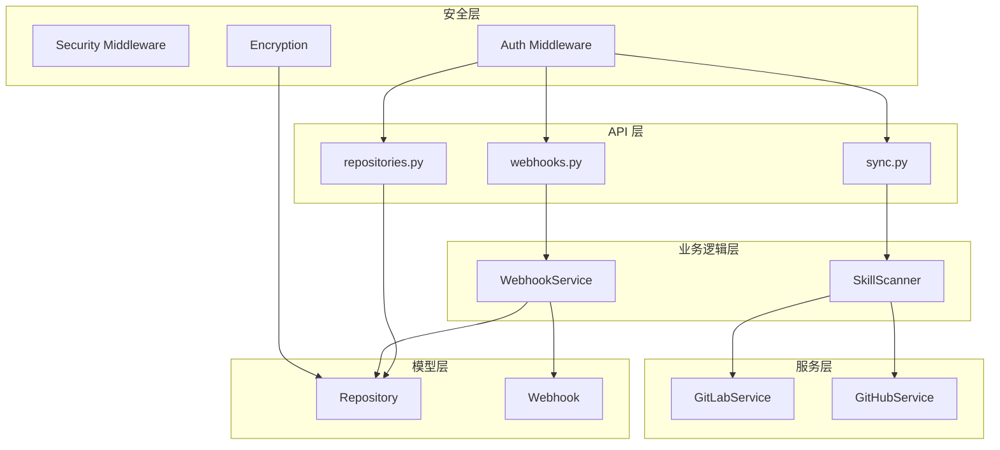
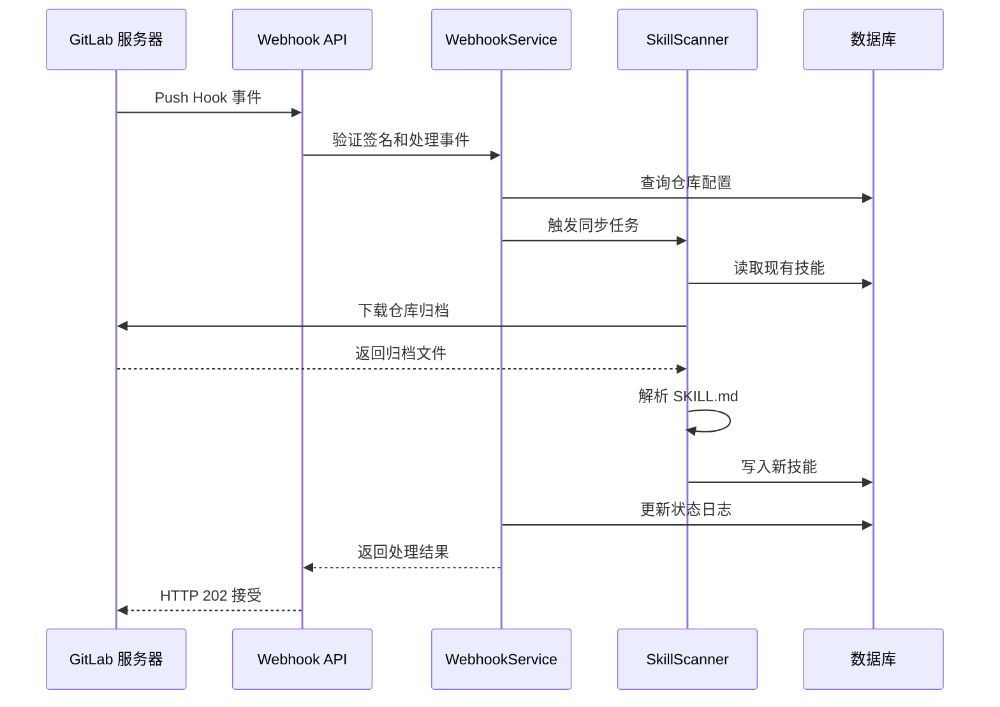
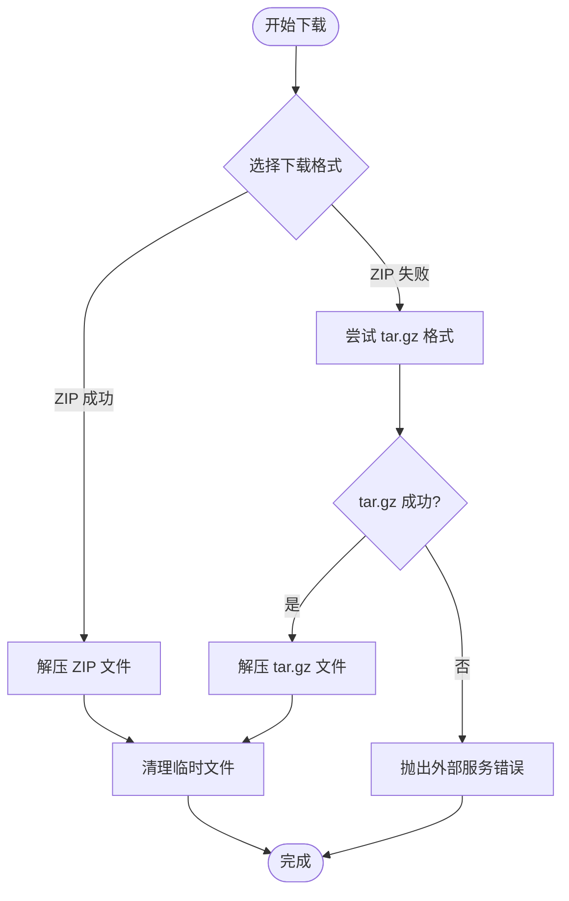
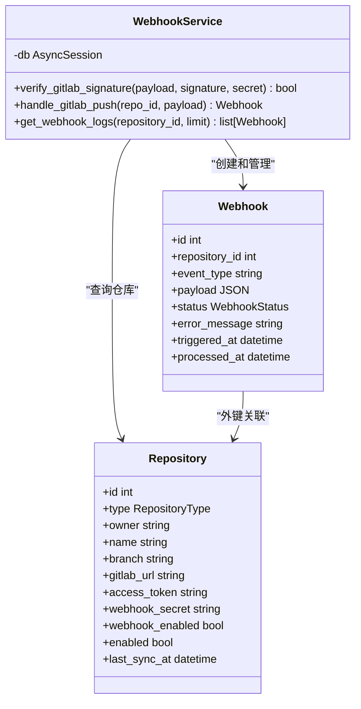
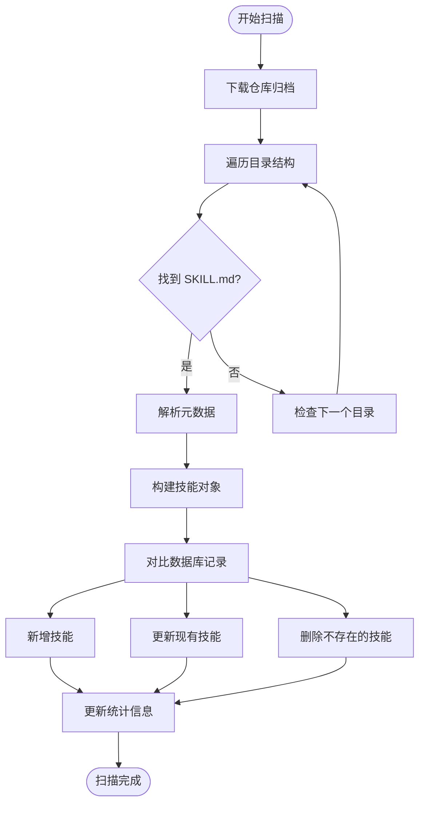
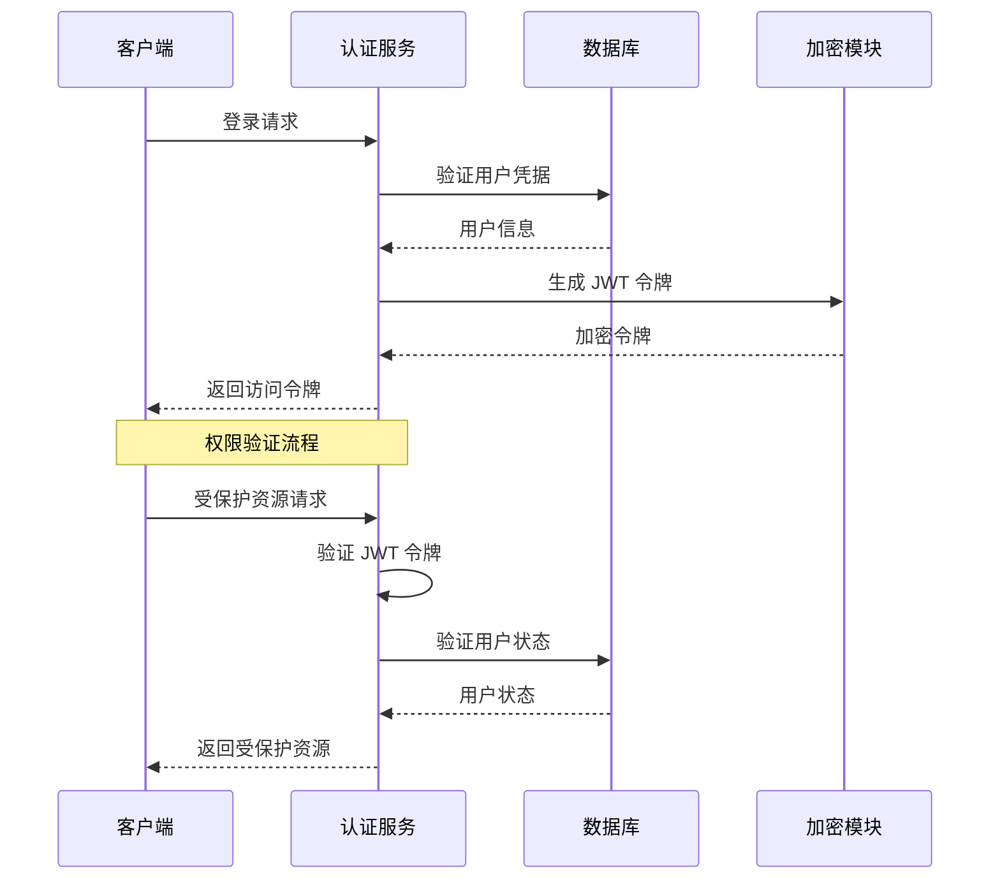
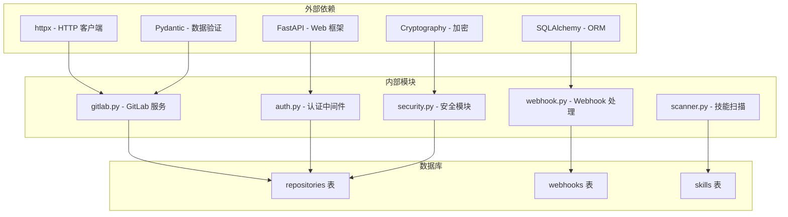

# GitLab 集成服务

<cite>
**本文档引用的文件**
- [backend/services/gitlab.py](file://backend/services/gitlab.py)
- [backend/services/webhook.py](file://backend/services/webhook.py)
- [backend/api/webhooks.py](file://backend/api/webhooks.py)
- [backend/models/repository.py](file://backend/models/repository.py)
- [backend/models/webhook.py](file://backend/models/webhook.py)
- [backend/services/scanner.py](file://backend/services/scanner.py)
- [backend/api/sync.py](file://backend/api/sync.py)
- [backend/api/repositories.py](file://backend/api/repositories.py)
- [backend/core/security.py](file://backend/core/security.py)
- [backend/middleware/auth.py](file://backend/middleware/auth.py)
- [backend/.env.example](file://backend/.env.example)
- [backend/schema.sql](file://backend/schema.sql)
- [backend/main.py](file://backend/main.py)
- [README.md](file://README.md)
</cite>

## 目录
1. [简介](#简介)
2. [项目结构](#项目结构)
3. [核心组件](#核心组件)
4. [架构概览](#架构概览)
5. [详细组件分析](#详细组件分析)
6. [依赖关系分析](#依赖关系分析)
7. [性能考虑](#性能考虑)
8. [故障排除指南](#故障排除指南)
9. [结论](#结论)
10. [附录](#附录)

## 简介
本文件详细说明了 Skills Hub 平台中的 GitLab 集成服务，包括 GitLab API 集成、项目数据获取、技能内容同步、OAuth 认证流程、API 访问令牌管理、权限控制、项目元数据提取、分支信息处理、文件内容解析、Webhook 集成、推送事件处理以及增量同步策略。同时提供了配置参数、性能调优建议和故障排除指南。

## 项目结构
该服务采用分层架构设计，主要分为以下层次：
- API 层：提供 RESTful 接口，处理外部请求
- 业务逻辑层：包含扫描器、Webhook 处理器等核心业务逻辑
- 服务层：封装 GitLab 和 GitHub 的具体实现细节
- 模型层：定义数据库表结构和数据模型
- 安全层：负责认证、授权和敏感数据加密

**图表来源**
- [backend/api/webhooks.py](file://backend/api/webhooks.py#L15-L64)
- [backend/services/webhook.py](file://backend/services/webhook.py#L15-L101)
- [backend/services/scanner.py](file://backend/services/scanner.py#L21-L197)
- [backend/services/gitlab.py](file://backend/services/gitlab.py#L15-L169)

**章节来源**
- [backend/main.py](file://backend/main.py#L24-L84)
- [backend/schema.sql](file://backend/schema.sql#L22-L38)

## 核心组件
本系统的核心组件包括：

### GitLab 服务组件
- GitLabService：封装 GitLab API 调用，提供仓库归档下载、URL 构建等功能
- 支持自建 GitLab 实例和官方 gitlab.com
- 提供 ZIP 和 tar.gz 两种归档格式下载

### Webhook 处理组件
- WebhookService：处理 GitLab Push 事件，触发自动同步
- 支持签名验证、分支匹配、状态跟踪
- 记录详细的 Webhook 日志

### 技能扫描组件
- SkillScanner：扫描仓库中的技能内容，支持增量同步
- 自动检测 SKILL.md 文件，提取元数据
- 支持 GitHub 和 GitLab 两种仓库类型

**章节来源**
- [backend/services/gitlab.py](file://backend/services/gitlab.py#L15-L169)
- [backend/services/webhook.py](file://backend/services/webhook.py#L15-L101)
- [backend/services/scanner.py](file://backend/services/scanner.py#L21-L197)

## 架构概览
系统采用异步架构设计，使用 FastAPI 框架提供高性能的 Web 服务。整体架构遵循分层设计原则，确保各层职责清晰、耦合度低。

**图表来源**
- [backend/api/webhooks.py](file://backend/api/webhooks.py#L15-L64)
- [backend/services/webhook.py](file://backend/services/webhook.py#L31-L101)
- [backend/services/scanner.py](file://backend/services/scanner.py#L70-L156)

## 详细组件分析

### GitLab API 集成实现
GitLabService 提供了完整的 GitLab API 集成功能：

#### 归档下载机制
系统优先尝试 ZIP 格式下载，失败时自动降级到 tar.gz 格式：
- ZIP 下载：`{base_url}/{owner}/{name}/-/archive/{branch}/{name}-{branch}.zip`
- tar.gz 下载：`{base_url}/{owner}/{name}/-/archive/{branch}/{name}-{branch}.tar.gz`

#### 访问令牌管理
- 私有仓库需要通过 PRIVATE-TOKEN 头部传递访问令牌
- 支持自定义 GitLab 实例地址配置
- 令牌以加密形式存储在数据库中

**图表来源**
- [backend/services/gitlab.py](file://backend/services/gitlab.py#L46-L164)

**章节来源**
- [backend/services/gitlab.py](file://backend/services/gitlab.py#L18-L169)

### Webhook 集成与事件处理
系统实现了完整的 GitLab Webhook 集成：

#### 签名验证机制
- 使用 X-Gitlab-Token 头部进行简单 token 验证
- 支持可选的 webhook_secret 配置
- 未配置密钥时跳过验证

#### Push 事件处理流程
1. 验证仓库存在性和 Webhook 启用状态
2. 提取并验证目标分支
3. 匹配配置的分支后触发同步
4. 记录详细的处理日志

**图表来源**
- [backend/services/webhook.py](file://backend/services/webhook.py#L15-L101)
- [backend/models/webhook.py](file://backend/models/webhook.py#L19-L48)
- [backend/models/repository.py](file://backend/models/repository.py#L18-L73)

**章节来源**
- [backend/api/webhooks.py](file://backend/api/webhooks.py#L15-L64)
- [backend/services/webhook.py](file://backend/services/webhook.py#L21-L101)
- [backend/models/webhook.py](file://backend/models/webhook.py#L11-L48)

### 技能内容同步机制
SkillScanner 实现了完整的技能内容同步功能：

#### 增量同步策略
- 读取数据库中现有的技能记录
- 对比扫描结果，区分新增、更新、删除操作
- 仅对发生变化的技能执行数据库更新

#### 元数据提取流程
系统自动扫描仓库中的 SKILL.md 文件：
1. 解析 YAML 头部元数据
2. 提取技能名称、描述、标签等信息
3. 计算相对路径作为技能标识符

**图表来源**
- [backend/services/scanner.py](file://backend/services/scanner.py#L27-L156)

**章节来源**
- [backend/services/scanner.py](file://backend/services/scanner.py#L27-L197)

### 认证与权限控制
系统实现了多层次的安全控制：

#### JWT 认证流程
- 使用 HS256 算法生成和验证 JWT 令牌
- 默认有效期 24 小时
- 支持管理员角色权限控制

#### 敏感数据加密
- 使用 Fernet 对称加密算法
- 支持自动生成和配置加密密钥
- 加密存储访问令牌和 Webhook 密钥

**图表来源**
- [backend/middleware/auth.py](file://backend/middleware/auth.py#L25-L95)
- [backend/core/security.py](file://backend/core/security.py#L31-L53)

**章节来源**
- [backend/middleware/auth.py](file://backend/middleware/auth.py#L25-L134)
- [backend/core/security.py](file://backend/core/security.py#L31-L64)

## 依赖关系分析

**图表来源**
- [backend/services/gitlab.py](file://backend/services/gitlab.py#L10-L12)
- [backend/services/webhook.py](file://backend/services/webhook.py#L10-L12)
- [backend/services/scanner.py](file://backend/services/scanner.py#L13-L18)

**章节来源**
- [backend/schema.sql](file://backend/schema.sql#L22-L99)

## 性能考虑
基于代码分析，系统在性能方面有以下特点和优化建议：

### 异步处理优势
- 使用 asyncio 和 httpx 进行异步 HTTP 请求
- 支持并发处理多个仓库的同步任务
- 减少 I/O 等待时间，提高整体吞吐量

### 缓存和优化策略
- 归档文件下载后进行本地缓存
- 数据库查询使用索引优化
- 批量操作减少数据库往返次数

### 配置优化建议
- 调整超时参数以适应网络环境
- 配置适当的并发数量
- 监控内存使用情况，及时清理临时文件

## 故障排除指南

### 常见问题及解决方案

#### GitLab 访问权限问题
**症状**：下载仓库时返回 401 或 403 错误
**原因**：访问令牌无效或权限不足
**解决方法**：
1. 验证访问令牌格式正确
2. 确认令牌具有足够的仓库访问权限
3. 检查自建 GitLab 实例的 URL 配置

#### Webhook 验证失败
**症状**：Webhook 请求被拒绝
**原因**：签名验证失败或配置错误
**解决方法**：
1. 确认 GitLab 项目中的 Secret Token 与配置一致
2. 检查 webhook_secret 是否正确加密存储
3. 验证 Webhook URL 配置正确

#### 同步任务失败
**症状**：技能同步过程中断
**原因**：仓库结构不符合预期或文件损坏
**解决方法**：
1. 检查 SKILL.md 文件格式是否正确
2. 验证仓库中是否存在重复的技能目录
3. 查看 Webhook 日志获取详细错误信息

**章节来源**
- [backend/services/gitlab.py](file://backend/services/gitlab.py#L82-L91)
- [backend/services/webhook.py](file://backend/services/webhook.py#L60-L70)
- [backend/api/webhooks.py](file://backend/api/webhooks.py#L38-L41)

## 结论
Skills Hub 的 GitLab 集成服务提供了完整的仓库集成解决方案，包括：

1. **完整的 GitLab API 集成**：支持官方和自建实例，提供多种归档格式下载
2. **智能的 Webhook 处理**：自动验证、分支匹配和状态跟踪
3. **高效的技能同步机制**：基于增量同步的高效内容管理
4. **多层次的安全保障**：JWT 认证、敏感数据加密和权限控制
5. **完善的监控和日志**：详细的 Webhook 日志和错误追踪

该系统设计合理，扩展性强，能够满足企业级的技能管理需求。

## 附录

### API 调用示例
系统提供以下主要 API 接口：

#### Webhook 接收
- 方法：POST
- 路径：`/webhooks/gitlab/{repo_id}`
- 头部：`X-Gitlab-Token: {webhook_secret}`, `X-Gitlab-Event: Push Hook`
- 响应：`{"status": "accepted", "message": "Webhook received"}`

#### 手动同步
- 方法：POST  
- 路径：`/api/admin/sync/{repo_id}`
- 响应：包含同步统计信息的 JSON 对象

#### 仓库配置
- 方法：POST/PUT
- 路径：`/api/admin/repositories`
- 请求体：包含仓库类型、所有者、名称、分支等信息

### 配置参数说明

#### 环境变量
- `JWT_SECRET_KEY`：JWT 密钥（生产环境必须更改）
- `ENCRYPTION_KEY`：敏感数据加密密钥
- `DATABASE_URL`：数据库连接字符串
- `ENVIRONMENT`：运行环境配置
- `DEBUG`：调试模式开关
- `PORT`：服务端口号

#### 数据库表结构
系统使用以下核心表：
- `repositories`：仓库配置表，支持 GitLab 和 GitHub 类型
- `webhooks`：Webhook 日志表，记录事件处理状态
- `skills`：技能内容表，存储解析后的技能信息

**章节来源**
- [backend/.env.example](file://backend/.env.example#L1-L17)
- [backend/schema.sql](file://backend/schema.sql#L22-L99)
- [README.md](file://README.md#L148-L154)