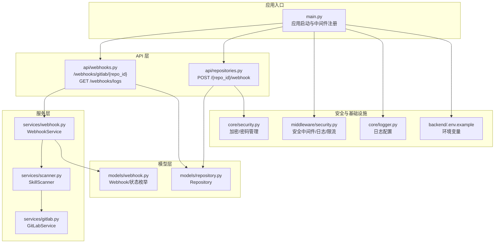
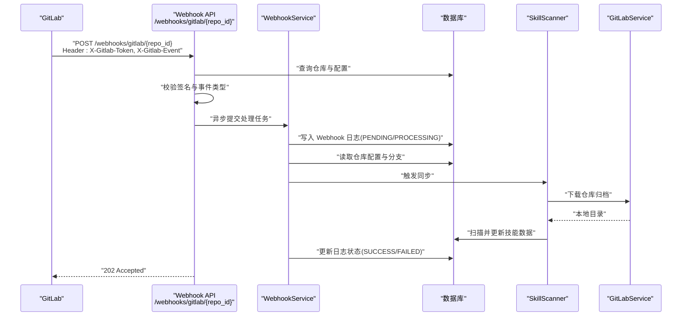
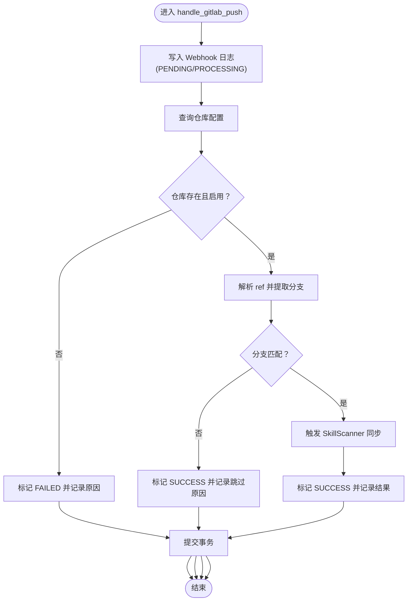
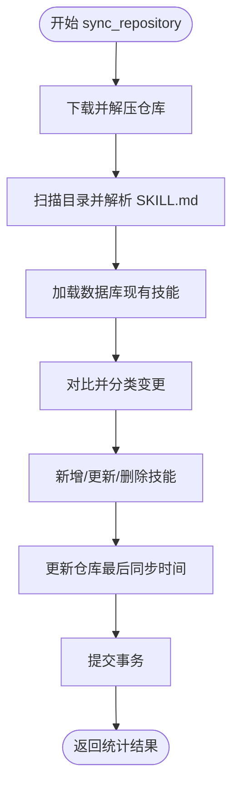
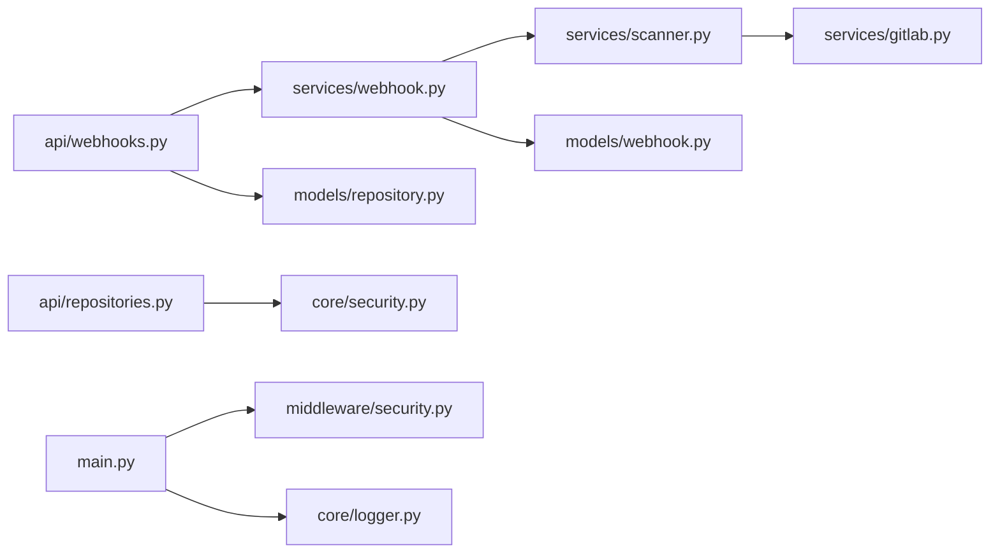

# Webhook 处理服务

<cite>
**本文引用的文件**
- [backend/main.py](file://backend/main.py)
- [backend/api/webhooks.py](file://backend/api/webhooks.py)
- [backend/services/webhook.py](file://backend/services/webhook.py)
- [backend/models/webhook.py](file://backend/models/webhook.py)
- [backend/models/repository.py](file://backend/models/repository.py)
- [backend/services/scanner.py](file://backend/services/scanner.py)
- [backend/services/gitlab.py](file://backend/services/gitlab.py)
- [backend/middleware/security.py](file://backend/middleware/security.py)
- [backend/core/security.py](file://backend/core/security.py)
- [backend/.env.example](file://backend/.env.example)
- [backend/core/logger.py](file://backend/core/logger.py)
- [backend/api/repositories.py](file://backend/api/repositories.py)
- [backend/schemas/repository.py](file://backend/schemas/repository.py)
</cite>

## 目录
1. [简介](#简介)
2. [项目结构](#项目结构)
3. [核心组件](#核心组件)
4. [架构总览](#架构总览)
5. [详细组件分析](#详细组件分析)
6. [依赖关系分析](#依赖关系分析)
7. [性能考虑](#性能考虑)
8. [故障排查指南](#故障排查指南)
9. [结论](#结论)
10. [附录](#附录)

## 简介
本文件系统性介绍 Skills 平台的 Webhook 处理服务，重点覆盖以下方面：
- GitLab Webhook 事件接收、验证与处理的完整流程
- 事件签名验证、请求解析与安全检查机制
- 异步事件处理、队列管理与失败重试策略
- 事件类型识别、数据提取与业务逻辑触发
- Webhook 配置示例、事件处理流程与错误恢复机制
- 监控指标、性能统计与调试工具
- 与同步服务的集成方式与数据一致性保障

## 项目结构
Webhook 处理服务围绕 FastAPI 应用展开，采用分层设计：
- API 层：接收 Webhook 请求并进行基础校验
- 服务层：封装 Webhook 业务逻辑与事件处理
- 模型层：持久化 Webhook 日志与仓库配置
- 中间件与安全：统一的安全响应头、日志与速率限制
- 核心模块：日志、加密与异常处理

图表来源
- [backend/main.py](file://backend/main.py#L46-L85)
- [backend/api/webhooks.py](file://backend/api/webhooks.py#L12-L64)
- [backend/api/repositories.py](file://backend/api/repositories.py#L179-L204)
- [backend/services/webhook.py](file://backend/services/webhook.py#L15-L101)
- [backend/services/scanner.py](file://backend/services/scanner.py#L21-L156)
- [backend/services/gitlab.py](file://backend/services/gitlab.py#L15-L169)
- [backend/models/repository.py](file://backend/models/repository.py#L18-L58)
- [backend/models/webhook.py](file://backend/models/webhook.py#L11-L48)
- [backend/middleware/security.py](file://backend/middleware/security.py#L11-L141)
- [backend/core/security.py](file://backend/core/security.py#L12-L63)
- [backend/core/logger.py](file://backend/core/logger.py#L11-L70)
- [backend/.env.example](file://backend/.env.example#L1-L17)

章节来源
- [backend/main.py](file://backend/main.py#L46-L85)
- [backend/api/webhooks.py](file://backend/api/webhooks.py#L12-L64)
- [backend/models/webhook.py](file://backend/models/webhook.py#L11-L48)
- [backend/models/repository.py](file://backend/models/repository.py#L18-L58)

## 核心组件
- Webhook API 路由：接收 GitLab Push 事件，执行基础校验并异步处理
- WebhookService：负责事件日志记录、仓库校验、分支匹配与触发同步
- SkillScanner：扫描仓库并同步技能数据
- GitLabService：提供 GitLab 归档下载与 URL 构造能力
- 安全中间件：统一安全响应头、请求日志与简单内存限流
- 加密模块：敏感数据加密（如访问令牌与 Webhook Secret）
- 日志模块：控制台与文件轮转日志，便于问题定位

章节来源
- [backend/api/webhooks.py](file://backend/api/webhooks.py#L15-L64)
- [backend/services/webhook.py](file://backend/services/webhook.py#L15-L101)
- [backend/services/scanner.py](file://backend/services/scanner.py#L21-L156)
- [backend/services/gitlab.py](file://backend/services/gitlab.py#L15-L169)
- [backend/middleware/security.py](file://backend/middleware/security.py#L11-L141)
- [backend/core/security.py](file://backend/core/security.py#L31-L58)
- [backend/core/logger.py](file://backend/core/logger.py#L11-L70)

## 架构总览
下图展示从 GitLab 到后端服务的端到端调用链路，包括安全校验、异步处理与日志记录。

图表来源
- [backend/api/webhooks.py](file://backend/api/webhooks.py#L15-L64)
- [backend/services/webhook.py](file://backend/services/webhook.py#L31-L101)
- [backend/services/scanner.py](file://backend/services/scanner.py#L70-L156)
- [backend/services/gitlab.py](file://backend/services/gitlab.py#L46-L169)
- [backend/models/webhook.py](file://backend/models/webhook.py#L19-L31)
- [backend/models/repository.py](file://backend/models/repository.py#L18-L31)

## 详细组件分析

### Webhook API（接收与初步校验）
- 路由：/webhooks/gitlab/{repo_id}
- 功能：
  - 根据 repo_id 查询仓库，若不存在返回 404（不暴露仓库存在性）
  - 读取请求头 X-Gitlab-Token 与仓库配置的 webhook_secret 进行签名比对
  - 读取 X-Gitlab-Event 识别事件类型
  - 解析 JSON payload，解析失败返回 400
  - 对于 Push Hook 事件，提交到后台任务异步处理
- 返回：202 Accepted 表示已接收，异步处理结果后续可通过日志接口查看

章节来源
- [backend/api/webhooks.py](file://backend/api/webhooks.py#L15-L64)

### WebhookService（事件处理与业务触发）
- 核心职责：
  - 记录 Webhook 日志（含初始状态与时间戳）
  - 校验仓库存在性与启用状态
  - 提取 GitLab ref 并与仓库配置的分支进行匹配
  - 匹配成功则触发 SkillScanner 同步；否则记录跳过原因
  - 统一捕获异常并更新日志状态为 FAILED，最终设置 processed_at
- 签名校验：提供 verify_gitlab_signature 方法，支持空密钥跳过校验

图表来源
- [backend/services/webhook.py](file://backend/services/webhook.py#L31-L101)

章节来源
- [backend/services/webhook.py](file://backend/services/webhook.py#L15-L101)

### SkillScanner（仓库扫描与同步）
- 流程：
  - 下载仓库归档（优先 ZIP，失败回退到 tar.gz）
  - 遍历目录，解析 SKILL.md，构建技能元数据
  - 与数据库现有技能对比，计算新增、更新、不变与删除
  - 更新仓库最后同步时间并提交事务
- 异常：外部服务错误（如下载失败）包装为 ExternalServiceError

图表来源
- [backend/services/scanner.py](file://backend/services/scanner.py#L70-L156)
- [backend/services/gitlab.py](file://backend/services/gitlab.py#L46-L169)

章节来源
- [backend/services/scanner.py](file://backend/services/scanner.py#L21-L156)
- [backend/services/gitlab.py](file://backend/services/gitlab.py#L15-L169)

### 安全与中间件
- 安全响应头：X-Content-Type-Options、X-Frame-Options、X-XSS-Protection、Strict-Transport-Security、Content-Security-Policy
- 请求日志：记录方法、路径、客户端 IP、响应码与耗时
- 速率限制：基于内存的简单滑动窗口限流，默认对登录路径生效

章节来源
- [backend/middleware/security.py](file://backend/middleware/security.py#L11-L141)

### 加密与敏感数据
- 使用 Fernet 对称加密存储敏感字段（如访问令牌与 Webhook Secret）
- 支持动态生成密钥并在控制台提示写入 .env
- Webhook 配置接口在启用时对 Secret 进行加密存储

章节来源
- [backend/core/security.py](file://backend/core/security.py#L31-L58)
- [backend/api/repositories.py](file://backend/api/repositories.py#L179-L204)
- [backend/schemas/repository.py](file://backend/schemas/repository.py#L60-L63)

### 日志与可观测性
- 控制台与文件轮转日志（INFO 与 ERROR 分离）
- Webhook 日志接口：GET /webhooks/logs，支持按仓库过滤与数量限制
- 日志模型包含状态、错误信息、触发与处理时间等字段

章节来源
- [backend/core/logger.py](file://backend/core/logger.py#L11-L70)
- [backend/models/webhook.py](file://backend/models/webhook.py#L19-L48)
- [backend/api/webhooks.py](file://backend/api/webhooks.py#L67-L89)

## 依赖关系分析
- Webhook API 依赖数据库查询仓库配置，并通过工厂函数获取 WebhookService
- WebhookService 依赖 SkillScanner 完成同步，SkillScanner 依赖 GitLabService 下载仓库
- WebhookService 与 SkillScanner 均依赖数据库事务进行数据一致性保障
- 安全中间件贯穿整个应用，确保响应头、日志与限流策略统一

图表来源
- [backend/api/webhooks.py](file://backend/api/webhooks.py#L15-L64)
- [backend/services/webhook.py](file://backend/services/webhook.py#L15-L101)
- [backend/services/scanner.py](file://backend/services/scanner.py#L21-L156)
- [backend/services/gitlab.py](file://backend/services/gitlab.py#L15-L169)
- [backend/models/webhook.py](file://backend/models/webhook.py#L19-L31)
- [backend/models/repository.py](file://backend/models/repository.py#L18-L31)
- [backend/api/repositories.py](file://backend/api/repositories.py#L179-L204)
- [backend/core/security.py](file://backend/core/security.py#L31-L58)
- [backend/main.py](file://backend/main.py#L46-L85)
- [backend/middleware/security.py](file://backend/middleware/security.py#L11-L141)
- [backend/core/logger.py](file://backend/core/logger.py#L11-L70)

章节来源
- [backend/api/webhooks.py](file://backend/api/webhooks.py#L15-L64)
- [backend/services/webhook.py](file://backend/services/webhook.py#L15-L101)
- [backend/services/scanner.py](file://backend/services/scanner.py#L21-L156)
- [backend/services/gitlab.py](file://backend/services/gitlab.py#L15-L169)
- [backend/models/webhook.py](file://backend/models/webhook.py#L19-L31)
- [backend/models/repository.py](file://backend/models/repository.py#L18-L31)
- [backend/api/repositories.py](file://backend/api/repositories.py#L179-L204)
- [backend/core/security.py](file://backend/core/security.py#L31-L58)
- [backend/main.py](file://backend/main.py#L46-L85)
- [backend/middleware/security.py](file://backend/middleware/security.py#L11-L141)
- [backend/core/logger.py](file://backend/core/logger.py#L11-L70)

## 性能考虑
- 异步处理：Webhook API 采用后台任务提交，避免阻塞请求响应
- I/O 密集：仓库下载与文件解压为异步 HTTP 与磁盘操作，建议合理设置超时与并发
- 数据库事务：日志写入与同步更新均在事务中完成，减少锁竞争
- 日志轮转：INFO 与 ERROR 分离，降低大体积 payload 对日志存储的影响
- 限流策略：简单内存限流可缓解突发流量，生产环境建议替换为分布式限流

## 故障排查指南
- 403 Invalid signature：确认 GitLab Webhook Secret 与仓库配置一致，且请求头 X-Gitlab-Token 正确
- 400 Invalid JSON：检查 GitLab 发送的 payload 是否为合法 JSON
- 404 Not found：仓库不存在或已被删除，API 为安全考虑不会暴露仓库存在性
- 日志查询：使用 GET /webhooks/logs 查看最近事件的状态、错误信息与处理时间
- 外部服务错误：当 GitLab 下载失败时抛出 ExternalServiceError，检查网络连通性与访问令牌

章节来源
- [backend/api/webhooks.py](file://backend/api/webhooks.py#L30-L52)
- [backend/services/webhook.py](file://backend/services/webhook.py#L60-L94)
- [backend/core/exceptions.py](file://backend/core/exceptions.py#L91-L100)
- [backend/api/webhooks.py](file://backend/api/webhooks.py#L67-L89)

## 结论
该 Webhook 处理服务以简洁清晰的分层架构实现了从 GitLab Push 事件到技能数据同步的自动化闭环。通过严格的签名校验、异步处理与完善的日志体系，系统在安全性、可靠性与可观测性方面具备良好基础。建议在生产环境中结合分布式限流与消息队列进一步增强吞吐与容错能力。

## 附录

### Webhook 配置示例
- GitLab 项目设置中创建 Webhook：
  - URL：http://your-server/webhooks/gitlab/{repo_id}
  - Secret Token：与仓库配置的 webhook_secret 一致
  - 触发条件：Push events
- 通过管理接口配置仓库 Webhook：
  - 接口：POST /{repo_id}/webhook
  - Body：{ enabled: true, secret: "your-secret" }
  - Secret 将被加密存储

章节来源
- [backend/api/webhooks.py](file://backend/api/webhooks.py#L22-L28)
- [backend/api/repositories.py](file://backend/api/repositories.py#L179-L204)
- [backend/schemas/repository.py](file://backend/schemas/repository.py#L60-L63)

### 事件处理流程与数据一致性
- 事件识别：依据 X-Gitlab-Event 判断是否为 Push Hook
- 数据提取：从 payload 中解析 ref 并与仓库配置分支匹配
- 业务触发：匹配成功后调用 SkillScanner 同步技能数据
- 一致性保障：所有写操作在事务中完成，日志状态与错误信息实时更新

章节来源
- [backend/api/webhooks.py](file://backend/api/webhooks.py#L43-L62)
- [backend/services/webhook.py](file://backend/services/webhook.py#L72-L89)
- [backend/services/scanner.py](file://backend/services/scanner.py#L70-L156)

### 监控指标与调试工具
- 指标建议：
  - Webhook 请求量与成功率（按仓库与事件类型聚合）
  - 处理延迟分布（从触发到完成）
  - 外部服务错误率（GitLab 下载失败）
- 调试工具：
  - GET /webhooks/logs 查看事件日志
  - 控制台与文件日志（INFO/ERROR 分离）
  - 健康检查：GET /api/health

章节来源
- [backend/api/webhooks.py](file://backend/api/webhooks.py#L67-L89)
- [backend/core/logger.py](file://backend/core/logger.py#L11-L70)
- [backend/main.py](file://backend/main.py#L88-L104)