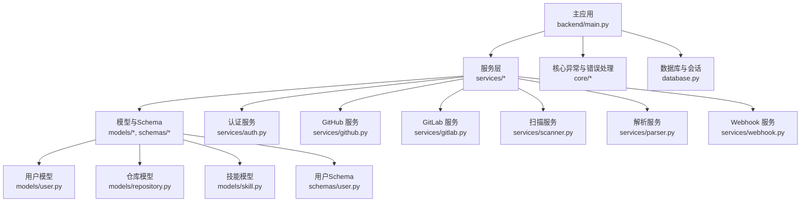
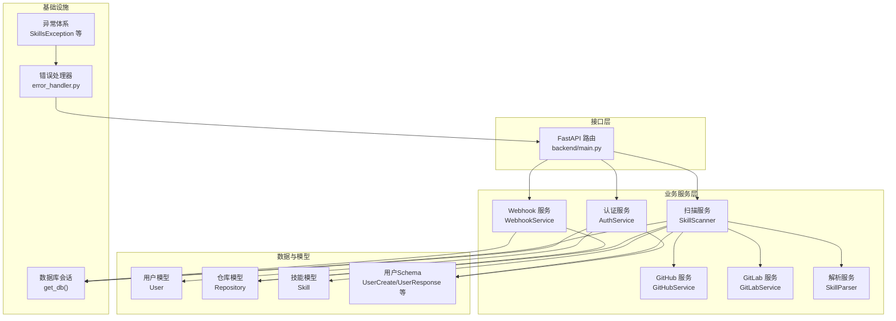
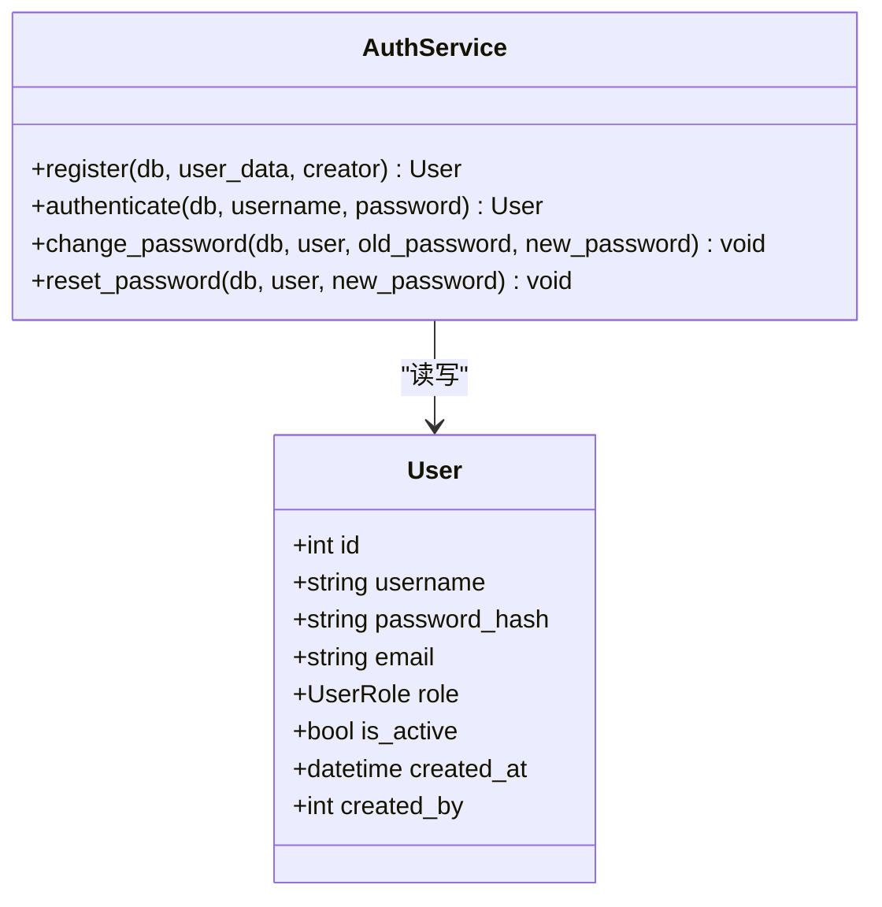
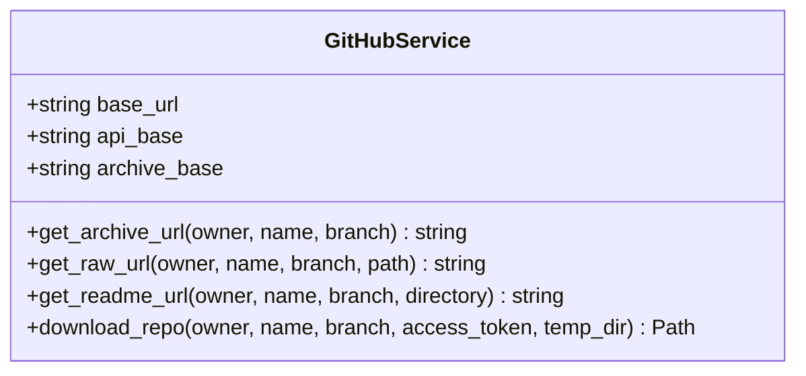
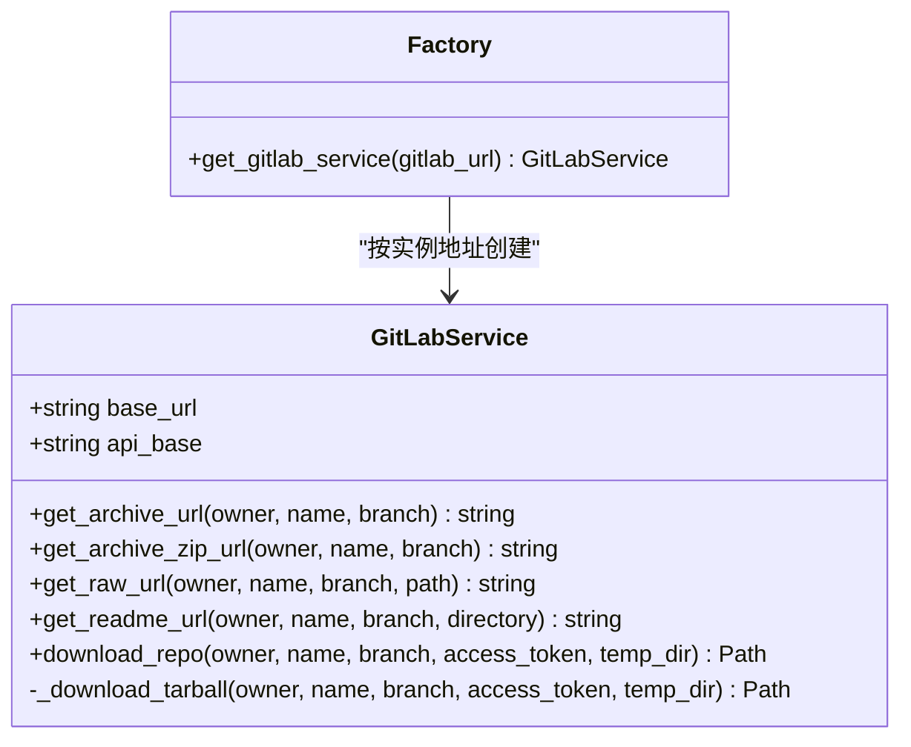
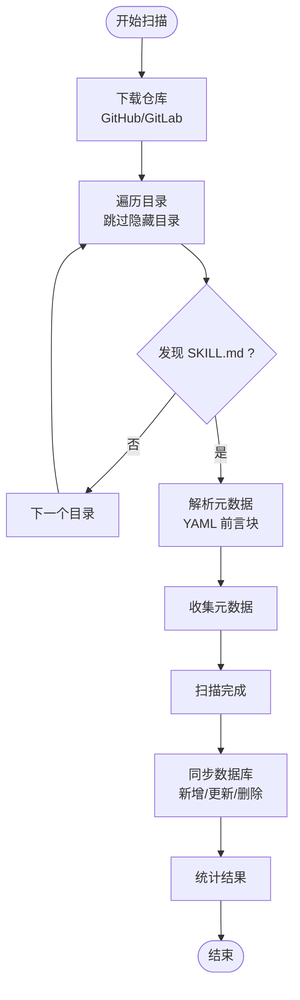
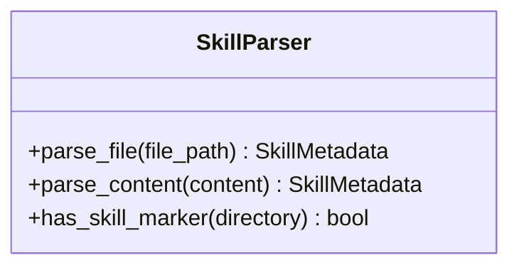
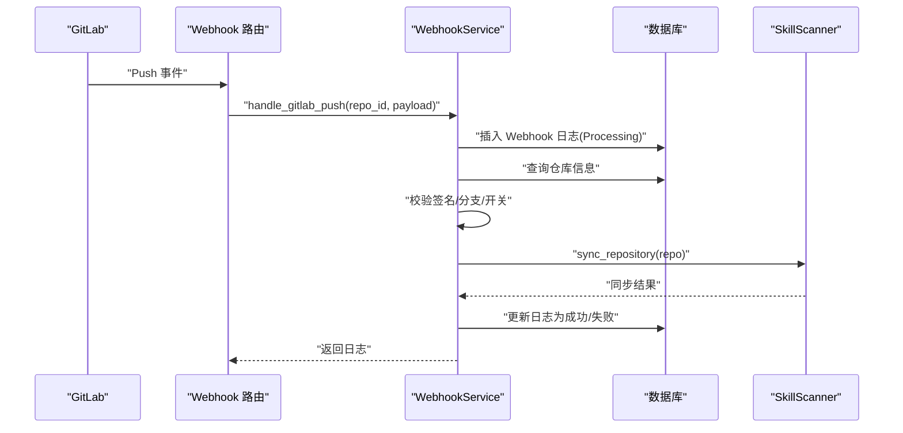
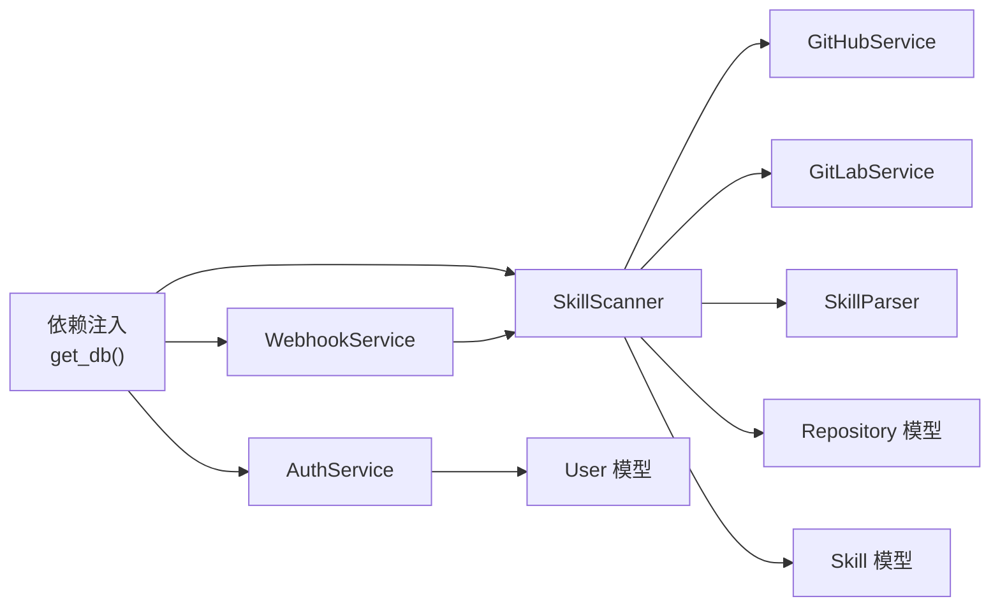

# 业务服务层

<cite>
**本文引用的文件**
- [backend/main.py](file://backend/main.py)
- [backend/services/auth.py](file://backend/services/auth.py)
- [backend/services/github.py](file://backend/services/github.py)
- [backend/services/gitlab.py](file://backend/services/gitlab.py)
- [backend/services/scanner.py](file://backend/services/scanner.py)
- [backend/services/parser.py](file://backend/services/parser.py)
- [backend/services/webhook.py](file://backend/services/webhook.py)
- [backend/models/user.py](file://backend/models/user.py)
- [backend/models/repository.py](file://backend/models/repository.py)
- [backend/models/skill.py](file://backend/models/skill.py)
- [backend/schemas/user.py](file://backend/schemas/user.py)
- [backend/core/exceptions.py](file://backend/core/exceptions.py)
- [backend/core/error_handler.py](file://backend/core/error_handler.py)
- [backend/database.py](file://backend/database.py)
</cite>

## 目录
1. [引言](#引言)
2. [项目结构](#项目结构)
3. [核心组件](#核心组件)
4. [架构总览](#架构总览)
5. [详细组件分析](#详细组件分析)
6. [依赖分析](#依赖分析)
7. [性能考虑](#性能考虑)
8. [故障排查指南](#故障排查指南)
9. [结论](#结论)
10. [附录](#附录)

## 引言
本文件聚焦于后端业务服务层，系统化梳理并解释以下核心能力与实现要点：
- 用户认证服务：注册、登录、密码修改与重置
- GitHub/GitLab 集成服务：仓库归档下载、URL 构造与错误处理
- 技能扫描服务：仓库扫描、元数据提取、数据库同步
- 内容解析服务：SKILL.md 前言块解析与标记检测
- Webhook 处理服务：GitLab 推送事件验证与触发同步
- 设计模式与依赖注入：基于 FastAPI 的依赖注入、数据库会话管理
- 异步编程与事务：异步 I/O、数据库事务与回滚策略
- 错误处理与重试：统一异常体系、错误响应与外部服务错误
- 服务协作与扩展：服务间组合、接口抽象与可扩展性
- 测试策略、性能优化与监控建议

## 项目结构
后端采用分层组织，业务服务集中在 services 目录，核心异常与错误处理位于 core，数据库与会话管理位于 database，模型与 Schema 定义在 models 与 schemas。

图表来源
- [backend/main.py](file://backend/main.py#L47-L84)
- [backend/services/auth.py](file://backend/services/auth.py#L19-L130)
- [backend/services/github.py](file://backend/services/github.py#L14-L105)
- [backend/services/gitlab.py](file://backend/services/gitlab.py#L15-L170)
- [backend/services/scanner.py](file://backend/services/scanner.py#L21-L197)
- [backend/services/parser.py](file://backend/services/parser.py#L13-L86)
- [backend/services/webhook.py](file://backend/services/webhook.py#L15-L124)
- [backend/models/user.py](file://backend/models/user.py#L18-L52)
- [backend/models/repository.py](file://backend/models/repository.py#L18-L74)
- [backend/models/skill.py](file://backend/models/skill.py#L11-L90)
- [backend/schemas/user.py](file://backend/schemas/user.py#L8-L96)
- [backend/core/exceptions.py](file://backend/core/exceptions.py#L7-L101)
- [backend/core/error_handler.py](file://backend/core/error_handler.py#L14-L102)
- [backend/database.py](file://backend/database.py#L42-L75)

章节来源
- [backend/main.py](file://backend/main.py#L47-L84)
- [backend/database.py](file://backend/database.py#L42-L75)

## 核心组件
- 认证服务：提供用户注册、登录校验、密码修改与管理员重置功能；内置权限校验与日志记录。
- GitHub/GitLab 集成：封装归档下载、URL 构造与归档格式差异处理；统一外部服务错误。
- 技能扫描：下载仓库、遍历目录、解析 SKILL.md、与数据库进行增删改查同步。
- 内容解析：正则与 YAML 解析前言块，兼容缺失或无效内容。
- Webhook 处理：验证签名、过滤分支、记录日志、触发扫描并持久化状态。
- 异常与错误处理：统一 SkillsException 体系与 FastAPI 异常处理器。
- 数据库与依赖注入：异步引擎、会话工厂与请求级依赖注入。

章节来源
- [backend/services/auth.py](file://backend/services/auth.py#L19-L130)
- [backend/services/github.py](file://backend/services/github.py#L14-L105)
- [backend/services/gitlab.py](file://backend/services/gitlab.py#L15-L170)
- [backend/services/scanner.py](file://backend/services/scanner.py#L21-L197)
- [backend/services/parser.py](file://backend/services/parser.py#L13-L86)
- [backend/services/webhook.py](file://backend/services/webhook.py#L15-L124)
- [backend/core/exceptions.py](file://backend/core/exceptions.py#L7-L101)
- [backend/core/error_handler.py](file://backend/core/error_handler.py#L14-L102)
- [backend/database.py](file://backend/database.py#L42-L75)

## 架构总览
业务服务层围绕“服务对象 + 模型/Schema + 异常/错误处理 + 数据库会话”协同工作。FastAPI 负责路由与中间件，服务层负责业务编排，数据库层负责持久化。

图表来源
- [backend/main.py](file://backend/main.py#L47-L84)
- [backend/services/auth.py](file://backend/services/auth.py#L19-L130)
- [backend/services/scanner.py](file://backend/services/scanner.py#L21-L197)
- [backend/services/webhook.py](file://backend/services/webhook.py#L15-L124)
- [backend/services/github.py](file://backend/services/github.py#L14-L105)
- [backend/services/gitlab.py](file://backend/services/gitlab.py#L15-L170)
- [backend/services/parser.py](file://backend/services/parser.py#L13-L86)
- [backend/models/user.py](file://backend/models/user.py#L18-L52)
- [backend/models/repository.py](file://backend/models/repository.py#L18-L74)
- [backend/models/skill.py](file://backend/models/skill.py#L11-L90)
- [backend/schemas/user.py](file://backend/schemas/user.py#L8-L96)
- [backend/core/exceptions.py](file://backend/core/exceptions.py#L7-L101)
- [backend/core/error_handler.py](file://backend/core/error_handler.py#L14-L102)
- [backend/database.py](file://backend/database.py#L42-L75)

## 详细组件分析

### 认证服务（AuthService）
职责与流程
- 注册：去重检查、角色权限校验、密码哈希、持久化与刷新
- 登录：查询用户、状态校验、密码验证、日志记录
- 密码管理：当前密码校验、修改与管理员重置

图表来源
- [backend/services/auth.py](file://backend/services/auth.py#L19-L130)
- [backend/models/user.py](file://backend/models/user.py#L18-L52)
- [backend/schemas/user.py](file://backend/schemas/user.py#L14-L30)

章节来源
- [backend/services/auth.py](file://backend/services/auth.py#L22-L115)
- [backend/models/user.py](file://backend/models/user.py#L18-L52)
- [backend/schemas/user.py](file://backend/schemas/user.py#L14-L30)

### GitHub 集成服务（GitHubService）
职责与流程
- 归档下载：构造 URL、鉴权头、异步下载、保存与解压、清理临时文件
- URL 构造：归档、原始文件、README 页面
- 错误处理：HTTP 状态错误转为外部服务错误

图表来源
- [backend/services/github.py](file://backend/services/github.py#L14-L105)

章节来源
- [backend/services/github.py](file://backend/services/github.py#L22-L102)

### GitLab 集成服务（GitLabService）
职责与流程
- 支持自建实例、API 基址、归档与原始文件 URL 构造
- 下载优先尝试 ZIP，失败回退 tar.gz，并统一错误处理
- 提供工厂函数按实例地址生成服务实例

图表来源
- [backend/services/gitlab.py](file://backend/services/gitlab.py#L15-L170)

章节来源
- [backend/services/gitlab.py](file://backend/services/gitlab.py#L18-L169)

### 技能扫描服务（SkillScanner）
职责与流程
- 扫描：下载仓库 → 遍历目录 → 匹配 SKILL.md → 解析元数据
- 同步：对比数据库现有技能 → 增量更新/删除 → 统计结果
- URL 构建：根据仓库类型构建 README 与原始内容 URL
- 外部服务错误：下载失败统一抛出外部服务错误

图表来源
- [backend/services/scanner.py](file://backend/services/scanner.py#L27-L197)
- [backend/services/parser.py](file://backend/services/parser.py#L18-L70)
- [backend/services/github.py](file://backend/services/github.py#L36-L102)
- [backend/services/gitlab.py](file://backend/services/gitlab.py#L46-L165)

章节来源
- [backend/services/scanner.py](file://backend/services/scanner.py#L27-L197)
- [backend/services/parser.py](file://backend/services/parser.py#L18-L70)

### 内容解析服务（SkillParser）
职责与流程
- 文件解析：读取内容 → 正则匹配前言块 → YAML 解析 → 返回元数据对象
- 内容解析：直接解析字符串内容
- 标记检测：判断目录是否存在 SKILL.md

图表来源
- [backend/services/parser.py](file://backend/services/parser.py#L13-L86)

章节来源
- [backend/services/parser.py](file://backend/services/parser.py#L18-L82)

### Webhook 处理服务（WebhookService）
职责与流程
- 签名校验：GitLab 简单 token 验证
- 事件处理：记录日志、加载仓库、分支过滤、启用开关检查
- 触发同步：创建扫描器并执行同步，记录成功/失败与错误信息
- 日志查询：按仓库与数量限制查询 Webhook 日志

图表来源
- [backend/services/webhook.py](file://backend/services/webhook.py#L31-L101)
- [backend/services/scanner.py](file://backend/services/scanner.py#L70-L156)
- [backend/models/repository.py](file://backend/models/repository.py#L18-L74)

章节来源
- [backend/services/webhook.py](file://backend/services/webhook.py#L21-L116)

## 依赖分析
- 依赖注入：通过 FastAPI 依赖注入获取数据库会话；会话工厂在请求生命周期内创建、提交、回滚与关闭。
- 服务耦合：SkillScanner 组合 GitHub/GitLab 服务与解析器；WebhookService 组合 SkillScanner 并持久化日志。
- 异常链路：统一 SkillsException 体系，配合错误处理器输出标准化错误响应。
- 外部依赖：httpx 异步客户端、aiofiles 异步文件写入、zip/tar 解压库。

图表来源
- [backend/database.py](file://backend/database.py#L42-L75)
- [backend/services/auth.py](file://backend/services/auth.py#L19-L130)
- [backend/services/scanner.py](file://backend/services/scanner.py#L21-L197)
- [backend/services/webhook.py](file://backend/services/webhook.py#L15-L124)
- [backend/services/github.py](file://backend/services/github.py#L14-L105)
- [backend/services/gitlab.py](file://backend/services/gitlab.py#L15-L170)
- [backend/services/parser.py](file://backend/services/parser.py#L13-L86)
- [backend/models/user.py](file://backend/models/user.py#L18-L52)
- [backend/models/repository.py](file://backend/models/repository.py#L18-L74)
- [backend/models/skill.py](file://backend/models/skill.py#L11-L90)

章节来源
- [backend/database.py](file://backend/database.py#L42-L75)
- [backend/services/scanner.py](file://backend/services/scanner.py#L14-L17)
- [backend/services/webhook.py](file://backend/services/webhook.py#L18-L19)

## 性能考虑
- 异步 I/O：httpx 异步客户端与 aiofiles 异步文件写入，避免阻塞事件循环。
- 数据库连接池：预连接检查与连接池参数，减少连接建立开销。
- 扫描范围控制：遍历时跳过隐藏目录，降低 IO 压力。
- 归档格式回退：GitLab ZIP 失败自动回退 tar.gz，提升成功率。
- 缓存与日志：对外部服务调用结果进行必要缓存与日志记录，便于追踪与优化。
- 并发与限流：结合中间件与速率限制策略，避免外部服务过载。

## 故障排查指南
常见问题与定位
- 认证失败：检查用户名是否存在、账户是否激活、密码是否正确；查看认证日志。
- 注册冲突：用户名重复导致冲突错误；确认去重逻辑与唯一约束。
- 外部服务错误：GitHub/GitLab 下载失败或归档格式异常；检查访问令牌、网络连通性与归档 URL。
- Webhook 失败：签名不匹配、分支不一致、仓库未启用或不存在；查看 Webhook 日志表。
- 数据库异常：连接失败或会话回滚；检查连接池配置与异常处理器。

章节来源
- [backend/core/exceptions.py](file://backend/core/exceptions.py#L24-L101)
- [backend/core/error_handler.py](file://backend/core/error_handler.py#L14-L102)
- [backend/services/auth.py](file://backend/services/auth.py#L76-L98)
- [backend/services/webhook.py](file://backend/services/webhook.py#L60-L101)

## 结论
业务服务层以清晰的职责划分与良好的抽象实现了从认证、外部集成、内容解析到自动化同步与 Webhook 处理的完整闭环。通过统一的异常体系与错误处理、异步编程与数据库会话管理，系统具备良好的可维护性与扩展性。建议后续引入重试与熔断、队列化异步任务以及更细粒度的指标与告警，进一步增强可靠性与可观测性。

## 附录
- 服务测试策略建议
  - 单元测试：针对解析器、服务方法进行输入/输出断言与边界条件测试
  - 集成测试：模拟数据库会话、外部服务响应与 Webhook 事件，验证端到端流程
  - 压力测试：对扫描与下载流程进行并发与超时测试
- 监控与日志
  - 记录关键服务调用耗时、错误率与外部服务状态
  - 对 Webhook 处理与同步结果进行审计日志
- 扩展性设计
  - 新增平台：遵循 GitHub/GitLab 服务接口抽象，提供工厂或适配器
  - 新增扫描规则：在解析器与扫描器中扩展元数据字段与匹配规则
  - 异步化：将长耗时任务迁移至后台任务队列