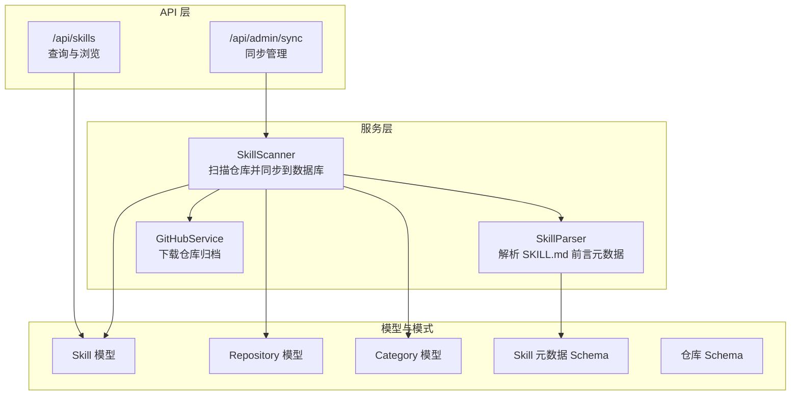
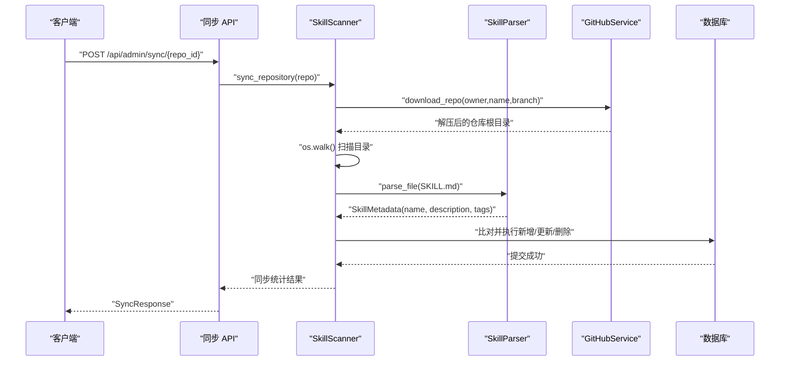
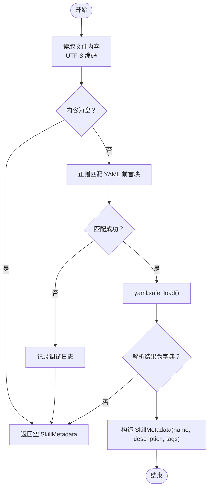
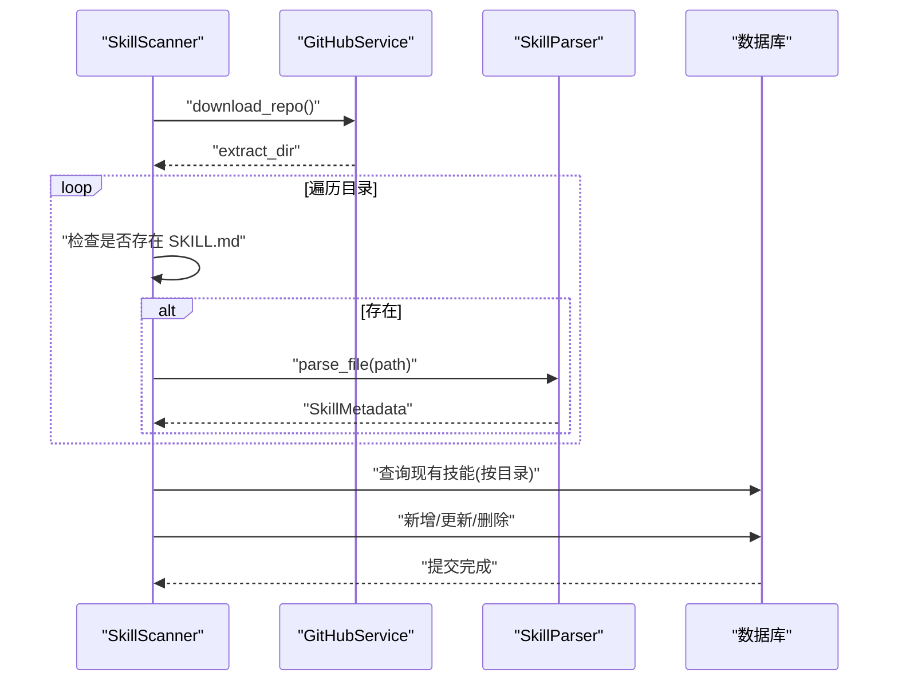
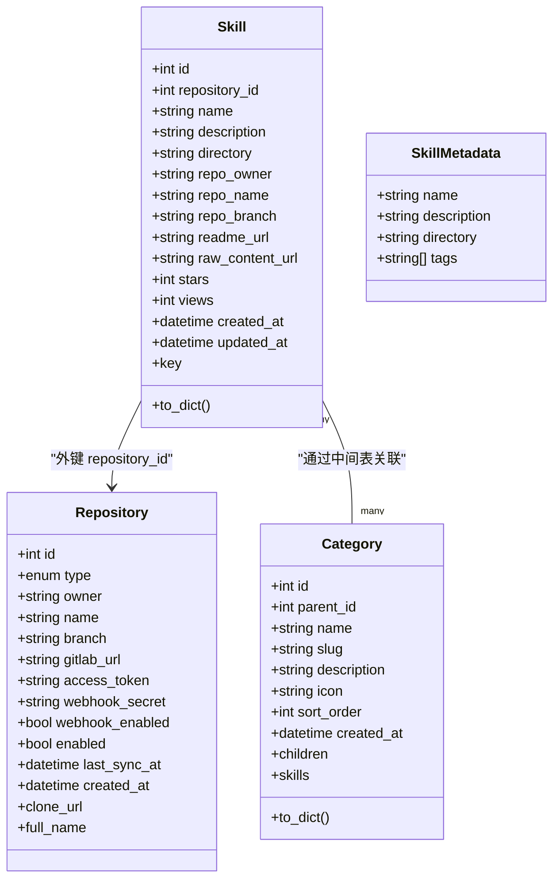
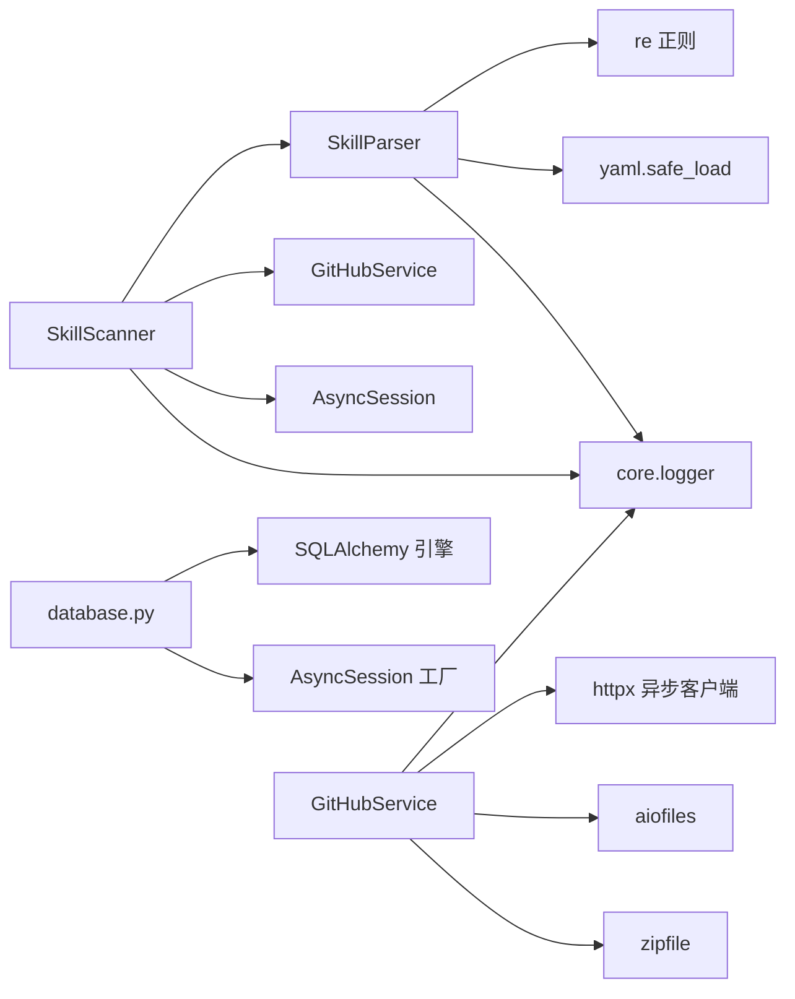

# 内容解析服务

<cite>
**本文档引用的文件**
- [backend/services/parser.py](file://backend/services/parser.py)
- [backend/services/scanner.py](file://backend/services/scanner.py)
- [backend/services/github.py](file://backend/services/github.py)
- [backend/models/skill.py](file://backend/models/skill.py)
- [backend/models/repository.py](file://backend/models/repository.py)
- [backend/models/category.py](file://backend/models/category.py)
- [backend/schemas/skill.py](file://backend/schemas/skill.py)
- [backend/schemas/repository.py](file://backend/schemas/repository.py)
- [backend/api/skills.py](file://backend/api/skills.py)
- [backend/api/sync.py](file://backend/api/sync.py)
- [backend/database.py](file://backend/database.py)
- [backend/core/logger.py](file://backend/core/logger.py)
- [README.md](file://README.md)
</cite>

## 目录
1. [简介](#简介)
2. [项目结构](#项目结构)
3. [核心组件](#核心组件)
4. [架构总览](#架构总览)
5. [详细组件分析](#详细组件分析)
6. [依赖关系分析](#依赖关系分析)
7. [性能考虑](#性能考虑)
8. [故障排除指南](#故障排除指南)
9. [结论](#结论)
10. [附录](#附录)

## 简介
本文件系统性阐述内容解析服务的技术实现，重点覆盖以下方面：
- SKILL.md 文件解析：YAML 前言元数据提取与结构化
- 解析器架构、语法分析与数据验证机制
- 多格式支持与编码处理、特殊字符转义规则
- 解析错误处理、数据清洗与标准化流程
- 解析配置示例、自定义解析规则与扩展机制
- 性能优化、缓存策略与并发处理能力
- 与数据库模型的映射关系与数据转换逻辑

## 项目结构
后端采用分层架构，解析服务位于 services 层，围绕 SkillParser 和 SkillScanner 提供“发现—解析—同步”的完整链路。

图表来源
- [backend/services/parser.py](file://backend/services/parser.py#L13-L85)
- [backend/services/scanner.py](file://backend/services/scanner.py#L21-L197)
- [backend/services/github.py](file://backend/services/github.py#L14-L105)
- [backend/models/skill.py](file://backend/models/skill.py#L11-L90)
- [backend/models/repository.py](file://backend/models/repository.py#L18-L74)
- [backend/models/category.py](file://backend/models/category.py#L19-L94)
- [backend/schemas/skill.py](file://backend/schemas/skill.py#L54-L60)
- [backend/schemas/repository.py](file://backend/schemas/repository.py#L7-L73)
- [backend/api/skills.py](file://backend/api/skills.py#L18-L160)
- [backend/api/sync.py](file://backend/api/sync.py#L17-L112)

章节来源
- [backend/services/parser.py](file://backend/services/parser.py#L1-L86)
- [backend/services/scanner.py](file://backend/services/scanner.py#L1-L197)
- [backend/services/github.py](file://backend/services/github.py#L1-L105)
- [backend/models/skill.py](file://backend/models/skill.py#L1-L90)
- [backend/models/repository.py](file://backend/models/repository.py#L1-L74)
- [backend/models/category.py](file://backend/models/category.py#L1-L94)
- [backend/schemas/skill.py](file://backend/schemas/skill.py#L1-L60)
- [backend/schemas/repository.py](file://backend/schemas/repository.py#L1-L73)
- [backend/api/skills.py](file://backend/api/skills.py#L1-L160)
- [backend/api/sync.py](file://backend/api/sync.py#L1-L112)
- [backend/database.py](file://backend/database.py#L1-L75)
- [backend/core/logger.py](file://backend/core/logger.py#L1-L95)
- [README.md](file://README.md#L156-L168)

## 核心组件
- SkillParser：负责读取并解析 SKILL.md 文件的 YAML 前言元数据，输出结构化的 SkillMetadata。
- SkillScanner：扫描仓库目录树，定位 SKILL.md，调用解析器提取元数据，并与数据库进行比对、新增、更新或删除。
- GitHubService：提供 GitHub 仓库归档下载与解压，作为 SkillScanner 的外部依赖。
- 数据模型与 Schema：Skill、Repository、Category 模型及对应的 Pydantic Schema，支撑数据持久化与 API 响应。
- API 层：对外提供技能查询、详情查看与同步管理接口。

章节来源
- [backend/services/parser.py](file://backend/services/parser.py#L13-L85)
- [backend/services/scanner.py](file://backend/services/scanner.py#L21-L197)
- [backend/services/github.py](file://backend/services/github.py#L14-L105)
- [backend/models/skill.py](file://backend/models/skill.py#L11-L90)
- [backend/models/repository.py](file://backend/models/repository.py#L18-L74)
- [backend/models/category.py](file://backend/models/category.py#L19-L94)
- [backend/schemas/skill.py](file://backend/schemas/skill.py#L54-L60)
- [backend/schemas/repository.py](file://backend/schemas/repository.py#L7-L73)
- [backend/api/skills.py](file://backend/api/skills.py#L18-L160)
- [backend/api/sync.py](file://backend/api/sync.py#L17-L112)

## 架构总览
解析服务的整体工作流如下：

图表来源
- [backend/api/sync.py](file://backend/api/sync.py#L17-L32)
- [backend/services/scanner.py](file://backend/services/scanner.py#L70-L156)
- [backend/services/parser.py](file://backend/services/parser.py#L18-L69)
- [backend/services/github.py](file://backend/services/github.py#L36-L102)
- [backend/database.py](file://backend/database.py#L42-L55)

## 详细组件分析

### SkillParser：SKILL.md 解析器
- 职责：读取 UTF-8 编码的 SKILL.md 文件，匹配 YAML 前言块，安全解析为字典，封装为 SkillMetadata。
- 语法分析：
  - 使用正则表达式匹配三短横线界定的前言块。
  - 使用安全 YAML 解析，避免任意代码执行风险。
- 数据验证与清洗：
  - 若内容为空或未找到前言块，返回空的 SkillMetadata。
  - YAML 解析失败时记录警告并返回空对象，确保健壮性。
- 输出：SkillMetadata(name, description, tags, directory=None)。

图表来源
- [backend/services/parser.py](file://backend/services/parser.py#L18-L69)

章节来源
- [backend/services/parser.py](file://backend/services/parser.py#L13-L85)

### SkillScanner：仓库扫描与同步
- 职责：下载仓库、遍历目录、定位 SKILL.md、调用解析器、与数据库比对并执行 CRUD。
- 工作流程：
  - 下载仓库：根据仓库类型选择 GitHubService 或 GitLab 服务。
  - 扫描：使用 os.walk 遍历目录，跳过隐藏目录；检测到 SKILL.md 即解析。
  - 同步：对比数据库中已存在技能，按目录路径进行新增、更新或删除。
  - 统计：返回新增、更新、不变、删除的数量。
- URL 构建：根据仓库类型生成 README 与原始文件 URL，便于展示与溯源。

图表来源
- [backend/services/scanner.py](file://backend/services/scanner.py#L27-L156)
- [backend/services/github.py](file://backend/services/github.py#L36-L102)
- [backend/services/parser.py](file://backend/services/parser.py#L18-L69)

章节来源
- [backend/services/scanner.py](file://backend/services/scanner.py#L21-L197)

### 数据模型与 Schema 映射
- Skill 模型字段与 API 响应字段对应关系清晰，包含基础元数据、仓库来源信息、浏览计数等。
- SkillMetadata 作为解析产物，与 Skill 模型的字段存在一一映射关系，便于入库。
- Repository 模型支持 GitHub/GitLab 类型，提供克隆 URL、分支、访问令牌等配置。

图表来源
- [backend/models/skill.py](file://backend/models/skill.py#L11-L90)
- [backend/models/repository.py](file://backend/models/repository.py#L18-L74)
- [backend/models/category.py](file://backend/models/category.py#L19-L94)
- [backend/schemas/skill.py](file://backend/schemas/skill.py#L54-L60)

章节来源
- [backend/models/skill.py](file://backend/models/skill.py#L11-L90)
- [backend/models/repository.py](file://backend/models/repository.py#L18-L74)
- [backend/models/category.py](file://backend/models/category.py#L19-L94)
- [backend/schemas/skill.py](file://backend/schemas/skill.py#L54-L60)
- [backend/schemas/repository.py](file://backend/schemas/repository.py#L7-L73)

### API 层集成
- 技能查询与详情：支持关键词搜索、分类筛选、仓库筛选、排序与分页；浏览时自动增加 views。
- 同步管理：支持单仓库手动同步与全量同步，后台任务异步执行，失败记录日志并返回聚合结果。

章节来源
- [backend/api/skills.py](file://backend/api/skills.py#L18-L160)
- [backend/api/sync.py](file://backend/api/sync.py#L17-L112)

## 依赖关系分析
- 解析器依赖：正则表达式、YAML 解析、日志模块。
- 扫描器依赖：解析器、仓库服务、数据库会话、异常与日志。
- 仓库服务依赖：HTTP 客户端、文件系统、日志与异常。
- 数据库依赖：异步 SQLAlchemy、连接池配置、会话生命周期管理。
- 日志模块：统一日志配置与上下文增强。

图表来源
- [backend/services/parser.py](file://backend/services/parser.py#L4-L10)
- [backend/services/scanner.py](file://backend/services/scanner.py#L10-L18)
- [backend/services/github.py](file://backend/services/github.py#L4-L11)
- [backend/database.py](file://backend/database.py#L5-L36)
- [backend/core/logger.py](file://backend/core/logger.py#L11-L70)

章节来源
- [backend/services/parser.py](file://backend/services/parser.py#L1-L86)
- [backend/services/scanner.py](file://backend/services/scanner.py#L1-L197)
- [backend/services/github.py](file://backend/services/github.py#L1-L105)
- [backend/database.py](file://backend/database.py#L1-L75)
- [backend/core/logger.py](file://backend/core/logger.py#L1-L95)

## 性能考虑
- 并发与异步：使用异步 HTTP 客户端与异步数据库会话，提升 I/O 密集场景吞吐。
- 连接池：数据库引擎配置了连接池大小与溢出连接数，降低连接开销。
- 扫描策略：遍历目录时跳过隐藏目录，减少无效 I/O；仅在发现 SKILL.md 时解析，避免全量扫描。
- 缓存策略：当前未实现专用缓存；建议在高频查询场景引入 Redis 缓存热门技能详情与分类树。
- 日志级别：生产环境建议调整日志级别，减少 INFO 级别日志量，保留 ERROR 级别以便问题追踪。

章节来源
- [backend/database.py](file://backend/database.py#L20-L36)
- [backend/services/github.py](file://backend/services/github.py#L69-L74)
- [backend/core/logger.py](file://backend/core/logger.py#L11-L70)

## 故障排除指南
- 解析失败：
  - 现象：日志出现“Failed to parse YAML front matter”或“Failed to parse SKILL.md”。
  - 处理：检查 SKILL.md 前言块格式是否正确，确认 YAML 语法无误；必要时回退到默认空元数据。
- 仓库下载失败：
  - 现象：外部服务错误，状态码异常或 ZIP 文件损坏。
  - 处理：检查访问令牌、网络连通性与仓库可见性；清理临时文件后重试。
- 同步不生效：
  - 现象：数据库未更新或部分技能缺失。
  - 处理：确认扫描目录未被隐藏；核对目录路径是否变化导致无法匹配；查看同步统计结果定位差异。

章节来源
- [backend/services/parser.py](file://backend/services/parser.py#L31-L33)
- [backend/services/parser.py](file://backend/services/parser.py#L67-L69)
- [backend/services/github.py](file://backend/services/github.py#L73-L97)
- [backend/services/scanner.py](file://backend/services/scanner.py#L178-L180)

## 结论
内容解析服务以 SkillParser 为核心，结合 SkillScanner 的扫描与同步能力，实现了从仓库中自动发现、解析与入库 SKILL.md 元数据的完整闭环。通过严格的 YAML 解析与错误处理、清晰的模型映射与 API 集成，系统具备良好的可维护性与扩展性。建议后续引入缓存与更细粒度的并发控制，进一步提升性能与稳定性。

## 附录

### SKILL.md 格式规范与示例
- 格式要求：三短横线界定的 YAML 前言块，随后为正文内容。
- 字段说明：name、description、tags（可选）、directory（由扫描器填充）。
- 示例参考：见项目 README 中的示例片段。

章节来源
- [README.md](file://README.md#L156-L168)
- [backend/services/parser.py](file://backend/services/parser.py#L35-L46)

### 自定义解析规则与扩展机制
- 扩展点：可在 SkillParser 中增加新的字段解析逻辑，如 authors、level、duration 等。
- 规则定制：通过正则表达式或自定义解析函数扩展前言块解析能力。
- 兼容性：保持向后兼容，新增字段不影响现有解析流程。

章节来源
- [backend/services/parser.py](file://backend/services/parser.py#L16-L16)
- [backend/schemas/skill.py](file://backend/schemas/skill.py#L54-L60)

### 数据库模型与解析结果映射
- 解析结果 SkillMetadata 与 Skill 模型字段映射：
  - name → name
  - description → description
  - tags → 通过分类体系或标签扩展（当前解析器返回 tags 列表）
  - directory → directory（用于去重与更新判断）
- Repository 与 Skill 的关联：repository_id、repo_owner、repo_name、repo_branch、readme_url、raw_content_url 等字段由扫描器填充。

章节来源
- [backend/models/skill.py](file://backend/models/skill.py#L16-L29)
- [backend/services/scanner.py](file://backend/services/scanner.py#L122-L132)
- [backend/schemas/skill.py](file://backend/schemas/skill.py#L54-L60)