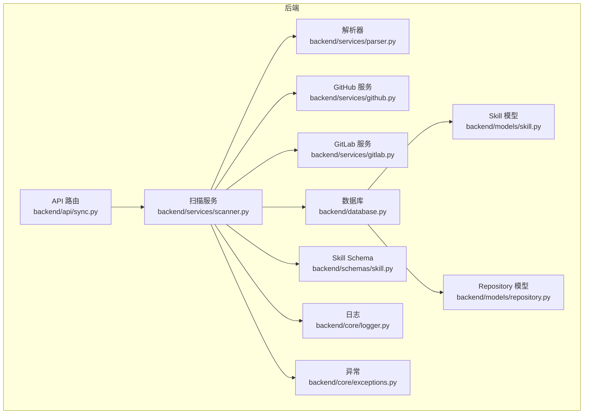
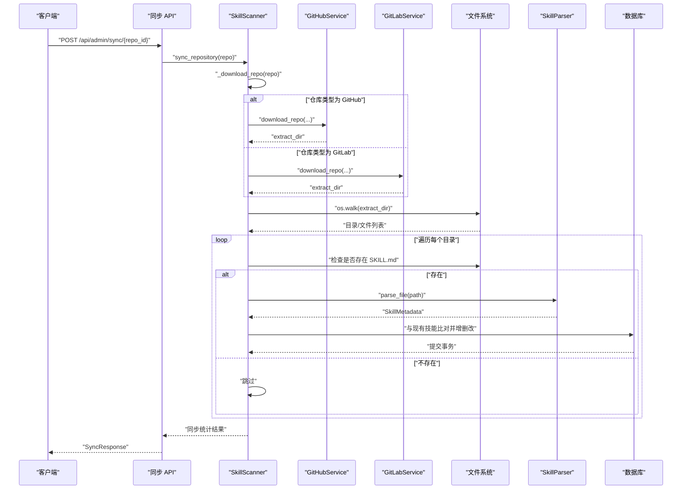
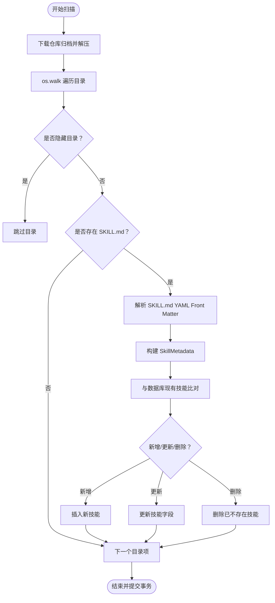
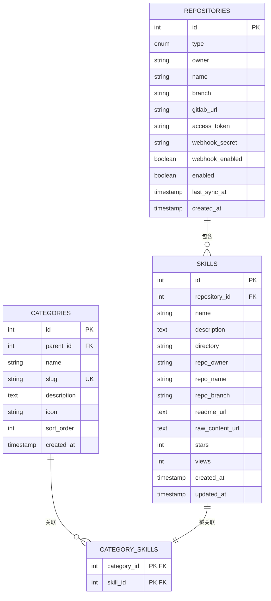
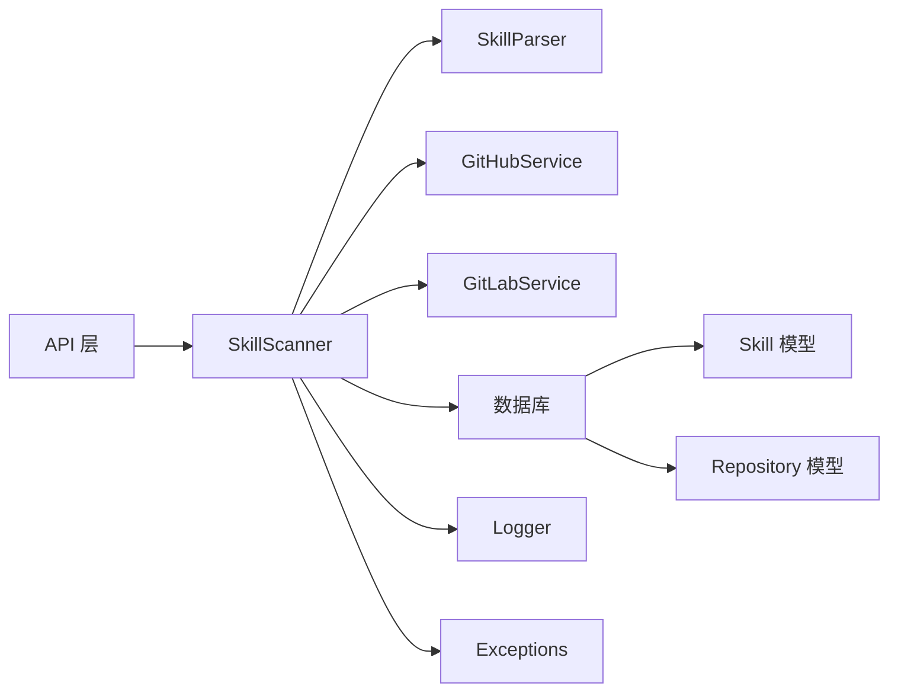

# 技能扫描服务

<cite>
**本文引用的文件**
- [backend/services/scanner.py](file://backend/services/scanner.py)
- [backend/services/parser.py](file://backend/services/parser.py)
- [backend/services/github.py](file://backend/services/github.py)
- [backend/services/gitlab.py](file://backend/services/gitlab.py)
- [backend/models/skill.py](file://backend/models/skill.py)
- [backend/models/repository.py](file://backend/models/repository.py)
- [backend/schemas/skill.py](file://backend/schemas/skill.py)
- [backend/api/sync.py](file://backend/api/sync.py)
- [backend/database.py](file://backend/database.py)
- [backend/main.py](file://backend/main.py)
- [backend/core/logger.py](file://backend/core/logger.py)
- [backend/core/exceptions.py](file://backend/core/exceptions.py)
- [backend/schema.sql](file://backend/schema.sql)
- [README.md](file://README.md)
</cite>

## 目录
1. [简介](#简介)
2. [项目结构](#项目结构)
3. [核心组件](#核心组件)
4. [架构总览](#架构总览)
5. [详细组件分析](#详细组件分析)
6. [依赖关系分析](#依赖关系分析)
7. [性能考虑](#性能考虑)
8. [故障排查指南](#故障排查指南)
9. [结论](#结论)
10. [附录](#附录)

## 简介
本文件面向“技能扫描服务”的技术实现，围绕以下目标展开：
- 仓库文件扫描、SKILL.md 文件发现与内容提取
- 文件系统遍历算法、过滤规则与目录结构处理
- 异步扫描机制、并发控制与内存优化策略
- 扫描进度跟踪、错误恢复与超时处理
- 扫描配置示例、性能监控与调试方法
- 扩展接口、自定义扫描规则与批量处理能力
- 与数据库的交互方式与数据持久化策略

该服务通过扫描 GitHub/GitLab 仓库中的每个目录，定位并解析 SKILL.md 文件，抽取元数据后与数据库进行比对、合并，最终完成技能条目的新增、更新与删除。

## 项目结构
后端采用 FastAPI + SQLAlchemy Async + MySQL 的架构，扫描服务位于 backend/services/scanner.py，配合解析器、GitHub/GitLab 下载服务、模型与 API 路由共同工作。

图表来源
- [backend/api/sync.py](file://backend/api/sync.py#L1-L112)
- [backend/services/scanner.py](file://backend/services/scanner.py#L1-L197)
- [backend/services/parser.py](file://backend/services/parser.py#L1-L86)
- [backend/services/github.py](file://backend/services/github.py#L1-L105)
- [backend/services/gitlab.py](file://backend/services/gitlab.py#L1-L170)
- [backend/database.py](file://backend/database.py#L1-L75)
- [backend/models/skill.py](file://backend/models/skill.py#L1-L90)
- [backend/models/repository.py](file://backend/models/repository.py#L1-L74)
- [backend/schemas/skill.py](file://backend/schemas/skill.py#L1-L60)
- [backend/core/logger.py](file://backend/core/logger.py#L1-L95)
- [backend/core/exceptions.py](file://backend/core/exceptions.py#L1-L101)

章节来源
- [backend/main.py](file://backend/main.py#L1-L137)
- [README.md](file://README.md#L1-L173)

## 核心组件
- 扫描服务（SkillScanner）：负责下载仓库、遍历目录、发现 SKILL.md、解析元数据、与数据库同步。
- 解析器（SkillParser）：解析 SKILL.md 的 YAML Front Matter，提取 name/description/tags。
- GitHub/GitLab 服务：提供仓库归档下载与 URL 构造。
- 数据模型（Repository/Skill）：定义仓库与技能的数据结构及关联关系。
- API（/api/admin/sync）：提供单仓库同步、全量同步与状态查询。
- 数据库（SQLAlchemy Async + MySQL）：异步连接、连接池与事务管理。
- 日志与异常：统一日志输出与异常类型。

章节来源
- [backend/services/scanner.py](file://backend/services/scanner.py#L21-L197)
- [backend/services/parser.py](file://backend/services/parser.py#L13-L86)
- [backend/services/github.py](file://backend/services/github.py#L14-L105)
- [backend/services/gitlab.py](file://backend/services/gitlab.py#L15-L170)
- [backend/models/repository.py](file://backend/models/repository.py#L18-L74)
- [backend/models/skill.py](file://backend/models/skill.py#L11-L90)
- [backend/api/sync.py](file://backend/api/sync.py#L1-L112)
- [backend/database.py](file://backend/database.py#L20-L56)
- [backend/core/logger.py](file://backend/core/logger.py#L11-L70)
- [backend/core/exceptions.py](file://backend/core/exceptions.py#L7-L101)

## 架构总览
扫描流程分为“下载 → 遍历 → 解析 → 同步”四个阶段，贯穿异步 I/O 与数据库事务。

图表来源
- [backend/api/sync.py](file://backend/api/sync.py#L17-L32)
- [backend/services/scanner.py](file://backend/services/scanner.py#L27-L156)
- [backend/services/github.py](file://backend/services/github.py#L36-L102)
- [backend/services/gitlab.py](file://backend/services/gitlab.py#L46-L165)
- [backend/services/parser.py](file://backend/services/parser.py#L18-L70)
- [backend/database.py](file://backend/database.py#L42-L56)

## 详细组件分析

### 扫描服务（SkillScanner）
职责与流程
- 下载仓库：根据仓库类型调用 GitHub 或 GitLab 服务，下载归档并解压到临时目录。
- 遍历目录：使用 os.walk 遍历解压后的目录，跳过以“.”开头的隐藏目录。
- 发现与解析：若目录包含 SKILL.md，则解析其 YAML Front Matter，生成 SkillMetadata。
- 同步数据库：对比数据库中已存在的技能，执行新增、更新、删除，并记录变更统计。
- URL 构建：为每个技能构建 README 与原始内容 URL，便于前端展示。

关键实现要点
- 异步下载与解压：使用 httpx.AsyncClient 与 aiofiles 进行异步 I/O。
- 目录过滤：dirs[:] = [...] 在遍历时直接修改，避免递归进入隐藏目录。
- 元数据映射：将解析得到的 name/description/tags 映射到 SchemaSkillMetadata。
- 事务一致性：使用 SQLAlchemy AsyncSession 的 commit/rollback 确保原子性。
- 错误处理：捕获外部服务异常并抛出自定义 ExternalServiceError。

图表来源
- [backend/services/scanner.py](file://backend/services/scanner.py#L27-L156)
- [backend/services/parser.py](file://backend/services/parser.py#L18-L70)

章节来源
- [backend/services/scanner.py](file://backend/services/scanner.py#L21-L197)

### 解析器（SkillParser）
职责与流程
- 从文件路径读取 SKILL.md 内容，匹配 YAML Front Matter（三短横线分隔）。
- 使用 yaml.safe_load 解析元数据，返回 SkillMetadata 对象。
- 若 Front Matter 缺失或解析失败，返回空元数据对象，避免中断扫描。

复杂度与性能
- 时间复杂度：O(n)，n 为 SKILL.md 文件大小；正则匹配与 YAML 解析均为线性。
- 内存占用：一次性读取文件内容，适合中小型 Markdown 文件。

章节来源
- [backend/services/parser.py](file://backend/services/parser.py#L13-L86)
- [backend/schemas/skill.py](file://backend/schemas/skill.py#L54-L60)

### GitHub/GitLab 服务
职责与流程
- 提供归档下载 URL 与原始文件 URL 构造。
- GitHub：使用归档 ZIP，支持访问令牌鉴权。
- GitLab：优先尝试 ZIP，失败时回退到 tar.gz，支持 PRIVATE-TOKEN 鉴权。
- 超时控制：httpx.AsyncClient 设置 timeout=60 秒，防止长时间阻塞。

错误处理
- HTTP 状态码异常转换为 ExternalServiceError，便于上层统一处理。

章节来源
- [backend/services/github.py](file://backend/services/github.py#L14-L105)
- [backend/services/gitlab.py](file://backend/services/gitlab.py#L15-L170)
- [backend/core/exceptions.py](file://backend/core/exceptions.py#L91-L101)

### 数据模型与数据库交互
数据模型
- Repository：仓库基本信息（类型、所有者、名称、分支、GitLab 地址、令牌、Webhook 等），与 Skill 一对多。
- Skill：技能信息（名称、描述、目录路径、仓库归属、URL、统计字段等），与 Category 多对多。

数据库配置
- 异步引擎与会话工厂：连接池大小与溢出连接数可控，pre_ping 健康检查。
- 依赖注入：get_db 提供请求级会话，自动 commit/rollback/close。
- 初始化脚本：schema.sql 提供完整的表结构与索引，含全文索引用于搜索。

图表来源
- [backend/models/repository.py](file://backend/models/repository.py#L18-L74)
- [backend/models/skill.py](file://backend/models/skill.py#L11-L90)
- [backend/schema.sql](file://backend/schema.sql#L22-L84)

章节来源
- [backend/models/repository.py](file://backend/models/repository.py#L12-L74)
- [backend/models/skill.py](file://backend/models/skill.py#L11-L90)
- [backend/database.py](file://backend/database.py#L20-L56)
- [backend/schema.sql](file://backend/schema.sql#L1-L106)

### API 层（同步）
- 单仓库同步：POST /api/admin/sync/{repo_id}，返回 SyncResponse。
- 全量同步：POST /api/admin/sync/all，逐个同步启用的仓库，聚合结果。
- 状态查询：GET /api/admin/sync/status，统计总数、已同步数与最近同步仓库。

并发与后台任务
- 当前实现为同步调用；如需异步，可在 API 中引入 BackgroundTasks 将扫描逻辑放入后台队列。

章节来源
- [backend/api/sync.py](file://backend/api/sync.py#L17-L112)

## 依赖关系分析
组件耦合与协作
- SkillScanner 依赖 GitHub/GitLab 服务进行下载，依赖 SkillParser 进行内容解析，依赖数据库进行 CRUD。
- API 层仅作为入口，不直接操作数据，通过依赖注入获取 AsyncSession。
- 日志与异常模块为通用基础设施，被各服务共享。

图表来源
- [backend/api/sync.py](file://backend/api/sync.py#L1-L112)
- [backend/services/scanner.py](file://backend/services/scanner.py#L1-L197)
- [backend/services/parser.py](file://backend/services/parser.py#L1-L86)
- [backend/services/github.py](file://backend/services/github.py#L1-L105)
- [backend/services/gitlab.py](file://backend/services/gitlab.py#L1-L170)
- [backend/database.py](file://backend/database.py#L1-L75)
- [backend/models/skill.py](file://backend/models/skill.py#L1-L90)
- [backend/models/repository.py](file://backend/models/repository.py#L1-L74)
- [backend/core/logger.py](file://backend/core/logger.py#L1-L95)
- [backend/core/exceptions.py](file://backend/core/exceptions.py#L1-L101)

## 性能考虑
- 异步 I/O：httpx.AsyncClient 与 aiofiles 降低网络与磁盘 I/O 阻塞。
- 连接池：数据库连接池大小与溢出连接数可调，满足高并发场景。
- 遍历优化：os.walk 遍历过程中直接过滤隐藏目录，减少无效访问。
- 内存优化：解析器一次性读取文件，建议控制 SKILL.md 文件大小与嵌套层级。
- 并发控制：当前 API 为同步调用；建议引入队列与后台任务实现批量扫描与限流。
- 超时与重试：外部服务调用设置超时，异常转换为统一错误类型，便于上层处理。

章节来源
- [backend/services/github.py](file://backend/services/github.py#L69-L102)
- [backend/services/gitlab.py](file://backend/services/gitlab.py#L81-L165)
- [backend/database.py](file://backend/database.py#L20-L36)
- [backend/services/scanner.py](file://backend/services/scanner.py#L49-L68)

## 故障排查指南
常见问题与处理
- 外部服务错误：GitHub/GitLab 下载失败或归档格式异常，抛出 ExternalServiceError，检查令牌、URL 与网络连通性。
- 权限不足：私有仓库需正确配置 access_token。
- 数据库连接失败：检查 DATABASE_URL、连接池配置与数据库可用性。
- SKILL.md 格式错误：Front Matter 缺失或 YAML 解析失败时返回空元数据，检查 YAML 语法与三短横线分隔符。
- 日志定位：使用 core/logger 模块输出 INFO/ERROR 级别日志，结合 logs/skills.log 与 logs/error.log 定位问题。

章节来源
- [backend/core/exceptions.py](file://backend/core/exceptions.py#L91-L101)
- [backend/core/logger.py](file://backend/core/logger.py#L11-L70)
- [backend/services/github.py](file://backend/services/github.py#L69-L102)
- [backend/services/gitlab.py](file://backend/services/gitlab.py#L81-L165)

## 结论
技能扫描服务通过清晰的职责划分与异步 I/O 设计，实现了对 GitHub/GitLab 仓库的高效扫描与同步。其核心在于：
- 稳健的文件系统遍历与过滤规则
- 可靠的 SKILL.md 解析与元数据映射
- 与数据库的幂等同步与事务保障
- 可扩展的外部服务与统一异常处理

未来可进一步增强：
- 引入后台任务与队列实现批量与并发扫描
- 增加扫描进度上报与断点续传
- 支持更丰富的扫描规则与自定义解析器
- 完善性能监控与告警机制

## 附录

### 扫描配置示例
- 仓库配置：在 repositories 表中添加仓库，指定类型、所有者、名称、分支、可选的 GitLab 地址与访问令牌。
- 环境变量：DATABASE_URL、JWT_SECRET_KEY、ENCRYPTION_KEY 等。
- API 使用：调用 /api/admin/sync/{repo_id} 进行单仓库同步；/api/admin/sync/all 进行全量同步；/api/admin/sync/status 查询状态。

章节来源
- [backend/schema.sql](file://backend/schema.sql#L22-L38)
- [README.md](file://README.md#L112-L155)
- [backend/api/sync.py](file://backend/api/sync.py#L17-L112)

### 扩展接口与自定义规则
- 扩展扫描规则：可在 SkillParser 中增加新的字段解析或校验逻辑。
- 自定义解析器：新增解析器类，遵循相同的 parse_file/parse_content 接口，替换或并行使用。
- 批量处理：在 API 层引入后台任务，将扫描逻辑放入队列，实现限流与重试。

章节来源
- [backend/services/parser.py](file://backend/services/parser.py#L13-L86)
- [backend/api/sync.py](file://backend/api/sync.py#L35-L71)

### 数据持久化策略
- 事务边界：每次同步在一个事务内完成，确保一致性。
- 增量更新：通过目录路径与元数据比对，仅在字段变化时更新 updated_at。
- 清理策略：删除不再存在的目录对应的技能记录，保持与仓库一致。

章节来源
- [backend/services/scanner.py](file://backend/services/scanner.py#L86-L156)
- [backend/models/skill.py](file://backend/models/skill.py#L11-L90)