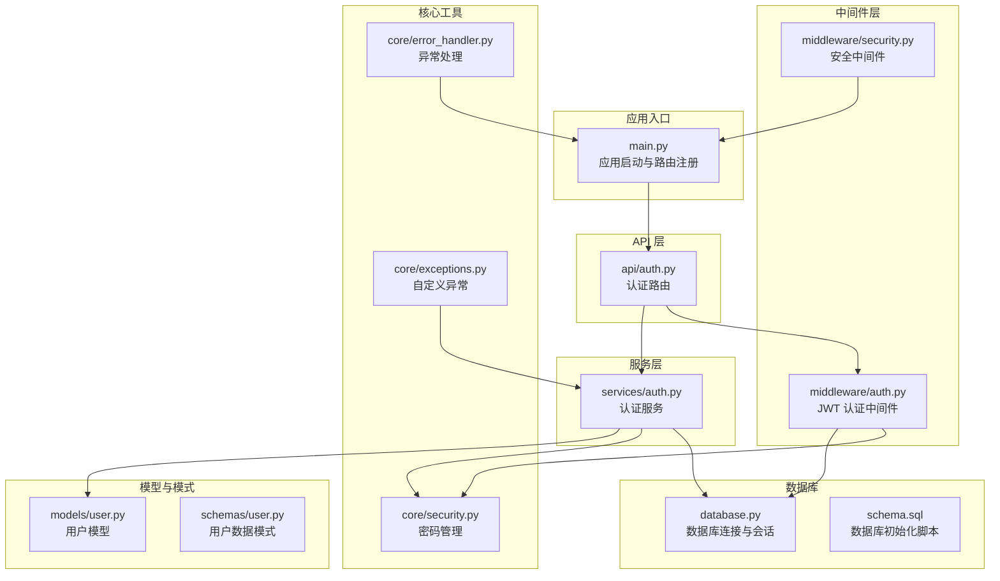
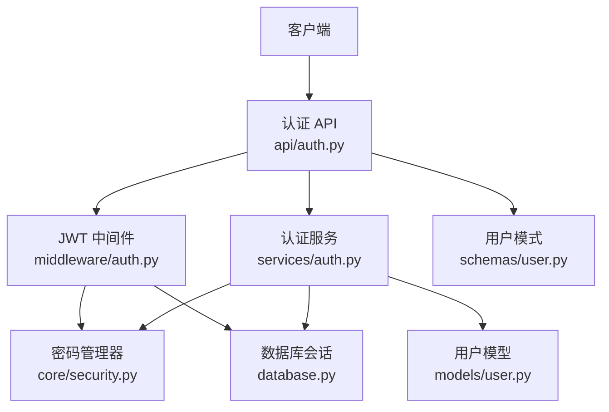
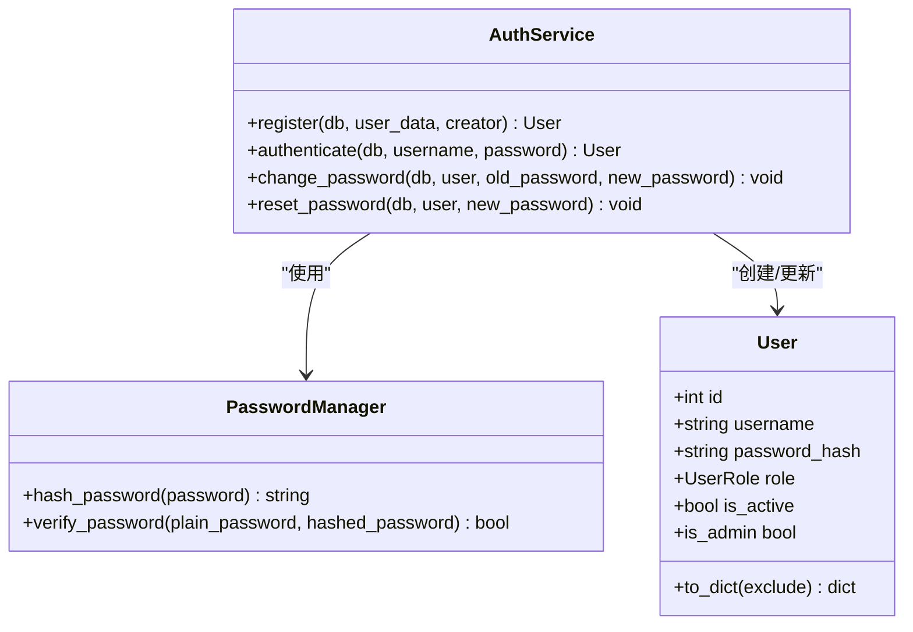
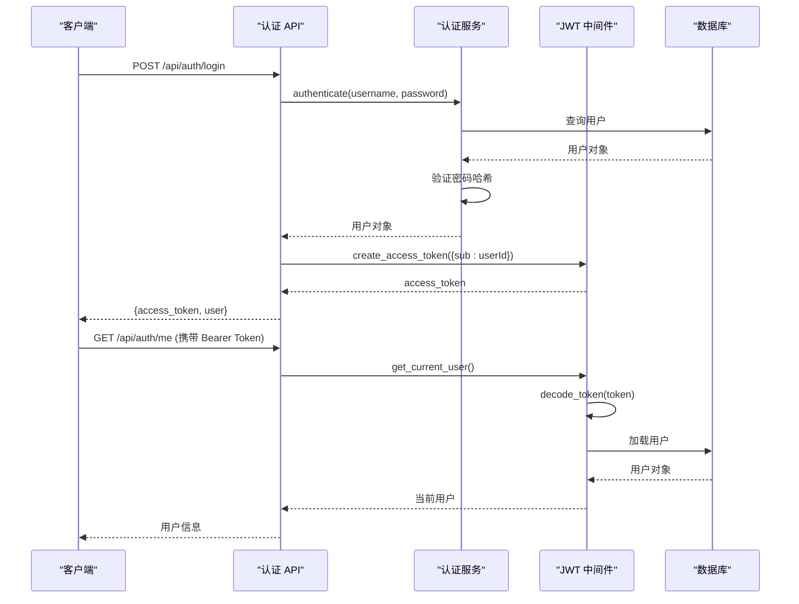
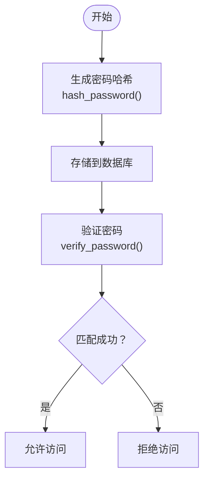
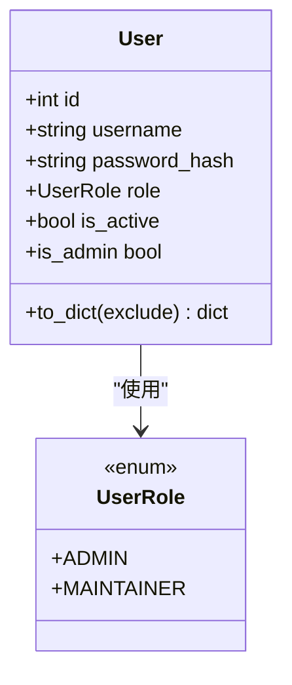
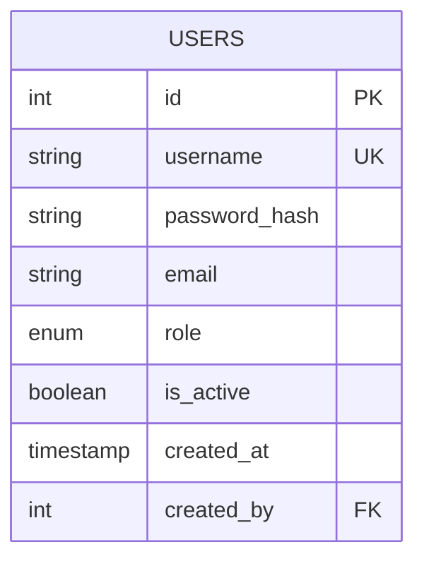
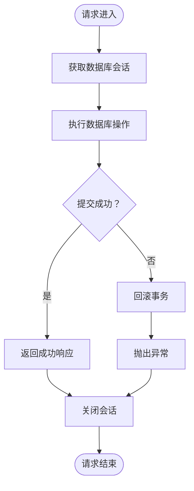
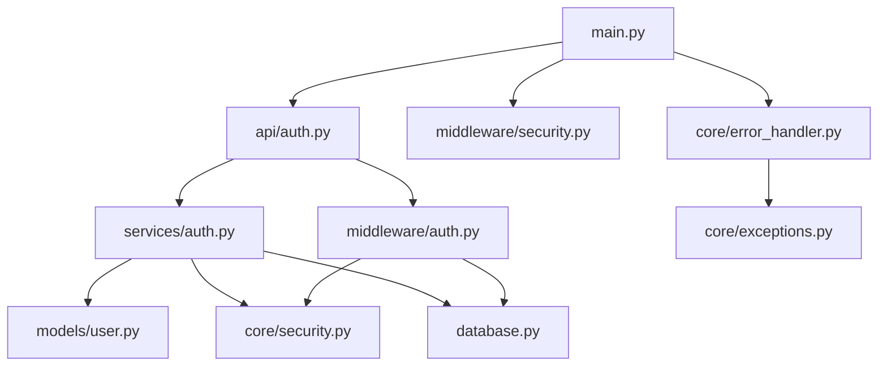

# 用户认证服务

<cite>
**本文档引用的文件**
- [backend/main.py](file://backend/main.py)
- [backend/api/auth.py](file://backend/api/auth.py)
- [backend/services/auth.py](file://backend/services/auth.py)
- [backend/middleware/auth.py](file://backend/middleware/auth.py)
- [backend/models/user.py](file://backend/models/user.py)
- [backend/schemas/user.py](file://backend/schemas/user.py)
- [backend/database.py](file://backend/database.py)
- [backend/core/security.py](file://backend/core/security.py)
- [backend/core/error_handler.py](file://backend/core/error_handler.py)
- [backend/middleware/security.py](file://backend/middleware/security.py)
- [backend/core/exceptions.py](file://backend/core/exceptions.py)
- [backend/.env.example](file://backend/.env.example)
- [backend/schema.sql](file://backend/schema.sql)
</cite>

## 目录
1. [简介](#简介)
2. [项目结构](#项目结构)
3. [核心组件](#核心组件)
4. [架构概览](#架构概览)
5. [详细组件分析](#详细组件分析)
6. [依赖关系分析](#依赖关系分析)
7. [性能考虑](#性能考虑)
8. [故障排除指南](#故障排除指南)
9. [结论](#结论)
10. [附录](#附录)

## 简介
本文件详细说明用户认证服务的设计与实现，涵盖用户注册、登录验证、密码管理、权限控制等核心功能。文档重点解析以下方面：
- 密码哈希机制：采用 Argon2 算法进行安全的密码存储与校验
- JWT 令牌生成与验证：基于 HS256 算法的令牌签发与解析
- 用户角色管理与权限检查：通过中间件实现基于角色的访问控制（RBAC）
- 数据库模型交互：基于 SQLAlchemy 的异步 ORM 操作与事务管理
- 安全最佳实践：速率限制、CORS、安全响应头、异常处理等
- 测试方法与性能优化建议

## 项目结构
后端采用分层架构，主要目录与职责如下：
- backend/api：FastAPI 路由层，定义认证相关接口
- backend/services：业务逻辑层，封装认证服务与领域逻辑
- backend/middleware：中间件层，提供 JWT 认证、安全头、速率限制等功能
- backend/models：ORM 模型层，定义用户表结构与枚举类型
- backend/schemas：Pydantic 数据模式，负责输入输出数据验证
- backend/core：核心工具与异常处理，包括密码管理、安全工具、错误处理器
- backend/database.py：数据库连接与会话管理
- backend/schema.sql：数据库初始化脚本，包含用户表结构与索引

**图表来源**
- [backend/main.py](file://backend/main.py#L47-L84)
- [backend/api/auth.py](file://backend/api/auth.py#L21-L48)
- [backend/services/auth.py](file://backend/services/auth.py#L19-L62)
- [backend/middleware/auth.py](file://backend/middleware/auth.py#L25-L95)
- [backend/models/user.py](file://backend/models/user.py#L18-L51)
- [backend/schemas/user.py](file://backend/schemas/user.py#L14-L95)
- [backend/database.py](file://backend/database.py#L42-L55)
- [backend/core/security.py](file://backend/core/security.py#L12-L58)
- [backend/core/error_handler.py](file://backend/core/error_handler.py#L14-L101)
- [backend/middleware/security.py](file://backend/middleware/security.py#L11-L141)
- [backend/core/exceptions.py](file://backend/core/exceptions.py#L7-L100)
- [backend/schema.sql](file://backend/schema.sql#L7-L20)

**章节来源**
- [backend/main.py](file://backend/main.py#L47-L84)
- [backend/api/auth.py](file://backend/api/auth.py#L21-L48)
- [backend/services/auth.py](file://backend/services/auth.py#L19-L62)
- [backend/middleware/auth.py](file://backend/middleware/auth.py#L25-L95)
- [backend/models/user.py](file://backend/models/user.py#L18-L51)
- [backend/schemas/user.py](file://backend/schemas/user.py#L14-L95)
- [backend/database.py](file://backend/database.py#L42-L55)
- [backend/core/security.py](file://backend/core/security.py#L12-L58)
- [backend/core/error_handler.py](file://backend/core/error_handler.py#L14-L101)
- [backend/middleware/security.py](file://backend/middleware/security.py#L11-L141)
- [backend/core/exceptions.py](file://backend/core/exceptions.py#L7-L100)
- [backend/schema.sql](file://backend/schema.sql#L7-L20)

## 核心组件
本节深入分析认证系统的核心组件及其职责与交互。

- 认证服务（AuthService）
  - 提供用户注册、登录验证、密码修改与重置等业务逻辑
  - 使用密码管理器进行安全的密码哈希与校验
  - 通过数据库会话执行事务性操作，确保数据一致性

- JWT 认证中间件
  - 负责令牌的创建与解码，支持过期时间控制
  - 提供获取当前用户与管理员权限检查的依赖注入函数
  - 支持可选认证场景，便于公开接口与私有接口混合使用

- 密码管理器
  - 基于 Argon2 的密码哈希算法，避免传统 bcrypt 的长度限制问题
  - 提供密码哈希生成与验证方法，保障密码存储安全

- 数据库会话管理
  - 基于 SQLAlchemy 的异步会话工厂，支持连接池与自动回滚
  - 在 FastAPI 依赖注入中提供会话生命周期管理

- 安全中间件与异常处理
  - 提供安全响应头、请求日志与速率限制等安全措施
  - 统一异常处理，标准化错误响应格式

**章节来源**
- [backend/services/auth.py](file://backend/services/auth.py#L19-L126)
- [backend/middleware/auth.py](file://backend/middleware/auth.py#L25-L133)
- [backend/core/security.py](file://backend/core/security.py#L12-L58)
- [backend/database.py](file://backend/database.py#L42-L55)
- [backend/middleware/security.py](file://backend/middleware/security.py#L11-L141)
- [backend/core/error_handler.py](file://backend/core/error_handler.py#L14-L101)

## 架构概览
下图展示了认证服务的整体架构与组件交互关系：

**图表来源**
- [backend/api/auth.py](file://backend/api/auth.py#L24-L64)
- [backend/services/auth.py](file://backend/services/auth.py#L22-L98)
- [backend/middleware/auth.py](file://backend/middleware/auth.py#L25-L95)
- [backend/core/security.py](file://backend/core/security.py#L22-L28)
- [backend/database.py](file://backend/database.py#L42-L55)
- [backend/models/user.py](file://backend/models/user.py#L18-L51)
- [backend/schemas/user.py](file://backend/schemas/user.py#L14-L95)

## 详细组件分析

### 认证服务（AuthService）
AuthService 是认证系统的核心业务逻辑层，负责：
- 用户注册：检查用户名唯一性、验证创建者权限、生成密码哈希、写入数据库
- 登录验证：查询用户、检查账户状态、验证密码哈希、记录日志
- 密码管理：修改密码与管理员重置密码，均使用密码管理器进行哈希更新
- 权限控制：根据调用者角色限制管理员用户的创建

**图表来源**
- [backend/services/auth.py](file://backend/services/auth.py#L19-L126)
- [backend/core/security.py](file://backend/core/security.py#L12-L28)
- [backend/models/user.py](file://backend/models/user.py#L18-L51)

**章节来源**
- [backend/services/auth.py](file://backend/services/auth.py#L22-L126)
- [backend/core/security.py](file://backend/core/security.py#L12-L28)
- [backend/models/user.py](file://backend/models/user.py#L18-L51)

### JWT 令牌生成与验证流程
JWT 中间件提供令牌的创建与验证能力，并通过依赖注入在路由中使用：
- create_access_token：生成包含过期时间的 JWT 令牌
- decode_token：解码并验证令牌签名与有效期
- get_current_user：从令牌提取用户 ID 并加载用户对象，同时检查账户状态
- require_admin：要求用户具备管理员角色
- get_optional_user：可选认证，适合公开接口

**图表来源**
- [backend/api/auth.py](file://backend/api/auth.py#L24-L48)
- [backend/services/auth.py](file://backend/services/auth.py#L64-L98)
- [backend/middleware/auth.py](file://backend/middleware/auth.py#L25-L95)

**章节来源**
- [backend/middleware/auth.py](file://backend/middleware/auth.py#L25-L133)
- [backend/api/auth.py](file://backend/api/auth.py#L24-L48)

### 密码哈希机制
密码管理器采用 Argon2 算法，具有以下特点：
- 无固定长度限制：突破传统 bcrypt 的 72 字符限制
- 可配置成本参数：平衡安全性与性能
- 安全存储：仅保存哈希值，不存储明文密码

**图表来源**
- [backend/core/security.py](file://backend/core/security.py#L22-L28)
- [backend/services/auth.py](file://backend/services/auth.py#L50-L90)

**章节来源**
- [backend/core/security.py](file://backend/core/security.py#L12-L28)
- [backend/services/auth.py](file://backend/services/auth.py#L50-L90)

### 用户角色管理与权限控制
用户模型定义了角色枚举与辅助属性：
- UserRole：包含 ADMIN 与 MAINTAINER 两种角色
- is_admin：便捷判断管理员角色
- 数据库层面通过 ENUM 存储角色值

权限控制通过中间件实现：
- require_admin：在依赖注入中强制要求管理员角色
- get_current_user：检查令牌有效性与账户状态
- 可选认证：get_optional_user 支持匿名访问场景

**图表来源**
- [backend/models/user.py](file://backend/models/user.py#L12-L51)

**章节来源**
- [backend/models/user.py](file://backend/models/user.py#L12-L51)
- [backend/middleware/auth.py](file://backend/middleware/auth.py#L98-L108)

### 数据库模型与交互
用户表结构包含以下关键字段与约束：
- 主键与索引：id 主键，username 唯一索引
- 角色枚举：默认 MAINTAINER，支持 ADMIN
- 外键关系：created_by 指向 users.id（删除时设为空）
- 索引优化：role 与 username 字段建立索引

**图表来源**
- [backend/schema.sql](file://backend/schema.sql#L8-L20)
- [backend/models/user.py](file://backend/models/user.py#L23-L30)

**章节来源**
- [backend/schema.sql](file://backend/schema.sql#L8-L20)
- [backend/models/user.py](file://backend/models/user.py#L18-L30)

### 事务管理与并发控制
数据库会话管理采用异步 SQLAlchemy：
- 连接池：pool_size 与 max_overflow 控制连接数量
- 事务语义：commit/rollback 在依赖注入中自动处理
- 会话生命周期：每个请求创建新会话，结束后自动关闭

**图表来源**
- [backend/database.py](file://backend/database.py#L42-L55)

**章节来源**
- [backend/database.py](file://backend/database.py#L20-L55)

### 安全最佳实践
- 速率限制：对登录接口进行限流，防止暴力破解
- CORS 配置：开发环境允许任意来源，生产环境应限制具体域名
- 安全响应头：添加多种安全头，提升浏览器防护能力
- 异常处理：统一错误响应格式，隐藏内部实现细节
- 环境变量：JWT 密钥与加密密钥从环境变量读取，避免硬编码

**章节来源**
- [backend/middleware/security.py](file://backend/middleware/security.py#L11-L141)
- [backend/main.py](file://backend/main.py#L56-L68)
- [backend/core/error_handler.py](file://backend/core/error_handler.py#L14-L101)
- [backend/.env.example](file://backend/.env.example#L1-L17)

## 依赖关系分析
认证系统各组件之间的依赖关系如下：

**图表来源**
- [backend/api/auth.py](file://backend/api/auth.py#L17-L18)
- [backend/services/auth.py](file://backend/services/auth.py#L8-L16)
- [backend/middleware/auth.py](file://backend/middleware/auth.py#L13-L15)
- [backend/database.py](file://backend/database.py#L5-L7)
- [backend/main.py](file://backend/main.py#L24-L24)
- [backend/middleware/security.py](file://backend/middleware/security.py#L11-L141)
- [backend/core/error_handler.py](file://backend/core/error_handler.py#L14-L101)
- [backend/core/exceptions.py](file://backend/core/exceptions.py#L7-L100)

**章节来源**
- [backend/api/auth.py](file://backend/api/auth.py#L17-L18)
- [backend/services/auth.py](file://backend/services/auth.py#L8-L16)
- [backend/middleware/auth.py](file://backend/middleware/auth.py#L13-L15)
- [backend/database.py](file://backend/database.py#L5-L7)
- [backend/main.py](file://backend/main.py#L24-L24)
- [backend/middleware/security.py](file://backend/middleware/security.py#L11-L141)
- [backend/core/error_handler.py](file://backend/core/error_handler.py#L14-L101)
- [backend/core/exceptions.py](file://backend/core/exceptions.py#L7-L100)

## 性能考虑
- 密码哈希成本：Argon2 参数需根据硬件性能调整，平衡安全与性能
- 数据库连接池：合理设置 pool_size 与 max_overflow，避免连接争用
- 索引优化：为高频查询字段（如 username、role）建立索引
- 令牌过期：合理设置 ACCESS_TOKEN_EXPIRE_MINUTES，减少无效令牌占用
- 速率限制：针对登录接口设置限流，防止攻击与资源滥用
- 缓存策略：对用户信息等只读数据可引入缓存，降低数据库压力

## 故障排除指南
常见问题与排查步骤：
- 登录失败
  - 检查用户名是否存在与账户是否激活
  - 验证密码哈希是否正确
  - 查看异常处理器返回的错误详情
- 令牌无效或过期
  - 确认 JWT_SECRET_KEY 配置正确
  - 检查令牌是否过期
  - 验证算法与密钥一致
- 权限不足
  - 确认用户角色为 ADMIN
  - 检查 require_admin 依赖注入是否生效
- 数据库连接问题
  - 检查 DATABASE_URL 配置
  - 查看连接池状态与超时设置
- 速率限制触发
  - 检查客户端 IP 与请求频率
  - 调整限流阈值或等待冷却时间

**章节来源**
- [backend/services/auth.py](file://backend/services/auth.py#L76-L95)
- [backend/middleware/auth.py](file://backend/middleware/auth.py#L56-L93)
- [backend/core/error_handler.py](file://backend/core/error_handler.py#L14-L101)
- [backend/database.py](file://backend/database.py#L63-L69)
- [backend/middleware/security.py](file://backend/middleware/security.py#L115-L139)

## 结论
本认证服务通过清晰的分层设计与安全实践，提供了完整的用户注册、登录验证、密码管理与权限控制能力。JWT 令牌与 Argon2 密码哈希确保了认证过程的安全性；中间件与异常处理增强了系统的健壮性；数据库模型与事务管理保证了数据一致性。建议在生产环境中进一步强化密钥管理、监控告警与渗透测试，持续提升系统安全性与稳定性。

## 附录
- 环境变量配置参考：JWT_SECRET_KEY、ENCRYPTION_KEY、DATABASE_URL
- 数据库初始化脚本：schema.sql 包含用户表结构与索引定义
- 初始管理员账号：用户名 admin，密码为初始化脚本中提供的哈希值

**章节来源**
- [backend/.env.example](file://backend/.env.example#L1-L17)
- [backend/schema.sql](file://backend/schema.sql#L101-L105)