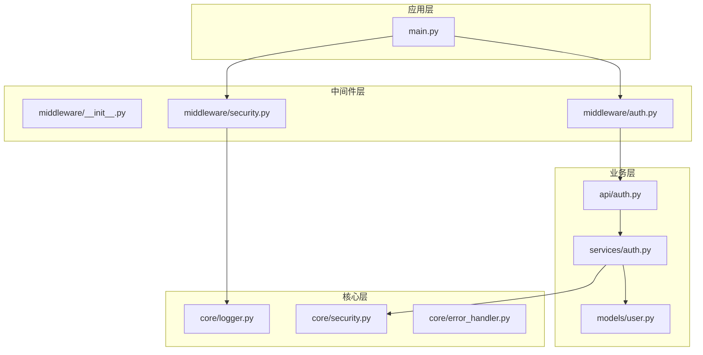
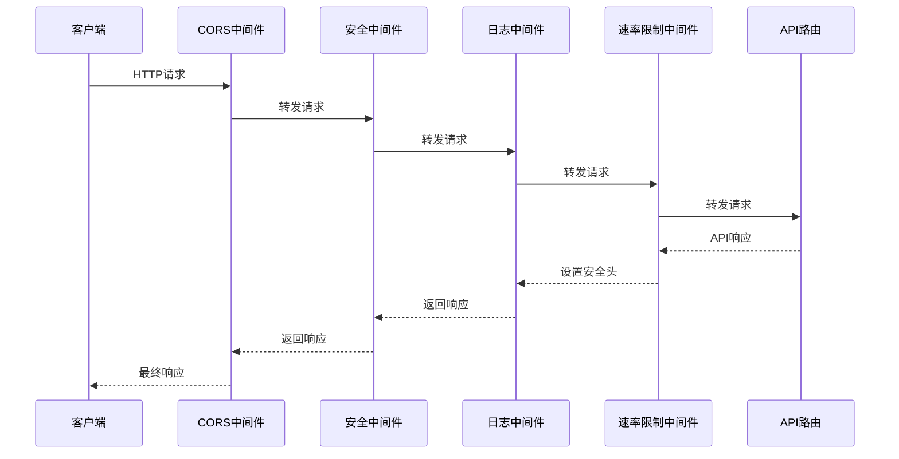
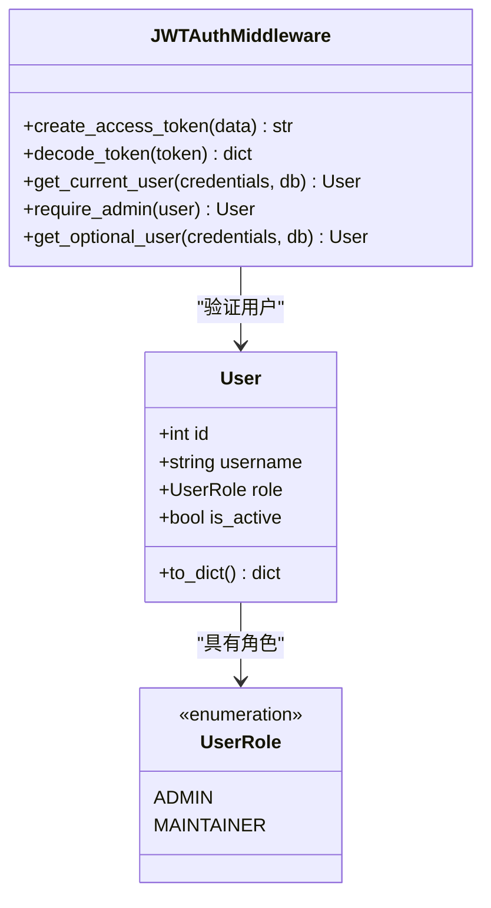
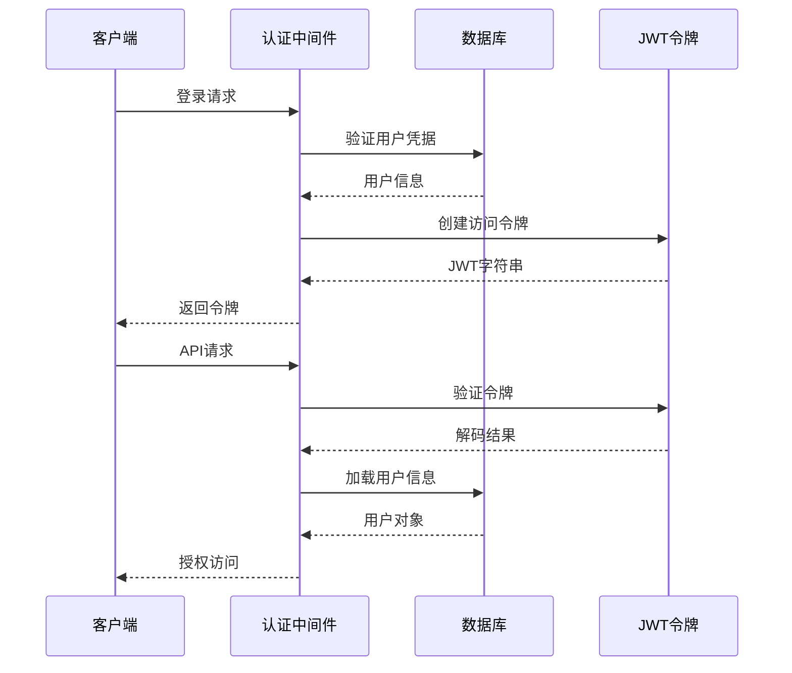
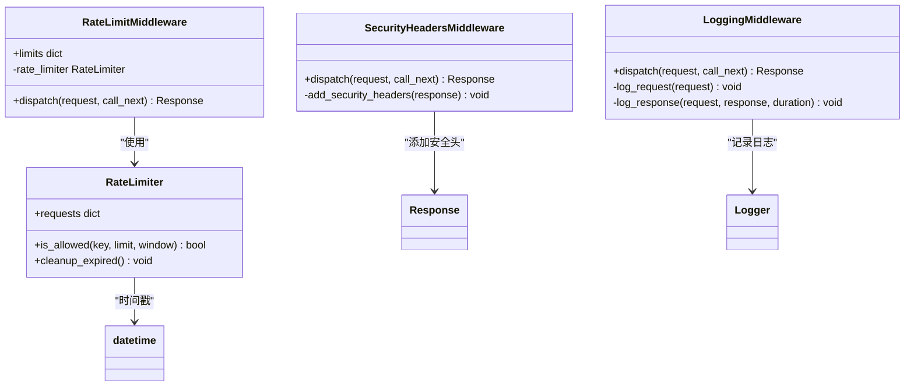
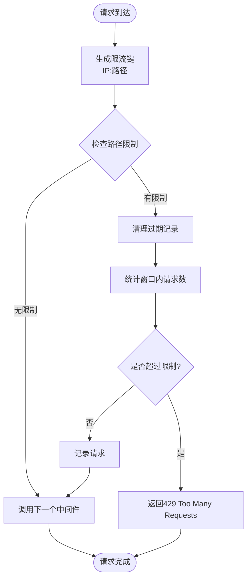
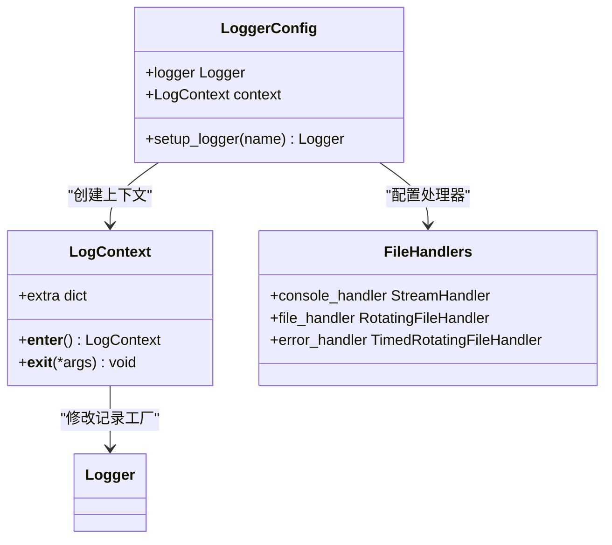
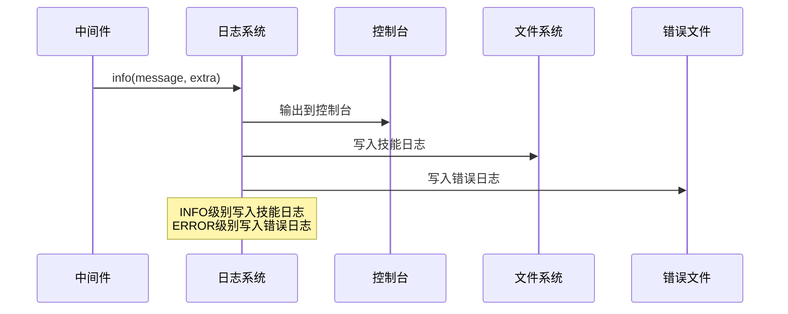
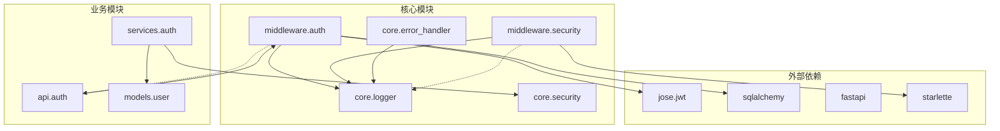

# 中间件系统

<cite>
**本文档引用的文件**
- [main.py](file://backend/main.py)
- [auth.py](file://backend/middleware/auth.py)
- [security.py](file://backend/middleware/security.py)
- [logger.py](file://backend/core/logger.py)
- [auth_api.py](file://backend/api/auth.py)
- [user_model.py](file://backend/models/user.py)
- [security_core.py](file://backend/core/security.py)
- [auth_service.py](file://backend/services/auth.py)
- [error_handler.py](file://backend/core/error_handler.py)
- [.env.example](file://backend/.env.example)
</cite>

## 目录
1. [简介](#简介)
2. [项目结构](#项目结构)
3. [核心组件](#核心组件)
4. [架构概览](#架构概览)
5. [详细组件分析](#详细组件分析)
6. [依赖关系分析](#依赖关系分析)
7. [性能考虑](#性能考虑)
8. [故障排除指南](#故障排除指南)
9. [结论](#结论)

## 简介

本项目实现了完整的 FastAPI 中间件系统，包括认证中间件、安全中间件和日志中间件。该系统采用分层架构设计，通过中间件链路实现请求的统一处理和响应的拦截机制。系统支持 JWT 令牌验证、权限检查、安全策略实施、日志记录、审计跟踪和监控指标收集等功能。

## 项目结构

中间件系统位于 `backend/middleware/` 目录下，与核心功能模块分离，遵循了关注点分离的设计原则：

**图表来源**
- [main.py](file://backend/main.py#L20-L68)
- [auth.py](file://backend/middleware/auth.py#L1-L134)
- [security.py](file://backend/middleware/security.py#L1-L142)

**章节来源**
- [main.py](file://backend/main.py#L1-L137)
- [auth.py](file://backend/middleware/auth.py#L1-L134)
- [security.py](file://backend/middleware/security.py#L1-L142)

## 核心组件

### 认证中间件

认证中间件实现了基于 JWT 的用户身份验证机制，提供以下核心功能：

- **JWT 令牌创建和验证**：使用 HS256 算法进行令牌签名和验证
- **用户会话管理**：通过依赖注入提供当前用户信息
- **权限控制**：支持管理员权限检查
- **可选认证**：支持匿名访问场景

### 安全中间件

安全中间件提供了多层安全防护：

- **安全响应头**：设置 X-Content-Type-Options、X-Frame-Options、X-XSS-Protection、Strict-Transport-Security 和 Content-Security-Policy
- **请求日志记录**：记录请求方法、路径和客户端信息
- **响应时间监控**：计算并记录请求处理时间
- **速率限制**：基于内存的简单速率限制器

### 日志中间件

日志中间件实现了结构化的日志记录系统：

- **多级日志输出**：控制台、文件轮转和错误日志分离
- **上下文信息**：支持动态添加日志上下文
- **性能监控**：记录请求处理时间和状态码

**章节来源**
- [auth.py](file://backend/middleware/auth.py#L1-L134)
- [security.py](file://backend/middleware/security.py#L1-L142)
- [logger.py](file://backend/core/logger.py#L1-L95)

## 架构概览

中间件系统采用 FastAPI 的中间件机制，按照注册顺序执行：

**图表来源**
- [main.py](file://backend/main.py#L56-L68)
- [security.py](file://backend/middleware/security.py#L11-L28)

### 执行顺序分析

中间件的执行顺序严格遵循注册顺序：

1. **CORS 中间件**：处理跨域请求
2. **安全中间件**：添加安全响应头
3. **日志中间件**：记录请求和响应信息
4. **速率限制中间件**：执行请求限制检查

**章节来源**
- [main.py](file://backend/main.py#L56-L68)

## 详细组件分析

### 认证中间件实现

认证中间件的核心实现包括 JWT 令牌管理和用户权限验证：

**图表来源**
- [auth.py](file://backend/middleware/auth.py#L25-L95)
- [user_model.py](file://backend/models/user.py#L12-L52)

#### JWT 令牌流程

**图表来源**
- [auth.py](file://backend/middleware/auth.py#L25-L95)
- [auth_api.py](file://backend/api/auth.py#L24-L40)

#### 权限检查机制

权限检查通过依赖注入实现，支持多种权限级别：

- **普通用户权限**：`get_current_user` 依赖
- **管理员权限**：`require_admin` 依赖  
- **可选用户权限**：`get_optional_user` 依赖

**章节来源**
- [auth.py](file://backend/middleware/auth.py#L48-L134)
- [user_model.py](file://backend/models/user.py#L12-L52)

### 安全中间件实现

安全中间件提供了多层次的安全防护：

**图表来源**
- [security.py](file://backend/middleware/security.py#L11-L142)

#### 速率限制算法

**图表来源**
- [security.py](file://backend/middleware/security.py#L66-L101)

**章节来源**
- [security.py](file://backend/middleware/security.py#L11-L142)

### 日志中间件实现

日志中间件实现了结构化的日志记录系统：

**图表来源**
- [logger.py](file://backend/core/logger.py#L11-L95)

#### 日志记录流程

**图表来源**
- [logger.py](file://backend/core/logger.py#L44-L64)

**章节来源**
- [logger.py](file://backend/core/logger.py#L1-L95)

## 依赖关系分析

中间件系统与其他模块的依赖关系如下：

**图表来源**
- [auth.py](file://backend/middleware/auth.py#L4-L15)
- [security.py](file://backend/middleware/security.py#L4-L8)
- [main.py](file://backend/main.py#L20-L24)

### 关键依赖分析

1. **JWT 依赖**：使用 `jose` 库进行 JWT 编码和解码
2. **数据库依赖**：通过 SQLAlchemy 进行用户数据查询
3. **FastAPI 依赖**：利用 FastAPI 的依赖注入机制
4. **日志依赖**：使用 Python 标准库 logging 模块

**章节来源**
- [auth.py](file://backend/middleware/auth.py#L4-L15)
- [security.py](file://backend/middleware/security.py#L4-L8)
- [main.py](file://backend/main.py#L20-L24)

## 性能考虑

### 中间件性能特征

| 中间件类型 | 处理时间 | 内存占用 | 并发支持 |
|------------|----------|----------|----------|
| CORS中间件 | 微秒级 | 低 | 高 |
| 安全中间件 | 微秒级 | 低 | 高 |
| 日志中间件 | 微秒级 | 低 | 高 |
| 速率限制 | 微秒级 | 低 | 高 |

### 优化建议

1. **缓存策略**：在高并发场景下考虑引入 Redis 缓存
2. **异步处理**：将日志写入操作异步化
3. **配置优化**：根据实际负载调整限流参数
4. **资源管理**：优化数据库连接池配置

### 性能监控指标

- **请求延迟**：平均响应时间、P95/P99 延迟
- **吞吐量**：每秒请求数
- **错误率**：4xx/5xx 错误比例
- **资源使用**：CPU、内存、磁盘 I/O

## 故障排除指南

### 常见问题及解决方案

#### JWT 令牌问题

**问题**：令牌验证失败
- **原因**：密钥不匹配或令牌过期
- **解决方案**：检查 `.env` 文件中的 `JWT_SECRET_KEY` 配置

**问题**：用户找不到
- **原因**：数据库中用户不存在
- **解决方案**：确认用户已正确创建且状态正常

#### 速率限制问题

**问题**：频繁收到 429 错误
- **原因**：超出限流阈值
- **解决方案**：调整 `limits` 配置或增加时间窗口

#### 日志记录问题

**问题**：日志文件未生成
- **原因**：日志目录权限问题
- **解决方案**：确保 `logs/` 目录可写

**章节来源**
- [auth.py](file://backend/middleware/auth.py#L40-L45)
- [security.py](file://backend/middleware/security.py#L129-L138)
- [logger.py](file://backend/core/logger.py#L40-L42)

### 调试技巧

1. **启用调试模式**：设置 `DEBUG=True` 环境变量
2. **查看日志**：检查 `logs/skills.log` 和 `logs/error.log`
3. **单元测试**：编写针对中间件行为的测试用例
4. **性能分析**：使用性能分析工具识别瓶颈

## 结论

本中间件系统实现了完整的请求处理链路，提供了认证、安全和日志三大核心功能。系统采用模块化设计，具有良好的可扩展性和维护性。通过合理的配置和优化，可以满足大多数 Web 应用的安全和性能需求。

### 设计优势

- **模块化架构**：中间件功能独立，便于维护和测试
- **安全性优先**：内置多种安全防护措施
- **可观测性**：完善的日志和监控机制
- **性能优化**：异步处理和高效的算法实现

### 改进建议

1. **增强限流机制**：从内存存储迁移到 Redis
2. **添加监控集成**：集成 Prometheus 或类似监控系统
3. **完善测试覆盖**：增加中间件的单元测试和集成测试
4. **文档完善**：补充详细的配置和使用文档