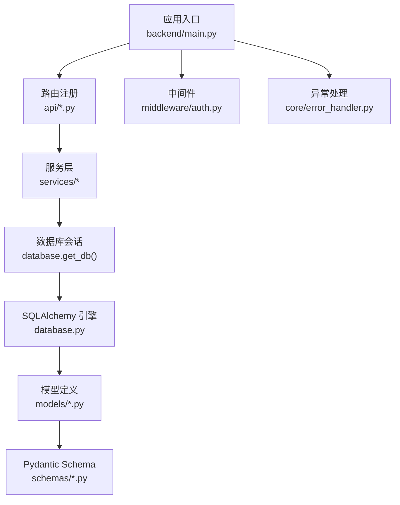
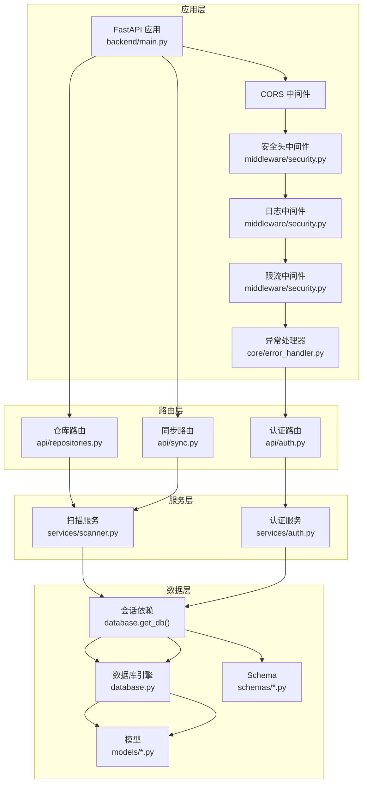
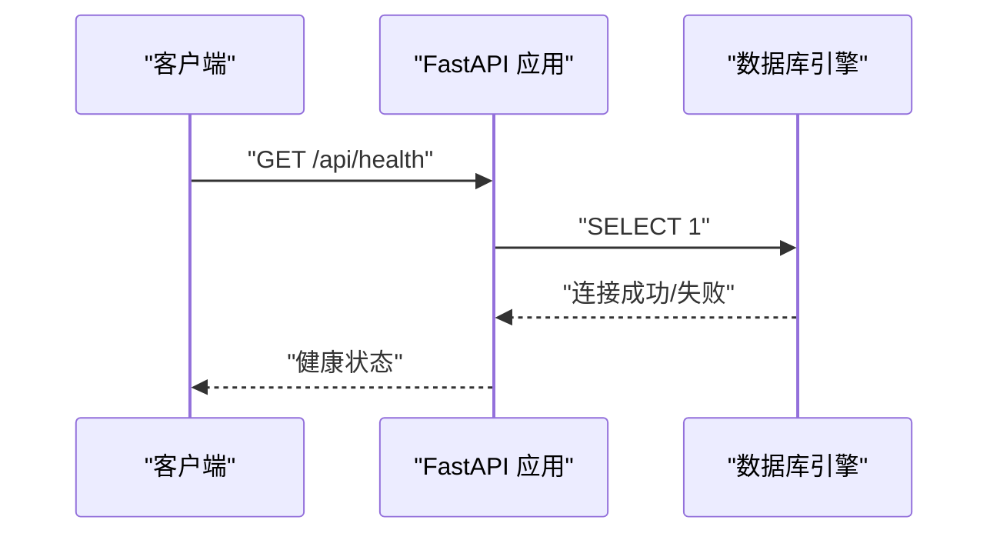
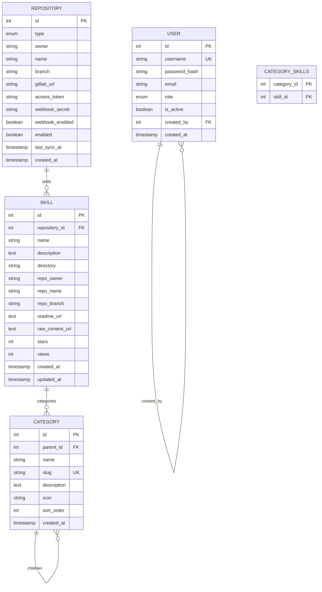
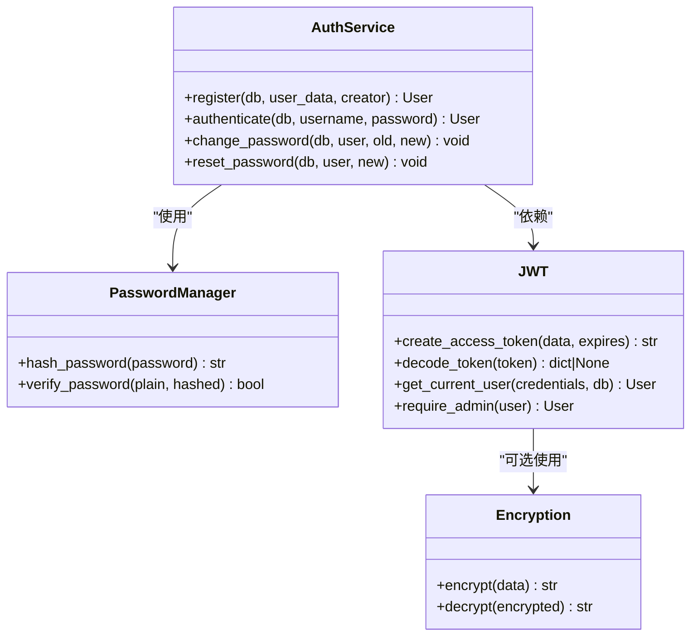
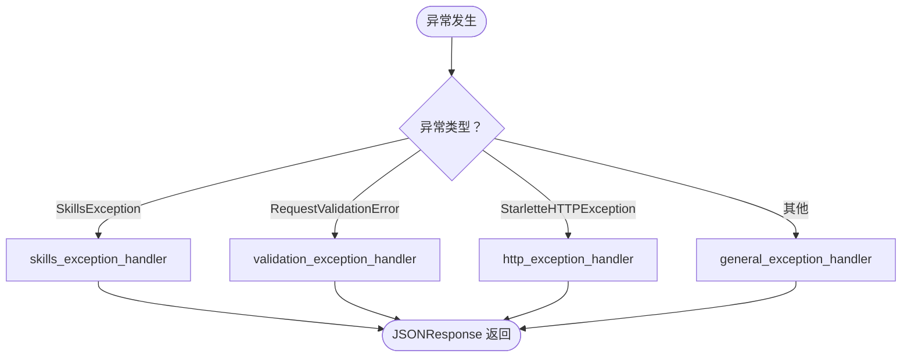
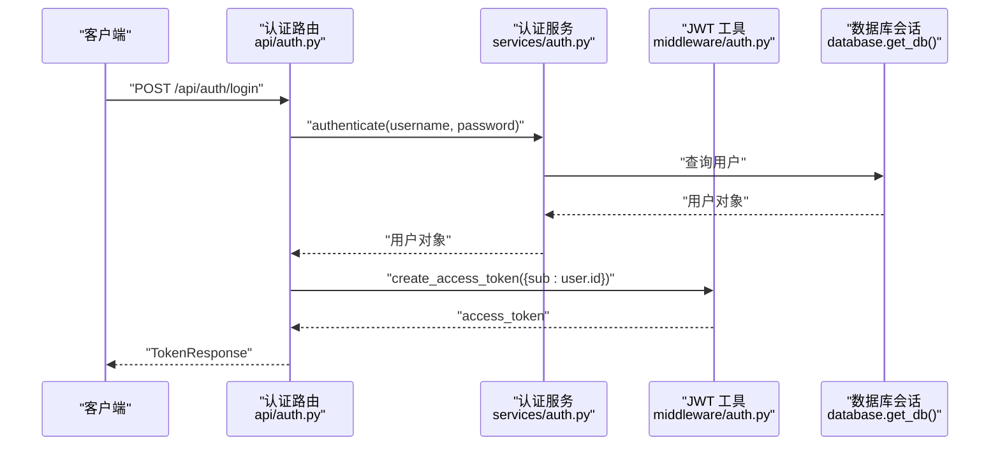
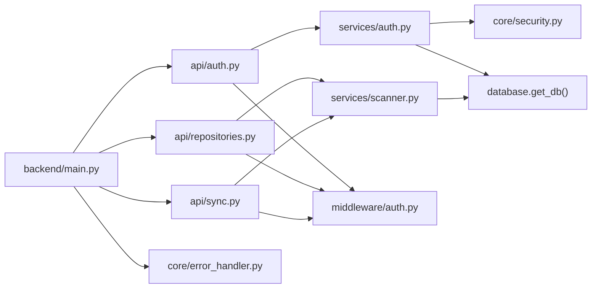

# 后端开发

<cite>
**本文引用的文件**
- [backend/main.py](file://backend/main.py)
- [backend/database.py](file://backend/database.py)
- [backend/core/security.py](file://backend/core/security.py)
- [backend/middleware/auth.py](file://backend/middleware/auth.py)
- [backend/core/error_handler.py](file://backend/core/error_handler.py)
- [backend/models/user.py](file://backend/models/user.py)
- [backend/models/repository.py](file://backend/models/repository.py)
- [backend/models/category.py](file://backend/models/category.py)
- [backend/models/skill.py](file://backend/models/skill.py)
- [backend/services/auth.py](file://backend/services/auth.py)
- [backend/api/auth.py](file://backend/api/auth.py)
- [backend/api/repositories.py](file://backend/api/repositories.py)
- [backend/api/sync.py](file://backend/api/sync.py)
- [backend/schemas/user.py](file://backend/schemas/user.py)
- [backend/schemas/repository.py](file://backend/schemas/repository.py)
</cite>

## 目录
1. [简介](#简介)
2. [项目结构](#项目结构)
3. [核心组件](#核心组件)
4. [架构总览](#架构总览)
5. [详细组件分析](#详细组件分析)
6. [依赖分析](#依赖分析)
7. [性能考虑](#性能考虑)
8. [故障排查指南](#故障排查指南)
9. [结论](#结论)
10. [附录](#附录)

## 简介
本文件面向 Skills Hub 后端开发团队与维护者，系统性梳理基于 FastAPI 的 Python Web 服务架构，涵盖路由设计、中间件体系、异常处理与安全机制；深入讲解数据模型设计、数据库连接与 ORM 映射；阐述业务服务层（认证、仓库扫描、内容解析等）实现；明确 API 设计原则、参数校验与响应格式规范，并提供调试技巧、性能优化与错误处理策略。

## 项目结构
后端采用分层清晰的组织方式：
- 应用入口与生命周期：backend/main.py
- 数据库与 ORM：backend/database.py、models/*、schemas/*
- 安全与中间件：core/security.py、middleware/auth.py、core/error_handler.py
- 业务服务：services/*
- API 路由：api/*

图表来源
- [backend/main.py](file://backend/main.py#L46-L84)
- [backend/database.py](file://backend/database.py#L42-L56)
- [backend/models/user.py](file://backend/models/user.py#L18-L38)
- [backend/schemas/user.py](file://backend/schemas/user.py#L8-L54)

章节来源
- [backend/main.py](file://backend/main.py#L1-L137)

## 核心组件
- 应用入口与生命周期：负责初始化数据库、注册中间件与异常处理器、挂载路由与 SPA 回退、健康检查端点。
- 数据库与会话：使用 SQLAlchemy 异步引擎与会话工厂，提供依赖注入 get_db，自动提交/回滚/关闭。
- 安全与认证：密码加密使用 Argon2，敏感数据加密使用 Fernet；JWT 令牌签发与校验，提供当前用户与管理员权限依赖。
- 统一异常处理：针对自定义异常、请求验证错误、HTTP 异常与通用异常，输出一致的错误响应结构。
- 业务服务：认证服务（注册、登录、改密、重置）、仓库扫描与同步服务（待实现）。
- API 层：认证、仓库管理、同步等路由，均通过依赖注入获取用户与数据库会话。

章节来源
- [backend/main.py](file://backend/main.py#L27-L84)
- [backend/database.py](file://backend/database.py#L42-L75)
- [backend/core/security.py](file://backend/core/security.py#L12-L64)
- [backend/middleware/auth.py](file://backend/middleware/auth.py#L25-L134)
- [backend/core/error_handler.py](file://backend/core/error_handler.py#L14-L102)

## 架构总览
下图展示应用启动到请求处理的关键交互：FastAPI 应用加载中间件与异常处理器，注册路由；请求进入时，中间件链进行安全与日志处理，依赖注入获取数据库会话与当前用户；业务服务执行具体逻辑；ORM 将模型持久化至数据库。

图表来源
- [backend/main.py](file://backend/main.py#L46-L84)
- [backend/api/auth.py](file://backend/api/auth.py#L21-L65)
- [backend/api/repositories.py](file://backend/api/repositories.py#L23-L205)
- [backend/api/sync.py](file://backend/api/sync.py#L14-L112)
- [backend/services/auth.py](file://backend/services/auth.py#L19-L130)
- [backend/database.py](file://backend/database.py#L42-L56)
- [backend/models/user.py](file://backend/models/user.py#L18-L38)
- [backend/schemas/user.py](file://backend/schemas/user.py#L8-L54)

## 详细组件分析

### 应用入口与生命周期
- 生命周期管理：启动时初始化数据库连接，关闭时释放连接。
- 中间件：CORS、安全头、日志、限流。
- 异常处理：SkillsException、RequestValidationError、StarletteHTTPException、通用异常。
- 路由注册：认证、用户、公开分类、仓库、分类、技能、Webhook、同步。
- 健康检查：检测数据库连通性。
- SPA 回退：非 API 路由返回前端 index.html；生产环境需挂载静态文件。

图表来源
- [backend/main.py](file://backend/main.py#L87-L104)
- [backend/database.py](file://backend/database.py#L63-L69)

章节来源
- [backend/main.py](file://backend/main.py#L27-L125)

### 数据库与 ORM
- 异步引擎：基于 aiomysql 的异步连接，开启 pool_pre_ping，连接池大小与溢出配置。
- 会话工厂：AsyncSession，expire_on_commit=false，autocommit/autoflush=false。
- 依赖注入：get_db 提供异步上下文，自动 commit/rollback/close。
- 模型关系：
  - User：自引用 created_by 外键，用于记录创建者。
  - Repository：与 Skill 一对多（级联删除孤儿），含类型、分支、GitLab 自建地址、加密 token、webhook 配置、启用状态与最后同步时间。
  - Category：自引用父子关系，多对多关联 Skill（category_skills）。
  - Skill：与 Repository 多对一，与 Category 多对多，含目录、仓库元信息、统计字段与时间戳。

图表来源
- [backend/models/user.py](file://backend/models/user.py#L18-L38)
- [backend/models/repository.py](file://backend/models/repository.py#L18-L58)
- [backend/models/category.py](file://backend/models/category.py#L19-L46)
- [backend/models/skill.py](file://backend/models/skill.py#L11-L39)

章节来源
- [backend/database.py](file://backend/database.py#L14-L75)
- [backend/models/user.py](file://backend/models/user.py#L18-L52)
- [backend/models/repository.py](file://backend/models/repository.py#L18-L74)
- [backend/models/category.py](file://backend/models/category.py#L19-L94)
- [backend/models/skill.py](file://backend/models/skill.py#L11-L90)

### 安全与认证
- 密码管理：使用 Argon2，提供 hash 与 verify。
- 敏感数据加密：Fernet 对 access_token、webhook_secret 等进行加解密。
- JWT：签发与解码，支持过期与无效签名处理；提供获取当前用户与管理员权限依赖；可选认证返回 None。
- 中间件：安全头、日志、限流（middleware/security.py）。

图表来源
- [backend/core/security.py](file://backend/core/security.py#L12-L64)
- [backend/services/auth.py](file://backend/services/auth.py#L19-L130)
- [backend/middleware/auth.py](file://backend/middleware/auth.py#L25-L134)

章节来源
- [backend/core/security.py](file://backend/core/security.py#L12-L64)
- [backend/middleware/auth.py](file://backend/middleware/auth.py#L25-L134)
- [backend/services/auth.py](file://backend/services/auth.py#L19-L130)

### 统一异常处理
- 自定义异常：SkillsException，返回包含 code、message、details、path、timestamp 的结构化错误。
- 请求验证错误：将 Pydantic 错误标准化为 field、message、type 列表。
- HTTP 异常：映射为标准错误结构。
- 通用异常：记录堆栈并返回统一内部错误。

图表来源
- [backend/core/error_handler.py](file://backend/core/error_handler.py#L14-L102)

章节来源
- [backend/core/error_handler.py](file://backend/core/error_handler.py#L14-L102)

### API 设计与路由
- 认证 API：登录、获取当前用户、修改密码。
- 仓库管理 API：列表、创建、详情、更新、删除、手动同步、Webhook 配置。
- 同步 API：单仓库同步、全部仓库同步、同步状态查询。
- 公开分类 API：无需认证（入口文件中单独注册）。

图表来源
- [backend/api/auth.py](file://backend/api/auth.py#L24-L40)
- [backend/services/auth.py](file://backend/services/auth.py#L64-L98)
- [backend/middleware/auth.py](file://backend/middleware/auth.py#L25-L33)
- [backend/database.py](file://backend/database.py#L42-L56)

章节来源
- [backend/api/auth.py](file://backend/api/auth.py#L21-L65)
- [backend/api/repositories.py](file://backend/api/repositories.py#L23-L205)
- [backend/api/sync.py](file://backend/api/sync.py#L14-L112)

### 数据模型与 Schema
- 用户：角色枚举、激活状态、创建者外键、序列化 to_dict 排除密码。
- 仓库：类型枚举（GitHub/GitLab）、分支、GitLab 自建地址、加密 token、webhook 配置、启用状态、最后同步时间。
- 分类：自引用父子关系、多对多关联 Skill、支持祖先/后代查询。
- 技能：与仓库/分类关联、目录定位、仓库元信息、统计字段、视图计数方法。
- Schema：对输入/输出进行强约束与字段校验，统一响应结构。

章节来源
- [backend/schemas/user.py](file://backend/schemas/user.py#L8-L96)
- [backend/schemas/repository.py](file://backend/schemas/repository.py#L7-L73)
- [backend/models/user.py](file://backend/models/user.py#L18-L52)
- [backend/models/repository.py](file://backend/models/repository.py#L18-L74)
- [backend/models/category.py](file://backend/models/category.py#L19-L94)
- [backend/models/skill.py](file://backend/models/skill.py#L11-L90)

## 依赖分析
- 组件耦合：API 路由依赖服务层；服务层依赖数据库会话；认证依赖密码与 JWT 工具；异常处理集中于 core。
- 外部依赖：FastAPI、SQLAlchemy 异步、aiomysql、Pydantic、Passlib、cryptography、python-jose。
- 循环依赖：未见直接循环导入；模型间关系通过字符串外键与关系声明避免循环。

图表来源
- [backend/api/auth.py](file://backend/api/auth.py#L17-L20)
- [backend/api/repositories.py](file://backend/api/repositories.py#L18-L21)
- [backend/api/sync.py](file://backend/api/sync.py#L10-L12)
- [backend/services/auth.py](file://backend/services/auth.py#L8-L16)
- [backend/middleware/auth.py](file://backend/middleware/auth.py#L13-L15)
- [backend/main.py](file://backend/main.py#L77-L84)
- [backend/core/error_handler.py](file://backend/core/error_handler.py#L10-L11)

章节来源
- [backend/main.py](file://backend/main.py#L24-L84)

## 性能考虑
- 数据库连接池：合理设置 pool_size 与 max_overflow，结合 pool_pre_ping 保持连接健康。
- 查询优化：使用 selectinload 预加载关联，减少 N+1 查询；按需选择列与排序。
- 异步 I/O：保持 FastAPI 异步特性，避免阻塞操作；后台任务用于长耗时同步。
- 缓存策略：对热点数据（如公开分类树）可引入缓存中间件或 Redis。
- 日志与监控：中间件记录请求耗时与状态，结合指标系统定位瓶颈。
- JWT 与加密：Argon2 与 Fernet 开销可控，注意批量操作时的批处理与去重。

## 故障排查指南
- 健康检查失败：确认 DATABASE_URL 环境变量与数据库可达；查看 init_db 返回值。
- 认证失败：检查用户名是否存在、账户是否激活、密码哈希是否匹配；核对 JWT 密钥与算法。
- 数据库事务：get_db 自动回滚异常；若出现脏读/幻读，检查会话配置与并发控制。
- Webhook/同步异常：查看同步结果与错误日志；确认仓库 token 与 webhook secret 是否正确加密存储。
- 前端 SPA：静态文件挂载顺序需在路由之后；确认 dist 目录存在且可读。

章节来源
- [backend/main.py](file://backend/main.py#L87-L125)
- [backend/database.py](file://backend/database.py#L42-L56)
- [backend/middleware/auth.py](file://backend/middleware/auth.py#L48-L95)
- [backend/api/sync.py](file://backend/api/sync.py#L35-L71)

## 结论
本项目以 FastAPI 为核心，结合 SQLAlchemy 异步 ORM、统一异常处理与完善的中间件体系，构建了高可用的技能内容管理平台后端。通过清晰的分层与依赖注入，确保了路由、服务、数据层的职责分离与可维护性。建议在生产环境中完善密钥管理、连接池调优、缓存与监控，并持续优化扫描与同步流程的可观测性与容错能力。

## 附录
- 开发规范
  - 所有输入使用 Pydantic Schema 校验，输出统一为响应模型。
  - 路由依赖使用 Depends 注入 get_current_user 或 require_admin，确保权限控制。
  - 敏感信息一律加密存储，避免明文泄露。
  - 异常统一由 core/error_handler.py 处理，便于日志与监控。
- 最佳实践
  - 使用 selectinload 预加载关联，减少查询次数。
  - 合理拆分后台任务，避免阻塞主请求线程。
  - 对高频接口增加缓存与限流策略。
  - 定期清理失效 token 与无用数据，保持数据库整洁。