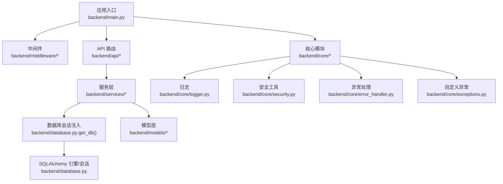
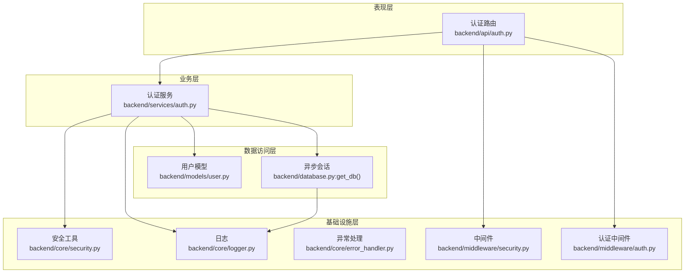
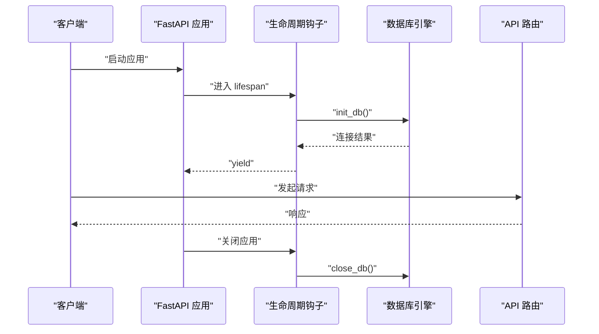
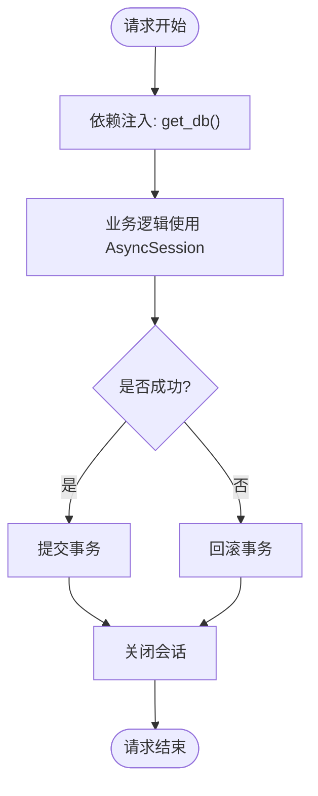
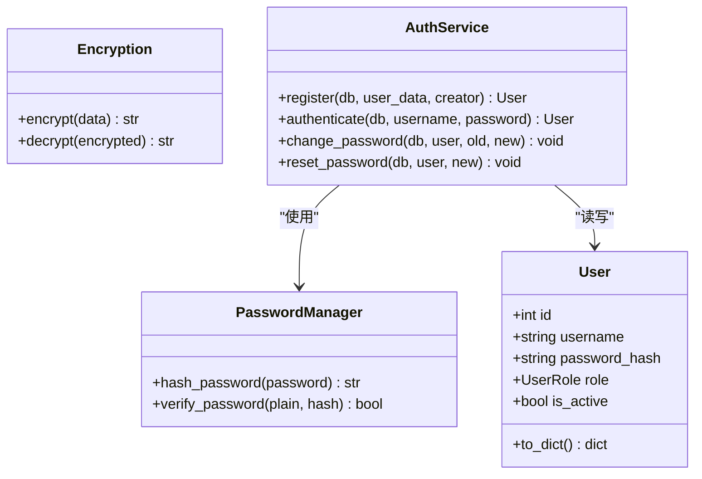
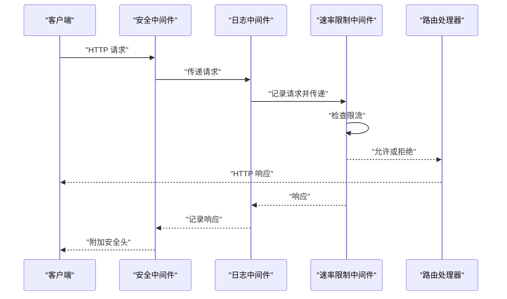
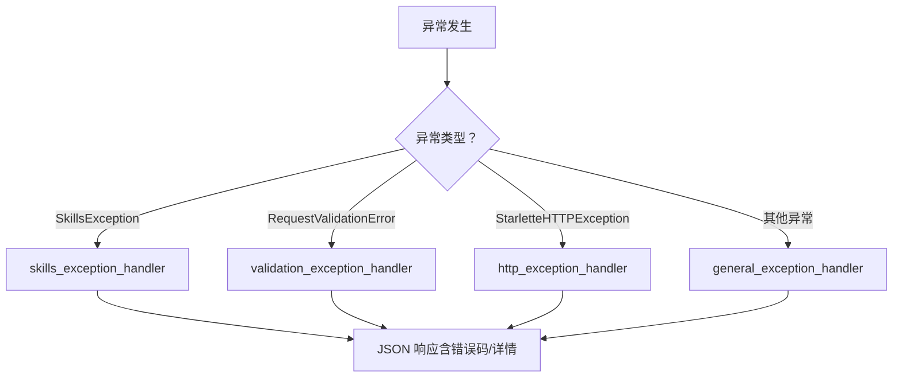
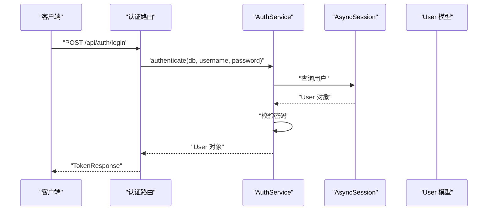
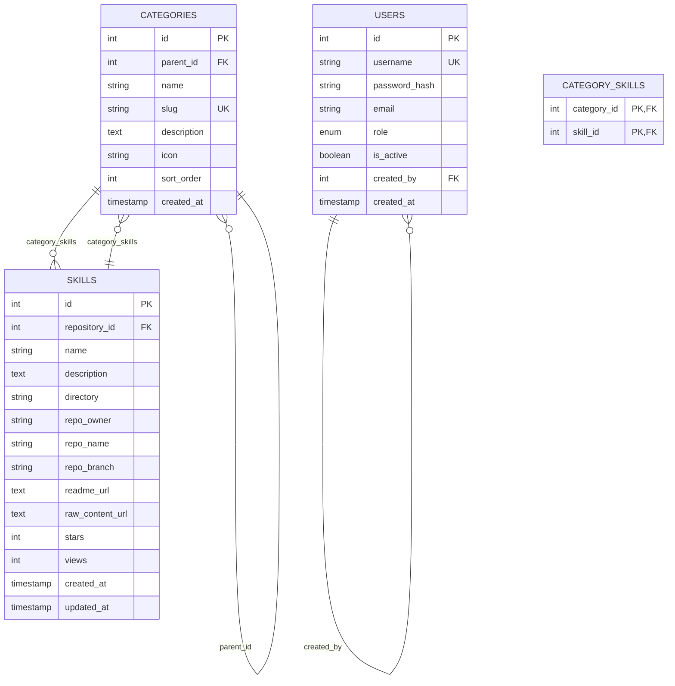
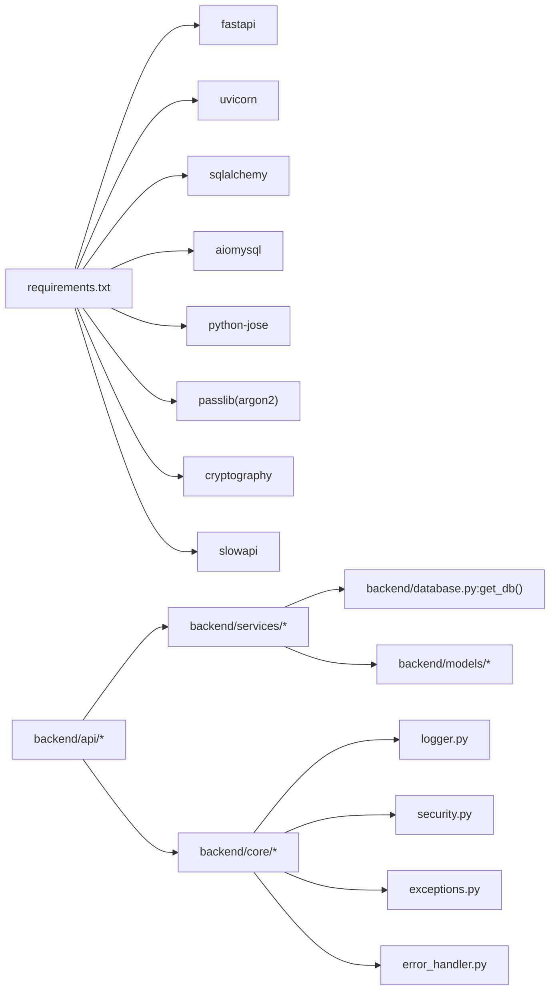

# 后端架构设计

<cite>
**本文档引用的文件**
- [backend/main.py](file://backend/main.py)
- [backend/database.py](file://backend/database.py)
- [backend/core/logger.py](file://backend/core/logger.py)
- [backend/core/security.py](file://backend/core/security.py)
- [backend/middleware/auth.py](file://backend/middleware/auth.py)
- [backend/middleware/security.py](file://backend/middleware/security.py)
- [backend/core/error_handler.py](file://backend/core/error_handler.py)
- [backend/core/exceptions.py](file://backend/core/exceptions.py)
- [backend/models/user.py](file://backend/models/user.py)
- [backend/models/category.py](file://backend/models/category.py)
- [backend/schemas/user.py](file://backend/schemas/user.py)
- [backend/services/auth.py](file://backend/services/auth.py)
- [backend/api/auth.py](file://backend/api/auth.py)
- [backend/requirements.txt](file://backend/requirements.txt)
- [backend/schema.sql](file://backend/schema.sql)
</cite>

## 目录
1. [简介](#简介)
2. [项目结构](#项目结构)
3. [核心组件](#核心组件)
4. [架构总览](#架构总览)
5. [详细组件分析](#详细组件分析)
6. [依赖关系分析](#依赖关系分析)
7. [性能考虑](#性能考虑)
8. [故障排除指南](#故障排除指南)
9. [结论](#结论)

## 简介
本文件面向 Skills Hub 后端系统的架构设计与实现，围绕基于 FastAPI 的分层架构展开，涵盖应用入口配置、数据库连接管理、中间件体系、核心模块与服务层等。文档重点阐述架构模式、设计原则、技术决策以及各层之间的交互关系、数据流向与依赖注入机制，并给出系统边界、组件职责划分与扩展性建议。

## 项目结构
后端采用“分层 + 功能域”混合组织方式：
- 应用入口与生命周期：backend/main.py
- 数据库与ORM：backend/database.py
- 核心基础设施：backend/core/*（日志、安全、异常处理）
- 中间件：backend/middleware/*
- 数据模型：backend/models/*
- 数据传输对象：backend/schemas/*
- 业务服务：backend/services/*
- API 路由：backend/api/*

**图示来源**
- [backend/main.py](file://backend/main.py#L46-L84)
- [backend/database.py](file://backend/database.py#L42-L56)
- [backend/core/logger.py](file://backend/core/logger.py#L11-L70)
- [backend/core/security.py](file://backend/core/security.py#L12-L58)
- [backend/core/error_handler.py](file://backend/core/error_handler.py#L14-L101)
- [backend/core/exceptions.py](file://backend/core/exceptions.py#L7-L100)

**章节来源**
- [backend/main.py](file://backend/main.py#L1-L137)
- [backend/database.py](file://backend/database.py#L1-L75)

## 核心组件
- 应用入口与生命周期管理：负责应用启动/关闭、CORS、自定义中间件注册、异常处理器注册、路由挂载与健康检查端点。
- 数据库连接与依赖注入：提供异步 SQLAlchemy 引擎、会话工厂与 get_db() 依赖注入函数，确保每个请求拥有独立会话并自动提交/回滚。
- 安全与认证：提供密码加密（Argon2）、敏感数据加密（Fernet）、JWT 令牌签发与校验、可选认证与管理员权限校验。
- 中间件体系：安全响应头、请求日志、速率限制；统一异常处理与日志记录。
- 核心异常体系：统一错误码、状态码与响应结构，便于前端一致化处理。
- 模型与 Schema：用户、分类等实体模型与 Pydantic 输入/输出模型。
- 服务层：封装业务逻辑，复用安全与数据库能力，供 API 层调用。

**章节来源**
- [backend/main.py](file://backend/main.py#L27-L104)
- [backend/database.py](file://backend/database.py#L42-L75)
- [backend/core/security.py](file://backend/core/security.py#L12-L64)
- [backend/middleware/security.py](file://backend/middleware/security.py#L11-L142)
- [backend/core/error_handler.py](file://backend/core/error_handler.py#L14-L101)
- [backend/core/exceptions.py](file://backend/core/exceptions.py#L7-L100)
- [backend/models/user.py](file://backend/models/user.py#L12-L52)
- [backend/schemas/user.py](file://backend/schemas/user.py#L8-L96)
- [backend/services/auth.py](file://backend/services/auth.py#L19-L130)

## 架构总览
系统采用“FastAPI + 异步 SQLAlchemy + 分层架构”的组合：
- 表现层：API 路由与依赖注入
- 业务层：服务类封装领域逻辑
- 数据访问层：异步 ORM 会话与模型
- 基础设施层：日志、安全、异常处理、中间件

**图示来源**
- [backend/api/auth.py](file://backend/api/auth.py#L24-L64)
- [backend/services/auth.py](file://backend/services/auth.py#L19-L130)
- [backend/models/user.py](file://backend/models/user.py#L18-L52)
- [backend/database.py](file://backend/database.py#L42-L56)
- [backend/core/security.py](file://backend/core/security.py#L12-L58)
- [backend/core/logger.py](file://backend/core/logger.py#L11-L70)
- [backend/core/error_handler.py](file://backend/core/error_handler.py#L14-L101)
- [backend/middleware/security.py](file://backend/middleware/security.py#L11-L142)
- [backend/middleware/auth.py](file://backend/middleware/auth.py#L48-L96)

## 详细组件分析

### 应用入口与生命周期（FastAPI）
- 生命周期管理：通过 lifespan 钩子在启动时初始化数据库连接，在关闭时释放连接。
- 中间件注册：CORS、安全响应头、日志、速率限制。
- 异常处理：注册自定义异常、验证异常、HTTP 异常与通用异常处理器。
- 路由挂载：按功能域挂载认证、用户、仓库、分类、技能、Webhook、同步等路由。
- 健康检查：对数据库执行简单查询，返回健康状态。
- SPA 回退：对非 API 路由返回前端 index.html，生产环境需注意静态文件挂载顺序。

**图示来源**
- [backend/main.py](file://backend/main.py#L27-L44)
- [backend/database.py](file://backend/database.py#L58-L75)

**章节来源**
- [backend/main.py](file://backend/main.py#L27-L125)

### 数据库连接与依赖注入
- 异步引擎与连接池：使用 SQLAlchemy 2.x 异步引擎，启用 pre_ping 与合理连接池参数。
- 会话工厂：AsyncSession + async_sessionmaker，支持自动提交/回滚与关闭。
- 依赖注入：get_db() 在每次请求中创建会话，确保事务边界清晰。
- 初始化与关闭：应用启动时测试连接，关闭时释放连接资源。

**图示来源**
- [backend/database.py](file://backend/database.py#L42-L56)

**章节来源**
- [backend/database.py](file://backend/database.py#L14-L75)

### 安全与认证
- 密码加密：使用 Argon2（替代 bcrypt 避免长度限制），提供哈希与校验。
- 敏感数据加密：使用 Fernet 对 GitLab Token 等敏感信息进行加解密。
- JWT：签发与解码，支持过期控制与用户状态校验。
- 权限控制：提供 require_admin 依赖注入，确保管理员操作的安全性。
- 可选认证：允许匿名访问但返回空值，便于公开接口。

**图示来源**
- [backend/core/security.py](file://backend/core/security.py#L12-L58)
- [backend/services/auth.py](file://backend/services/auth.py#L19-L130)
- [backend/models/user.py](file://backend/models/user.py#L18-L52)

**章节来源**
- [backend/core/security.py](file://backend/core/security.py#L12-L64)
- [backend/middleware/auth.py](file://backend/middleware/auth.py#L25-L134)
- [backend/services/auth.py](file://backend/services/auth.py#L19-L130)

### 中间件体系
- 安全响应头中间件：统一设置安全相关响应头，隐藏服务器信息。
- 日志中间件：记录请求方法、路径、客户端 IP 与响应状态与耗时。
- 速率限制中间件：基于内存的滑动窗口计数，针对特定路径（如登录）进行限流。

**图示来源**
- [backend/middleware/security.py](file://backend/middleware/security.py#L11-L142)

**章节来源**
- [backend/middleware/security.py](file://backend/middleware/security.py#L11-L142)

### 统一异常处理
- 自定义异常：SkillsException 及其子类（NotFound、Validation、Auth、AuthZ、Conflict、ExternalService）。
- 异常处理器：分别处理自定义异常、Pydantic 验证错误、HTTP 异常与通用异常，统一返回结构化的错误响应。
- 日志记录：对未捕获异常进行记录，包含路径与方法等上下文。

**图示来源**
- [backend/core/error_handler.py](file://backend/core/error_handler.py#L14-L101)
- [backend/core/exceptions.py](file://backend/core/exceptions.py#L7-L100)

**章节来源**
- [backend/core/error_handler.py](file://backend/core/error_handler.py#L14-L101)
- [backend/core/exceptions.py](file://backend/core/exceptions.py#L7-L100)

### API 路由与依赖注入示例（认证）
- 路由前缀与标签：统一以 /api/auth 开头，便于文档与管理。
- 依赖注入：get_db() 提供会话；get_current_user()/require_admin() 提供认证与权限。
- 业务调用：路由层只做参数绑定与调用服务层，保持薄路由。

**图示来源**
- [backend/api/auth.py](file://backend/api/auth.py#L24-L40)
- [backend/services/auth.py](file://backend/services/auth.py#L64-L98)
- [backend/models/user.py](file://backend/models/user.py#L18-L52)

**章节来源**
- [backend/api/auth.py](file://backend/api/auth.py#L21-L64)
- [backend/services/auth.py](file://backend/services/auth.py#L19-L130)

### 数据模型与关系（用户与分类）
- 用户模型：包含角色枚举、激活状态、创建者外键等字段，提供 to_dict() 与 is_admin 属性。
- 分类模型：支持多级父子关系、与 Skill 的多对多关联，提供祖先/后代查询辅助方法。
- 关系映射：使用 SQLAlchemy 关系与 backref/cascade 策略，保证数据一致性。

**图示来源**
- [backend/models/user.py](file://backend/models/user.py#L18-L52)
- [backend/models/category.py](file://backend/models/category.py#L19-L94)
- [backend/schema.sql](file://backend/schema.sql#L7-L99)

**章节来源**
- [backend/models/user.py](file://backend/models/user.py#L12-L52)
- [backend/models/category.py](file://backend/models/category.py#L10-L94)
- [backend/schema.sql](file://backend/schema.sql#L1-L106)

## 依赖关系分析
- 外部依赖：FastAPI、Uvicorn、SQLAlchemy 2.x、aiomysql、python-jose、passlib(Argon2)、cryptography、slowapi 等。
- 内部依赖：API 路由依赖服务层；服务层依赖模型与数据库会话；核心模块被广泛复用。

**图示来源**
- [backend/requirements.txt](file://backend/requirements.txt#L1-L34)
- [backend/api/auth.py](file://backend/api/auth.py#L1-L64)
- [backend/services/auth.py](file://backend/services/auth.py#L1-L130)
- [backend/database.py](file://backend/database.py#L42-L56)
- [backend/core/logger.py](file://backend/core/logger.py#L11-L70)
- [backend/core/security.py](file://backend/core/security.py#L12-L58)
- [backend/core/exceptions.py](file://backend/core/exceptions.py#L7-L100)
- [backend/core/error_handler.py](file://backend/core/error_handler.py#L14-L101)

**章节来源**
- [backend/requirements.txt](file://backend/requirements.txt#L1-L34)

## 性能考虑
- 异步数据库：使用 SQLAlchemy 异步引擎与会话，减少阻塞，提升并发吞吐。
- 连接池参数：合理设置 pool_size 与 max_overflow，结合 pre_ping 保障连接可用性。
- 依赖注入：每个请求独立会话，避免跨请求状态污染，同时减少锁竞争。
- 中间件：日志与安全头开销较小，速率限制仅对热点路径生效。
- 建议：对高频查询建立合适索引（如用户名、分类 slug、搜索全文索引），并考虑缓存热点数据（如公开分类树）。

## 故障排除指南
- 数据库连接失败：检查 DATABASE_URL 环境变量与网络连通性；查看 init_db 返回值与日志。
- 认证失败：确认用户名存在、账户激活、密码正确；检查 JWT 密钥与算法配置。
- 速率限制触发：检查限流配置与客户端 IP；必要时调整窗口与阈值。
- 未捕获异常：查看 general_exception_handler 日志，定位异常堆栈与请求上下文。
- 健康检查失败：确认数据库可执行查询；排查连接池耗尽或超时。

**章节来源**
- [backend/main.py](file://backend/main.py#L88-L104)
- [backend/database.py](file://backend/database.py#L58-L75)
- [backend/middleware/security.py](file://backend/middleware/security.py#L107-L142)
- [backend/core/error_handler.py](file://backend/core/error_handler.py#L80-L101)

## 结论
Skills Hub 后端采用清晰的分层架构与依赖注入机制，结合 FastAPI 的异步能力与 SQLAlchemy 的 ORM 支持，实现了高可维护性与可扩展性的系统。通过统一的日志、安全与异常处理，提升了可观测性与安全性。建议在生产环境中进一步完善环境变量管理、连接池监控与缓存策略，以获得更稳定的性能表现。