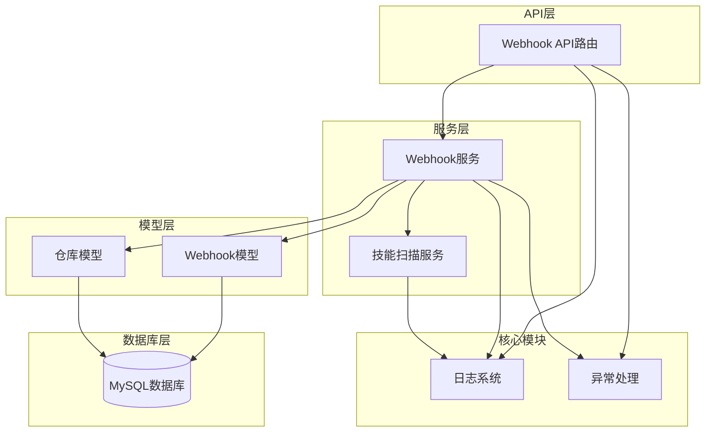
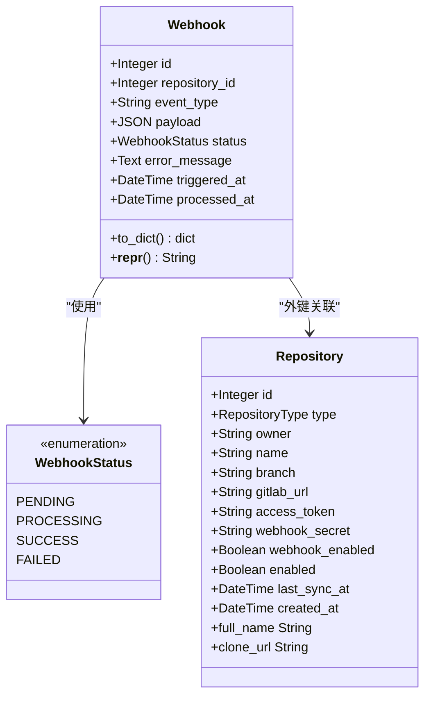
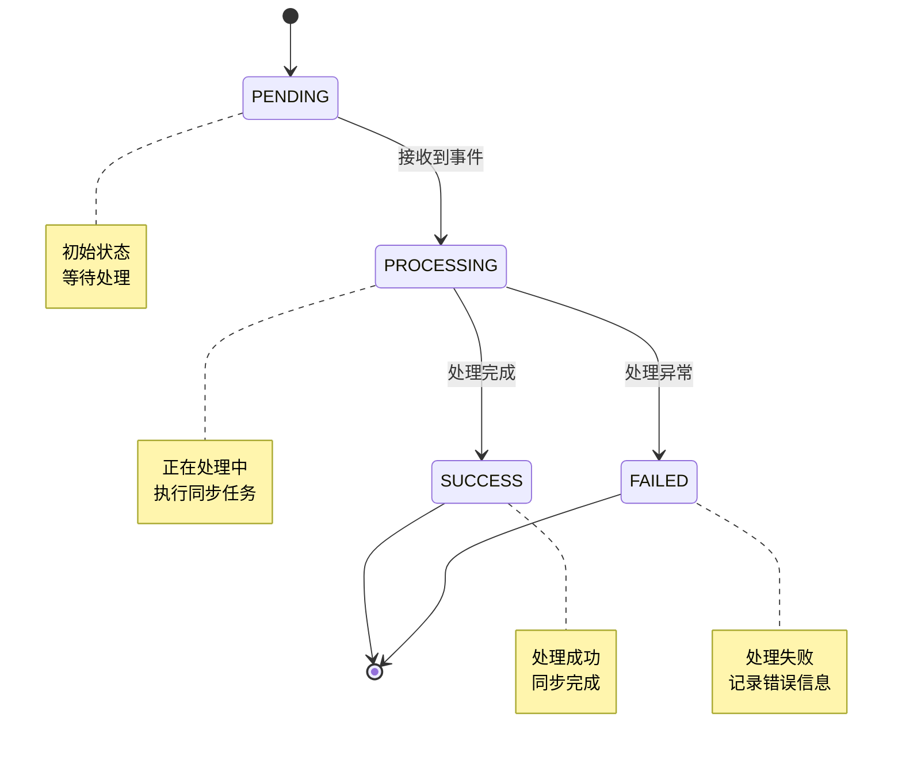
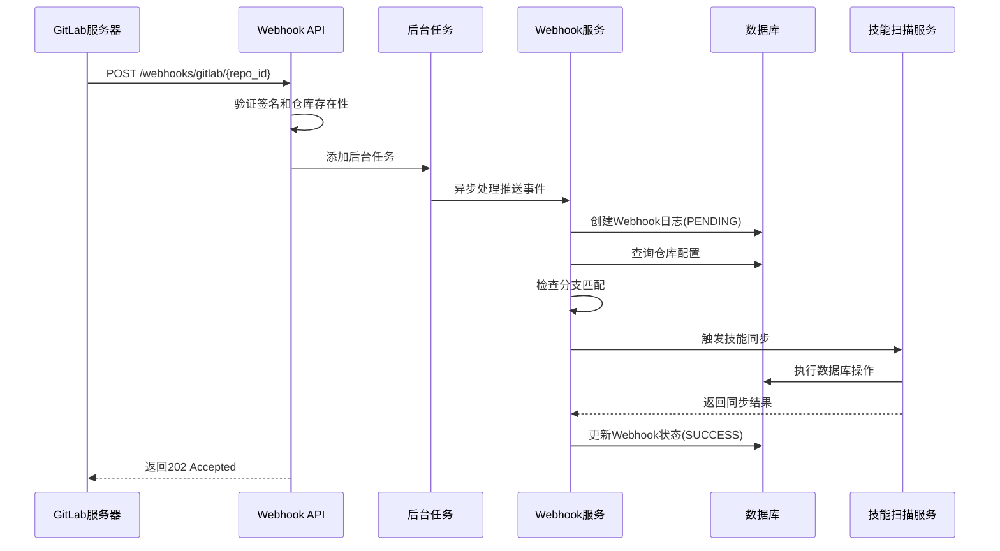
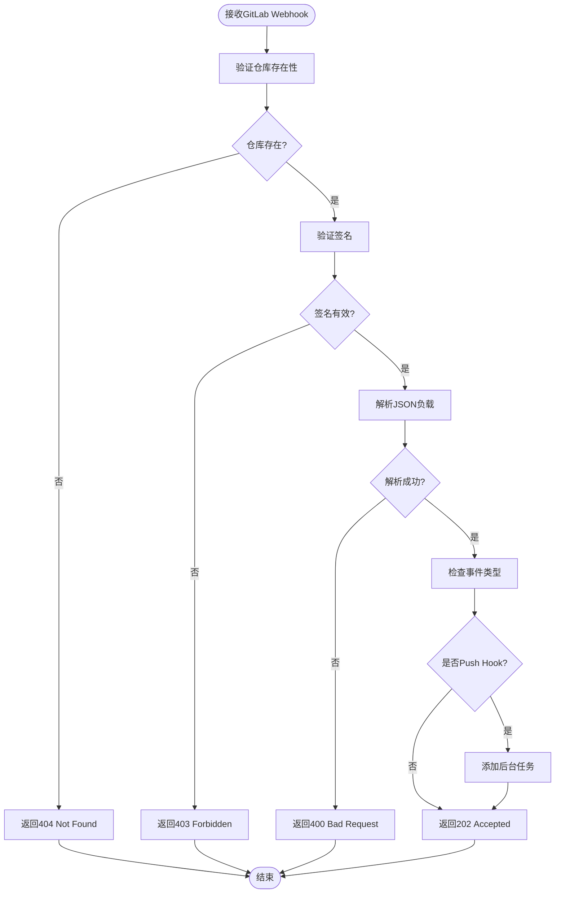
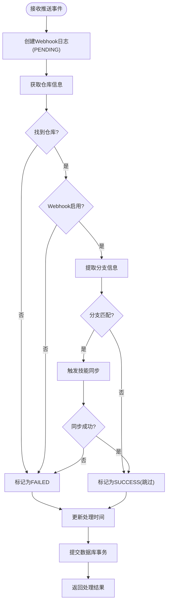
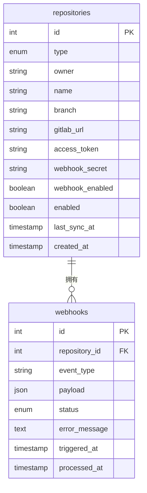
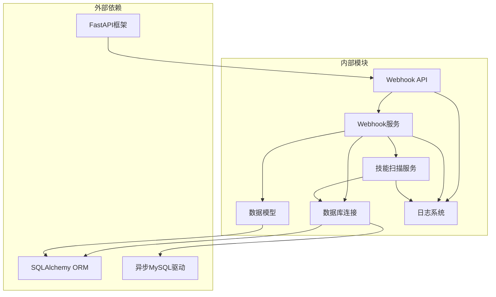
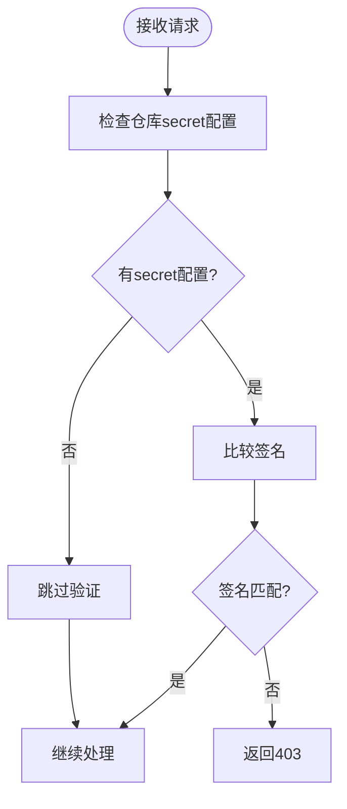
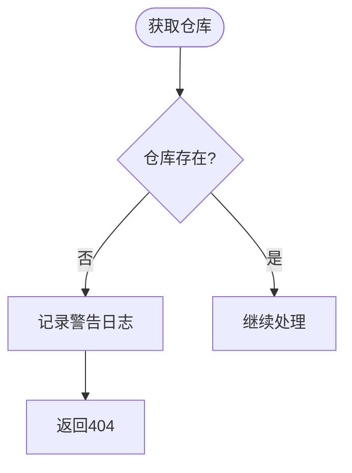

# Webhook模型

<cite>
**本文档引用的文件**
- [backend/models/webhook.py](file://backend/models/webhook.py)
- [backend/services/webhook.py](file://backend/services/webhook.py)
- [backend/api/webhooks.py](file://backend/api/webhooks.py)
- [backend/models/repository.py](file://backend/models/repository.py)
- [backend/services/scanner.py](file://backend/services/scanner.py)
- [backend/database.py](file://backend/database.py)
- [backend/schema.sql](file://backend/schema.sql)
- [backend/core/logger.py](file://backend/core/logger.py)
- [backend/core/exceptions.py](file://backend/core/exceptions.py)
</cite>

## 目录
1. [简介](#简介)
2. [项目结构](#项目结构)
3. [核心组件](#核心组件)
4. [架构概览](#架构概览)
5. [详细组件分析](#详细组件分析)
6. [依赖关系分析](#依赖关系分析)
7. [性能考虑](#性能考虑)
8. [故障排除指南](#故障排除指南)
9. [结论](#结论)

## 简介

Webhook模型是Skills Hub系统中用于处理GitLab推送事件的核心组件。该系统实现了完整的事件驱动架构，能够自动响应GitLab的推送事件，触发仓库内容的同步和技能信息的更新。本文档深入解析Webhook事件日志数据模型的设计，包括事件类型、仓库关联、时间戳和状态跟踪机制，并详细说明Webhook事件的处理流程、错误重试机制、存储策略以及监控调试功能。

## 项目结构

Webhook系统在项目中的组织结构如下：

**图表来源**
- [backend/api/webhooks.py](file://backend/api/webhooks.py#L1-L90)
- [backend/services/webhook.py](file://backend/services/webhook.py#L1-L124)
- [backend/models/webhook.py](file://backend/models/webhook.py#L1-L49)

**章节来源**
- [backend/api/webhooks.py](file://backend/api/webhooks.py#L1-L90)
- [backend/services/webhook.py](file://backend/services/webhook.py#L1-L124)
- [backend/models/webhook.py](file://backend/models/webhook.py#L1-L49)

## 核心组件

### Webhook数据模型

Webhook模型采用SQLAlchemy ORM映射，设计了完整的事件日志追踪机制：

**图表来源**
- [backend/models/webhook.py](file://backend/models/webhook.py#L11-L49)
- [backend/models/repository.py](file://backend/models/repository.py#L18-L74)

### 状态流转机制

Webhook处理采用严格的状态管理机制，确保每个事件都有明确的生命周期：

**图表来源**
- [backend/models/webhook.py](file://backend/models/webhook.py#L11-L17)

**章节来源**
- [backend/models/webhook.py](file://backend/models/webhook.py#L1-L49)
- [backend/models/repository.py](file://backend/models/repository.py#L1-L74)

## 架构概览

Webhook系统采用异步事件驱动架构，实现了高并发处理能力和可靠的事件溯源机制：

**图表来源**
- [backend/api/webhooks.py](file://backend/api/webhooks.py#L15-L64)
- [backend/services/webhook.py](file://backend/services/webhook.py#L31-L101)

**章节来源**
- [backend/api/webhooks.py](file://backend/api/webhooks.py#L1-L90)
- [backend/services/webhook.py](file://backend/services/webhook.py#L1-L124)

## 详细组件分析

### API层组件

Webhook API提供了完整的事件接收和查询接口：

#### GitLab Webhook接收端点

API层负责处理来自GitLab的Webhook请求，实现了完整的安全验证和事件分发机制：

**图表来源**
- [backend/api/webhooks.py](file://backend/api/webhooks.py#L15-L64)

#### Webhook日志查询接口

提供灵活的日志查询能力，支持按仓库过滤和限制数量：

**章节来源**
- [backend/api/webhooks.py](file://backend/api/webhooks.py#L1-L90)

### 服务层组件

#### Webhook处理服务

Webhook服务是系统的核心处理逻辑，实现了完整的事件处理流程：

**图表来源**
- [backend/services/webhook.py](file://backend/services/webhook.py#L31-L101)

#### 技能扫描服务集成

Webhook处理服务与技能扫描服务紧密集成，实现了完整的技能内容同步机制：

**章节来源**
- [backend/services/webhook.py](file://backend/services/webhook.py#L1-L124)
- [backend/services/scanner.py](file://backend/services/scanner.py#L1-L197)

### 数据层组件

#### 数据库模式设计

Webhook系统使用MySQL数据库存储事件日志，采用了合理的索引策略优化查询性能：

**图表来源**
- [backend/schema.sql](file://backend/schema.sql#L22-L99)

#### 存储策略

数据库设计采用了以下存储策略：

1. **事件日志持久化**：所有Webhook事件都被持久化存储，便于审计和故障排查
2. **索引优化**：为`repository_id`和`status`字段建立复合索引，优化查询性能
3. **时间戳追踪**：记录事件触发时间和处理完成时间，支持性能分析
4. **JSON存储**：使用JSON类型存储事件负载，支持灵活的数据结构

**章节来源**
- [backend/schema.sql](file://backend/schema.sql#L86-L99)
- [backend/models/webhook.py](file://backend/models/webhook.py#L1-L49)

## 依赖关系分析

Webhook系统各组件之间的依赖关系清晰明确：

**图表来源**
- [backend/api/webhooks.py](file://backend/api/webhooks.py#L1-L12)
- [backend/services/webhook.py](file://backend/services/webhook.py#L1-L12)
- [backend/database.py](file://backend/database.py#L1-L75)

**章节来源**
- [backend/database.py](file://backend/database.py#L1-L75)
- [backend/core/logger.py](file://backend/core/logger.py#L1-L95)

## 性能考虑

### 异步处理架构

Webhook系统采用异步处理架构，具有以下性能优势：

1. **非阻塞I/O**：使用FastAPI的异步特性，避免阻塞主线程
2. **后台任务队列**：通过BackgroundTasks实现事件的异步处理
3. **数据库连接池**：配置了10个基础连接和20个溢出连接，支持高并发访问
4. **连接健康检查**：启用pool_pre_ping确保连接有效性

### 缓存和索引策略

1. **查询优化**：为`webhooks`表的`repository_id`和`status`字段建立复合索引
2. **时间查询优化**：为`triggered_at`字段建立索引，支持时间范围查询
3. **分页查询**：默认限制查询结果为100条，防止内存溢出

### 内存管理

1. **payload处理**：Webhook日志模型不直接返回完整的payload，避免内存占用过大
2. **流式处理**：技能扫描采用流式处理方式，逐个处理技能文件
3. **连接复用**：数据库连接池支持连接复用，减少连接开销

## 故障排除指南

### 常见问题诊断

#### Webhook验证失败

当出现签名验证失败时，系统会返回403状态码：

**图表来源**
- [backend/api/webhooks.py](file://backend/api/webhooks.py#L37-L41)

#### 仓库不存在错误

当GitLab指向不存在的仓库ID时，系统会记录警告并返回404：

**图表来源**
- [backend/api/webhooks.py](file://backend/api/webhooks.py#L30-L35)

### 日志监控

系统提供了完善的日志监控机制：

#### 日志级别配置

1. **INFO级别**：记录正常的Webhook处理信息
2. **ERROR级别**：记录异常和错误信息
3. **控制台输出**：实时显示处理状态
4. **文件轮转**：按大小和时间进行日志轮转

#### 监控指标

1. **处理成功率**：统计成功处理的Webhook事件比例
2. **处理延迟**：监控从触发到完成的时间
3. **错误率**：跟踪各类错误的发生频率
4. **资源使用**：监控数据库连接池使用情况

**章节来源**
- [backend/core/logger.py](file://backend/core/logger.py#L1-L95)
- [backend/core/exceptions.py](file://backend/core/exceptions.py#L1-L101)

## 结论

Webhook模型在Skills Hub系统中展现了优秀的架构设计和实现质量。系统通过以下关键特性确保了可靠性：

1. **完整的事件溯源**：所有Webhook事件都被完整记录，支持审计和故障排查
2. **严格的状态管理**：采用明确的状态机设计，确保事件处理的可预测性
3. **异步处理架构**：支持高并发处理，提升系统响应性能
4. **完善的监控机制**：提供详细的日志记录和错误处理
5. **灵活的扩展性**：模块化设计便于功能扩展和维护

该系统为Skills Hub提供了强大的自动化能力，能够及时响应GitLab的推送事件，确保技能内容的实时同步和更新。通过合理的数据库设计、异步处理架构和完善的监控机制，系统在保证可靠性的同时，也具备了良好的性能表现和可维护性。