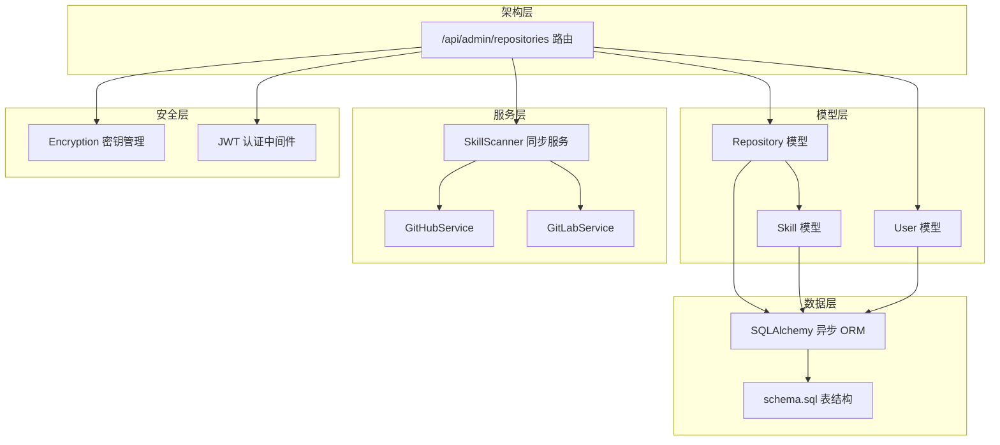
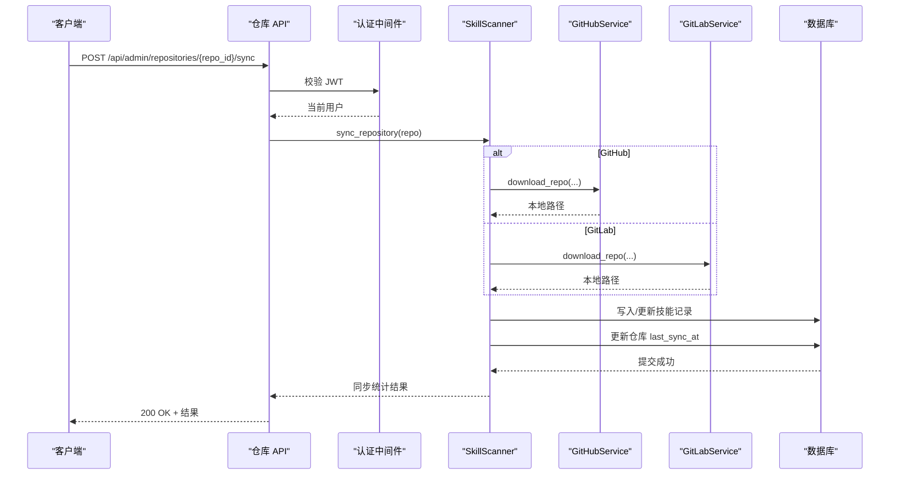
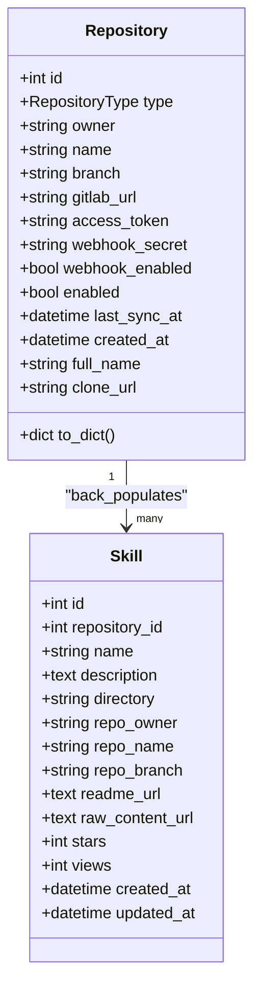
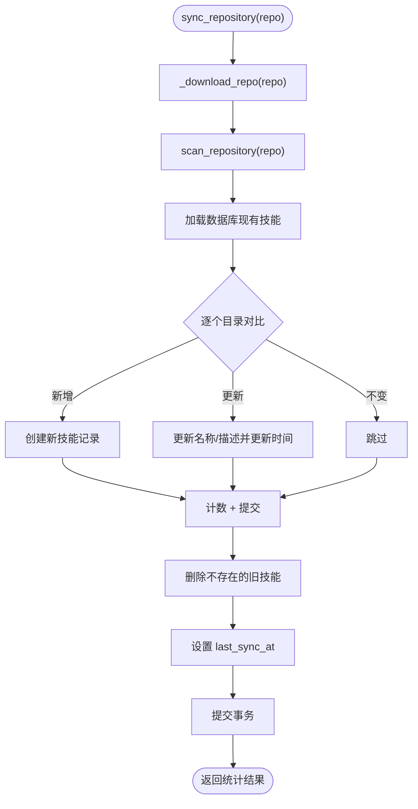
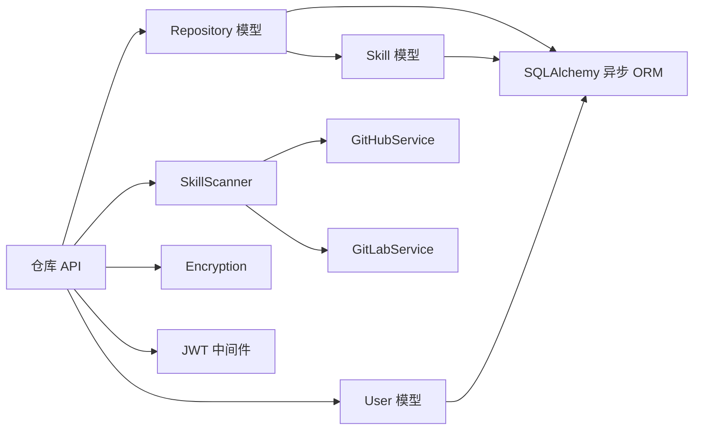

# 仓库模型

<cite>
**本文引用的文件**
- [backend/models/repository.py](file://backend/models/repository.py)
- [backend/schemas/repository.py](file://backend/schemas/repository.py)
- [backend/api/repositories.py](file://backend/api/repositories.py)
- [backend/services/scanner.py](file://backend/services/scanner.py)
- [backend/services/github.py](file://backend/services/github.py)
- [backend/services/gitlab.py](file://backend/services/gitlab.py)
- [backend/models/user.py](file://backend/models/user.py)
- [backend/models/skill.py](file://backend/models/skill.py)
- [backend/database.py](file://backend/database.py)
- [backend/schema.sql](file://backend/schema.sql)
- [backend/core/security.py](file://backend/core/security.py)
- [backend/middleware/auth.py](file://backend/middleware/auth.py)
</cite>

## 目录
1. [简介](#简介)
2. [项目结构](#项目结构)
3. [核心组件](#核心组件)
4. [架构总览](#架构总览)
5. [详细组件分析](#详细组件分析)
6. [依赖关系分析](#依赖关系分析)
7. [性能考量](#性能考量)
8. [故障排查指南](#故障排查指南)
9. [结论](#结论)
10. [附录](#附录)

## 简介
本文件系统性梳理仓库模型的设计与实现，覆盖以下主题：
- 仓库配置字段（名称、URL、平台类型、认证信息）与状态管理
- 仓库与用户的关联关系、维护者管理与权限控制
- 仓库同步状态与最后更新时间的管理机制
- 仓库模型的验证规则与约束条件
- 仓库配置的最佳实践与安全考虑
- 查询优化与索引设计建议

## 项目结构
仓库模型位于后端模型层，配合 API 层、服务层与数据库层协同工作。关键文件与职责如下：
- 模型层：定义仓库实体及其与技能的关联关系
- 架构层：FastAPI 路由与依赖注入，提供仓库 CRUD、同步、Webhook 配置等接口
- 服务层：封装 GitHub/GitLab 平台差异，负责仓库下载、解析与同步
- 安全层：敏感信息加密、认证与授权中间件
- 数据层：SQLAlchemy 异步 ORM、索引与表结构



图表来源
- [backend/models/repository.py](file://backend/models/repository.py#L18-L74)
- [backend/models/skill.py](file://backend/models/skill.py#L11-L40)
- [backend/models/user.py](file://backend/models/user.py#L18-L31)
- [backend/api/repositories.py](file://backend/api/repositories.py#L23-L205)
- [backend/services/scanner.py](file://backend/services/scanner.py#L21-L197)
- [backend/services/github.py](file://backend/services/github.py#L14-L105)
- [backend/services/gitlab.py](file://backend/services/gitlab.py#L15-L170)
- [backend/core/security.py](file://backend/core/security.py#L31-L54)
- [backend/middleware/auth.py](file://backend/middleware/auth.py#L48-L96)
- [backend/database.py](file://backend/database.py#L20-L36)
- [backend/schema.sql](file://backend/schema.sql#L22-L38)

章节来源
- [backend/models/repository.py](file://backend/models/repository.py#L18-L74)
- [backend/api/repositories.py](file://backend/api/repositories.py#L23-L205)
- [backend/services/scanner.py](file://backend/services/scanner.py#L21-L197)
- [backend/services/github.py](file://backend/services/github.py#L14-L105)
- [backend/services/gitlab.py](file://backend/services/gitlab.py#L15-L170)
- [backend/core/security.py](file://backend/core/security.py#L31-L54)
- [backend/middleware/auth.py](file://backend/middleware/auth.py#L48-L96)
- [backend/database.py](file://backend/database.py#L20-L36)
- [backend/schema.sql](file://backend/schema.sql#L22-L38)

## 核心组件
- 仓库模型（Repository）：定义仓库的平台类型、所有者、名称、分支、GitLab 自建实例地址、访问令牌、Webhook 密钥、启用状态、最后同步时间等字段，并提供克隆 URL 与完整仓库名等派生属性。
- 仓库 Schema：定义创建、更新、响应与 Webhook 配置的 Pydantic 模型，包含字段长度、格式与平台特定校验。
- 仓库 API：提供仓库列表、创建、查询、更新、删除、手动同步、Webhook 配置等接口；通过依赖注入获取当前用户并进行权限校验。
- 同步服务（SkillScanner）：根据仓库类型调用 GitHub 或 GitLab 服务下载归档，扫描 SKILL.md，对比数据库现有技能，执行新增、更新、删除，并更新仓库的 last_sync_at。
- 安全模块：提供敏感数据加密/解密能力，以及 JWT 认证中间件。
- 数据库层：基于 SQLAlchemy 异步 ORM，提供连接池、会话管理与表结构定义。

章节来源
- [backend/models/repository.py](file://backend/models/repository.py#L18-L74)
- [backend/schemas/repository.py](file://backend/schemas/repository.py#L7-L73)
- [backend/api/repositories.py](file://backend/api/repositories.py#L26-L205)
- [backend/services/scanner.py](file://backend/services/scanner.py#L70-L157)
- [backend/core/security.py](file://backend/core/security.py#L31-L54)
- [backend/database.py](file://backend/database.py#L20-L36)

## 架构总览
仓库模型贯穿“请求—业务—数据”三层：
- 请求层：FastAPI 路由接收请求，进行参数校验与权限控制
- 业务层：SkillScanner 统一处理仓库同步逻辑，按平台调用对应服务
- 数据层：SQLAlchemy 异步 ORM 持久化，schema.sql 定义表结构与索引



图表来源
- [backend/api/repositories.py](file://backend/api/repositories.py#L161-L177)
- [backend/services/scanner.py](file://backend/services/scanner.py#L70-L157)
- [backend/services/github.py](file://backend/services/github.py#L36-L102)
- [backend/services/gitlab.py](file://backend/services/gitlab.py#L46-L165)

## 详细组件分析

### 仓库模型（Repository）
- 字段设计
  - 类型与平台：type（枚举）、gitlab_url（GitLab 自建实例地址）
  - 基本信息：owner、name、branch（默认 main）
  - 认证与集成：access_token（加密存储）、webhook_secret（加密存储）、webhook_enabled（布尔）
  - 状态与时间：enabled（布尔）、last_sync_at（时间戳）、created_at（时间戳）
- 关联关系
  - 与技能（Skill）一对多：一个仓库可包含多个技能
- 属性与方法
  - full_name：组合 owner/name
  - clone_url：根据平台类型与 gitlab_url 生成克隆 URL
  - to_dict：序列化输出，不暴露敏感字段，仅返回是否存在 token/webhook secret 的布尔值



图表来源
- [backend/models/repository.py](file://backend/models/repository.py#L18-L74)
- [backend/models/skill.py](file://backend/models/skill.py#L11-L40)

章节来源
- [backend/models/repository.py](file://backend/models/repository.py#L18-L74)
- [backend/models/skill.py](file://backend/models/skill.py#L11-L40)

### 仓库 Schema（Pydantic）
- RepositoryBase：type 必填且需为 GITHUB/GITLAB（大小写不敏感），owner/name 长度限制，branch 格式限制
- RepositoryCreate：创建时可选 gitlab_url（当 type 为 GITLAB 时必填），access_token 可选
- RepositoryUpdate：支持更新 branch、access_token、webhook_secret、webhook_enabled、enabled
- RepositoryResponse：响应模型，包含技能数量、时间戳字符串化、has_token/has_webhook_secret
- WebhookConfig：配置 Webhook 的启用与密钥
- SyncResponse：同步结果统计

章节来源
- [backend/schemas/repository.py](file://backend/schemas/repository.py#L7-L73)

### 仓库 API（权限与流程）
- 列表与详情：支持按创建时间倒序列出仓库，并统计技能数量
- 创建：去重校验（owner/name/branch 组合），加密 access_token 后入库
- 更新：支持 branch/enabled 与 access_token 的选择性更新
- 删除：按 ID 删除
- 同步：手动触发同步，内部调用 SkillScanner
- Webhook 配置：启用/禁用并加密 secret，禁用时清除 secret

```mermaid
flowchart TD
Start(["进入 /api/admin/repositories"]) --> CheckAuth["校验 JWT"]
CheckAuth --> Route{"路由分发"}
Route --> |GET /| List["列表 + 技能计数"]
Route --> |POST /| Create["创建 + 去重 + 加密 token"]
Route --> |GET /{id}| Detail["详情 + 技能计数"]
Route --> |PUT /{id}| Update["更新 + 加密 token"]
Route --> |DELETE /{id}| Delete["删除"]
Route --> |POST /{id}/sync| Sync["手动同步"]
Route --> |POST /{id}/webhook| Webhook["配置 Webhook + 加密 secret"]
List --> End(["返回响应"])
Create --> End
Detail --> End
Update --> End
Delete --> End
Sync --> End
Webhook --> End
```

图表来源
- [backend/api/repositories.py](file://backend/api/repositories.py#L26-L205)

章节来源
- [backend/api/repositories.py](file://backend/api/repositories.py#L26-L205)

### 同步服务（SkillScanner）
- 下载：根据仓库类型调用 GitHubService 或 GitLabService 下载归档并解压
- 扫描：遍历目录，识别包含 SKILL.md 的目录，解析元数据
- 对比与更新：与数据库现有技能对比，执行新增、更新、删除
- 时间戳：同步完成后更新仓库的 last_sync_at
- 错误处理：捕获外部服务异常并抛出统一错误



图表来源
- [backend/services/scanner.py](file://backend/services/scanner.py#L70-L157)
- [backend/services/github.py](file://backend/services/github.py#L36-L102)
- [backend/services/gitlab.py](file://backend/services/gitlab.py#L46-L165)

章节来源
- [backend/services/scanner.py](file://backend/services/scanner.py#L70-L157)
- [backend/services/github.py](file://backend/services/github.py#L36-L102)
- [backend/services/gitlab.py](file://backend/services/gitlab.py#L46-L165)

### 平台服务（GitHub/GitLab）
- GitHubService：提供归档 URL、原始文件 URL、README URL 生成，支持带 token 的下载
- GitLabService：支持自定义实例地址，优先尝试 ZIP，失败回退到 tar.gz，支持 PRIVATE-TOKEN

章节来源
- [backend/services/github.py](file://backend/services/github.py#L14-L105)
- [backend/services/gitlab.py](file://backend/services/gitlab.py#L15-L170)

### 用户与权限
- 用户模型：包含角色（ADMIN/MAINTAINER）、激活状态、创建时间等
- 认证中间件：JWT 校验、过期处理、用户查找与激活状态检查
- 权限要求：仓库 API 使用 get_current_user 依赖注入，确保已登录且账户有效

章节来源
- [backend/models/user.py](file://backend/models/user.py#L18-L31)
- [backend/middleware/auth.py](file://backend/middleware/auth.py#L48-L96)

### 数据库与索引
- 表结构：repositories、skills、users、categories、category_skills、webhooks
- 索引设计：
  - repositories：idx_type_enabled（type, enabled）、idx_owner_name（owner, name）
  - skills：idx_repository（repository_id）、FULLTEXT idx_search（name, description）
  - webhooks：idx_repository_status（repository_id, status）、idx_triggered_at（triggered_at）

章节来源
- [backend/schema.sql](file://backend/schema.sql#L22-L38)
- [backend/schema.sql](file://backend/schema.sql#L56-L75)
- [backend/schema.sql](file://backend/schema.sql#L86-L99)

## 依赖关系分析
- 模型依赖：Repository 与 Skill 通过外键关联；User 与 Repository 无直接外键，但 API 层通过权限中间件控制访问
- 服务依赖：SkillScanner 依赖 GitHubService/GitLabService 与数据库会话
- 安全依赖：API 层在创建/更新/配置 Webhook 时使用加密模块对敏感信息进行加解密
- 数据依赖：API 层通过异步会话与数据库交互，统一提交/回滚



图表来源
- [backend/models/repository.py](file://backend/models/repository.py#L18-L74)
- [backend/models/skill.py](file://backend/models/skill.py#L11-L40)
- [backend/models/user.py](file://backend/models/user.py#L18-L31)
- [backend/api/repositories.py](file://backend/api/repositories.py#L23-L205)
- [backend/services/scanner.py](file://backend/services/scanner.py#L21-L197)
- [backend/services/github.py](file://backend/services/github.py#L14-L105)
- [backend/services/gitlab.py](file://backend/services/gitlab.py#L15-L170)
- [backend/core/security.py](file://backend/core/security.py#L31-L54)
- [backend/middleware/auth.py](file://backend/middleware/auth.py#L48-L96)
- [backend/database.py](file://backend/database.py#L20-L36)

章节来源
- [backend/models/repository.py](file://backend/models/repository.py#L18-L74)
- [backend/models/skill.py](file://backend/models/skill.py#L11-L40)
- [backend/models/user.py](file://backend/models/user.py#L18-L31)
- [backend/api/repositories.py](file://backend/api/repositories.py#L23-L205)
- [backend/services/scanner.py](file://backend/services/scanner.py#L21-L197)
- [backend/services/github.py](file://backend/services/github.py#L14-L105)
- [backend/services/gitlab.py](file://backend/services/gitlab.py#L15-L170)
- [backend/core/security.py](file://backend/core/security.py#L31-L54)
- [backend/middleware/auth.py](file://backend/middleware/auth.py#L48-L96)
- [backend/database.py](file://backend/database.py#L20-L36)

## 性能考量
- 查询优化
  - 列表接口使用 selectinload 预加载 skills，减少 N+1 查询
  - 仓库表建立复合索引（type, enabled）与（owner, name），提升筛选与去重效率
  - 技能表建立全文索引（name, description），便于搜索场景
- 存储与网络
  - 归档下载采用流式写入与临时目录，避免内存峰值
  - GitLab 回退策略（ZIP→tar.gz）提升成功率
- 并发与事务
  - 异步 ORM 与连接池配置，结合 expire_on_commit=false，减少对象过期带来的刷新成本
- 缓存与监控
  - 建议对热门仓库详情与同步结果进行短期缓存（如 Redis），降低数据库压力

章节来源
- [backend/api/repositories.py](file://backend/api/repositories.py#L32-L46)
- [backend/schema.sql](file://backend/schema.sql#L36-L37)
- [backend/schema.sql](file://backend/schema.sql#L74)
- [backend/database.py](file://backend/database.py#L20-L36)

## 故障排查指南
- 同步失败
  - 检查仓库类型与 gitlab_url 是否正确配置
  - 确认 access_token 是否有效且已加密存储
  - 查看外部服务错误日志（GitHub/GitLab）
- 权限问题
  - 确保 JWT 有效且用户处于激活状态
  - 管理员权限不足时，确认用户角色为 ADMIN
- 数据一致性
  - 同步过程中若出现部分更新，检查数据库事务是否提交成功
  - 确认 skills 与 repositories 的外键约束未被破坏

章节来源
- [backend/services/scanner.py](file://backend/services/scanner.py#L178-L180)
- [backend/middleware/auth.py](file://backend/middleware/auth.py#L88-L95)
- [backend/api/repositories.py](file://backend/api/repositories.py#L70-L74)

## 结论
仓库模型以清晰的字段设计与严格的验证规则为基础，结合平台无关的同步服务与完善的权限控制，实现了对 GitHub/GitLab 仓库的统一管理。通过合理的索引与异步 ORM 设计，兼顾了查询性能与并发稳定性。建议在生产环境中强化密钥管理与审计日志，持续优化同步策略与缓存机制。

## 附录

### 仓库配置字段与约束
- 字段清单与含义
  - type：平台类型（GITHUB/GITLAB）
  - owner/name：仓库所有者与名称
  - branch：分支，默认 main
  - gitlab_url：GitLab 自建实例地址（当 type 为 GITLAB 时必填）
  - access_token：访问令牌（加密存储）
  - webhook_secret：Webhook 密钥（加密存储）
  - webhook_enabled：是否启用 Webhook
  - enabled：是否启用该仓库
  - last_sync_at：最后同步时间
  - created_at：创建时间
- 约束与校验
  - 创建时对 owner/name/branch 组合去重
  - GitLab 仓库必须提供 gitlab_url
  - 字段长度与格式限制（如 branch 正则、URL 校验）

章节来源
- [backend/models/repository.py](file://backend/models/repository.py#L23-L34)
- [backend/schemas/repository.py](file://backend/schemas/repository.py#L21-L32)
- [backend/api/repositories.py](file://backend/api/repositories.py#L56-L68)

### 仓库与用户的关联与权限
- 关联关系
  - 仓库与技能：一对多
  - 仓库与用户：无直接外键，通过 API 权限中间件控制访问
- 权限控制
  - 所有仓库相关接口均依赖 get_current_user，要求有效 JWT 且用户激活
  - 管理员可执行所有操作；维护者具备有限权限（视具体接口而定）

章节来源
- [backend/models/repository.py](file://backend/models/repository.py#L37-L37)
- [backend/models/skill.py](file://backend/models/skill.py#L32-L32)
- [backend/middleware/auth.py](file://backend/middleware/auth.py#L48-L96)

### 同步状态与时间管理
- 同步流程
  - 手动触发或后台任务触发
  - 下载归档 → 扫描目录 → 对比数据库 → 新增/更新/删除 → 设置 last_sync_at → 提交
- 时间字段
  - last_sync_at：每次同步完成更新
  - created_at：仓库创建时间

章节来源
- [backend/services/scanner.py](file://backend/services/scanner.py#L142-L143)
- [backend/models/repository.py](file://backend/models/repository.py#L33-L34)

### 安全最佳实践
- 敏感信息加密
  - access_token 与 webhook_secret 使用 Fernet 加密存储
  - 建议定期轮换 ENCRYPTION_KEY
- 认证与授权
  - 使用强 JWT 密钥与合理过期时间
  - 管理员专用接口，严格校验角色
- 平台访问
  - GitHub 使用 Authorization: token
  - GitLab 使用 PRIVATE-TOKEN

章节来源
- [backend/core/security.py](file://backend/core/security.py#L31-L54)
- [backend/middleware/auth.py](file://backend/middleware/auth.py#L17-L20)
- [backend/services/github.py](file://backend/services/github.py#L65-L67)
- [backend/services/gitlab.py](file://backend/services/gitlab.py#L77-L79)

### 查询优化与索引设计
- 仓库表
  - idx_type_enabled：按类型与启用状态筛选
  - idx_owner_name：按所有者与名称去重与匹配
- 技能表
  - idx_repository：按仓库 ID 查询技能
  - FULLTEXT idx_search：全文检索技能名称与描述
- Webhook 表
  - idx_repository_status：按仓库与状态查询
  - idx_triggered_at：按触发时间排序

章节来源
- [backend/schema.sql](file://backend/schema.sql#L36-L37)
- [backend/schema.sql](file://backend/schema.sql#L74)
- [backend/schema.sql](file://backend/schema.sql#L97-L98)