# 分类模型

<cite>
**本文档引用的文件**
- [backend/models/category.py](file://backend/models/category.py)
- [backend/schemas/category.py](file://backend/schemas/category.py)
- [backend/api/categories.py](file://backend/api/categories.py)
- [backend/api/public_categories.py](file://backend/api/public_categories.py)
- [backend/models/skill.py](file://backend/models/skill.py)
- [backend/schemas/skill.py](file://backend/schemas/skill.py)
- [backend/database.py](file://backend/database.py)
- [backend/schema.sql](file://backend/schema.sql)
- [frontend/src/views/Category.vue](file://frontend/src/views/Category.vue)
- [frontend/src/components/admin/CategoryItem.vue](file://frontend/src/components/admin/CategoryItem.vue)
</cite>

## 目录
1. [简介](#简介)
2. [项目结构](#项目结构)
3. [核心组件](#核心组件)
4. [架构概览](#架构概览)
5. [详细组件分析](#详细组件分析)
6. [依赖关系分析](#依赖关系分析)
7. [性能考虑](#性能考虑)
8. [故障排除指南](#故障排除指南)
9. [结论](#结论)

## 简介

Skills Hub 项目中的分类模型是一个完整的多级分类系统，支持无限层级的分类结构、分类与技能的多对多关联关系，以及完整的 CRUD 操作。该系统采用 SQLAlchemy ORM 实现，支持异步数据库操作，并提供了完整的前端界面来管理分类结构。

## 项目结构

分类系统主要分布在以下模块中：

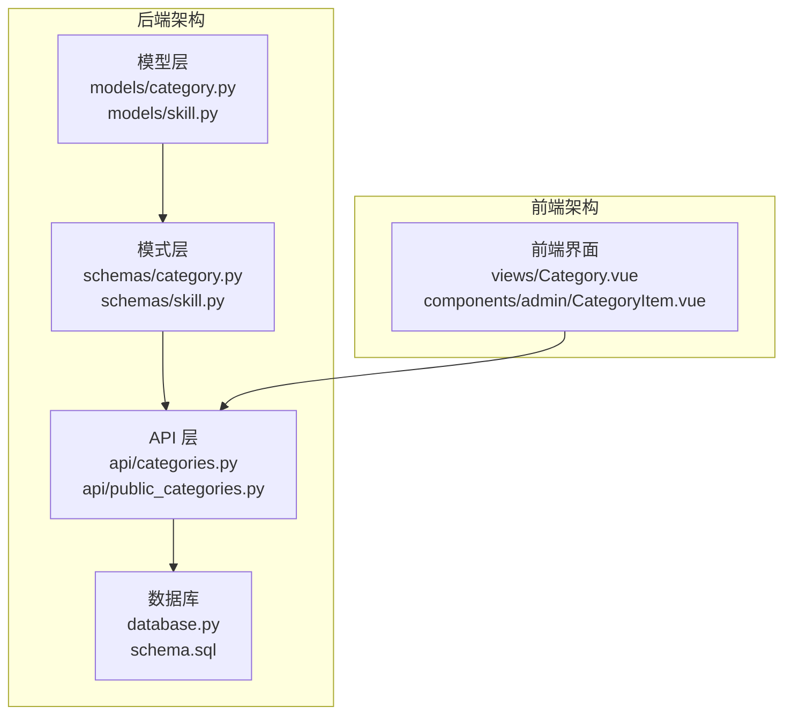

**图表来源**
- [backend/models/category.py](file://backend/models/category.py#L1-L94)
- [backend/schemas/category.py](file://backend/schemas/category.py#L1-L93)
- [backend/api/categories.py](file://backend/api/categories.py#L1-L294)

**章节来源**
- [backend/models/category.py](file://backend/models/category.py#L1-L94)
- [backend/schemas/category.py](file://backend/schemas/category.py#L1-L93)
- [backend/api/categories.py](file://backend/api/categories.py#L1-L294)

## 核心组件

### 分类模型 (Category)

分类模型是整个分类系统的核心，支持多级分类结构和复杂的层级关系。

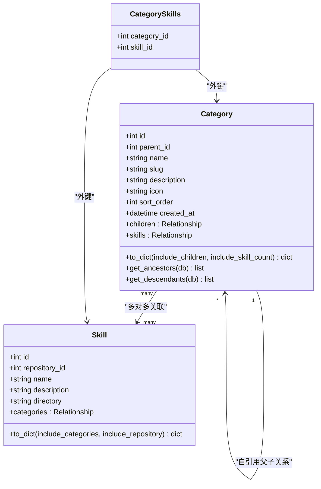

**图表来源**
- [backend/models/category.py](file://backend/models/category.py#L19-L46)
- [backend/models/skill.py](file://backend/models/skill.py#L11-L39)

### 分类 Schema

分类的 Pydantic Schema 提供了数据验证和序列化功能：

| 字段名称 | 类型 | 必填 | 描述 | 验证规则 |
|---------|------|------|------|----------|
| id | int | 否 | 分类 ID | - |
| parent_id | int | 否 | 父分类 ID | - |
| name | string | 是 | 分类名称 | 1-100字符 |
| slug | string | 是 | 分类别名 | 1-100字符，仅小写字母数字连字符 |
| description | string | 否 | 分类描述 | - |
| icon | string | 否 | 图标标识 | 最大50字符 |
| sort_order | int | 否 | 排序权重 | 默认0 |
| created_at | string | 否 | 创建时间 | ISO格式 |
| skill_count | int | 否 | 技能数量 | 默认0 |
| children | list | 否 | 子分类列表 | 递归结构 |

**章节来源**
- [backend/schemas/category.py](file://backend/schemas/category.py#L7-L38)
- [backend/models/category.py](file://backend/models/category.py#L24-L31)

## 架构概览

分类系统采用分层架构设计，确保了良好的代码组织和可维护性：

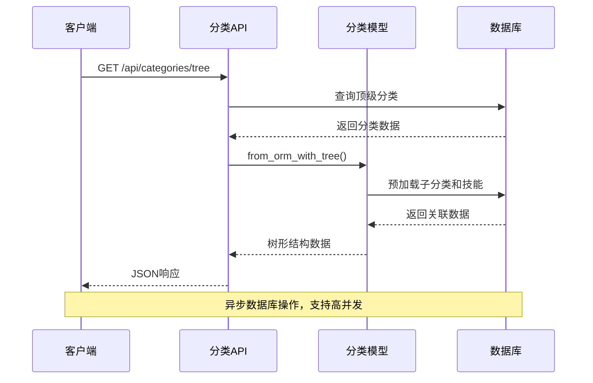

**图表来源**
- [backend/api/categories.py](file://backend/api/categories.py#L24-L47)
- [backend/schemas/category.py](file://backend/schemas/category.py#L42-L78)

## 详细组件分析

### 分类树形结构实现

分类系统实现了完整的树形结构管理，支持无限层级的嵌套分类：

#### 父子关系管理

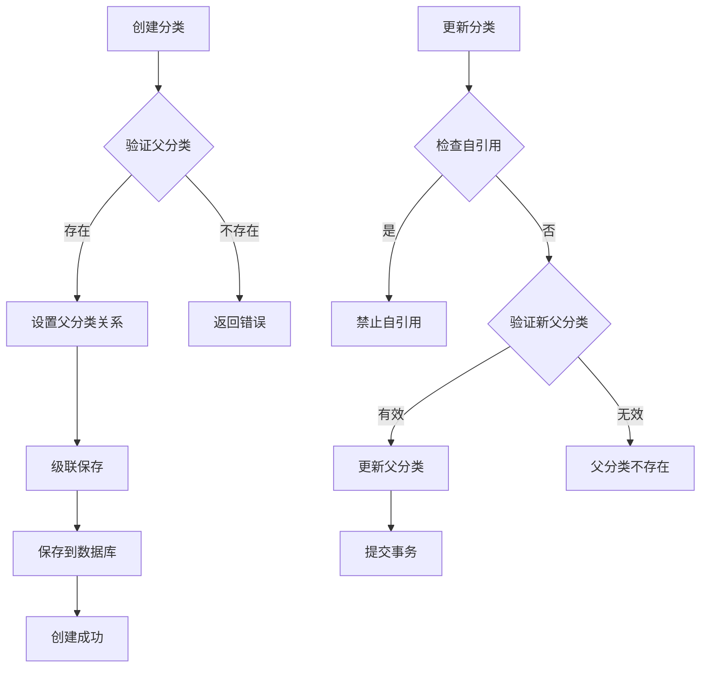

**图表来源**
- [backend/api/categories.py](file://backend/api/categories.py#L98-L180)

#### 路径枚举和层级查询

分类模型提供了祖先和后代的递归查询能力：

| 方法 | 功能 | 复杂度 | 用途 |
|------|------|--------|------|
| get_ancestors() | 获取所有祖先分类 | O(h) | 层级导航 |
| get_descendants() | 获取所有后代分类 | O(n) | 树形遍历 |
| to_dict() | 序列化分类数据 | O(n) | API响应 |

**章节来源**
- [backend/models/category.py](file://backend/models/category.py#L75-L94)

### 分类与技能的多对多关系

分类系统实现了灵活的分类-技能关联机制：

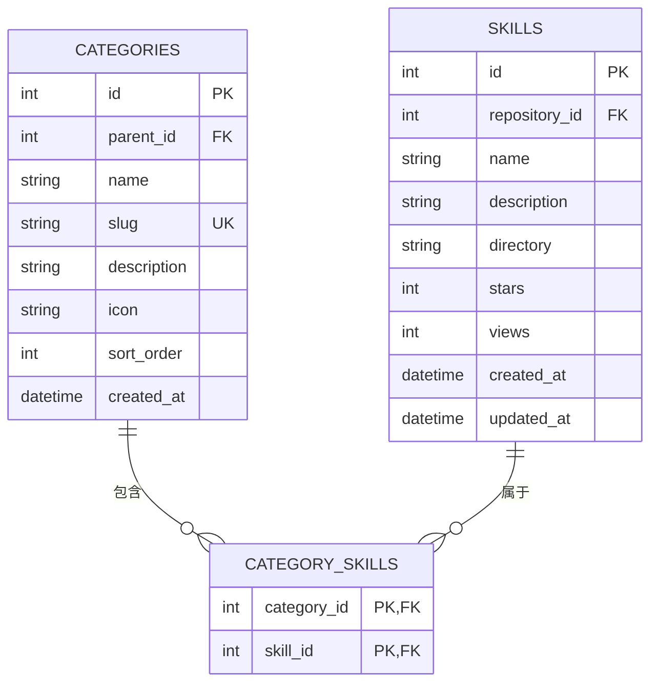

**图表来源**
- [backend/schema.sql](file://backend/schema.sql#L40-L84)

#### 技能分配操作

系统提供了多种技能分配方式：

| 操作 | API端点 | 功能 | 使用场景 |
|------|---------|------|----------|
| 单个分配 | POST /{category_id}/skills/{skill_id} | 将技能分配给分类 | 个别技能管理 |
| 移除分配 | DELETE /{category_id}/skills/{skill_id} | 从分类移除技能 | 取消技能关联 |
| 批量分配 | POST /skills/{skill_id}/categories | 为技能分配多个分类 | 复杂关联管理 |

**章节来源**
- [backend/api/categories.py](file://backend/api/categories.py#L217-L293)

### 创建、移动和删除操作

#### 创建操作流程

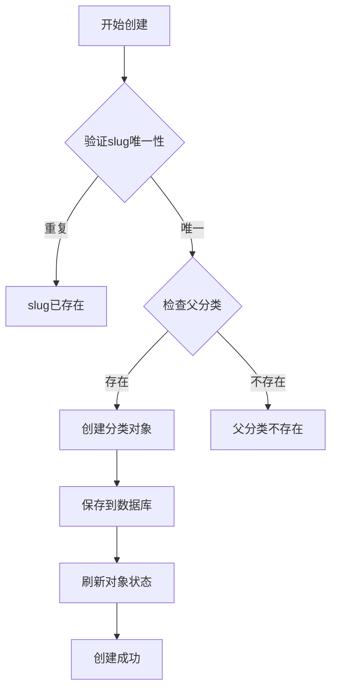

**图表来源**
- [backend/api/categories.py](file://backend/api/categories.py#L87-L120)

#### 删除操作的级联处理

分类删除操作通过数据库级联约束实现完整的级联删除：

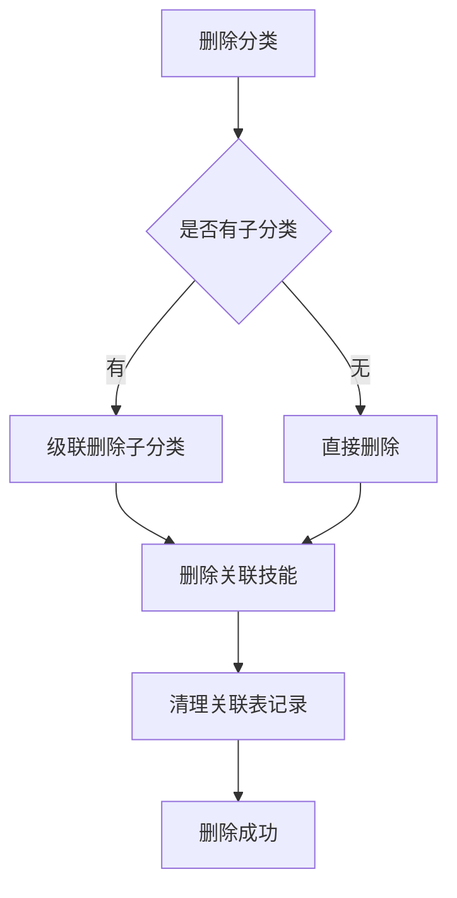

**图表来源**
- [backend/schema.sql](file://backend/schema.sql#L50-L84)

**章节来源**
- [backend/api/categories.py](file://backend/api/categories.py#L202-L215)

### 递归查询优化

#### 预加载策略

系统采用了多种预加载策略来优化递归查询性能：

| 预加载类型 | 使用场景 | 性能优势 |
|------------|----------|----------|
| selectinload | 树形结构查询 | 减少N+1查询问题 |
| lazy加载 | 懒加载子分类 | 按需加载，节省内存 |
| 批量查询 | 批量操作 | 减少数据库往返 |

#### 查询优化技术

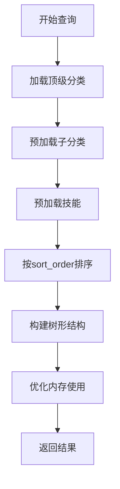

**图表来源**
- [backend/api/categories.py](file://backend/api/categories.py#L30-L47)

**章节来源**
- [backend/api/categories.py](file://backend/api/categories.py#L30-L47)

### 前端集成

#### 分类树形展示

前端使用递归组件实现分类树形结构的动态渲染：

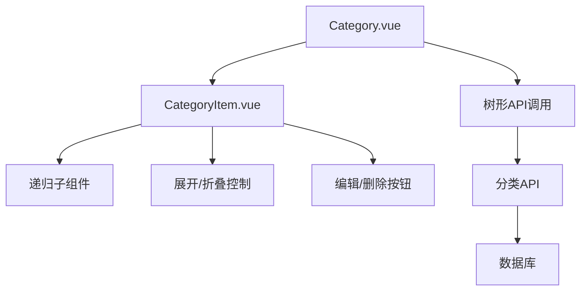

**图表来源**
- [frontend/src/views/Category.vue](file://frontend/src/views/Category.vue#L85-L140)
- [frontend/src/components/admin/CategoryItem.vue](file://frontend/src/components/admin/CategoryItem.vue#L1-L52)

**章节来源**
- [frontend/src/views/Category.vue](file://frontend/src/views/Category.vue#L77-L140)
- [frontend/src/components/admin/CategoryItem.vue](file://frontend/src/components/admin/CategoryItem.vue#L1-L52)

## 依赖关系分析

### 数据库设计

分类系统采用标准的关系型数据库设计，支持完整的数据完整性约束：

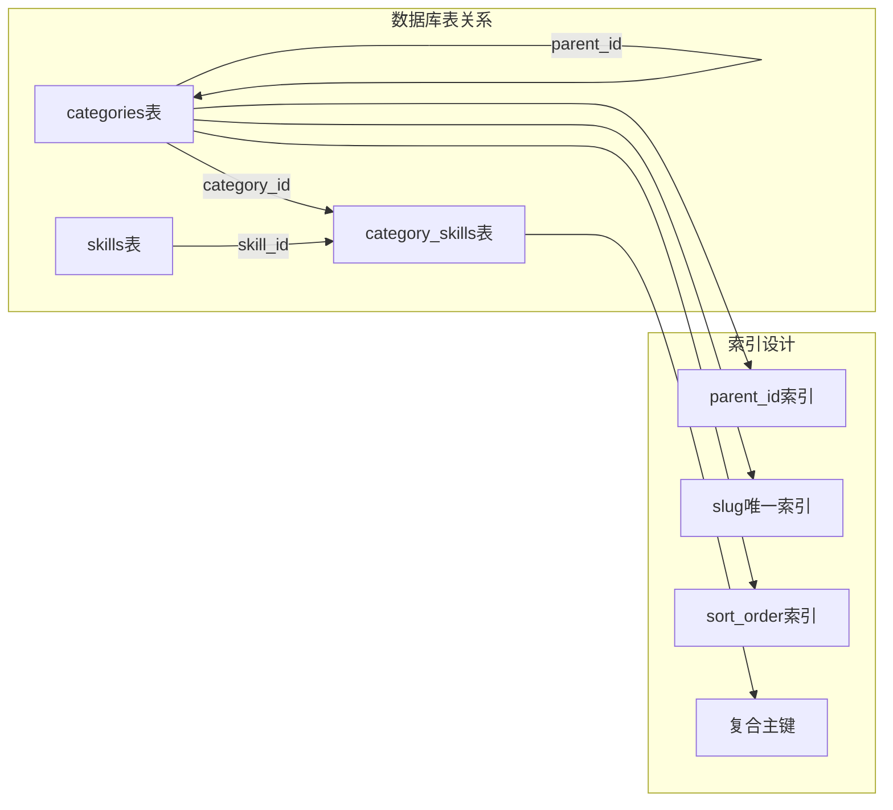

**图表来源**
- [backend/schema.sql](file://backend/schema.sql#L40-L84)

### 外部依赖

系统的主要外部依赖包括：

| 依赖包 | 版本 | 用途 |
|--------|------|------|
| SQLAlchemy | 最新版 | ORM框架 |
| FastAPI | 最新版 | Web框架 |
| aiomysql | 最新版 | 异步MySQL驱动 |
| Pydantic | 最新版 | 数据验证 |
| Python 3.9+ | - | 运行环境 |

**章节来源**
- [backend/database.py](file://backend/database.py#L1-L75)

## 性能考虑

### 数据库性能优化

1. **索引优化**
   - `categories.parent_id` 索引：加速层级查询
   - `categories.slug` 唯一索引：确保slug唯一性
   - `categories.sort_order` 索引：优化排序性能

2. **查询优化**
   - 使用 `selectinload` 预加载关联数据
   - 实现批量查询减少数据库往返
   - 限制查询结果集大小

3. **缓存策略**
   - 分类树形结构缓存
   - 技能数量统计缓存
   - 用户权限缓存

### 异步操作优化

系统采用异步编程模型提高并发性能：

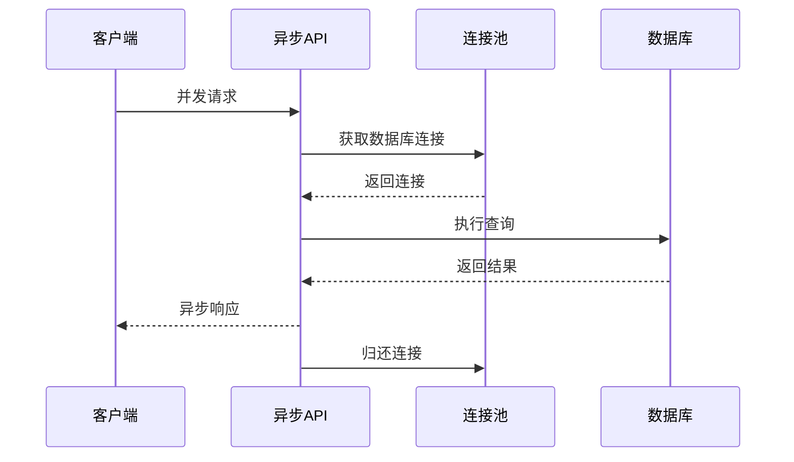

**图表来源**
- [backend/database.py](file://backend/database.py#L42-L56)

## 故障排除指南

### 常见问题及解决方案

#### 分类创建失败

**问题症状**：创建分类时报错
**可能原因**：
- slug重复
- 父分类不存在
- 数据验证失败

**解决步骤**：
1. 检查slug是否唯一
2. 验证父分类ID是否存在
3. 确认必填字段完整

#### 分类移动异常

**问题症状**：更新分类parent_id失败
**可能原因**：
- 自引用检测失败
- 循环引用检测
- 权限不足

**解决步骤**：
1. 检查是否尝试将分类移动到自身
2. 验证目标父分类的有效性
3. 确认用户权限

#### 性能问题

**问题症状**：树形结构加载缓慢
**可能原因**：
- N+1查询问题
- 缺少必要的索引
- 查询结果集过大

**解决步骤**：
1. 检查是否使用了适当的预加载
2. 确认数据库索引存在
3. 实现分页查询

**章节来源**
- [backend/api/categories.py](file://backend/api/categories.py#L87-L120)
- [backend/api/categories.py](file://backend/api/categories.py#L170-L180)

## 结论

Skills Hub 项目的分类模型是一个设计完善的多级分类系统，具有以下特点：

1. **完整的层级支持**：支持无限层级的分类结构，提供完整的祖先和后代查询能力
2. **灵活的关联关系**：实现分类与技能的多对多关联，支持复杂的业务场景
3. **高性能设计**：采用异步数据库操作、预加载策略和索引优化
4. **良好的扩展性**：模块化设计便于功能扩展和维护
5. **完整的前端集成**：提供直观的树形界面和丰富的交互功能

该系统为 Skills Hub 平台提供了强大的内容组织能力，能够满足复杂的内容管理和展示需求。通过合理的架构设计和性能优化，系统能够在高并发环境下稳定运行，为用户提供流畅的使用体验。