# 技能模型

<cite>
**本文档引用的文件**
- [backend/models/skill.py](file://backend/models/skill.py)
- [backend/schemas/skill.py](file://backend/schemas/skill.py)
- [backend/api/skills.py](file://backend/api/skills.py)
- [backend/models/category.py](file://backend/models/category.py)
- [backend/models/repository.py](file://backend/models/repository.py)
- [backend/services/parser.py](file://backend/services/parser.py)
- [backend/services/scanner.py](file://backend/services/scanner.py)
- [backend/schema.sql](file://backend/schema.sql)
- [backend/database.py](file://backend/database.py)
- [backend/main.py](file://backend/main.py)
</cite>

## 目录
1. [简介](#简介)
2. [项目结构](#项目结构)
3. [核心组件](#核心组件)
4. [架构概览](#架构概览)
5. [详细组件分析](#详细组件分析)
6. [依赖关系分析](#依赖关系分析)
7. [性能考虑](#性能考虑)
8. [故障排除指南](#故障排除指南)
9. [结论](#结论)

## 简介

技能模型是技能发现和管理系统的核心数据结构，负责存储和管理从GitHub/GitLab仓库中自动发现的技能信息。该系统通过扫描仓库中的SKILL.md文件来识别技能，每个技能都包含完整的元数据信息，包括技能标题、描述、标签等。

技能模型采用现代化的异步架构设计，基于FastAPI框架和SQLAlchemy ORM，支持MySQL数据库的全文检索功能。系统不仅能够存储技能的基本信息，还能维护复杂的关联关系，包括与仓库的多对一关系和与分类的多对多关系。

## 项目结构

技能模型相关的代码组织遵循清晰的分层架构模式：

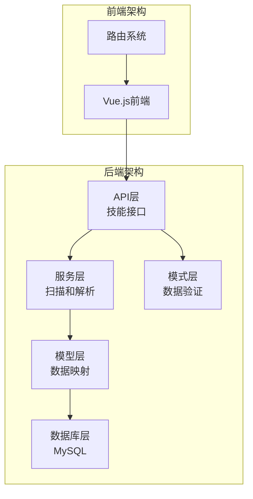

**图表来源**
- [backend/main.py](file://backend/main.py#L46-L85)
- [backend/models/skill.py](file://backend/models/skill.py#L11-L42)

**章节来源**
- [backend/main.py](file://backend/main.py#L1-L137)
- [backend/schema.sql](file://backend/schema.sql#L1-L106)

## 核心组件

技能模型系统由四个核心组件构成，每个组件都有明确的职责和边界：

### 数据模型层
- **Skill模型**: 核心技能实体，包含技能的基本属性和关联关系
- **Repository模型**: 仓库实体，管理GitHub/GitLab仓库的配置和状态
- **Category模型**: 分类实体，支持多级分类结构和技能关联

### 服务层
- **SkillParser**: SKILL.md文件解析器，提取技能元数据
- **SkillScanner**: 技能扫描服务，负责仓库扫描和数据同步

### API层
- **技能接口**: 提供技能的CRUD操作和搜索功能
- **分类接口**: 管理技能分类的API

### 验证层
- **Pydantic模式**: 定义数据验证规则和请求响应格式

**章节来源**
- [backend/models/skill.py](file://backend/models/skill.py#L11-L90)
- [backend/models/repository.py](file://backend/models/repository.py#L18-L74)
- [backend/models/category.py](file://backend/models/category.py#L19-L94)

## 架构概览

技能模型采用分层架构设计，确保了良好的关注点分离和可维护性：

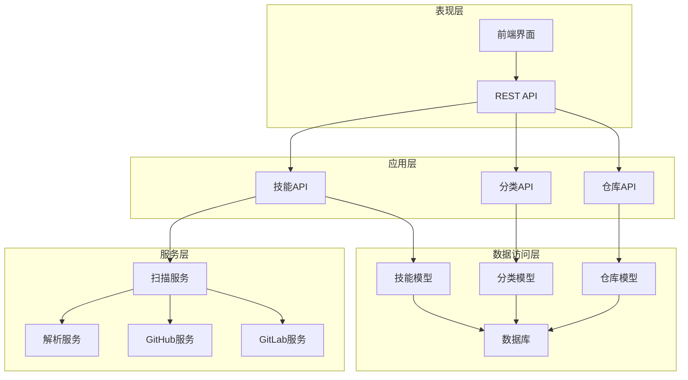

**图表来源**
- [backend/api/skills.py](file://backend/api/skills.py#L1-L160)
- [backend/services/scanner.py](file://backend/services/scanner.py#L21-L197)
- [backend/services/parser.py](file://backend/services/parser.py#L13-L86)

## 详细组件分析

### 技能数据模型设计

技能模型是整个系统的核心，设计时充分考虑了数据完整性、查询效率和扩展性：

#### 核心字段设计

| 字段名 | 类型 | 约束 | 描述 |
|--------|------|------|------|
| id | Integer | 主键 | 技能唯一标识符 |
| repository_id | Integer | 外键 | 关联的仓库ID |
| name | String(255) | 非空 | 技能名称 |
| description | Text | 可空 | 技能描述 |
| directory | String(500) | 非空 | 仓库中的目录路径 |
| repo_owner | String(100) | 可空 | 仓库所有者 |
| repo_name | String(100) | 可空 | 仓库名称 |
| repo_branch | String(50) | 可空 | 仓库分支 |
| readme_url | Text | 可空 | README文件URL |
| raw_content_url | Text | 可空 | 原始内容URL |
| stars | Integer | 默认0 | 星标数量 |
| views | Integer | 默认0 | 浏览次数 |
| created_at | DateTime | 默认当前时间 | 创建时间 |
| updated_at | DateTime | 默认当前时间 | 更新时间 |

#### 关联关系设计

技能模型实现了复杂的多对多关联关系：

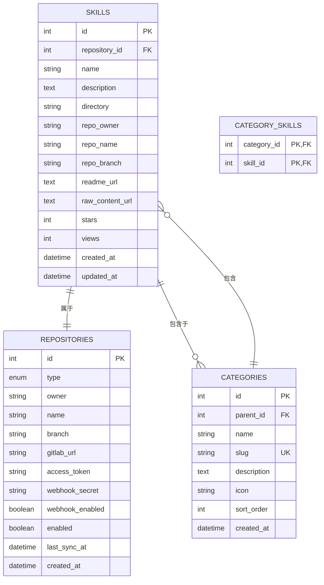

**图表来源**
- [backend/schema.sql](file://backend/schema.sql#L56-L84)
- [backend/models/skill.py](file://backend/models/skill.py#L17-L39)

#### 唯一标识符设计

技能模型提供了灵活的唯一标识符生成机制：

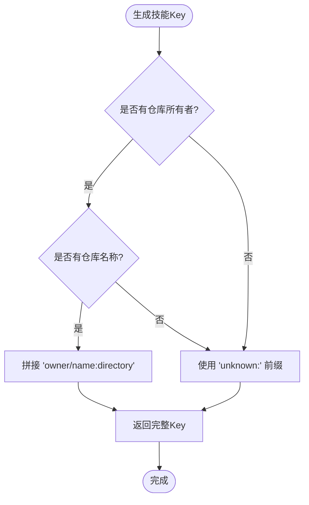

**图表来源**
- [backend/models/skill.py](file://backend/models/skill.py#L79-L84)

**章节来源**
- [backend/models/skill.py](file://backend/models/skill.py#L11-L90)
- [backend/schema.sql](file://backend/schema.sql#L56-L75)

### 技能与仓库的关联关系

仓库模型设计支持多种类型的代码托管平台：

#### 仓库类型枚举

| 类型 | 描述 | 特点 |
|------|------|------|
| GITHUB | GitHub平台 | 支持公共和私有仓库 |
| GITLAB | GitLab平台 | 支持自建实例 |

#### 仓库配置字段

| 字段名 | 类型 | 约束 | 描述 |
|--------|------|------|------|
| type | Enum | 非空 | 仓库类型 |
| owner | String(100) | 非空 | 仓库所有者 |
| name | String(100) | 非空 | 仓库名称 |
| branch | String(50) | 默认'main' | 默认分支 |
| gitlab_url | String(255) | 可空 | GitLab自建实例URL |
| access_token | String(255) | 可空 | 加密存储的访问令牌 |
| webhook_secret | String(255) | 可空 | Webhook密钥 |
| webhook_enabled | Boolean | 默认False | Webhook启用状态 |
| enabled | Boolean | 默认True | 仓库启用状态 |
| last_sync_at | DateTime | 可空 | 最后同步时间 |

#### URL生成机制

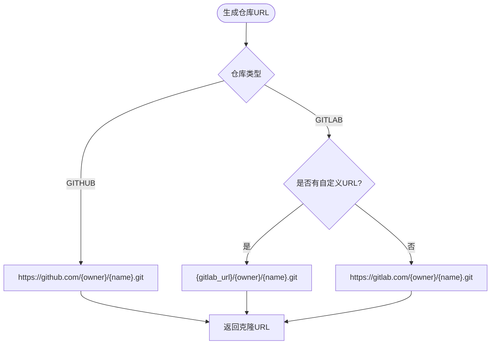

**图表来源**
- [backend/models/repository.py](file://backend/models/repository.py#L60-L74)

**章节来源**
- [backend/models/repository.py](file://backend/models/repository.py#L12-L74)

### 技能内容存储格式和元数据结构

技能内容采用标准化的SKILL.md文件格式，支持YAML前言元数据：

#### SKILL.md文件格式

```markdown
---
name: "技能名称"
description: "技能描述"
tags: ["tag1", "tag2"]
---

技能的详细内容...

```

#### 元数据解析流程

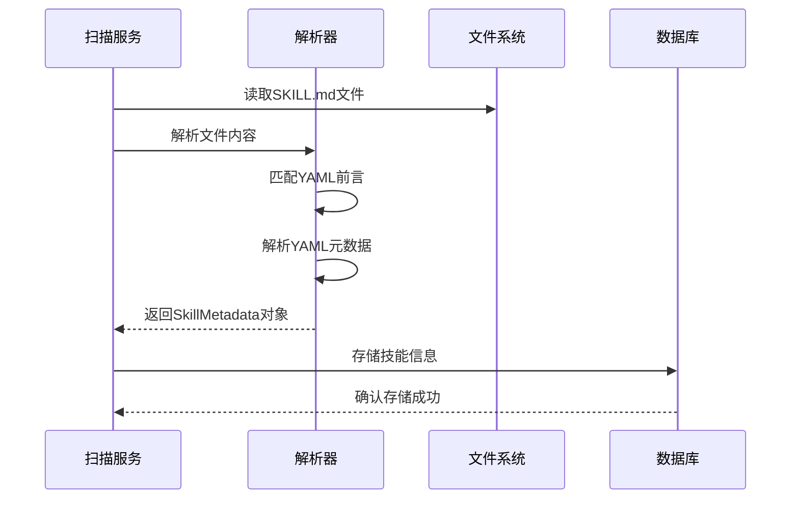

**图表来源**
- [backend/services/scanner.py](file://backend/services/scanner.py#L48-L68)
- [backend/services/parser.py](file://backend/services/parser.py#L35-L70)

#### 元数据字段定义

| 字段名 | 类型 | 默认值 | 描述 |
|--------|------|--------|------|
| name | String | None | 技能名称 |
| description | String | None | 技能描述 |
| directory | String | None | 目录路径 |
| tags | List[String] | [] | 技能标签列表 |

**章节来源**
- [backend/services/parser.py](file://backend/services/parser.py#L13-L86)
- [backend/schemas/skill.py](file://backend/schemas/skill.py#L54-L60)

### 技能搜索和过滤机制

系统提供了强大的搜索和过滤功能，支持多种查询条件：

#### 搜索参数模式

| 参数名 | 类型 | 默认值 | 有效值 | 描述 |
|--------|------|--------|--------|------|
| keyword | String | None | 任意字符串 | 关键词搜索 |
| category_id | Integer | None | 正整数 | 分类ID过滤 |
| repository_id | Integer | None | 正整数 | 仓库ID过滤 |
| page | Integer | 1 | ≥1 | 页码 |
| page_size | Integer | 20 | 1-100 | 每页数量 |
| sort_by | String | "created_at" | "created_at","updated_at","name","stars","views" | 排序字段 |
| sort_order | String | "desc" | "asc","desc" | 排序方向 |

#### 搜索算法实现

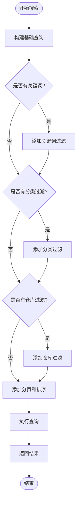

**图表来源**
- [backend/api/skills.py](file://backend/api/skills.py#L18-L95)

#### 全文索引优化

数据库层实现了MySQL全文索引优化：

```sql
FULLTEXT INDEX idx_search (name, description)
```

这种设计确保了关键词搜索的高性能，支持自然语言处理和权重计算。

**章节来源**
- [backend/api/skills.py](file://backend/api/skills.py#L18-L95)
- [backend/schemas/skill.py](file://backend/schemas/skill.py#L43-L52)
- [backend/schema.sql](file://backend/schema.sql#L74-L74)

### 数据验证规则和业务约束

系统实现了多层次的数据验证和业务约束：

#### Pydantic验证规则

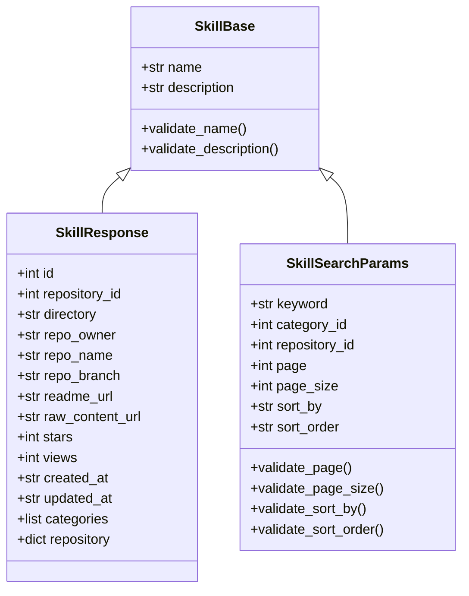

**图表来源**
- [backend/schemas/skill.py](file://backend/schemas/skill.py#L7-L60)

#### 业务约束实现

| 约束类型 | 规则 | 影响范围 |
|----------|------|----------|
| 长度约束 | name: 1-255字符 | 所有技能操作 |
| 数量约束 | page_size: 1-100 | 搜索和列表操作 |
| 格式约束 | sort_by: 枚举值 | 排序操作 |
| 关系约束 | 外键引用 | CRUD操作 |
| 唯一约束 | slug: 唯一 | 分类操作 |

**章节来源**
- [backend/schemas/skill.py](file://backend/schemas/skill.py#L7-L60)

### 性能优化策略和缓存设计

系统采用了多种性能优化策略：

#### 数据库优化

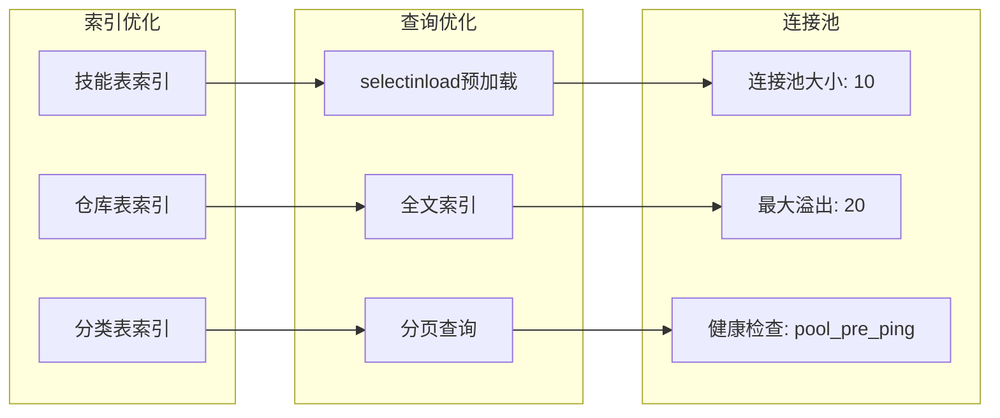

**图表来源**
- [backend/database.py](file://backend/database.py#L20-L36)
- [backend/schema.sql](file://backend/schema.sql#L36-L54)

#### 查询优化策略

1. **N+1查询问题解决**: 使用`selectinload`进行关联预加载
2. **全文索引利用**: MySQL全文索引支持高效关键词搜索
3. **分页机制**: 限制每页查询数量，避免大数据集查询
4. **索引优化**: 为常用查询字段建立索引

#### 缓存策略

虽然当前实现主要依赖数据库查询优化，但可以轻松集成缓存层：

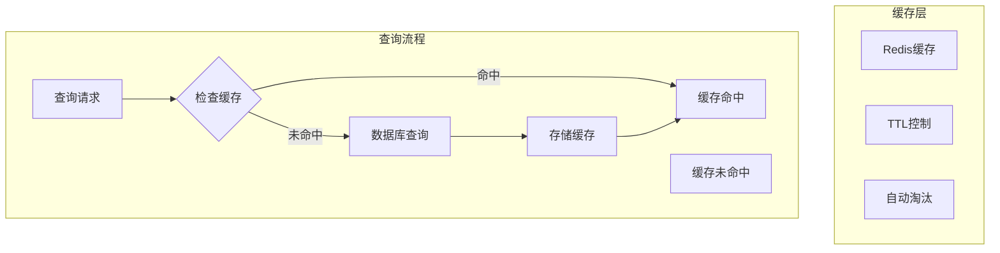

**章节来源**
- [backend/database.py](file://backend/database.py#L20-L36)
- [backend/api/skills.py](file://backend/api/skills.py#L32-L35)

## 依赖关系分析

技能模型系统的依赖关系清晰且层次分明：

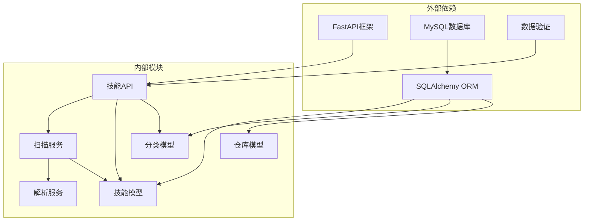

**图表来源**
- [backend/main.py](file://backend/main.py#L24-L84)
- [backend/models/skill.py](file://backend/models/skill.py#L4-L8)

### 组件耦合度分析

系统设计遵循低耦合高内聚原则：

- **API层**与**服务层**松耦合，通过接口抽象隔离
- **模型层**与**数据库层**通过ORM解耦
- **验证层**独立于业务逻辑，便于复用

**章节来源**
- [backend/main.py](file://backend/main.py#L24-L84)
- [backend/models/skill.py](file://backend/models/skill.py#L4-L8)

## 性能考虑

技能模型系统在设计时充分考虑了性能优化：

### 数据库性能优化

1. **索引策略**: 为常用查询字段建立复合索引
2. **连接池配置**: 合理的连接池大小和超时设置
3. **查询优化**: 避免N+1查询问题，使用批量加载

### 缓存策略建议

1. **查询结果缓存**: 缓存热门技能列表和详情
2. **元数据缓存**: 缓存分类和仓库配置信息
3. **CDN集成**: 对静态资源使用CDN加速

### 异步处理

系统采用异步编程模型，提高并发处理能力：

- **异步数据库操作**: 使用SQLAlchemy异步引擎
- **异步文件操作**: 支持大规模文件扫描
- **异步网络请求**: GitHub/GitLab API调用

## 故障排除指南

### 常见问题及解决方案

#### 数据库连接问题

**症状**: 应用启动失败，数据库连接错误
**原因**: 数据库配置不正确或连接池耗尽
**解决方案**: 
1. 检查DATABASE_URL环境变量
2. 验证数据库服务可用性
3. 调整连接池参数

#### 技能扫描失败

**症状**: 技能无法被发现或同步
**原因**: 仓库访问权限不足或网络问题
**解决方案**:
1. 验证仓库访问令牌
2. 检查网络连通性
3. 查看扫描日志

#### 搜索性能问题

**症状**: 搜索响应缓慢
**原因**: 缺少适当的索引或查询优化不足
**解决方案**:
1. 添加必要的数据库索引
2. 优化查询语句
3. 实施查询缓存

**章节来源**
- [backend/database.py](file://backend/database.py#L42-L56)
- [backend/services/scanner.py](file://backend/services/scanner.py#L178-L180)

## 结论

技能模型系统是一个设计精良、功能完整的技能发现和管理平台。其核心优势包括：

1. **清晰的架构设计**: 分层架构确保了良好的可维护性和扩展性
2. **强大的数据模型**: 支持复杂的关联关系和丰富的元数据
3. **高效的搜索机制**: 基于MySQL全文索引的高性能搜索
4. **完善的验证体系**: 多层次的数据验证确保数据完整性
5. **异步处理能力**: 高并发场景下的良好性能表现

系统为技能管理和发现提供了坚实的技术基础，支持企业级的技能知识库建设需求。通过持续的优化和扩展，该系统能够满足不断增长的业务需求。