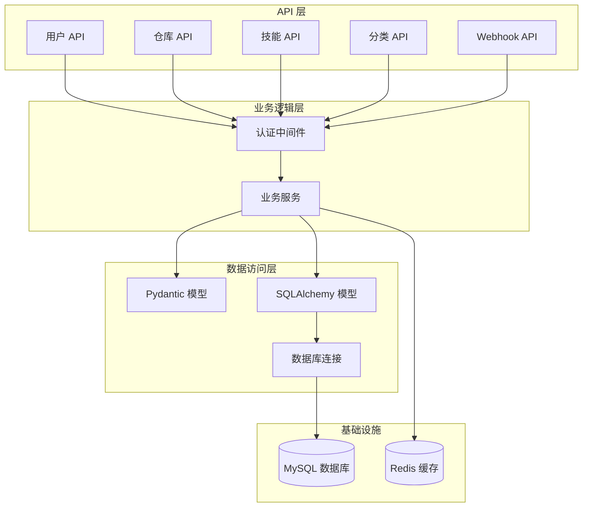
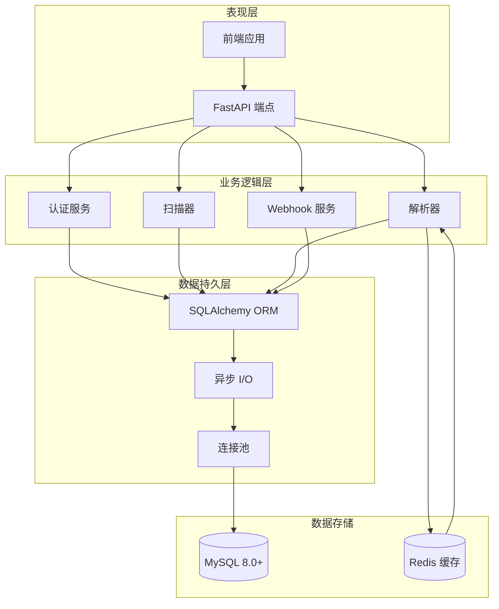
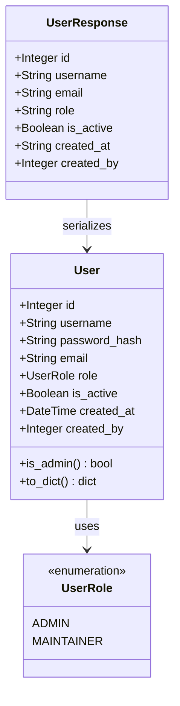
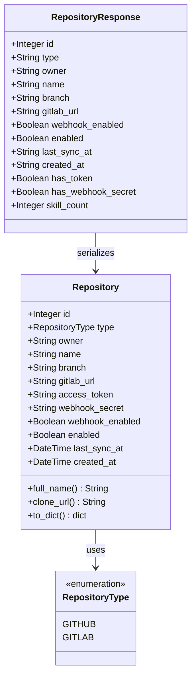
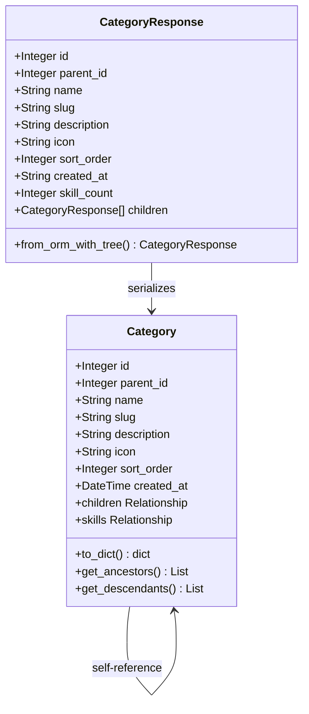
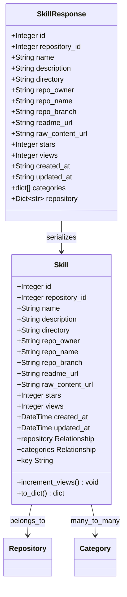
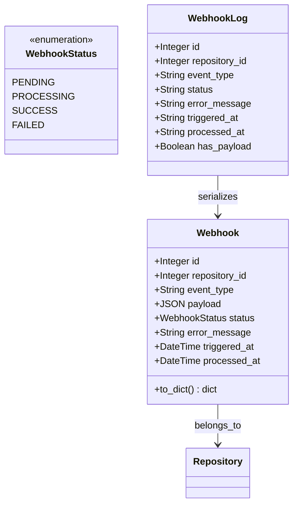
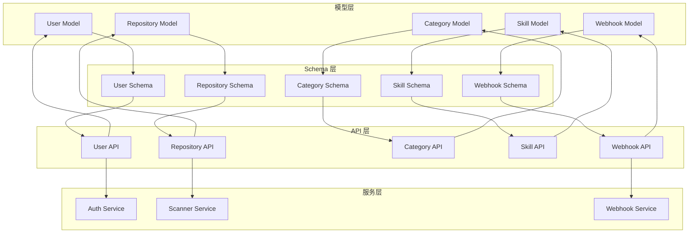
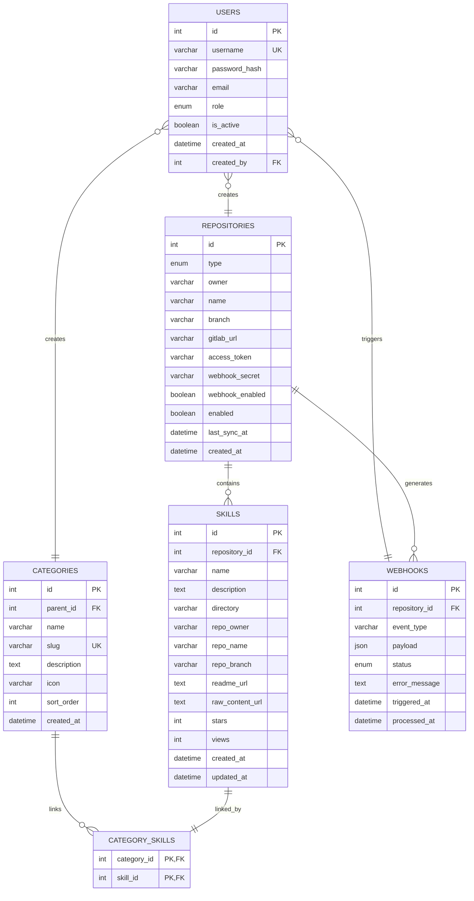
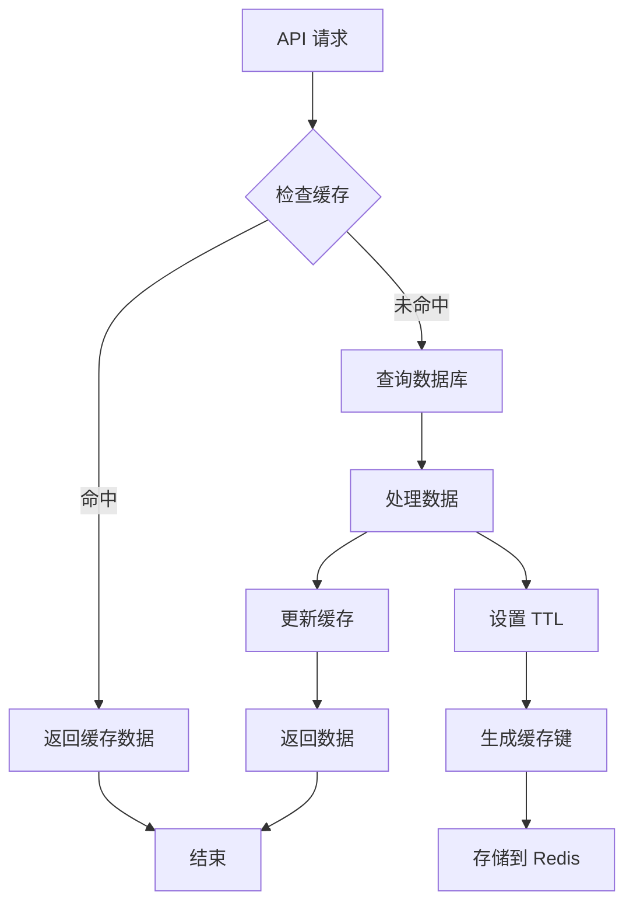

# 数据模型设计

<cite>
**本文档引用的文件**
- [backend/models/__init__.py](file://backend/models/__init__.py)
- [backend/models/user.py](file://backend/models/user.py)
- [backend/models/repository.py](file://backend/models/repository.py)
- [backend/models/category.py](file://backend/models/category.py)
- [backend/models/skill.py](file://backend/models/skill.py)
- [backend/models/webhook.py](file://backend/models/webhook.py)
- [backend/schemas/__init__.py](file://backend/schemas/__init__.py)
- [backend/schemas/user.py](file://backend/schemas/user.py)
- [backend/schemas/repository.py](file://backend/schemas/repository.py)
- [backend/schemas/skill.py](file://backend/schemas/skill.py)
- [backend/schemas/category.py](file://backend/schemas/category.py)
- [backend/database.py](file://backend/database.py)
- [backend/schema.sql](file://backend/schema.sql)
- [backend/api/users.py](file://backend/api/users.py)
- [backend/api/repositories.py](file://backend/api/repositories.py)
- [backend/api/skills.py](file://backend/api/skills.py)
- [backend/api/categories.py](file://backend/api/categories.py)
- [backend/api/webhooks.py](file://backend/api/webhooks.py)
</cite>

## 目录
1. [简介](#简介)
2. [项目结构](#项目结构)
3. [核心组件](#核心组件)
4. [架构概览](#架构概览)
5. [详细组件分析](#详细组件分析)
6. [依赖关系分析](#依赖关系分析)
7. [性能考虑](#性能考虑)
8. [故障排除指南](#故障排除指南)
9. [结论](#结论)

## 简介

Skills Hub 是一个基于 FastAPI 和 SQLAlchemy 的技能知识库平台。本文档深入分析了系统的数据模型设计，包括用户、仓库、技能、分类和 Webhook 数据模型的实体关系。重点阐述了字段定义、数据类型、约束条件和索引设计，以及模型之间的关联关系、外键约束和级联操作。

系统采用异步数据库连接（SQLAlchemy + aiomysql），支持 MySQL 8.0+，实现了完整的 CRUD 操作和复杂的数据查询功能。Pydantic 模型用于 API 序列化和验证，确保了数据传输的一致性和安全性。

## 项目结构

项目采用分层架构设计，主要分为以下层次：

**图表来源**
- [backend/api/users.py](file://backend/api/users.py#L1-L111)
- [backend/api/repositories.py](file://backend/api/repositories.py#L1-L205)
- [backend/api/skills.py](file://backend/api/skills.py#L1-L160)
- [backend/api/categories.py](file://backend/api/categories.py#L1-L294)
- [backend/api/webhooks.py](file://backend/api/webhooks.py#L1-L90)

**章节来源**
- [backend/models/__init__.py](file://backend/models/__init__.py#L1-L20)
- [backend/schemas/__init__.py](file://backend/schemas/__init__.py#L1-L57)

## 核心组件

系统的核心数据模型由五个主要实体组成，每个实体都有明确的职责和约束：

### 用户模型 (User)
- **主键**: id (自增整数)
- **唯一约束**: username
- **枚举类型**: role (ADMIN, MAINTAINER)
- **外键**: created_by (自引用，级联设置为空)
- **索引**: username, role

### 仓库模型 (Repository)
- **主键**: id (自增整数)
- **枚举类型**: type (GITHUB, GITLAB)
- **复合唯一**: (owner, name, branch)
- **索引**: type, enabled, owner, name
- **关系**: 一对多 -> Skills

### 分类模型 (Category)
- **主键**: id (自增整数)
- **唯一约束**: slug
- **自引用**: parent_id -> categories.id (级联删除)
- **索引**: parent_id, slug, sort_order
- **关系**: 多对多 -> Skills (通过中间表)

### 技能模型 (Skill)
- **主键**: id (自增整数)
- **外键**: repository_id -> repositories.id (级联设置为空)
- **全文检索**: name, description (FULLTEXT 索引)
- **索引**: repository_id
- **关系**: 多对多 -> Categories

### Webhook 模型 (Webhook)
- **主键**: id (自增整数)
- **枚举类型**: status (PENDING, PROCESSING, SUCCESS, FAILED)
- **索引**: repository_id, status, triggered_at
- **关系**: 外键 -> repositories.id (级联删除)

**章节来源**
- [backend/models/user.py](file://backend/models/user.py#L18-L52)
- [backend/models/repository.py](file://backend/models/repository.py#L18-L74)
- [backend/models/category.py](file://backend/models/category.py#L19-L94)
- [backend/models/skill.py](file://backend/models/skill.py#L11-L90)
- [backend/models/webhook.py](file://backend/models/webhook.py#L19-L49)

## 架构概览

系统采用经典的三层架构，结合现代异步编程模式：

**图表来源**
- [backend/database.py](file://backend/database.py#L1-L75)
- [backend/api/users.py](file://backend/api/users.py#L1-L111)
- [backend/api/repositories.py](file://backend/api/repositories.py#L1-L205)
- [backend/api/skills.py](file://backend/api/skills.py#L1-L160)
- [backend/api/categories.py](file://backend/api/categories.py#L1-L294)
- [backend/api/webhooks.py](file://backend/api/webhooks.py#L1-L90)

## 详细组件分析

### 用户模型分析

用户模型设计体现了完整的用户管理功能：

**图表来源**
- [backend/models/user.py](file://backend/models/user.py#L12-L52)
- [backend/schemas/user.py](file://backend/schemas/user.py#L44-L54)

关键特性：
- **角色管理**: 支持 ADMIN 和 MAINTAINER 两种角色
- **自引用关系**: created_by 字段实现用户创建记录
- **安全设计**: 密码以哈希形式存储，不返回明文
- **状态控制**: is_active 字段控制用户账户状态

**章节来源**
- [backend/models/user.py](file://backend/models/user.py#L18-L52)
- [backend/schemas/user.py](file://backend/schemas/user.py#L8-L54)

### 仓库模型分析

仓库模型支持多种版本控制系统集成：

**图表来源**
- [backend/models/repository.py](file://backend/models/repository.py#L12-L74)
- [backend/schemas/repository.py](file://backend/schemas/repository.py#L44-L58)

设计特点：
- **多平台支持**: 统一抽象 GITHUB 和 GITLAB 平台差异
- **配置灵活性**: 支持自定义 GitLab 实例地址
- **安全存储**: 敏感信息加密存储
- **Webhook 集成**: 内置 Webhook 支持和状态管理

**章节来源**
- [backend/models/repository.py](file://backend/models/repository.py#L18-L74)
- [backend/schemas/repository.py](file://backend/schemas/repository.py#L7-L58)

### 分类模型分析

分类模型支持复杂的多级分类结构：

**图表来源**
- [backend/models/category.py](file://backend/models/category.py#L19-L94)
- [backend/schemas/category.py](file://backend/schemas/category.py#L31-L79)

核心功能：
- **层级结构**: 支持任意深度的父子关系
- **树形遍历**: 提供祖先和后代节点查询方法
- **性能优化**: 使用 selectinload 预加载关联数据
- **唯一性保证**: slug 字段唯一约束

**章节来源**
- [backend/models/category.py](file://backend/models/category.py#L19-L94)
- [backend/schemas/category.py](file://backend/schemas/category.py#L7-L79)

### 技能模型分析

技能模型是系统的核心实体，承载着技能知识的完整信息：

**图表来源**
- [backend/models/skill.py](file://backend/models/skill.py#L11-L90)
- [backend/schemas/skill.py](file://backend/schemas/skill.py#L13-L32)

设计亮点：
- **全文检索**: 支持 MySQL FULLTEXT 搜索
- **多维关联**: 与仓库和分类建立复杂关系
- **统计功能**: 内置 stars 和 views 计数
- **元数据提取**: 支持从 SKILL.md 解析元数据

**章节来源**
- [backend/models/skill.py](file://backend/models/skill.py#L11-L90)
- [backend/schemas/skill.py](file://backend/schemas/skill.py#L7-L32)

### Webhook 模型分析

Webhook 模型负责处理外部平台的事件通知：

**图表来源**
- [backend/models/webhook.py](file://backend/models/webhook.py#L19-L49)
- [backend/api/webhooks.py](file://backend/api/webhooks.py#L67-L90)

功能特性：
- **状态跟踪**: 完整的处理状态生命周期
- **错误处理**: 详细的错误信息记录
- **性能监控**: 触发时间和处理时间记录
- **安全验证**: 支持签名验证机制

**章节来源**
- [backend/models/webhook.py](file://backend/models/webhook.py#L19-L49)
- [backend/api/webhooks.py](file://backend/api/webhooks.py#L15-L90)

## 依赖关系分析

系统各组件之间的依赖关系清晰明确：

**图表来源**
- [backend/models/__init__.py](file://backend/models/__init__.py#L4-L19)
- [backend/schemas/__init__.py](file://backend/schemas/__init__.py#L4-L57)

### 外键约束关系

**图表来源**
- [backend/schema.sql](file://backend/schema.sql#L7-L106)
- [backend/models/category.py](file://backend/models/category.py#L10-L16)

**章节来源**
- [backend/schema.sql](file://backend/schema.sql#L1-L106)

## 性能考虑

### 查询优化策略

1. **索引设计优化**
   - 用户表: username, role 索引支持快速查找
   - 仓库表: type, enabled, owner, name 复合索引
   - 技能表: repository_id 主键索引，FULLTEXT 全文索引
   - Webhook 表: repository_id, status, triggered_at 多列索引

2. **预加载策略**
   - 使用 selectinload 预加载关联数据，避免 N+1 查询问题
   - 分类树形结构使用 selectinload 同时加载 skills 和 children

3. **连接池配置**
   - 连接池大小: 10
   - 最大溢出连接: 20
   - 连接健康检查: pool_pre_ping=True

### 缓存策略

**图表来源**
- [backend/database.py](file://backend/database.py#L20-L36)

### 数据访问模式

系统采用以下数据访问模式：

1. **Repository 模式**: 每个实体对应独立的 Repository 类
2. **Unit of Work 模式**: 事务边界明确，自动提交和回滚
3. **Lazy Loading**: 关联数据按需加载，减少不必要的查询
4. **Bulk Operations**: 支持批量插入和更新操作

**章节来源**
- [backend/database.py](file://backend/database.py#L42-L75)
- [backend/api/repositories.py](file://backend/api/repositories.py#L26-L46)

## 故障排除指南

### 常见问题及解决方案

1. **数据库连接问题**
   - 检查 DATABASE_URL 环境变量配置
   - 验证 MySQL 服务器可达性和认证信息
   - 查看连接池配置是否合理

2. **模型同步问题**
   - 确认数据库版本兼容性 (MySQL 8.0+)
   - 检查外键约束和索引完整性
   - 验证枚举值的有效性

3. **性能问题诊断**
   - 使用 EXPLAIN 分析慢查询
   - 检查索引使用情况
   - 监控连接池使用率

4. **序列化错误**
   - 验证 Pydantic 模型字段类型
   - 检查日期时间格式化
   - 确认嵌套对象的序列化

**章节来源**
- [backend/database.py](file://backend/database.py#L58-L75)
- [backend/schema.sql](file://backend/schema.sql#L1-L106)

## 结论

Skills Hub 的数据模型设计体现了现代 Web 应用的最佳实践：

1. **清晰的领域建模**: 每个实体都有明确的职责和边界
2. **完善的约束设计**: 外键约束、唯一约束和枚举约束确保数据完整性
3. **高效的查询设计**: 合理的索引策略和预加载机制优化性能
4. **安全的架构设计**: 敏感信息加密存储，权限控制严格
5. **可扩展的架构**: 模块化设计支持功能扩展和维护

系统通过 SQLAlchemy ORM 提供了强大的数据持久化能力，结合 Pydantic 模型确保了 API 接口的一致性和可靠性。异步数据库连接和连接池配置保证了系统的高性能和高可用性。