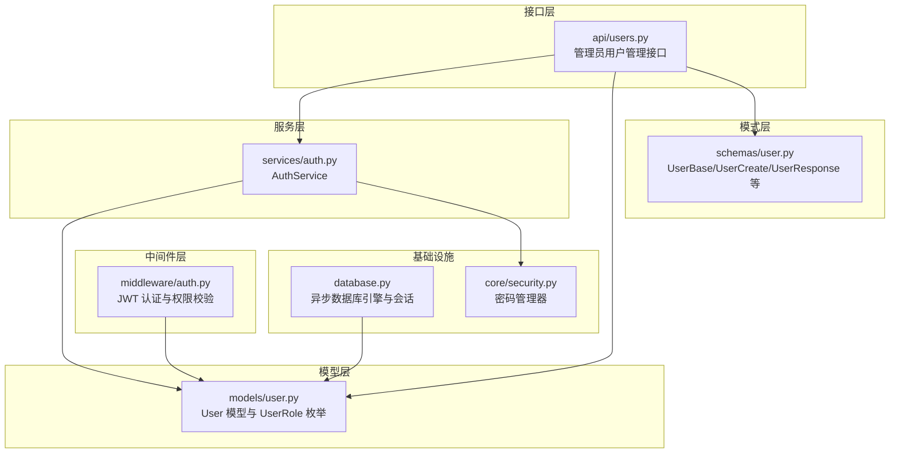
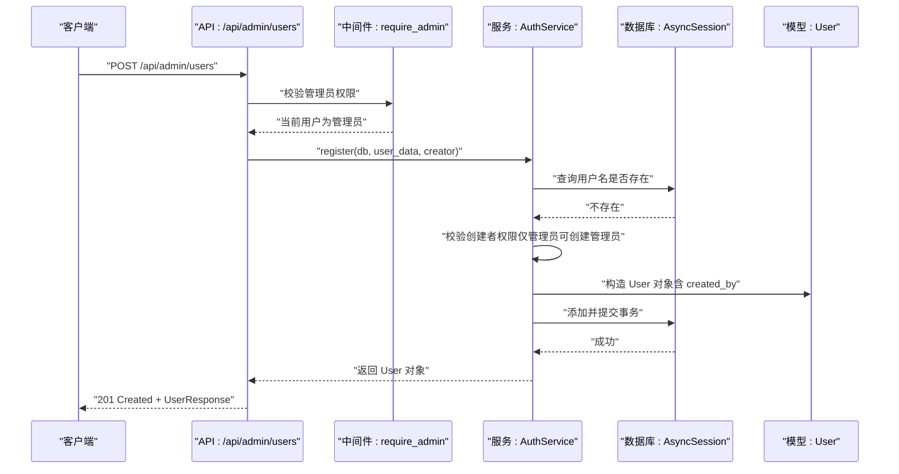
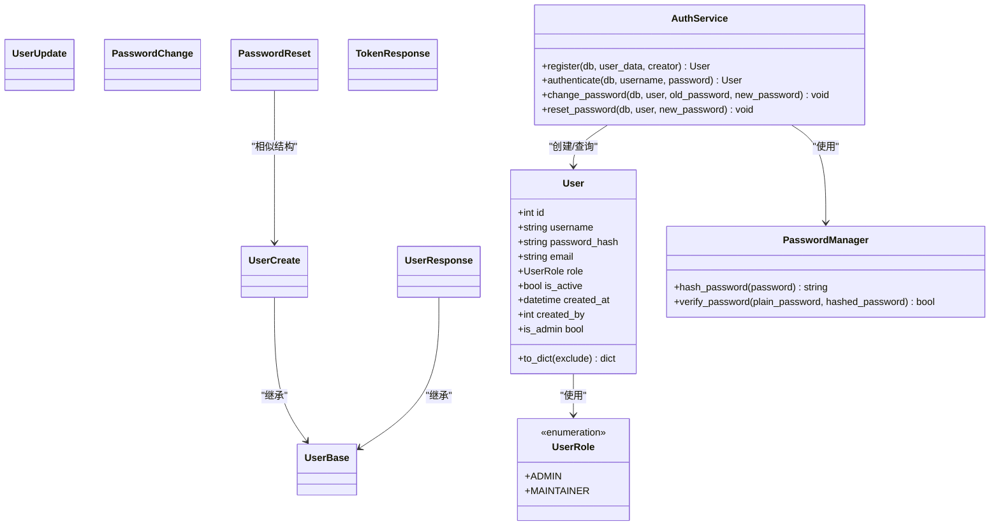

# 用户模型

<cite>
**本文档引用的文件**
- [backend/models/user.py](file://backend/models/user.py)
- [backend/schemas/user.py](file://backend/schemas/user.py)
- [backend/api/users.py](file://backend/api/users.py)
- [backend/services/auth.py](file://backend/services/auth.py)
- [backend/middleware/auth.py](file://backend/middleware/auth.py)
- [backend/database.py](file://backend/database.py)
- [backend/core/security.py](file://backend/core/security.py)
- [backend/main.py](file://backend/main.py)
</cite>

## 目录
1. [简介](#简介)
2. [项目结构](#项目结构)
3. [核心组件](#核心组件)
4. [架构总览](#架构总览)
5. [详细组件分析](#详细组件分析)
6. [依赖分析](#依赖分析)
7. [性能考虑](#性能考虑)
8. [故障排除指南](#故障排除指南)
9. [结论](#结论)
10. [附录](#附录)

## 简介
本文件面向后端开发者与产品团队，系统性阐述用户数据模型的设计与实现，涵盖：
- 用户角色枚举（ADMIN、MAINTAINER）的语义与约束
- 字段定义与约束条件（用户名、密码哈希、邮箱、角色、激活状态等）
- 关联关系设计（自引用外键 created_by 用于记录创建者）
- 权限系统设计思路（管理员与维护者的区别）
- 序列化方法 to_dict 的实现细节（敏感信息过滤、日期格式化）
- 使用示例与最佳实践

## 项目结构
用户模型位于后端目录中，采用分层架构：
- models 层：定义 ORM 模型与枚举
- schemas 层：定义 Pydantic 校验模型
- api 层：定义用户管理的 API 接口（仅管理员）
- services 层：封装业务逻辑（注册、认证、改密、重置）
- middleware 层：认证中间件与权限校验
- database 层：数据库连接与会话管理
- core 层：安全工具（密码管理）

图表来源
- [backend/models/user.py](file://backend/models/user.py#L1-L52)
- [backend/schemas/user.py](file://backend/schemas/user.py#L1-L96)
- [backend/api/users.py](file://backend/api/users.py#L1-L111)
- [backend/services/auth.py](file://backend/services/auth.py#L1-L130)
- [backend/middleware/auth.py](file://backend/middleware/auth.py#L1-L134)
- [backend/database.py](file://backend/database.py#L1-L75)
- [backend/core/security.py](file://backend/core/security.py#L1-L64)

章节来源
- [backend/models/user.py](file://backend/models/user.py#L1-L52)
- [backend/schemas/user.py](file://backend/schemas/user.py#L1-L96)
- [backend/api/users.py](file://backend/api/users.py#L1-L111)
- [backend/services/auth.py](file://backend/services/auth.py#L1-L130)
- [backend/middleware/auth.py](file://backend/middleware/auth.py#L1-L134)
- [backend/database.py](file://backend/database.py#L1-L75)
- [backend/core/security.py](file://backend/core/security.py#L1-L64)

## 核心组件
- 用户角色枚举（UserRole）：定义 ADMIN 与 MAINTAINER 两种角色，用于权限控制与业务判断。
- 用户模型（User）：定义用户表结构、字段约束、自引用外键 created_by，并提供 to_dict 序列化方法与 is_admin 属性。
- 用户相关 Pydantic 模式：UserBase、UserCreate、UserUpdate、UserResponse、PasswordChange、PasswordReset、TokenResponse 等，负责输入输出校验与序列化。
- 认证服务（AuthService）：封装注册、认证、改密、重置密码等业务逻辑，并处理角色与创建者权限校验。
- 管理员用户管理 API：提供用户列表、创建、查询、更新、删除、重置密码等接口，均需管理员权限。
- JWT 认证中间件：提供令牌解析、当前用户解析、管理员权限校验等能力。
- 数据库与安全：异步数据库引擎、会话管理、密码哈希与验证工具。

章节来源
- [backend/models/user.py](file://backend/models/user.py#L12-L52)
- [backend/schemas/user.py](file://backend/schemas/user.py#L8-L96)
- [backend/services/auth.py](file://backend/services/auth.py#L19-L127)
- [backend/api/users.py](file://backend/api/users.py#L14-L111)
- [backend/middleware/auth.py](file://backend/middleware/auth.py#L48-L108)
- [backend/database.py](file://backend/database.py#L20-L56)
- [backend/core/security.py](file://backend/core/security.py#L12-L58)

## 架构总览
用户模型贯穿“接口层-服务层-模型层”的调用链路，配合中间件完成认证与授权，通过数据库层持久化。

图表来源
- [backend/api/users.py](file://backend/api/users.py#L28-L36)
- [backend/middleware/auth.py](file://backend/middleware/auth.py#L98-L108)
- [backend/services/auth.py](file://backend/services/auth.py#L22-L62)
- [backend/models/user.py](file://backend/models/user.py#L18-L31)

## 详细组件分析

### 用户角色与权限系统
- 角色定义：ADMIN（管理员）与 MAINTAINER（维护者）。管理员拥有最高权限，可创建其他管理员；维护者仅能进行日常维护工作。
- 权限校验流程：
  - 注册时，若请求角色为 ADMIN，则要求当前用户必须为 ADMIN，否则拒绝。
  - 管理员用户管理接口（列表、创建、查询、更新、删除、重置密码）均通过 require_admin 中间件强制校验。
- 设计要点：
  - 通过 is_admin 属性简化权限判断。
  - created_by 字段记录创建者，便于审计与溯源。

章节来源
- [backend/models/user.py](file://backend/models/user.py#L12-L16)
- [backend/models/user.py](file://backend/models/user.py#L48-L51)
- [backend/services/auth.py](file://backend/services/auth.py#L44-L45)
- [backend/api/users.py](file://backend/api/users.py#L14-L14)
- [backend/middleware/auth.py](file://backend/middleware/auth.py#L98-L108)

### 字段定义与约束条件
- 主键与索引：id 为主键且建立索引，提升查询性能。
- 用户名：唯一、非空、长度限制、字符集限制（字母数字下划线连字符），建立索引。
- 密码哈希：非空，存储经密码管理器生成的哈希值。
- 邮箱：可空，符合 EmailStr 格式。
- 角色：枚举类型，非空，默认为 MAINTAINER。
- 激活状态：布尔值，默认为 True。
- 创建时间：自动记录 UTC 时间。
- 自引用外键 created_by：指向 users.id，可空，用于记录创建者。

章节来源
- [backend/models/user.py](file://backend/models/user.py#L23-L30)

### 关联关系与自引用外键
- created_by 外键：User 表自引用，指向自身 id，表示该记录由哪位用户创建。
- 用途：审计日志、责任追溯、统计创建者贡献等。
- 注意事项：当用户被删除时，建议级联或清理相关 created_by 指向，避免悬挂引用（当前 API 删除未展示级联策略，需在数据库层面或服务层补充）。

章节来源
- [backend/models/user.py](file://backend/models/user.py#L30-L30)
- [backend/services/auth.py](file://backend/services/auth.py#L54-L54)

### 序列化方法 to_dict
- 敏感信息过滤：默认排除 password_hash，确保不会泄露哈希值。
- 字段映射：包含 id、username、email、role（枚举转字符串）、is_active、created_at（ISO 8601 字符串）、created_by。
- 日期格式化：created_at 使用 ISO 8601 格式字符串，便于前端统一解析。
- 扩展性：支持传入额外的 exclude 集合，灵活控制输出字段。

章节来源
- [backend/models/user.py](file://backend/models/user.py#L35-L46)

### 用户相关 Pydantic 模式
- UserBase：基础字段 username、email，用于复用。
- UserCreate：创建用户时的输入模式，包含密码与角色（默认 maintainer），并进行密码强度校验。
- UserUpdate：更新用户信息时的输入模式，支持 email 与 is_active。
- UserResponse：API 响应模式，包含 id、role、is_active、created_at（字符串）、created_by。
- PasswordChange/PasswordReset：密码变更与管理员重置模式，均进行密码强度校验。
- TokenResponse：登录成功后的响应结构，包含 access_token 与 user（基于 UserResponse）。

章节来源
- [backend/schemas/user.py](file://backend/schemas/user.py#L8-L54)
- [backend/schemas/user.py](file://backend/schemas/user.py#L56-L96)

### 认证服务 AuthService
- register：检查用户名唯一性，校验角色创建权限（仅 ADMIN 可创建 ADMIN），生成密码哈希，设置 created_by，持久化并返回用户对象。
- authenticate：根据用户名查找用户，校验账户激活状态与密码哈希，成功则记录日志。
- change_password：校验旧密码正确性后更新为新密码哈希。
- reset_password：管理员重置指定用户的密码哈希。

章节来源
- [backend/services/auth.py](file://backend/services/auth.py#L22-L62)
- [backend/services/auth.py](file://backend/services/auth.py#L64-L98)
- [backend/services/auth.py](file://backend/services/auth.py#L100-L114)
- [backend/services/auth.py](file://backend/services/auth.py#L116-L126)

### 管理员用户管理 API
- 路由前缀：/api/admin/users，标签：Users。
- 列表接口：按创建时间倒序返回用户列表，使用 UserResponse 序列化。
- 创建接口：仅管理员可调用，调用 AuthService.register 完成创建。
- 查询接口：返回单个用户详情。
- 更新接口：支持更新邮箱与激活状态。
- 删除接口：禁止删除当前用户；校验用户存在后执行删除。
- 重置密码接口：管理员重置指定用户的密码。

章节来源
- [backend/api/users.py](file://backend/api/users.py#L14-L111)

### JWT 认证中间件
- create_access_token：生成带过期时间的 JWT。
- decode_token：解码并校验签名与过期时间。
- get_current_user：从 Authorization 头解析令牌，加载用户并校验账户状态。
- require_admin：校验当前用户是否为 ADMIN，否则返回 403。
- get_optional_user：可选认证，适合匿名场景。

章节来源
- [backend/middleware/auth.py](file://backend/middleware/auth.py#L25-L33)
- [backend/middleware/auth.py](file://backend/middleware/auth.py#L36-L45)
- [backend/middleware/auth.py](file://backend/middleware/auth.py#L48-L95)
- [backend/middleware/auth.py](file://backend/middleware/auth.py#L98-L108)
- [backend/middleware/auth.py](file://backend/middleware/auth.py#L112-L133)

### 数据库与安全
- 数据库：使用 SQLAlchemy 异步引擎与会话工厂，支持连接池与健康检查。
- 安全：使用 argon2 进行密码哈希与校验，避免 bcrypt 的长度限制问题；提供敏感数据加密工具（Fernet）。

章节来源
- [backend/database.py](file://backend/database.py#L20-L36)
- [backend/core/security.py](file://backend/core/security.py#L12-L28)
- [backend/core/security.py](file://backend/core/security.py#L31-L53)

## 依赖分析
用户模型的依赖关系如下：

图表来源
- [backend/models/user.py](file://backend/models/user.py#L12-L52)
- [backend/schemas/user.py](file://backend/schemas/user.py#L8-L96)
- [backend/services/auth.py](file://backend/services/auth.py#L19-L127)
- [backend/core/security.py](file://backend/core/security.py#L12-L28)

章节来源
- [backend/models/user.py](file://backend/models/user.py#L12-L52)
- [backend/schemas/user.py](file://backend/schemas/user.py#L8-L96)
- [backend/services/auth.py](file://backend/services/auth.py#L19-L127)
- [backend/core/security.py](file://backend/core/security.py#L12-L28)

## 性能考虑
- 索引优化：用户名字段建立唯一索引，提升查询与去重效率。
- 异步数据库：使用异步引擎与会话，降低并发阻塞风险。
- 密码哈希：采用 argon2，兼顾安全性与性能；避免在高频路径重复计算。
- 序列化：to_dict 默认排除敏感字段，减少网络传输与序列化开销。
- 建议：在高频查询场景下，考虑对 created_at、created_by 建立复合索引以优化排序与过滤。

## 故障排除指南
- 无法创建管理员用户
  - 现象：提示“仅管理员可创建管理员用户”。
  - 原因：当前用户不是 ADMIN。
  - 处理：使用 ADMIN 账户发起请求。
  - 参考
    - [backend/services/auth.py](file://backend/services/auth.py#L44-L45)
- 用户名冲突
  - 现象：提示“用户名已存在”。
  - 原因：用户名重复。
  - 处理：更换唯一用户名。
  - 参考
    - [backend/services/auth.py](file://backend/services/auth.py#L32-L41)
- 当前用户不可删除
  - 现象：提示“不能删除自己”。
  - 原因：删除接口禁止自我删除。
  - 处理：使用其他管理员账户删除。
  - 参考
    - [backend/api/users.py](file://backend/api/users.py#L81-L83)
- 密码强度不满足
  - 现象：创建或修改密码时报错。
  - 原因：密码需包含大小写字母与数字。
  - 处理：按规则设置密码。
  - 参考
    - [backend/schemas/user.py](file://backend/schemas/user.py#L19-L29)
    - [backend/schemas/user.py](file://backend/schemas/user.py#L61-L71)
    - [backend/schemas/user.py](file://backend/schemas/user.py#L78-L88)

## 结论
用户模型通过清晰的角色枚举、严格的字段约束与完善的序列化机制，构建了安全、可审计、易扩展的用户体系。结合管理员专用的用户管理 API 与 JWT 权限中间件，实现了细粒度的权限控制与良好的用户体验。建议在后续版本中完善 created_by 的级联策略与审计日志，进一步增强系统的完整性与可追溯性。

## 附录

### 使用示例与最佳实践
- 创建用户（管理员）
  - 步骤：使用 ADMIN 账户调用创建接口，传入用户名、邮箱、密码与角色（默认 maintainer）。
  - 注意：若角色为 admin，当前用户必须为 ADMIN。
  - 参考
    - [backend/api/users.py](file://backend/api/users.py#L28-L36)
    - [backend/services/auth.py](file://backend/services/auth.py#L22-L62)
- 查询用户列表
  - 步骤：管理员调用列表接口，按创建时间倒序查看用户。
  - 输出：使用 UserResponse 序列化，自动排除敏感字段。
  - 参考
    - [backend/api/users.py](file://backend/api/users.py#L17-L25)
    - [backend/models/user.py](file://backend/models/user.py#L35-L46)
- 更新用户信息
  - 步骤：管理员调用更新接口，可更新邮箱与激活状态。
  - 参考
    - [backend/api/users.py](file://backend/api/users.py#L52-L71)
- 修改密码
  - 步骤：用户自行修改密码需提供旧密码与新密码；管理员重置密码无需旧密码。
  - 参考
    - [backend/services/auth.py](file://backend/services/auth.py#L100-L114)
    - [backend/api/users.py](file://backend/api/users.py#L93-L106)
- 权限控制
  - 步骤：所有管理员用户管理接口均需 require_admin 中间件校验。
  - 参考
    - [backend/middleware/auth.py](file://backend/middleware/auth.py#L98-L108)
    - [backend/api/users.py](file://backend/api/users.py#L14-L14)