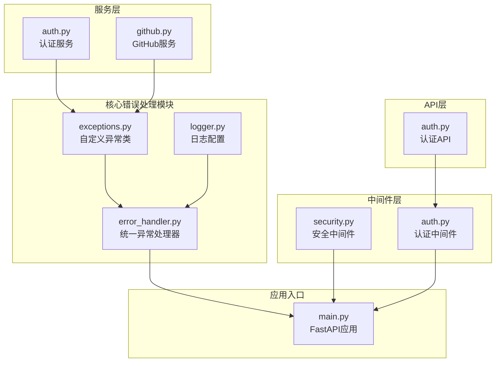
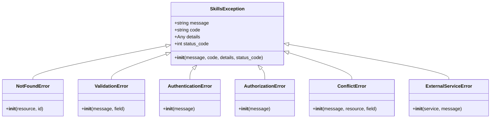
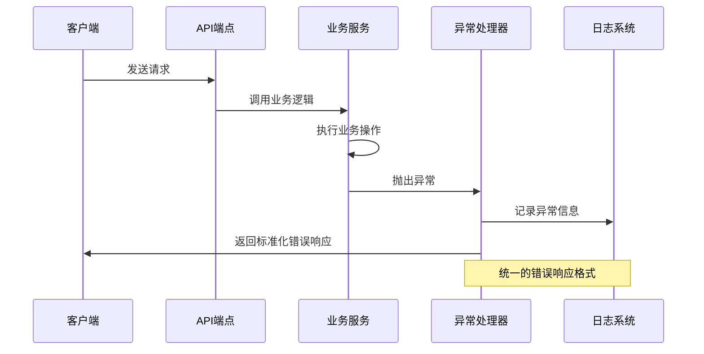
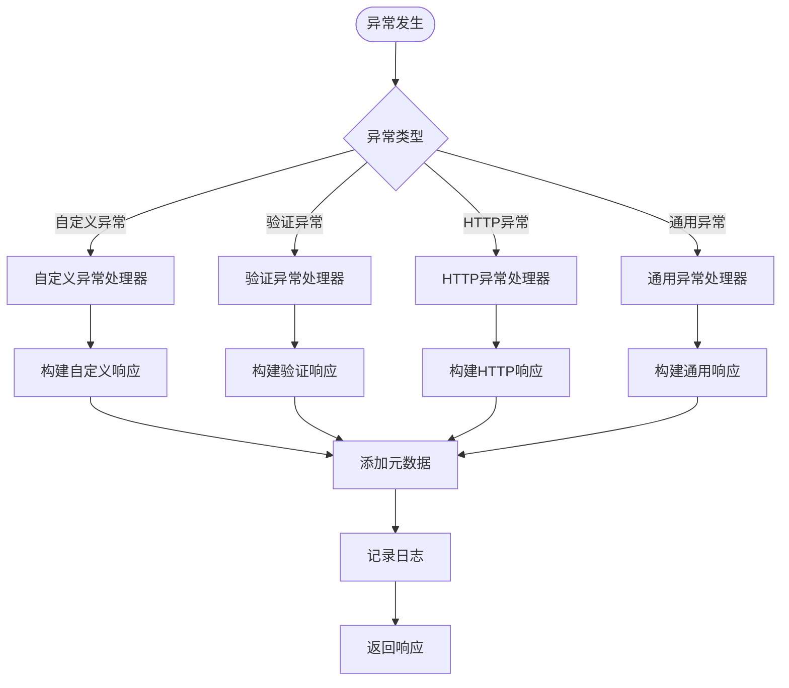
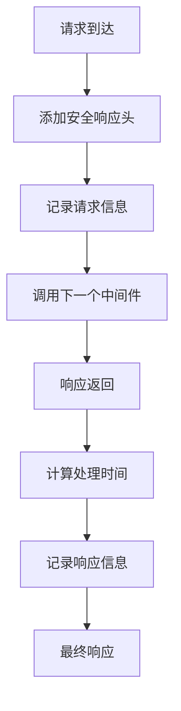
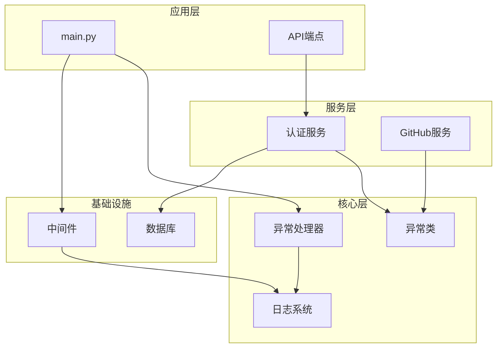

# 错误处理与异常管理

<cite>
**本文档引用的文件**
- [backend/core/error_handler.py](file://backend/core/error_handler.py)
- [backend/core/exceptions.py](file://backend/core/exceptions.py)
- [backend/core/logger.py](file://backend/core/logger.py)
- [backend/main.py](file://backend/main.py)
- [backend/middleware/security.py](file://backend/middleware/security.py)
- [backend/middleware/auth.py](file://backend/middleware/auth.py)
- [backend/services/auth.py](file://backend/services/auth.py)
- [backend/services/github.py](file://backend/services/github.py)
- [backend/database.py](file://backend/database.py)
- [backend/api/auth.py](file://backend/api/auth.py)
</cite>

## 目录
1. [简介](#简介)
2. [项目结构](#项目结构)
3. [核心组件](#核心组件)
4. [架构概览](#架构概览)
5. [详细组件分析](#详细组件分析)
6. [依赖关系分析](#依赖关系分析)
7. [性能考虑](#性能考虑)
8. [故障排查指南](#故障排查指南)
9. [最佳实践](#最佳实践)
10. [结论](#结论)

## 简介

本项目采用统一的错误处理与异常管理体系，通过自定义异常类、统一异常处理器和结构化日志系统，实现了完整的错误处理机制。该体系支持多种异常类型、标准化的错误响应格式，并提供了开发环境和生产环境的差异化配置。

## 项目结构

错误处理与异常管理相关的核心文件分布如下：



**图表来源**
- [backend/core/error_handler.py](file://backend/core/error_handler.py#L1-L102)
- [backend/core/exceptions.py](file://backend/core/exceptions.py#L1-L101)
- [backend/core/logger.py](file://backend/core/logger.py#L1-L95)
- [backend/main.py](file://backend/main.py#L1-L137)

**章节来源**
- [backend/core/error_handler.py](file://backend/core/error_handler.py#L1-L102)
- [backend/core/exceptions.py](file://backend/core/exceptions.py#L1-L101)
- [backend/core/logger.py](file://backend/core/logger.py#L1-L95)
- [backend/main.py](file://backend/main.py#L1-L137)

## 核心组件

### 自定义异常类体系

项目实现了层次化的异常类继承结构，提供专门的异常类型来处理不同场景：



**图表来源**
- [backend/core/exceptions.py](file://backend/core/exceptions.py#L7-L101)

### 统一异常处理器

系统提供了四种级别的异常处理机制：

1. **自定义异常处理**：处理业务逻辑异常
2. **验证异常处理**：处理数据验证错误
3. **HTTP异常处理**：处理标准HTTP状态码异常
4. **通用异常处理**：处理未捕获的系统异常

**章节来源**
- [backend/core/exceptions.py](file://backend/core/exceptions.py#L1-L101)
- [backend/core/error_handler.py](file://backend/core/error_handler.py#L1-L102)

## 架构概览

错误处理系统的整体架构采用分层设计，确保异常能够在正确的层级被处理：



**图表来源**
- [backend/main.py](file://backend/main.py#L70-L74)
- [backend/core/error_handler.py](file://backend/core/error_handler.py#L14-L101)

## 详细组件分析

### 异常分类与错误码设计

#### 业务异常分类

系统根据业务场景将异常分为以下几类：

| 异常类型 | HTTP状态码 | 错误码 | 使用场景 |
|---------|-----------|--------|----------|
| NotFoundError | 404 | NOT_FOUND | 资源不存在 |
| ValidationError | 422 | VALIDATION_ERROR | 数据验证失败 |
| AuthenticationError | 401 | AUTHENTICATION_ERROR | 认证失败 |
| AuthorizationError | 403 | AUTHORIZATION_ERROR | 权限不足 |
| ConflictError | 409 | CONFLICT | 资源冲突 |
| ExternalServiceError | 502 | EXTERNAL_SERVICE_ERROR | 外部服务错误 |

#### 错误响应格式

所有异常都遵循统一的JSON响应格式：



**图表来源**
- [backend/core/error_handler.py](file://backend/core/error_handler.py#L14-L101)

**章节来源**
- [backend/core/exceptions.py](file://backend/core/exceptions.py#L24-L101)
- [backend/core/error_handler.py](file://backend/core/error_handler.py#L14-L101)

### 日志记录策略

#### 多级日志配置

系统采用多层次的日志记录策略：

```mermaid
graph LR
subgraph "日志级别"
INFO[INFO<br/>控制台输出]
ERROR[ERROR<br/>文件轮转]
end
subgraph "日志输出"
Console[控制台输出]
SkillsLog[skills.log<br/>按大小轮转]
ErrorLog[error.log<br/>按时间轮转]
end
subgraph "日志格式"
Format[%(asctime)s | %(levelname)-8s | %(name)s:%(lineno)d | %(message)s]
end
INFO --> Console
INFO --> SkillsLog
ERROR --> ErrorLog
Console --> Format
SkillsLog --> Format
ErrorLog --> Format
```

**图表来源**
- [backend/core/logger.py](file://backend/core/logger.py#L11-L66)

#### 日志上下文管理

系统提供了日志上下文管理器，用于动态添加额外的上下文信息：

**章节来源**
- [backend/core/logger.py](file://backend/core/logger.py#L11-L95)

### 中间件集成

#### 安全中间件

安全中间件负责添加安全响应头和实现基本的请求日志记录：



**图表来源**
- [backend/middleware/security.py](file://backend/middleware/security.py#L11-L59)

#### 速率限制中间件

系统实现了简单的内存级速率限制机制：

**章节来源**
- [backend/middleware/security.py](file://backend/middleware/security.py#L65-L142)

### 服务层异常处理

#### 认证服务异常

认证服务中使用了多种异常类型：

- **认证失败**：使用自定义异常，返回401状态码
- **账户禁用**：使用自定义异常，返回401状态码  
- **密码验证失败**：使用验证异常，返回422状态码

#### 外部服务异常

GitHub服务中对外部API调用失败进行了专门处理：

**章节来源**
- [backend/services/auth.py](file://backend/services/auth.py#L64-L98)
- [backend/services/github.py](file://backend/services/github.py#L73-L97)

## 依赖关系分析

错误处理系统的依赖关系呈现清晰的分层结构：



**图表来源**
- [backend/main.py](file://backend/main.py#L10-L21)
- [backend/core/error_handler.py](file://backend/core/error_handler.py#L1-L12)

**章节来源**
- [backend/main.py](file://backend/main.py#L10-L21)
- [backend/core/error_handler.py](file://backend/core/error_handler.py#L1-L12)

## 性能考虑

### 异常处理性能影响

1. **异常开销**：异常处理比正常流程有额外的性能开销
2. **日志写入**：频繁的日志写入会影响性能
3. **网络调用**：外部服务调用失败会增加延迟

### 优化建议

1. **避免过度使用异常**：对于预期的错误情况，优先使用条件检查
2. **批量日志记录**：减少频繁的日志写入操作
3. **缓存策略**：对频繁访问的资源进行缓存
4. **异步处理**：使用异步I/O操作减少阻塞

## 故障排查指南

### 常见问题诊断

#### 数据库连接问题

当数据库连接失败时，系统会记录警告信息并继续运行：

**章节来源**
- [backend/main.py](file://backend/main.py#L34-L36)
- [backend/database.py](file://backend/database.py#L63-L69)

#### 外部服务调用失败

GitHub API调用失败会被转换为专门的异常类型：

**章节来源**
- [backend/services/github.py](file://backend/services/github.py#L73-L97)

#### 认证相关问题

认证中间件会根据不同的错误情况返回相应的HTTP状态码：

**章节来源**
- [backend/middleware/auth.py](file://backend/middleware/auth.py#L56-L93)

### 调试技巧

1. **启用详细日志**：在开发环境中提高日志级别
2. **使用健康检查**：定期检查系统状态
3. **监控异常频率**：关注异常类型的分布情况
4. **性能基准测试**：定期评估异常处理的性能影响

## 最佳实践

### 开发环境 vs 生产环境

#### 开发环境配置

- **日志级别**：INFO级别，便于调试
- **异常详情**：显示详细的异常堆栈信息
- **CORS设置**：允许所有来源，便于前端开发
- **数据库回滚**：开发时自动回滚事务

#### 生产环境配置

- **日志级别**：ERROR级别，减少日志量
- **异常详情**：隐藏敏感信息，只显示通用错误消息
- **CORS限制**：限制具体的域名来源
- **安全头**：严格的安全响应头配置

### 异常处理最佳实践

1. **明确异常分类**：为每种错误场景选择合适的异常类型
2. **保持错误消息一致性**：使用统一的错误响应格式
3. **记录足够的上下文信息**：包括请求路径、时间戳等
4. **避免泄露敏感信息**：在生产环境中隐藏技术细节
5. **实现优雅降级**：在服务不可用时提供替代方案

### 用户体验考虑

1. **及时反馈**：用户操作后立即得到响应
2. **清晰的错误信息**：提供可理解的错误描述
3. **恢复路径**：指导用户如何解决常见问题
4. **状态保持**：在错误发生时保持用户的界面状态

## 结论

本项目的错误处理与异常管理体系具有以下特点：

1. **层次化设计**：通过继承结构实现了清晰的异常分类
2. **统一响应格式**：所有异常都遵循一致的JSON格式
3. **多级日志策略**：提供了开发和生产环境的不同日志配置
4. **中间件集成**：安全中间件和速率限制器增强了系统的安全性
5. **服务层异常处理**：在业务逻辑层面实现了细粒度的错误处理

该体系为开发者提供了完整的错误处理框架，既保证了系统的稳定性，又提升了用户体验。通过合理的异常分类和标准化的错误响应，系统能够有效地处理各种异常情况，并为后续的系统维护和扩展提供了良好的基础。