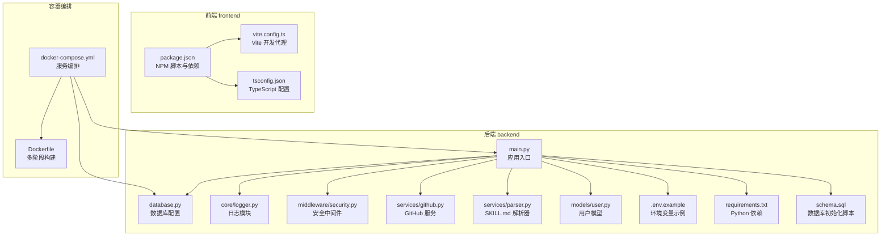
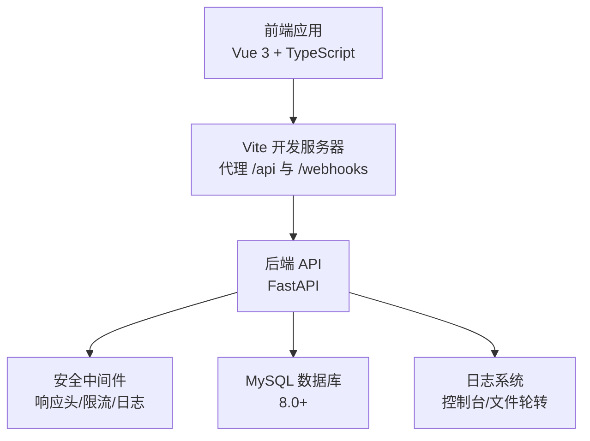
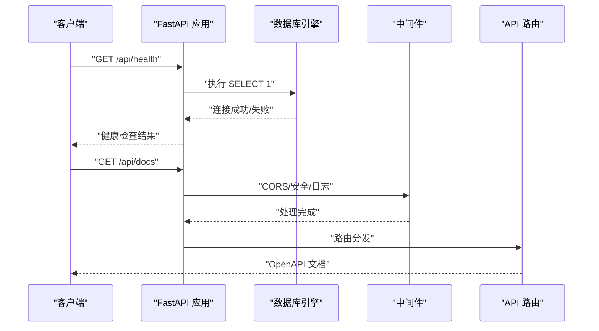
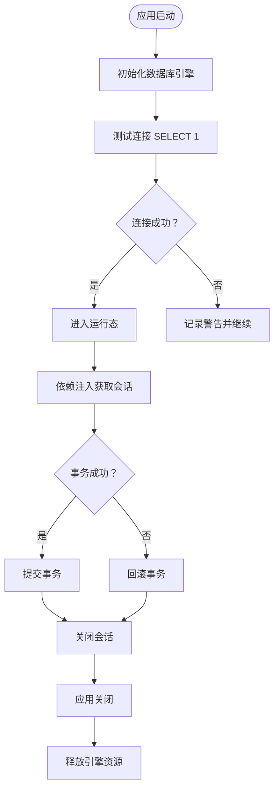
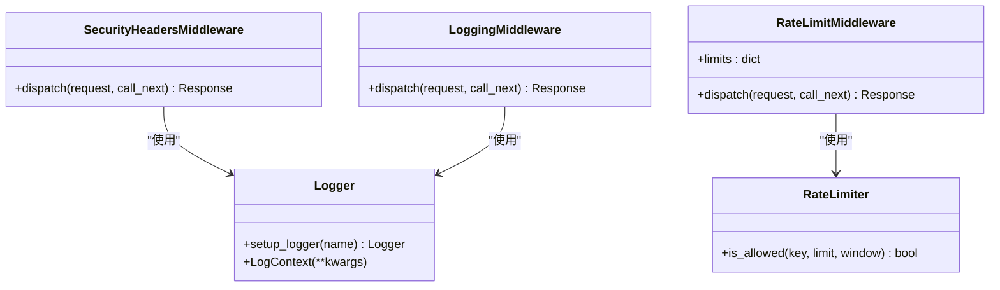
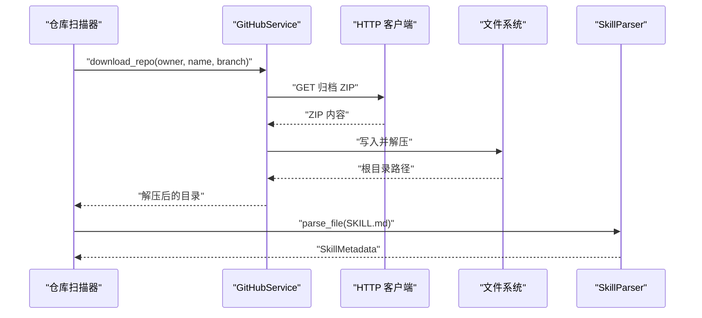
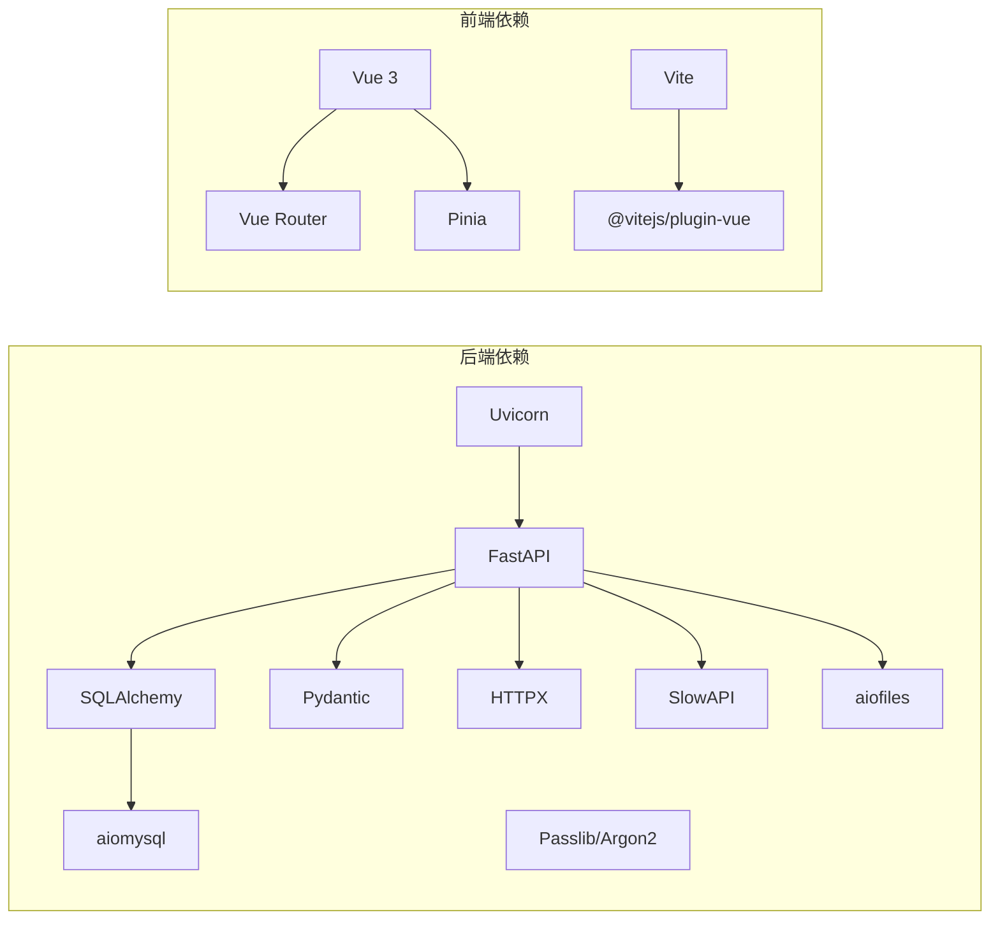

# 开发指南

<cite>
**本文引用的文件**
- [README.md](file://README.md)
- [backend/main.py](file://backend/main.py)
- [backend/database.py](file://backend/database.py)
- [backend/.env.example](file://backend/.env.example)
- [backend/requirements.txt](file://backend/requirements.txt)
- [backend/schema.sql](file://backend/schema.sql)
- [backend/core/logger.py](file://backend/core/logger.py)
- [backend/middleware/security.py](file://backend/middleware/security.py)
- [backend/services/github.py](file://backend/services/github.py)
- [backend/services/parser.py](file://backend/services/parser.py)
- [backend/models/user.py](file://backend/models/user.py)
- [frontend/package.json](file://frontend/package.json)
- [frontend/vite.config.ts](file://frontend/vite.config.ts)
- [frontend/tsconfig.json](file://frontend/tsconfig.json)
- [docker-compose.yml](file://docker-compose.yml)
- [Dockerfile](file://Dockerfile)
</cite>

## 目录
1. [简介](#简介)
2. [项目结构](#项目结构)
3. [核心组件](#核心组件)
4. [架构总览](#架构总览)
5. [详细组件分析](#详细组件分析)
6. [依赖关系分析](#依赖关系分析)
7. [性能考虑](#性能考虑)
8. [故障排查指南](#故障排查指南)
9. [结论](#结论)
10. [附录](#附录)

## 简介
Skills Hub 是一个内部技能管理与发现平台，支持从 GitHub/GitLab 自动发现与同步技能内容，提供多级分类、用户认证与权限控制、Webhook 自动化同步以及 CLI 风格的前端界面。后端采用 FastAPI + Python 3.13，前端采用 Vue 3 + TypeScript，数据库使用 MySQL 8.0+，并通过 Docker 进行单服务部署。

## 项目结构
项目采用前后端分离的目录结构，后端以 FastAPI 为核心，前端以 Vite + Vue 3 构建，配合 Docker Compose 实现一键部署与运行。

**图表来源**
- [backend/main.py](file://backend/main.py#L1-L137)
- [backend/database.py](file://backend/database.py#L1-L75)
- [backend/core/logger.py](file://backend/core/logger.py#L1-L95)
- [backend/middleware/security.py](file://backend/middleware/security.py#L1-L142)
- [backend/services/github.py](file://backend/services/github.py#L1-L105)
- [backend/services/parser.py](file://backend/services/parser.py#L1-L86)
- [backend/models/user.py](file://backend/models/user.py#L1-L52)
- [backend/.env.example](file://backend/.env.example#L1-L17)
- [backend/requirements.txt](file://backend/requirements.txt#L1-L34)
- [backend/schema.sql](file://backend/schema.sql#L1-L106)
- [frontend/package.json](file://frontend/package.json#L1-L20)
- [frontend/vite.config.ts](file://frontend/vite.config.ts#L1-L24)
- [frontend/tsconfig.json](file://frontend/tsconfig.json#L1-L25)
- [docker-compose.yml](file://docker-compose.yml#L1-L56)
- [Dockerfile](file://Dockerfile#L1-L48)

**章节来源**
- [README.md](file://README.md#L20-L47)
- [backend/main.py](file://backend/main.py#L1-L137)
- [frontend/package.json](file://frontend/package.json#L1-L20)

## 核心组件
- 应用入口与路由注册：后端通过主入口集中注册中间件、异常处理器与 API 路由，并提供健康检查端点与 SPA 回退。
- 数据库层：使用 SQLAlchemy 异步引擎与 aiomysql 连接 MySQL，提供依赖注入与连接池配置。
- 日志与安全：统一日志配置与安全响应头、请求日志、简单内存限流等中间件。
- 服务层：GitHub 仓库下载与解压、SKILL.md 内容解析。
- 前端开发：Vite 提供开发服务器与代理，TypeScript 类型约束，Vue 组件化页面。
- 容器化：Docker 多阶段构建前端与后端，Compose 编排数据库与应用服务。

**章节来源**
- [backend/main.py](file://backend/main.py#L46-L125)
- [backend/database.py](file://backend/database.py#L20-L56)
- [backend/core/logger.py](file://backend/core/logger.py#L11-L70)
- [backend/middleware/security.py](file://backend/middleware/security.py#L11-L142)
- [backend/services/github.py](file://backend/services/github.py#L14-L105)
- [backend/services/parser.py](file://backend/services/parser.py#L13-L86)
- [frontend/vite.config.ts](file://frontend/vite.config.ts#L4-L23)
- [frontend/tsconfig.json](file://frontend/tsconfig.json#L1-L25)
- [docker-compose.yml](file://docker-compose.yml#L1-L56)
- [Dockerfile](file://Dockerfile#L1-L48)

## 架构总览
系统采用前后端分离架构，后端提供 REST API 与静态资源托管，前端通过代理访问后端接口；数据库通过 Docker Compose 管理，应用通过健康检查保障可用性。

**图表来源**
- [frontend/vite.config.ts](file://frontend/vite.config.ts#L6-L18)
- [backend/main.py](file://backend/main.py#L56-L84)
- [backend/middleware/security.py](file://backend/middleware/security.py#L11-L142)
- [backend/database.py](file://backend/database.py#L20-L36)
- [backend/core/logger.py](file://backend/core/logger.py#L11-L70)

## 详细组件分析

### 后端应用入口与路由
- 生命周期管理：应用启动时初始化数据库连接，关闭时释放连接。
- 中间件：CORS、安全响应头、请求日志、限流。
- 异常处理：针对自定义异常、校验异常、HTTP 异常与通用异常进行统一处理。
- 路由注册：认证、用户、公开分类、仓库、分类、技能、Webhook、同步等路由。
- 健康检查：数据库连通性检测。
- SPA 回退：非 API 请求回退到前端 index.html。
- 静态资源：生产环境挂载前端 dist 目录。

**图表来源**
- [backend/main.py](file://backend/main.py#L87-L104)
- [backend/database.py](file://backend/database.py#L63-L69)
- [backend/middleware/security.py](file://backend/middleware/security.py#L11-L59)

**章节来源**
- [backend/main.py](file://backend/main.py#L27-L125)

### 数据库配置与连接池
- 异步引擎：使用 SQLAlchemy 异步引擎与 aiomysql，启用连接健康检查与池化参数。
- 会话工厂：异步会话工厂，支持依赖注入与事务控制。
- 初始化与关闭：启动时测试连接，关闭时释放资源。

**图表来源**
- [backend/database.py](file://backend/database.py#L20-L56)

**章节来源**
- [backend/database.py](file://backend/database.py#L20-L75)

### 日志与安全中间件
- 日志：控制台 INFO 输出与文件轮转（按大小与按时间），支持上下文扩展。
- 安全响应头：禁用嗅探、点击劫持防护、XSS 保护、HSTS、CSP。
- 请求日志：记录方法、路径、客户端 IP、响应码与耗时。
- 限流：基于内存的简单限流器，支持按路径与时间窗口配置。

**图表来源**
- [backend/core/logger.py](file://backend/core/logger.py#L11-L95)
- [backend/middleware/security.py](file://backend/middleware/security.py#L11-L142)

**章节来源**
- [backend/core/logger.py](file://backend/core/logger.py#L11-L95)
- [backend/middleware/security.py](file://backend/middleware/security.py#L11-L142)

### GitHub 服务与 SKILL.md 解析
- GitHub 服务：生成归档、原始文件与 README 的 URL，支持访问令牌下载 ZIP 并解压，异常封装为外部服务错误。
- SKILL.md 解析器：使用正则匹配 YAML 前言块，解析元数据，支持检测目录是否包含 SKILL.md。

**图表来源**
- [backend/services/github.py](file://backend/services/github.py#L36-L102)
- [backend/services/parser.py](file://backend/services/parser.py#L18-L70)

**章节来源**
- [backend/services/github.py](file://backend/services/github.py#L14-L105)
- [backend/services/parser.py](file://backend/services/parser.py#L13-L86)

### 用户模型与角色
- 用户角色枚举：ADMIN、MAINTAINER。
- 字段与索引：用户名唯一、角色枚举、激活状态、创建时间与创建人外键。
- 序列化：排除敏感字段，支持角色值输出。

**章节来源**
- [backend/models/user.py](file://backend/models/user.py#L12-L52)

### 前端开发与构建
- NPM 脚本：dev、build、preview。
- Vite 代理：将 /api 与 /webhooks 代理至后端 8000 端口。
- TypeScript：严格模式、未使用变量/参数检查、无开关遗漏检查。

**章节来源**
- [frontend/package.json](file://frontend/package.json#L5-L9)
- [frontend/vite.config.ts](file://frontend/vite.config.ts#L8-L17)
- [frontend/tsconfig.json](file://frontend/tsconfig.json#L17-L22)

### 容器化与编排
- 多阶段构建：Node 阶段构建前端，Python 3.13 阶段安装后端依赖并复制前端产物。
- Compose：skills 服务依赖 db 健康，暴露 8000 端口，挂载日志目录，健康检查调用 /api/health。
- 数据库：MySQL 8.0，初始化 schema.sql，持久化卷。

**章节来源**
- [Dockerfile](file://Dockerfile#L1-L48)
- [docker-compose.yml](file://docker-compose.yml#L1-L56)

## 依赖关系分析
- 后端依赖：FastAPI、Uvicorn、SQLAlchemy、aiomysql、Pydantic、Passlib、Argon2、HTTPX、SlowAPI、aiofiles 等。
- 前端依赖：Vue 3、Vue Router、Pinia、Vite 插件等。
- 环境变量：JWT 密钥、加密密钥、数据库连接串、环境与端口等。

**图表来源**
- [backend/requirements.txt](file://backend/requirements.txt#L1-L34)
- [frontend/package.json](file://frontend/package.json#L10-L18)

**章节来源**
- [backend/requirements.txt](file://backend/requirements.txt#L1-L34)
- [frontend/package.json](file://frontend/package.json#L10-L18)

## 性能考虑
- 异步数据库连接：使用 SQLAlchemy 异步引擎与连接池，减少阻塞。
- 健康检查与限流：应用与数据库健康检查，登录接口限流降低暴力尝试风险。
- 前端代理：开发时通过 Vite 代理避免跨域与本地开发复杂度。
- 容器健康检查：应用与数据库均配置健康检查，确保服务可用性。

**章节来源**
- [backend/database.py](file://backend/database.py#L20-L36)
- [backend/middleware/security.py](file://backend/middleware/security.py#L107-L142)
- [docker-compose.yml](file://docker-compose.yml#L20-L25)

## 故障排查指南
- 数据库连接失败：检查环境变量 DATABASE_URL 与网络连通性，确认数据库已初始化 schema.sql。
- 健康检查失败：查看 /api/health 返回状态，定位数据库连接问题。
- 日志定位：关注 logs/skills.log 与 logs/error.log，结合请求日志与异常处理定位问题。
- 前端无法访问后端：确认 Vite 代理配置与后端端口映射，检查 CORS 设置。
- Docker 服务不可用：查看 compose 日志，确认 db 健康后再启动应用服务。

**章节来源**
- [backend/main.py](file://backend/main.py#L87-L104)
- [backend/core/logger.py](file://backend/core/logger.py#L44-L64)
- [frontend/vite.config.ts](file://frontend/vite.config.ts#L8-L17)
- [docker-compose.yml](file://docker-compose.yml#L40-L46)

## 结论
本指南提供了 Skills Hub 的开发环境搭建、代码规范、提交与分支策略、开发工作流程、调试与性能优化、问题排查以及贡献指南。建议新开发者先完成环境准备与数据库初始化，再逐步熟悉后端路由、中间件、服务层与前端代理机制，最后通过 Docker Compose 进行端到端验证。

## 附录

### 开发环境搭建步骤
- 安装依赖
  - Python 3.13 与 pip：安装后端依赖 requirements.txt。
  - Node.js 与 npm：安装前端依赖 package.json。
  - MySQL 8.0+：初始化 schema.sql。
- 配置环境变量
  - 复制 .env.example 为 .env，设置 DATABASE_URL、JWT_SECRET_KEY、ENCRYPTION_KEY、端口等。
- 启动服务
  - 后端：在 backend 目录执行主程序或使用 Uvicorn。
  - 前端：在 frontend 目录执行 npm run dev。
  - Docker：使用 docker-compose up -d 启动全部服务。

**章节来源**
- [README.md](file://README.md#L49-L103)
- [backend/.env.example](file://backend/.env.example#L1-L17)
- [backend/requirements.txt](file://backend/requirements.txt#L1-L34)
- [frontend/package.json](file://frontend/package.json#L5-L9)
- [backend/schema.sql](file://backend/schema.sql#L1-L106)
- [docker-compose.yml](file://docker-compose.yml#L1-L56)
- [Dockerfile](file://Dockerfile#L1-L48)

### 代码规范与提交规范
- Python 后端
  - 使用类型注解与 Pydantic 模型进行数据验证。
  - 异步编程：使用 async/await 与 SQLAlchemy 异步会话。
  - 日志：统一使用 core/logger，避免直接 print。
  - 异常：抛出自定义异常并在主入口统一处理。
- 前端
  - TypeScript 严格模式，开启未使用变量/参数检查。
  - Vue 组件化开发，保持单一职责。
  - Vite 代理配置与 API 命名规范保持一致。
- 提交与分支
  - 分支命名：feature/xxx、fix/xxx、docs/xxx。
  - 提交信息：简要描述 + 关联 Issue 编号。
  - 代码审查：至少一名维护者批准，确保日志与异常处理完善。

**章节来源**
- [backend/core/logger.py](file://backend/core/logger.py#L11-L70)
- [backend/middleware/security.py](file://backend/middleware/security.py#L11-L59)
- [frontend/tsconfig.json](file://frontend/tsconfig.json#L17-L22)

### 开发工作流程
- 功能开发：新建分支 → 编写代码与单元测试 → 提交 PR → 代码审查 → 合并。
- 测试验证：后端使用 Uvicorn 启动，访问 /api/docs；前端通过 Vite 开发服务器验证接口。
- 发布流程：更新版本号 → 构建 Docker 镜像 → docker-compose 部署 → 健康检查通过。

**章节来源**
- [README.md](file://README.md#L78-L103)
- [backend/main.py](file://backend/main.py#L56-L84)

### 调试技巧与性能分析
- 日志：使用 core/logger 的 INFO/ERROR 输出与文件轮转，结合请求日志定位问题。
- 健康检查：定期调用 /api/health 与数据库连通性测试。
- 性能：异步 I/O、连接池、限流与缓存策略（如需）。

**章节来源**
- [backend/core/logger.py](file://backend/core/logger.py#L44-L64)
- [backend/main.py](file://backend/main.py#L87-L104)

### 贡献指南与最佳实践
- 新人快速上手：阅读 README 的快速开始，完成数据库初始化与 .env 配置。
- 代码风格：Python 使用类型注解与 Pydantic；前端使用 TypeScript 严格模式。
- 安全：生产环境限制 CORS 源，设置强 JWT 与加密密钥，启用 HTTPS 与 HSTS。
- 可靠性：中间件统一处理安全与日志，异常处理覆盖常见场景。

**章节来源**
- [README.md](file://README.md#L105-L119)
- [backend/middleware/security.py](file://backend/middleware/security.py#L11-L29)
- [backend/core/logger.py](file://backend/core/logger.py#L11-L70)