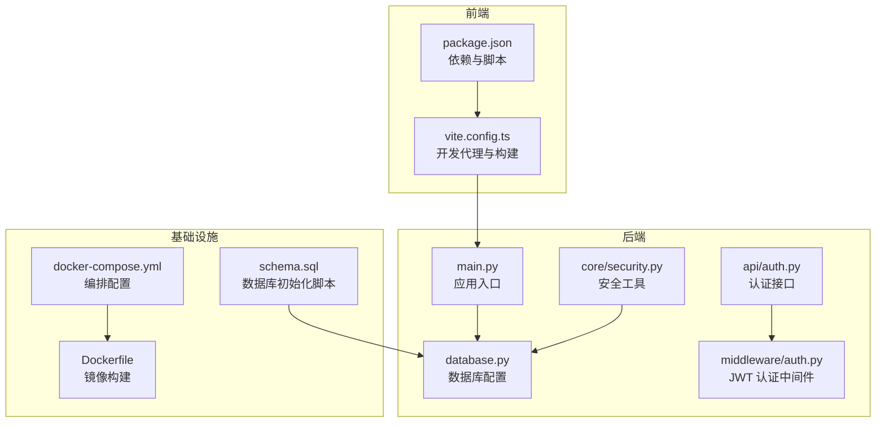
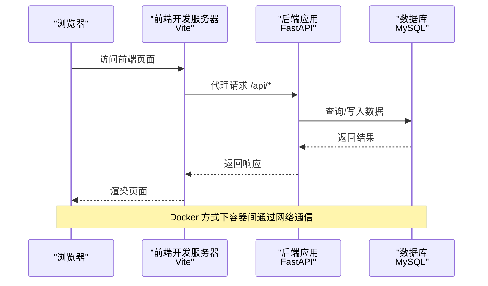
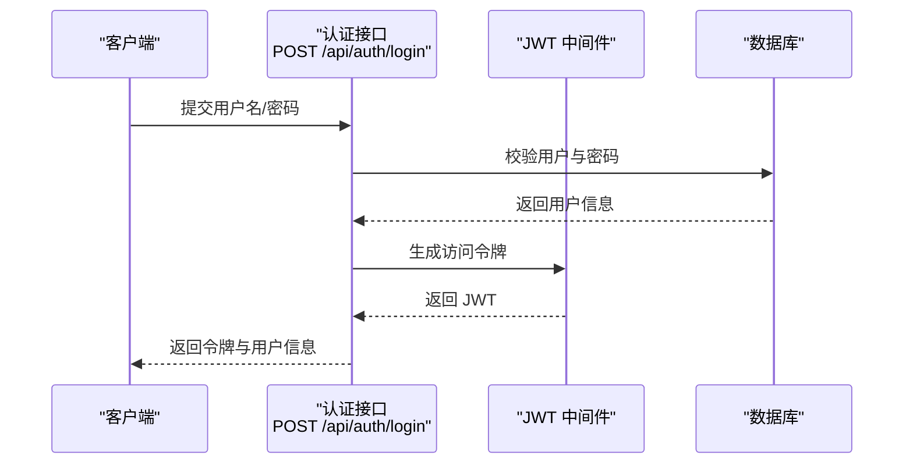
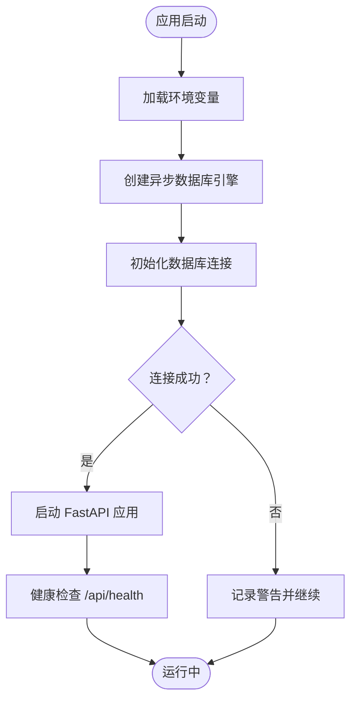

# 快速开始

<cite>
**本文引用的文件**
- [README.md](file://README.md)
- [.env.example](file://backend/.env.example)
- [requirements.txt](file://backend/requirements.txt)
- [package.json](file://frontend/package.json)
- [Dockerfile](file://Dockerfile)
- [docker-compose.yml](file://docker-compose.yml)
- [main.py](file://backend/main.py)
- [database.py](file://backend/database.py)
- [schema.sql](file://backend/schema.sql)
- [vite.config.ts](file://frontend/vite.config.ts)
- [auth.py](file://backend/api/auth.py)
- [security.py](file://backend/core/security.py)
- [auth 中间件](file://backend/middleware/auth.py)
</cite>

## 目录
1. [简介](#简介)
2. [项目结构](#项目结构)
3. [核心组件](#核心组件)
4. [架构总览](#架构总览)
5. [详细组件分析](#详细组件分析)
6. [依赖关系分析](#依赖关系分析)
7. [性能注意事项](#性能注意事项)
8. [故障排除指南](#故障排除指南)
9. [结论](#结论)
10. [附录](#附录)

## 简介
本指南面向首次接触 Skills Hub 的用户，帮助你在最短时间内完成环境搭建、数据库初始化、后端与前端依赖安装，并通过 Docker 或本地方式运行项目。文档涵盖环境变量配置、默认管理员账号、首次登录后的安全建议以及常见安装问题的排查方法。

## 项目结构
项目采用前后端分离架构，后端基于 FastAPI，前端基于 Vue 3 + TypeScript，数据库使用 MySQL 8.0+，支持单机 Docker 部署。

**图表来源**
- [main.py](file://backend/main.py#L1-L137)
- [database.py](file://backend/database.py#L1-L75)
- [schema.sql](file://backend/schema.sql#L1-L106)
- [vite.config.ts](file://frontend/vite.config.ts#L1-L24)
- [package.json](file://frontend/package.json#L1-L20)
- [docker-compose.yml](file://docker-compose.yml#L1-L56)
- [Dockerfile](file://Dockerfile#L1-L48)

**章节来源**
- [README.md](file://README.md#L20-L47)

## 核心组件
- 后端应用入口与路由注册：负责初始化数据库连接、注册异常处理器、CORS 与安全中间件，并挂载前端静态资源。
- 数据库模块：使用 SQLAlchemy 异步引擎连接 MySQL，提供会话依赖注入与连接池配置。
- 认证与安全：提供 JWT 登录、用户信息查询、密码修改；密码使用 Argon2 哈希，敏感数据使用 Fernet 对称加密。
- 前端开发服务器：通过 Vite 提供代理到后端 API 的开发体验。
- Docker 编排：一键拉起后端服务与 MySQL 数据库，自动导入初始化脚本。

**章节来源**
- [main.py](file://backend/main.py#L27-L125)
- [database.py](file://backend/database.py#L14-L75)
- [auth.py](file://backend/api/auth.py#L24-L65)
- [security.py](file://backend/core/security.py#L12-L64)
- [auth 中间件](file://backend/middleware/auth.py#L25-L108)
- [vite.config.ts](file://frontend/vite.config.ts#L6-L18)
- [docker-compose.yml](file://docker-compose.yml#L1-L56)

## 架构总览
下图展示了本地与 Docker 两种运行方式的请求流：

**图表来源**
- [vite.config.ts](file://frontend/vite.config.ts#L8-L17)
- [main.py](file://backend/main.py#L108-L125)
- [database.py](file://backend/database.py#L21-L36)

## 详细组件分析

### 环境变量与密钥配置
- 关键变量
  - DATABASE_URL：数据库连接串，默认指向本地 MySQL。
  - JWT_SECRET_KEY：JWT 签名密钥，生产环境必须替换。
  - ENCRYPTION_KEY：敏感数据对称加密密钥，若未配置将自动生成并在控制台输出，请将其写入 .env。
- 配置步骤
  - 复制示例文件并编辑：参考后端示例文件路径与字段说明。
  - 生成加密密钥：若未设置 ENCRYPTION_KEY，系统会在启动时生成并提示你将其写入 .env。
- 安全建议
  - 生产环境务必设置随机且强的 JWT_SECRET_KEY 与 ENCRYPTION_KEY。
  - 将 .env 文件加入 .gitignore，不要提交到版本库。

**章节来源**
- [README.md](file://README.md#L112-L119)
- [.env.example](file://backend/.env.example#L1-L17)
- [security.py](file://backend/core/security.py#L34-L41)

### 数据库初始化
- 本地初始化
  - 使用提供的 SQL 脚本创建数据库与表，并插入默认管理员账号。
- Docker 初始化
  - compose 会将脚本挂载到 MySQL 容器内，在首次启动时自动执行。

**章节来源**
- [README.md](file://README.md#L51-L56)
- [schema.sql](file://backend/schema.sql#L101-L105)
- [docker-compose.yml](file://docker-compose.yml#L39-L39)

### 后端依赖安装与启动
- 安装依赖
  - 使用 Python 包管理器安装后端依赖清单中的全部包。
- 启动应用
  - 在后端目录运行主程序，服务默认监听 8000 端口。
- 健康检查
  - 提供 /api/health 端点用于检测数据库连通性。

**章节来源**
- [README.md](file://README.md#L58-L72)
- [requirements.txt](file://backend/requirements.txt#L1-L34)
- [main.py](file://backend/main.py#L87-L104)

### 前端依赖安装与开发
- 安装依赖
  - 使用 npm 安装前端依赖。
- 开发服务器
  - Vite 默认端口 5173，通过代理将 /api 与 /webhooks 请求转发至后端。
- 构建产物
  - 构建后生成 dist 目录，后端在生产模式下挂载该目录作为静态资源。

**章节来源**
- [README.md](file://README.md#L78-L90)
- [package.json](file://frontend/package.json#L5-L9)
- [vite.config.ts](file://frontend/vite.config.ts#L6-L18)

### Docker 部署
- 构建镜像
  - 多阶段构建：先构建前端静态资源，再安装后端依赖并复制前端产物。
- 编排服务
  - skills 服务暴露 8000 端口，依赖已健康运行的 db。
  - db 服务使用 MySQL 8.0，挂载初始化脚本以创建表结构与默认管理员。
- 健康检查
  - 两个服务均配置了健康检查，便于容器编排管理。

**章节来源**
- [Dockerfile](file://Dockerfile#L1-L48)
- [docker-compose.yml](file://docker-compose.yml#L1-L56)

### 认证流程（登录与令牌）

**图表来源**
- [auth.py](file://backend/api/auth.py#L24-L40)
- [auth 中间件](file://backend/middleware/auth.py#L25-L33)

**章节来源**
- [auth.py](file://backend/api/auth.py#L24-L65)
- [auth 中间件](file://backend/middleware/auth.py#L25-L108)

### 数据库连接与会话

**图表来源**
- [database.py](file://backend/database.py#L14-L75)
- [main.py](file://backend/main.py#L27-L44)

**章节来源**
- [database.py](file://backend/database.py#L14-L75)
- [main.py](file://backend/main.py#L27-L44)

## 依赖关系分析
- 后端依赖
  - Web 框架与服务器：FastAPI、Uvicorn
  - 数据库：SQLAlchemy 异步、aiomysql、pymysql
  - 安全与加密：python-jose、passlib(Argon2)、cryptography(Fernet)
  - 其他：httpx、pydantic、python-dotenv、slowapi、aiofiles
- 前端依赖
  - 运行时：Vue 3、Vue Router、Pinia
  - 开发工具：Vite、@vitejs/plugin-vue

**章节来源**
- [requirements.txt](file://backend/requirements.txt#L1-L34)
- [package.json](file://frontend/package.json#L10-L18)

## 性能注意事项
- 数据库连接池
  - 异步引擎已启用连接预检查与池化配置，建议根据并发访问量调整池大小与溢出数量。
- 健康检查
  - 建议在生产环境开启严格的健康检查与重启策略，确保服务可用性。
- 前端静态资源
  - 生产模式下挂载构建产物，减少不必要的文件读取。

**章节来源**
- [database.py](file://backend/database.py#L21-L36)
- [docker-compose.yml](file://docker-compose.yml#L20-L25)

## 故障排除指南
- 数据库无法连接
  - 检查 DATABASE_URL 是否正确，确认 MySQL 服务已启动且端口可达。
  - 若使用 Docker，确认 db 容器健康状态与卷挂载。
- JWT 密钥错误或过期
  - 确认 JWT_SECRET_KEY 设置正确，避免使用默认示例值。
- 加密密钥缺失
  - 若未设置 ENCRYPTION_KEY，系统会生成并在控制台输出，请将其写入 .env 并重启服务。
- 健康检查失败
  - 访问 /api/health 确认数据库连通性；查看容器日志定位问题。
- 前端代理无效
  - 确认 Vite 代理配置指向后端地址，前后端端口与代理规则一致。

**章节来源**
- [README.md](file://README.md#L74-L76)
- [database.py](file://backend/database.py#L63-L69)
- [security.py](file://backend/core/security.py#L34-L41)
- [docker-compose.yml](file://docker-compose.yml#L20-L25)
- [vite.config.ts](file://frontend/vite.config.ts#L8-L17)

## 结论
按照本指南完成数据库初始化、环境变量配置与依赖安装后，你可以选择本地开发模式或 Docker 一键部署。首次登录后请立即修改默认管理员密码，并在生产环境中妥善保管与轮换密钥，确保系统安全稳定运行。

## 附录

### 默认管理员账号
- 用户名：admin
- 初始密码：Admin@123
- 首次登录后请立即修改密码

**章节来源**
- [README.md](file://README.md#L105-L110)
- [schema.sql](file://backend/schema.sql#L103-L104)

### 常用命令清单
- 数据库初始化
  - 使用 SQL 脚本创建数据库与表。
- 后端启动
  - 安装依赖后运行后端主程序。
- 前端启动（开发）
  - 安装依赖后启动 Vite 开发服务器。
- Docker 部署
  - 构建并启动服务，查看日志，停止服务。

**章节来源**
- [README.md](file://README.md#L51-L103)