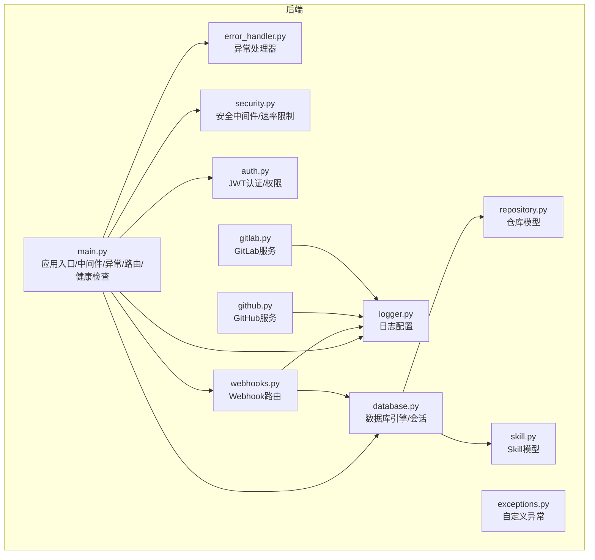
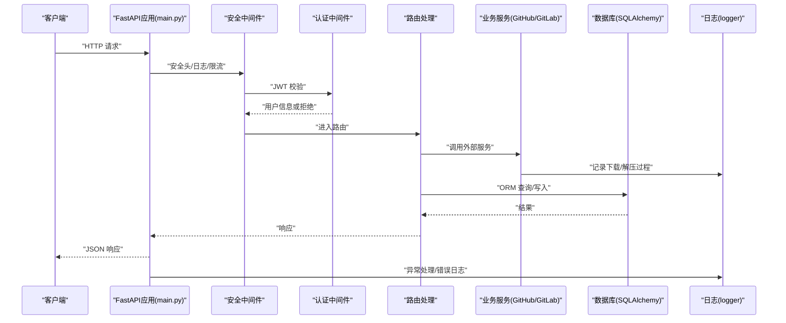
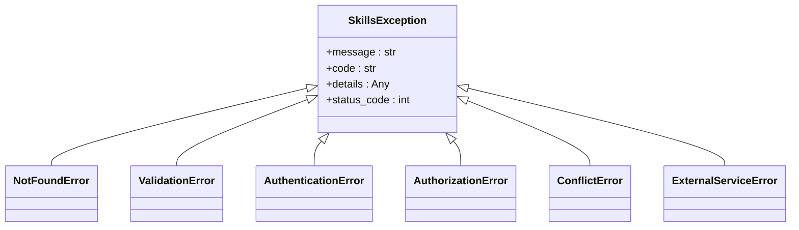
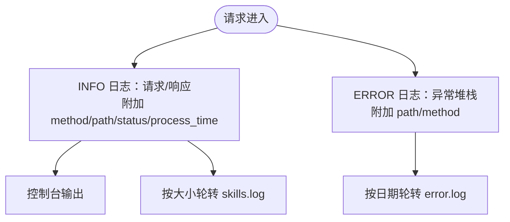
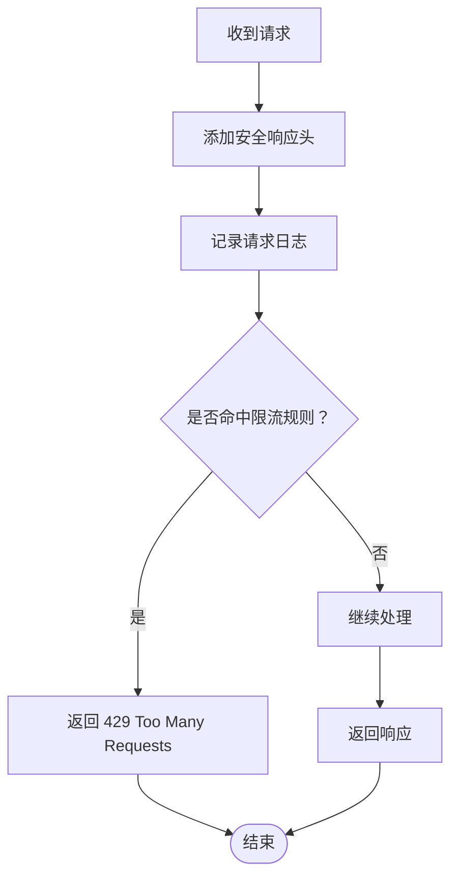
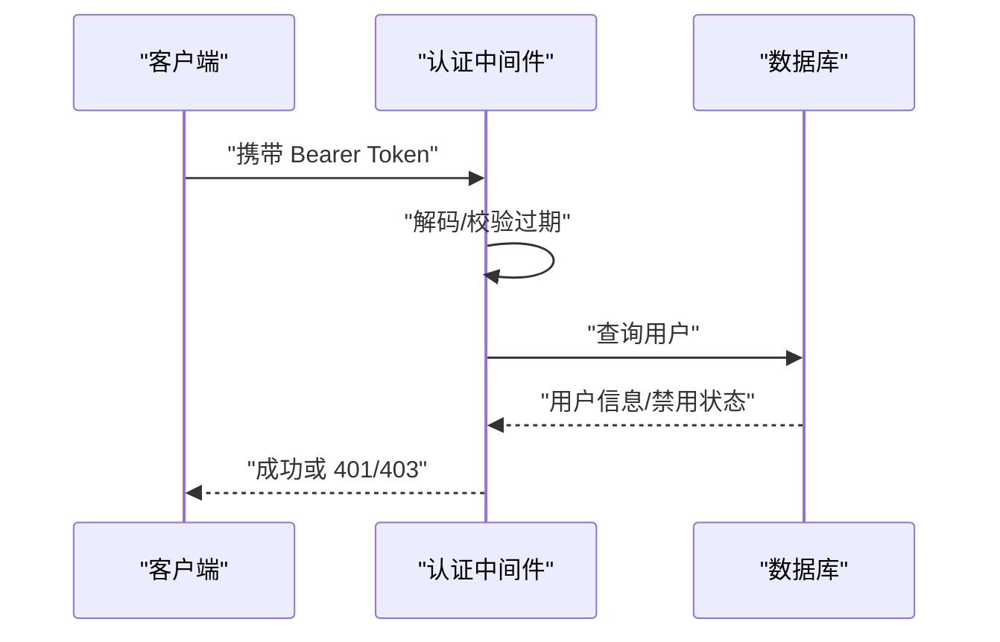
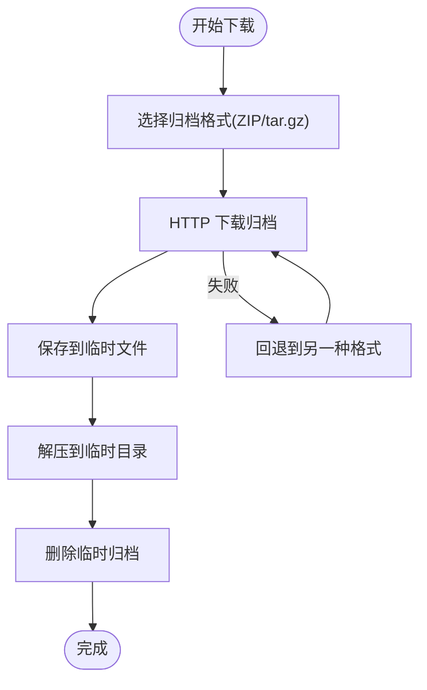
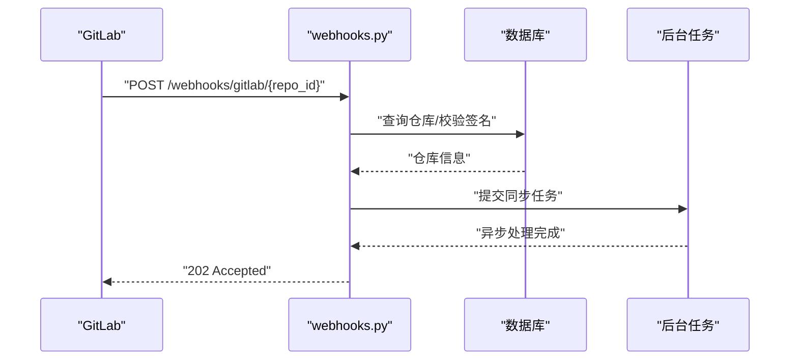
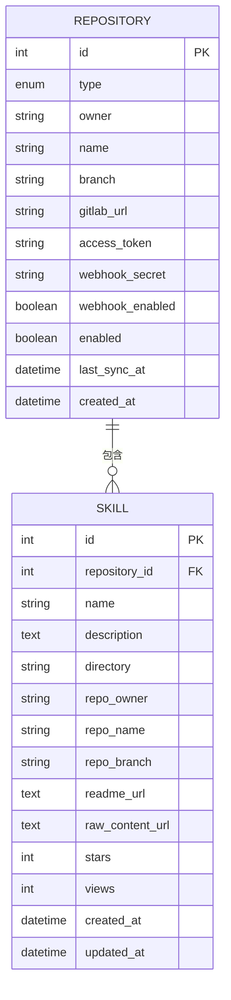
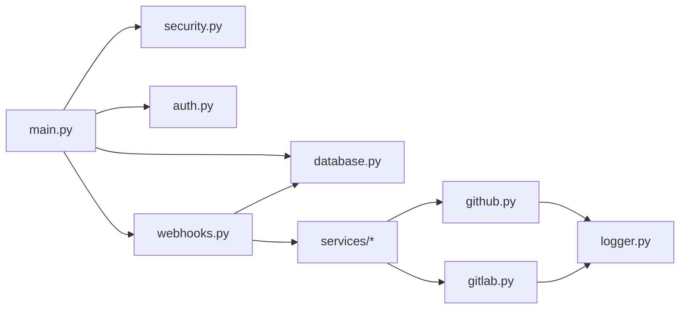

# 故障排除与常见问题

<cite>
**本文引用的文件**
- [README.md](file://README.md)
- [main.py](file://backend/main.py)
- [error_handler.py](file://backend/core/error_handler.py)
- [logger.py](file://backend/core/logger.py)
- [exceptions.py](file://backend/core/exceptions.py)
- [security.py](file://backend/middleware/security.py)
- [auth.py](file://backend/middleware/auth.py)
- [github.py](file://backend/services/github.py)
- [gitlab.py](file://backend/services/gitlab.py)
- [repository.py](file://backend/models/repository.py)
- [skill.py](file://backend/models/skill.py)
- [webhooks.py](file://backend/api/webhooks.py)
- [database.py](file://backend/database.py)
- [docker-compose.yml](file://docker-compose.yml)
- [Dockerfile](file://Dockerfile)
- [.env.example](file://backend/.env.example)
</cite>

## 目录
1. [简介](#简介)
2. [项目结构](#项目结构)
3. [核心组件](#核心组件)
4. [架构总览](#架构总览)
5. [详细组件分析](#详细组件分析)
6. [依赖分析](#依赖分析)
7. [性能考虑](#性能考虑)
8. [故障排除指南](#故障排除指南)
9. [结论](#结论)
10. [附录](#附录)

## 简介
本文件面向使用者与开发者，提供 Skills Hub 的故障排除与常见问题解答。内容涵盖部署问题、功能使用问题、性能问题与兼容性问题，配套日志分析、错误代码解读、异常监控与日志记录策略，并给出性能优化建议与容量规划指导。

## 项目结构
后端采用 FastAPI + SQLAlchemy Async + MySQL；前端为 Vue 3 + TypeScript；通过 Docker 单服务编排运行。核心模块包括：
- 应用入口与生命周期：注册中间件、异常处理器、路由与健康检查
- 核心日志与异常：统一日志格式、异常处理与错误响应
- 安全中间件：安全响应头、请求日志、简单速率限制
- 认证中间件：JWT 解析、用户校验、管理员权限
- 仓库服务：GitHub/GitLab 归档下载与解压
- 数据模型：仓库与 Skill 的 ORM 映射
- Webhook：GitLab Push 事件接收与异步处理
- 数据库：异步连接池配置与依赖注入

图表来源
- [main.py](file://backend/main.py#L1-L137)
- [error_handler.py](file://backend/core/error_handler.py#L1-L102)
- [logger.py](file://backend/core/logger.py#L1-L95)
- [exceptions.py](file://backend/core/exceptions.py#L1-L101)
- [security.py](file://backend/middleware/security.py#L1-L142)
- [auth.py](file://backend/middleware/auth.py#L1-L134)
- [github.py](file://backend/services/github.py#L1-L105)
- [gitlab.py](file://backend/services/gitlab.py#L1-L170)
- [database.py](file://backend/database.py#L1-L75)
- [repository.py](file://backend/models/repository.py#L1-L74)
- [skill.py](file://backend/models/skill.py#L1-L90)
- [webhooks.py](file://backend/api/webhooks.py#L1-L90)

章节来源
- [README.md](file://README.md#L1-L173)
- [main.py](file://backend/main.py#L1-L137)

## 核心组件
- 应用入口与生命周期：负责初始化数据库、注册中间件与异常处理器、挂载路由与静态文件、提供健康检查端点
- 统一异常处理：针对自定义异常、参数验证错误、HTTP 异常与未捕获异常进行标准化响应
- 日志系统：控制台 + 按大小轮转的 info 日志 + 按日期轮转的 error 日志，支持上下文附加
- 安全中间件：添加安全响应头、记录请求/响应、简单内存级速率限制
- 认证中间件：解析 JWT、校验用户状态与角色、提供可选认证
- 外部服务：GitHub/GitLab 归档下载、解压与错误包装
- 数据模型：仓库与 Skill 的字段、关系与序列化
- Webhook：GitLab Push 事件接收、签名校验、异步处理与日志查询
- 数据库：异步引擎、连接池、会话依赖注入

章节来源
- [main.py](file://backend/main.py#L1-L137)
- [error_handler.py](file://backend/core/error_handler.py#L1-L102)
- [logger.py](file://backend/core/logger.py#L1-L95)
- [security.py](file://backend/middleware/security.py#L1-L142)
- [auth.py](file://backend/middleware/auth.py#L1-L134)
- [github.py](file://backend/services/github.py#L1-L105)
- [gitlab.py](file://backend/services/gitlab.py#L1-L170)
- [repository.py](file://backend/models/repository.py#L1-L74)
- [skill.py](file://backend/models/skill.py#L1-L90)
- [webhooks.py](file://backend/api/webhooks.py#L1-L90)
- [database.py](file://backend/database.py#L1-L75)

## 架构总览
下图展示从客户端到后端各层的交互流程，以及关键异常与日志落点。

图表来源
- [main.py](file://backend/main.py#L1-L137)
- [security.py](file://backend/middleware/security.py#L1-L142)
- [auth.py](file://backend/middleware/auth.py#L1-L134)
- [github.py](file://backend/services/github.py#L1-L105)
- [gitlab.py](file://backend/services/gitlab.py#L1-L170)
- [database.py](file://backend/database.py#L1-L75)
- [logger.py](file://backend/core/logger.py#L1-L95)

## 详细组件分析

### 异常处理与错误响应
- 自定义异常：提供资源未找到、数据验证、认证/授权、冲突、外部服务等异常类型
- 统一响应：异常处理器将错误封装为标准 JSON，包含错误码、消息、路径、时间戳等
- 未捕获异常：记录堆栈信息并返回通用 500 响应

图表来源
- [exceptions.py](file://backend/core/exceptions.py#L1-L101)
- [error_handler.py](file://backend/core/error_handler.py#L1-L102)

章节来源
- [exceptions.py](file://backend/core/exceptions.py#L1-L101)
- [error_handler.py](file://backend/core/error_handler.py#L1-L102)

### 日志记录策略
- 输出目标：控制台 INFO、logs/skills.log（按大小轮转）、logs/error.log（按日期轮转）
- 上下文：支持在日志中附加请求路径、方法、状态码、耗时等
- 建议：生产环境关注 error.log，开发环境结合控制台与 skills.log

图表来源
- [logger.py](file://backend/core/logger.py#L1-L95)
- [security.py](file://backend/middleware/security.py#L1-L142)
- [error_handler.py](file://backend/core/error_handler.py#L1-L102)

章节来源
- [logger.py](file://backend/core/logger.py#L1-L95)
- [security.py](file://backend/middleware/security.py#L1-L142)
- [error_handler.py](file://backend/core/error_handler.py#L1-L102)

### 安全中间件与速率限制
- 安全响应头：X-Content-Type-Options、X-Frame-Options、Strict-Transport-Security、Content-Security-Policy 等
- 请求日志：记录方法、路径、客户端 IP、处理耗时
- 速率限制：基于内存的滑动窗口计数，当前对特定路径进行限流

图表来源
- [security.py](file://backend/middleware/security.py#L1-L142)

章节来源
- [security.py](file://backend/middleware/security.py#L1-L142)

### 认证与权限
- JWT 解析：支持过期与无效令牌的告警
- 当前用户：从令牌提取用户 ID，查询数据库并校验状态
- 管理员权限：要求用户角色为 admin
- 可选认证：允许未登录访问，返回空用户

图表来源
- [auth.py](file://backend/middleware/auth.py#L1-L134)

章节来源
- [auth.py](file://backend/middleware/auth.py#L1-L134)

### 外部服务集成（GitHub/GitLab）
- GitHub：归档下载、ZIP 解压、错误包装为外部服务异常
- GitLab：优先尝试 ZIP，失败则回退 tar.gz，错误包装为外部服务异常
- 共同点：超时控制、日志记录、清理临时文件

图表来源
- [github.py](file://backend/services/github.py#L1-L105)
- [gitlab.py](file://backend/services/gitlab.py#L1-L170)

章节来源
- [github.py](file://backend/services/github.py#L1-L105)
- [gitlab.py](file://backend/services/gitlab.py#L1-L170)

### Webhook（GitLab Push）
- 端点：接收 Push Hook，校验仓库存在与签名
- 异步处理：在后台任务中执行同步逻辑
- 日志查询：支持按仓库过滤与数量限制

图表来源
- [webhooks.py](file://backend/api/webhooks.py#L1-L90)

章节来源
- [webhooks.py](file://backend/api/webhooks.py#L1-L90)

### 数据模型与关系
- 仓库模型：类型、所有者、名称、分支、访问令牌、Webhook 密钥、启用状态、最后同步时间
- Skill 模型：关联仓库、目录路径、README/源码链接、统计字段、多对多分类关系

图表来源
- [repository.py](file://backend/models/repository.py#L1-L74)
- [skill.py](file://backend/models/skill.py#L1-L90)

章节来源
- [repository.py](file://backend/models/repository.py#L1-L74)
- [skill.py](file://backend/models/skill.py#L1-L90)

## 依赖分析
- 应用入口依赖：中间件、异常处理器、数据库初始化、路由注册
- Webhook 依赖：数据库会话、仓库模型、Webhook 服务
- 外部服务依赖：HTTP 客户端、临时文件、压缩包处理
- 认证依赖：JWT 解码、数据库用户查询

图表来源
- [main.py](file://backend/main.py#L1-L137)
- [security.py](file://backend/middleware/security.py#L1-L142)
- [auth.py](file://backend/middleware/auth.py#L1-L134)
- [database.py](file://backend/database.py#L1-L75)
- [webhooks.py](file://backend/api/webhooks.py#L1-L90)
- [github.py](file://backend/services/github.py#L1-L105)
- [gitlab.py](file://backend/services/gitlab.py#L1-L170)
- [logger.py](file://backend/core/logger.py#L1-L95)

章节来源
- [main.py](file://backend/main.py#L1-L137)
- [webhooks.py](file://backend/api/webhooks.py#L1-L90)
- [github.py](file://backend/services/github.py#L1-L105)
- [gitlab.py](file://backend/services/gitlab.py#L1-L170)

## 性能考虑
- 连接池配置：连接池大小与溢出连接数已设定，建议根据并发与数据库性能调整
- 异步 I/O：外部服务下载与数据库操作均为异步，减少阻塞
- 速率限制：对特定路径进行限流，防止暴力尝试
- 日志级别：生产环境建议保持 INFO 级别，避免过多 DEBUG 输出
- 前端静态文件：生产环境挂载 dist 目录，减少 API 路由覆盖风险

章节来源
- [database.py](file://backend/database.py#L1-L75)
- [security.py](file://backend/middleware/security.py#L1-L142)
- [logger.py](file://backend/core/logger.py#L1-L95)
- [main.py](file://backend/main.py#L1-L137)

## 故障排除指南

### 部署与环境
- 数据库初始化失败
  - 现象：启动时报数据库连接失败或健康检查失败
  - 排查：确认数据库服务可用、连接串正确、schema.sql 已执行
  - 参考：健康检查端点、数据库初始化逻辑
  - 章节来源
    - [main.py](file://backend/main.py#L88-L104)
    - [database.py](file://backend/database.py#L58-L75)
    - [docker-compose.yml](file://docker-compose.yml#L27-L46)

- Docker 构建/启动异常
  - 现象：容器无法启动、健康检查失败
  - 排查：查看容器日志、确认端口映射、环境变量、卷挂载
  - 参考：Dockerfile 健康检查、docker-compose 编排
  - 章节来源
    - [Dockerfile](file://Dockerfile#L42-L47)
    - [docker-compose.yml](file://docker-compose.yml#L1-L56)

- 前端静态文件不可用
  - 现象：访问管理页面返回 404 或空白页
  - 排查：确认前端已构建、dist 目录存在、静态文件挂载顺序正确
  - 参考：SPA 回退与静态文件挂载逻辑
  - 章节来源
    - [main.py](file://backend/main.py#L107-L125)

- 环境变量缺失
  - 现象：JWT 密钥、加密密钥、数据库连接串为空
  - 排查：复制 .env.example 并填写必要项，确保加载顺序正确
  - 章节来源
    - [.env.example](file://backend/.env.example#L1-L17)
    - [database.py](file://backend/database.py#L11-L18)

### 功能使用问题
- Webhook 推送未触发同步
  - 现象：Push 事件到达但无同步
  - 排查：确认仓库存在且启用、签名一致、后台任务执行、查看 Webhook 日志
  - 参考：Webhook 端点、签名校验、日志查询
  - 章节来源
    - [webhooks.py](file://backend/api/webhooks.py#L15-L64)
    - [webhooks.py](file://backend/api/webhooks.py#L67-L89)

- 认证失败/权限不足
  - 现象：401 未认证、403 权限不足
  - 排查：确认 Token 有效且未过期、用户状态正常、管理员角色
  - 参考：JWT 解析、用户查询、管理员校验
  - 章节来源
    - [auth.py](file://backend/middleware/auth.py#L48-L95)
    - [auth.py](file://backend/middleware/auth.py#L98-L108)

- 外部仓库下载失败
  - 现象：GitHub/GitLab 下载/解压报错
  - 排查：检查网络连通、访问令牌、分支名、归档格式回退
  - 参考：外部服务实现与错误包装
  - 章节来源
    - [github.py](file://backend/services/github.py#L36-L102)
    - [gitlab.py](file://backend/services/gitlab.py#L46-L165)

### 性能问题
- 响应缓慢
  - 现象：接口响应时间长
  - 排查：查看请求日志中的处理耗时、数据库查询、外部服务延迟
  - 参考：请求日志中间件、数据库连接池
  - 章节来源
    - [security.py](file://backend/middleware/security.py#L31-L59)
    - [database.py](file://backend/database.py#L20-L36)

- 高并发下的限流
  - 现象：出现 429 Too Many Requests
  - 排查：确认限流规则、客户端 IP、请求频率
  - 参考：速率限制中间件
  - 章节来源
    - [security.py](file://backend/middleware/security.py#L107-L141)

### 兼容性问题
- 浏览器安全头影响
  - 现象：某些浏览器行为差异
  - 排查：确认安全响应头配置、CSP 设置
  - 参考：安全响应头中间件
  - 章节来源
    - [security.py](file://backend/middleware/security.py#L11-L28)

- CORS 与静态文件覆盖
  - 现象：API 被静态文件路由覆盖
  - 排查：确认静态文件挂载顺序、路由优先级
  - 参考：SPA 回退与静态文件挂载
  - 章节来源
    - [main.py](file://backend/main.py#L107-L125)

### 日志分析与错误代码解读
- 常见错误码
  - VALIDATION_ERROR：输入参数校验失败，响应体包含字段与类型信息
  - HTTP_4xx：HTTP 异常，包含状态码与详情
  - INTERNAL_ERROR：未捕获异常，响应体包含通用错误信息
  - RATE_LIMIT_EXCEEDED：请求过于频繁
  - EXTERNAL_SERVICE_ERROR：GitHub/GitLab 下载失败
  - 章节来源
    - [error_handler.py](file://backend/core/error_handler.py#L14-L101)
    - [exceptions.py](file://backend/core/exceptions.py#L1-L101)

- 日志定位
  - 控制台：INFO 级别请求日志，包含方法、路径、客户端 IP、耗时
  - 文件：skills.log（INFO 轮转）、error.log（ERROR 按日轮转）
  - 章节来源
    - [logger.py](file://backend/core/logger.py#L11-L66)
    - [security.py](file://backend/middleware/security.py#L31-L59)

### 异常监控与修复方法
- 异常监控
  - 使用 error.log 与异常处理器响应体中的时间戳定位问题发生时间
  - 结合请求日志中的 path/method/process_time 进行关联分析
  - 章节来源
    - [error_handler.py](file://backend/core/error_handler.py#L80-L101)
    - [logger.py](file://backend/core/logger.py#L11-L66)

- 修复方法
  - 参数验证错误：根据 details 中的字段修正请求体
  - 认证失败：重新登录获取有效 Token，检查密钥配置
  - 外部服务错误：检查网络、令牌、分支名，重试或切换归档格式
  - 数据库异常：检查连接池配置、健康检查、事务回滚
  - 章节来源
    - [error_handler.py](file://backend/core/error_handler.py#L33-L59)
    - [auth.py](file://backend/middleware/auth.py#L48-L95)
    - [github.py](file://backend/services/github.py#L69-L102)
    - [gitlab.py](file://backend/services/gitlab.py#L81-L165)
    - [database.py](file://backend/database.py#L42-L55)

### 资源使用监控与容量规划
- 日志轮转：确保磁盘空间充足，定期清理旧日志
- 连接池：根据 QPS 与数据库性能调整 pool_size 与 max_overflow
- 前端静态文件：生产环境启用缓存与压缩
- Webhook：监控后台任务队列长度与处理耗时
- 章节来源
  - [logger.py](file://backend/core/logger.py#L43-L64)
  - [database.py](file://backend/database.py#L20-L36)
  - [webhooks.py](file://backend/api/webhooks.py#L54-L64)

## 结论
通过统一的日志与异常处理、安全中间件与速率限制、完善的外部服务与数据库配置，Skills Hub 提供了可运维、可扩展的基础能力。遇到问题时，建议优先查看 error.log 与请求日志，结合异常处理器响应体快速定位原因，并依据本文提供的排查步骤逐项验证。

## 附录
- 健康检查端点：/api/health
- API 文档：/api/docs
- 默认管理员账号：首次部署后请立即修改密码
- 章节来源
  - [README.md](file://README.md#L78-L111)
  - [main.py](file://backend/main.py#L88-L104)