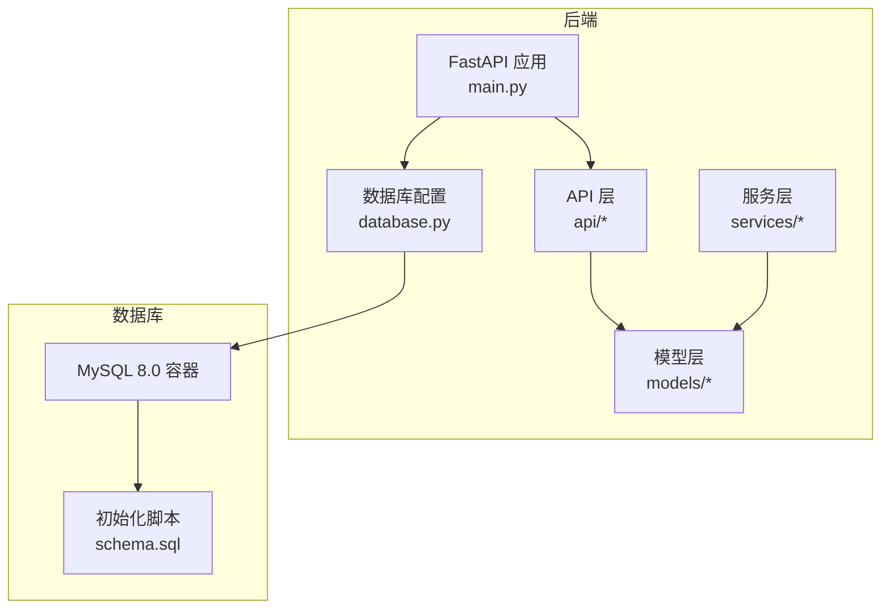
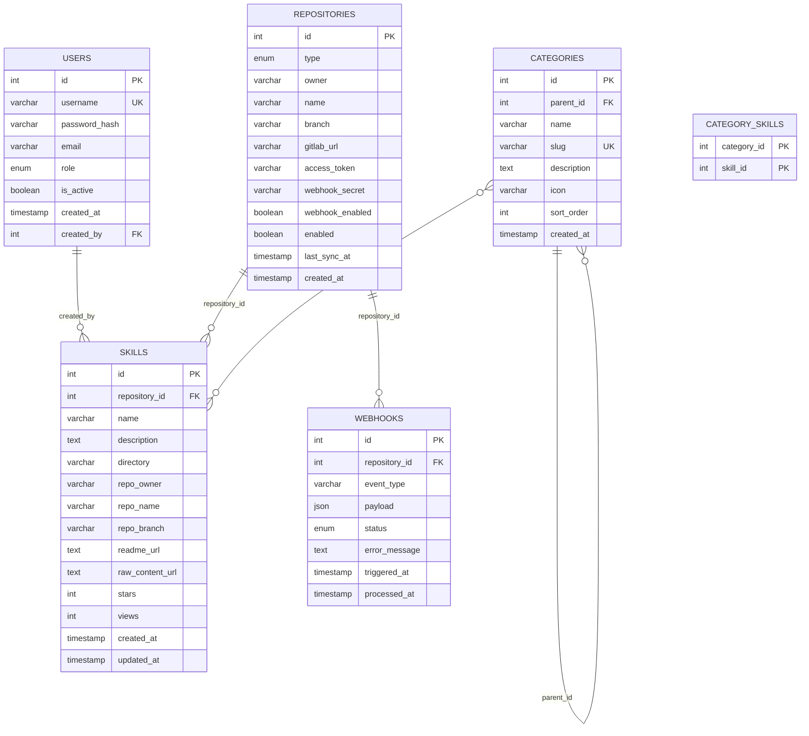
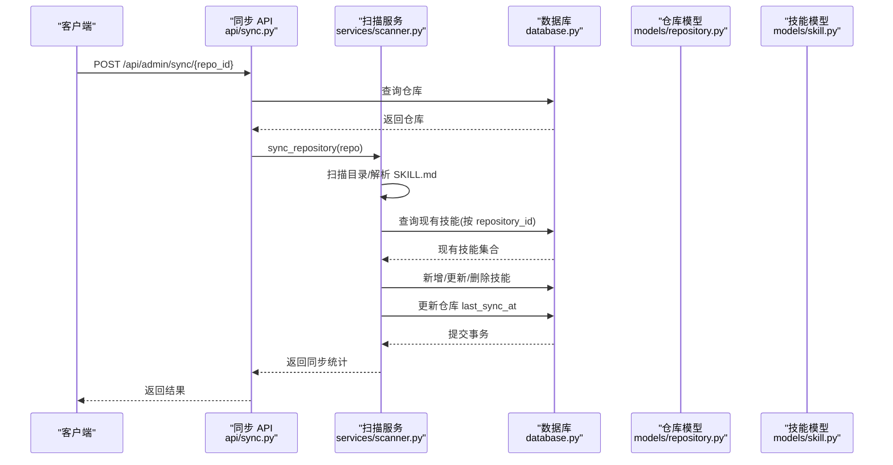
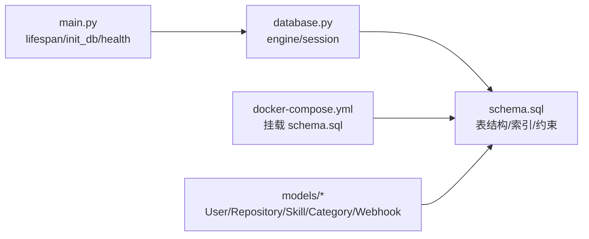

# 数据库设计

<cite>
**本文引用的文件**
- [schema.sql](file://backend/schema.sql)
- [database.py](file://backend/database.py)
- [main.py](file://backend/main.py)
- [docker-compose.yml](file://docker-compose.yml)
- [.env.example](file://backend/.env.example)
- [models/user.py](file://backend/models/user.py)
- [models/repository.py](file://backend/models/repository.py)
- [models/skill.py](file://backend/models/skill.py)
- [models/category.py](file://backend/models/category.py)
- [models/webhook.py](file://backend/models/webhook.py)
- [api/sync.py](file://backend/api/sync.py)
- [services/scanner.py](file://backend/services/scanner.py)
- [services/parser.py](file://backend/services/parser.py)
</cite>

## 目录
1. [简介](#简介)
2. [项目结构](#项目结构)
3. [核心组件](#核心组件)
4. [架构总览](#架构总览)
5. [详细组件分析](#详细组件分析)
6. [依赖分析](#依赖分析)
7. [性能考量](#性能考量)
8. [故障排查指南](#故障排查指南)
9. [结论](#结论)
10. [附录](#附录)

## 简介
本文件系统性梳理 Skills Hub 的数据库设计，聚焦 MySQL 8.0+ 架构，涵盖用户、仓库、技能、分类与 Webhook 五张核心表的结构、ER 关系、主外键约束与索引策略；解释多对多关联与自引用关系；阐述全文检索的使用场景与性能权衡；给出数据库初始化脚本解析、数据迁移与备份恢复建议；并总结数据完整性、并发控制与事务处理的最佳实践。

## 项目结构
后端采用 FastAPI + SQLAlchemy 异步 ORM，数据库通过 docker-compose 提供，初始化脚本位于 backend/schema.sql，并在容器首次启动时自动执行。数据库配置通过 .env.example 提供默认值，运行时从环境变量读取。

图表来源
- [main.py](file://backend/main.py#L27-L44)
- [database.py](file://backend/database.py#L15-L36)
- [docker-compose.yml](file://docker-compose.yml#L27-L46)
- [schema.sql](file://backend/schema.sql#L1-L106)

章节来源
- [main.py](file://backend/main.py#L27-L44)
- [database.py](file://backend/database.py#L15-L36)
- [docker-compose.yml](file://docker-compose.yml#L1-L55)
- [schema.sql](file://backend/schema.sql#L1-L106)

## 核心组件
- 用户表 users：用户身份与权限管理，支持自引用 created_by。
- 仓库表 repositories：多源仓库配置（GitHub/GitLab），含令牌与 Webhook 配置。
- 分类表 categories：多级分类，支持自引用父子关系。
- 技能表 skills：技能元数据，与仓库一对多关联，与分类多对多关联。
- Webhook 表 webhooks：事件日志与处理状态跟踪。
- 初始化脚本 schema.sql：创建数据库与表、索引、约束及初始管理员账号。
- 数据库配置 database.py：异步连接、连接池、会话管理与生命周期钩子。
- 运行时配置 .env.example：数据库连接串、加密密钥等。

章节来源
- [schema.sql](file://backend/schema.sql#L7-L106)
- [database.py](file://backend/database.py#L15-L75)
- [.env.example](file://backend/.env.example#L7-L9)

## 架构总览
下图展示数据库层的实体关系与关键约束，映射至实际表结构与索引。

图表来源
- [schema.sql](file://backend/schema.sql#L7-L106)
- [models/category.py](file://backend/models/category.py#L10-L16)
- [models/skill.py](file://backend/models/skill.py#L34-L39)
- [models/user.py](file://backend/models/user.py#L30-L30)

## 详细组件分析

### 用户表 users
- 字段要点：用户名唯一、角色枚举（ADMIN/MAINTAINER）、激活状态、创建者自引用。
- 约束与索引：主键、UNIQUE(username)、INDEX(role)、created_by 外键（删除设 NULL）。
- 使用场景：鉴权、审计、权限控制；created_by 支持层级创建追踪。
- 性能考虑：按角色筛选、用户名查找均走索引；自引用外键避免级联删除带来的级联影响。

章节来源
- [schema.sql](file://backend/schema.sql#L7-L20)
- [models/user.py](file://backend/models/user.py#L18-L33)

### 仓库表 repositories
- 字段要点：类型枚举（GITHUB/GITLAB）、所有者/名称、分支、GitLab 自建地址、访问令牌、Webhook 密钥、启用状态、最后同步时间。
- 约束与索引：主键、INDEX(type, enabled)、INDEX(owner, name)。
- 使用场景：多源仓库统一配置；令牌加密存储；Webhook 开关与密钥管理。
- 性能考虑：按类型+启用状态过滤常用；按 owner/name 快速定位仓库。

章节来源
- [schema.sql](file://backend/schema.sql#L22-L38)
- [models/repository.py](file://backend/models/repository.py#L18-L40)

### 分类表 categories
- 字段要点：父节点自引用、名称、slug 唯一、排序、图标、描述。
- 约束与索引：主键、parent_id 外键（CASCADE 删除）、UNIQUE(slug)、INDEX(parent_id, sort_order)。
- 使用场景：多级分类树；slug 用于公开链接；排序字段支持展示顺序。
- 性能考虑：自引用外键保证树形结构一致性；slug 唯一索引确保快速定位。

章节来源
- [schema.sql](file://backend/schema.sql#L40-L54)
- [models/category.py](file://backend/models/category.py#L19-L46)

### 技能表 skills
- 字段要点：仓库外键、名称、描述、目录路径、仓库元信息、统计字段（stars/views）、时间戳。
- 约束与索引：主键、repository_id 外键（SET NULL）、FULLTEXT(name, description)。
- 使用场景：全文检索搜索；与仓库一对多；与分类多对多。
- 性能考虑：全文索引适合模糊匹配与自然语言搜索；目录路径作为去重与定位依据。

章节来源
- [schema.sql](file://backend/schema.sql#L56-L75)
- [models/skill.py](file://backend/models/skill.py#L11-L39)

### 分类-技能关联表 category_skills
- 字段要点：复合主键（category_id, skill_id），双外键分别引用 categories 与 skills，均设置 CASCADE 删除。
- 使用场景：多对多关系；删除分类或技能时自动清理关联。
- 性能考虑：复合主键保证唯一性；外键级联删除简化维护。

章节来源
- [schema.sql](file://backend/schema.sql#L77-L84)
- [models/category.py](file://backend/models/category.py#L10-L16)
- [models/skill.py](file://backend/models/skill.py#L34-L39)

### Webhook 表 webhooks
- 字段要点：仓库外键、事件类型、JSON 负载（不持久化大对象）、状态枚举、错误信息、触发与处理时间。
- 约束与索引：主键、repository_id 外键（CASCADE）、INDEX(status, triggered_at)。
- 使用场景：事件日志与处理状态跟踪；失败重试与告警。
- 性能考虑：按仓库+状态快速筛选待处理事件；时间索引便于清理与统计。

章节来源
- [schema.sql](file://backend/schema.sql#L86-L99)
- [models/webhook.py](file://backend/models/webhook.py#L19-L34)

### 数据模型交互流程（同步与全文检索）
- 同步流程：API 接收同步请求，调用扫描服务扫描仓库，对比数据库现有技能，批量新增/更新/删除，最后更新仓库同步时间并提交事务。
- 全文检索：skills 表建立 FULLTEXT 索引，适合按名称与描述进行自然语言搜索。

图表来源
- [api/sync.py](file://backend/api/sync.py#L17-L32)
- [services/scanner.py](file://backend/services/scanner.py#L70-L156)
- [database.py](file://backend/database.py#L42-L55)
- [models/repository.py](file://backend/models/repository.py#L18-L40)
- [models/skill.py](file://backend/models/skill.py#L11-L39)

## 依赖分析
- 运行时依赖：FastAPI 应用在启动时通过 database.init_db() 测试数据库连通性；健康检查端点再次验证连接。
- 初始化依赖：docker-compose 将 schema.sql 挂载到 MySQL 初始化目录，容器启动时自动执行。
- ORM 映射：各模型类映射到 schema.sql 中的表结构，外键与索引在模型中以关系与注解体现。

图表来源
- [main.py](file://backend/main.py#L33-L36)
- [main.py](file://backend/main.py#L88-L104)
- [database.py](file://backend/database.py#L58-L69)
- [docker-compose.yml](file://docker-compose.yml#L39-L39)
- [schema.sql](file://backend/schema.sql#L1-L106)

章节来源
- [main.py](file://backend/main.py#L33-L36)
- [main.py](file://backend/main.py#L88-L104)
- [database.py](file://backend/database.py#L58-L69)
- [docker-compose.yml](file://docker-compose.yml#L39-L39)
- [schema.sql](file://backend/schema.sql#L1-L106)

## 性能考量
- 索引策略
  - users：username 唯一索引、role 辅助索引，满足登录与角色筛选。
  - repositories：(type, enabled) 复合索引用于筛选活跃仓库；(owner, name) 用于快速定位。
  - categories：parent_id、slug、sort_order 索引支撑树形遍历与排序。
  - skills：repository_id 外键索引；全文索引用于 name/description 的自然语言搜索。
  - webhooks：(repository_id, status) 与 triggered_at 索引，便于事件调度与清理。
- 全文索引
  - 适用场景：技能名称与描述的模糊匹配、关键词检索。
  - 性能权衡：写入时全文索引维护成本较高，建议在低频写入或批处理场景使用；查询时注意布尔模式与词干提取规则。
- 连接与并发
  - 异步连接池：pool_pre_ping、pool_size、max_overflow 控制连接健康与并发能力。
  - 事务：API 层与扫描服务均使用显式提交/回滚，确保数据一致性。
- 查询优化
  - 使用复合索引覆盖常见过滤条件（如仓库启用状态、分类 slug、Webhook 状态）。
  - 避免 SELECT *，仅选择必要列；对大字段（如 description、payload）谨慎返回。

章节来源
- [schema.sql](file://backend/schema.sql#L17-L19)
- [schema.sql](file://backend/schema.sql#L36-L37)
- [schema.sql](file://backend/schema.sql#L50-L53)
- [schema.sql](file://backend/schema.sql#L74)
- [schema.sql](file://backend/schema.sql#L97-L98)
- [database.py](file://backend/database.py#L21-L27)
- [api/sync.py](file://backend/api/sync.py#L82-L98)
- [services/scanner.py](file://backend/services/scanner.py#L86-L145)

## 故障排查指南
- 连接问题
  - 症状：应用启动时报数据库连接失败。
  - 排查：确认 DATABASE_URL 环境变量正确；检查 .env.example 中的默认值；查看 docker-compose 中的环境变量覆盖。
- 初始化失败
  - 症状：容器启动后数据库未创建或表缺失。
  - 排查：确认 schema.sql 已挂载到 /docker-entrypoint-initdb.d；检查 MySQL 初始化日志；确认字符集与排序规则一致。
- 锁与死锁
  - 症状：高并发写入时出现超时或异常。
  - 排查：减少长事务；拆分批量操作；使用合适的隔离级别；监控锁等待。
- 全文检索异常
  - 症状：全文检索无结果或性能差。
  - 排查：确认表引擎为 InnoDB；检查全文索引是否生效；调整查询语法与停用词配置。
- Webhook 事件堆积
  - 症状：pending/processing 状态长期存在。
  - 排查：检查触发频率与处理耗时；清理历史记录；优化事件处理逻辑。

章节来源
- [.env.example](file://backend/.env.example#L7-L9)
- [docker-compose.yml](file://docker-compose.yml#L39-L39)
- [schema.sql](file://backend/schema.sql#L4-L5)
- [database.py](file://backend/database.py#L58-L69)
- [api/sync.py](file://backend/api/sync.py#L82-L98)
- [services/scanner.py](file://backend/services/scanner.py#L158-L181)

## 结论
该数据库设计围绕“仓库-技能-分类”主线，辅以用户与 Webhook 支撑权限与事件驱动。通过合理的索引与外键约束保障数据一致性，全文索引提升搜索体验。异步连接与显式事务处理确保高并发下的稳定性。建议在生产环境中强化备份策略、监控与容量规划，并持续评估全文检索与索引策略的性价比。

## 附录

### 数据库初始化脚本解析
- 创建数据库与字符集：utf8mb4_unicode_ci，满足多语言需求。
- 创建五张核心表：users、repositories、categories、skills、webhooks。
- 建立索引与约束：主键、外键、唯一索引、复合索引、全文索引。
- 插入初始管理员账号：使用 Argon2id 哈希存储密码，部署时务必修改默认密码。

章节来源
- [schema.sql](file://backend/schema.sql#L1-L106)

### 数据迁移策略
- 版本化迁移：建议引入迁移工具（如 Alembic），以版本化方式管理 schema 变更。
- 渐进式变更：先添加列/索引，再回填数据，最后替换旧索引或删除冗余列。
- 全量重建：在小规模或测试环境可直接重建 schema.sql，生产环境需谨慎评估停机窗口与数据备份。

### 备份与恢复方案
- 备份策略：定期全量备份 + 增量/二进制日志，保留至少 7 天滚动备份。
- 恢复流程：验证备份完整性；在隔离环境预演恢复；逐步切换流量；监控一致性与性能。
- Webhook 大字段：payload 建议只记录摘要或外部引用，避免占用数据库空间。

### 并发控制与事务最佳实践
- 事务边界：将批量写入封装在单事务内，失败时整体回滚。
- 锁粒度：优先使用行级锁；避免长事务持有锁；合理拆分任务。
- 隔离级别：默认可重复读；对只读查询可降低隔离级别以减少锁竞争。
- 幂等性：对外部事件（Webhook）处理需幂等，避免重复消费导致的数据不一致。