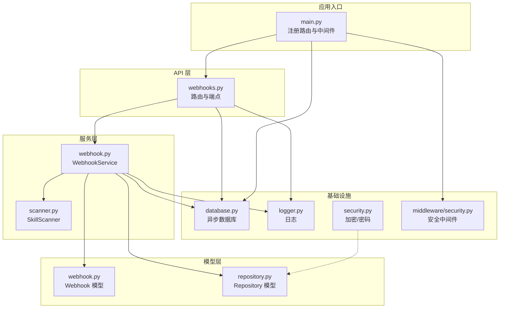
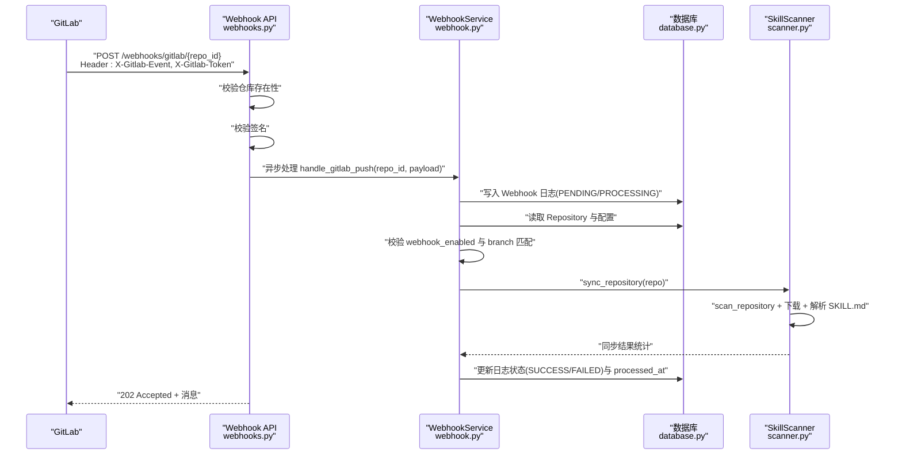
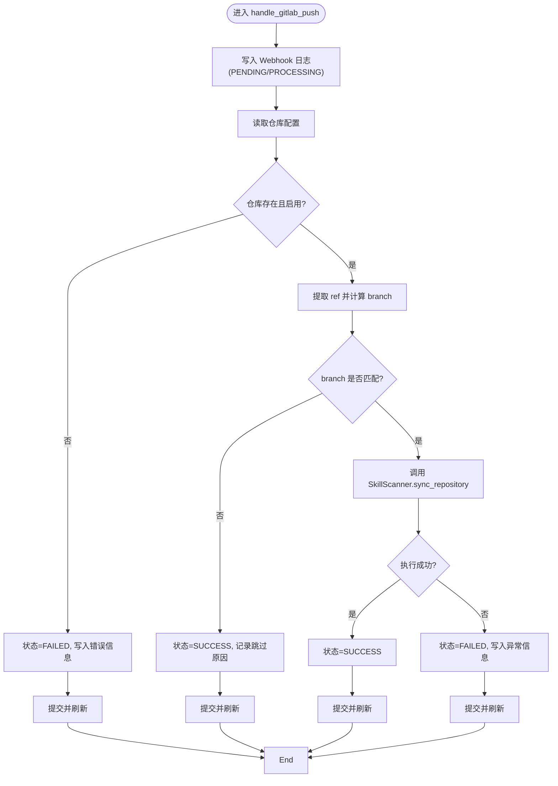
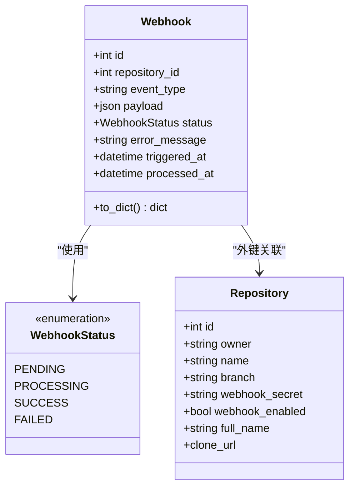
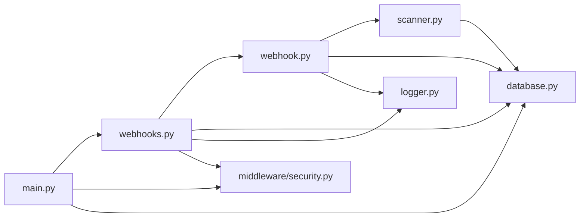

# Webhook 集成

<cite>
**本文引用的文件**
- [backend/api/webhooks.py](file://backend/api/webhooks.py)
- [backend/services/webhook.py](file://backend/services/webhook.py)
- [backend/models/webhook.py](file://backend/models/webhook.py)
- [backend/models/repository.py](file://backend/models/repository.py)
- [backend/services/scanner.py](file://backend/services/scanner.py)
- [backend/middleware/security.py](file://backend/middleware/security.py)
- [backend/core/logger.py](file://backend/core/logger.py)
- [backend/core/security.py](file://backend/core/security.py)
- [backend/database.py](file://backend/database.py)
- [backend/main.py](file://backend/main.py)
- [backend/.env.example](file://backend/.env.example)
- [README.md](file://README.md)
</cite>

## 目录
1. [简介](#简介)
2. [项目结构](#项目结构)
3. [核心组件](#核心组件)
4. [架构总览](#架构总览)
5. [详细组件分析](#详细组件分析)
6. [依赖关系分析](#依赖关系分析)
7. [性能考量](#性能考量)
8. [故障排除指南](#故障排除指南)
9. [结论](#结论)
10. [附录](#附录)

## 简介
本文件面向希望集成 GitLab Push 事件以触发自动同步的用户与运维人员，系统性阐述 Webhook 接收、验证、事件解析与响应处理的全流程；详述 Webhook 服务的实现逻辑（事件日志记录、分支匹配、错误恢复）、Webhook 模型的数据结构设计（事件类型、状态管理、查询优化），并提供配置指南、URL 设置与安全验证方法，以及事件处理示例、调试技巧与故障排除方案。

## 项目结构
Webhook 功能位于后端子系统，采用 FastAPI + SQLAlchemy 异步 ORM 架构，核心文件分布如下：
- API 层：接收 Webhook 请求并进行基础校验与分发
- 服务层：执行 Push 事件处理、调用扫描器进行同步
- 模型层：定义 Webhook 日志与仓库实体
- 中间件与核心模块：提供安全响应头、请求日志、速率限制、日志与加密等基础设施
- 数据库与环境：异步数据库连接与环境变量配置

图表来源
- [backend/api/webhooks.py](file://backend/api/webhooks.py#L1-L90)
- [backend/services/webhook.py](file://backend/services/webhook.py#L1-L124)
- [backend/models/webhook.py](file://backend/models/webhook.py#L1-L49)
- [backend/models/repository.py](file://backend/models/repository.py#L1-L74)
- [backend/services/scanner.py](file://backend/services/scanner.py#L1-L197)
- [backend/middleware/security.py](file://backend/middleware/security.py#L1-L142)
- [backend/core/logger.py](file://backend/core/logger.py#L1-L95)
- [backend/core/security.py](file://backend/core/security.py#L1-L64)
- [backend/database.py](file://backend/database.py#L1-L75)
- [backend/main.py](file://backend/main.py#L1-L137)

章节来源
- [backend/api/webhooks.py](file://backend/api/webhooks.py#L1-L90)
- [backend/services/webhook.py](file://backend/services/webhook.py#L1-L124)
- [backend/models/webhook.py](file://backend/models/webhook.py#L1-L49)
- [backend/models/repository.py](file://backend/models/repository.py#L1-L74)
- [backend/services/scanner.py](file://backend/services/scanner.py#L1-L197)
- [backend/middleware/security.py](file://backend/middleware/security.py#L1-L142)
- [backend/core/logger.py](file://backend/core/logger.py#L1-L95)
- [backend/core/security.py](file://backend/core/security.py#L1-L64)
- [backend/database.py](file://backend/database.py#L1-L75)
- [backend/main.py](file://backend/main.py#L1-L137)

## 核心组件
- Webhook API 路由：接收 GitLab Push 事件，校验仓库存在性与签名，提取事件类型与负载，对 Push 事件进行异步处理并返回“已接受”的响应。
- Webhook 服务：记录 Webhook 日志、校验仓库启用状态与分支匹配、调用扫描器执行同步、更新日志状态与错误信息。
- Webhook 模型：持久化 Webhook 日志，包含事件类型、状态、错误信息、触发与处理时间戳。
- 仓库模型：包含 webhook_enabled、webhook_secret、branch 等字段，用于控制与过滤 Webhook。
- 扫描器：根据仓库类型与分支下载仓库、扫描 SKILL.md 并同步至数据库。
- 安全中间件：提供安全响应头、请求日志与速率限制。
- 日志与加密：统一日志输出与敏感数据加密（如 GitLab Token、Webhook Secret）。

章节来源
- [backend/api/webhooks.py](file://backend/api/webhooks.py#L15-L64)
- [backend/services/webhook.py](file://backend/services/webhook.py#L15-L124)
- [backend/models/webhook.py](file://backend/models/webhook.py#L11-L49)
- [backend/models/repository.py](file://backend/models/repository.py#L18-L74)
- [backend/services/scanner.py](file://backend/services/scanner.py#L21-L197)
- [backend/middleware/security.py](file://backend/middleware/security.py#L11-L142)
- [backend/core/logger.py](file://backend/core/logger.py#L11-L95)
- [backend/core/security.py](file://backend/core/security.py#L31-L64)

## 架构总览
下图展示从 GitLab 到后端 Webhook 端点、服务处理与数据库写入的完整链路。

图表来源
- [backend/api/webhooks.py](file://backend/api/webhooks.py#L15-L64)
- [backend/services/webhook.py](file://backend/services/webhook.py#L31-L101)
- [backend/services/scanner.py](file://backend/services/scanner.py#L70-L156)
- [backend/database.py](file://backend/database.py#L42-L56)

## 详细组件分析

### Webhook API（接收与初步处理）
- 路径与方法：POST /webhooks/gitlab/{repo_id}
- 行为要点：
  - 校验仓库存在性（不存在时返回 404，但不暴露仓库信息）
  - 校验签名（Header: X-Gitlab-Token 与仓库配置的 webhook_secret 对比）
  - 读取事件类型（Header: X-Gitlab-Event）与 JSON 负载
  - 对 Push Hook 事件进行异步处理，立即返回“已接受”
- 返回：{"status": "accepted", "message": "Webhook received"}

章节来源
- [backend/api/webhooks.py](file://backend/api/webhooks.py#L15-L64)

### Webhook 服务（事件处理与错误恢复）
- 核心流程：
  - 写入 Webhook 日志（状态设为 PROCESSING）
  - 读取仓库配置：若仓库不存在或未启用 Webhook，则标记 FAILED 并返回
  - 分支匹配：仅当推送分支等于仓库配置的 branch 时才继续
  - 调用扫描器执行同步，记录结果
  - 更新日志状态为 SUCCESS 或 FAILED，并写入错误信息与 processed_at
- 错误恢复：
  - 数据库事务在 finally 中提交，确保 processed_at 总是写入
  - 异常捕获并记录，状态置为 FAILED
- 重复检测：
  - 当前实现未见显式的去重逻辑（例如基于 payload 哈希或事件 ID）。若需去重，可在服务层引入幂等键与唯一约束或缓存最近事件指纹。

图表来源
- [backend/services/webhook.py](file://backend/services/webhook.py#L31-L101)

章节来源
- [backend/services/webhook.py](file://backend/services/webhook.py#L15-L124)

### Webhook 模型（数据结构与状态管理）
- 字段与含义：
  - repository_id：关联仓库
  - event_type：事件类型（如 push）
  - payload：JSON 负载（注意：对外接口不返回完整 payload）
  - status：状态枚举（PENDING、PROCESSING、SUCCESS、FAILED）
  - error_message：错误信息
  - triggered_at / processed_at：触发与处理时间
- 查询优化建议：
  - 为 repository_id 与 triggered_at 建立索引，便于按仓库与时间排序查询
  - 为 status 建立索引，便于筛选待处理/失败的日志
  - 对于大量日志场景，考虑分表或归档策略

图表来源
- [backend/models/webhook.py](file://backend/models/webhook.py#L11-L49)
- [backend/models/repository.py](file://backend/models/repository.py#L18-L74)

章节来源
- [backend/models/webhook.py](file://backend/models/webhook.py#L11-L49)
- [backend/models/repository.py](file://backend/models/repository.py#L18-L74)

### 仓库模型（Webhook 配置与分支控制）
- 关键字段：
  - webhook_enabled：是否启用 Webhook
  - webhook_secret：Webhook 密钥（加密存储）
  - branch：仅处理该分支的 Push 事件
  - access_token：访问令牌（加密存储）
- 克隆 URL 与类型：
  - 支持 GITHUB 与 GITLAB，支持自建 GitLab 实例地址

章节来源
- [backend/models/repository.py](file://backend/models/repository.py#L18-L74)

### 扫描器（同步实现）
- 流程：
  - 根据仓库类型与分支下载仓库
  - 遍历目录查找 SKILL.md 并解析元数据
  - 与数据库现有技能对比，新增、更新或删除
  - 更新仓库 last_sync_at
- 结果：
  - 返回同步统计（新增、更新、不变、删除数量）

章节来源
- [backend/services/scanner.py](file://backend/services/scanner.py#L21-L197)

### 安全中间件与日志
- 安全响应头：X-Content-Type-Options、X-Frame-Options、X-XSS-Protection、Strict-Transport-Security、Content-Security-Policy
- 请求日志：记录方法、路径、客户端 IP、耗时与状态码
- 速率限制：针对特定路径（如登录）进行内存级限流
- 日志：INFO 控制台输出、按大小轮转文件、ERROR 按天轮转文件

章节来源
- [backend/middleware/security.py](file://backend/middleware/security.py#L11-L142)
- [backend/core/logger.py](file://backend/core/logger.py#L11-L95)

### 加密与敏感数据
- 使用 Fernet 对称加密存储敏感信息（如 GitLab Token、Webhook Secret）
- 通过环境变量 ENCRYPTION_KEY 管理密钥，未配置时自动生成并提示

章节来源
- [backend/core/security.py](file://backend/core/security.py#L31-L64)
- [backend/.env.example](file://backend/.env.example#L4-L5)

### 数据库与应用入口
- 异步数据库：SQLAlchemy + aiomysql，连接池配置与会话管理
- 应用入口：注册中间件（安全头、日志、限流）、异常处理器、API 路由

章节来源
- [backend/database.py](file://backend/database.py#L14-L56)
- [backend/main.py](file://backend/main.py#L46-L85)

## 依赖关系分析
- API 依赖服务层与数据库；服务层依赖模型、扫描器与数据库；扫描器依赖外部服务（GitHub/GitLab）与解析器；安全中间件与日志贯穿全链路。

图表来源
- [backend/api/webhooks.py](file://backend/api/webhooks.py#L1-L90)
- [backend/services/webhook.py](file://backend/services/webhook.py#L1-L124)
- [backend/services/scanner.py](file://backend/services/scanner.py#L1-L197)
- [backend/middleware/security.py](file://backend/middleware/security.py#L1-L142)
- [backend/core/logger.py](file://backend/core/logger.py#L1-L95)
- [backend/database.py](file://backend/database.py#L1-L75)
- [backend/main.py](file://backend/main.py#L1-L137)

章节来源
- [backend/api/webhooks.py](file://backend/api/webhooks.py#L1-L90)
- [backend/services/webhook.py](file://backend/services/webhook.py#L1-L124)
- [backend/services/scanner.py](file://backend/services/scanner.py#L1-L197)
- [backend/middleware/security.py](file://backend/middleware/security.py#L1-L142)
- [backend/core/logger.py](file://backend/core/logger.py#L1-L95)
- [backend/database.py](file://backend/database.py#L1-L75)
- [backend/main.py](file://backend/main.py#L1-L137)

## 性能考量
- 异步 I/O：数据库与外部服务调用均采用异步，减少阻塞
- 轮询与批处理：Webhook 日志查询默认限制数量，避免一次性拉取过多
- 索引优化：建议为 Webhook 表的 repository_id、triggered_at、status 建立索引
- 限流：对高风险路径进行限流，防止滥用
- 日志轮转：避免日志文件过大影响磁盘与 IO

## 故障排除指南
- 404 仓库不存在
  - 现象：收到 404，但不暴露仓库是否存在
  - 排查：确认 repo_id 正确、仓库存在且启用
- 403 签名无效
  - 现象：收到 403
  - 排查：核对 GitLab Webhook 的 Secret Token 与仓库配置一致
- 事件被跳过
  - 现象：日志状态为 SUCCESS，但无同步
  - 排查：确认推送分支与仓库配置的 branch 一致
- 同步失败
  - 现象：日志状态为 FAILED，包含错误信息
  - 排查：查看日志文件与数据库日志，检查网络、凭据与仓库可见性
- 日志查询
  - 端点：GET /webhooks/logs?repo_id={id}&limit={n}
  - 注意：payload 不在响应中返回，避免传输过大

章节来源
- [backend/api/webhooks.py](file://backend/api/webhooks.py#L30-L64)
- [backend/services/webhook.py](file://backend/services/webhook.py#L60-L101)
- [backend/api/webhooks.py](file://backend/api/webhooks.py#L67-L89)

## 结论
本 Webhook 集成以“快速响应 + 异步处理 + 明确日志”为核心设计，满足 GitLab Push 事件的自动化同步需求。通过仓库配置与分支匹配，可有效控制触发范围；通过日志与错误恢复，保障可观测性与稳定性。建议结合索引优化与速率限制进一步提升生产可用性，并在需要时引入重复检测与重试队列以增强健壮性。

## 附录

### 配置指南
- GitLab Webhook 配置
  - URL：http://your-server/webhooks/gitlab/{repo_id}
  - Secret Token：与仓库配置的 webhook_secret 一致
  - 触发事件：Push events
- 环境变量
  - DATABASE_URL：数据库连接串
  - ENCRYPTION_KEY：敏感数据加密密钥
  - PORT：服务端口
- 仓库配置
  - 启用 Webhook：webhook_enabled
  - Webhook 密钥：webhook_secret（加密存储）
  - 同步分支：branch

章节来源
- [README.md](file://README.md#L148-L154)
- [backend/.env.example](file://backend/.env.example#L1-L17)
- [backend/models/repository.py](file://backend/models/repository.py#L27-L31)
- [backend/api/webhooks.py](file://backend/api/webhooks.py#L22-L29)

### 安全验证方法
- 签名验证：使用 Header X-Gitlab-Token 与仓库配置的 webhook_secret 对比
- 加密存储：敏感信息（如 access_token、webhook_secret）使用 Fernet 加密
- 安全响应头：统一设置安全头，移除服务器标识
- 速率限制：对特定路径进行限流，降低暴力尝试风险

章节来源
- [backend/api/webhooks.py](file://backend/api/webhooks.py#L37-L41)
- [backend/core/security.py](file://backend/core/security.py#L31-L64)
- [backend/middleware/security.py](file://backend/middleware/security.py#L11-L29)
- [backend/middleware/security.py](file://backend/middleware/security.py#L107-L142)

### 事件处理示例与调试技巧
- 示例
  - 在 GitLab 中配置 Webhook URL 与 Secret Token，触发 Push 事件后，后端立即返回“已接受”，随后异步完成同步
- 调试
  - 查看日志：INFO 控制台输出与 logs/skills.log、logs/error.log
  - 查询日志：GET /webhooks/logs?repo_id={id}&limit={n}
  - 核对仓库配置：确认 webhook_enabled、branch、webhook_secret

章节来源
- [backend/api/webhooks.py](file://backend/api/webhooks.py#L15-L64)
- [backend/api/webhooks.py](file://backend/api/webhooks.py#L67-L89)
- [backend/core/logger.py](file://backend/core/logger.py#L11-L95)