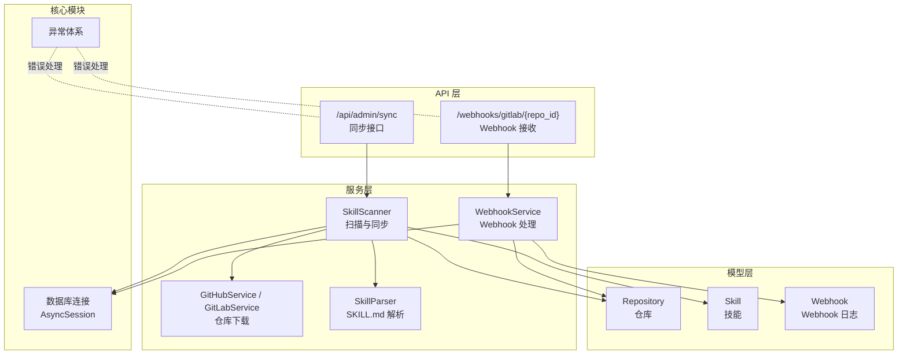
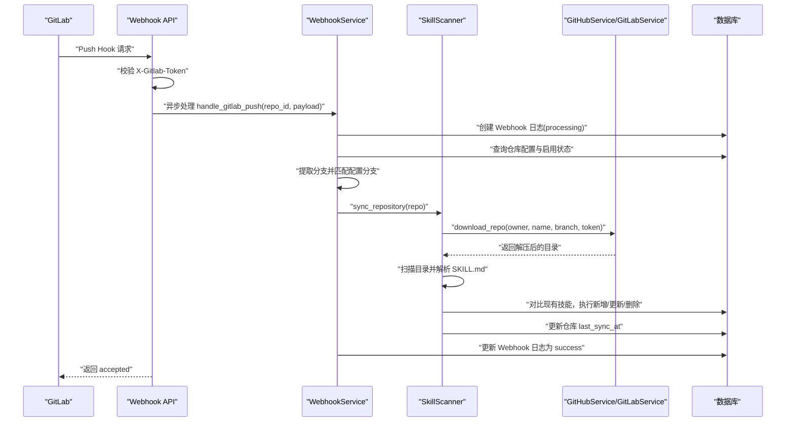
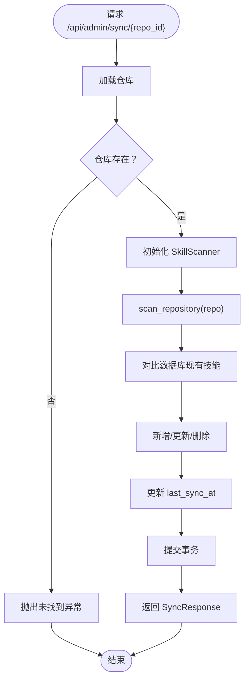
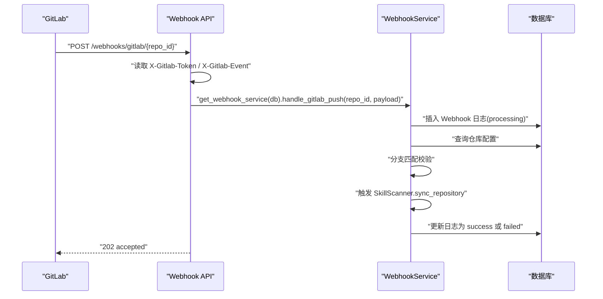
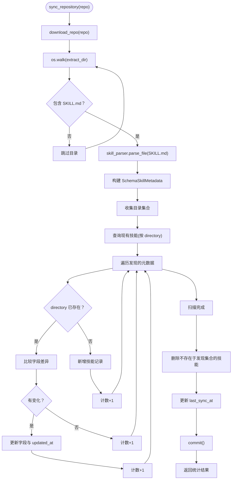
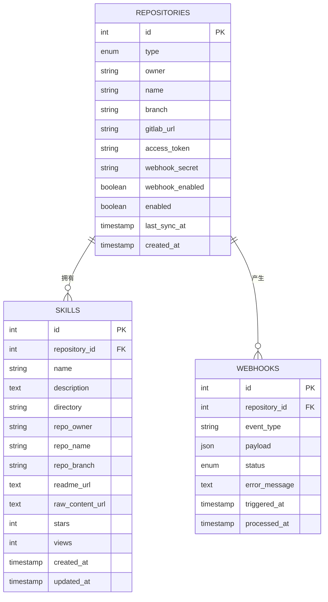
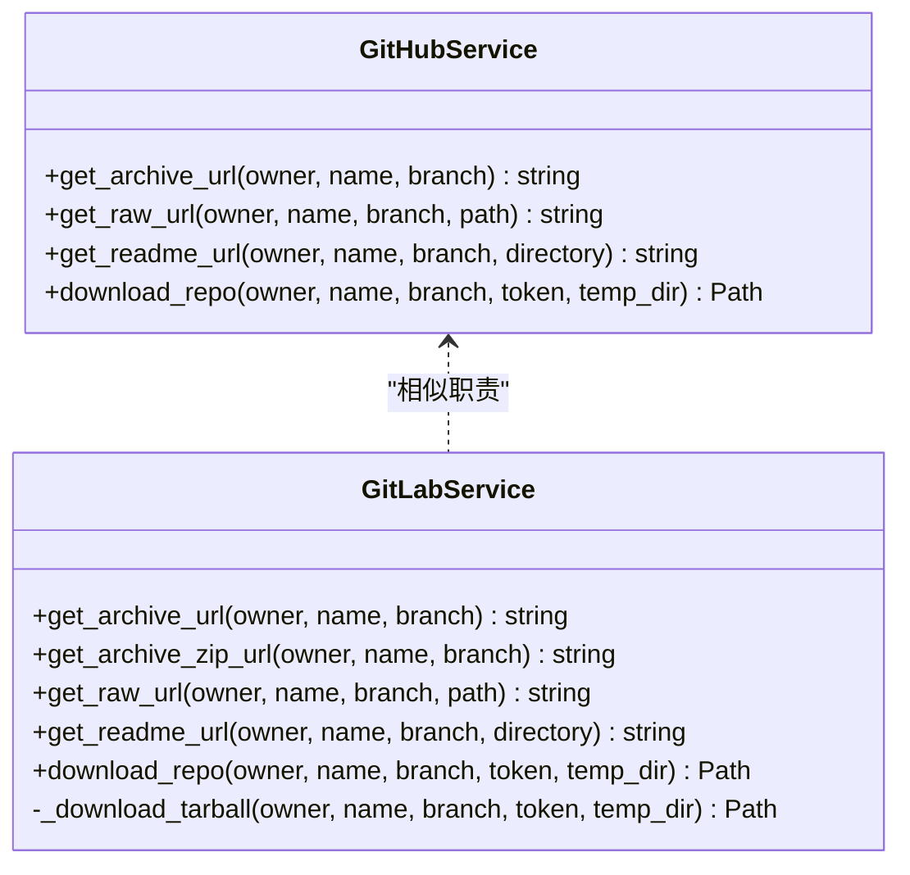
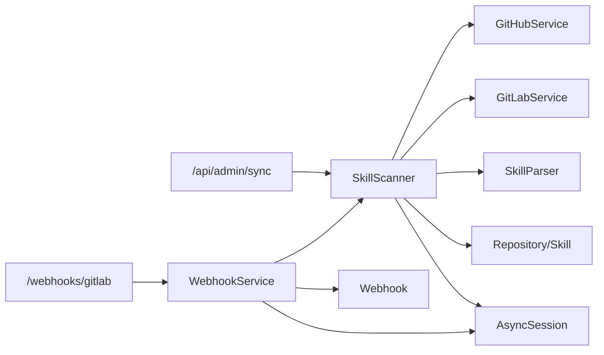

# 内容同步机制

<cite>
**本文引用的文件**
- [backend/api/sync.py](file://backend/api/sync.py)
- [backend/services/scanner.py](file://backend/services/scanner.py)
- [backend/services/webhook.py](file://backend/services/webhook.py)
- [backend/api/webhooks.py](file://backend/api/webhooks.py)
- [backend/models/repository.py](file://backend/models/repository.py)
- [backend/models/skill.py](file://backend/models/skill.py)
- [backend/models/webhook.py](file://backend/models/webhook.py)
- [backend/services/github.py](file://backend/services/github.py)
- [backend/services/gitlab.py](file://backend/services/gitlab.py)
- [backend/services/parser.py](file://backend/services/parser.py)
- [backend/schemas/repository.py](file://backend/schemas/repository.py)
- [backend/schemas/skill.py](file://backend/schemas/skill.py)
- [backend/core/exceptions.py](file://backend/core/exceptions.py)
- [backend/database.py](file://backend/database.py)
- [backend/.env.example](file://backend/.env.example)
- [backend/schema.sql](file://backend/schema.sql)
- [backend/main.py](file://backend/main.py)
</cite>

## 目录
1. [简介](#简介)
2. [项目结构](#项目结构)
3. [核心组件](#核心组件)
4. [架构总览](#架构总览)
5. [详细组件分析](#详细组件分析)
6. [依赖分析](#依赖分析)
7. [性能考虑](#性能考虑)
8. [故障排查指南](#故障排查指南)
9. [结论](#结论)
10. [附录](#附录)

## 简介
本文件系统性阐述内容同步机制的设计与实现，涵盖自动同步触发流程（Webhook 事件处理）、扫描任务调度与内容更新机制、同步服务的增量更新与冲突解决策略、数据一致性保障、同步状态管理（进度跟踪、错误重试与完成通知）、同步配置选项、性能调优参数与监控指标，以及同步流程示例、常见问题排查与优化建议。目标是帮助管理员与开发者全面理解并高效运维该同步体系。

## 项目结构
后端采用 FastAPI 架构，按功能分层组织：
- API 层：对外提供同步与 Webhook 接口
- 服务层：封装扫描、下载、解析、仓库对接等业务逻辑
- 模型层：定义数据库实体与关系
- 核心模块：异常、日志、数据库连接等基础设施
- 配置与脚本：环境变量、数据库初始化脚本

图表来源
- [backend/api/sync.py](file://backend/api/sync.py#L17-L32)
- [backend/api/webhooks.py](file://backend/api/webhooks.py#L15-L64)
- [backend/services/scanner.py](file://backend/services/scanner.py#L21-L26)
- [backend/services/webhook.py](file://backend/services/webhook.py#L15-L19)
- [backend/services/github.py](file://backend/services/github.py#L14-L21)
- [backend/services/gitlab.py](file://backend/services/gitlab.py#L15-L26)
- [backend/services/parser.py](file://backend/services/parser.py#L13-L14)
- [backend/models/repository.py](file://backend/models/repository.py#L18-L37)
- [backend/models/skill.py](file://backend/models/skill.py#L11-L32)
- [backend/models/webhook.py](file://backend/models/webhook.py#L19-L34)
- [backend/database.py](file://backend/database.py#L42-L55)

章节来源
- [backend/main.py](file://backend/main.py#L24-L84)
- [backend/schema.sql](file://backend/schema.sql#L22-L99)

## 核心组件
- 同步 API：提供手动同步单个仓库与全量同步接口，并支持同步状态查询。
- Webhook API：接收 GitLab Push 事件，进行签名校验与异步处理。
- 同步服务（SkillScanner）：负责仓库下载、目录扫描、元数据解析、数据库增量更新与一致性维护。
- Webhook 服务（WebhookService）：记录 Webhook 日志、分支匹配、触发同步并更新状态。
- 仓库与技能模型：定义仓库、技能与 Webhook 日志的数据结构与索引。
- 仓库服务：GitHubService 与 GitLabService 提供归档下载与 URL 构建能力。
- 解析器：SkillParser 解析 SKILL.md 的 front matter 元数据。
- 异常与数据库：统一异常体系与异步数据库连接。

章节来源
- [backend/api/sync.py](file://backend/api/sync.py#L17-L111)
- [backend/api/webhooks.py](file://backend/api/webhooks.py#L15-L89)
- [backend/services/scanner.py](file://backend/services/scanner.py#L21-L196)
- [backend/services/webhook.py](file://backend/services/webhook.py#L15-L115)
- [backend/models/repository.py](file://backend/models/repository.py#L18-L74)
- [backend/models/skill.py](file://backend/models/skill.py#L11-L90)
- [backend/models/webhook.py](file://backend/models/webhook.py#L19-L49)
- [backend/services/github.py](file://backend/services/github.py#L14-L104)
- [backend/services/gitlab.py](file://backend/services/gitlab.py#L15-L169)
- [backend/services/parser.py](file://backend/services/parser.py#L13-L85)
- [backend/core/exceptions.py](file://backend/core/exceptions.py#L7-L101)
- [backend/database.py](file://backend/database.py#L42-L75)

## 架构总览
下图展示从 Webhook 接收到同步完成的端到端流程，包括鉴权、签名校验、分支过滤、仓库下载、扫描解析、数据库更新与状态记录。

图表来源
- [backend/api/webhooks.py](file://backend/api/webhooks.py#L15-L64)
- [backend/services/webhook.py](file://backend/services/webhook.py#L31-L101)
- [backend/services/scanner.py](file://backend/services/scanner.py#L70-L156)
- [backend/services/github.py](file://backend/services/github.py#L36-L102)
- [backend/services/gitlab.py](file://backend/services/gitlab.py#L46-L164)
- [backend/models/webhook.py](file://backend/models/webhook.py#L19-L34)

## 详细组件分析

### 同步 API（手动与状态查询）
- 单仓同步：接收仓库 ID，校验存在性，构造扫描器并执行同步，返回统计结果。
- 全仓同步：查询所有启用仓库，逐个执行同步，聚合结果与错误日志。
- 同步状态：统计总数、已同步数量，列出最近同步的仓库。

图表来源
- [backend/api/sync.py](file://backend/api/sync.py#L17-L32)
- [backend/services/scanner.py](file://backend/services/scanner.py#L70-L156)

章节来源
- [backend/api/sync.py](file://backend/api/sync.py#L17-L111)
- [backend/schemas/repository.py](file://backend/schemas/repository.py#L66-L73)

### Webhook API（GitLab Push 事件）
- 接收 Push Hook，校验 X-Gitlab-Token 与 X-Gitlab-Event。
- 异步处理：记录 Webhook 日志、校验仓库与启用状态、分支匹配、触发同步并更新状态。
- 支持查询 Webhook 日志。

图表来源
- [backend/api/webhooks.py](file://backend/api/webhooks.py#L15-L64)
- [backend/services/webhook.py](file://backend/services/webhook.py#L31-L101)
- [backend/models/webhook.py](file://backend/models/webhook.py#L19-L34)

章节来源
- [backend/api/webhooks.py](file://backend/api/webhooks.py#L15-L89)
- [backend/services/webhook.py](file://backend/services/webhook.py#L15-L115)

### 同步服务（SkillScanner）
- 仓库下载：根据仓库类型选择 GitHubService 或 GitLabService，下载归档并解压。
- 目录扫描：遍历解压目录，识别包含 SKILL.md 的目录，解析元数据。
- 增量更新：对比数据库中现有技能，仅在字段变化时更新，未出现的目录删除。
- 一致性维护：更新仓库 last_sync_at；提交事务；返回统计结果。

图表来源
- [backend/services/scanner.py](file://backend/services/scanner.py#L70-L156)
- [backend/services/parser.py](file://backend/services/parser.py#L18-L70)
- [backend/models/skill.py](file://backend/models/skill.py#L11-L32)

章节来源
- [backend/services/scanner.py](file://backend/services/scanner.py#L21-L196)
- [backend/services/parser.py](file://backend/services/parser.py#L13-L85)
- [backend/models/skill.py](file://backend/models/skill.py#L11-L90)

### 仓库与技能模型
- Repository：仓库类型、分支、访问令牌、Webhook 配置、启用状态与最后同步时间。
- Skill：技能名称、描述、目录、仓库归属信息、URL、统计字段与时间戳。
- Webhook：事件类型、状态、错误信息、触发与处理时间。

图表来源
- [backend/models/repository.py](file://backend/models/repository.py#L18-L74)
- [backend/models/skill.py](file://backend/models/skill.py#L11-L90)
- [backend/models/webhook.py](file://backend/models/webhook.py#L19-L49)
- [backend/schema.sql](file://backend/schema.sql#L22-L99)

章节来源
- [backend/models/repository.py](file://backend/models/repository.py#L18-L74)
- [backend/models/skill.py](file://backend/models/skill.py#L11-L90)
- [backend/models/webhook.py](file://backend/models/webhook.py#L19-L49)
- [backend/schema.sql](file://backend/schema.sql#L22-L99)

### 仓库服务（GitHub/GitLab）
- GitHubService：生成归档 URL、原始文件 URL、README URL；异步下载 ZIP 并解压。
- GitLabService：优先尝试 ZIP，失败则回退 tar.gz；支持自定义实例地址；异步下载并解压。

图表来源
- [backend/services/github.py](file://backend/services/github.py#L14-L104)
- [backend/services/gitlab.py](file://backend/services/gitlab.py#L15-L169)

章节来源
- [backend/services/github.py](file://backend/services/github.py#L14-L104)
- [backend/services/gitlab.py](file://backend/services/gitlab.py#L15-L169)

### 解析器（SkillParser）
- 从 SKILL.md 中提取 YAML front matter，构建 SkillMetadata；若无 front matter 或解析失败，返回空对象。

章节来源
- [backend/services/parser.py](file://backend/services/parser.py#L13-L85)
- [backend/schemas/skill.py](file://backend/schemas/skill.py#L54-L60)

## 依赖分析
- API 依赖注入：通过 get_db 提供 AsyncSession，确保事务正确提交/回滚。
- 服务耦合：SkillScanner 依赖 GitHubService/GitLabService 与 SkillParser；WebhookService 依赖 SkillScanner 与数据库。
- 模型关系：Repository 与 Skill 一对多；Repository 与 Webhook 一对多。
- 异常传播：外部服务错误统一包装为 ExternalServiceError，便于上层处理。

图表来源
- [backend/api/sync.py](file://backend/api/sync.py#L17-L32)
- [backend/api/webhooks.py](file://backend/api/webhooks.py#L15-L64)
- [backend/services/scanner.py](file://backend/services/scanner.py#L21-L26)
- [backend/services/webhook.py](file://backend/services/webhook.py#L15-L19)
- [backend/services/github.py](file://backend/services/github.py#L14-L21)
- [backend/services/gitlab.py](file://backend/services/gitlab.py#L15-L26)
- [backend/services/parser.py](file://backend/services/parser.py#L13-L14)
- [backend/models/repository.py](file://backend/models/repository.py#L18-L37)
- [backend/models/skill.py](file://backend/models/skill.py#L11-L32)
- [backend/models/webhook.py](file://backend/models/webhook.py#L19-L34)
- [backend/database.py](file://backend/database.py#L42-L55)

章节来源
- [backend/database.py](file://backend/database.py#L42-L55)
- [backend/core/exceptions.py](file://backend/core/exceptions.py#L91-L101)

## 性能考虑
- 连接池与超时：数据库引擎配置了连接池大小与预检查；HTTP 客户端设置了超时，避免阻塞。
- 异步 I/O：使用 httpx.AsyncClient 与 aiofiles 进行异步下载与文件操作，提升吞吐。
- 扫描范围控制：扫描时跳过隐藏目录，减少 IO 开销。
- 增量更新策略：仅在字段变化时更新，避免不必要的写入。
- 并发与批处理：全仓同步采用逐个仓库顺序执行，避免并发竞争；如需更高吞吐，可在服务层引入队列与并发控制。
- 缓存与索引：数据库为 skills 建立全文索引以支持搜索；为 webhooks 建立索引加速查询。

章节来源
- [backend/database.py](file://backend/database.py#L20-L36)
- [backend/services/github.py](file://backend/services/github.py#L69-L74)
- [backend/services/gitlab.py](file://backend/services/gitlab.py#L81-L91)
- [backend/services/scanner.py](file://backend/services/scanner.py#L49-L68)
- [backend/schema.sql](file://backend/schema.sql#L74-L99)

## 故障排查指南
- Webhook 未触发
  - 检查 GitLab 项目中的 Webhook URL、Secret Token 与触发事件是否正确配置。
  - 查看 /webhooks/logs 返回的 Webhook 日志，确认状态与错误信息。
- 分支不匹配被跳过
  - 确认仓库配置的 branch 与推送分支一致；否则会被视为“跳过”而非失败。
- 外部服务错误
  - GitHub/GitLab 下载失败会抛出 ExternalServiceError；检查 access_token、网络连通性与服务可用性。
- 仓库不存在或未启用
  - API 会返回相应错误；确认仓库 ID 与 enabled/webhook_enabled 状态。
- 数据库连接问题
  - 应用启动时会进行健康检查；检查 DATABASE_URL 与数据库可达性。

章节来源
- [backend/api/webhooks.py](file://backend/api/webhooks.py#L37-L42)
- [backend/services/webhook.py](file://backend/services/webhook.py#L66-L82)
- [backend/core/exceptions.py](file://backend/core/exceptions.py#L91-L101)
- [backend/api/sync.py](file://backend/api/sync.py#L25-L27)
- [backend/main.py](file://backend/main.py#L88-L104)

## 结论
该同步机制通过 Webhook 与手动接口双通道驱动，结合仓库服务与解析器，实现了对 GitHub/GitLab 仓库中 SKILL.md 的自动化发现与增量同步。系统具备完善的日志与状态追踪、分支过滤与签名校验、异常统一处理与数据库一致性保障，适合在企业内网环境中稳定运行。后续可在服务层引入队列与并发控制以进一步提升吞吐，并扩展更多事件类型与监控指标。

## 附录

### 同步流程示例
- Webhook 自动触发
  - GitLab 推送事件到达 /webhooks/gitlab/{repo_id}
  - 校验签名与事件类型，记录 Webhook 日志并异步处理
  - 匹配分支后调用 SkillScanner.sync_repository
  - 成功后更新 Webhook 日志状态与仓库同步时间
- 手动同步
  - 调用 /api/admin/sync/{repo_id} 或 /api/admin/sync/all
  - 返回每个仓库的同步统计结果

章节来源
- [backend/api/webhooks.py](file://backend/api/webhooks.py#L15-L64)
- [backend/api/sync.py](file://backend/api/sync.py#L17-L71)
- [backend/services/webhook.py](file://backend/services/webhook.py#L31-L101)
- [backend/services/scanner.py](file://backend/services/scanner.py#L70-L156)

### 同步配置选项
- 仓库配置
  - 类型：GITHUB 或 GITLAB
  - 分支：默认 main
  - 访问令牌：私有仓库需要
  - GitLab 自建实例地址：可选
  - Webhook 密钥：用于签名校验
  - 启用状态：控制是否参与自动同步
- 环境变量
  - DATABASE_URL：数据库连接串
  - JWT_SECRET_KEY：JWT 密钥
  - ENCRYPTION_KEY：敏感数据加密密钥
  - ENVIRONMENT/DEBUG/PORT：运行环境与端口

章节来源
- [backend/models/repository.py](file://backend/models/repository.py#L18-L74)
- [backend/.env.example](file://backend/.env.example#L1-L17)
- [backend/schemas/repository.py](file://backend/schemas/repository.py#L21-L42)

### 性能调优参数
- 数据库连接池
  - pool_size：连接池大小
  - max_overflow：最大溢出连接数
  - pool_pre_ping：连接健康检查
- HTTP 超时
  - GitHub/GitLab 下载客户端超时
- 扫描策略
  - 跳过隐藏目录，减少 IO
  - 增量更新，避免全量写入

章节来源
- [backend/database.py](file://backend/database.py#L20-L36)
- [backend/services/github.py](file://backend/services/github.py#L69-L74)
- [backend/services/gitlab.py](file://backend/services/gitlab.py#L81-L91)
- [backend/services/scanner.py](file://backend/services/scanner.py#L49-L68)

### 监控指标
- Webhook 日志
  - 状态分布（pending/processing/success/failed）
  - 触发时间与处理耗时
- 同步统计
  - 每次同步的新增/更新/不变/删除数量
  - 仓库最后同步时间
- 健康检查
  - /api/health 数据库连接状态

章节来源
- [backend/models/webhook.py](file://backend/models/webhook.py#L19-L49)
- [backend/api/sync.py](file://backend/api/sync.py#L74-L111)
- [backend/main.py](file://backend/main.py#L88-L104)