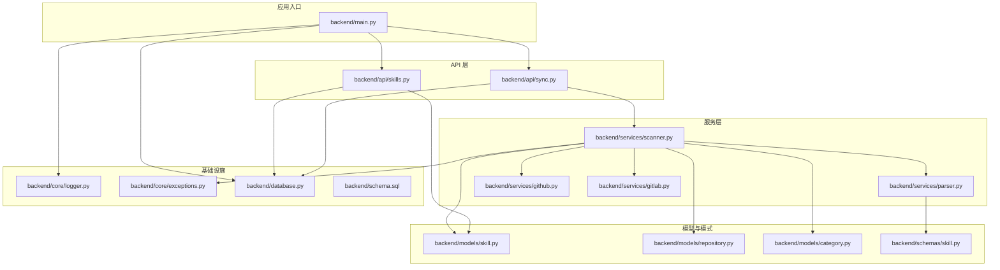
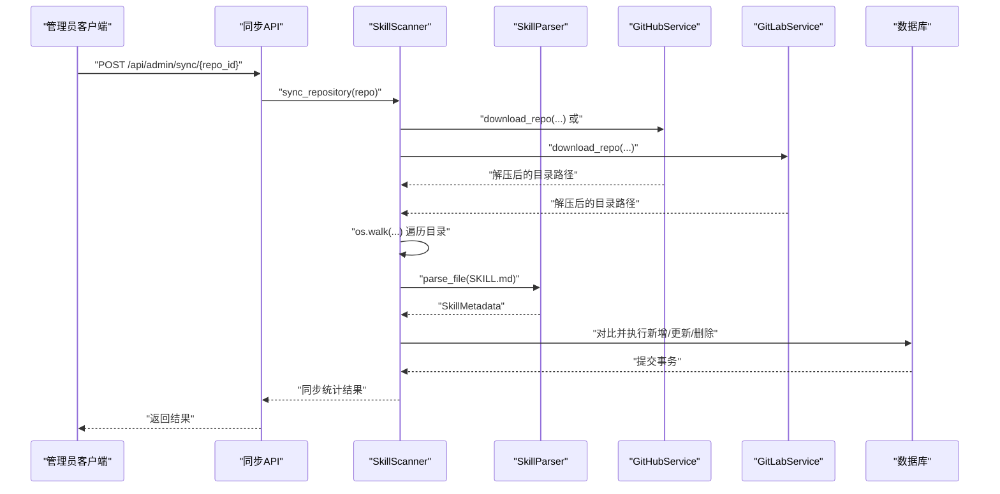
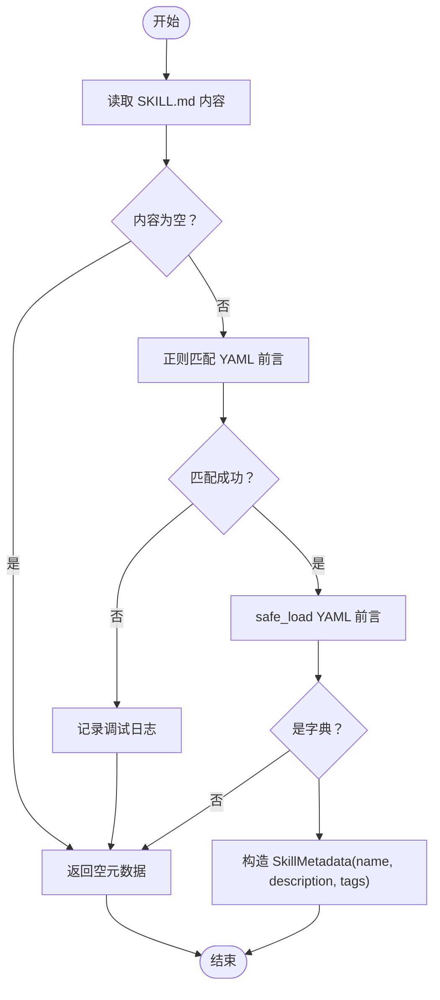
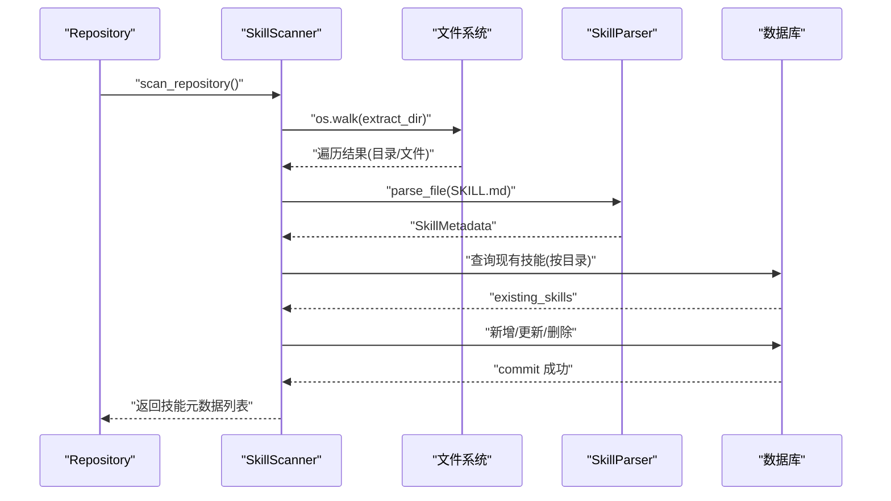
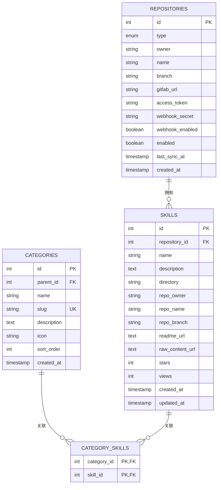
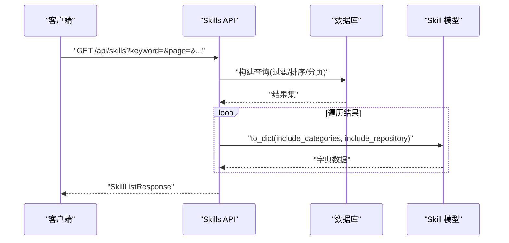
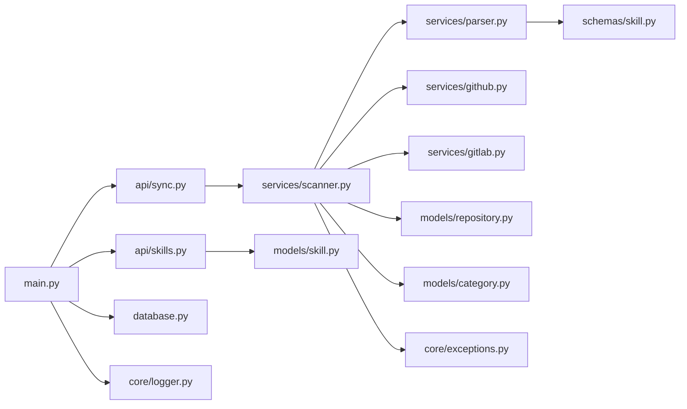

# 技能发现系统

<cite>
**本文引用的文件**
- [backend/main.py](file://backend/main.py)
- [backend/services/parser.py](file://backend/services/parser.py)
- [backend/services/scanner.py](file://backend/services/scanner.py)
- [backend/services/github.py](file://backend/services/github.py)
- [backend/services/gitlab.py](file://backend/services/gitlab.py)
- [backend/models/skill.py](file://backend/models/skill.py)
- [backend/models/repository.py](file://backend/models/repository.py)
- [backend/models/category.py](file://backend/models/category.py)
- [backend/schemas/skill.py](file://backend/schemas/skill.py)
- [backend/api/skills.py](file://backend/api/skills.py)
- [backend/api/sync.py](file://backend/api/sync.py)
- [backend/database.py](file://backend/database.py)
- [backend/core/logger.py](file://backend/core/logger.py)
- [backend/core/exceptions.py](file://backend/core/exceptions.py)
- [backend/schema.sql](file://backend/schema.sql)
- [backend/requirements.txt](file://backend/requirements.txt)
- [README.md](file://README.md)
</cite>

## 目录
1. [简介](#简介)
2. [项目结构](#项目结构)
3. [核心组件](#核心组件)
4. [架构总览](#架构总览)
5. [详细组件分析](#详细组件分析)
6. [依赖关系分析](#依赖关系分析)
7. [性能考虑](#性能考虑)
8. [故障排查指南](#故障排查指南)
9. [结论](#结论)
10. [附录](#附录)

## 简介
本文件面向开发者与运维人员，系统性阐述“技能发现系统”的实现与使用方法。重点包括：
- SKILL.md 文件解析器的实现原理：YAML 前言处理、正则表达式匹配与元数据提取算法
- 技能扫描服务的工作流程：文件系统遍历、目录检测与内容解析
- 技能元数据模型设计：字段定义、验证规则与数据转换
- SKILL.md 文件格式规范、示例模板与最佳实践
- 错误处理机制、性能优化策略与调试指南

## 项目结构
后端采用 FastAPI + SQLAlchemy 异步 ORM 架构，按职责划分为 API、服务层、模型层、模式层与核心模块。核心模块围绕“仓库扫描 → 技能解析 → 数据库存储”展开。

图表来源
- [backend/main.py](file://backend/main.py#L1-L137)
- [backend/api/skills.py](file://backend/api/skills.py#L1-L160)
- [backend/api/sync.py](file://backend/api/sync.py#L1-L112)
- [backend/services/parser.py](file://backend/services/parser.py#L1-L86)
- [backend/services/scanner.py](file://backend/services/scanner.py#L1-L197)
- [backend/services/github.py](file://backend/services/github.py#L1-L105)
- [backend/services/gitlab.py](file://backend/services/gitlab.py#L1-L170)
- [backend/models/skill.py](file://backend/models/skill.py#L1-L90)
- [backend/models/repository.py](file://backend/models/repository.py#L1-L74)
- [backend/models/category.py](file://backend/models/category.py#L1-L94)
- [backend/schemas/skill.py](file://backend/schemas/skill.py#L1-L60)
- [backend/database.py](file://backend/database.py#L1-L75)
- [backend/core/logger.py](file://backend/core/logger.py#L1-L95)
- [backend/core/exceptions.py](file://backend/core/exceptions.py#L1-L101)
- [backend/schema.sql](file://backend/schema.sql#L1-L106)

章节来源
- [backend/main.py](file://backend/main.py#L1-L137)
- [README.md](file://README.md#L1-L173)

## 核心组件
- SKILL.md 解析器：负责读取并解析 SKILL.md 的 YAML 前言，提取技能名称、描述与标签等元数据，同时提供“是否包含 SKILL.md”的快速检测能力。
- 技能扫描服务：负责下载仓库、遍历目录、定位 SKILL.md 并生成标准化的技能元数据，随后与数据库进行比对并执行新增、更新与删除操作。
- GitHub/GitLab 仓库服务：封装仓库归档下载与 URL 构造逻辑，统一不同平台的差异。
- 技能与仓库模型：定义技能与仓库的数据结构、索引与关系，支撑查询、分页与全文检索。
- API 层：提供技能查询、详情、浏览计数与同步管理等接口；同步接口支持后台任务与批量同步。
- 核心模块：日志、异常与数据库连接管理，保障可观测性与稳定性。

章节来源
- [backend/services/parser.py](file://backend/services/parser.py#L1-L86)
- [backend/services/scanner.py](file://backend/services/scanner.py#L1-L197)
- [backend/services/github.py](file://backend/services/github.py#L1-L105)
- [backend/services/gitlab.py](file://backend/services/gitlab.py#L1-L170)
- [backend/models/skill.py](file://backend/models/skill.py#L1-L90)
- [backend/models/repository.py](file://backend/models/repository.py#L1-L74)
- [backend/models/category.py](file://backend/models/category.py#L1-L94)
- [backend/schemas/skill.py](file://backend/schemas/skill.py#L1-L60)
- [backend/api/skills.py](file://backend/api/skills.py#L1-L160)
- [backend/api/sync.py](file://backend/api/sync.py#L1-L112)
- [backend/core/logger.py](file://backend/core/logger.py#L1-L95)
- [backend/core/exceptions.py](file://backend/core/exceptions.py#L1-L101)
- [backend/database.py](file://backend/database.py#L1-L75)

## 架构总览
技能发现系统以“同步 API”为入口，调用扫描服务完成仓库扫描与技能解析，最终写入数据库并对外提供查询接口。

图表来源
- [backend/api/sync.py](file://backend/api/sync.py#L17-L32)
- [backend/services/scanner.py](file://backend/services/scanner.py#L27-L156)
- [backend/services/parser.py](file://backend/services/parser.py#L18-L70)
- [backend/services/github.py](file://backend/services/github.py#L36-L102)
- [backend/services/gitlab.py](file://backend/services/gitlab.py#L46-L165)

## 详细组件分析

### SKILL.md 解析器（SkillParser）
- 正则表达式匹配：通过固定三短横线界定的前言块，分离 YAML 前言与正文内容。
- YAML 解析：使用安全加载方式解析前言，确保输入为字典类型；若解析失败或格式不正确，返回空元数据对象。
- 元数据提取：从 YAML 中提取 name、description、tags 字段，其余字段保持 None。
- 快速检测：提供 has_skill_marker 方法判断目录是否包含 SKILL.md，避免不必要的文件读取。

图表来源
- [backend/services/parser.py](file://backend/services/parser.py#L35-L70)

章节来源
- [backend/services/parser.py](file://backend/services/parser.py#L1-L86)

### 技能扫描服务（SkillScanner）
- 仓库下载：根据仓库类型选择 GitHub 或 GitLab 服务，下载归档并解压到临时目录。
- 目录遍历：使用 os.walk 遍历解压目录，跳过隐藏目录；当发现 SKILL.md 时，解析元数据并计算相对路径作为目录标识。
- 元数据标准化：将解析得到的元数据映射为 API 响应所需的 SchemaSkillMetadata，缺失名称时回退为目录名。
- 同步更新：与数据库中现有技能进行比对，分别执行新增、更新、删除操作，并记录变更统计。
- URL 构建：根据仓库类型构建 README 与原始内容 URL，便于前端展示与跳转。

图表来源
- [backend/services/scanner.py](file://backend/services/scanner.py#L27-L156)
- [backend/services/parser.py](file://backend/services/parser.py#L18-L70)

章节来源
- [backend/services/scanner.py](file://backend/services/scanner.py#L1-L197)

### GitHub/GitLab 仓库服务
- GitHubService：提供归档 URL、原始文件 URL 与 README URL 构造；下载 ZIP 并解压，处理访问令牌与错误。
- GitLabService：支持 ZIP 与 tar.gz 归档下载，优先尝试 ZIP，失败时回退 tar.gz；同样处理访问令牌与错误。

章节来源
- [backend/services/github.py](file://backend/services/github.py#L1-L105)
- [backend/services/gitlab.py](file://backend/services/gitlab.py#L1-L170)

### 技能与仓库模型
- Skill 模型：包含仓库外键、名称、描述、目录路径、仓库归属信息、浏览与点赞计数、创建/更新时间，以及与 Category 的多对多关系。
- Repository 模型：仓库类型（GitHub/GitLab）、分支、访问令牌、Webhook 配置、启用状态与最后同步时间。
- Category 模型：支持父子关系的多级分类，维护与 Skill 的多对多关联。

图表来源
- [backend/models/repository.py](file://backend/models/repository.py#L18-L74)
- [backend/models/skill.py](file://backend/models/skill.py#L11-L42)
- [backend/models/category.py](file://backend/models/category.py#L19-L46)
- [backend/schema.sql](file://backend/schema.sql#L22-L75)

章节来源
- [backend/models/repository.py](file://backend/models/repository.py#L1-L74)
- [backend/models/skill.py](file://backend/models/skill.py#L1-L90)
- [backend/models/category.py](file://backend/models/category.py#L1-L94)
- [backend/schema.sql](file://backend/schema.sql#L1-L106)

### 技能元数据模型与验证
- SkillMetadata（解析用）：name/description/directory/tags，允许部分字段缺失。
- SkillResponse/SkillBase（API 响应用）：包含更丰富的字段与校验规则（如长度、排序字段与顺序），用于对外暴露与序列化。
- 搜索参数 SkillSearchParams：关键词、分类/仓库筛选、分页与排序参数的严格校验。

章节来源
- [backend/schemas/skill.py](file://backend/schemas/skill.py#L1-L60)

### API 工作流
- 技能列表与详情：支持关键词 LIKE 搜索、分类/仓库过滤、排序与分页；访问时自动增加浏览计数。
- 同步管理：支持单仓库与全仓库同步，后台任务执行，失败记录日志并返回汇总结果。

图表来源
- [backend/api/skills.py](file://backend/api/skills.py#L18-L95)
- [backend/models/skill.py](file://backend/models/skill.py#L44-L77)

章节来源
- [backend/api/skills.py](file://backend/api/skills.py#L1-L160)
- [backend/api/sync.py](file://backend/api/sync.py#L1-L112)

## 依赖关系分析
- 组件耦合：扫描服务依赖解析器与仓库服务；API 层依赖模型与数据库；核心模块为日志与异常提供统一出口。
- 外部依赖：HTTP 客户端（异步）、YAML 解析、数据库驱动（SQLAlchemy + aiomysql）。
- 循环依赖：未见循环导入；模型与服务通过接口契约交互。

图表来源
- [backend/api/sync.py](file://backend/api/sync.py#L1-L112)
- [backend/api/skills.py](file://backend/api/skills.py#L1-L160)
- [backend/services/scanner.py](file://backend/services/scanner.py#L1-L197)
- [backend/services/parser.py](file://backend/services/parser.py#L1-L86)
- [backend/services/github.py](file://backend/services/github.py#L1-L105)
- [backend/services/gitlab.py](file://backend/services/gitlab.py#L1-L170)
- [backend/models/skill.py](file://backend/models/skill.py#L1-L90)
- [backend/models/repository.py](file://backend/models/repository.py#L1-L74)
- [backend/models/category.py](file://backend/models/category.py#L1-L94)
- [backend/schemas/skill.py](file://backend/schemas/skill.py#L1-L60)
- [backend/main.py](file://backend/main.py#L1-L137)
- [backend/database.py](file://backend/database.py#L1-L75)
- [backend/core/logger.py](file://backend/core/logger.py#L1-L95)
- [backend/core/exceptions.py](file://backend/core/exceptions.py#L1-L101)

章节来源
- [backend/requirements.txt](file://backend/requirements.txt)

## 性能考虑
- I/O 密集优化：仓库下载与文件系统遍历均采用异步方式，减少阻塞；建议合理设置数据库连接池大小与超时时间。
- 缓存与索引：数据库对技能表建立全文索引，提升关键词搜索性能；对常用查询字段建立索引。
- 批量操作：同步时先查询现有技能，再进行集合运算与批量新增/更新，降低多次往返。
- 日志与监控：统一日志输出与错误分类，便于定位性能瓶颈与异常。

## 故障排查指南
- 下载失败：检查仓库类型、访问令牌、网络连通性；查看外部服务错误日志。
- 解析失败：确认 SKILL.md 前言格式是否符合 YAML 三短横线界定；检查编码与缩进。
- 同步异常：查看同步 API 返回的错误信息与日志；核对仓库配置与 Webhook 设置。
- 数据库问题：确认连接字符串、表结构初始化与权限；检查连接池配置。

章节来源
- [backend/core/exceptions.py](file://backend/core/exceptions.py#L91-L101)
- [backend/core/logger.py](file://backend/core/logger.py#L1-L95)
- [backend/services/github.py](file://backend/services/github.py#L69-L102)
- [backend/services/gitlab.py](file://backend/services/gitlab.py#L81-L165)
- [backend/api/sync.py](file://backend/api/sync.py#L50-L71)

## 结论
技能发现系统通过清晰的服务边界与严格的模式校验，实现了从仓库扫描到技能解析再到数据库同步的完整闭环。SKILL.md 的 YAML 前言规范简洁明确，配合解析器与扫描服务，能够稳定地提取技能元数据并提供高性能的查询体验。建议在生产环境中完善监控与告警，持续优化同步策略与数据库索引。

## 附录

### SKILL.md 文件格式规范与示例
- 文件位置：仓库任意目录下的 SKILL.md
- 前言格式：使用 YAML 三短横线界定，字段包括 name、description、tags
- 示例模板：参见项目 README 中的“Skill 识别规则”部分

章节来源
- [README.md](file://README.md#L156-L168)

### 最佳实践
- 将技能说明集中在 SKILL.md，确保前言字段完整且语义清晰
- 使用稳定的目录命名，避免频繁变更导致目录标识变化
- 为私有仓库配置访问令牌，确保同步成功率
- 定期清理无用分类与重复技能，保持数据整洁

### 数据库初始化
- 使用 schema.sql 初始化数据库与表结构，包含用户、仓库、分类、技能与 Webhook 日志表

章节来源
- [backend/schema.sql](file://backend/schema.sql#L1-L106)