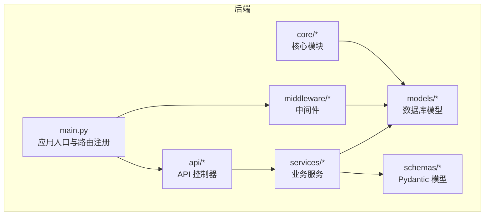
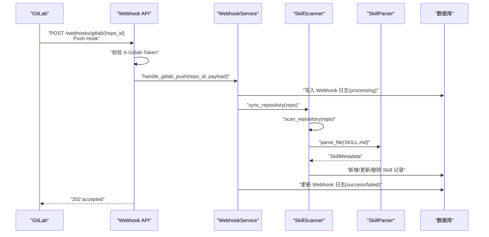
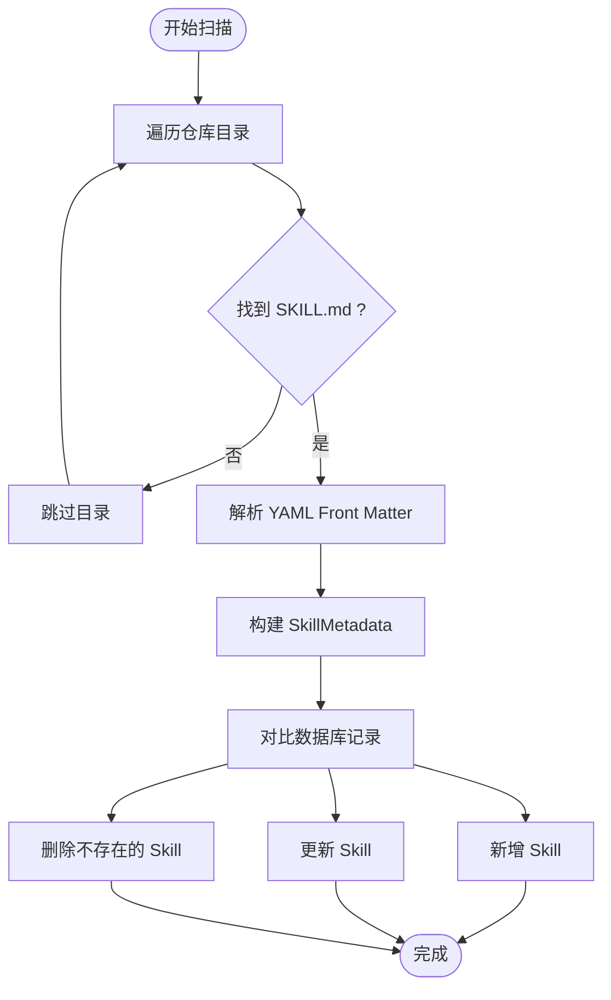
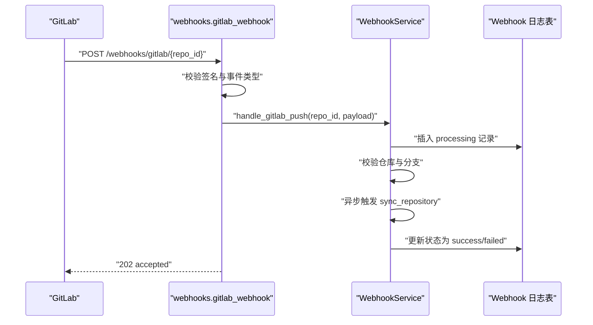
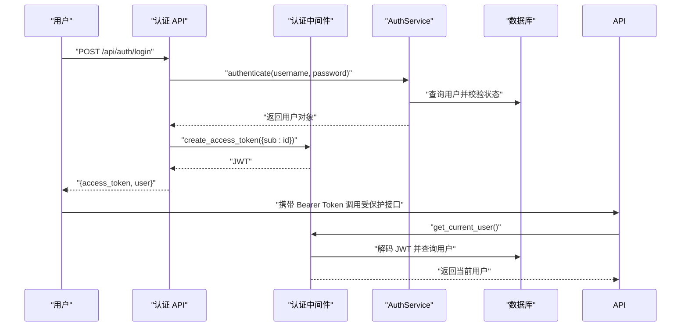
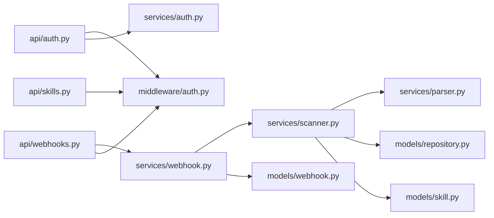

# 核心功能

<cite>
**本文引用的文件**
- [backend/main.py](file://backend/main.py)
- [backend/api/skills.py](file://backend/api/skills.py)
- [backend/api/webhooks.py](file://backend/api/webhooks.py)
- [backend/services/parser.py](file://backend/services/parser.py)
- [backend/models/skill.py](file://backend/models/skill.py)
- [backend/services/webhook.py](file://backend/services/webhook.py)
- [backend/api/auth.py](file://backend/api/auth.py)
- [backend/models/repository.py](file://backend/models/repository.py)
- [backend/services/scanner.py](file://backend/services/scanner.py)
- [backend/.env.example](file://backend/.env.example)
- [backend/middleware/auth.py](file://backend/middleware/auth.py)
- [backend/services/auth.py](file://backend/services/auth.py)
- [backend/models/webhook.py](file://backend/models/webhook.py)
- [backend/schemas/skill.py](file://backend/schemas/skill.py)
- [README.md](file://README.md)
</cite>

## 目录
1. [简介](#简介)
2. [项目结构](#项目结构)
3. [核心组件](#核心组件)
4. [架构总览](#架构总览)
5. [详细组件分析](#详细组件分析)
6. [依赖分析](#依赖分析)
7. [性能考虑](#性能考虑)
8. [故障排除指南](#故障排除指南)
9. [结论](#结论)
10. [附录](#附录)

## 简介
本文件面向 Skills Hub 的核心功能，围绕以下主题提供系统化、可操作的技术文档：
- 技能发现系统：SKILL.md 文件解析、内容提取算法与元数据处理流程
- Webhook 集成机制：GitLab Push 事件处理、自动同步触发与事件日志管理
- 用户认证系统：JWT 令牌管理、密码加密与权限控制实现
- 内容同步流程、缓存策略与性能优化方案
- 功能使用示例、配置参数与故障排除指南

## 项目结构
后端采用 FastAPI + SQLAlchemy 异步 ORM 的分层架构：
- API 层：定义路由与对外接口
- 服务层：封装业务逻辑（扫描、解析、Webhook 处理、认证等）
- 模型层：数据库实体与关系映射
- 中间件层：认证、安全头、日志与限流
- 核心模块：异常处理、日志、安全工具
- 配置：环境变量与数据库初始化脚本

图表来源
- [backend/main.py](file://backend/main.py#L47-L84)
- [backend/api/skills.py](file://backend/api/skills.py#L15-L160)
- [backend/services/scanner.py](file://backend/services/scanner.py#L21-L197)
- [backend/models/skill.py](file://backend/models/skill.py#L11-L90)

章节来源
- [backend/main.py](file://backend/main.py#L1-L137)
- [README.md](file://README.md#L20-L47)

## 核心组件
- 技能发现与解析：通过扫描仓库目录，定位 SKILL.md 并解析其 YAML Front Matter，生成 Skill 元数据
- 内容同步：根据仓库配置拉取代码，对比数据库中已存在记录，执行新增、更新、删除
- Webhook 集成：接收 GitLab Push 事件，校验签名，异步触发同步，并记录日志
- 用户认证：基于 JWT 的登录、令牌签发与权限校验（普通用户、管理员）
- 数据模型：Skill、Repository、Webhook 等实体及关联关系

章节来源
- [backend/services/parser.py](file://backend/services/parser.py#L13-L86)
- [backend/services/scanner.py](file://backend/services/scanner.py#L21-L197)
- [backend/services/webhook.py](file://backend/services/webhook.py#L15-L124)
- [backend/api/auth.py](file://backend/api/auth.py#L24-L65)
- [backend/middleware/auth.py](file://backend/middleware/auth.py#L25-L134)
- [backend/models/skill.py](file://backend/models/skill.py#L11-L90)
- [backend/models/repository.py](file://backend/models/repository.py#L18-L74)
- [backend/models/webhook.py](file://backend/models/webhook.py#L19-L49)

## 架构总览
Skills Hub 的核心工作流如下：
- Webhook 接收 GitLab Push 事件 → 校验签名 → 异步触发同步 → 扫描仓库 → 解析 SKILL.md → 同步数据库 → 记录日志
- 前台 API 提供技能检索、详情查看与浏览计数更新
- 认证中间件负责 JWT 解码与权限校验

图表来源
- [backend/api/webhooks.py](file://backend/api/webhooks.py#L15-L65)
- [backend/services/webhook.py](file://backend/services/webhook.py#L31-L101)
- [backend/services/scanner.py](file://backend/services/scanner.py#L27-L157)
- [backend/services/parser.py](file://backend/services/parser.py#L18-L70)
- [backend/models/webhook.py](file://backend/models/webhook.py#L19-L49)

## 详细组件分析

### 技能发现系统（SKILL.md 解析与元数据处理）
- 解析器职责：读取 SKILL.md 文件，匹配 YAML Front Matter，提取 name/description/tags，构造 SkillMetadata
- 扫描器职责：遍历仓库目录，定位包含 SKILL.md 的目录，调用解析器生成元数据，构建 README 与原始文件 URL
- 同步器职责：对比数据库中现有记录，执行新增、更新、删除；更新仓库最后同步时间

图表来源
- [backend/services/parser.py](file://backend/services/parser.py#L18-L70)
- [backend/services/scanner.py](file://backend/services/scanner.py#L27-L157)
- [backend/models/skill.py](file://backend/models/skill.py#L44-L77)

章节来源
- [backend/services/parser.py](file://backend/services/parser.py#L13-L86)
- [backend/services/scanner.py](file://backend/services/scanner.py#L21-L197)
- [backend/models/skill.py](file://backend/models/skill.py#L11-L90)
- [backend/schemas/skill.py](file://backend/schemas/skill.py#L54-L60)

### Webhook 集成机制（GitLab Push 事件）
- 接收端点：/webhooks/gitlab/{repo_id}，校验 X-Gitlab-Token 与 X-Gitlab-Event
- 处理流程：记录 Webhook 日志 → 校验仓库与分支 → 异步触发同步 → 记录成功/失败
- 日志查询：按仓库与时间排序，限制数量

图表来源
- [backend/api/webhooks.py](file://backend/api/webhooks.py#L15-L65)
- [backend/services/webhook.py](file://backend/services/webhook.py#L31-L101)
- [backend/models/webhook.py](file://backend/models/webhook.py#L19-L49)

章节来源
- [backend/api/webhooks.py](file://backend/api/webhooks.py#L15-L90)
- [backend/services/webhook.py](file://backend/services/webhook.py#L15-L124)
- [backend/models/webhook.py](file://backend/models/webhook.py#L11-L49)

### 用户认证系统（JWT、密码加密与权限控制）
- 登录：接收用户名/密码，验证后签发 JWT（含过期时间）
- 当前用户：从 Authorization Bearer 中解析 JWT，获取用户对象
- 管理员权限：要求角色为 admin
- 密码管理：注册/修改/重置均通过统一的密码管理器进行哈希与校验

图表来源
- [backend/api/auth.py](file://backend/api/auth.py#L24-L48)
- [backend/middleware/auth.py](file://backend/middleware/auth.py#L25-L96)
- [backend/services/auth.py](file://backend/services/auth.py#L64-L98)

章节来源
- [backend/api/auth.py](file://backend/api/auth.py#L24-L65)
- [backend/middleware/auth.py](file://backend/middleware/auth.py#L25-L134)
- [backend/services/auth.py](file://backend/services/auth.py#L19-L130)
- [backend/.env.example](file://backend/.env.example#L1-L17)

### 内容同步流程、缓存策略与性能优化
- 同步流程：下载仓库 → 扫描目录 → 解析 SKILL.md → 对比数据库 → 增删改 → 更新仓库同步时间
- 缓存策略：当前未实现专用缓存层；可通过数据库索引与分页查询优化（如按 created_at/updated_at 排序）
- 性能优化建议：
  - 异步并发：将扫描与解析过程异步化，避免阻塞请求
  - 分页与限制：API 默认分页与最大页大小限制，减少一次性传输
  - 增量同步：基于仓库分支与最后同步时间进行增量扫描
  - CDN/直链：README 与原始文件 URL 直接指向 Git 平台，减少本地存储压力

章节来源
- [backend/services/scanner.py](file://backend/services/scanner.py#L70-L157)
- [backend/api/skills.py](file://backend/api/skills.py#L18-L95)
- [backend/models/repository.py](file://backend/models/repository.py#L60-L74)

## 依赖分析
- 组件耦合：
  - API 层仅依赖服务层与中间件，保持薄控制器
  - 服务层依赖模型与核心模块，职责清晰
  - 中间件依赖数据库会话与配置，提供横切能力
- 外部依赖：
  - GitLab/GitHub API（通过服务封装）
  - MySQL（SQLAlchemy 异步驱动）

图表来源
- [backend/api/auth.py](file://backend/api/auth.py#L1-L65)
- [backend/middleware/auth.py](file://backend/middleware/auth.py#L1-L134)
- [backend/services/auth.py](file://backend/services/auth.py#L1-L130)
- [backend/api/webhooks.py](file://backend/api/webhooks.py#L1-L90)
- [backend/services/webhook.py](file://backend/services/webhook.py#L1-L124)
- [backend/services/scanner.py](file://backend/services/scanner.py#L1-L197)
- [backend/services/parser.py](file://backend/services/parser.py#L1-L86)
- [backend/models/repository.py](file://backend/models/repository.py#L1-L74)
- [backend/models/skill.py](file://backend/models/skill.py#L1-L90)
- [backend/models/webhook.py](file://backend/models/webhook.py#L1-L49)

## 性能考虑
- I/O 密集：仓库下载与文件解析为 I/O 密集任务，建议使用异步与并发策略
- 数据库查询：分页与索引优化，避免全表扫描
- 缓存：可引入 Redis 缓存热门技能详情与搜索结果，降低数据库压力
- 并发：利用 BackgroundTasks 与异步任务队列，避免阻塞 Webhook 响应

## 故障排除指南
- Webhook 403（无效签名）
  - 检查 GitLab Secret Token 与仓库配置的 webhook_secret 是否一致
  - 确认 X-Gitlab-Token 头是否正确传递
- Webhook 404（仓库不存在）
  - 确认 repo_id 是否正确，且仓库已录入系统
- Webhook 分支不匹配
  - 检查仓库配置的 branch 与实际推送分支是否一致
- 同步失败
  - 查看 Webhook 日志中的错误信息，确认仓库访问令牌与网络连通性
- 登录失败
  - 核对用户名/密码与账户状态；确认 JWT_SECRET_KEY 配置正确
- 技能未显示
  - 确认仓库中存在 SKILL.md，Front Matter 格式正确，且仓库已同步

章节来源
- [backend/api/webhooks.py](file://backend/api/webhooks.py#L30-L53)
- [backend/services/webhook.py](file://backend/services/webhook.py#L66-L82)
- [backend/models/webhook.py](file://backend/models/webhook.py#L11-L17)
- [backend/api/auth.py](file://backend/api/auth.py#L24-L40)
- [backend/.env.example](file://backend/.env.example#L1-L17)

## 结论
Skills Hub 通过清晰的分层设计与模块化服务，实现了从仓库扫描、SKILL.md 解析到自动同步与 Webhook 集成的完整闭环。结合 JWT 认证与权限控制，系统具备良好的安全性与可维护性。建议后续引入缓存与增量同步策略，进一步提升性能与用户体验。

## 附录

### 功能使用示例
- 技能搜索与浏览
  - GET /api/skills?keyword=xxx&category_id=1&page=1&page_size=20&sort_by=created_at&sort_order=desc
- 技能详情
  - GET /api/skills/{id}
- 增加浏览计数
  - POST /api/skills/{id}/view
- 待分配分类的技能
  - GET /api/skills/sync/pending
- 用户登录
  - POST /api/auth/login（返回 access_token 与用户信息）
- 获取当前用户
  - GET /api/auth/me（需携带 Bearer Token）
- 修改密码
  - POST /api/auth/change-password（需携带 Bearer Token）

章节来源
- [backend/api/skills.py](file://backend/api/skills.py#L18-L160)
- [backend/api/auth.py](file://backend/api/auth.py#L24-L65)
- [README.md](file://README.md#L140-L147)

### 配置参数
- 数据库连接：DATABASE_URL
- JWT 密钥：JWT_SECRET_KEY
- 加密密钥：ENCRYPTION_KEY
- 环境：ENVIRONMENT（development/production）
- 端口：PORT
- 示例参考：backend/.env.example

章节来源
- [backend/.env.example](file://backend/.env.example#L1-L17)
- [README.md](file://README.md#L112-L119)