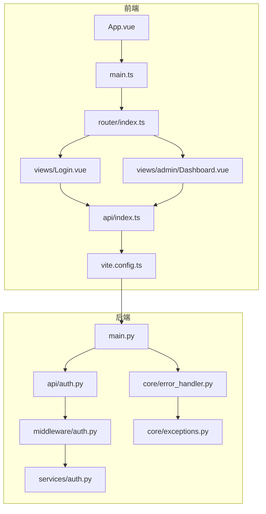
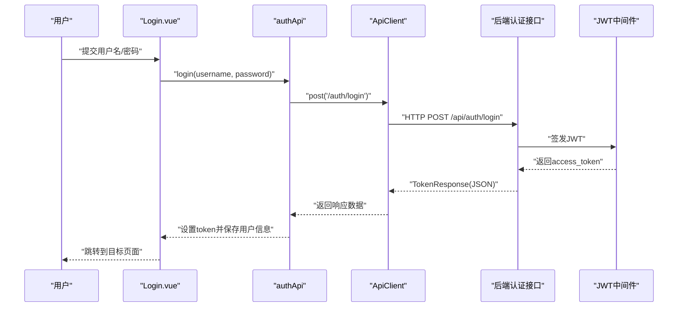
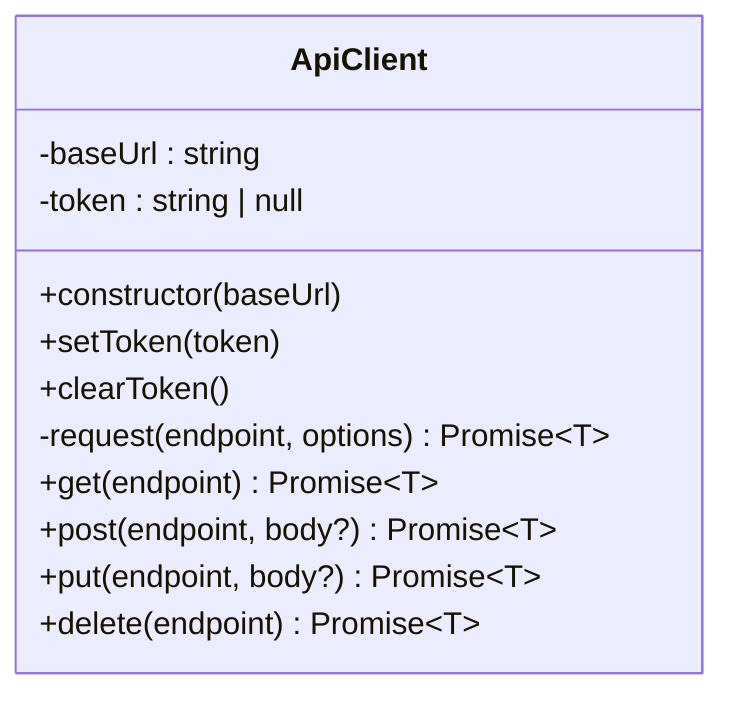
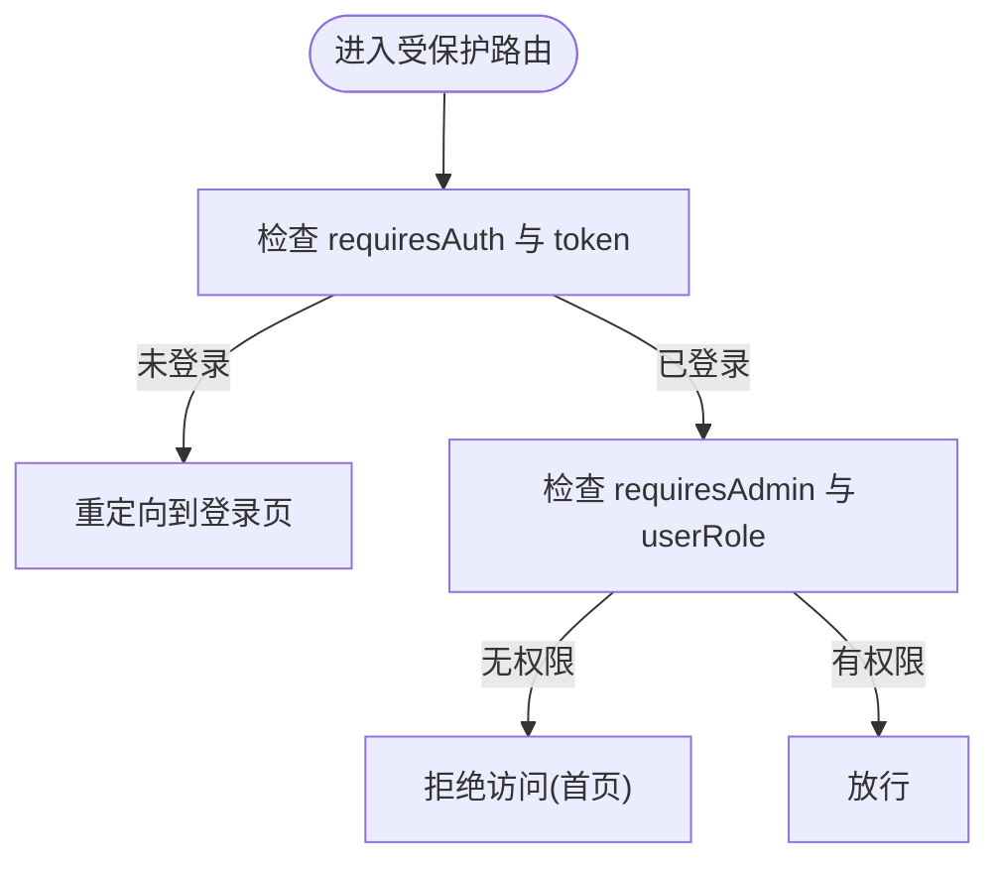
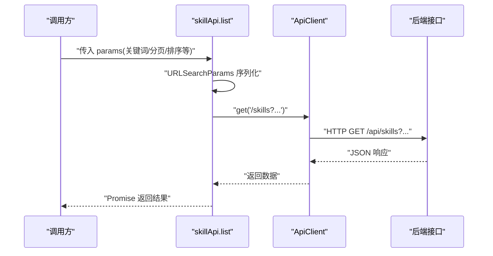
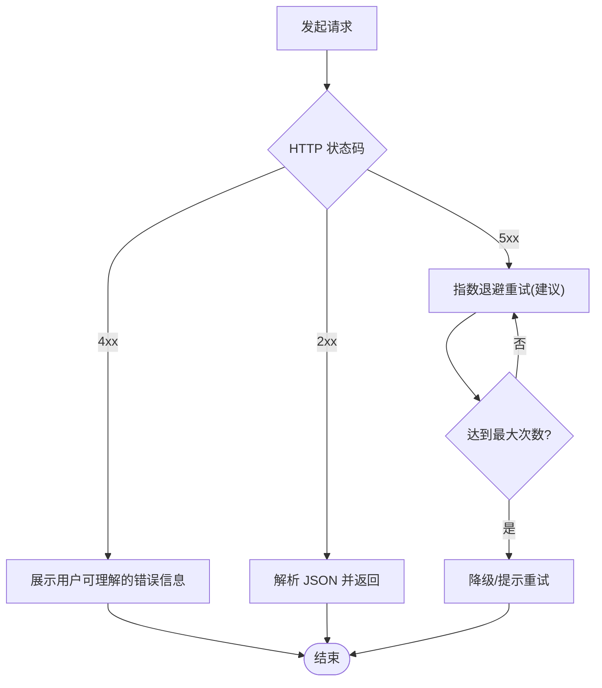
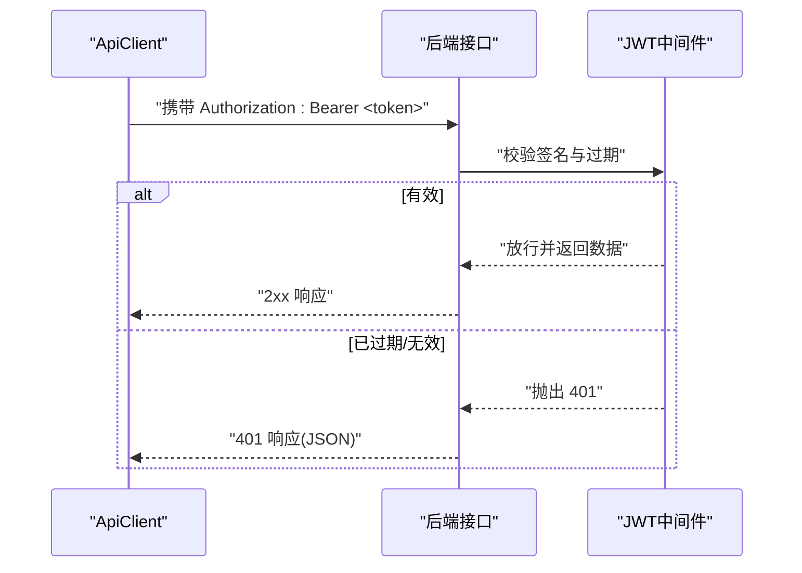
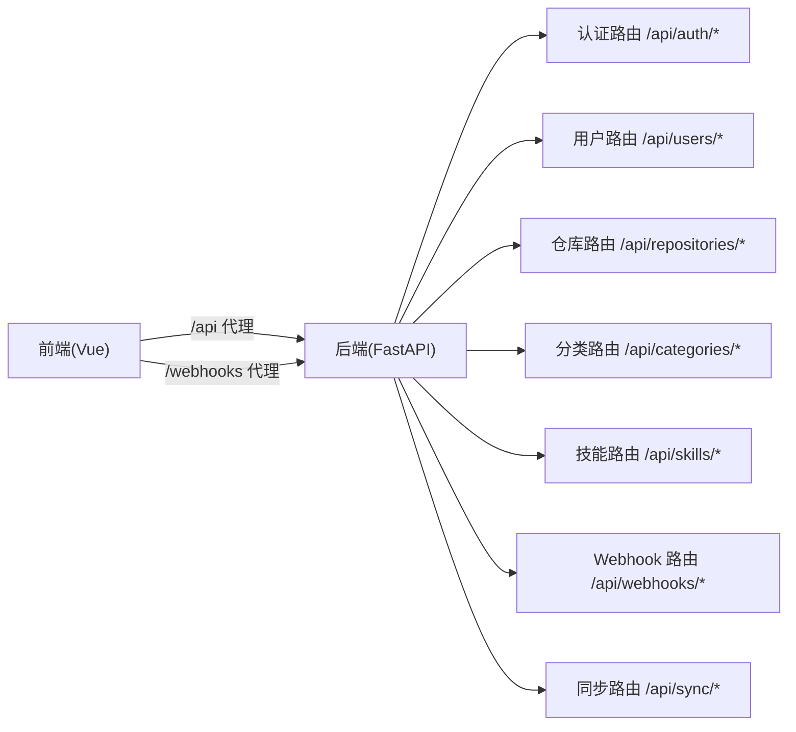

# API 客户端

<cite>
**本文引用的文件**
- [frontend/src/api/index.ts](file://frontend/src/api/index.ts)
- [frontend/src/router/index.ts](file://frontend/src/router/index.ts)
- [frontend/src/views/Login.vue](file://frontend/src/views/Login.vue)
- [frontend/src/views/admin/Dashboard.vue](file://frontend/src/views/admin/Dashboard.vue)
- [frontend/src/App.vue](file://frontend/src/App.vue)
- [frontend/src/main.ts](file://frontend/src/main.ts)
- [frontend/package.json](file://frontend/package.json)
- [frontend/vite.config.ts](file://frontend/vite.config.ts)
- [backend/main.py](file://backend/main.py)
- [backend/api/auth.py](file://backend/api/auth.py)
- [backend/middleware/auth.py](file://backend/middleware/auth.py)
- [backend/services/auth.py](file://backend/services/auth.py)
- [backend/core/error_handler.py](file://backend/core/error_handler.py)
- [backend/core/exceptions.py](file://backend/core/exceptions.py)
</cite>

## 目录
1. [简介](#简介)
2. [项目结构](#项目结构)
3. [核心组件](#核心组件)
4. [架构总览](#架构总览)
5. [详细组件分析](#详细组件分析)
6. [依赖关系分析](#依赖关系分析)
7. [性能考量](#性能考量)
8. [故障排查指南](#故障排查指南)
9. [结论](#结论)
10. [附录](#附录)

## 简介
本文件面向前端开发者，系统性梳理前端 API 客户端的设计与实现，涵盖以下主题：
- HTTP 客户端配置与请求/响应处理机制
- 认证状态管理、Token 存储与刷新策略
- 错误处理策略、重试与降级建议
- API 请求封装、参数序列化与响应数据转换
- 网络异常处理、超时控制与并发请求管理
- 实际调用示例与最佳实践

## 项目结构
前端采用 Vue 3 + TypeScript + Vite 构建，API 客户端位于 frontend/src/api/index.ts，通过 Vite 开发服务器代理到后端服务。路由守卫负责基于本地存储的认证状态进行访问控制。

**图表来源**
- [frontend/src/App.vue](file://frontend/src/App.vue#L1-L31)
- [frontend/src/main.ts](file://frontend/src/main.ts#L1-L12)
- [frontend/src/router/index.ts](file://frontend/src/router/index.ts#L1-L63)
- [frontend/src/api/index.ts](file://frontend/src/api/index.ts#L1-L224)
- [frontend/src/views/Login.vue](file://frontend/src/views/Login.vue#L1-L185)
- [frontend/src/views/admin/Dashboard.vue](file://frontend/src/views/admin/Dashboard.vue#L1-L163)
- [frontend/vite.config.ts](file://frontend/vite.config.ts#L1-L24)
- [backend/main.py](file://backend/main.py#L1-L137)
- [backend/api/auth.py](file://backend/api/auth.py#L1-L65)
- [backend/middleware/auth.py](file://backend/middleware/auth.py#L1-L134)
- [backend/services/auth.py](file://backend/services/auth.py#L1-L130)
- [backend/core/error_handler.py](file://backend/core/error_handler.py#L1-L102)
- [backend/core/exceptions.py](file://backend/core/exceptions.py#L1-L101)

**章节来源**
- [frontend/src/api/index.ts](file://frontend/src/api/index.ts#L1-L224)
- [frontend/src/router/index.ts](file://frontend/src/router/index.ts#L1-L63)
- [frontend/vite.config.ts](file://frontend/vite.config.ts#L1-L24)
- [backend/main.py](file://backend/main.py#L1-L137)

## 核心组件
- ApiClient 类：封装统一的 HTTP 请求逻辑，自动注入 Authorization 头，解析 JSON 响应，并在非 2xx 状态时抛出错误。
- 认证 API：authApi.login、authApi.getMe、authApi.changePassword。
- 资源 API：repositoryApi、categoryApi、skillApi、userApi、syncApi、webhookApi。
- 路由守卫：根据 localStorage 中的 token 与角色控制访问。
- 登录视图：发起登录请求，成功后写入 token 与用户角色，跳转至目标页面。
- 后端认证中间件：JWT 签发与校验、用户获取与权限校验。

**章节来源**
- [frontend/src/api/index.ts](file://frontend/src/api/index.ts#L16-L84)
- [frontend/src/api/index.ts](file://frontend/src/api/index.ts#L88-L224)
- [frontend/src/router/index.ts](file://frontend/src/router/index.ts#L5-L24)
- [frontend/src/views/Login.vue](file://frontend/src/views/Login.vue#L59-L84)
- [backend/middleware/auth.py](file://backend/middleware/auth.py#L25-L96)

## 架构总览
前端通过 Vite 代理将 /api 与 /webhooks 请求转发至后端。登录成功后，前端将 JWT 写入 localStorage，并在后续请求中通过 ApiClient 的 Authorization 头发送。后端使用中间件解析 JWT 并进行权限校验。

**图表来源**
- [frontend/src/views/Login.vue](file://frontend/src/views/Login.vue#L59-L84)
- [frontend/src/api/index.ts](file://frontend/src/api/index.ts#L88-L102)
- [backend/api/auth.py](file://backend/api/auth.py#L24-L40)
- [backend/middleware/auth.py](file://backend/middleware/auth.py#L25-L33)

## 详细组件分析

### ApiClient 类与请求封装
- 基础配置
  - 默认基础路径为 /api，构造函数从 localStorage 读取 token 并持久化。
  - 统一 Content-Type: application/json，必要时合并自定义 headers。
- 认证头注入
  - 若存在 token，则在请求头添加 Authorization: Bearer <token>。
- 错误处理
  - 使用 fetch 发送请求，解析 JSON；若 response.ok 为 false，抛出包含后端错误消息的异常。
- 方法封装
  - 提供 get/post/put/delete 封装，简化调用。

**图表来源**
- [frontend/src/api/index.ts](file://frontend/src/api/index.ts#L16-L84)

**章节来源**
- [frontend/src/api/index.ts](file://frontend/src/api/index.ts#L16-L84)

### 认证状态管理与会话控制
- 登录流程
  - 登录视图调用 authApi.login，接收 TokenResponse 后：
    - 调用 api.setToken 写入 token；
    - localStorage.setItem('userRole') 与 localStorage.setItem('username') 保存用户角色与用户名；
    - 根据路由参数 redirect 或默认首页跳转。
- 路由守卫
  - requiresAuth 与 requiresAdmin 通过 localStorage 中的 token 与 userRole 控制访问。
- 退出登录
  - 清除 token、userRole、username，跳转到登录页。

**图表来源**
- [frontend/src/router/index.ts](file://frontend/src/router/index.ts#L5-L24)
- [frontend/src/views/admin/Dashboard.vue](file://frontend/src/views/admin/Dashboard.vue#L70-L76)
- [frontend/src/views/Login.vue](file://frontend/src/views/Login.vue#L71-L78)

**章节来源**
- [frontend/src/views/Login.vue](file://frontend/src/views/Login.vue#L59-L84)
- [frontend/src/router/index.ts](file://frontend/src/router/index.ts#L5-L24)
- [frontend/src/views/admin/Dashboard.vue](file://frontend/src/views/admin/Dashboard.vue#L70-L76)

### API 请求封装、参数序列化与响应转换
- 参数序列化
  - skillApi.list 使用 URLSearchParams 将查询参数拼接到路径上，仅传递非 undefined 的键值。
- 响应转换
  - 所有接口返回的 JSON 数据直接作为 Promise 结果；后端统一错误响应结构由 ApiClient 在非 2xx 时抛错。
- 接口分组
  - 认证、仓库、分类、技能、用户、同步、Webhook 等接口按功能模块导出，便于按需引入。

**图表来源**
- [frontend/src/api/index.ts](file://frontend/src/api/index.ts#L158-L183)
- [frontend/src/api/index.ts](file://frontend/src/api/index.ts#L36-L61)

**章节来源**
- [frontend/src/api/index.ts](file://frontend/src/api/index.ts#L158-L183)

### 错误处理策略、重试机制与降级方案
- 前端错误处理
  - ApiClient 在非 2xx 时抛出错误，调用方可通过 try/catch 捕获并提示用户或执行降级逻辑。
- 后端统一错误响应
  - 自定义异常 SkillsException、验证错误、HTTP 异常与通用异常均被规范化为包含错误码、消息、时间戳与路径的 JSON 结构。
- 重试与降级建议
  - 对于 5xx 或网络瞬时错误，可在调用层实现指数退避重试；
  - 对于 4xx 语义化错误，优先引导用户修正输入或权限；
  - 降级：在离线或网络异常时，可返回缓存数据或只读视图。

**图表来源**
- [frontend/src/api/index.ts](file://frontend/src/api/index.ts#L56-L61)
- [backend/core/error_handler.py](file://backend/core/error_handler.py#L14-L30)
- [backend/core/exceptions.py](file://backend/core/exceptions.py#L7-L22)

**章节来源**
- [frontend/src/api/index.ts](file://frontend/src/api/index.ts#L56-L61)
- [backend/core/error_handler.py](file://backend/core/error_handler.py#L14-L102)
- [backend/core/exceptions.py](file://backend/core/exceptions.py#L1-L101)

### Token 刷新与会话控制
- 当前实现
  - 前端仅存储 JWT，未内置自动刷新逻辑；路由守卫基于 localStorage 的 token 进行鉴权。
- 后端实现
  - JWT 使用 HS256 算法，有效期 24 小时；中间件负责解析与校验。
- 建议
  - 前端可监听 401 未授权错误，触发重新登录或刷新流程；
  - 后端可考虑引入刷新 Token 机制（当前未实现）。

**图表来源**
- [frontend/src/api/index.ts](file://frontend/src/api/index.ts#L45-L47)
- [backend/middleware/auth.py](file://backend/middleware/auth.py#L36-L46)
- [backend/middleware/auth.py](file://backend/middleware/auth.py#L56-L95)

**章节来源**
- [frontend/src/api/index.ts](file://frontend/src/api/index.ts#L18-L34)
- [backend/middleware/auth.py](file://backend/middleware/auth.py#L17-L21)
- [backend/middleware/auth.py](file://backend/middleware/auth.py#L36-L95)

### 网络异常处理、超时控制与并发请求管理
- 网络异常
  - fetch 本身不抛出“超时”异常，但可结合 AbortController 实现超时控制；当前客户端未内置超时与重试。
- 并发请求
  - 当前未实现并发队列或去重策略；可通过业务层在调用前进行幂等控制或使用信号量限制并发数。
- 建议
  - 为 fetch 添加超时包装；
  - 对重复请求进行去重或合并；
  - 对关键请求增加重试与指数退避。

**章节来源**
- [frontend/src/api/index.ts](file://frontend/src/api/index.ts#L36-L61)

### API 调用示例与最佳实践
- 登录示例
  - 在登录视图中调用 authApi.login，成功后调用 api.setToken 保存 token，并将用户角色与用户名写入 localStorage，最后根据 redirect 跳转。
- 受保护路由访问
  - 路由守卫会在进入受保护路由前检查 token 与角色，未满足条件则重定向到登录页或首页。
- 错误处理最佳实践
  - 在调用层统一 try/catch，区分 4xx 与 5xx，对 4xx 提示用户修正，对 5xx 提示稍后重试；
  - 对关键操作增加加载态与防重复提交；
  - 对 401 未授权统一跳转登录页。

**章节来源**
- [frontend/src/views/Login.vue](file://frontend/src/views/Login.vue#L59-L84)
- [frontend/src/router/index.ts](file://frontend/src/router/index.ts#L5-L24)

## 依赖关系分析
- 前端依赖
  - Vue 3、Vue Router、Pinia；开发时通过 Vite 代理 /api 与 /webhooks。
- 后端依赖
  - FastAPI、SQLAlchemy 异步、JTW 解析、CORS、日志与异常处理。
- 前后端交互
  - 前端通过 /api 前缀访问后端接口；后端注册认证、用户、仓库、分类、技能、Webhook、同步等路由。

**图表来源**
- [frontend/vite.config.ts](file://frontend/vite.config.ts#L8-L17)
- [backend/main.py](file://backend/main.py#L77-L84)
- [backend/api/auth.py](file://backend/api/auth.py#L21-L48)

**章节来源**
- [frontend/package.json](file://frontend/package.json#L10-L19)
- [frontend/vite.config.ts](file://frontend/vite.config.ts#L1-L24)
- [backend/main.py](file://backend/main.py#L47-L84)

## 性能考量
- 减少不必要的请求：对列表与详情接口进行缓存与去重；
- 合理的并发：限制同时请求数，避免阻塞 UI；
- 超时与重试：为关键请求设置合理超时与指数退避重试；
- 响应体积：后端尽量返回精简字段，前端按需渲染；
- 静态资源：生产构建优化与缓存策略。

## 故障排查指南
- 401 未授权
  - 检查 localStorage 中 token 是否存在且未过期；确认后端 JWT 密钥与算法一致。
- 403 禁止访问
  - 检查用户角色是否为 admin；确认后端 require_admin 依赖链正常。
- 422 参数校验失败
  - 查看后端返回的 details 字段定位具体字段与错误类型。
- 500 服务器内部错误
  - 查看后端日志与异常处理器输出，定位具体异常类型与堆栈。
- 跨域与代理
  - 确认 Vite 代理配置正确，目标地址与 changeOrigin 设置无误。

**章节来源**
- [backend/core/error_handler.py](file://backend/core/error_handler.py#L14-L102)
- [backend/core/exceptions.py](file://backend/core/exceptions.py#L24-L101)
- [frontend/vite.config.ts](file://frontend/vite.config.ts#L8-L17)

## 结论
该前端 API 客户端以简洁的封装实现了统一的请求与错误处理，配合后端 JWT 认证与统一异常处理，形成了清晰的前后端协作模式。建议在现有基础上补充超时控制、重试与 Token 刷新机制，进一步提升稳定性与用户体验。

## 附录
- 开发与构建
  - 使用 npm scripts dev/build/preview；Vite 开发服务器运行在 5173 端口，代理 /api 与 /webhooks 到后端 8000 端口。
- 安全建议
  - 生产环境务必设置安全的 JWT 密钥与加密密钥，启用 HTTPS 与严格的 CORS 策略。

**章节来源**
- [frontend/package.json](file://frontend/package.json#L5-L9)
- [frontend/vite.config.ts](file://frontend/vite.config.ts#L6-L17)
- [backend/main.py](file://backend/main.py#L57-L63)