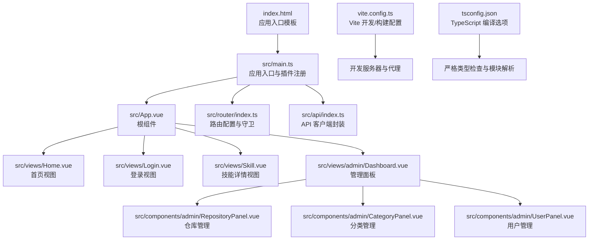
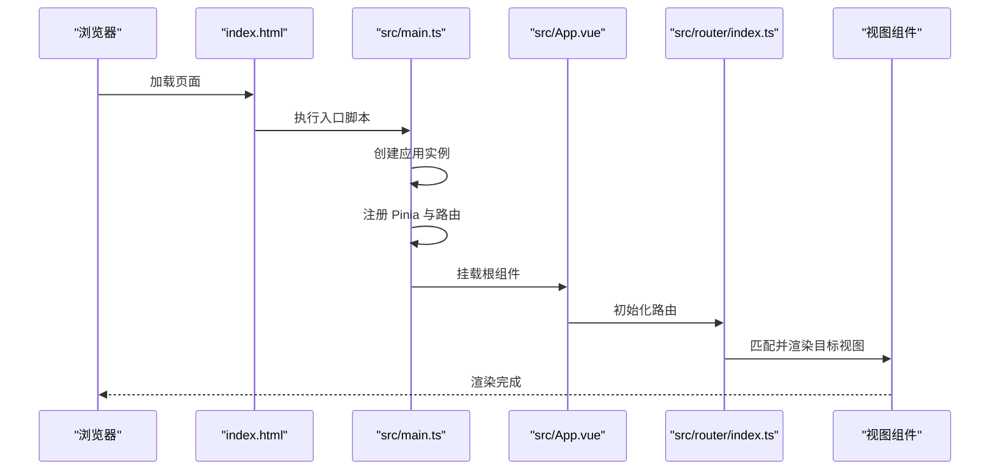
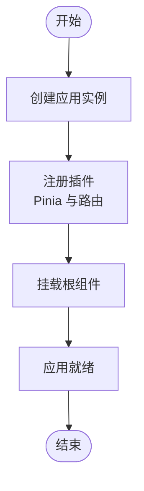
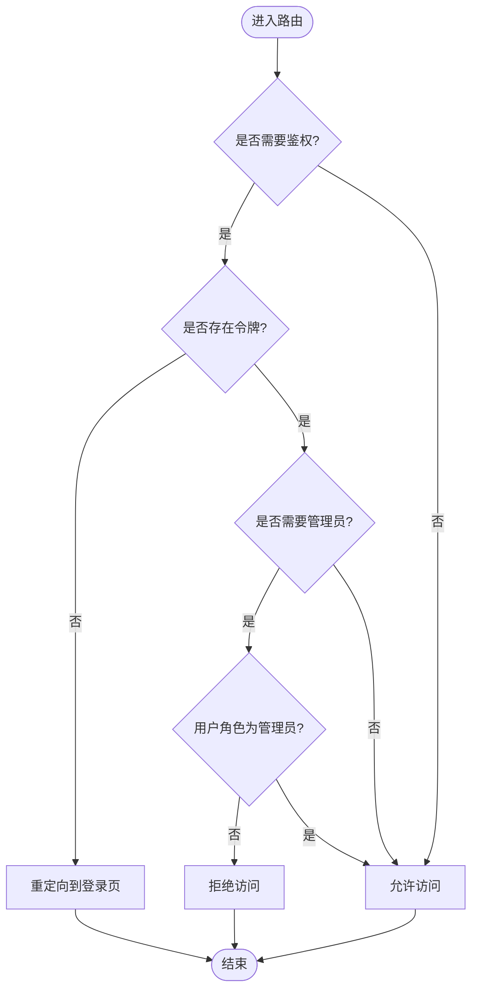
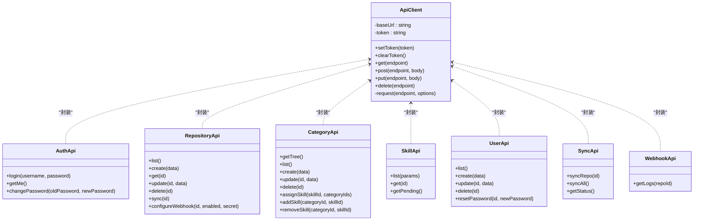
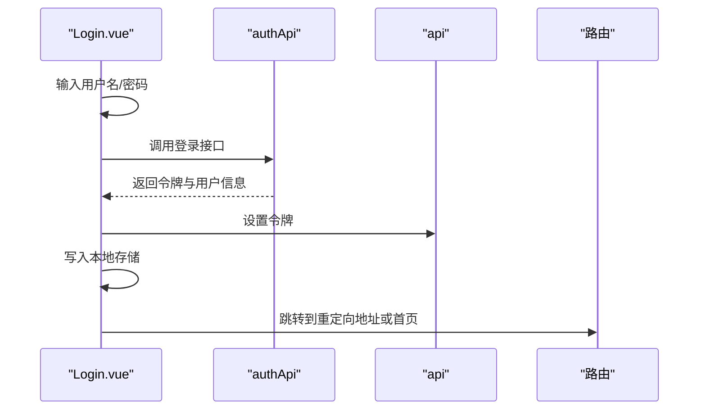
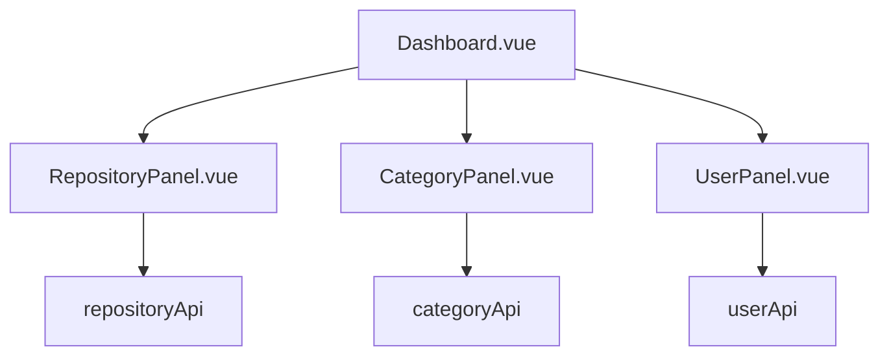
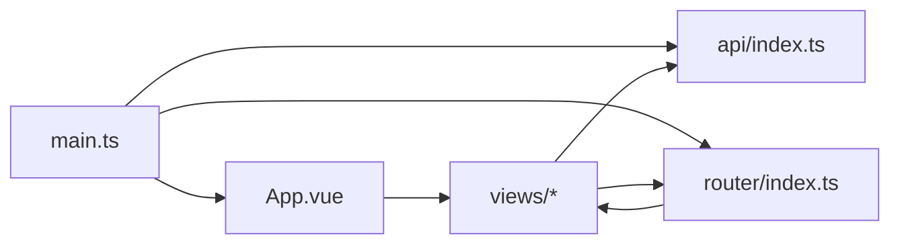

# Vue.js 应用结构

<cite>
**本文档引用的文件**
- [frontend/src/main.ts](file://frontend/src/main.ts)
- [frontend/src/App.vue](file://frontend/src/App.vue)
- [frontend/vite.config.ts](file://frontend/vite.config.ts)
- [frontend/package.json](file://frontend/package.json)
- [frontend/tsconfig.json](file://frontend/tsconfig.json)
- [frontend/src/router/index.ts](file://frontend/src/router/index.ts)
- [frontend/src/views/Home.vue](file://frontend/src/views/Home.vue)
- [frontend/src/views/Login.vue](file://frontend/src/views/Login.vue)
- [frontend/src/views/Skill.vue](file://frontend/src/views/Skill.vue)
- [frontend/src/views/admin/Dashboard.vue](file://frontend/src/views/admin/Dashboard.vue)
- [frontend/src/api/index.ts](file://frontend/src/api/index.ts)
- [frontend/src/components/admin/RepositoryPanel.vue](file://frontend/src/components/admin/RepositoryPanel.vue)
- [frontend/src/components/admin/CategoryPanel.vue](file://frontend/src/components/admin/CategoryPanel.vue)
- [frontend/src/components/admin/UserPanel.vue](file://frontend/src/components/admin/UserPanel.vue)
- [frontend/index.html](file://frontend/index.html)
</cite>

## 目录
1. [简介](#简介)
2. [项目结构](#项目结构)
3. [核心组件](#核心组件)
4. [架构总览](#架构总览)
5. [详细组件分析](#详细组件分析)
6. [依赖关系分析](#依赖关系分析)
7. [性能考虑](#性能考虑)
8. [故障排查指南](#故障排查指南)
9. [结论](#结论)
10. [附录](#附录)

## 简介
本文件面向 Vue.js 前端应用，系统性梳理应用入口配置、根组件设计与全局配置；详解 Vite 构建工具配置、TypeScript 类型系统集成与开发服务器设置；阐述应用初始化流程、插件注册机制与全局状态管理配置；解释组件生命周期、应用挂载过程与错误边界处理；并给出开发环境配置、生产构建优化与静态资源处理策略的最佳实践。

## 项目结构
前端采用基于功能模块的组织方式，入口位于 src/main.ts，根组件为 App.vue，路由集中于 src/router/index.ts，视图组件按页面划分在 src/views 下，通用业务 API 封装在 src/api/index.ts，管理后台组件位于 src/components/admin 下，Vite 与 TypeScript 配置分别位于 vite.config.ts 与 tsconfig.json，HTML 入口模板位于 index.html。

图表来源
- [frontend/index.html](file://frontend/index.html#L1-L25)
- [frontend/src/main.ts](file://frontend/src/main.ts#L1-L12)
- [frontend/src/App.vue](file://frontend/src/App.vue#L1-L31)
- [frontend/src/router/index.ts](file://frontend/src/router/index.ts#L1-L63)
- [frontend/src/api/index.ts](file://frontend/src/api/index.ts#L1-L224)
- [frontend/src/views/Home.vue](file://frontend/src/views/Home.vue#L1-L230)
- [frontend/src/views/Login.vue](file://frontend/src/views/Login.vue#L1-L185)
- [frontend/src/views/Skill.vue](file://frontend/src/views/Skill.vue#L1-L205)
- [frontend/src/views/admin/Dashboard.vue](file://frontend/src/views/admin/Dashboard.vue#L1-L163)
- [frontend/src/components/admin/RepositoryPanel.vue](file://frontend/src/components/admin/RepositoryPanel.vue#L1-L362)
- [frontend/src/components/admin/CategoryPanel.vue](file://frontend/src/components/admin/CategoryPanel.vue#L1-L283)
- [frontend/src/components/admin/UserPanel.vue](file://frontend/src/components/admin/UserPanel.vue#L1-L331)
- [frontend/vite.config.ts](file://frontend/vite.config.ts#L1-L24)
- [frontend/tsconfig.json](file://frontend/tsconfig.json#L1-L25)

章节来源
- [frontend/src/main.ts](file://frontend/src/main.ts#L1-L12)
- [frontend/src/App.vue](file://frontend/src/App.vue#L1-L31)
- [frontend/vite.config.ts](file://frontend/vite.config.ts#L1-L24)
- [frontend/tsconfig.json](file://frontend/tsconfig.json#L1-L25)
- [frontend/package.json](file://frontend/package.json#L1-L20)
- [frontend/index.html](file://frontend/index.html#L1-L25)

## 核心组件
- 应用入口与初始化
  - 创建 Vue 应用实例，注册 Pinia 状态管理与路由插件，并将应用挂载至 DOM。
  - 关键路径参考：[frontend/src/main.ts](file://frontend/src/main.ts#L1-L12)
- 根组件
  - 提供顶层布局容器与路由视图占位，内置生命周期日志输出。
  - 关键路径参考：[frontend/src/App.vue](file://frontend/src/App.vue#L1-L31)
- 路由系统
  - 基于 History 模式，定义多条动态路由与惰性加载视图；全局前置守卫负责鉴权与权限控制。
  - 关键路径参考：[frontend/src/router/index.ts](file://frontend/src/router/index.ts#L1-L63)
- API 客户端
  - 统一封装请求方法、自动注入 Authorization 头、统一错误处理与响应解析。
  - 关键路径参考：[frontend/src/api/index.ts](file://frontend/src/api/index.ts#L1-L224)
- 视图组件
  - 首页、登录、技能详情与管理面板等页面组件，均采用 Composition API 与 TypeScript。
  - 关键路径参考：
    - [frontend/src/views/Home.vue](file://frontend/src/views/Home.vue#L1-L230)
    - [frontend/src/views/Login.vue](file://frontend/src/views/Login.vue#L1-L185)
    - [frontend/src/views/Skill.vue](file://frontend/src/views/Skill.vue#L1-L205)
    - [frontend/src/views/admin/Dashboard.vue](file://frontend/src/views/admin/Dashboard.vue#L1-L163)

章节来源
- [frontend/src/main.ts](file://frontend/src/main.ts#L1-L12)
- [frontend/src/App.vue](file://frontend/src/App.vue#L1-L31)
- [frontend/src/router/index.ts](file://frontend/src/router/index.ts#L1-L63)
- [frontend/src/api/index.ts](file://frontend/src/api/index.ts#L1-L224)
- [frontend/src/views/Home.vue](file://frontend/src/views/Home.vue#L1-L230)
- [frontend/src/views/Login.vue](file://frontend/src/views/Login.vue#L1-L185)
- [frontend/src/views/Skill.vue](file://frontend/src/views/Skill.vue#L1-L205)
- [frontend/src/views/admin/Dashboard.vue](file://frontend/src/views/admin/Dashboard.vue#L1-L163)

## 架构总览
下图展示了应用启动到页面渲染的关键交互：浏览器加载 HTML 模板，执行入口脚本创建应用，注册插件，挂载根组件，随后路由根据当前 URL 匹配并渲染对应视图。

图表来源
- [frontend/index.html](file://frontend/index.html#L1-L25)
- [frontend/src/main.ts](file://frontend/src/main.ts#L1-L12)
- [frontend/src/App.vue](file://frontend/src/App.vue#L1-L31)
- [frontend/src/router/index.ts](file://frontend/src/router/index.ts#L1-L63)

## 详细组件分析

### 应用入口与初始化流程
- 初始化步骤
  - 引入 Vue、Pinia、路由与根组件。
  - 创建应用实例并依次注册插件。
  - 将应用挂载到 DOM 容器。
- 生命周期与日志
  - 根组件在挂载后输出“就绪”日志，便于调试。
- 最佳实践
  - 将第三方插件集中注册，避免在组件内重复引入。
  - 使用组合式 API 在入口处集中初始化状态与服务。

图表来源
- [frontend/src/main.ts](file://frontend/src/main.ts#L1-L12)
- [frontend/src/App.vue](file://frontend/src/App.vue#L10-L13)

章节来源
- [frontend/src/main.ts](file://frontend/src/main.ts#L1-L12)
- [frontend/src/App.vue](file://frontend/src/App.vue#L10-L13)

### 路由系统与守卫机制
- 路由定义
  - 首页、分类、技能详情、管理面板与登录页等路由。
  - 使用惰性加载异步导入视图组件，提升首屏性能。
- 全局前置守卫
  - 检测路由元信息中的鉴权需求与管理员权限。
  - 通过本地存储令牌与角色进行判断，未满足条件时重定向或拒绝访问。
- 最佳实践
  - 将鉴权逻辑集中在守卫中，视图组件专注渲染。
  - 使用 meta 字段清晰标注路由权限要求。

图表来源
- [frontend/src/router/index.ts](file://frontend/src/router/index.ts#L4-L24)

章节来源
- [frontend/src/router/index.ts](file://frontend/src/router/index.ts#L1-L63)

### API 客户端与错误处理
- 设计要点
  - 统一基地址与请求头，自动注入 Bearer 令牌。
  - 对非 OK 响应抛出错误，便于上层捕获与提示。
  - 按业务域拆分 API 模块（认证、仓库、分类、技能、用户、同步、Webhook）。
- 错误处理
  - 组件内使用 try/catch 捕获异常并记录日志。
- 最佳实践
  - 在拦截器或包装函数中统一处理错误码与提示。
  - 明确区分网络错误与业务错误，提供用户友好的反馈。

图表来源
- [frontend/src/api/index.ts](file://frontend/src/api/index.ts#L16-L84)
- [frontend/src/api/index.ts](file://frontend/src/api/index.ts#L89-L102)
- [frontend/src/api/index.ts](file://frontend/src/api/index.ts#L105-L127)
- [frontend/src/api/index.ts](file://frontend/src/api/index.ts#L129-L155)
- [frontend/src/api/index.ts](file://frontend/src/api/index.ts#L158-L183)
- [frontend/src/api/index.ts](file://frontend/src/api/index.ts#L186-L202)
- [frontend/src/api/index.ts](file://frontend/src/api/index.ts#L205-L215)
- [frontend/src/api/index.ts](file://frontend/src/api/index.ts#L218-L223)

章节来源
- [frontend/src/api/index.ts](file://frontend/src/api/index.ts#L1-L224)

### 登录与会话管理
- 功能流程
  - 表单校验、调用认证 API 获取访问令牌与用户信息。
  - 通过 API 客户端设置令牌并写入本地存储。
  - 根据重定向参数跳转回原页面或首页。
- 最佳实践
  - 登录成功后立即刷新令牌并在全局拦截器中生效。
  - 登出时清除令牌与用户信息，确保安全。

图表来源
- [frontend/src/views/Login.vue](file://frontend/src/views/Login.vue#L59-L84)
- [frontend/src/api/index.ts](file://frontend/src/api/index.ts#L89-L102)

章节来源
- [frontend/src/views/Login.vue](file://frontend/src/views/Login.vue#L1-L185)
- [frontend/src/api/index.ts](file://frontend/src/api/index.ts#L89-L102)

### 管理面板与后台组件
- 管理面板
  - 支持标签页切换仓库、分类与用户管理。
  - 登录态与管理员权限通过本地存储与守卫共同保障。
- 后台组件
  - 仓库管理：支持新增、同步、编辑与删除仓库。
  - 分类管理：支持树形分类的增删改与扁平化处理。
  - 用户管理：支持用户增删与密码重置。
- 最佳实践
  - 对敏感操作增加二次确认。
  - 对批量操作提供加载状态与结果提示。

图表来源
- [frontend/src/views/admin/Dashboard.vue](file://frontend/src/views/admin/Dashboard.vue#L1-L163)
- [frontend/src/components/admin/RepositoryPanel.vue](file://frontend/src/components/admin/RepositoryPanel.vue#L1-L362)
- [frontend/src/components/admin/CategoryPanel.vue](file://frontend/src/components/admin/CategoryPanel.vue#L1-L283)
- [frontend/src/components/admin/UserPanel.vue](file://frontend/src/components/admin/UserPanel.vue#L1-L331)
- [frontend/src/api/index.ts](file://frontend/src/api/index.ts#L105-L127)
- [frontend/src/api/index.ts](file://frontend/src/api/index.ts#L129-L155)
- [frontend/src/api/index.ts](file://frontend/src/api/index.ts#L186-L202)

章节来源
- [frontend/src/views/admin/Dashboard.vue](file://frontend/src/views/admin/Dashboard.vue#L1-L163)
- [frontend/src/components/admin/RepositoryPanel.vue](file://frontend/src/components/admin/RepositoryPanel.vue#L1-L362)
- [frontend/src/components/admin/CategoryPanel.vue](file://frontend/src/components/admin/CategoryPanel.vue#L1-L283)
- [frontend/src/components/admin/UserPanel.vue](file://frontend/src/components/admin/UserPanel.vue#L1-L331)
- [frontend/src/api/index.ts](file://frontend/src/api/index.ts#L105-L127)
- [frontend/src/api/index.ts](file://frontend/src/api/index.ts#L129-L155)
- [frontend/src/api/index.ts](file://frontend/src/api/index.ts#L186-L202)

## 依赖关系分析
- 模块耦合
  - main.ts 作为唯一入口，集中注册插件，降低组件间耦合。
  - API 客户端被各视图与组件复用，形成统一的数据访问层。
- 外部依赖
  - Vue 3、Vue Router 4、Pinia 以及 Vite 生态。
- 循环依赖
  - 当前结构未见循环依赖迹象，建议保持按功能域拆分的模块化风格。

图表来源
- [frontend/src/main.ts](file://frontend/src/main.ts#L1-L12)
- [frontend/src/App.vue](file://frontend/src/App.vue#L1-L31)
- [frontend/src/router/index.ts](file://frontend/src/router/index.ts#L1-L63)
- [frontend/src/api/index.ts](file://frontend/src/api/index.ts#L1-L224)

章节来源
- [frontend/src/main.ts](file://frontend/src/main.ts#L1-L12)
- [frontend/src/router/index.ts](file://frontend/src/router/index.ts#L1-L63)
- [frontend/src/api/index.ts](file://frontend/src/api/index.ts#L1-L224)

## 性能考虑
- 代码分割与懒加载
  - 路由级懒加载减少首屏体积，提升加载速度。
  - 建议对大型组件与第三方库同样采用动态导入。
- 构建优化
  - 使用 Vite 的预构建与打包能力，开启必要的压缩与 Tree Shaking。
  - 生产构建时启用 outDir 与空目录清理，避免历史产物污染。
- 运行时优化
  - 在组件中缓存昂贵计算与 API 请求结果。
  - 合理使用 v-memo（若升级到更高版本）或手动缓存策略。

## 故障排查指南
- 登录失败
  - 检查认证接口返回与令牌设置逻辑，确认本地存储中 token 是否正确写入。
  - 参考：[frontend/src/views/Login.vue](file://frontend/src/views/Login.vue#L69-L78)，[frontend/src/api/index.ts](file://frontend/src/api/index.ts#L26-L29)
- 路由跳转异常
  - 核对路由元信息与守卫逻辑，确认令牌与角色读取是否正确。
  - 参考：[frontend/src/router/index.ts](file://frontend/src/router/index.ts#L5-L24)
- API 请求报错
  - 查看响应体中的错误字段，结合控制台日志定位问题。
  - 参考：[frontend/src/api/index.ts](file://frontend/src/api/index.ts#L56-L61)
- 开发代理无效
  - 确认 Vite 代理配置与后端服务端口一致。
  - 参考：[frontend/vite.config.ts](file://frontend/vite.config.ts#L8-L17)

章节来源
- [frontend/src/views/Login.vue](file://frontend/src/views/Login.vue#L69-L78)
- [frontend/src/router/index.ts](file://frontend/src/router/index.ts#L5-L24)
- [frontend/src/api/index.ts](file://frontend/src/api/index.ts#L56-L61)
- [frontend/vite.config.ts](file://frontend/vite.config.ts#L8-L17)

## 结论
该 Vue.js 应用采用现代化前端技术栈，入口简洁、路由清晰、API 封装完善，具备良好的可维护性与扩展性。通过合理的模块划分与守卫机制，实现了基础的鉴权与权限控制。建议在后续迭代中进一步完善错误边界、国际化与测试覆盖，持续优化构建与运行时性能。

## 附录

### Vite 配置要点
- 插件与开发服务器
  - 启用 Vue 插件，配置本地开发端口与代理规则，将 /api 与 /webhooks 转发至后端。
- 构建输出
  - 指定 dist 为输出目录，并在构建时清空输出目录。

章节来源
- [frontend/vite.config.ts](file://frontend/vite.config.ts#L1-L24)

### TypeScript 配置要点
- 编译选项
  - ESNext 模块与 DOM 目标，Bundler 模式解析，严格模式与未使用检测。
- 文件包含
  - 自动包含 ts、tsx、vue 与 d.ts 文件。

章节来源
- [frontend/tsconfig.json](file://frontend/tsconfig.json#L1-L25)

### 开发与生产脚本
- 开发：vite
- 构建：vite build
- 预览：vite preview

章节来源
- [frontend/package.json](file://frontend/package.json#L5-L9)