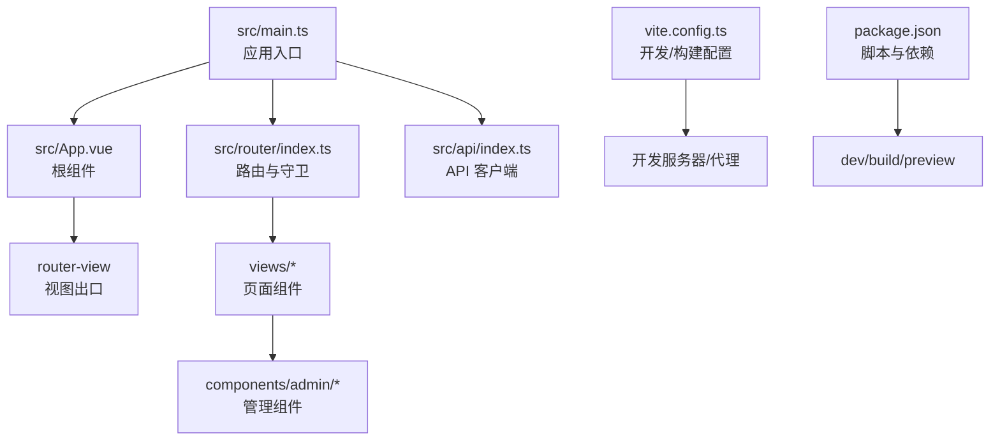
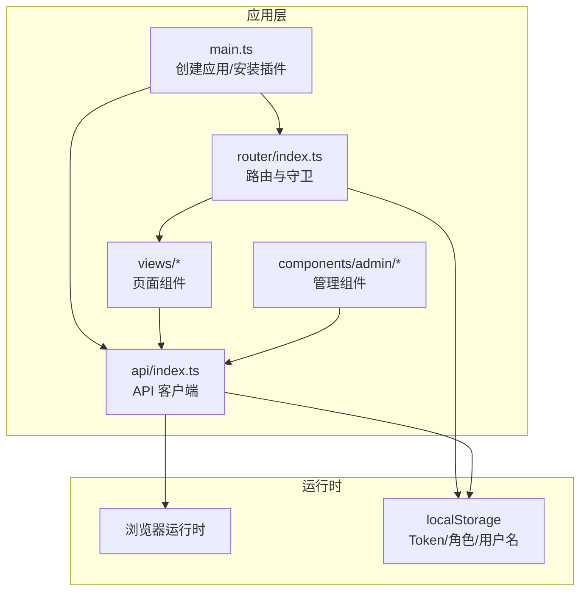
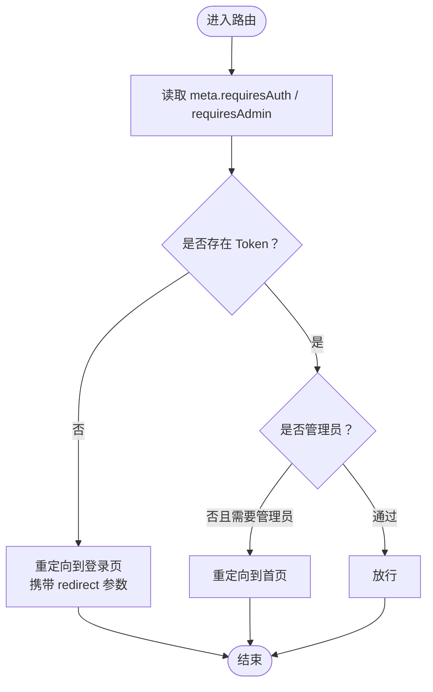
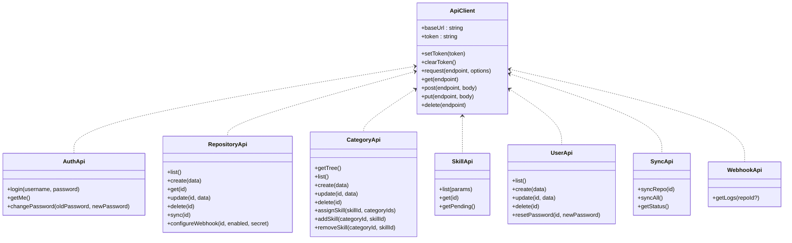
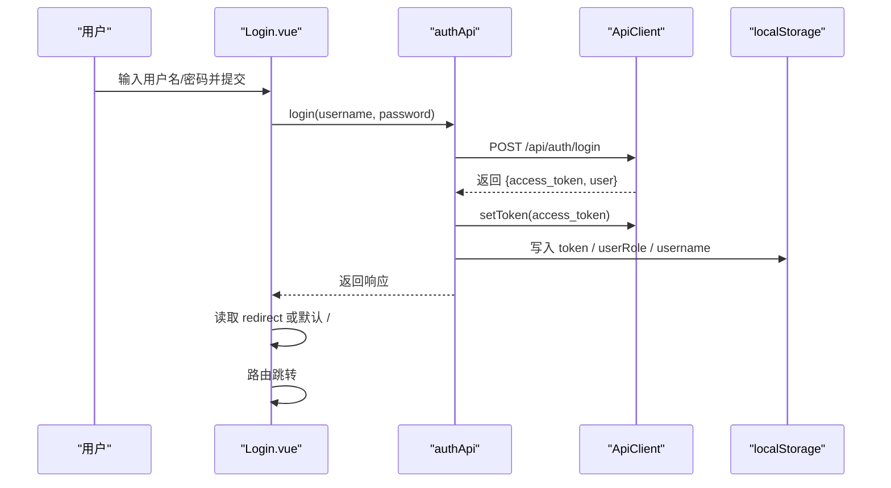
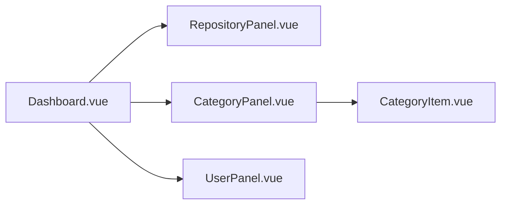
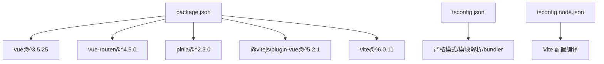

# 前端架构

<cite>
**本文引用的文件**
- [frontend/src/main.ts](file://frontend/src/main.ts)
- [frontend/src/App.vue](file://frontend/src/App.vue)
- [frontend/src/router/index.ts](file://frontend/src/router/index.ts)
- [frontend/src/api/index.ts](file://frontend/src/api/index.ts)
- [frontend/vite.config.ts](file://frontend/vite.config.ts)
- [frontend/package.json](file://frontend/package.json)
- [frontend/src/views/Home.vue](file://frontend/src/views/Home.vue)
- [frontend/src/views/Login.vue](file://frontend/src/views/Login.vue)
- [frontend/src/views/admin/Dashboard.vue](file://frontend/src/views/admin/Dashboard.vue)
- [frontend/src/components/admin/RepositoryPanel.vue](file://frontend/src/components/admin/RepositoryPanel.vue)
- [frontend/src/components/admin/CategoryPanel.vue](file://frontend/src/components/admin/CategoryPanel.vue)
- [frontend/src/components/admin/CategoryItem.vue](file://frontend/src/components/admin/CategoryItem.vue)
- [frontend/src/components/admin/UserPanel.vue](file://frontend/src/components/admin/UserPanel.vue)
- [frontend/tsconfig.json](file://frontend/tsconfig.json)
- [frontend/tsconfig.node.json](file://frontend/tsconfig.node.json)
</cite>

## 目录
1. [简介](#简介)
2. [项目结构](#项目结构)
3. [核心组件](#核心组件)
4. [架构总览](#架构总览)
5. [组件详解](#组件详解)
6. [依赖关系分析](#依赖关系分析)
7. [性能考量](#性能考量)
8. [故障排查指南](#故障排查指南)
9. [结论](#结论)
10. [附录](#附录)

## 简介
本文件面向 Skills Hub 前端，系统性梳理基于 Vue 3 + TypeScript + Vite 的单页应用（SPA）架构，覆盖组件化结构、路由与守卫、状态管理、前后端交互、构建与部署、以及性能与可维护性建议。文档以“渐进式复杂度”方式呈现，既适合初学者理解整体设计，也为资深开发者提供深入的技术细节与最佳实践。

## 项目结构
前端采用“按功能域组织”的目录布局，核心入口在 src 下，配合 Vite 构建工具与 TypeScript 编译配置。关键目录与职责如下：
- src/main.ts：应用启动入口，注册插件（Vue、Router、Pinia）并挂载根组件
- src/App.vue：根组件，承载全局样式与路由视图出口
- src/router/index.ts：路由定义与全局前置守卫
- src/api/index.ts：统一的 API 客户端封装与各模块 API 导出
- src/views/*：页面级组件（视图）
- src/components/admin/*：管理后台的可复用组件
- vite.config.ts：开发服务器、代理与构建输出配置
- package.json：脚本与依赖声明
- tsconfig*.json：TypeScript 编译选项

图表来源
- [frontend/src/main.ts](file://frontend/src/main.ts#L1-L12)
- [frontend/src/App.vue](file://frontend/src/App.vue#L1-L31)
- [frontend/src/router/index.ts](file://frontend/src/router/index.ts#L1-L63)
- [frontend/src/api/index.ts](file://frontend/src/api/index.ts#L1-L224)
- [frontend/vite.config.ts](file://frontend/vite.config.ts#L1-L24)
- [frontend/package.json](file://frontend/package.json#L1-L20)

章节来源
- [frontend/src/main.ts](file://frontend/src/main.ts#L1-L12)
- [frontend/src/App.vue](file://frontend/src/App.vue#L1-L31)
- [frontend/src/router/index.ts](file://frontend/src/router/index.ts#L1-L63)
- [frontend/src/api/index.ts](file://frontend/src/api/index.ts#L1-L224)
- [frontend/vite.config.ts](file://frontend/vite.config.ts#L1-L24)
- [frontend/package.json](file://frontend/package.json#L1-L20)
- [frontend/tsconfig.json](file://frontend/tsconfig.json#L1-L25)
- [frontend/tsconfig.node.json](file://frontend/tsconfig.node.json#L1-L16)

## 核心组件
- 应用启动与插件注册
  - 在入口中创建应用实例，安装 Pinia 状态管理与 Vue Router，并挂载到 DOM
- 根组件与样式
  - 提供全局背景与链接样式，作为路由视图容器
- 路由系统
  - 使用 History 模式，定义多条路由并设置全局前置守卫进行鉴权与角色校验
- API 客户端
  - 封装统一的请求方法、Token 管理与错误处理；按业务拆分认证、仓库、分类、技能、用户、同步、Webhook 等模块 API
- 视图与管理组件
  - 页面组件负责数据加载与交互；管理组件负责 CRUD 与状态更新

章节来源
- [frontend/src/main.ts](file://frontend/src/main.ts#L1-L12)
- [frontend/src/App.vue](file://frontend/src/App.vue#L1-L31)
- [frontend/src/router/index.ts](file://frontend/src/router/index.ts#L1-L63)
- [frontend/src/api/index.ts](file://frontend/src/api/index.ts#L1-L224)

## 架构总览
下图展示了前端应用的高层架构：入口初始化、路由与守卫、API 客户端、视图与管理组件之间的协作关系。

图表来源
- [frontend/src/main.ts](file://frontend/src/main.ts#L1-L12)
- [frontend/src/router/index.ts](file://frontend/src/router/index.ts#L1-L63)
- [frontend/src/api/index.ts](file://frontend/src/api/index.ts#L1-L224)

## 组件详解

### 路由与守卫
- 全局前置守卫逻辑
  - 读取路由元信息判断是否需要认证与管理员权限
  - 从 localStorage 读取 Token 与用户角色，未满足条件则重定向至登录页或首页
- 路由表
  - 首页、分类列表、技能详情、管理员面板、登录页等
  - 管理员面板路由标记 requiresAuth，确保访问受控

图表来源
- [frontend/src/router/index.ts](file://frontend/src/router/index.ts#L4-L24)

章节来源
- [frontend/src/router/index.ts](file://frontend/src/router/index.ts#L1-L63)

### API 客户端与模块化 API
- 统一客户端
  - 基础地址、Token 注入、通用请求封装、错误抛出
- 模块化导出
  - 认证：登录、当前用户、修改密码
  - 仓库：列表、创建、查询、更新、删除、同步、Webhook 配置
  - 分类：树形结构、列表、CRUD、技能分配与关联
  - 技能：列表、详情、待同步
  - 用户：列表、创建、更新、删除、重置密码
  - 同步：单仓同步、全量同步、状态查询
  - Webhook：日志查询

图表来源
- [frontend/src/api/index.ts](file://frontend/src/api/index.ts#L16-L86)
- [frontend/src/api/index.ts](file://frontend/src/api/index.ts#L88-L224)

章节来源
- [frontend/src/api/index.ts](file://frontend/src/api/index.ts#L1-L224)

### 登录流程（序列图）

图表来源
- [frontend/src/views/Login.vue](file://frontend/src/views/Login.vue#L46-L84)
- [frontend/src/api/index.ts](file://frontend/src/api/index.ts#L88-L102)

章节来源
- [frontend/src/views/Login.vue](file://frontend/src/views/Login.vue#L1-L185)
- [frontend/src/api/index.ts](file://frontend/src/api/index.ts#L1-L224)

### 管理后台组件族
- Dashboard：标签页切换、登出、显示当前用户与管理员权限
- RepositoryPanel：仓库增删改查、同步、表单弹窗
- CategoryPanel：分类树渲染、扁平化、新增分类、删除分类
- CategoryItem：递归渲染子分类、展开/收起
- UserPanel：用户列表、新增用户、重置密码、删除用户

图表来源
- [frontend/src/views/admin/Dashboard.vue](file://frontend/src/views/admin/Dashboard.vue#L58-L76)
- [frontend/src/components/admin/RepositoryPanel.vue](file://frontend/src/components/admin/RepositoryPanel.vue#L106-L191)
- [frontend/src/components/admin/CategoryPanel.vue](file://frontend/src/components/admin/CategoryPanel.vue#L78-L157)
- [frontend/src/components/admin/CategoryItem.vue](file://frontend/src/components/admin/CategoryItem.vue#L34-L52)
- [frontend/src/components/admin/UserPanel.vue](file://frontend/src/components/admin/UserPanel.vue#L89-L157)

章节来源
- [frontend/src/views/admin/Dashboard.vue](file://frontend/src/views/admin/Dashboard.vue#L1-L163)
- [frontend/src/components/admin/RepositoryPanel.vue](file://frontend/src/components/admin/RepositoryPanel.vue#L1-L362)
- [frontend/src/components/admin/CategoryPanel.vue](file://frontend/src/components/admin/CategoryPanel.vue#L1-L283)
- [frontend/src/components/admin/CategoryItem.vue](file://frontend/src/components/admin/CategoryItem.vue#L1-L117)
- [frontend/src/components/admin/UserPanel.vue](file://frontend/src/components/admin/UserPanel.vue#L1-L331)

### 数据流与组件通信
- 单向数据流
  - 视图组件在生命周期钩子中调用 API 获取数据，写入本地响应式状态
  - 管理组件通过 props 接收数据，通过事件向上通信触发刷新
- 事件与属性
  - 管理组件通过 emit 事件通知父组件执行编辑/删除等操作
  - CategoryPanel 通过递归组件 CategoryItem 渲染层级结构

章节来源
- [frontend/src/views/Home.vue](file://frontend/src/views/Home.vue#L88-L102)
- [frontend/src/components/admin/CategoryPanel.vue](file://frontend/src/components/admin/CategoryPanel.vue#L78-L157)
- [frontend/src/components/admin/CategoryItem.vue](file://frontend/src/components/admin/CategoryItem.vue#L34-L52)

### 错误处理与用户体验
- API 层错误
  - 请求失败时抛出错误，调用方捕获并提示
- 视图层错误
  - 登录页对必填项校验与错误提示
  - 管理组件对网络异常与确认删除进行提示

章节来源
- [frontend/src/api/index.ts](file://frontend/src/api/index.ts#L56-L61)
- [frontend/src/views/Login.vue](file://frontend/src/views/Login.vue#L59-L84)
- [frontend/src/components/admin/RepositoryPanel.vue](file://frontend/src/components/admin/RepositoryPanel.vue#L135-L190)

## 依赖关系分析
- 运行时依赖
  - Vue 3、Vue Router 4、Pinia 2
- 开发依赖
  - Vite、@vitejs/plugin-vue
- 构建与类型
  - TypeScript 编译配置，严格模式与 bundler 模式

图表来源
- [frontend/package.json](file://frontend/package.json#L1-L20)
- [frontend/tsconfig.json](file://frontend/tsconfig.json#L1-L25)
- [frontend/tsconfig.node.json](file://frontend/tsconfig.node.json#L1-L16)

章节来源
- [frontend/package.json](file://frontend/package.json#L1-L20)
- [frontend/tsconfig.json](file://frontend/tsconfig.json#L1-L25)
- [frontend/tsconfig.node.json](file://frontend/tsconfig.node.json#L1-L16)

## 性能考量
- 路由懒加载
  - 使用动态导入按需加载视图组件，减少首屏体积
- 组件拆分
  - 管理组件按功能拆分，避免单组件过大
- 状态管理
  - 当前使用 localStorage 存储 Token 与角色，适合小型应用；若业务复杂可引入 Pinia Store 进行集中管理
- 构建优化
  - 生产构建输出目录与清理策略已在配置中声明
- 网络请求
  - API 客户端统一注入 Authorization 头，避免重复逻辑

章节来源
- [frontend/src/router/index.ts](file://frontend/src/router/index.ts#L26-L52)
- [frontend/src/api/index.ts](file://frontend/src/api/index.ts#L16-L86)
- [frontend/vite.config.ts](file://frontend/vite.config.ts#L19-L23)

## 故障排查指南
- 登录失败
  - 检查后端接口返回的错误消息，确认用户名/密码正确
  - 确认浏览器已写入 Token 与用户角色
- 无法访问管理面板
  - 检查路由守卫是否要求管理员权限
  - 确认 localStorage 中的角色为 admin
- 请求报错
  - 查看控制台 Network 面板，确认 /api 前缀与代理配置
  - 确认 Authorization 头是否正确注入
- 构建/预览问题
  - 使用脚本 dev/build/preview，检查端口占用与代理目标

章节来源
- [frontend/src/views/Login.vue](file://frontend/src/views/Login.vue#L59-L84)
- [frontend/src/router/index.ts](file://frontend/src/router/index.ts#L4-L24)
- [frontend/src/api/index.ts](file://frontend/src/api/index.ts#L36-L61)
- [frontend/vite.config.ts](file://frontend/vite.config.ts#L6-L18)
- [frontend/package.json](file://frontend/package.json#L5-L9)

## 结论
Skills Hub 前端采用清晰的组件化与模块化设计，结合路由守卫与统一 API 客户端，实现了简洁而可扩展的 SPA 架构。通过动态导入、组件拆分与 TypeScript 严格模式，提升了可维护性与开发体验。后续可在状态管理、缓存策略与测试体系方面进一步完善。

## 附录

### SPA 路由回退与静态资源托管
- 路由模式
  - 使用 History 模式，需后端支持回退至 index.html，确保刷新不 404
- 静态资源
  - 构建产物输出至 dist，可通过静态服务器或 CDN 托管

章节来源
- [frontend/src/router/index.ts](file://frontend/src/router/index.ts#L55-L58)
- [frontend/vite.config.ts](file://frontend/vite.config.ts#L19-L23)

### 开发环境与生产部署
- 开发
  - 使用 Vite 开发服务器，默认端口，配置了 /api 与 /webhooks 代理
- 构建
  - 使用 Vite 构建命令生成 dist 目录
- 部署
  - 将 dist 目录部署至静态服务器或 CDN；后端需允许前端域名跨域

章节来源
- [frontend/package.json](file://frontend/package.json#L5-L9)
- [frontend/vite.config.ts](file://frontend/vite.config.ts#L6-L18)
- [frontend/vite.config.ts](file://frontend/vite.config.ts#L19-L23)