# 管理面板组件

<cite>
**本文档引用的文件**
- [RepositoryPanel.vue](file://frontend/src/components/admin/RepositoryPanel.vue)
- [CategoryPanel.vue](file://frontend/src/components/admin/CategoryPanel.vue)
- [UserPanel.vue](file://frontend/src/components/admin/UserPanel.vue)
- [CategoryItem.vue](file://frontend/src/components/admin/CategoryItem.vue)
- [Dashboard.vue](file://frontend/src/views/admin/Dashboard.vue)
- [api/index.ts](file://frontend/src/api/index.ts)
- [router/index.ts](file://frontend/src/router/index.ts)
- [package.json](file://frontend/package.json)
- [README.md](file://README.md)
</cite>

## 目录
1. [简介](#简介)
2. [项目结构](#项目结构)
3. [核心组件](#核心组件)
4. [架构概览](#架构概览)
5. [详细组件分析](#详细组件分析)
6. [依赖关系分析](#依赖关系分析)
7. [性能考虑](#性能考虑)
8. [故障排除指南](#故障排除指南)
9. [结论](#结论)
10. [附录](#附录)

## 简介

Skills Hub 管理面板是一个基于 Vue 3.5.25 和 TypeScript 构建的现代化后台管理系统。该系统采用 CLI 风格的终端界面设计，为管理员提供了直观的仓库管理、分类管理和用户管理功能。

系统的核心特点包括：
- **CLI 风格界面**：仿终端命令行界面，提供熟悉的命令行体验
- **响应式设计**：支持桌面和移动设备的自适应布局
- **权限控制**：基于角色的访问控制，区分普通维护者和管理员
- **实时状态显示**：系统状态和同步进度的可视化反馈
- **组件化架构**：高度模块化的组件设计，便于维护和扩展

## 项目结构

前端项目采用清晰的分层架构，主要目录结构如下：

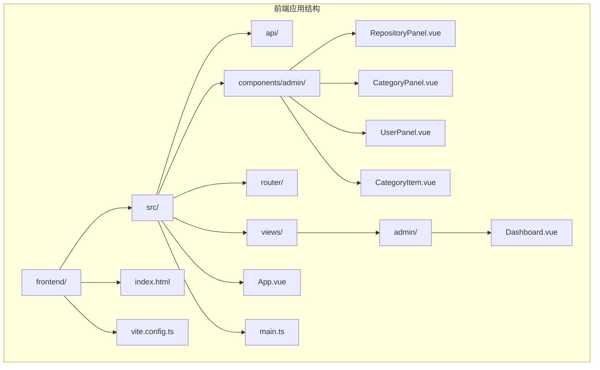

**图表来源**
- [package.json](file://frontend/package.json#L1-L20)
- [README.md](file://README.md#L20-L47)

**章节来源**
- [package.json](file://frontend/package.json#L1-L20)
- [README.md](file://README.md#L20-L47)

## 核心组件

管理面板由四个核心组件构成，每个组件都针对特定的管理功能进行了优化：

### 组件层次结构

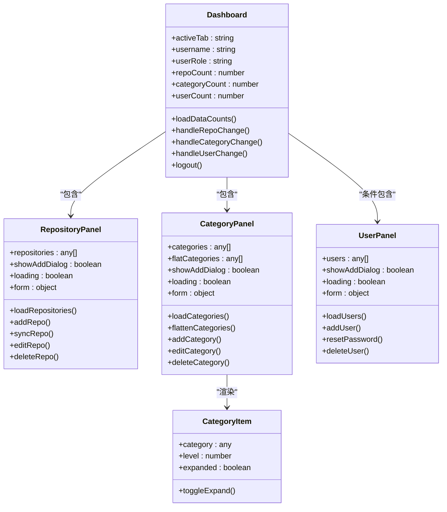

**图表来源**
- [Dashboard.vue](file://frontend/src/views/admin/Dashboard.vue#L100-L159)
- [RepositoryPanel.vue](file://frontend/src/components/admin/RepositoryPanel.vue#L106-L191)
- [CategoryPanel.vue](file://frontend/src/components/admin/CategoryPanel.vue#L78-L157)
- [UserPanel.vue](file://frontend/src/components/admin/UserPanel.vue#L89-L157)
- [CategoryItem.vue](file://frontend/src/components/admin/CategoryItem.vue#L34-L52)

### 组件职责分工

| 组件 | 主要职责 | 关键功能 |
|------|----------|----------|
| **Dashboard** | 管理面板主容器 | 标签页导航、权限控制、数据统计、状态管理 |
| **RepositoryPanel** | 仓库管理 | 仓库列表展示、添加/编辑/删除、手动同步 |
| **CategoryPanel** | 分类管理 | 分类树形结构、层级管理、分类操作 |
| **UserPanel** | 用户管理 | 用户列表、用户创建、密码重置、权限管理 |
| **CategoryItem** | 分类项组件 | 递归渲染、展开折叠、子分类处理 |

**章节来源**
- [Dashboard.vue](file://frontend/src/views/admin/Dashboard.vue#L26-L97)
- [RepositoryPanel.vue](file://frontend/src/components/admin/RepositoryPanel.vue#L1-L362)
- [CategoryPanel.vue](file://frontend/src/components/admin/CategoryPanel.vue#L1-L283)
- [UserPanel.vue](file://frontend/src/components/admin/UserPanel.vue#L1-L331)
- [CategoryItem.vue](file://frontend/src/components/admin/CategoryItem.vue#L1-L117)

## 架构概览

系统采用前后端分离的架构设计，通过 API 客户端进行数据交互：

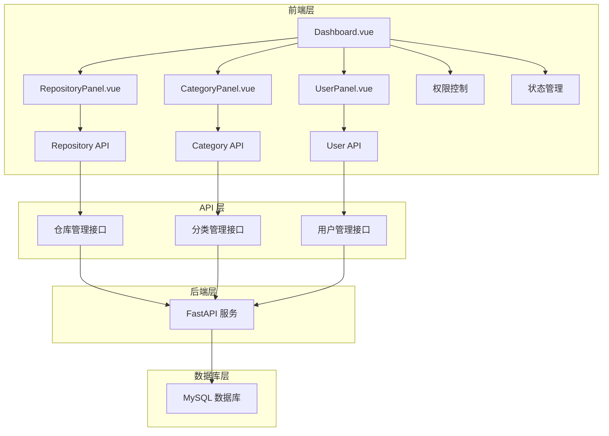

**图表来源**
- [Dashboard.vue](file://frontend/src/views/admin/Dashboard.vue#L103-L106)
- [api/index.ts](file://frontend/src/api/index.ts#L104-L202)
- [router/index.ts](file://frontend/src/router/index.ts#L4-L24)

### 数据流设计

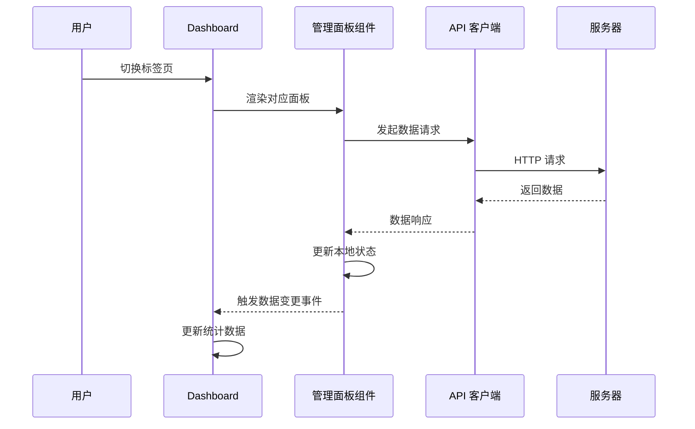

**图表来源**
- [Dashboard.vue](file://frontend/src/views/admin/Dashboard.vue#L141-L151)
- [api/index.ts](file://frontend/src/api/index.ts#L36-L61)

**章节来源**
- [Dashboard.vue](file://frontend/src/views/admin/Dashboard.vue#L100-L159)
- [api/index.ts](file://frontend/src/api/index.ts#L16-L84)
- [router/index.ts](file://frontend/src/router/index.ts#L4-L24)

## 详细组件分析

### 仓库管理面板 (RepositoryPanel)

仓库管理面板提供了完整的仓库生命周期管理功能：

#### 核心功能特性

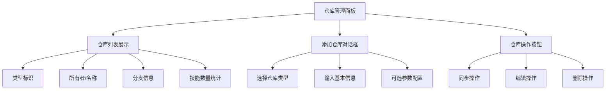

**图表来源**
- [RepositoryPanel.vue](file://frontend/src/components/admin/RepositoryPanel.vue#L1-L104)

#### 数据处理流程

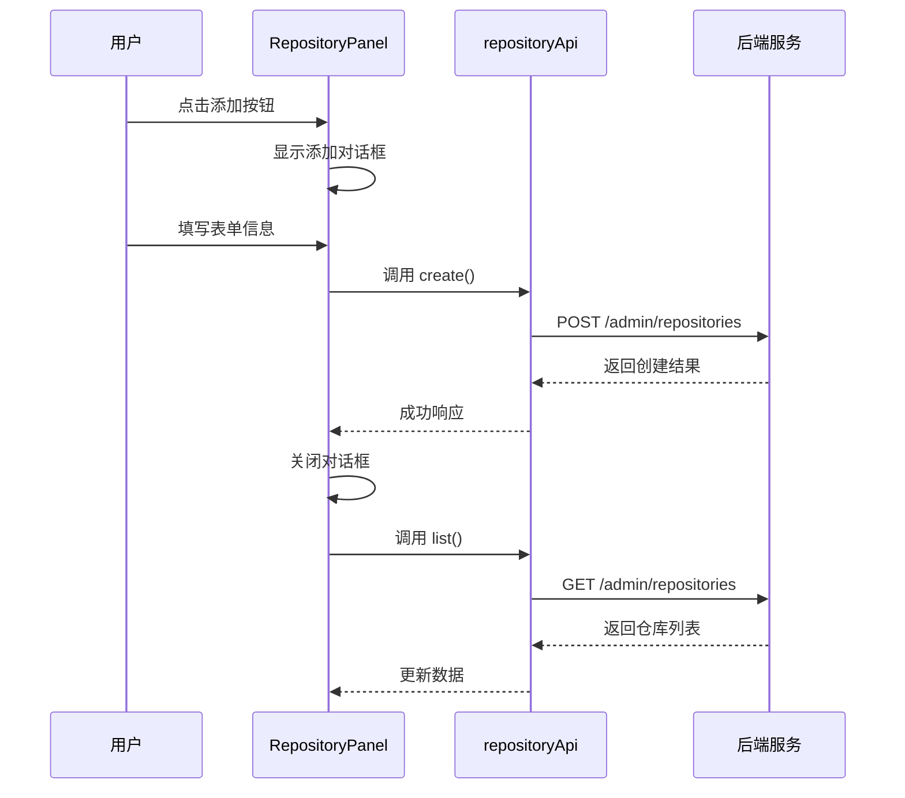

**图表来源**
- [RepositoryPanel.vue](file://frontend/src/components/admin/RepositoryPanel.vue#L135-L161)
- [api/index.ts](file://frontend/src/api/index.ts#L105-L127)

#### 表单验证机制

仓库管理表单实现了基础的客户端验证：
- **必填字段检查**：确保关键信息完整
- **类型验证**：区分 GitHub 和 GitLab 的不同配置需求
- **状态管理**：加载状态和错误状态的正确处理

**章节来源**
- [RepositoryPanel.vue](file://frontend/src/components/admin/RepositoryPanel.vue#L106-L191)
- [api/index.ts](file://frontend/src/api/index.ts#L105-L127)

### 分类管理面板 (CategoryPanel)

分类管理面板支持多级分类的树形结构管理：

#### 分类树形结构

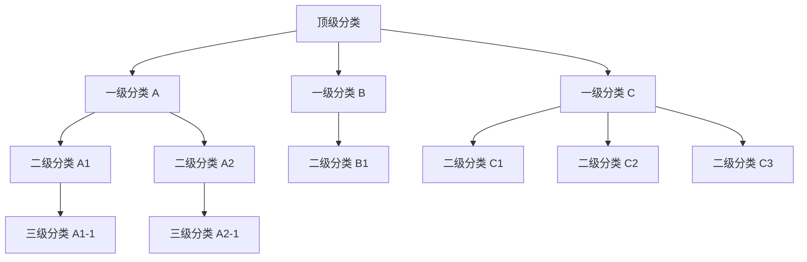

**图表来源**
- [CategoryPanel.vue](file://frontend/src/components/admin/CategoryPanel.vue#L109-L121)
- [CategoryItem.vue](file://frontend/src/components/admin/CategoryItem.vue#L21-L30)

#### 递归组件设计

分类项组件采用了递归渲染模式：

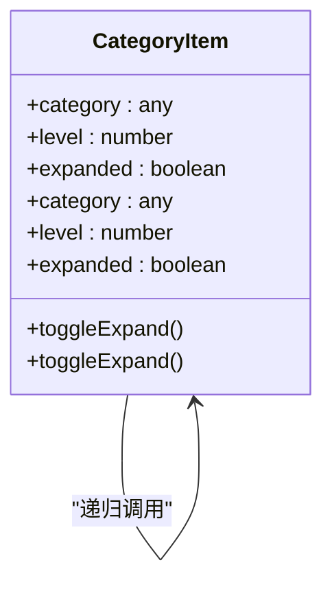

**图表来源**
- [CategoryItem.vue](file://frontend/src/components/admin/CategoryItem.vue#L22-L30)

#### 分类操作流程

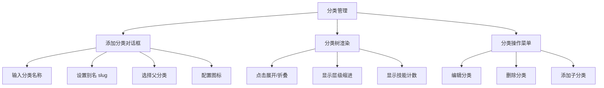

**图表来源**
- [CategoryPanel.vue](file://frontend/src/components/admin/CategoryPanel.vue#L1-L76)
- [CategoryItem.vue](file://frontend/src/components/admin/CategoryItem.vue#L1-L32)

**章节来源**
- [CategoryPanel.vue](file://frontend/src/components/admin/CategoryPanel.vue#L78-L157)
- [CategoryItem.vue](file://frontend/src/components/admin/CategoryItem.vue#L34-L52)

### 用户管理面板 (UserPanel)

用户管理面板专注于用户账户的全生命周期管理：

#### 用户权限体系

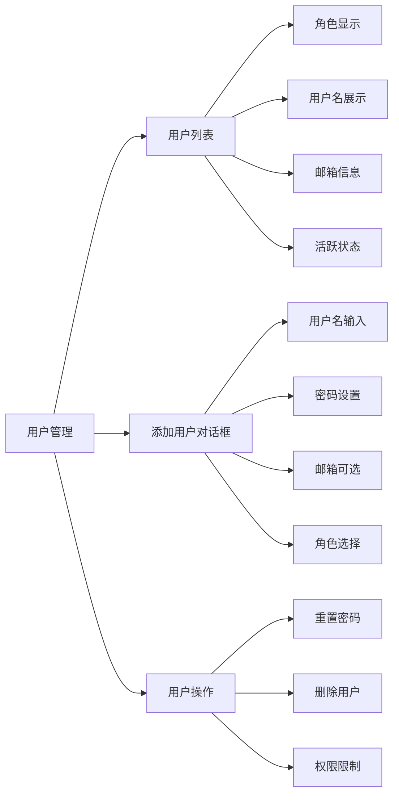

**图表来源**
- [UserPanel.vue](file://frontend/src/components/admin/UserPanel.vue#L1-L87)

#### 权限控制机制

用户管理面板实现了多层次的权限控制：

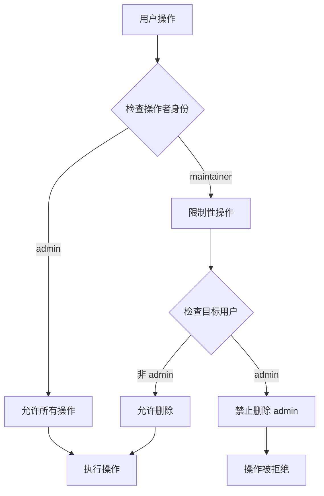

**图表来源**
- [UserPanel.vue](file://frontend/src/components/admin/UserPanel.vue#L147-L156)

**章节来源**
- [UserPanel.vue](file://frontend/src/components/admin/UserPanel.vue#L89-L157)

### 管理面板主界面 (Dashboard)

Dashboard 作为管理面板的主容器，负责协调各个子组件的工作：

#### 标签页导航系统

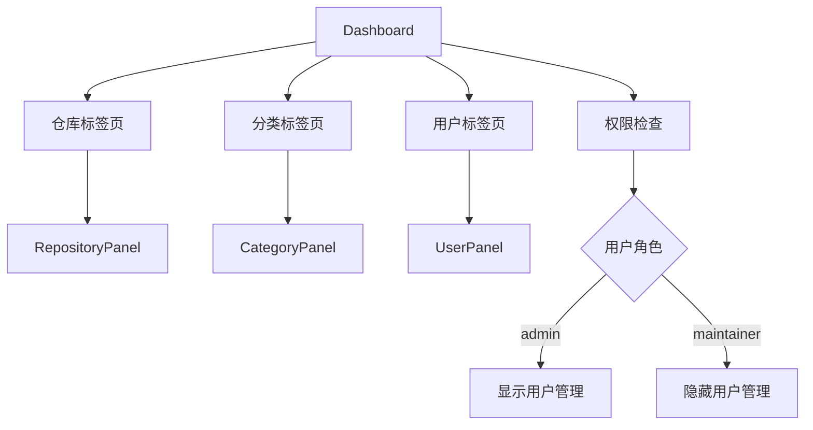

**图表来源**
- [Dashboard.vue](file://frontend/src/views/admin/Dashboard.vue#L30-L75)

#### 状态同步机制

Dashboard 实现了跨组件的状态同步：

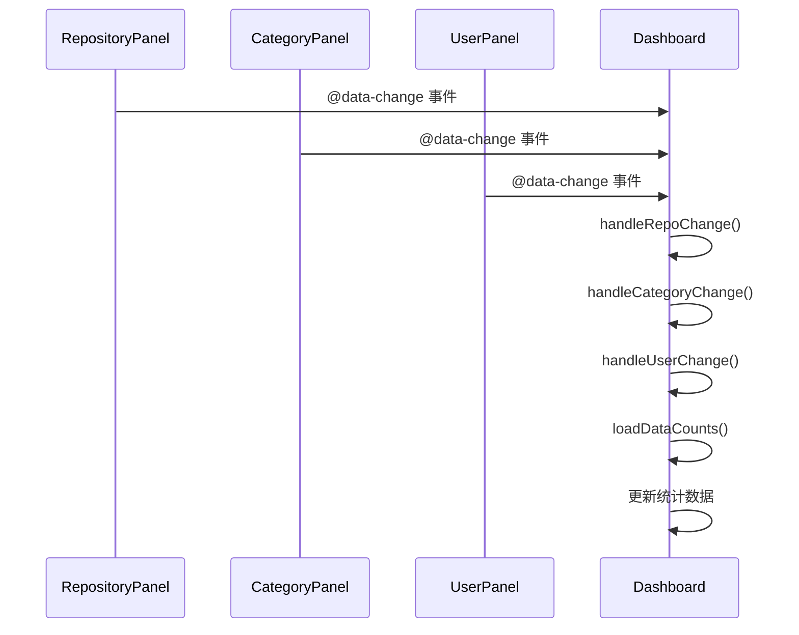

**图表来源**
- [Dashboard.vue](file://frontend/src/views/admin/Dashboard.vue#L141-L151)

**章节来源**
- [Dashboard.vue](file://frontend/src/views/admin/Dashboard.vue#L100-L159)

## 依赖关系分析

系统采用模块化的依赖管理，各组件之间的耦合度较低：

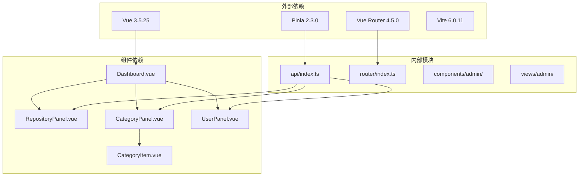

**图表来源**
- [package.json](file://frontend/package.json#L10-L18)
- [Dashboard.vue](file://frontend/src/views/admin/Dashboard.vue#L103-L106)
- [api/index.ts](file://frontend/src/api/index.ts#L1-L224)

### 组件间通信模式

系统采用了多种组件间通信模式：

#### 1. 父子组件通信

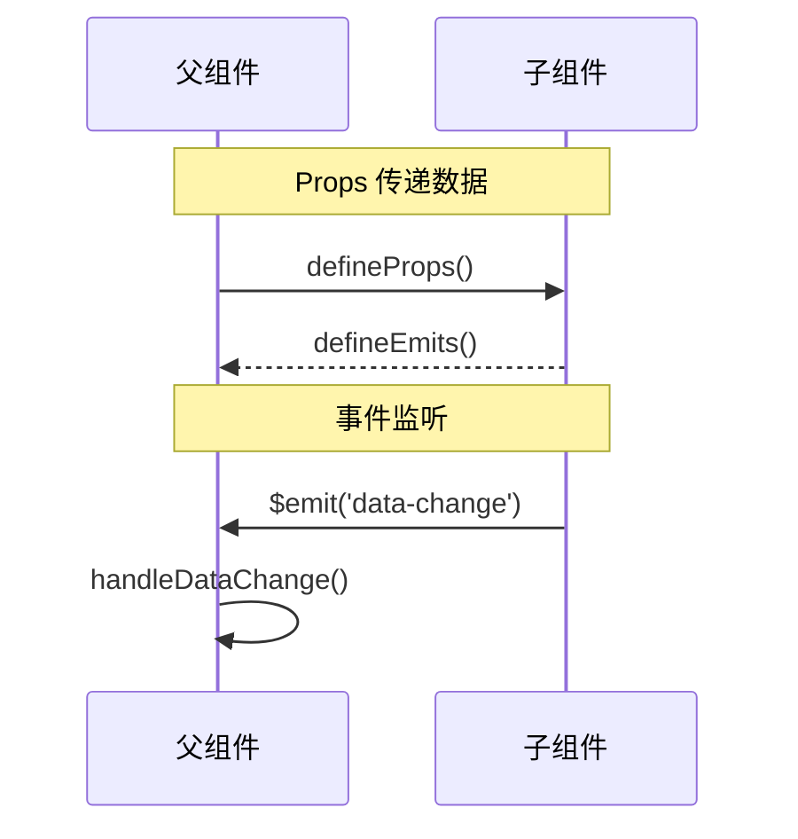

#### 2. API 客户端模式

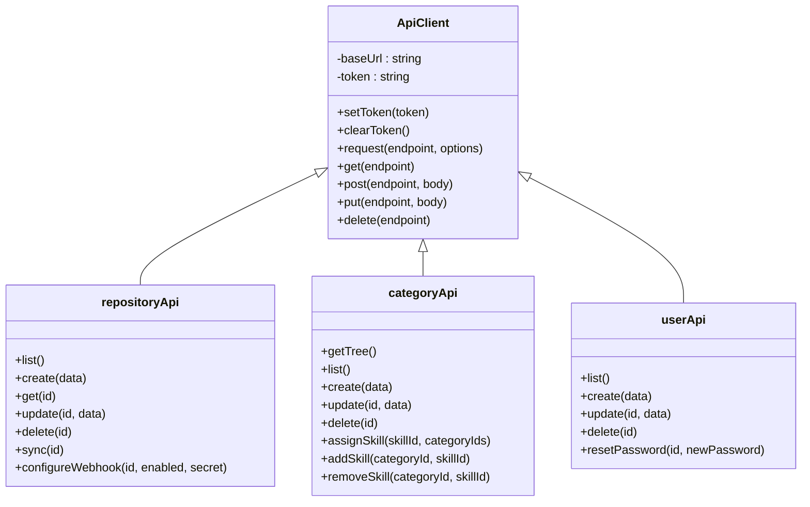

**图表来源**
- [api/index.ts](file://frontend/src/api/index.ts#L16-L84)
- [api/index.ts](file://frontend/src/api/index.ts#L104-L202)

**章节来源**
- [api/index.ts](file://frontend/src/api/index.ts#L16-L224)
- [router/index.ts](file://frontend/src/router/index.ts#L1-L63)

## 性能考虑

### 数据加载优化

系统实现了多项性能优化措施：

1. **并行数据加载**：Dashboard 使用 Promise.all 并行加载统计数据
2. **懒加载组件**：路由使用动态导入实现组件懒加载
3. **状态缓存**：本地存储用户认证信息，避免重复登录

### 响应式设计

系统采用移动端优先的设计理念：

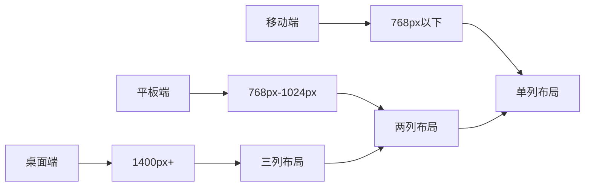

**图表来源**
- [Dashboard.vue](file://frontend/src/views/admin/Dashboard.vue#L409-L450)

### 错误处理策略

系统实现了多层次的错误处理机制：

1. **API 错误捕获**：统一的错误处理函数
2. **用户友好提示**：友好的错误消息显示
3. **状态恢复**：错误后的状态清理和恢复

**章节来源**
- [Dashboard.vue](file://frontend/src/views/admin/Dashboard.vue#L120-L139)
- [RepositoryPanel.vue](file://frontend/src/components/admin/RepositoryPanel.vue#L135-L161)
- [CategoryPanel.vue](file://frontend/src/components/admin/CategoryPanel.vue#L123-L140)
- [UserPanel.vue](file://frontend/src/components/admin/UserPanel.vue#L116-L133)

## 故障排除指南

### 常见问题诊断

#### 1. 认证相关问题

**症状**：无法访问管理面板或频繁登出
**解决方案**：
- 检查浏览器本地存储中的 token
- 验证用户角色权限
- 确认路由守卫配置

#### 2. 数据加载失败

**症状**：面板空白或显示加载错误
**解决方案**：
- 检查 API 服务器连接
- 验证网络请求状态码
- 查看浏览器开发者工具中的错误信息

#### 3. 表单提交失败

**症状**：添加/编辑操作无响应或报错
**解决方案**：
- 检查表单数据完整性
- 验证必填字段
- 查看后端 API 响应

### 开发调试技巧

1. **启用开发模式**：使用 npm run dev 启动开发服务器
2. **使用 Vue DevTools**：调试组件状态和 props
3. **查看网络请求**：监控 API 调用和响应
4. **检查控制台日志**：查看错误堆栈和警告信息

**章节来源**
- [router/index.ts](file://frontend/src/router/index.ts#L4-L24)
- [api/index.ts](file://frontend/src/api/index.ts#L36-L61)

## 结论

Skills Hub 管理面板组件展现了现代前端开发的最佳实践：

### 设计优势

1. **模块化架构**：清晰的组件分离和职责划分
2. **用户体验优秀**：CLI 风格界面符合管理员操作习惯
3. **响应式设计**：适配多种设备和屏幕尺寸
4. **权限控制完善**：基于角色的细粒度权限管理
5. **可扩展性强**：良好的架构设计便于功能扩展

### 技术亮点

- **TypeScript 类型安全**：提供编译时错误检测
- **组合式 API**：利用 Vue 3 的 Composition API 提升开发体验
- **模块化设计**：清晰的依赖关系和接口定义
- **状态管理**：合理的状态提升和事件通信机制

### 改进建议

1. **表单验证增强**：实现更完善的客户端表单验证
2. **批量操作支持**：添加批量选择和批量操作功能
3. **搜索过滤**：为列表组件添加搜索和过滤功能
4. **数据导出**：支持数据的导出和备份功能
5. **审计日志**：记录重要的管理操作日志

## 附录

### 开发规范

#### 代码风格

1. **命名规范**：使用 kebab-case 命名组件，camelCase 命名变量
2. **文件组织**：按功能模块组织文件，保持目录结构清晰
3. **注释规范**：为复杂逻辑添加必要的注释说明

#### 组件开发规范

1. **单一职责**：每个组件只负责一个功能领域
2. **Props 设计**：合理设计 props 接口，避免过度耦合
3. **事件命名**：使用语义化的事件名称，遵循小驼峰命名
4. **状态管理**：合理使用响应式数据和计算属性

#### API 调用规范

1. **错误处理**：每个 API 调用都要有相应的错误处理
2. **加载状态**：为异步操作提供加载状态反馈
3. **数据验证**：在发送请求前进行数据验证
4. **响应处理**：统一处理 API 响应和错误信息

### 部署建议

1. **环境配置**：根据部署环境调整 API 基础 URL
2. **静态资源**：确保静态资源正确打包和部署
3. **路由配置**：配置正确的路由历史模式
4. **安全考虑**：实施适当的 CORS 和安全头设置