# 组件架构

<cite>
**本文引用的文件**
- [App.vue](file://frontend/src/App.vue)
- [main.ts](file://frontend/src/main.ts)
- [router/index.ts](file://frontend/src/router/index.ts)
- [views/Home.vue](file://frontend/src/views/Home.vue)
- [views/Category.vue](file://frontend/src/views/Category.vue)
- [views/Skill.vue](file://frontend/src/views/Skill.vue)
- [views/Login.vue](file://frontend/src/views/Login.vue)
- [views/admin/Dashboard.vue](file://frontend/src/views/admin/Dashboard.vue)
- [components/admin/RepositoryPanel.vue](file://frontend/src/components/admin/RepositoryPanel.vue)
- [components/admin/CategoryPanel.vue](file://frontend/src/components/admin/CategoryPanel.vue)
- [components/admin/UserPanel.vue](file://frontend/src/components/admin/UserPanel.vue)
- [api/index.ts](file://frontend/src/api/index.ts)
- [package.json](file://frontend/package.json)
- [vite.config.ts](file://frontend/vite.config.ts)
</cite>

## 目录
1. [简介](#简介)
2. [项目结构](#项目结构)
3. [核心组件](#核心组件)
4. [架构总览](#架构总览)
5. [组件详解](#组件详解)
6. [依赖关系分析](#依赖关系分析)
7. [性能与优化](#性能与优化)
8. [故障排查指南](#故障排查指南)
9. [结论](#结论)
10. [附录](#附录)

## 简介
本文件系统性梳理该 Vue.js 前端项目的组件架构，围绕以下目标展开：
- 组件设计原则与职责划分：视图组件、业务组件、展示组件的边界与协作方式
- 单文件组件结构与生命周期使用
- props 设计与事件处理机制
- 组件通信模式：父子通信、兄弟通信、跨层级通信
- 组件复用策略、插槽与作用域插槽实践
- 性能优化、内存管理与渲染优化技巧
- 组件设计模式与开发规范建议

## 项目结构
前端采用基于路由的视图层组织，配合 Pinia 进行状态管理，通过自定义 API 客户端封装 HTTP 请求，并在 Vite 中配置代理与构建输出。

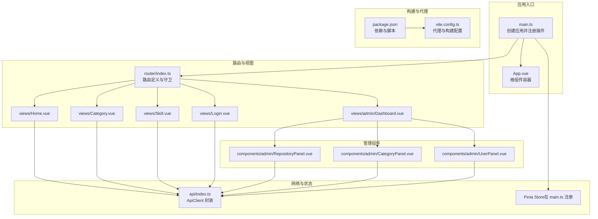

**图表来源**
- [main.ts](file://frontend/src/main.ts#L1-L12)
- [App.vue](file://frontend/src/App.vue#L1-L31)
- [router/index.ts](file://frontend/src/router/index.ts#L1-L63)
- [views/Home.vue](file://frontend/src/views/Home.vue#L1-L230)
- [views/Category.vue](file://frontend/src/views/Category.vue#L1-L226)
- [views/Skill.vue](file://frontend/src/views/Skill.vue#L1-L205)
- [views/Login.vue](file://frontend/src/views/Login.vue#L1-L185)
- [views/admin/Dashboard.vue](file://frontend/src/views/admin/Dashboard.vue#L1-L163)
- [components/admin/RepositoryPanel.vue](file://frontend/src/components/admin/RepositoryPanel.vue#L1-L362)
- [components/admin/CategoryPanel.vue](file://frontend/src/components/admin/CategoryPanel.vue#L1-L283)
- [components/admin/UserPanel.vue](file://frontend/src/components/admin/UserPanel.vue#L1-L331)
- [api/index.ts](file://frontend/src/api/index.ts#L1-L224)
- [package.json](file://frontend/package.json#L1-L20)
- [vite.config.ts](file://frontend/vite.config.ts#L1-L24)

**章节来源**
- [main.ts](file://frontend/src/main.ts#L1-L12)
- [router/index.ts](file://frontend/src/router/index.ts#L1-L63)
- [vite.config.ts](file://frontend/vite.config.ts#L1-L24)

## 核心组件
- 视图组件（View Components）
  - 负责页面级布局与路由切换，通常包含模板、逻辑与样式，承担“页面”职责
  - 代表：Home、Category、Skill、Login、Admin Dashboard
- 业务组件（Business Components）
  - 封装具体业务能力，如管理面板、列表、表单等，负责数据加载、交互与状态管理
  - 代表：RepositoryPanel、CategoryPanel、UserPanel
- 展示组件（Presentational Components）
  - 专注于 UI 呈现，尽量无状态或少状态，通过 props 接收数据，通过事件向上反馈
  - 代表：CategoryItem（在 CategoryPanel 中被复用）

**章节来源**
- [views/Home.vue](file://frontend/src/views/Home.vue#L1-L230)
- [views/Category.vue](file://frontend/src/views/Category.vue#L1-L226)
- [views/Skill.vue](file://frontend/src/views/Skill.vue#L1-L205)
- [views/Login.vue](file://frontend/src/views/Login.vue#L1-L185)
- [views/admin/Dashboard.vue](file://frontend/src/views/admin/Dashboard.vue#L1-L163)
- [components/admin/RepositoryPanel.vue](file://frontend/src/components/admin/RepositoryPanel.vue#L1-L362)
- [components/admin/CategoryPanel.vue](file://frontend/src/components/admin/CategoryPanel.vue#L1-L283)
- [components/admin/UserPanel.vue](file://frontend/src/components/admin/UserPanel.vue#L1-L331)

## 架构总览
应用采用“视图组件 + 业务组件 + 展示组件”的分层架构，结合路由守卫实现权限控制，通过统一的 API 客户端进行后端交互，使用 Pinia 进行全局状态管理。

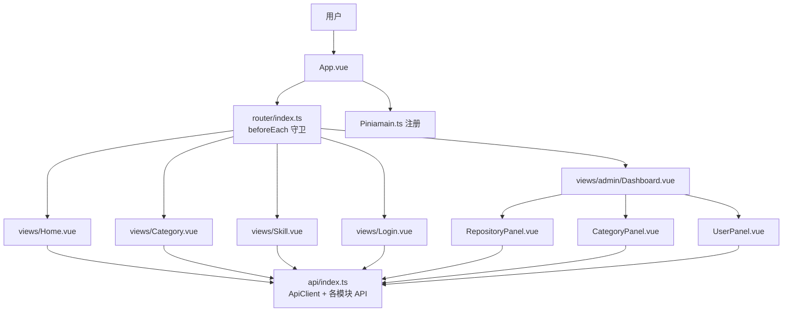

**图表来源**
- [App.vue](file://frontend/src/App.vue#L1-L31)
- [router/index.ts](file://frontend/src/router/index.ts#L1-L63)
- [views/Home.vue](file://frontend/src/views/Home.vue#L1-L230)
- [views/Category.vue](file://frontend/src/views/Category.vue#L1-L226)
- [views/Skill.vue](file://frontend/src/views/Skill.vue#L1-L205)
- [views/Login.vue](file://frontend/src/views/Login.vue#L1-L185)
- [views/admin/Dashboard.vue](file://frontend/src/views/admin/Dashboard.vue#L1-L163)
- [components/admin/RepositoryPanel.vue](file://frontend/src/components/admin/RepositoryPanel.vue#L1-L362)
- [components/admin/CategoryPanel.vue](file://frontend/src/components/admin/CategoryPanel.vue#L1-L283)
- [components/admin/UserPanel.vue](file://frontend/src/components/admin/UserPanel.vue#L1-L331)
- [api/index.ts](file://frontend/src/api/index.ts#L1-L224)
- [main.ts](file://frontend/src/main.ts#L1-L12)

## 组件详解

### 视图组件：Home（首页）
- 职责：展示欢迎信息、快速导航与分类预览；在挂载时拉取分类列表
- 生命周期：onMounted 中发起请求
- 数据流：本地响应式数据 categories，错误捕获并记录
- 样式：scoped 样式，终端风格主题

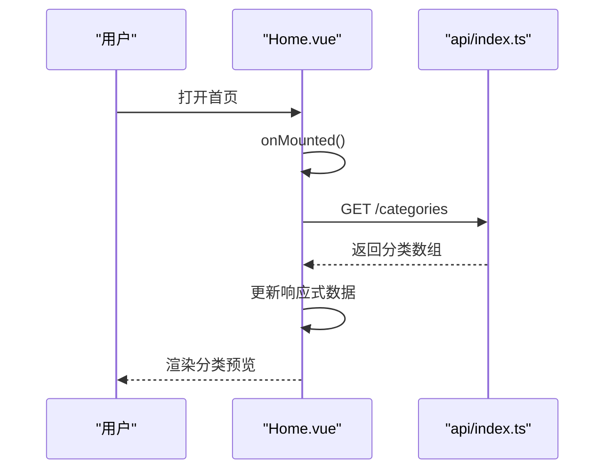

**图表来源**
- [views/Home.vue](file://frontend/src/views/Home.vue#L88-L102)
- [api/index.ts](file://frontend/src/api/index.ts#L129-L155)

**章节来源**
- [views/Home.vue](file://frontend/src/views/Home.vue#L1-L230)

### 视图组件：Category（分类浏览）
- 职责：展示分类树、子分类与技能列表；支持按 slug 高亮选中项
- 生命周期：onMounted 加载树形数据，根据路由参数定位初始选中项
- 交互：展开/折叠、点击进入子分类、跳转到技能详情
- 数据流：categories、skills、selectedCategory、expandedCategories（Set）

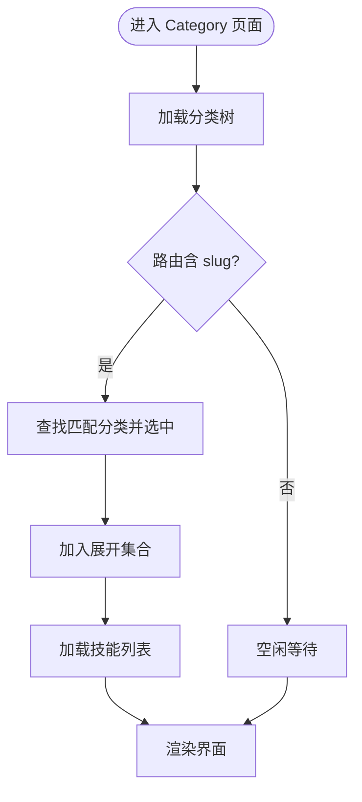

**图表来源**
- [views/Category.vue](file://frontend/src/views/Category.vue#L60-L140)

**章节来源**
- [views/Category.vue](file://frontend/src/views/Category.vue#L1-L226)

### 视图组件：Skill（技能详情）
- 职责：展示技能元数据、描述、关联仓库与分类；提供返回与外部链接
- 生命周期：onMounted 读取路由参数并请求详情
- 数据流：skill、loading、错误处理

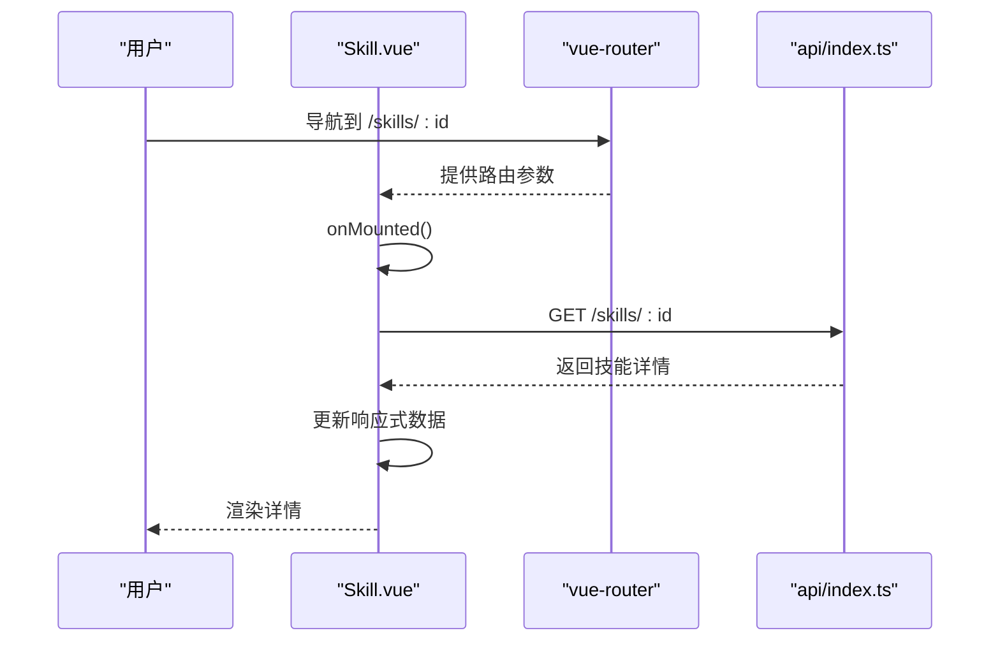

**图表来源**
- [views/Skill.vue](file://frontend/src/views/Skill.vue#L82-L100)
- [router/index.ts](file://frontend/src/router/index.ts#L38-L41)
- [api/index.ts](file://frontend/src/api/index.ts#L157-L183)

**章节来源**
- [views/Skill.vue](file://frontend/src/views/Skill.vue#L1-L205)

### 视图组件：Login（登录）
- 职责：表单校验、调用认证接口、保存 token 与用户信息、跳转回原页面
- 生命周期：setup 中声明表单状态与提交逻辑
- 事件：表单提交、键盘事件（回车）

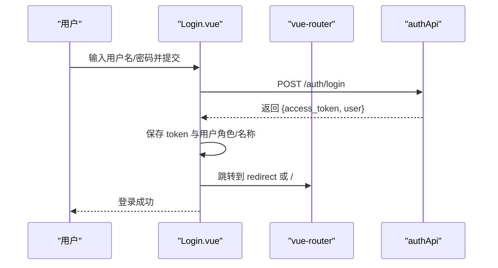

**图表来源**
- [views/Login.vue](file://frontend/src/views/Login.vue#L46-L85)
- [api/index.ts](file://frontend/src/api/index.ts#L89-L102)

**章节来源**
- [views/Login.vue](file://frontend/src/views/Login.vue#L1-L185)

### 视图组件：Admin Dashboard（管理面板）
- 职责：标签页导航（仓库、分类、用户），根据权限显示用户管理
- 交互：切换标签页、退出登录（清理本地存储并跳转登录）

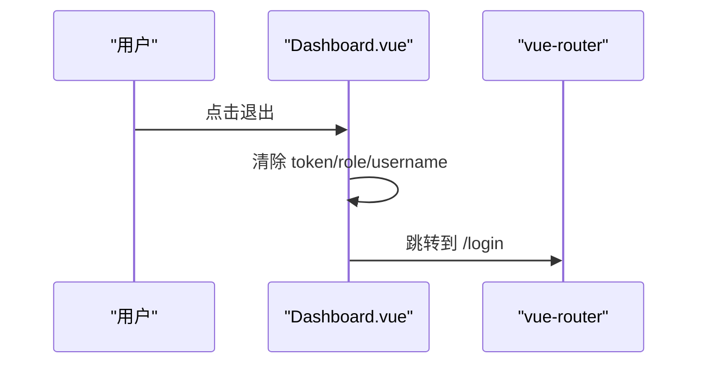

**图表来源**
- [views/admin/Dashboard.vue](file://frontend/src/views/admin/Dashboard.vue#L58-L76)

**章节来源**
- [views/admin/Dashboard.vue](file://frontend/src/views/admin/Dashboard.vue#L1-L163)

### 业务组件：RepositoryPanel（仓库管理）
- 职责：展示仓库列表、添加仓库对话框、触发同步、删除仓库
- 交互：表单收集、提交、加载态、确认删除
- 事件：通过方法回调实现 CRUD，未使用自定义事件

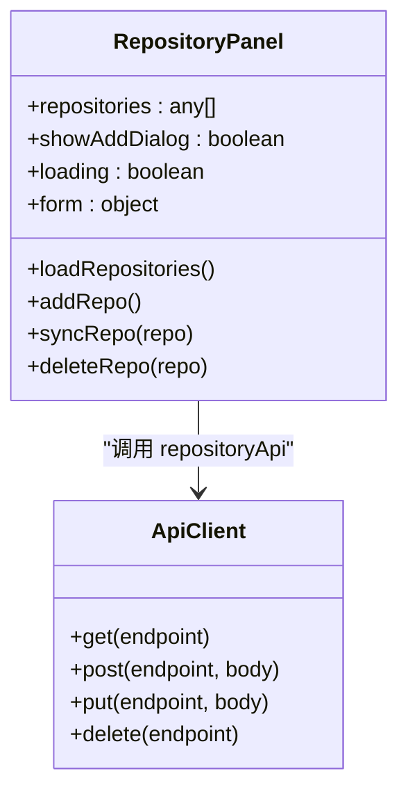

**图表来源**
- [components/admin/RepositoryPanel.vue](file://frontend/src/components/admin/RepositoryPanel.vue#L106-L191)
- [api/index.ts](file://frontend/src/api/index.ts#L104-L127)

**章节来源**
- [components/admin/RepositoryPanel.vue](file://frontend/src/components/admin/RepositoryPanel.vue#L1-L362)

### 业务组件：CategoryPanel（分类管理）
- 职责：展示分类树、添加分类对话框、扁平化分类用于父级选择
- 交互：树形渲染、编辑/删除（占位）、对话框表单
- 事件：向子组件传递编辑/删除事件（CategoryItem）

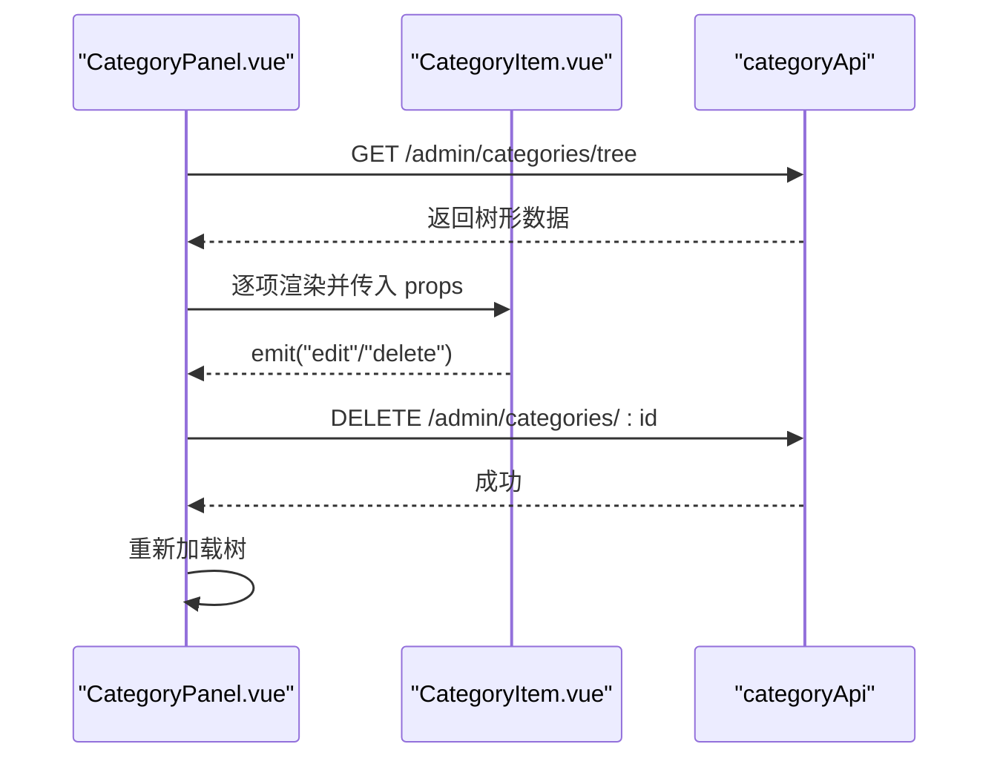

**图表来源**
- [components/admin/CategoryPanel.vue](file://frontend/src/components/admin/CategoryPanel.vue#L78-L157)
- [api/index.ts](file://frontend/src/api/index.ts#L129-L155)

**章节来源**
- [components/admin/CategoryPanel.vue](file://frontend/src/components/admin/CategoryPanel.vue#L1-L283)

### 业务组件：UserPanel（用户管理）
- 职责：展示用户列表、添加用户对话框、重置密码、删除用户
- 交互：表单收集、确认删除、提示输入新密码

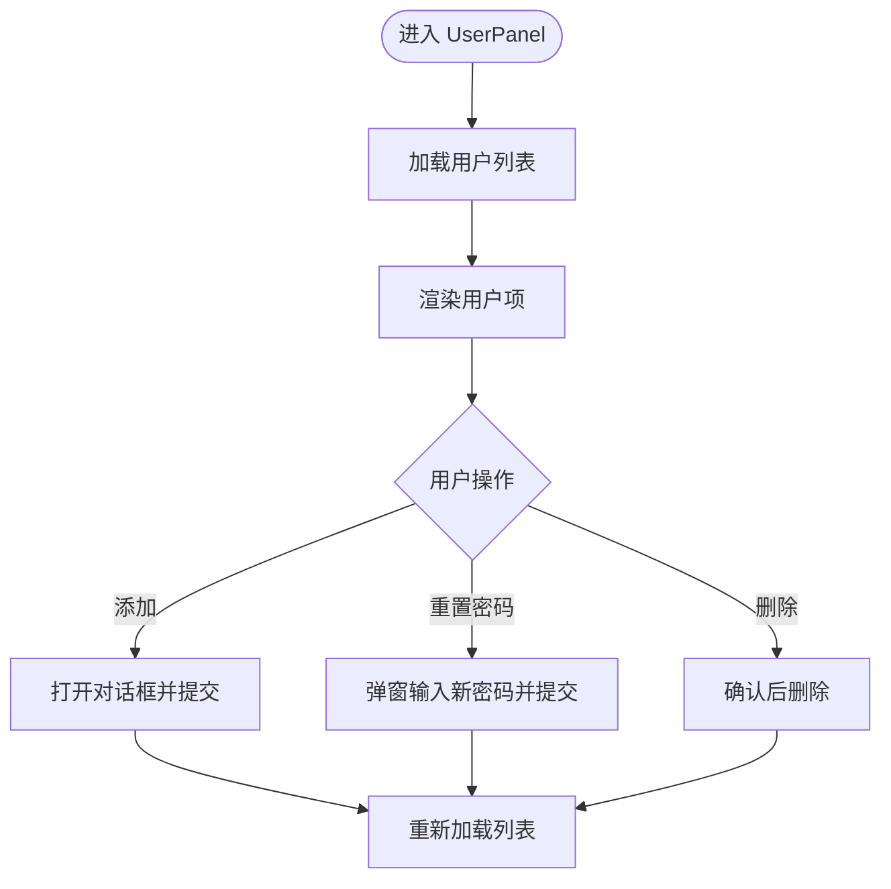

**图表来源**
- [components/admin/UserPanel.vue](file://frontend/src/components/admin/UserPanel.vue#L89-L157)

**章节来源**
- [components/admin/UserPanel.vue](file://frontend/src/components/admin/UserPanel.vue#L1-L331)

### API 客户端与路由守卫
- API 客户端
  - 统一基地址、自动注入 Authorization 头、错误解析与抛出
  - 模块化导出：authApi、repositoryApi、categoryApi、skillApi、userApi、syncApi、webhookApi
- 路由守卫
  - beforeEach 校验 requiresAuth 与 requiresAdmin
  - 读取 localStorage 中 token 与 userRole，决定放行或重定向

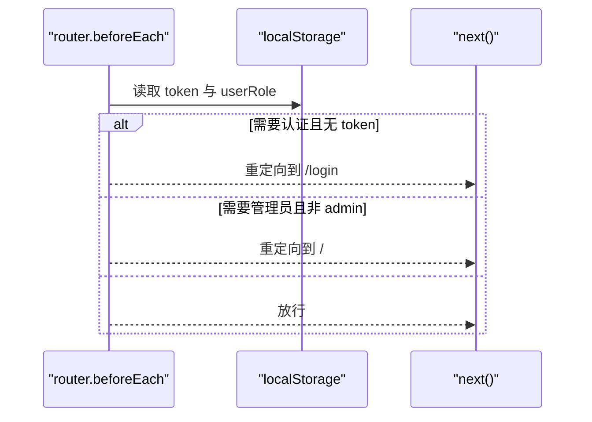

**图表来源**
- [router/index.ts](file://frontend/src/router/index.ts#L4-L24)
- [api/index.ts](file://frontend/src/api/index.ts#L16-L84)

**章节来源**
- [api/index.ts](file://frontend/src/api/index.ts#L1-L224)
- [router/index.ts](file://frontend/src/router/index.ts#L1-L63)

## 依赖关系分析
- 应用启动
  - main.ts 创建应用，注册 Pinia 与路由，挂载根组件
- 组件依赖
  - 视图组件依赖 api/index.ts 发起请求
  - 管理面板组件依赖对应 API 模块
  - Admin Dashboard 组合多个业务组件
- 外部依赖
  - Vue 3、Vue Router、Pinia、Vite 插件

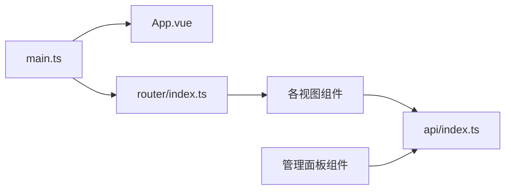

**图表来源**
- [main.ts](file://frontend/src/main.ts#L1-L12)
- [router/index.ts](file://frontend/src/router/index.ts#L1-L63)
- [api/index.ts](file://frontend/src/api/index.ts#L1-L224)

**章节来源**
- [package.json](file://frontend/package.json#L1-L20)
- [vite.config.ts](file://frontend/vite.config.ts#L1-L24)

## 性能与优化
- 渲染优化
  - 使用 v-show 控制标签页切换，避免重复挂载销毁
  - 列表渲染使用 v-for 并提供稳定 key
  - 在 Category 中对预览列表做切片，减少首屏渲染压力
- 网络与缓存
  - 统一在 ApiClient 中处理错误与鉴权头，避免重复逻辑
  - 登录成功后设置 token，后续请求自动携带
- 内存管理
  - 组件卸载时避免遗留定时器或订阅（当前组件未见长连接）
  - 表单提交后及时重置状态，避免长期持有大对象
- 开发体验
  - Vite 代理到后端 8000 端口，便于联调
  - 构建输出目录 dist，保持空目录清理

**章节来源**
- [views/admin/Dashboard.vue](file://frontend/src/views/admin/Dashboard.vue#L42-L54)
- [views/Category.vue](file://frontend/src/views/Category.vue#L72-L84)
- [api/index.ts](file://frontend/src/api/index.ts#L16-L84)
- [vite.config.ts](file://frontend/vite.config.ts#L6-L22)

## 故障排查指南
- 登录失败
  - 检查 authApi 调用与返回体字段是否一致
  - 确认 localStorage 中 token 与用户信息是否正确写入
- 权限拒绝
  - 核对路由守卫逻辑与 localStorage 中 userRole
  - 确保登录后跳转路径正确
- 数据未更新
  - 管理面板提交后调用重新加载函数
  - 确认 API 返回状态与错误消息
- 路由跳转异常
  - 检查路由定义与懒加载组件导入路径

**章节来源**
- [views/Login.vue](file://frontend/src/views/Login.vue#L59-L84)
- [router/index.ts](file://frontend/src/router/index.ts#L4-L24)
- [components/admin/RepositoryPanel.vue](file://frontend/src/components/admin/RepositoryPanel.vue#L123-L190)
- [components/admin/CategoryPanel.vue](file://frontend/src/components/admin/CategoryPanel.vue#L99-L157)
- [components/admin/UserPanel.vue](file://frontend/src/components/admin/UserPanel.vue#L116-L156)

## 结论
该项目采用清晰的视图/业务/展示分层，结合路由守卫与统一 API 客户端，实现了良好的可维护性与扩展性。建议在后续迭代中引入 Pinia Store 管理共享状态，完善事件命名与类型约束，进一步提升组件复用与测试友好度。

## 附录

### 组件通信模式与最佳实践
- 父子通信
  - 父传子：通过 props 传递只读数据
  - 子传父：通过 emits 或回调函数（当前 Panel 组件多采用方法回调）
- 兄弟/跨层级通信
  - 当前项目未出现跨层级通信场景，建议后续引入 Pinia
- 插槽与作用域插槽
  - 当前未使用插槽，可在通用卡片/列表项中引入，以增强复用性

### 开发规范建议
- 命名规范
  - 组件文件名采用 PascalCase，如 CategoryPanel.vue
  - 方法命名采用动词短语，如 loadRepositories、addRepo
- 类型与校验
  - 为 props 明确类型与默认值
  - 对外暴露的 API 返回体增加类型定义
- 错误处理
  - 统一在 ApiClient 中处理非 2xx 响应
  - 在视图组件中捕获并提示用户