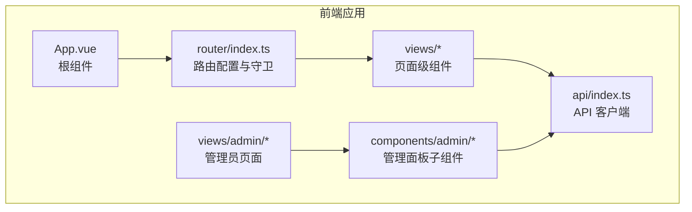
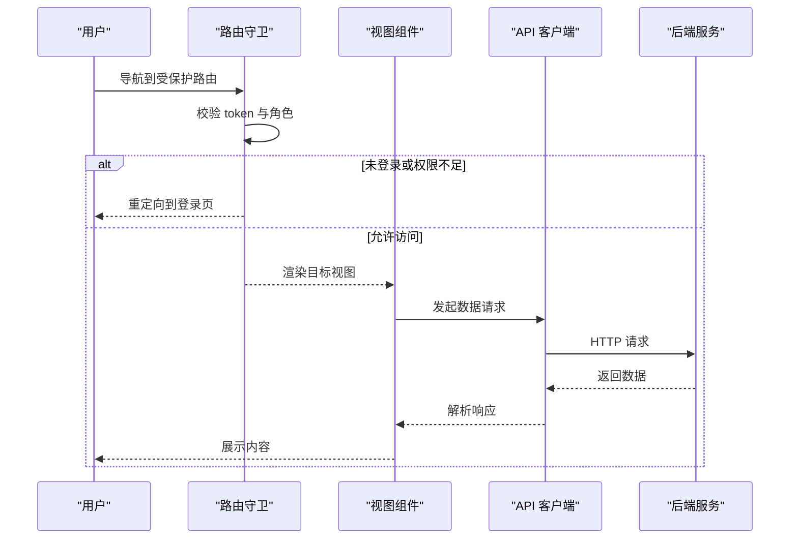
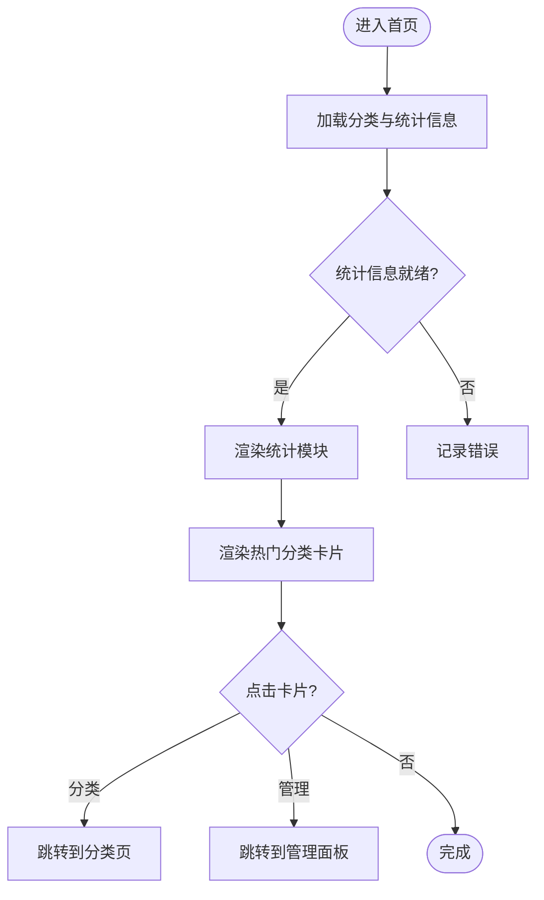
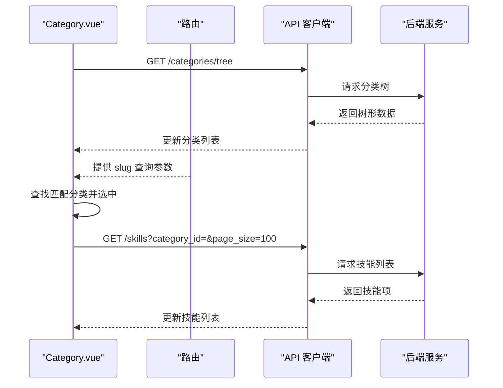
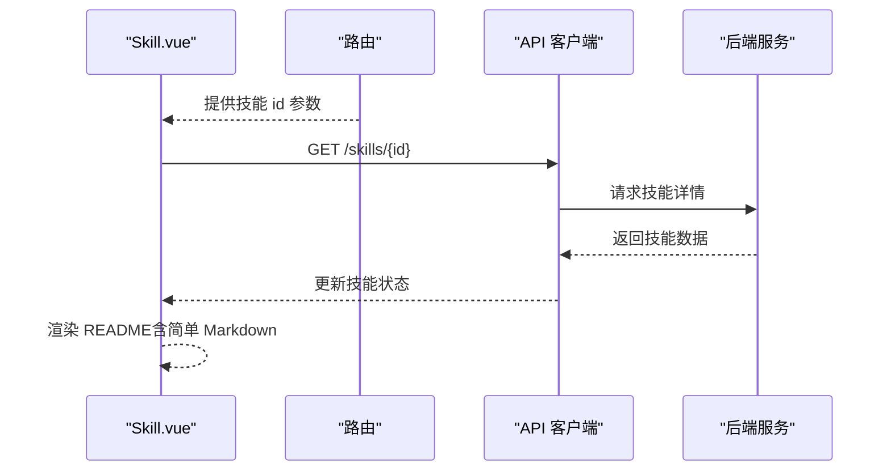
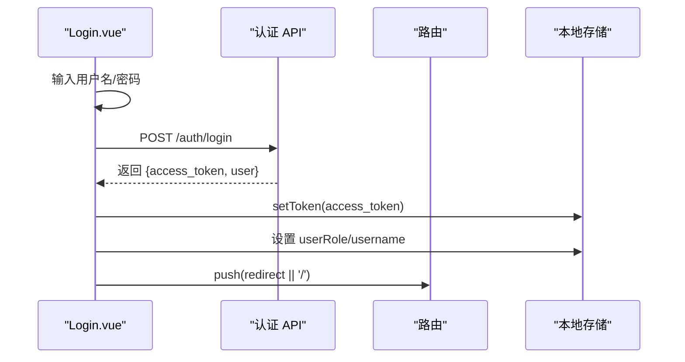
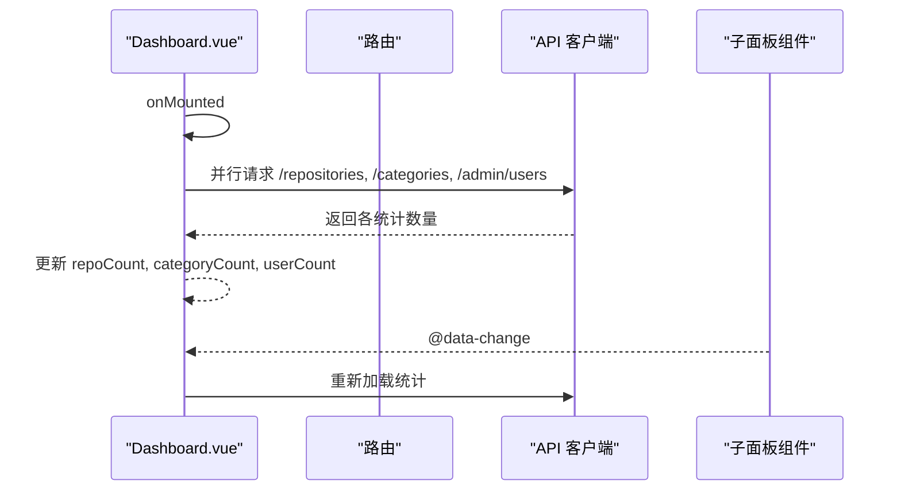
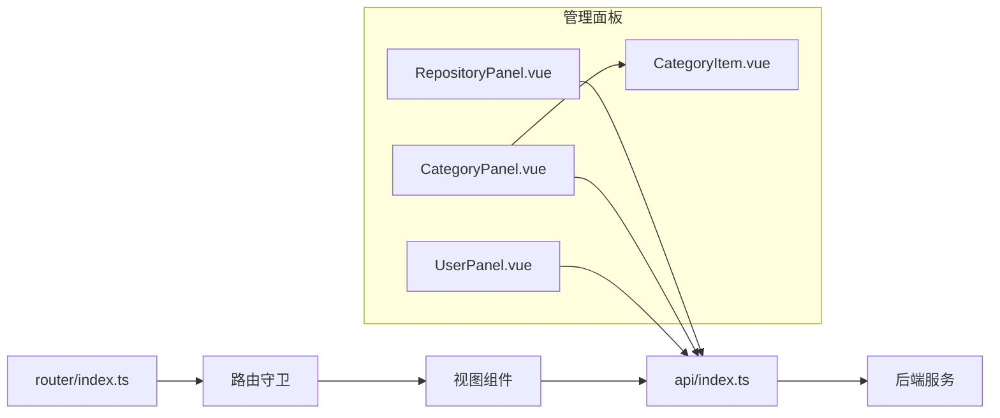

# 视图组件

<cite>
**本文档引用的文件**
- [Home.vue](file://frontend/src/views/Home.vue)
- [Category.vue](file://frontend/src/views/Category.vue)
- [Skill.vue](file://frontend/src/views/Skill.vue)
- [Login.vue](file://frontend/src/views/Login.vue)
- [Dashboard.vue](file://frontend/src/views/admin/Dashboard.vue)
- [index.ts](file://frontend/src/router/index.ts)
- [index.ts](file://frontend/src/api/index.ts)
- [App.vue](file://frontend/src/App.vue)
- [RepositoryPanel.vue](file://frontend/src/components/admin/RepositoryPanel.vue)
- [CategoryPanel.vue](file://frontend/src/components/admin/CategoryPanel.vue)
- [UserPanel.vue](file://frontend/src/components/admin/UserPanel.vue)
- [CategoryItem.vue](file://frontend/src/components/admin/CategoryItem.vue)
</cite>

## 目录
1. [简介](#简介)
2. [项目结构](#项目结构)
3. [核心组件](#核心组件)
4. [架构总览](#架构总览)
5. [详细组件分析](#详细组件分析)
6. [依赖关系分析](#依赖关系分析)
7. [性能考虑](#性能考虑)
8. [故障排除指南](#故障排除指南)
9. [结论](#结论)
10. [附录](#附录)

## 简介
本文件面向 Vue.js 视图组件，系统性梳理页面级组件的设计模式与实现细节，覆盖首页、分类页、技能详情页、登录页以及管理员仪表板等核心视图。文档重点阐述：
- 数据获取与状态管理
- 用户交互逻辑与路由集成
- 参数传递与页面导航机制
- 性能优化、懒加载策略与用户体验设计
- 具体实现示例与最佳实践

## 项目结构
前端采用基于路由的页面级组件组织方式，视图组件通过路由懒加载按需加载，配合全局样式与 API 客户端统一处理网络请求与鉴权。

图表来源
- [App.vue](file://frontend/src/App.vue#L1-L107)
- [index.ts](file://frontend/src/router/index.ts#L1-L63)
- [index.ts](file://frontend/src/api/index.ts#L1-L224)

章节来源
- [App.vue](file://frontend/src/App.vue#L1-L107)
- [index.ts](file://frontend/src/router/index.ts#L1-L63)

## 核心组件
- 首页 Home.vue：展示平台概览、统计信息与热门分类入口，支持跳转至分类页与管理面板。
- 分类页 Category.vue：树形分类浏览与技能列表展示，支持按 slug 选中分类并加载技能。
- 技能详情页 Skill.vue：展示技能元数据、分类标签、README 内容与操作区，支持返回与外部链接。
- 登录页 Login.vue：表单校验、错误提示、登录流程与本地存储令牌。
- 管理员仪表板 Dashboard.vue：多标签页管理面板，聚合仓库、分类与用户管理，支持登出与状态指示。

章节来源
- [Home.vue](file://frontend/src/views/Home.vue#L1-L408)
- [Category.vue](file://frontend/src/views/Category.vue#L1-L593)
- [Skill.vue](file://frontend/src/views/Skill.vue#L1-L644)
- [Login.vue](file://frontend/src/views/Login.vue#L1-L481)
- [Dashboard.vue](file://frontend/src/views/admin/Dashboard.vue#L1-L246)

## 架构总览
页面级组件通过路由懒加载与路由守卫实现权限控制；API 客户端统一封装请求头与错误处理；管理面板组件通过事件冒泡驱动父级刷新统计。

图表来源
- [index.ts](file://frontend/src/router/index.ts#L4-L24)
- [index.ts](file://frontend/src/api/index.ts#L36-L61)

## 详细组件分析

### 首页组件 Home.vue
- 设计要点
  - 使用模板插槽与条件渲染展示统计信息与热门分类卡片。
  - 通过路由跳转实现页面导航，避免硬编码路径。
  - 在挂载阶段并行加载分类与统计信息，提升首屏体验。
- 数据流
  - onMounted 生命周期内调用 API 获取分类树与统计信息。
  - 将结果写入响应式状态，驱动模板渲染。
- 交互与导航
  - 点击“浏览分类”与“管理面板”卡片触发路由跳转。
- 性能与体验
  - 使用 Promise.all 并行请求减少等待时间。
  - 响应式布局适配移动端网格显示。

图表来源
- [Home.vue](file://frontend/src/views/Home.vue#L91-L123)

章节来源
- [Home.vue](file://frontend/src/views/Home.vue#L1-L408)

### 分类页组件 Category.vue
- 设计要点
  - 左侧树形分类导航，右侧技能网格展示。
  - 支持展开/折叠子节点、选中分类并加载技能列表。
  - 通过路由查询参数 slug 实现初始定位。
- 数据流
  - onMounted 生命周期加载分类树，解析路由参数 slug 自动选中对应分类。
  - 切换分类时异步加载技能列表。
- 交互与导航
  - 点击技能卡片跳转到技能详情页。
  - 返回按钮回到首页。
- 性能与体验
  - 使用 Set 维护展开状态，避免重复渲染。
  - 响应式布局在小屏设备上调整布局顺序。

图表来源
- [Category.vue](file://frontend/src/views/Category.vue#L120-L215)
- [index.ts](file://frontend/src/api/index.ts#L158-L183)

章节来源
- [Category.vue](file://frontend/src/views/Category.vue#L1-L593)

### 技能详情页组件 Skill.vue
- 设计要点
  - 左侧主内容展示标题、描述、元数据与 README 内容。
  - 右侧侧边栏提供操作按钮、技术栈与相关技能占位。
  - 支持返回上一页与跳转首页。
- 数据流
  - onMounted 生命周期根据路由参数 id 获取技能详情。
  - 使用简单 Markdown 渲染函数处理 README 内容。
- 交互与导航
  - 点击分类标签可跳转到对应分类页。
  - 支持外部 README 链接打开新窗口。
- 性能与体验
  - 骨架屏与加载动画提升加载体验。
  - 响应式布局在小屏设备上调整主侧边栏顺序。

图表来源
- [Skill.vue](file://frontend/src/views/Skill.vue#L164-L204)
- [index.ts](file://frontend/src/api/index.ts#L177-L179)

章节来源
- [Skill.vue](file://frontend/src/views/Skill.vue#L1-L644)

### 登录页组件 Login.vue
- 设计要点
  - 表单输入绑定用户名与密码，提交时进行基础校验。
  - 调用认证 API 完成登录，保存 token 与用户角色到本地存储。
  - 支持默认凭据提示与访客继续浏览。
- 数据流
  - handleLogin 中调用 authApi.login，成功后设置 token 并读取 redirect 参数跳转。
- 交互与导航
  - 登录成功后根据 redirect 或首页跳转。
  - 错误时显示错误横幅。
- 性能与体验
  - 禁用态按钮与加载动画改善交互反馈。
  - 响应式布局与装饰动画增强视觉体验。

图表来源
- [Login.vue](file://frontend/src/views/Login.vue#L95-L134)
- [index.ts](file://frontend/src/api/index.ts#L89-L102)

章节来源
- [Login.vue](file://frontend/src/views/Login.vue#L1-L481)

### 管理员仪表板组件 Dashboard.vue
- 设计要点
  - 顶部导航包含用户信息与登出按钮。
  - 标签页切换仓库、分类与用户面板（仅管理员可见）。
  - 底部状态栏显示系统在线与同步状态。
- 数据流
  - onMounted 生命周期并行加载仓库、分类与用户数量。
  - 各面板组件通过事件冒泡触发父级重新加载统计。
- 交互与导航
  - 点击标签页切换内容区域。
  - 登出清除本地存储并跳转登录页。
- 性能与体验
  - Promise.all 并行统计，减少等待时间。
  - 响应式布局与主题化样式提升可读性。

图表来源
- [Dashboard.vue](file://frontend/src/views/admin/Dashboard.vue#L100-L159)
- [index.ts](file://frontend/src/api/index.ts#L105-L127)
- [index.ts](file://frontend/src/api/index.ts#L130-L155)
- [index.ts](file://frontend/src/api/index.ts#L186-L202)

章节来源
- [Dashboard.vue](file://frontend/src/views/admin/Dashboard.vue#L1-L246)

### 管理面板子组件
- 仓库面板 RepositoryPanel.vue
  - 列表展示仓库类型、所有者、分支与技能数。
  - 支持新增、同步、编辑与删除仓库。
  - 新增对话框收集仓库配置并提交。
- 分类面板 CategoryPanel.vue
  - 树形展示分类，支持新增、编辑与删除。
  - 提供扁平化分类列表用于父级选择。
- 用户面板 UserPanel.vue
  - 列表展示用户角色、用户名、邮箱与激活状态。
  - 支持新增用户、重置密码与删除用户（不可删除自身）。
- 分类项组件 CategoryItem.vue
  - 递归渲染子分类，支持展开/折叠与操作按钮。

章节来源
- [RepositoryPanel.vue](file://frontend/src/components/admin/RepositoryPanel.vue#L1-L362)
- [CategoryPanel.vue](file://frontend/src/components/admin/CategoryPanel.vue#L1-L283)
- [UserPanel.vue](file://frontend/src/components/admin/UserPanel.vue#L1-L331)
- [CategoryItem.vue](file://frontend/src/components/admin/CategoryItem.vue#L1-L117)

## 依赖关系分析
- 路由与守卫
  - 路由定义了页面级组件与权限元信息。
  - 路由守卫检查 token 与角色，未满足条件时重定向到登录页或首页。
- API 客户端
  - 统一处理 Authorization 头、错误响应与不同资源的 CRUD 接口。
  - 提供认证、仓库、分类、技能、用户与同步相关的 API。
- 视图组件
  - 通过 api.authApi 与 api 实例分别处理认证与业务数据。
  - 管理面板组件通过事件冒泡与父组件通信，实现数据联动更新。

图表来源
- [index.ts](file://frontend/src/router/index.ts#L26-L53)
- [index.ts](file://frontend/src/api/index.ts#L89-L224)

章节来源
- [index.ts](file://frontend/src/router/index.ts#L1-L63)
- [index.ts](file://frontend/src/api/index.ts#L1-L224)

## 性能考虑
- 路由懒加载
  - 所有页面级组件均采用动态导入，按需加载，降低首屏体积。
- 并行请求
  - 首页与仪表板使用 Promise.all 并行加载多个数据源，缩短等待时间。
- 响应式设计
  - 使用 CSS Grid 与媒体查询适配不同屏幕尺寸，减少额外布局计算。
- 本地存储
  - 登录成功后缓存 token 与用户信息，避免重复登录与跨页面状态丢失。
- 交互反馈
  - 加载动画、骨架屏与禁用态按钮提升感知性能与可用性。

章节来源
- [Home.vue](file://frontend/src/views/Home.vue#L109-L112)
- [Dashboard.vue](file://frontend/src/views/admin/Dashboard.vue#L127-L131)
- [Login.vue](file://frontend/src/views/Login.vue#L108-L133)

## 故障排除指南
- 登录失败
  - 检查用户名与密码是否为空，确认后端认证接口返回的错误消息。
  - 确认本地存储中 token 是否正确设置。
- 数据加载异常
  - 首页与分类页在加载失败时会记录错误日志，检查网络请求与后端接口状态。
  - 技能详情页若未找到技能，提供返回首页的按钮。
- 权限问题
  - 管理面板路由守卫要求登录且角色为 admin，未满足条件将被重定向。
- 管理面板数据未刷新
  - 确保子面板组件在操作完成后触发 data-change 事件，父组件监听并重新加载统计。

章节来源
- [Login.vue](file://frontend/src/views/Login.vue#L108-L133)
- [Home.vue](file://frontend/src/views/Home.vue#L119-L122)
- [Category.vue](file://frontend/src/views/Category.vue#L155-L162)
- [Skill.vue](file://frontend/src/views/Skill.vue#L173-L181)
- [index.ts](file://frontend/src/router/index.ts#L13-L21)
- [Dashboard.vue](file://frontend/src/views/admin/Dashboard.vue#L141-L151)

## 结论
本项目以页面级组件为核心，结合路由懒加载、统一 API 客户端与路由守卫，构建了清晰的前端架构。视图组件在数据获取、状态管理与用户交互方面实现了良好的解耦与复用，同时通过并行请求与响应式设计提升了性能与体验。建议后续可引入更完善的错误边界、缓存策略与测试覆盖，进一步提升稳定性与可维护性。

## 附录
- 最佳实践清单
  - 使用路由懒加载与 keep-alive 缓存高频访问页面。
  - 在组件内集中处理错误与加载状态，避免分散逻辑。
  - 通过事件冒泡与 props 下发实现父子组件通信，保持单向数据流。
  - 对外链与富文本内容进行安全处理与格式化。
  - 为关键交互增加无障碍属性与键盘导航支持。